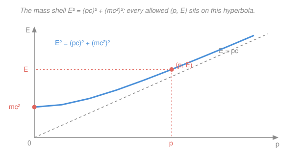

# Nuclear & Particle Physics · Lesson 3.1: Four-vectors & invariant mass

> ⏱ ~15 min · Module 3: Scattering & relativistic kinematics · Builds on: [2.6 Fission & fusion energetics](02-06-fission-fusion.md), [`relativity` syllabus](../../relativity/syllabus.md) · Unlocks: [3.2 Collision & decay kinematics](03-02-collision-decay-kinematics.md)

## Why this matters

Every particle physics measurement is a bookkeeping problem: energy and momentum go in, a spray of debris comes out, and you must decide *what happened*. The tool that makes this tractable is the **four-momentum** — a single object bundling a particle's energy and momentum so that, no matter which lab, beam, or moving frame you compute in, one number stays fixed: its **invariant mass**. That invariance is not a convenience; it is the entire logic of particle discovery. When physicists "found the Higgs," they added up the four-momenta of its decay products, computed one invariant, and watched a bump appear at 125 GeV. This lesson builds that machine. Everything in Module 3 — decay energies, collision thresholds, why colliders beat fixed targets ([3.2](03-02-collision-decay-kinematics.md)) — is this one idea, reused.

## The idea

You already trust that some quantities don't care who's looking. A rod's *length* is the same whether you walk past it or stand still — even though the coordinates of its two ends change. Special relativity says energy $E$ and momentum $\mathbf{p}$ are like those coordinates: they *mix into each other* when you switch to a moving frame (a fast-moving electron has more energy and more momentum than a slow one). But there is a "length" built from them that every observer agrees on — and that length is the particle's **mass**.

So picture energy and momentum as the components of one arrow in spacetime. Boosting to a new frame *rotates* that arrow — the components shuffle — but its length is pinned. The single most useful move in all of relativistic kinematics is: **write the four-momenta, build a quantity that's the same in every frame, then evaluate it in whichever frame makes the arithmetic trivial.** The rest-frame is usually easiest, because there the particle's momentum is zero and its energy is just $mc^2$.

## The formal version

**Natural units.** From here we set $\hbar = c = 1$. Then energy, momentum, and mass all carry the same unit — MeV or GeV — and relations shed their $c$'s. (To restore SI for a number, reinsert $c$ by dimensions: $mc^2$ for a mass-as-energy, $pc$ for a momentum-as-energy.) *In words: we measure everything in energy units; a proton "is" 938 MeV.*

**Four-momentum.** For a particle with energy $E$ and three-momentum $\mathbf{p}$, define

$$p^\mu = (E,\ \mathbf{p}) = (E,\ p_x,\ p_y,\ p_z).$$

*In words: stack energy and the three momentum components into one four-component object.* Under a Lorentz boost the components mix (that's [`relativity`](../../relativity/syllabus.md)'s Lorentz transformation), exactly as spatial rotations mix $x$ and $y$.

**The invariant "length" (metric signature $+\,-\,-\,-$).** The spacetime dot product of $p^\mu$ with itself is

$$p\cdot p \equiv E^2 - |\mathbf{p}|^2 = m^2.$$

*In words: energy-squared minus momentum-squared equals mass-squared — and this combination is the same in every frame.* Rearranged, this is the **mass-shell relation**, the master equation of the whole module:

$$\boxed{\,E^2 = |\mathbf{p}|^2 + m^2\,}\qquad\text{(restore units: } E^2 = (pc)^2 + (mc^2)^2\text{)}.$$

Two limits worth memorizing:

- **At rest** ($\mathbf{p}=0$): $E = m$ — the famous $E = mc^2$.
- **Massless** ($m=0$): $E = |\mathbf{p}|$ — a photon's energy equals its momentum ($E = pc$).

Every physical particle "lives on its mass shell": its $(|\mathbf{p}|, E)$ lies on the hyperbola below, never off it.

**Invariant mass of a system.** For several particles, add their four-momenta component-by-component, then take the length of the sum:

$$M^2 = \Big(\textstyle\sum_i p_i\Big)\cdot\Big(\textstyle\sum_i p_i\Big) = \Big(\textstyle\sum_i E_i\Big)^2 - \Big|\textstyle\sum_i \mathbf{p}_i\Big|^2.$$

*In words: sum the energies and (vectorially) the momenta, then form energy-squared minus momentum-squared.* This $M$ is the mass a single particle *would* have if it carried the whole system's energy and momentum — so if the particles came from one parent, $M$ **is the parent's mass**, computed in any frame.

**Mandelstam $s$ and the CM energy.** The invariant mass-squared of the whole colliding system gets its own name:

$$s \equiv \Big(\textstyle\sum_i p_i\Big)^2 = \Big(\textstyle\sum_i E_i\Big)^2 - \Big|\textstyle\sum_i \mathbf{p}_i\Big|^2.$$

Evaluate $s$ in the **center-of-momentum (CM) frame**, where $\sum_i \mathbf{p}_i = 0$ by definition, and it collapses to $s = (\sum_i E_i)^2_{\text{CM}} = E_{\text{CM}}^2$. Hence

$$\sqrt{s} = E_{\text{CM}} = \text{total energy in the CM frame}.$$

*In words: $\sqrt{s}$ is the energy actually available to make new particles* — the single most important number for any collider, and frame-independent so you can compute it in the lab and read it off in the CM.

## Picture

The rest energy $mc^2$ is where the hyperbola crosses the $E$-axis ($p=0$). As momentum grows, the curve hugs the dashed line $E = pc$ — a fast particle "forgets" its mass and behaves nearly like light.

## Worked examples

**Example 1 (mechanical — the mass shell in action).** A proton ($m = 0.938$ GeV) is measured to have momentum $|\mathbf{p}| = 1.000$ GeV. Its energy follows directly from the mass shell:

$$E = \sqrt{|\mathbf{p}|^2 + m^2} = \sqrt{(1.000)^2 + (0.938)^2} = \sqrt{1.880} = 1.371\ \text{GeV}.$$

Its kinetic energy is the excess over rest energy, $T = E - m = 1.371 - 0.938 = 0.433$ GeV. Notice you never needed the velocity — the four-momentum knows everything.

**Example 2 (why you'd care — reconstructing a $\pi^0$ from two photons).** A neutral pion decays $\pi^0 \to \gamma\gamma$, and your detector records two photons: $E_1 = 200$ MeV, $E_2 = 50$ MeV, with an opening angle $\theta = 85^\circ$ between them. What was the parent? For each massless photon $|\mathbf{p}_i| = E_i$. The system's invariant mass is

$$M^2 = (E_1 + E_2)^2 - |\mathbf{p}_1 + \mathbf{p}_2|^2 = (E_1+E_2)^2 - \big(E_1^2 + E_2^2 + 2E_1 E_2\cos\theta\big).$$

The $E_1^2, E_2^2$ terms cancel, leaving the clean photon-pair formula

$$M = \sqrt{2E_1 E_2\,(1 - \cos\theta)} = \sqrt{2(200)(50)\,(1 - \cos 85^\circ)} = \sqrt{20000 \times 0.9128} = 135.1\ \text{MeV}.$$

That is the $\pi^0$ mass on the nose. Do this for millions of photon pairs, histogram $M$, and a sharp **bump at 135 MeV** rises out of the background — that is how the $\pi^0$ (and every resonance since) is found. This is the entire logic of "bump hunting."

## Watch out

- **You might think mass adds like energy.** It does not. Invariant masses are *not* additive: two 60 MeV photons can reconstruct to a 120 MeV parent (if back-to-back) or to nearly 0 (if collinear). You must add the **four-momenta first**, then take the length — $M \ne \sum m_i$ and $M \ne \sum E_i$.
- **You might confuse total energy with available energy.** In a fixed-target collision most of the beam energy goes into moving the debris forward (momentum conservation) and is *unavailable* for making mass. Only $\sqrt{s}$ counts, and it grows only as $\sqrt{E_\text{lab}}$ — the punchline of [3.2](03-02-collision-decay-kinematics.md).
- **You might drop the metric's minus signs.** $p\cdot p = E^2 - |\mathbf{p}|^2$, not $E^2 + |\mathbf{p}|^2$. The signature $+\,-\,-\,-$ is what makes the result an *invariant* (a rotation-like length), not just a sum of squares.

## One-liner

> Pack energy and momentum into $p^\mu=(E,\mathbf p)$; its frame-independent length $E^2-|\mathbf p|^2=m^2$ is the mass — sum four-momenta and take that length to weigh any system, and $\sqrt{s}$ is the energy you have to spend.

## Problems

**P1 (🟢)** An electron ($m_e = 0.511$ MeV) is measured with momentum $|\mathbf{p}| = 3.000$ MeV. Find its total energy $E$ and kinetic energy $T$. Then check: as $|\mathbf{p}|$ grows far beyond $m_e$, what does $E$ approach, and why does that make sense?

**P2 (🟡)** A particle decays into two photons with energies $E_1 = 60$ MeV and $E_2 = 80$ MeV, measured with an opening angle $\theta = 120^\circ$ between them. Compute the invariant mass of the pair. As a limit check, what invariant mass would you get if the two photons instead came out *collinear* ($\theta = 0$), and what does that tell you?

**P3 (🔴, optional)** Two proton beams collide. (a) **Collider:** two protons each of energy $E = 7000$ GeV meet head-on; taking $m_p \ll E$ so $|\mathbf{p}| \approx E$, find $\sqrt{s}$. (b) **Fixed target:** to reach that *same* $\sqrt{s}$ by firing one proton at a proton at rest, use $s = 2m_p^2 + 2m_p E_\text{lab}$ (with $m_p = 0.938$ GeV) to solve for the required beam energy $E_\text{lab}$. Comment on the ratio.

Solutions

**P1** Mass shell: $E = \sqrt{|\mathbf{p}|^2 + m_e^2} = \sqrt{3.000^2 + 0.511^2} = \sqrt{9.000 + 0.261} = \sqrt{9.261} = 3.043$ MeV. Kinetic energy $T = E - m_e = 3.043 - 0.511 = 2.532$ MeV.

As $|\mathbf{p}| \gg m_e$, the $m_e^2$ term becomes negligible and $E \to |\mathbf{p}|$ — the massless (ultra-relativistic) limit $E = pc$. It makes sense because a particle moving far faster than its rest energy warrants "acts like light": its mass is a rounding error next to its momentum.

*Check.* Units consistent (all MeV). $E > m_e$ as required for any real particle, and $E$ sits just above $|\mathbf{p}| = 3$ MeV — already close to the massless line because $|\mathbf{p}| \approx 6\,m_e$. ✓

**P2** Photons are massless, so $|\mathbf{p}_i| = E_i$, and the pair formula gives

$$M = \sqrt{2E_1 E_2(1-\cos\theta)} = \sqrt{2(60)(80)(1 - \cos 120^\circ)} = \sqrt{9600\,(1 - (-\tfrac12))} = \sqrt{9600 \times 1.5} = \sqrt{14400} = 120\ \text{MeV}.$$

Collinear limit ($\theta = 0$, so $\cos\theta = 1$): $M = \sqrt{2E_1E_2 \cdot 0} = 0$. Two photons flying the same direction *always* reconstruct to zero invariant mass — their four-momenta are parallel, like a single massless object. So a real massive parent must throw its photons apart at a wide angle; a near-zero opening angle carries no mass information.

*Check.* $M = 120$ MeV is a plausible light-meson-scale mass and, as it must, lies between the collinear minimum (0) and the back-to-back maximum $\sqrt{2E_1E_2\cdot 2} = 2\sqrt{E_1E_2} = 2\sqrt{4800} \approx 139$ MeV. ✓

**P3** (a) Collider, head-on so $\mathbf{p}_1 + \mathbf{p}_2 = 0$; this *is* the CM frame, so $\sqrt{s} = E_1 + E_2 = 7000 + 7000 = 14000$ GeV $= 14$ TeV.

(b) Fixed target: set $s = (14000)^2 = 1.96\times10^8$ GeV$^2$ equal to $2m_p^2 + 2m_p E_\text{lab}$. Since $2m_p^2 = 1.76$ GeV$^2$ is utterly negligible here,

$$E_\text{lab} \approx \frac{s}{2m_p} = \frac{1.96\times10^8}{2(0.938)} \approx 1.0\times10^8\ \text{GeV} = 10^5\ \text{TeV}.$$

You would need a beam roughly **7000 times** more energetic to match the collider's reach. That is the whole case for colliders: because $\sqrt{s}\propto\sqrt{E_\text{lab}}$ in a fixed-target setup, available energy grows only as the *square root* of what you pour in, while a symmetric collider spends every joule.

*Check.* Dimensions: $s/m_p$ has units of energy ✓. Ratio $E_\text{lab}/(2E) = 10^8/1.4\times10^4 \approx 7\times10^3$, matching the $\sqrt{s}\propto\sqrt{E_\text{lab}}$ scaling ($\sqrt{s}$ up by the beam factor means $E_\text{lab}$ up by its square). ✓

## Flashback

**From Module 2 (Reaction Q-values & fusion energetics, 2.5–2.6):** Consider the deuterium–deuterium fusion branch ${}^{2}_{1}\mathrm{H} + {}^{2}_{1}\mathrm{H} \to {}^{3}_{2}\mathrm{He} + n$. Using the atomic masses $m({}^{2}\mathrm{H}) = 2.014102\ \mathrm{u}$, $m({}^{3}\mathrm{He}) = 3.016029\ \mathrm{u}$, $m_n = 1.008665\ \mathrm{u}$ (with $1\ \mathrm{u} = 931.494$ MeV), (a) compute the $Q$-value, and (b) assuming the reactants are essentially at rest, find how $Q$ splits between the neutron and the ${}^{3}\mathrm{He}$ (nonrelativistic is fine). *(Fresh variant of the D–T split from 2.6.)*

Solution

(a) $Q = \big[\,2\,m({}^{2}\mathrm{H}) - m({}^{3}\mathrm{He}) - m_n\,\big]c^2$:

$$Q = (2 \times 2.014102 - 3.016029 - 1.008665)\times 931.494 = (0.003510)\times 931.494 \approx 3.27\ \text{MeV}.$$

(b) With the initial momentum ≈ 0, the two products fly apart with equal and opposite momenta, $|\mathbf{p}_n| = |\mathbf{p}_{\mathrm{He}}| \equiv p$. Nonrelativistic kinetic energy $T = p^2/2m$, so at fixed $p$ the energy splits *inversely* to mass: $T_n / T_{\mathrm{He}} = m_{\mathrm{He}}/m_n$. Dividing $Q = T_n + T_{\mathrm{He}}$ by mass shares,

$$T_n = Q\,\frac{m_{\mathrm{He}}}{m_{\mathrm{He}} + m_n} = 3.27 \times \frac{3.016}{4.025} \approx 2.45\ \text{MeV},\qquad T_{\mathrm{He}} = 3.27 \times \frac{1.008}{4.025} \approx 0.82\ \text{MeV}.$$

*Check.* $T_n + T_{\mathrm{He}} = 2.45 + 0.82 = 3.27$ MeV $= Q$ ✓. The lighter neutron carries the lion's share of the energy — the same "recoil goes to the light one" rule that sends most D–T energy into the neutron. Order of magnitude (a few MeV per fusion) matches the fusion scale from 2.6. ✓

## Connections

- **Backward:** the $Q$-value accounting of [2.5](02-05-nuclear-reactions-q-values.md)–[2.6](02-06-fission-fusion.md) was really invariant-mass bookkeeping in disguise — mass converted to kinetic energy. Here we make the relativistic version exact: $Q$ is just the drop in total invariant mass, $Q = (\sum m_\text{initial} - \sum m_\text{final})c^2$.
- **Forward:** [3.2 Collision & decay kinematics](03-02-collision-decay-kinematics.md) runs this toolkit hard — two-body decay energies, and the fixed-target vs collider *threshold* for making new particles (Boss Problem 3's antiproton threshold is exactly the P3 machinery above).
- **Sideways (relativity):** the four-momentum, the metric signature $+\,-\,-\,-$, and Lorentz invariance are the [`relativity`](../../relativity/syllabus.md) four-vector formalism applied to $p^\mu$. Invariant mass is to $(E,\mathbf p)$ what proper time is to $(t,\mathbf x)$ — the frame-independent "length" of a four-vector.
