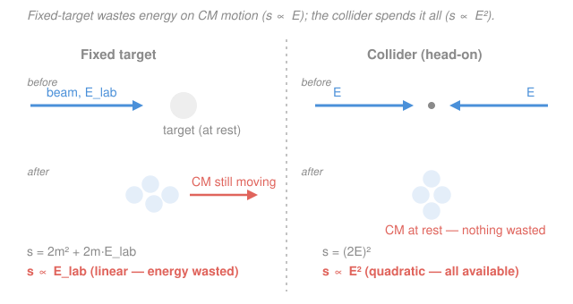

# Nuclear & Particle Physics · Lesson 3.2: Collision & decay kinematics

> ⏱ ~15 min · Module 3: Scattering & relativistic kinematics · Builds on: [3.1 Four-vectors & invariant mass](03-01-four-vectors-invariant-mass.md) · Unlocks: [3.3 Cross-sections & the count rate](03-03-cross-sections-count-rate.md)

## Why this matters

Two questions run through every experiment in this course. *When a particle decays, how much energy does each fragment carry?* And *how much beam energy do I need to make a new particle at all?* Both are answered by nothing more than conservation of energy and momentum — done relativistically, with the four-vector machinery from [3.1](03-01-four-vectors-invariant-mass.md). The payoff is sharp and practical: two-body decay gives each daughter a single, fixed energy (a spectral *line*), and production thresholds explain why the entire field pivoted from fixed-target machines to colliders. The antiproton was discovered in 1955 because someone did exactly the threshold calculation you'll do below and built an accelerator to clear it.

## The idea

Throughout this lesson we work in **natural units**, $\hbar = c = 1$, so mass, energy, and momentum all carry the same unit (MeV or GeV) and $E^2 = p^2 + m^2$. (To restore SI, sprinkle $c$'s back until the units work.)

**Decay first.** Sit a parent particle at rest and let it split into two. It had zero momentum, so the two daughters must fly apart back-to-back with *equal and opposite* momenta — otherwise something moves and momentum isn't conserved. That single constraint, plus "the two energies add up to the parent's mass," is two equations in two unknowns. The energies are therefore **fixed** — not a range. A two-body decay produces a *monoenergetic* daughter: a clean line in a detector. This is the tell-tale contrast with **beta decay** ([2.3](02-03-beta-decay-neutrino.md)), whose electron energy is smeared across a *continuous* spectrum — the giveaway that a *third* body (the neutrino) is secretly carrying off the balance.

**Production second.** To make heavy particles you smash light ones together, and the question is how much energy you need. The trick is a single invariant, the **Mandelstam $s$** — the squared total four-momentum of the system. Because it's a four-vector length, it's the *same number in every frame* (that's [3.1](03-01-four-vectors-invariant-mass.md)'s whole point). So compute it in the **lab**, where you know the beam energy, and set it equal to its value at **threshold** — the cheapest possible final state, with every product sitting at rest in the center-of-momentum (CM) frame. Equating the two gives the beam energy you need. The surprise waiting there: in a fixed-target collision most of your beam energy is *wasted* keeping the whole system flying forward, and only a collider recovers it.

## The formal version

### Two-body decay at rest

A parent of mass $M$ at rest decays, $M \to m_1 + m_2$. Conservation of energy and momentum:

$$E_1 + E_2 = M, \qquad \vec{p}_1 + \vec{p}_2 = 0 \;\Rightarrow\; |\vec{p}_1| = |\vec{p}_2| \equiv p.$$

*In words: the energies share out the parent's rest mass, and the daughters recoil back-to-back with a common momentum magnitude $p$.* Use $E_i^2 = p^2 + m_i^2$ (same $p$ for both). Subtracting, $E_1^2 - E_2^2 = m_1^2 - m_2^2$, and since $E_1^2 - E_2^2 = (E_1+E_2)(E_1-E_2) = M(E_1 - E_2)$:

$$E_1 - E_2 = \frac{m_1^2 - m_2^2}{M}.$$

Combine with $E_1 + E_2 = M$:

$$\boxed{\,E_1 = \frac{M^2 + m_1^2 - m_2^2}{2M}, \qquad E_2 = \frac{M^2 + m_2^2 - m_1^2}{2M}\,}$$

*In words: each daughter's energy is fixed entirely by the three masses — no free parameter, so the decay is monoenergetic.* The shared momentum follows from $p = \sqrt{E_1^2 - m_1^2}$ (equivalently, the symmetric Källén form $p = \tfrac{1}{2M}\sqrt{[M^2-(m_1+m_2)^2][M^2-(m_1-m_2)^2]}$).

### Production thresholds via Mandelstam $s$

For a system of particles with total four-momentum $P = \sum_i p_i$, define

$$s \equiv P^2 = \Big(\sum_i E_i\Big)^2 - \Big(\sum_i \vec{p}_i\Big)^2.$$

*In words: $s$ is the squared "length" of the total four-momentum — the invariant mass-squared of the whole collection.* Two facts make it the master tool:

1. **It is frame-independent** (a four-vector length), so you may evaluate it in whichever frame is convenient.
2. **In the CM frame the total momentum is zero**, so $s = (\sum_i E_i^{\text{CM}})^2 = E_{\text{CM}}^2$. Thus $\sqrt{s}$ *is* the total center-of-mass energy — the energy budget actually available to make stuff.

**Fixed target.** Beam particle $a$ (energy $E_a^{\text{lab}}$, mass $m_a$) hits target $b$ at rest (four-momentum $(m_b,\vec 0)$):

$$s = (p_a + p_b)^2 = m_a^2 + m_b^2 + 2\,m_b E_a^{\text{lab}}.$$

*In words: with a stationary target, $s$ rises only **linearly** with beam energy.* 

**Threshold.** The cheapest final state has all products at rest in the CM, so $\sqrt{s}_{\min} = \sum_f m_f$, i.e.

$$s_{\min} = \Big(\sum_f m_f\Big)^2.$$

Setting the fixed-target $s$ equal to $s_{\min}$ and solving gives the threshold beam energy

$$E_a^{\text{thr}} = \frac{\left(\sum_f m_f\right)^2 - m_a^2 - m_b^2}{2\,m_b}, \qquad T_a^{\text{thr}} = E_a^{\text{thr}} - m_a.$$

**Collider (head-on, equal energies $E$, equal masses).** The two momenta cancel, so

$$s = (E + E)^2 - (\vec p - \vec p)^2 = (2E)^2.$$

*In words: in a symmetric collider $\sqrt{s} = 2E$ — **all** the energy is available, and $s$ grows **quadratically**.* That single difference — linear vs quadratic — is the entire case for colliders.

## Picture

## Worked examples

**Example 1 — a monoenergetic muon (two-body decay).** The charged pion decays $\pi^+ \to \mu^+ + \nu_\mu$, with $M = m_\pi = 139.57$ MeV, $m_\mu = 105.66$ MeV, and $m_\nu \approx 0$. The muon energy is fixed:

$$E_\mu = \frac{M^2 + m_\mu^2 - m_\nu^2}{2M} = \frac{139.57^2 + 105.66^2}{2(139.57)} = \frac{30644}{279.1} = 109.8\ \text{MeV}.$$

So its kinetic energy is $T_\mu = E_\mu - m_\mu = 109.8 - 105.7 = 4.1$ MeV — the *same value every time*. The neutrino takes $E_\nu = M - E_\mu = 29.8$ MeV, and since it's massless its momentum equals its energy, $p_\nu = 29.8$ MeV; the muon must balance it, $p_\mu = \sqrt{E_\mu^2 - m_\mu^2} = \sqrt{109.8^2 - 105.66^2} = 29.8$ MeV ✓. This is why stopped-pion beams give a razor-sharp muon line, whereas the electron in beta decay $n \to p + e^- + \bar\nu_e$ ([2.3](02-03-beta-decay-neutrino.md)) comes out with a *continuous* spread — three bodies, so no single energy is forced.

**Example 2 — the antiproton threshold (Boss problem 3).** To make an antiproton you can't make it alone: baryon number ([coming in 4.2](04-02-conservation-laws-quantum-numbers.md)) must balance, so the cheapest reaction is $p + p \to p + p + p + \bar p$ — four baryons out. Fixed target ($m_a = m_b = m_p = 938.27$ MeV):

$$s = 2m_p^2 + 2 m_p E_{\text{lab}} \;\overset{!}{=}\; s_{\min} = (4m_p)^2 = 16 m_p^2.$$

Solve:

$$2 m_p E_{\text{lab}} = 14 m_p^2 \;\Rightarrow\; E_{\text{lab}} = 7 m_p, \qquad T_{\text{thr}} = E_{\text{lab}} - m_p = 6 m_p \approx 5.63\ \text{GeV}.$$

Why $6 m_p$ and not the naive $2m_p$? You are only creating two new particles ($p\bar p$), a rest-mass cost of $2m_p$ — but that's the cost in the CM frame. In the lab, momentum conservation forces all four final protons to keep barreling *forward* together; that shared kinetic energy of the CM motion is dead weight that can never turn into rest mass. You pay for it anyway, and it triples the bill.

**The collider payoff.** Collide two proton beams of energy $E$ head-on instead. Threshold needs $\sqrt{s} = 4m_p$, and here $\sqrt{s} = 2E$, so $E = 2m_p$, i.e. each beam needs only $T = E - m_p = m_p \approx 0.94$ GeV. Compare: **5.63 GeV of beam kinetic energy fixed-target versus 0.94 GeV per beam in a collider** for the identical physics. Because fixed-target $\sqrt{s} \approx \sqrt{2 m_p E_{\text{lab}}}$ grows only as $\sqrt{E}$ while a collider's grows as $E$, the gap explodes at high energy — the reason every energy-frontier machine today is a collider.

## Watch out

- **You might think each decay daughter can come out with a range of energies.** Not in a *two*-body decay from rest — the energies are pinned by the masses alone (the boxed formula). A *continuous* spectrum is a fingerprint that a third, unseen body is present (historically, exactly how the neutrino was inferred, [2.3](02-03-beta-decay-neutrino.md)).
- **You might set threshold by "outgoing rest energy = incoming kinetic energy."** That double-counts nothing and undercounts the recoil: at fixed-target threshold the products are at rest *in the CM*, not in the lab, so they still carry lab kinetic energy. Always equate the *invariant* $s$, never lab energies directly.
- **You might treat $\sqrt{s}$ as $\sum E_{\text{lab}}$.** $\sqrt{s}$ is the CM energy, only equal to the summed lab energies when the total lab momentum is zero (i.e. a symmetric collider). For a fixed target $\sqrt{s}$ is much smaller than $E_{\text{lab}}$.

## One-liner

> Back-to-back recoil fixes each two-body decay energy to a single line; the invariant $s$ fixes production thresholds — and because fixed-target $s$ grows only linearly with beam energy while a collider's grows quadratically, the collider wins.

## Problems

**P1 (🟢)** The $\Lambda^0$ hyperon ($M = 1115.68$ MeV) decays $\Lambda^0 \to p + \pi^-$, with $m_p = 938.27$ MeV and $m_{\pi} = 139.57$ MeV. Find the proton and pion energies, and their common momentum. Which particle carries most of the released kinetic energy?

**P2 (🟡)** Find the threshold beam kinetic energy to produce a neutral pion in the fixed-target reaction $p + p \to p + p + \pi^0$, with $m_{\pi^0} = 134.98$ MeV. Comment on why it is roughly *twice* $m_{\pi^0}$ rather than equal to it. *(Same technique as the antiproton threshold, Boss problem 3.)*

**P3 (🔴, optional)** A proton beam of energy $E = 6.5$ TeV is available. Compute $\sqrt{s}$ (a) if it strikes a proton at rest, and (b) if it collides head-on with a second identical $6.5$ TeV beam. Then find the fixed-target beam energy $E_{\text{lab}}$ that would be needed to *match* the collider's $\sqrt{s}$. Use $m_p \approx 0.938$ GeV.

Solutions

**P1** Using the boxed two-body formula with $M = 1115.68$, $m_p = 938.27$, $m_\pi = 139.57$ MeV:

$$E_p = \frac{M^2 + m_p^2 - m_\pi^2}{2M} = \frac{1244742 + 880351 - 19480}{2231.4} = 943.7\ \text{MeV},$$

$$E_\pi = M - E_p = 1115.68 - 943.7 = 172.0\ \text{MeV}.$$

Common momentum: $p = \sqrt{E_p^2 - m_p^2} = \sqrt{943.7^2 - 938.27^2} \approx 101\ \text{MeV}$ (and $\sqrt{E_\pi^2 - m_\pi^2} = \sqrt{172.0^2 - 139.57^2} \approx 101$ MeV ✓). Kinetic energies: proton $T_p = 943.7 - 938.27 = 5.4$ MeV, pion $T_\pi = 172.0 - 139.57 = 32.4$ MeV — the **pion** carries most of the kinetic energy.

*Check.* $E_p + E_\pi = 943.7 + 172.0 = 1115.7$ MeV $= M$ ✓. Sanity: the lighter daughter runs off with more kinetic energy (equal momenta, so $T \approx p^2/2m$ is larger for smaller $m$) ✓.

**P2** Threshold requires $\sqrt{s}_{\min} = 2m_p + m_{\pi^0}$. Fixed target with $s = 2m_p^2 + 2 m_p E_{\text{lab}}$:

$$2m_p^2 + 2 m_p E_{\text{lab}} = (2m_p + m_{\pi^0})^2 = 4m_p^2 + 4 m_p m_{\pi^0} + m_{\pi^0}^2.$$

$$2 m_p E_{\text{lab}} = 2m_p^2 + 4 m_p m_{\pi^0} + m_{\pi^0}^2 \;\Rightarrow\; E_{\text{lab}} = m_p + 2 m_{\pi^0} + \frac{m_{\pi^0}^2}{2m_p}.$$

Numerically $E_{\text{lab}} = 938.27 + 269.96 + 9.72 = 1218.0$ MeV, so

$$T_{\text{thr}} = E_{\text{lab}} - m_p = 279.7\ \text{MeV} \approx 280\ \text{MeV}.$$

It is about $2m_{\pi^0}c^2$, not $1$: again, momentum conservation forces the final $ppp\pi^0$ system to recoil forward in the lab, so roughly half the invested kinetic energy goes into unavoidable CM motion rather than into the pion's rest mass. (The exact factor here is set by the $m_{\pi^0}^2/2m_p$ term being small, leaving $T_{\text{thr}} \approx 2m_{\pi^0}$.)

*Check.* Order of magnitude: pion threshold energies at fixed-target proton machines are a few hundred MeV — matches, and is why early "meson factories" ran near $600$–$800$ MeV to produce pions comfortably above threshold ✓.

**P3** (a) Fixed target, $E \gg m_p$, so $s = m_p^2 + m_p^2 + 2 m_p E \approx 2 m_p E$:

$$\sqrt{s} = \sqrt{2 (0.938)(6500)}\ \text{GeV} = \sqrt{12194}\ \text{GeV} \approx 110\ \text{GeV}.$$

(b) Collider: $\sqrt{s} = 2E = 2(6500) = 13000\ \text{GeV} = 13\ \text{TeV}$.

To match $\sqrt{s} = 13$ TeV with a fixed target you'd need $s = (13000)^2 = 1.69\times10^{8}\ \text{GeV}^2 = 2 m_p E_{\text{lab}}$, so

$$E_{\text{lab}} = \frac{(13000)^2}{2(0.938)} \approx 9.0\times10^{7}\ \text{GeV} = 9.0\times10^{4}\ \text{TeV}.$$

*Check.* The collider ($13$ TeV) beats the fixed target ($0.11$ TeV) at the same beam energy by a factor $\sim 118 \approx \sqrt{2E/m_p}$, exactly the $\sqrt{s}\propto E$ vs $\sqrt{E}$ scaling. Matching the LHC head-on energy in fixed-target mode would take a $\sim 90{,}000$ TeV beam — physically absurd, which is *why* the LHC is a collider ✓.

## Flashback

**From Lesson 3.1 (Four-vectors & invariant mass):** A $\Lambda^0$ (mass $1115.7$ MeV) is produced with total energy $E = 2000$ MeV. Find its momentum, its speed $\beta$, and its Lorentz factor $\gamma$. *(Fresh variant — retrieval of $E^2 = p^2 + m^2$ and $\beta = p/E$, $\gamma = E/m$.)*

Solution

From $E^2 = p^2 + m^2$:

$$p = \sqrt{E^2 - m^2} = \sqrt{2000^2 - 1115.7^2} = \sqrt{2.755\times10^6} = 1660\ \text{MeV}.$$

Speed and Lorentz factor straight from the four-momentum components:

$$\beta = \frac{p}{E} = \frac{1660}{2000} = 0.830, \qquad \gamma = \frac{E}{m} = \frac{2000}{1115.7} = 1.79.$$

*Check.* Consistency: $\gamma = 1/\sqrt{1-\beta^2} = 1/\sqrt{1 - 0.689} = 1/\sqrt{0.311} = 1.79$ ✓, and $\beta = p/E < 1$ as required for a massive particle ✓.

## Connections

- **Backward:** this is [3.1](03-01-four-vectors-invariant-mass.md) put to work — every result here is $s = P^2$ evaluated in a clever frame, and the two-body decay energies are just $E^2 = p^2 + m^2$ with back-to-back recoil. The Q-value bookkeeping of [2.5](02-05-nuclear-reactions-q-values.md) is the nonrelativistic cousin of the threshold calculation.
- **Forward:** [3.3 Cross-sections & the count rate](03-03-cross-sections-count-rate.md) asks not *whether* a reaction is allowed by energy but *how often* it happens; the CM kinematics fixed here set the phase space that cross-sections are measured against. Baryon-number conservation, which forced the four-baryon antiproton final state, is developed in [4.2](04-02-conservation-laws-quantum-numbers.md).
- **Sideways (relativity):** the invariant $s$ is the same frame-independent four-vector length used throughout [`relativity`](../../relativity/syllabus.md); the monoenergetic-vs-continuous decay-spectrum contrast is the historical thread that, in [2.3](02-03-beta-decay-neutrino.md), demanded the neutrino's existence.
