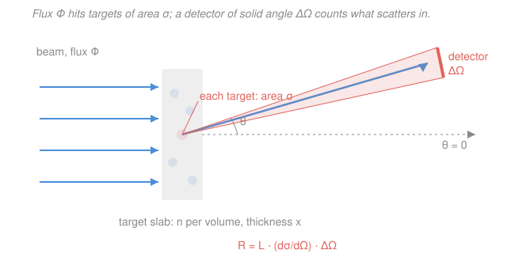

# Nuclear & Particle Physics · Lesson 3.3: Cross-sections & the count rate

> ⏱ ~15 min · Module 3: Scattering & relativistic kinematics · Builds on: [3.2 Collision & decay kinematics](03-02-collision-decay-kinematics.md) · Unlocks: [3.4 Rutherford, form factors & the optical picture](03-04-rutherford-form-factors.md)

## Why this matters

Every result in subatomic physics — the discovery of the nucleus, of quarks, of the Higgs — is ultimately a **counting experiment**: fire a beam, wait, and tally how often something happens. But nature speaks in *probabilities per collision*, while your detector speaks in *counts per second*. The **cross-section** is the exchange rate between the two. It is the single number that lets a theorist compute an interaction from first principles and an experimentalist predict exactly how many events per hour a detector will log. This lesson builds that bridge in both directions; [3.4](03-04-rutherford-form-factors.md) then computes an actual cross-section from a force law.

## The idea

Picture each target particle as a little **disk** floating in the beam's path. A projectile that flies through the disk "interacts"; one that misses passes clean through. The disk's area is the **cross-section** $\sigma$ — literally *how big the target looks* for that particular process. A large $\sigma$ means an easy, likely interaction; a tiny $\sigma$ means a rare one. Crucially the disk is not the physical size of the particle: a proton looks huge for the strong force but almost transparent to a neutrino, because $\sigma$ encodes the *interaction*, not the geometry.

Once you accept that each target is a disk of area $\sigma$, the counting is bookkeeping. Send a stream of projectiles at a slab full of disks. The fraction of the beam's path that is "covered" by disks sets the chance of a hit. Multiply that chance by how many projectiles you send per second and you get your **count rate**. Everything below is just making "how many disks, how densely packed, how fast the beam" precise — and then asking not just *whether* a particle scatters but *which way* it goes, which is where the detector's viewing angle enters.

## The formal version

**Cross-section and its units.** $\sigma$ has units of **area**. Because nuclei are femtometres across, the natural unit is the **barn**:

$$1\ \text{barn} = 10^{-28}\ \text{m}^2 = 10^{-24}\ \text{cm}^2 = 100\ \text{fm}^2.$$

*In words: a barn is about the geometric cross-section of a mid-sized nucleus* — "as big as a barn door" to a nuclear physicist. Sub-multiples: $1\ \text{mb}=10^{-3}$ b, $1\ \text{nb}=10^{-9}$ b (typical of rare particle-physics processes).

**Flux and the single-target rate.** Let the beam **flux** $\Phi$ be the number of projectiles crossing unit area per unit time (units $\mathrm{cm^{-2}s^{-1}}$). A single target of cross-section $\sigma$ sitting in that beam is struck at rate

$$r_1 = \Phi\,\sigma \qquad [\mathrm{s^{-1}}].$$

*In words: flux (per area, per time) times area (the disk) gives events per time* — the units force it. This is the atom of everything that follows.

**The master relation.** With $N_t$ targets illuminated by the beam, the total rate is $R=\Phi\,\sigma\,N_t$. Package the two "how much beam, how many targets" factors into one number, the **luminosity** $L\equiv \Phi\,N_t$ (units $\mathrm{cm^{-2}s^{-1}}$):

$$\boxed{\,R = L\,\sigma\,}$$

*In words: the rate is luminosity — everything about your machine — times cross-section — everything about the physics.* The clean split is the point: $L$ is the accelerator group's job, $\sigma$ is nature's.

**Luminosity for a thin slab.** For a beam of $\dot N$ projectiles per second hitting a slab of number density $n$ (targets $\mathrm{cm^{-3}}$) and thickness $x$ (cm), the targets-per-unit-beam-area is the **areal density** $nx$, so $L=\dot N\,nx$ and

$$R = \dot N\,(n\,\sigma\,x).$$

*In words: each projectile has probability $n\sigma x$ of interacting while crossing the slab* — that dimensionless number ($nx$ in $\mathrm{cm^{-2}}$ times $\sigma$ in $\mathrm{cm^{2}}$) must be $\ll 1$ for a "thin" target, or one hit shadows the next.

**Differential cross-section.** Scattered particles don't fly off uniformly — they favour some angles. The **differential cross-section** $\dfrac{d\sigma}{d\Omega}$ (units area per steradian, e.g. mb/sr) says how $\sigma$ is distributed over solid angle $\Omega$. Integrate to recover the total:

$$\sigma_{\text{tot}} = \int \frac{d\sigma}{d\Omega}\,d\Omega = \int_0^{2\pi}\!\!\int_0^\pi \frac{d\sigma}{d\Omega}\,\sin\theta\,d\theta\,d\phi.$$

*In words: sum the per-angle "target area" over all directions to get the whole disk.* A detector subtending a small solid angle $\Delta\Omega$ then counts at

$$R_{\text{det}} = L\,\frac{d\sigma}{d\Omega}\,\Delta\Omega.$$

**Mean free path and attenuation.** In a *thick* target the beam gets eaten away. Over a slice $dx$ the flux drops by $dI = -I\,n\sigma\,dx$, so

$$I(x) = I_0\,e^{-n\sigma x} = I_0\,e^{-x/\lambda}, \qquad \lambda \equiv \frac{1}{n\sigma}.$$

*In words: intensity falls off exponentially, and $\lambda$ — the **mean free path** — is the average distance a projectile travels before interacting.* This is the same first-order decay ODE as radioactive decay (see [`ode-refresher`](../../ode-refresher/syllabus.md)), with distance playing the role of time.

**Impact parameter → angle.** For a *classical* deflection by a central force, the projectile's aim is set by its **impact parameter** $b$ — the perpendicular miss-distance from the target's centre. Projectiles arriving in the ring $b\to b+db$ (area $2\pi b\,db$) emerge into the cone $\theta\to\theta+d\theta$ (solid angle $2\pi\sin\theta\,d\theta$). Equating the two areas gives

$$\frac{d\sigma}{d\Omega} = \frac{b}{\sin\theta}\left|\frac{db}{d\theta}\right|.$$

*In words: the cross-section into an angle is just the size of the entrance ring that gets steered there.* The absolute value is because a harder aim (smaller $b$) usually means a larger kick (bigger $\theta$), so $db/d\theta<0$. This formula, fed a force law, *is* the Rutherford calculation of [3.4](03-04-rutherford-form-factors.md).

## Picture

## Worked examples

**Example 1 (mechanical — from beam to counts).** A beam of $\dot N = 10^{13}$ protons per second strikes a liquid-hydrogen target of length $x = 10\ \text{cm}$ with proton number density $n = 4.2\times10^{22}\ \mathrm{cm^{-3}}$. The proton–proton cross-section for the process of interest is $\sigma = 40\ \text{mb}$. How many events per second?

First convert: $\sigma = 40\ \text{mb} = 40\times10^{-27}\ \mathrm{cm^2} = 4.0\times10^{-26}\ \mathrm{cm^2}$. The areal density is $nx = 4.2\times10^{22}\times10 = 4.2\times10^{23}\ \mathrm{cm^{-2}}$. Interaction probability per proton:

$$n\sigma x = (4.2\times10^{23})(4.0\times10^{-26}) = 1.7\times10^{-2}\approx 1.7\%,$$

comfortably thin. The rate is then

$$R = \dot N\,(n\sigma x) = 10^{13}\times1.7\times10^{-2} = 1.7\times10^{11}\ \text{events/s}.$$

Equivalently the luminosity is $L=\dot N\,nx = 10^{13}\times4.2\times10^{23} = 4.2\times10^{36}\ \mathrm{cm^{-2}s^{-1}}$, and $R=L\sigma$ reproduces the same number. The two views agree because $R=L\sigma$ is just $\dot N (n\sigma x)$ regrouped.

**Example 2 (why you'd care — impact parameter builds a cross-section).** Take the simplest possible "force law": a hard sphere of radius $R$ that bounces projectiles like billiard balls. A projectile at impact parameter $b$ hits the surface where the inward normal makes angle $\alpha$ with the incoming line, with $\sin\alpha = b/R$. Reflection sends it off at scattering angle $\theta = \pi - 2\alpha$, so $\alpha=(\pi-\theta)/2$ and

$$b = R\sin\alpha = R\sin\!\Big(\tfrac{\pi-\theta}{2}\Big) = R\cos\!\big(\tfrac{\theta}{2}\big), \qquad \frac{db}{d\theta} = -\frac{R}{2}\sin\!\big(\tfrac{\theta}{2}\big).$$

Now feed the impact-parameter formula, using $\sin\theta = 2\sin(\theta/2)\cos(\theta/2)$:

$$\frac{d\sigma}{d\Omega} = \frac{b}{\sin\theta}\left|\frac{db}{d\theta}\right| = \frac{R\cos(\theta/2)}{2\sin(\theta/2)\cos(\theta/2)}\cdot\frac{R}{2}\sin\!\big(\tfrac{\theta}{2}\big) = \frac{R^2}{4}.$$

The differential cross-section is a **constant** — a hard sphere scatters isotropically. Integrating over the full sphere:

$$\sigma_{\text{tot}} = \int \frac{R^2}{4}\,d\Omega = \frac{R^2}{4}\cdot 4\pi = \pi R^2.$$

Exactly the geometric shadow the sphere casts — the machinery gives back the obvious answer, which is why you can trust it on Rutherford's Coulomb potential next, where the answer is *not* obvious.

## Watch out

- **You might think $\sigma$ is the physical size of the particle.** It isn't — it's the *effective* target area for one specific interaction. The same proton has a strong-force $\sigma\sim$ tens of mb but a neutrino-scattering $\sigma\sim10^{-14}$ b. Same particle, wildly different "disks."
- **You might mix up $\sigma$ and $d\sigma/d\Omega$.** They differ by a solid angle: $\sigma$ is in area (barns), $d\sigma/d\Omega$ in area per steradian (barns/sr). Detector counts always need the differential form times $\Delta\Omega$; never plug the *total* $\sigma$ into $R_{\text{det}}=L(d\sigma/d\Omega)\Delta\Omega$.
- **You might use the thin-target formula $R=\dot N n\sigma x$ on a thick block.** It assumes every projectile survives to the far side. Once $n\sigma x$ isn't small, use the exponential $I=I_0e^{-x/\lambda}$ instead — the linear law is just its first-order Taylor term.

## One-liner

> The cross-section is nature's target area for a process; multiply it by the machine's luminosity to get counts per second — $R=L\sigma$ — and by $\Delta\Omega$ through $d\sigma/d\Omega$ to get counts in your detector.

## Problems

**P1 (🟢)** A collider runs at luminosity $L = 10^{34}\ \mathrm{cm^{-2}s^{-1}}$. A process has cross-section $\sigma = 50\ \text{nb}$. How many events per second? How many in a $10^{7}\,\text{s}$ run (a typical "year" of beam time)? (Recall $1\ \text{b}=10^{-24}\ \mathrm{cm^2}$.)

**P2 (🟡)** A beam of thermal neutrons passes through a slab of thickness $x = 2\ \text{cm}$, with $n = 5.0\times10^{22}\ \mathrm{cm^{-3}}$ and absorption cross-section $\sigma = 3.0\ \text{barn}$. Find the mean free path $\lambda$ and the fraction of the beam transmitted.

**P3 (🔴, optional)** In an elastic-scattering experiment at luminosity $L=2\times10^{31}\ \mathrm{cm^{-2}s^{-1}}$, a detector of solid angle $\Delta\Omega = 1.5\times10^{-3}\ \text{sr}$ sits at the angle where $d\sigma/d\Omega = 8\ \text{mb/sr}$. What count rate does it register? If instead you wanted $\sigma_{\text{tot}}$ and the distribution were isotropic at that same $d\sigma/d\Omega$, what would $\sigma_{\text{tot}}$ be?

Solutions

**P1** Convert $\sigma = 50\ \text{nb} = 50\times10^{-9}\ \text{b} = 50\times10^{-9}\times10^{-24}\ \mathrm{cm^2} = 5.0\times10^{-32}\ \mathrm{cm^2}$. Then

$$R = L\sigma = (10^{34})(5.0\times10^{-32}) = 5.0\times10^{2} = 500\ \text{events/s}.$$

Over $10^7$ s: $N = R\,t = 500\times10^{7} = 5\times10^{9}$ events.

*Check.* Units: $\mathrm{cm^{-2}s^{-1}}\times\mathrm{cm^2}=\mathrm{s^{-1}}$ ✓. Order of magnitude: 500 Hz from a nanobarn process at design luminosity is exactly why colliders chase high $L$ — rarer (pb, fb) processes would give a handful of events per year. ✓

**P2** Mean free path:

$$\lambda = \frac{1}{n\sigma} = \frac{1}{(5.0\times10^{22}\ \mathrm{cm^{-3}})(3.0\times10^{-24}\ \mathrm{cm^2})} = \frac{1}{0.15\ \mathrm{cm^{-1}}} = 6.7\ \text{cm}.$$

Transmitted fraction through $x=2$ cm:

$$\frac{I}{I_0} = e^{-x/\lambda} = e^{-2/6.7} = e^{-0.30} = 0.74.$$

So about 74% pass through and 26% are absorbed.

*Check.* $n\sigma x = 0.30$ is not $\ll1$, so the thin-target linear estimate ($30\%$ removed) already overshoots the true $26\%$ — the exponential is the right tool here. Units of $n\sigma$: $\mathrm{cm^{-3}\,cm^2}=\mathrm{cm^{-1}}$, so $\lambda$ in cm ✓. ✓

**P3** Convert $d\sigma/d\Omega = 8\ \text{mb/sr} = 8\times10^{-27}\ \mathrm{cm^2/sr}$. Count rate:

$$R_{\text{det}} = L\,\frac{d\sigma}{d\Omega}\,\Delta\Omega = (2\times10^{31})(8\times10^{-27})(1.5\times10^{-3}) = 2.4\times10^{2} = 240\ \text{counts/s}.$$

If the distribution were isotropic at $d\sigma/d\Omega = 8\ \text{mb}$/sr over all $4\pi$ sr:

$$\sigma_{\text{tot}} = \frac{d\sigma}{d\Omega}\cdot 4\pi = 8\ \text{mb}\times4\pi \approx 100\ \text{mb} = 0.1\ \text{b}.$$

*Check.* Rate units: $\mathrm{cm^{-2}s^{-1}}\times(\mathrm{cm^2/sr})\times\mathrm{sr}=\mathrm{s^{-1}}$ ✓. And $8\times4\pi = 100.5$, so $\sigma_{\text{tot}}\approx0.1$ b — a plausible strong-interaction size. ✓

## Flashback

**From Lesson 3.1 (Four-vectors & invariant mass):** A neutral particle decays into two photons. Each photon has energy $E_1 = E_2 = 100\ \text{MeV}$, and they emerge with an opening angle $\theta = 60^\circ$ between them. Reconstruct the invariant mass $M$ of the parent (photons are massless, so each has momentum $|\mathbf{p}|c = E$).

Solution

The parent's four-momentum is the sum of the two photons', so its invariant mass satisfies $M^2c^4 = (E_1+E_2)^2 - |\mathbf{p}_1+\mathbf{p}_2|^2 c^2$. Expand the momentum sum with $|\mathbf{p}_i|c=E_i$:

$$|\mathbf{p}_1+\mathbf{p}_2|^2 c^2 = E_1^2 + E_2^2 + 2E_1E_2\cos\theta.$$

Subtract from $(E_1+E_2)^2 = E_1^2+E_2^2+2E_1E_2$:

$$M^2c^4 = 2E_1E_2(1-\cos\theta) = 2(100)(100)(1-\cos 60^\circ) = 2\times10^4\times(1-0.5) = 10^4\ \text{MeV}^2.$$

So $Mc^2 = 100\ \text{MeV}$.

*Check.* Units: (MeV)$^2$ under the root gives MeV ✓. Limiting sense: collinear photons ($\theta\to0$) give $M\to0$ — massless total, as a single photon must be. A wider opening angle raises the reconstructed mass; sweeping it and histogramming $M$ is exactly how experiments pull the $\pi^0$ (135 MeV) peak out of the two-photon spectrum. ✓

## Connections

- **Backward:** the scattering angle $\theta$ you now *count against* is the same $\theta$ whose kinematics you nailed in [3.2](03-02-collision-decay-kinematics.md); the Flashback's invariant-mass reconstruction from [3.1](03-01-four-vectors-invariant-mass.md) is how those counts get sorted into a mass spectrum.
- **Forward:** [3.4 Rutherford, form factors & the optical picture](03-04-rutherford-form-factors.md) feeds the Coulomb force into the impact-parameter formula $\frac{d\sigma}{d\Omega}=\frac{b}{\sin\theta}|db/d\theta|$ to get the famous $1/\sin^4(\theta/2)$ law — and reads a nucleus's *shape* off the deviations (the form factor, a Fourier transform of the charge distribution — see [`fourier-analysis`](../../fourier-analysis/syllabus.md)).
- **Sideways:** the attenuation law $I=I_0e^{-x/\lambda}$ is the first-order decay ODE from [`ode-refresher`](../../ode-refresher/syllabus.md) with distance for time. And $d\sigma/d\Omega$ is where quantum field theory cashes out: the Feynman amplitude gives $d\sigma/d\Omega\propto|\mathcal{M}|^2$ — deferred to [`qft`](../../qft/syllabus.md), but this lesson is the classical scaffold it hangs on.
