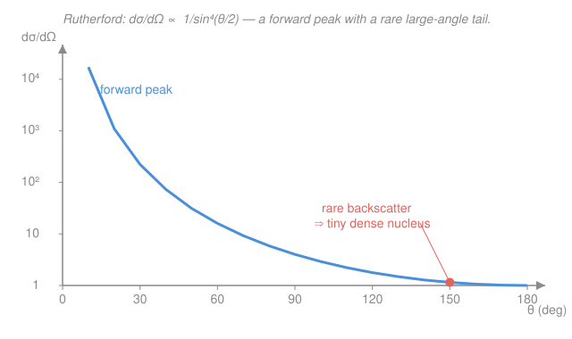

# Nuclear & Particle Physics · Lesson 3.4: Rutherford, form factors & the optical picture

> ⏱ ~15 min · Module 3: Scattering & relativistic kinematics · Builds on: [3.3 Cross-sections & the count rate](03-03-cross-sections-count-rate.md) · Unlocks: [4.1 The particle zoo](04-01-particle-zoo.md)

## Why this matters

You cannot put a nucleus under a microscope — it is a hundred thousand times smaller than the wavelength of visible light. So how does anyone *know* a nucleus is a few femtometers across, or that a proton has structure inside it? You throw things at it and watch how they bounce. The angular pattern of the debris is a fingerprint of the target's shape. This lesson is the master key of experimental subatomic physics: **scattering measures the Fourier transform of what you're aiming at**, and reading that transform backwards gives you the target's size and shape. It is how Rutherford found the nucleus in 1911, how Hofstadter measured nuclear radii in the 1950s, and — scaled up — how we later found quarks.

## The idea

Fire a charged particle past a fixed charge. The Coulomb force deflects it; a near miss (small **impact parameter** — how far off-center you aim, from [3.3](03-03-cross-sections-count-rate.md)) bends it hard, a distant pass barely at all. Add up all impact parameters and you get an angular distribution: mostly gentle forward deflections, with big deflections rare. For a **point** charge that distribution has a razor-sharp signature — it blows up as $1/\sin^4(\theta/2)$ toward small angles and falls to a tiny tail at large angles.

Here is the historical jolt. Geiger and Marsden fired alpha particles at gold foil (1909) expecting them to punch straight through a diffuse "plum pudding" atom. A few came *straight back*. Rutherford: "It was as if you had fired a 15-inch shell at a piece of tissue paper and it came back and hit you." The only way to turn an alpha around is to hit something tiny, massive, and hard — a concentrated positive charge. The nucleus.

Now the second idea. A point charge gives the clean $1/\sin^4$ law *exactly*. A real nucleus is an extended blob of charge, and when your probe's wavelength gets short enough to "feel" that spread, the measured pattern **drops below** the point-charge prediction — most at large angles, where the probe resolves the finest detail. That deficit *is* the shape information. The ratio of measured to point-charge cross-section is the **form factor squared**, and the form factor is nothing but the Fourier transform of the charge distribution. Measure it versus angle, invert the transform, and you have drawn the nucleus.

## The formal version

**Rutherford cross-section.** For a projectile of charge $Z_1 e$ and kinetic energy $E$ scattering off a fixed point charge $Z_2 e$ through angle $\theta$,

$$\frac{d\sigma}{d\Omega} = \left(\frac{Z_1 Z_2\, e^2}{16\pi\varepsilon_0\, E}\right)^{2}\frac{1}{\sin^4(\theta/2)},$$

where $e$ is the elementary charge, $\varepsilon_0$ the permittivity of free space, and $\theta$ the scattering angle. (In Gaussian units the bracket is just $Z_1 Z_2 e^2/4E$ — the form the spec and most texts quote.) *In words: the chance of scattering into a given direction scales as charge-squared over energy-squared, and explodes as you look closer to straight-ahead.*

Two features carry all the physics:

- **The $1/\sin^4(\theta/2)$ shape.** Forward ($\theta\to 0$) it diverges — almost everything barely deflects. Backward ($\theta\to180^\circ$) it bottoms out at its *smallest* value, so large-angle events are rarest. Those rare events are the ones that revealed the nucleus.
- **The prefactor cancels in ratios.** Comparing the rate at two angles, all the $Z$'s, $e$'s, and $E$'s drop out:

$$\frac{(d\sigma/d\Omega)_{\theta_1}}{(d\sigma/d\Omega)_{\theta_2}} = \frac{\sin^4(\theta_2/2)}{\sin^4(\theta_1/2)}.$$

*In words: you can test the law knowing nothing about the beam energy or the charges — just count at two angles and compare.* This clean prediction is exactly what Geiger and Marsden confirmed.

**Momentum transfer.** The right variable is not $\theta$ but the momentum the probe hands to the target. For elastic scattering of a projectile with momentum $p$,

$$q = 2p\,\sin(\theta/2).$$

*In words: large angle = large momentum transfer.* By de Broglie the probe resolves a length $\sim \hbar/q$: **bigger $q$ resolves finer structure.** To see detail of size $d$ you need $q \gtrsim \hbar/d$.

**Form factor.** Replace the point target by a normalized charge distribution $\rho(\mathbf r)$ (with $\int\rho\,d^3r = 1$). The measured cross-section is the point cross-section modulated by a factor:

$$\left(\frac{d\sigma}{d\Omega}\right)_{\text{meas}} = \left(\frac{d\sigma}{d\Omega}\right)_{\text{point}}\,\big|F(\mathbf q)\big|^2,\qquad F(\mathbf q) = \int \rho(\mathbf r)\, e^{\,i\,\mathbf q\cdot\mathbf r/\hbar}\, d^3r.$$

*In words: the form factor $F(\mathbf q)$ is the Fourier transform of the target's shape, and scattering measures $|F|^2$ directly.* Note $F(0) = \int\rho\,d^3r = 1$: at zero momentum transfer you can't resolve anything, so you always recover the point result. As $q$ grows, $F$ falls — and for a spherical target it can pass through **zeros**, producing *diffraction minima* in the cross-section, just like light through a circular aperture. A sharp-edged charge sphere of radius $R$ has its first minimum at

$$\frac{qR}{\hbar} \approx 4.49,$$

so **the angle of the first dip tells you $R$**. Invert the whole $F(q)$ curve and you recover $\rho(r)$ — this is how Hofstadter mapped nuclear charge distributions.

**Optical model & resonances (the cloudy crystal ball).** At higher energies the nucleus also *absorbs* — the probe can knock it into an excited state or trigger a reaction, not just bounce. You model this with a **complex** potential $U(r) = V(r) - iW(r)$: the real part refracts, the imaginary part $W$ removes flux, exactly like a partially absorbing ("cloudy") glass sphere. And when the beam energy matches a quasi-bound level of the target, the cross-section spikes — a **resonance**, shaped like a **Breit–Wigner** peak,

$$\sigma(E) \propto \frac{1}{(E - E_R)^2 + (\Gamma/2)^2},$$

centered at the resonance energy $E_R$ with full width $\Gamma$. *In words: hit a natural frequency of the nucleus and it rings loudly.* The width and lifetime are reciprocal, $\tau = \hbar/\Gamma$ (the energy–time uncertainty relation) — a fact we'll lean on constantly for short-lived particles in Module 4.

## Picture

## Worked examples

**Example 1 (the ratio test).** Alpha particles scatter off a gold nucleus. Compare the count rate at $\theta_1 = 30^\circ$ with that at $\theta_2 = 90^\circ$. Using the ratio law, no beam details needed:

$$\frac{(d\sigma/d\Omega)_{30^\circ}}{(d\sigma/d\Omega)_{90^\circ}} = \frac{\sin^4(45^\circ)}{\sin^4(15^\circ)} = \frac{(0.7071)^4}{(0.2588)^4} = \frac{0.25}{0.004487} \approx 56.$$

So you catch about **56 times** more alphas at $30^\circ$ than at $90^\circ$ — the forward peak is brutal. This steepness is why Rutherford's backscattered alphas were so shocking: at $180^\circ$ the rate is another factor of 4 below the $90^\circ$ value, i.e. a couple hundred times below $30^\circ$. Seeing *any* was the whole point.

**Example 2 (how sharp a probe do you need?).** To resolve structure of size $d = 1\ \text{fm}$, you need momentum transfer $q \gtrsim \hbar/d$. Working in the convenient combination $\hbar c = 197\ \text{MeV·fm}$,

$$q c \gtrsim \frac{\hbar c}{d} = \frac{197\ \text{MeV·fm}}{1\ \text{fm}} \approx 200\ \text{MeV}.$$

So you need a probe carrying $\sim 200\ \text{MeV}/c$ of momentum to "see" at the 1 fm scale — and correspondingly more (GeV-scale beams) to resolve the sub-femtometer interior. *This is the entire reason particle physics needs ever-bigger accelerators: shorter wavelength, finer resolution.* Optical microscopes bottom out at ~500 nm; to reach $10^{-15}$ m you trade photons for high-momentum electrons.

## Watch out

- **You might think $|F|^2$ can boost the cross-section.** It can't for elastic scattering: $|F(q)|\le F(0)=1$, so the form factor only ever *suppresses* the point-charge rate. A "dip below Rutherford" is the signal of finite size — never a dip below zero, and never an enhancement (enhancements are resonances, a different mechanism).
- **You might confuse "big angle" with "big cross-section."** Backward scattering is the *rarest* Rutherford outcome, but the *most informative*: it's where $q$ is largest and the probe resolves the finest detail. Rarity and resolving power go together.
- **Rutherford's law is not exact at high energy.** It ignores the target's spin, magnetism, recoil, and relativity. The relativistic point-charge version is the **Mott** cross-section; on top of that sits $|F(q)|^2$ for finite size. Pure $1/\sin^4$ is the low-energy, point-charge, nonrelativistic limit — a beautiful special case, not the last word.
- **$q$ is a momentum, $qr/\hbar$ is the dimensionless variable.** Keep track: the Fourier exponent is $\mathbf q\cdot\mathbf r/\hbar$. Using $\hbar c = 197\ \text{MeV·fm}$ turns $qr/\hbar$ into $(qc)(r)/(\hbar c)$ with $qc$ in MeV and $r$ in fm.

## One-liner

> Scattering is a Fourier transform you run with a beam: $1/\sin^4(\theta/2)$ betrays a point, and the deficit from it — the form factor $|F(q)|^2$ — is the target's shape, resolved ever finer as the momentum transfer $q$ climbs.

## Problems

**P1 (🟢)** In a Rutherford experiment the detector counts 800 events per minute at $\theta = 60^\circ$. Assuming pure Rutherford scattering, predict the rate at $\theta = 120^\circ$ (same solid angle, same beam).

**P2 (🟡)** You want to resolve the charge radius of a single proton, about $0.8\ \text{fm}$. Estimate the minimum momentum transfer $qc$ (in MeV) required. Then, using $q = 2p\sin(\theta/2)$, comment on whether a fixed beam momentum $p$ reaches this at forward or backward angles.

**P3 (🔴, optional)** Electron scattering off a nucleus shows its first form-factor diffraction minimum at momentum transfer $qc = 197\ \text{MeV}$. Treating the nuclear charge as a uniform sphere (first zero at $qR/\hbar \approx 4.49$), find the radius $R$. Then use $R = r_0 A^{1/3}$ with $r_0 = 1.2\ \text{fm}$ to estimate the mass number $A$, and name a plausible nucleus.

Solutions

**P1** Use the ratio law; the prefactor cancels:

$$\frac{(d\sigma/d\Omega)_{120^\circ}}{(d\sigma/d\Omega)_{60^\circ}} = \frac{\sin^4(30^\circ)}{\sin^4(60^\circ)} = \frac{(0.5)^4}{(0.8660)^4} = \frac{0.0625}{0.5625} = \frac{1}{9}.$$

So the rate at $120^\circ$ is one-ninth of that at $60^\circ$: $800/9 \approx 89$ events per minute.

*Check.* Larger angle ⇒ fewer counts, as the forward-peaked shape demands. Order of magnitude: $\sim 10^2$, comfortably below the $60^\circ$ rate. ✓

**P2** To resolve $d = 0.8\ \text{fm}$ you need $q \gtrsim \hbar/d$, i.e.

$$qc \gtrsim \frac{\hbar c}{d} = \frac{197\ \text{MeV·fm}}{0.8\ \text{fm}} \approx 250\ \text{MeV}.$$

Since $q = 2p\sin(\theta/2)$ is *maximized* at $\theta = 180^\circ$ (where $q = 2p$), a given beam momentum $p$ delivers the largest $q$ — hence the finest resolution — at **backward** angles. Forward scattering ($\theta\to0$) gives $q\to0$ and resolves nothing. To reach $qc = 250\ \text{MeV}$ even at full backscatter you need $pc \ge 125\ \text{MeV}$, so a few-hundred-MeV electron beam is the entry ticket to proton structure.

*Check.* Units: $\text{MeV·fm}/\text{fm} = \text{MeV}$ ✓. The number ($\sim$ few hundred MeV) matches Example 2 scaled up for the smaller $d$, and matches the historical electron energies that first showed the proton is not point-like. ✓

**P3** From the first-minimum condition $qR/\hbar = 4.49$:

$$R = \frac{4.49\,\hbar}{q} = \frac{4.49\,\hbar c}{qc} = \frac{4.49 \times 197\ \text{MeV·fm}}{197\ \text{MeV}} = 4.49\ \text{fm}.$$

Now invert $R = r_0 A^{1/3}$:

$$A = \left(\frac{R}{r_0}\right)^3 = \left(\frac{4.49}{1.2}\right)^3 = (3.74)^3 \approx 52.$$

So $A \approx 52$ — a plausible nucleus is ${}^{52}_{24}\mathrm{Cr}$ (or nearby ${}^{56}_{26}\mathrm{Fe}$-region nuclei).

*Check.* Units: $\text{MeV·fm}/\text{MeV} = \text{fm}$ ✓. A radius of $\sim$4–5 fm and $A\sim50$ are mutually consistent with the empirical $R = r_0 A^{1/3}$ from [1.1](01-01-anatomy-of-the-nucleus.md), and the diffraction picture correctly says a *smaller* nucleus pushes its first minimum out to *larger* $q$. ✓

## Flashback

**From Lesson 3.3 (Cross-sections & the count rate):** A beam collides with a target at instantaneous luminosity $\mathcal L = 10^{32}\ \text{cm}^{-2}\text{s}^{-1}$. A particular process has cross-section $\sigma = 10\ \text{mb}$ (millibarn). How many events per second does it produce? (Recall $1\ \text{barn} = 10^{-24}\ \text{cm}^2$.)

Solution

Event rate is luminosity times cross-section, $\dot N = \mathcal L\,\sigma$. Convert the cross-section: $10\ \text{mb} = 10\times10^{-3}\ \text{barn} = 10^{-2}\times10^{-24}\ \text{cm}^2 = 10^{-26}\ \text{cm}^2$. Then

$$\dot N = \mathcal L\,\sigma = (10^{32}\ \text{cm}^{-2}\text{s}^{-1})(10^{-26}\ \text{cm}^2) = 10^{6}\ \text{s}^{-1}.$$

*Check.* Units: $\text{cm}^{-2}\text{s}^{-1}\times\text{cm}^2 = \text{s}^{-1}$ ✓. A million events a second from a 10 mb process at this luminosity is a sensible collider rate — rarer processes (smaller $\sigma$) scale down proportionally. ✓

## Connections

- **Backward:** the count rate $\dot N = \mathcal L\,\sigma$ and the impact-parameter picture come straight from [3.3](03-03-cross-sections-count-rate.md); here we finally compute a specific $d\sigma/d\Omega$ and read physics out of its *shape*. The momentum transfer $q$ uses the four-momentum bookkeeping of [3.1](03-01-four-vectors-invariant-mass.md).
- **Forward:** the same "scatter to reveal structure" logic, pushed to GeV energies, is how the point-like constituents *inside* the proton were found — the story that opens once we meet the hadrons in [4.1 The particle zoo](04-01-particle-zoo.md). The Breit–Wigner resonance and its $\tau = \hbar/\Gamma$ width will reappear as the lifetime signature of unstable particles throughout Module 4.
- **Sideways (Fourier analysis):** "form factor = Fourier transform of $\rho(r)$" is not an analogy — it is literally the transform you study in the [`fourier-analysis` syllabus](../../fourier-analysis/syllabus.md), and the diffraction-minimum-from-a-sharp-edge is the same math as an aperture in the [`mathematical-methods-physics` syllabus](../../mathematical-methods-physics/syllabus.md). Small structure ↔ high frequency ↔ large $q$ is the transform's uncertainty principle wearing a lab coat.
