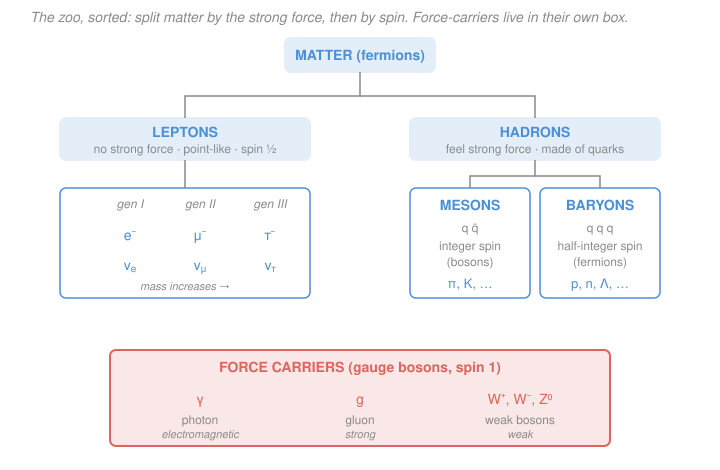

# Nuclear & Particle Physics · Lesson 4.1: The particle zoo

> ⏱ ~15 min · Module 4: Particles, symmetries & the quark model · Builds on: [3.4 Rutherford, form factors & the optical picture](03-04-rutherford-form-factors.md) · Unlocks: [4.2 Conservation laws & quantum numbers](04-02-conservation-laws-quantum-numbers.md)

## Why this matters

By the 1960s, scattering experiments had spat out *hundreds* of "elementary" particles — so many that Willis Lamb joked a discoverer should be *fined* rather than awarded a Nobel. The bestiary looked hopeless. But it isn't: two questions sort almost everything. *Does it feel the strong force?* and *is its spin an integer or a half-integer?* Those two cuts give you the whole taxonomy, and the taxonomy is the scaffold for everything ahead — conservation laws (4.2), symmetries (4.3–4.4), and the quark model (4.5) that finally explained why the zoo is so crowded. This lesson is the map you'll pin every later particle onto.

## The idea

Think of it like biology before you know any genetics: you can still classify animals by a couple of visible traits. Here the first trait is **which forces a particle responds to**. Some particles are deaf to the strong force — the **leptons** (the electron and its heavier cousins, plus the neutrinos). Everything that *does* feel the strong force is a **hadron**, and every hadron turns out to be built from **quarks** (that's 4.5's story). So the top-level split is *lepton vs hadron = doesn't vs does feel the strong force.*

The second trait splits the hadrons by **spin**. Bundle up an even number of spin-½ quarks and you get integer spin — a **boson**; bundle up an odd number and you get half-integer spin — a **fermion**. A quark–antiquark pair ($q\bar q$) is a **meson** (integer spin); three quarks ($qqq$) is a **baryon** (half-integer spin). The proton and neutron are the baryons you already know from Module 1.

Two more facts finish the picture. First, the forces come in exactly **four flavors**, and *which* forces a particle feels — plus how strong those forces are — quietly sets *how fast it decays*. Second, the whole matter list comes in **three near-identical copies** ("generations") of rising mass, and everything has an **antiparticle** twin. Ordinary matter uses only the lightest copy.

## The formal version

**The two families of matter.** All matter particles are spin-½ fermions, divided by the strong force:

- **Leptons** — do *not* feel the strong force; point-like as far as anyone can measure. Six of them: the charged $e^-,\ \mu^-,\ \tau^-$ and the neutral $\nu_e,\ \nu_\mu,\ \nu_\tau$.
- **Hadrons** — *do* feel the strong force; composite, built from quarks. Split by spin:
  - **Mesons** — a quark–antiquark pair $q\bar q$, so **integer** spin → bosons. E.g. $\pi^\pm,\ \pi^0,\ K^\pm$.
  - **Baryons** — three quarks $qqq$, so **half-integer** spin → fermions. E.g. $p,\ n,\ \Lambda^0$.

*In words: if it ignores the strong force it's a lepton; if it feels it, it's a hadron — a meson if its spin is a whole number, a baryon if it's a half-number.*

**The four forces**, and who feels each:

| Force | Carrier | Feels it | Relative strength | Range |
|---|---|---|---|---|
| Strong | gluon $g$ | quarks & hadrons | $1$ | short, $\sim 1\ \text{fm}$ |
| Electromagnetic | photon $\gamma$ | all *charged* particles | $\sim 10^{-2}$ | infinite ($1/r^2$) |
| Weak | $W^\pm,\ Z^0$ | *all* fermions (incl. neutrinos) | $\sim 10^{-6}$ | short, $\ll 1\ \text{fm}$ |
| Gravity | (graviton?) | everything with energy | $\sim 10^{-39}$ | infinite |

*In words: the strong force is the strongest but only reaches across a nucleus; electromagnetism is weaker but reaches forever; the weak force is feeble and short-ranged but is the only thing neutrinos answer to; gravity is utterly negligible at this scale.* The strengths above are rough order-of-magnitude ratios evaluated at nuclear distances — they shift with energy, but the *ordering* is the thing to remember.

**Force sets the lifetime.** A stronger interaction drives a decay faster, so the *dominant* force shows up directly in the lifetime:

$$\tau_\text{strong} \sim 10^{-23}\,\text{s}, \qquad \tau_\text{EM} \sim 10^{-16}\,\text{s}, \qquad \tau_\text{weak} \sim 10^{-10}\,\text{s and longer}.$$

*In words: read off the lifetime and you can usually name the force that did the deed.* A particle living $10^{-23}$ s decayed strongly; one lingering for nanoseconds or more went by the weak force. We make this quantitative in [4.2](04-02-conservation-laws-quantum-numbers.md) and use it in Boss Problem 4.

**Antiparticles.** Every particle has an **antiparticle** with the *same mass and spin* but *opposite* charge and other additive quantum numbers (baryon number, lepton number, strangeness — all in 4.2). Write it with a bar or a flipped charge: $\bar p$, $e^+$, $\bar\nu_e$. A few genuinely neutral particles are *their own* antiparticles — the photon $\gamma$ and the $\pi^0$ among them.

**Generations.** The matter particles repeat in **three generations** of increasing mass — $(u,d,e,\nu_e)$, then $(c,s,\mu,\nu_\mu)$, then $(t,b,\tau,\nu_\tau)$ — identical in every property *except* mass (and the labels that track which copy you have). All stable, everyday matter is built from the **first** generation alone; the heavier copies are made in accelerators and cosmic rays and decay quickly back down.

## Picture

## Worked examples

**Example 1 (classify and name the forces).** Where does the **kaon** $K^+$ sit, and what forces does it feel? It carries electric charge and it feels the strong force (it's produced copiously in strong collisions), so it's a **hadron**. Its spin is $0$ — an integer — so it's a **meson** ($q\bar q$, specifically $u\bar s$). Being a charged hadron, it feels **strong, electromagnetic, and weak** (and negligibly, gravity). Yet the $K^+$ *lives* about $1.2\times10^{-8}$ s — an eternity by strong-force standards — because its decay changes quark flavor ($s \to u$), which *only the weak force can do*. So it feels the strong force but decays by the weak one: a first hint that "which forces act" and "which force decides the decay" are different questions.

**Example 2 (why the zoo forced the quark model).** Count the "elementary" hadrons discovered by the mid-1960s and you pass a hundred, with more arriving yearly — the $\Delta$, $\Sigma$, $\Xi$, $\rho$, $\omega$, $\eta$, a flood. When I. I. Rabi heard the muon announced he groaned *"who ordered that?"*, and the hadrons were far worse. No genuinely *elementary* particle should proliferate like that. The resolution (4.5): hadrons aren't elementary at all. Just as Mendeleev's crowded table of elements hid a simple story of protons and electrons, the hadron zoo hides a handful of **quarks**. Every meson is one $q\bar q$ pattern, every baryon one $qqq$ pattern — the hundreds collapse to combinatorics of six quarks. The *overcrowding was the clue.*

## Watch out

- **You might think "feels the strong force" and "decays by the strong force" are the same.** They're not — the $K^+$ (Example 1) and the $\Lambda^0$ both feel the strong force yet decay *weakly*, which is exactly why they live so unexpectedly long. What matters for the lifetime is the fastest force *available* to the specific decay, given the conservation laws of 4.2.
- **You might think a neutral hadron ignores electromagnetism.** The neutron has zero *net* charge but is made of charged quarks, so it has a magnetic moment and does interact electromagnetically — just with no net Coulomb force. "Neutral" means net charge zero, not "electromagnetically inert."
- **You might lump all bosons together as force-carriers.** Mesons are bosons too (integer spin), but they're *matter-like* composites of quarks, not the fundamental gauge bosons ($\gamma,\ g,\ W,\ Z$) that mediate forces. Integer spin makes something a boson; it doesn't make it a force-carrier.

## One-liner

> Ask two questions — *does it feel the strong force?* (lepton vs hadron) and *is its spin whole or half?* (meson vs baryon) — and every particle in the zoo lands in exactly one box.

## Problems

**P1 (🟢)** Classify each particle as **lepton, meson, or baryon**, and list every force (of strong / EM / weak) it feels: (a) $\mu^-$, (b) $\pi^+$, (c) the neutron $n$, (d) $\nu_\tau$, (e) $\Lambda^0$. (Ignore gravity.)

**P2 (🟡)** Three particles decay with measured lifetimes: $\Delta^{++}$ at $\sim 6\times10^{-24}$ s, $\pi^0$ at $\sim 8\times10^{-17}$ s, and $\Lambda^0$ at $\sim 2.6\times10^{-10}$ s. For each, name the force most likely responsible for the decay, and justify it in one phrase.

**P3 (🔴, optional)** The proton has charge $+1$, baryon number $B=+1$, and quark content $uud$. Write down the charge, baryon number, and quark content of the **antiproton** $\bar p$. Then state, with a one-line reason, whether each of the following is its own antiparticle: the photon $\gamma$, the $\pi^0$, and the $\pi^+$.

Solutions

**P1**
- (a) $\mu^-$ — **lepton** (charged). Feels **EM and weak**. Not the strong force (no lepton does).
- (b) $\pi^+$ — **meson** (a hadron, spin 0, $u\bar d$). Charged hadron → feels **strong, EM, and weak**.
- (c) $n$ — **baryon** (a hadron, $udd$). Feels **strong and weak**; also **EM** through its charged-quark substructure/magnetic moment, though its *net* charge is zero.
- (d) $\nu_\tau$ — **lepton** (neutrino). Feels the **weak force only** — neutral, so no EM; a lepton, so no strong. This is why neutrinos pass through the Earth almost unimpeded.
- (e) $\Lambda^0$ — **baryon** (a hadron, $uds$). Feels **strong and weak**; net-neutral like the neutron, so no net EM force (but charged constituents ⇒ tiny EM effects).

*Check.* Every hadron feels the strong force and every fermion feels the weak force, so those two columns are automatic; only the *EM* answer depends on charge (net or internal). The pattern holds across all five. ✓

**P2**
- $\Delta^{++}$, $\sim 6\times10^{-24}\,\text{s}$ → **strong**. It matches $\tau_\text{strong}\sim10^{-23}\,\text{s}$; only the strong force acts this fast (the $\Delta^{++}\to p\,\pi^+$ decay changes no quark flavors).
- $\pi^0$, $\sim 8\times10^{-17}\,\text{s}$ → **electromagnetic**. Right at $\tau_\text{EM}\sim10^{-16}\,\text{s}$; indeed $\pi^0\to\gamma\gamma$ produces photons, the EM signature.
- $\Lambda^0$, $\sim 2.6\times10^{-10}\,\text{s}$ → **weak**. A nanosecond-scale lifetime is hugely too long for the strong force; the decay $\Lambda^0\to p\,\pi^-$ changes a strange quark's flavor ($s\to u$), which only the weak force can do.

*Check.* The three lifetimes span $\sim10^{-24},\ 10^{-16},\ 10^{-10}$ s — almost exactly the three benchmark scales in the same order, so the force assignments line up with the timescale table. ✓

**P3** The antiproton reverses every additive quantum number but keeps the mass and spin: charge $\mathbf{-1}$, baryon number $\mathbf{B=-1}$, quark content $\mathbf{\bar u\bar u\bar d}$ (each quark → its antiquark).
- $\gamma$: **yes**, its own antiparticle — all its additive charges are zero, so flipping their signs changes nothing.
- $\pi^0$: **yes**, its own antiparticle — it's a neutral, self-conjugate combination ($u\bar u,\ d\bar d$ mix) with all additive numbers zero.
- $\pi^+$: **no** — its antiparticle is the $\pi^-$ (charge $-1$, quark content $\bar u d$). A nonzero charge can't equal its own opposite.

*Check.* A particle is its own antiparticle iff *all* its additive quantum numbers vanish; charge alone already rules out $\pi^+$ and the proton, and confirms $\gamma$ and $\pi^0$. ✓

## Flashback

**From Lesson 3.1 (Four-vectors & invariant mass):** A neutral particle at rest decays into two photons. In the lab one photon has energy $E_1 = 100\ \text{MeV}$, the other $E_2 = 50\ \text{MeV}$, and the opening angle between them is $\theta = 90^\circ$. What is the invariant mass $M$ of the parent particle? (Fresh variant — different energies and angle than before.)

Solution

For two massless photons the invariant mass follows from $M^2c^4 = (E_1+E_2)^2 - |\vec p_1 + \vec p_2|^2c^2$ with $|\vec p|c = E$ for each photon. Expanding (the $E_1^2$ and $E_2^2$ terms cancel) leaves

$$M^2c^4 = 2E_1E_2\,(1-\cos\theta).$$

With $\theta = 90^\circ$, $\cos\theta = 0$, so

$$M^2c^4 = 2(100)(50)(1-0) = 10{,}000\ \text{MeV}^2 \;\Longrightarrow\; Mc^2 = 100\ \text{MeV}.$$

*Check.* Invariant mass is frame-independent, so this equals the parent's rest energy. Units: $\sqrt{\text{MeV}^2}=\text{MeV}$ ✓. Sanity: for back-to-back photons ($\theta=180^\circ$) the same formula gives $Mc^2 = 2\sqrt{E_1E_2}$, the maximum for these energies — a wider opening angle packs more invariant mass, as it must. ✓

## Connections

- **Backward:** the proton and neutron you built nuclei from in [Module 1](01-01-anatomy-of-the-nucleus.md) are now revealed as *baryons* — composite $qqq$ bundles — and the strong force that bound them (Module 1's "nuclear force") is the residual reach of the gluon interaction tabulated here. The invariant-mass tool from [3.1](03-01-four-vectors-invariant-mass.md) is exactly how these particles are *discovered* as bumps in a mass spectrum.
- **Forward:** [4.2 Conservation laws & quantum numbers](04-02-conservation-laws-quantum-numbers.md) turns "which force feels what" into hard *selection rules* — baryon number, lepton number, strangeness — that decide whether a process happens at all and, with the timescale table above, how fast. [4.5](04-05-quark-model-qcd.md) cashes in the "who ordered that?" clue by building every hadron from quarks.
- **Sideways:** the "every smooth well hides a simpler story" logic mirrors how the *chart of nuclides* organized isotopes and how Mendeleev's table organized chemistry — a crowded classification is usually a composite one. The full electroweak unification of the EM and weak columns waits in [5.2](05-02-electroweak-higgs.md), and the field-theory machinery behind these force carriers is deferred to [`qft`](../../qft/syllabus.md).
