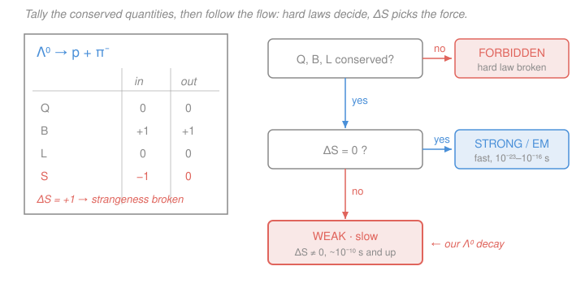

# Nuclear & Particle Physics · Lesson 4.2: Conservation laws & quantum numbers

> ⏱ ~15 min · Module 4: Particles, symmetries & the quark model · Builds on: [4.1 The particle zoo](04-01-particle-zoo.md) · Unlocks: [4.3 Parity, charge conjugation & CP](04-03-parity-c-cp.md)

## Why this matters

You now know the bestiary — leptons, mesons, baryons, four forces. But a zoo is not yet a science. The science is this: given *any* proposed reaction or decay, can you say whether nature allows it, and if so, which force does the work and how fast? That single skill — tally a handful of bookkeeping numbers, read off a verdict — is how particle physics was tamed before anyone had a theory. It also solved a genuine 1950s mystery: strange particles that were *born fast* (in $10^{-23}$ s) yet *died slow* (in $10^{-10}$ s), a factor of $10^{13}$ that looked absurd until conservation laws explained it. This is the method behind Boss problem 4.

## The idea

Some quantities are **absolutely conserved**: whatever you start with, you must end with. Others are conserved by *some* forces but violated by others — and *that selective violation is a fingerprint*. If a reaction quietly changes one of these fragile quantities, you know instantly it was the weak force at work, because only the weak force can do that. And the weak force is feeble, so such processes crawl.

So the logic splits in two. First ask: does the reaction break an *ironclad* law — electric charge, baryon number, lepton number? If yes, it simply never happens, no matter the force. If the ironclad laws all survive, ask a second question: does it change **strangeness** (or another flavor)? If not, the strong or electromagnetic force can do it, and it's fast. If strangeness changes, only the weak force can do it, and it's slow. Two questions, three verdicts.

The "made in pairs, decay alone" puzzle falls straight out. Strange particles are *produced* by the strong force, which cannot create net strangeness from nothing — so they come out in pairs of opposite strangeness (**associated production**). But once separated, a lone strange particle has nothing to annihilate against; the only way to shed its strangeness is the weak force, which is slow. Fast birth, slow death, no contradiction.

## The formal version

**The ironclad conservation laws** (hold for *every* interaction — strong, EM, weak):

- **Energy–momentum** and **angular momentum** (from relativity and quantum mechanics).
- **Electric charge** $Q$.
- **Baryon number** $B$: each quark carries $B = +\tfrac13$, each antiquark $B = -\tfrac13$, so every baryon (three quarks) has $B = +1$, every antibaryon $B = -1$, and mesons ($q\bar q$) have $B = 0$. *In words: you can rearrange quarks into new hadrons, but the net count of quarks-minus-antiquarks never changes.*
- **The three lepton numbers** $L_e$, $L_\mu$, $L_\tau$, *each conserved separately*. Assign $L_\ell = +1$ to a lepton and its neutrino ($e^-, \nu_e$), $L_\ell = -1$ to their antiparticles ($e^+, \bar\nu_e$), $0$ to everything non-leptonic.

*In words on lepton number:* in $\beta$ decay $n \to p + e^- + \bar\nu_e$, the electron ($L_e = +1$) is born alongside an **anti**-electron-neutrino ($L_e = -1$) precisely so the books balance — that pairing is *why* the emitted neutral particle must be an antineutrino.

**The fragile quantum number: strangeness** $S$. Assign $S = -1$ to each $s$ quark ($S = +1$ to each $\bar s$), $S = 0$ otherwise. (Charm, bottom, top get their own analogous flavor numbers.) The rule:

$$\text{Strong and EM: } \Delta S = 0. \qquad \text{Weak: } \Delta S = 0 \text{ or } \pm 1.$$

*In words: the strong and electromagnetic forces cannot change quark flavor, so strangeness is frozen; only the weak force can turn one flavor into another, and when it does, $|\Delta S| = 1$ per step.* So $\Delta S \neq 0$ is a guarantee of the weak force.

**Timescales** (the payoff): the force that mediates a process sets its rough lifetime.

| Force | Conserves | Typical lifetime |
|---|---|---|
| Strong | everything, incl. flavor | $\sim 10^{-23}\ \text{s}$ |
| Electromagnetic | everything, incl. flavor | $\sim 10^{-16}\ \text{s}$ |
| Weak | may violate flavor ($\Delta S = \pm 1$) | $\gtrsim 10^{-10}\ \text{s}$ |

**Gell-Mann–Nishijima relation.** For any hadron, charge is fixed by three other numbers:

$$Q = I_3 + \frac{B + S}{2} = I_3 + \frac{Y}{2}, \qquad Y \equiv B + S,$$

where $I_3$ is the third component of **isospin** (a label we develop in [4.4](04-04-isospin-flavor-symmetry.md)) and $Y$ is the **hypercharge**. *In words: a particle's electric charge is not independent — it's bolted to its isospin, baryon number, and strangeness.* Check on the proton ($I_3 = +\tfrac12$, $B = 1$, $S = 0$): $Q = \tfrac12 + \tfrac12 = 1$. ✓

**The workflow** (Boss problem 4's method). For a proposed process:
1. Tally $Q$, $B$, $L_e, L_\mu, L_\tau$ on both sides. If any differ → **forbidden**, full stop.
2. If all survive, tally $S$. If $\Delta S = 0$ → **strong or EM**, fast. If $\Delta S = \pm 1$ → **weak**, slow.

## Picture

## Worked examples

**Example 1 (mechanical — two decays, side by side).** Classify $\Delta^{++} \to p\,\pi^+$ and $\Lambda^0 \to p\,\pi^-$.

Quark content: $\Delta^{++} = uuu$ ($Q=+2, B=1, S=0$); $\Lambda^0 = uds$ ($Q=0, B=1, S=-1$); $p = uud$ ($+1,1,0$); $\pi^+ = u\bar d$ ($+1,0,0$); $\pi^- = d\bar u$ ($-1,0,0$).

$\Delta^{++} \to p\,\pi^+$: $\;Q:\ 2 = 1+1$ ✓, $\;B:\ 1 = 1+0$ ✓, $\;L:\ 0=0$ ✓, $\;S:\ 0 = 0+0$, so $\Delta S = 0$. All ironclad laws hold *and* strangeness is conserved → **strong**, lifetime $\sim 10^{-23}$ s. (The $\Delta$ is indeed a resonance, gone in $\sim 5\times10^{-24}$ s.)

$\Lambda^0 \to p\,\pi^-$: $\;Q:\ 0 = 1 + (-1)$ ✓, $\;B:\ 1 = 1$ ✓, $\;L:\ 0=0$ ✓, but $\;S:\ -1 \to 0$, so $\Delta S = +1$. Ironclad laws hold, strangeness broken → **weak**, lifetime $\gtrsim 10^{-10}$ s. (Measured: $2.6\times10^{-10}$ s.) Two decays that look almost identical on paper differ in lifetime by a factor of $10^{13}$ — because one changes strangeness and one doesn't.

**Example 2 (why you'd care — associated production and the long-lifetime puzzle).** Fire a $\pi^-$ at a proton. You observe

$$\pi^- + p \to K^0 + \Lambda^0 \quad(\text{copiously}), \qquad \pi^- + p \not\to \pi^0 + \Lambda^0 \quad(\text{never, strongly}).$$

Both conserve $Q$ ($-1+1 = 0$) and $B$ ($0+1 = 1$). The difference is strangeness. Initial $S = 0$. For $K^0 + \Lambda^0$: $K^0 = d\bar s$ has $S = +1$, $\Lambda^0$ has $S = -1$, net $S = 0$ — **conserved**, so the strong force makes it, fast and often. For $\pi^0 + \Lambda^0$: net $S = 0 + (-1) = -1 \neq 0$ — the strong force *cannot* produce it. Strange particles are therefore born **in pairs of canceling strangeness** (associated production).

Now the pair separates. The lone $\Lambda^0$ would love to decay, but every strong/EM channel would need $\Delta S = 0$, and there's no other strange particle around to cancel against — so it's stuck with only the weak channel $\Lambda^0 \to p\,\pi^-$ ($\Delta S = 1$). Hence it is *made* by the strong force in $10^{-23}$ s but *decays* by the weak force in $10^{-10}$ s. The paradox that baffled physicists for years is just the two-question workflow read twice.

## Watch out

- **You might think $\Delta S = 0$ proves the process is strong or EM.** It proves only that strangeness didn't *block* the strong/EM channel. The weak force also allows $\Delta S = 0$ — ordinary $\beta$ decay $n \to p\,e^-\bar\nu_e$ is weak yet has $\Delta S = 0$ (it changes a $d$ quark to a $u$, no strangeness involved). The airtight statement is one-directional: $\Delta S \neq 0 \Rightarrow$ **weak, guaranteed**; but $\Delta S = 0$ leaves all three forces on the table (final-state neutrinos or a slow rate then flag the weak ones).
- **You might lump all leptons into one conserved number.** They're conserved *family by family*. A hypothetical $\mu^- \to e^- \gamma$ conserves total lepton number ($1 = 1$) but violates $L_\mu$ ($1 \to 0$) and $L_e$ ($0 \to 1$) — and is indeed never seen.
- **You might forget that antiparticles flip the sign of $B$, $L$, and $S$.** An $\bar s$ quark has $S = +1$, not $-1$; an antiproton has $B = -1$. Getting a sign wrong here turns an allowed reaction into a "forbidden" one and vice-versa.
- **Gell-Mann–Nishijima is not a dynamical law** — it's a bookkeeping identity that *defines* consistent quantum-number assignments. It won't tell you if a reaction happens; it tells you a particle's charge given its other labels.

## One-liner

> Ironclad laws ($Q$, $B$, $L_e, L_\mu, L_\tau$) decide *allowed vs forbidden*; strangeness decides *which force* — $\Delta S \neq 0$ means the weak force did it, and slowly.

## Problems

**P1 (🟢)** For each process, tally the conserved quantities and give the verdict — forbidden, or (if allowed) which force and the rough lifetime scale.
(a) $\Sigma^- \to n + \pi^-$, where $\Sigma^- = dds$ ($Q=-1, B=1, S=-1$).
(b) $p \to e^+ + \gamma$.
(c) $\Delta^0 \to p + \pi^-$, where $\Delta^0 = udd$ ($Q=0, B=1, S=0$).

**P2 (🟡)** The cascade baryon $\Xi^-$ has isospin $I_3 = -\tfrac12$, baryon number $B = 1$, and strangeness $S = -2$. (a) Use Gell-Mann–Nishijima to find its charge $Q$. (b) It decays via $\Xi^- \to \Lambda^0 + \pi^-$. Which force, and why can't it instead go straight to $n + \pi^-$ by the strong force?

**P3 (🔴, optional)** A neutral kaon $K^0 = d\bar s$ is produced abundantly in strong collisions yet lives $\sim 9\times10^{-11}$ s (for the short-lived state). (a) What is its strangeness? (b) Its main decay is $K^0 \to \pi^+ + \pi^-$. Show the ironclad laws hold, find $\Delta S$, and name the force. (c) In one sentence, explain the long lifetime using associated production.

Solutions

**P1**
(a) $\Sigma^- \to n + \pi^-$. $n = udd$ ($0,1,0$), $\pi^- = d\bar u$ ($-1,0,0$). $Q: -1 = 0 + (-1)$ ✓; $B: 1 = 1 + 0$ ✓; $L: 0 = 0$ ✓; $S: -1 \to 0$, so $\Delta S = +1$. Ironclad laws hold, strangeness changes → **weak**, lifetime $\gtrsim 10^{-10}$ s. (Measured $\Sigma^-$: $1.5\times10^{-10}$ s. ✓)
(b) $p \to e^+ + \gamma$. $Q: +1 = +1 + 0$ ✓, but $B: 1 \to 0$ — baryon number **broken**; also $L_e: 0 \to -1$ broken. → **Forbidden** by baryon (and lepton) number. This is exactly why the proton is stable — there is no lighter state it can decay into without breaking $B$.
(c) $\Delta^0 \to p + \pi^-$. $Q: 0 = 1 + (-1)$ ✓; $B: 1 = 1$ ✓; $L: 0=0$ ✓; $S: 0 = 0$, $\Delta S = 0$. All conserved including strangeness → **strong**, lifetime $\sim 10^{-23}$ s.

*Check.* Order of magnitude: (a) and (c) differ only by whether an $s$ quark must change — the $10^{13}$ lifetime gap between $\Sigma^-$ and $\Delta^0$ is the strong-vs-weak signature, consistent with Example 1's $\Lambda$/$\Delta$ pair. (b)'s forbiddenness matches the observed proton lifetime bound ($> 10^{34}$ yr). ✓

**P2**
(a) $Q = I_3 + \dfrac{B+S}{2} = -\dfrac12 + \dfrac{1 + (-2)}{2} = -\dfrac12 - \dfrac12 = -1.$ So the $\Xi^-$ has charge $-1$, matching its name. ✓
(b) $\Xi^- \to \Lambda^0 + \pi^-$: $S$ goes $-2 \to (-1) + 0 = -1$, so $\Delta S = +1$ → **weak**, slow. A direct $\Xi^- \to n + \pi^-$ would need $S: -2 \to 0$, i.e. $|\Delta S| = 2$. The weak force changes strangeness only one unit per step, so $|\Delta S| = 2$ is hugely suppressed; the $\Xi$ must "climb down" one strangeness unit at a time ($\Xi \to \Lambda \to N$). The strong force can't do it at all ($\Delta S \neq 0$).

*Check.* Both hard laws are fine in the direct route ($Q: -1 = 0 + (-1)$, $B: 1 = 1$), so the *only* thing forbidding the fast strong route is strangeness — confirming that $\Delta S$, not $Q$ or $B$, is what makes cascades decay in steps. ✓

**P3**
(a) $K^0 = d\bar s$: the $\bar s$ carries $S = +1$, so $S(K^0) = +1$.
(b) $K^0 \to \pi^+\pi^-$: $\pi^+ = u\bar d$ ($+1,0,0$), $\pi^- = d\bar u$ ($-1,0,0$). $Q: 0 = +1 + (-1)$ ✓; $B: 0 = 0$ ✓; $L: 0=0$ ✓. $S: +1 \to 0$, so $\Delta S = -1$ → **weak**.
(c) It's *made* strongly in pairs of canceling strangeness (associated production, e.g. alongside a $\Lambda^0$ of $S = -1$), but once alone it can shed its single unit of strangeness only through the slow weak force — fast birth, slow death.

*Check.* $\Delta S = -1$ (one unit) is consistent with a single weak step, and the resulting $\sim10^{-10}$ s scale matches the table. ✓

## Flashback

**From Lesson 4.1 (The particle zoo):** The $\Sigma^+$ is a charged particle of mass $1189\ \text{MeV}$ containing one strange quark. Is it a lepton, a meson, or a baryon? Which of the four fundamental forces can act on it?

Solution

Mass on the order of a nucleon ($\sim 1\ \text{GeV}$) and, more decisively, containing quarks means it is a **hadron**; "one strange quark" together with a baryon-scale mass marks it as a three-quark state ($\Sigma^+ = uus$), so it is a **baryon** ($B = +1$), not a meson ($q\bar q$, $B=0$) or a lepton (no quarks at all). Forces: it is made of quarks → feels the **strong** force; it is electrically charged → feels **electromagnetism**; every particle feels **gravity**; and it can decay ($\Sigma^+ \to p\,\pi^0$) → feels the **weak** force. So the $\Sigma^+$ feels **all four**.

*Check.* Consistent with this lesson: its dominant decay is weak (it changes an $s$ to a lighter quark, $\Delta S = 1$), which is why the $\Sigma^+$ lives $\sim 0.8\times10^{-10}$ s rather than $10^{-23}$ s. ✓

## Connections

- **Backward:** [4.1](04-01-particle-zoo.md) sorted particles into leptons/mesons/baryons and named the four forces; this lesson supplies the *rules of engagement* — the quantum numbers that turn that taxonomy into predictions of what can happen.
- **Forward:** [4.3](04-03-parity-c-cp.md) adds the *discrete* symmetries $P$, $C$, $CP$ — more quantities that the strong and EM forces respect but the weak force violates (the same "weak force breaks the rules" theme, now for mirror symmetry). [4.4](04-04-isospin-flavor-symmetry.md) derives $I_3$ and hypercharge, completing Gell-Mann–Nishijima; and the whole method is the engine of **Boss problem 4**.
- **Sideways:** every conservation law here is the shadow of a *symmetry* (Noether's theorem) — charge $\leftrightarrow$ gauge symmetry, energy–momentum $\leftrightarrow$ spacetime translations — a bridge developed in [`quantum-mechanics`](../../quantum-mechanics/syllabus.md) and made dynamical in [`qft`](../../qft/syllabus.md). Whether a decay is even *kinematically* allowed (enough rest energy to go) is the invariant-mass bookkeeping of [`relativity`](../../relativity/syllabus.md); the weak-force flavor changes seen here are explained by $W$/$Z$ exchange in Module 5.
