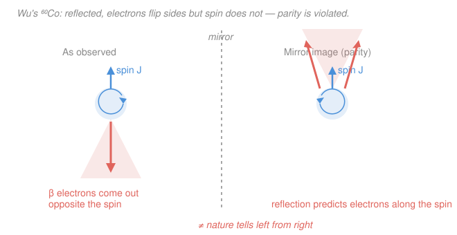

# Nuclear & Particle Physics · Lesson 4.3: Parity, charge conjugation & CP

> ⏱ ~15 min · Module 4: Particles, symmetries & the quark model · Builds on: [4.2 Conservation laws & quantum numbers](04-02-conservation-laws-quantum-numbers.md) · Unlocks: [4.4 Isospin & flavor symmetry](04-04-isospin-flavor-symmetry.md)

## Why this matters

The conservation laws of [4.2](04-02-conservation-laws-quantum-numbers.md) came from *continuous* symmetries (shift the phase, get charge). This lesson is about three **discrete** symmetries — a mirror, an antimatter swap, a rewound clock — and the astonishing 20th-century discovery that nature is *not* symmetric under them. The strong and electromagnetic forces play fair; the weak force does not. It tells left from right, it tells matter from antimatter, and that second fact is very likely why you exist at all: a perfectly symmetric Big Bang would have annihilated itself back to pure light. The tiny asymmetry that left a residue of matter is written in the language of this lesson.

## The idea

Three operations, each its own kind of "flip":

- **Parity $P$** — invert space, $\mathbf{r}\to-\mathbf{r}$. This is the *mirror world*: look at your experiment in a mirror (a reflection is just $P$ followed by a rotation) and ask whether what you see could also happen for real.
- **Charge conjugation $C$** — replace every particle by its antiparticle, leaving momenta and spins alone. This is the *antiworld*.
- **Time reversal $T$** — run the movie backward, $t\to-t$. This is the *backward clock*.

For decades everyone assumed all three were exact — that the mirror image of any real process is another real process, and likewise for the antiworld and the backward clock. Reasonable, and *true for gravity, electromagnetism, and the strong force*. Then in 1956 two theorists noticed nobody had ever actually **tested** it for the weak force. Within a year the mirror shattered: the weak interaction violates parity **maximally**. It was the biggest surprise in modern physics, and it forced a rebuild of how we think about symmetry.

The escape hatch people reached for was to combine operations. Maybe the mirror alone is broken, but *mirror + antiworld together* ($CP$) is exact? That held up beautifully for eight years — until it, too, cracked, just barely, in the neutral kaons. What survives, as far as anyone can measure, is all three at once: $CPT$.

## The formal version

**Intrinsic parity.** Apply $P$ to a single particle at rest and you get the *same* particle back, times a sign:
$$P\,|\psi\rangle = \eta_P\,|\psi\rangle,\qquad \eta_P=\pm 1.$$
*In words: a particle carries a built-in "parity charge" of $+1$ or $-1$, like a hidden coin.* By convention quarks (and the proton) have $\eta_P=+1$; antiparticles of fermions get the *opposite* sign to their partner, so the antiproton has $\eta_P=-1$. The photon has $\eta_P=-1$. The pions are **pseudoscalars**: $\eta_P(\pi)=-1$ (in particular $\pi^0$ has $P=-1$).

**Parity of a composite system** multiplies the intrinsic parts and adds the *orbital* piece. Two particles $a,b$ with relative orbital angular momentum $\ell$ have total parity
$$P = \eta_P(a)\,\eta_P(b)\,(-1)^{\ell}.$$
*In words: each spatial "lobe" of orbital motion contributes a factor $(-1)^\ell$, because the spherical harmonic $Y_\ell^m(-\hat r)=(-1)^\ell Y_\ell^m(\hat r)$.* For a single wavefunction, $P$ just means "replace $\mathbf r$ by $-\mathbf r$": if $\psi(-\mathbf r)=+\psi(\mathbf r)$ it is **even** ($P=+1$), if $\psi(-\mathbf r)=-\psi(\mathbf r)$ it is **odd** ($P=-1$).

**$C$-parity** is an eigenvalue only for a system that is its *own* antiparticle (net charge, baryon number, strangeness all zero). The photon has $\eta_C=-1$ (the electromagnetic field flips sign when every charge flips), and a system of $n$ photons has $C=(-1)^n$. The $\pi^0$ has $\eta_C=+1$.

**Parity violation, made concrete.** Build the observable $\langle \boldsymbol{\sigma}\cdot\mathbf p\rangle$ — the correlation of a particle's spin with its momentum (its **helicity**). Under $P$, momentum $\mathbf p$ (a polar vector) reverses but spin $\boldsymbol\sigma$ (an axial vector, a little rotation) does *not*. So $\boldsymbol\sigma\cdot\mathbf p$ is a **pseudoscalar**: it changes sign under $P$.
$$P\ \text{a symmetry} \Longrightarrow \langle\boldsymbol\sigma\cdot\mathbf p\rangle = 0.$$
*In words: a parity-respecting world cannot prefer "spin along motion" over "spin against motion" — the two are mirror images.* Any measured nonzero helicity preference is a smoking gun for parity violation, and hence for the weak force.

**The CPT theorem.** In any local, Lorentz-invariant quantum field theory, the combined operation $C\!\cdot\!P\!\cdot\!T$ is an *exact* symmetry.
$$CPT\ \text{exact}\quad\Longrightarrow\quad CP\ \text{violated}\ \Longleftrightarrow\ T\ \text{violated}.$$
*In words: the mirror, the antiworld, and the backward clock are each imperfect symmetries, but doing all three together is exact* — so any breakdown of $CP$ must be matched by an equal breakdown of $T$. (A corollary: particle and antiparticle must have *exactly* equal mass and lifetime.)

## Picture

## The two stories you must know

**Wu, 1957 — parity dies.** Chien-Shiung Wu cooled ${}^{60}_{27}\mathrm{Co}$ to near absolute zero in a strong magnetic field so the nuclear spins lined up, and watched the $\beta^-$ electrons from ${}^{60}\mathrm{Co}\to{}^{60}\mathrm{Ni}+e^-+\bar\nu_e$. The electrons came out **preferentially opposite the nuclear spin** — a large, nonzero $\langle\boldsymbol\sigma\cdot\mathbf p\rangle$. In the mirror the spin (axial) still points up while the electron momenta (polar) flip to point up too, so the mirror image is a *different* experiment (electrons along the spin) — one that nature does not produce. Parity is violated, and not by a little: **maximally**. The deep reason is helicity — the neutrino emitted is essentially **left-handed** (spin antiparallel to momentum), and there is no right-handed neutrino for the mirror process to use. Because $C$ turns a (real) left-handed neutrino into a (nonexistent) left-handed *antineutrino*, the weak force violates $C$ maximally too.

**Cronin & Fitch, 1964 — $CP$ cracks.** Salvation seemed to lie in $CP$: apply $C$ *and* $P$ to a left-handed neutrino and you get a **right-handed antineutrino** — which *does* exist. So $CP$ maps real weak processes to real ones; hope restored. The neutral kaons test it cleanly. The long-lived $K^0_L$ was expected to be a pure $CP=-1$ state, forbidden from decaying to two pions (a $CP=+1$ final state). Cronin and Fitch found that about $2$ in $1000$ $K_L$ decays go to $\pi^+\pi^-$ anyway. Small, but nonzero: **$CP$ is violated.** By CPT this means time reversal is violated too. And $CP$ violation is one of the three **Sakharov conditions** needed to grow a matter–antimatter imbalance from a symmetric start — the thread we pick up in [5.5](05-05-beyond-standard-model.md).

## Worked examples

**Example 1 (parity of a decay — does the strong force allow it?).** The $\rho^0$ meson has $J^P=1^-$ and decays strongly to $\pi^+\pi^-$. Check parity. Each pion has $\eta_P=-1$, and to carry the parent's spin $J=1$ with two spin-0 pions the orbital angular momentum must be $\ell=1$. So
$$P(\pi^+\pi^-)=\eta_P(\pi^+)\,\eta_P(\pi^-)\,(-1)^{\ell}=(-1)(-1)(-1)^1=-1,$$
matching the $\rho^0$'s $P=-1$. Parity is conserved, consistent with a strong decay. *The strong force plays by the mirror's rules.*

**Example 2 ($C$ on a neutral system — why $\pi^0\to\gamma\gamma$ and not $\gamma\gamma\gamma$).** The $\pi^0$ has $\eta_C=+1$. A state of $n$ photons has $C=(-1)^n$. Charge conjugation is respected by electromagnetism, so the decay's $C$ must match:
$$\pi^0\to\gamma\gamma:\quad C_i=+1,\ C_f=(-1)^2=+1\quad(\text{allowed})\qquad\qquad \pi^0\to\gamma\gamma\gamma:\quad C_f=(-1)^3=-1\ne +1\quad(\text{forbidden}).$$
So the two-photon mode is allowed and the three-photon mode is **forbidden by $C$** — and indeed $\pi^0\to3\gamma$ has never been seen (limit below $10^{-8}$ of decays). One clean quantum number kills an entire channel.

## Watch out

- **You might think parity is "just left–right mirror flip."** A plane mirror reverses only one axis; true $P$ reverses all three, $\mathbf r\to-\mathbf r$. But $P=(\text{one-axis mirror})\times(\text{180° rotation})$, and since rotations are always symmetries, testing the mirror image *is* testing $P$. That's why "mirror world" is a fair shorthand.
- **You might assign a $C$-parity to a charged particle.** Don't — $C$ turns $\pi^+$ into $\pi^-$, a *different* state, so $\pi^\pm$ are not $C$ eigenstates and have no $C$-parity. Only genuinely self-conjugate systems ($\gamma$, $\pi^0$, positronium, $\pi^+\pi^-$ as a pair) get one.
- **You might think "$CP$ is violated" means the weak force is a mess of broken symmetries.** $CP$ violation is *tiny* ($\sim10^{-3}$ in kaons), unlike the *maximal* violation of $P$ and $C$ separately. And $CPT$ remains, as far as every experiment can tell, perfectly exact.

## One-liner

> The weak force breaks the mirror ($P$) and the antiworld ($C$) completely and even the combined $CP$ a little — but $CPT$, the mirror-antiworld-backward-clock done together, stays exact, and that leftover $CP$ crack is why matter outlived antimatter.

## Problems

**P1 (🟢)** A particle sits in the state $\psi(\mathbf r)=R(r)\,Y_2^0(\theta,\phi)$ and has intrinsic parity $\eta_P=+1$. What is the total parity of the state? What if it were in $Y_3^0$ instead?

**P2 (🟡)** In the decay $\pi^+\to\mu^+\nu_\mu$, the emitted $\mu^+$ is observed to come out with its spin preferentially *along* its momentum — a nonzero $\langle\boldsymbol\sigma\cdot\mathbf p\rangle$. Explain, in terms of how $\boldsymbol\sigma$ and $\mathbf p$ transform under $P$, why this single observation proves the decay violates parity — and therefore which of the four forces is responsible.

**P3 (🔴, optional)** The $\Lambda^0$ (a baryon with $J^P=\tfrac12^+$) decays via $\Lambda^0\to p+\pi^-$, with the proton at $J^P=\tfrac12^+$ and the pion at $0^-$. Show that *if parity were conserved* the proton–pion relative orbital angular momentum $\ell$ would be pinned to a single value. Experimentally, both $\ell=0$ (s-wave) and $\ell=1$ (p-wave) amplitudes are present. What does that prove, and which force mediates the decay?

Solutions

**P1** Total parity multiplies the intrinsic parity by the orbital factor $(-1)^\ell$, since $Y_\ell^m(-\hat r)=(-1)^\ell Y_\ell^m(\hat r)$. For $\ell=2$:
$$P=\eta_P\,(-1)^\ell=(+1)(-1)^2=+1.$$
For $\ell=3$: $P=(+1)(-1)^3=-1$. *Check.* $Y_2^0\propto(3\cos^2\theta-1)$ is even under $\hat r\to-\hat r$ (i.e. $\theta\to\pi-\theta$), consistent with $P=+1$; $Y_3^0\propto(5\cos^3\theta-3\cos\theta)$ is odd, consistent with $P=-1$. The rule and the explicit functions agree. ✓

**P2** Under parity, momentum is a polar vector and reverses, $\mathbf p\to-\mathbf p$, while spin is an axial vector and is unchanged, $\boldsymbol\sigma\to+\boldsymbol\sigma$. Hence the helicity correlation is a pseudoscalar: $\boldsymbol\sigma\cdot\mathbf p\to-\boldsymbol\sigma\cdot\mathbf p$. If the interaction respected parity, the mirror process (spin *against* momentum) would occur equally often, forcing $\langle\boldsymbol\sigma\cdot\mathbf p\rangle=0$. A measured *nonzero* value means the mirror-image rate differs from the real rate — parity is violated. Only the **weak** force violates parity (the strong and EM forces conserve it, and gravity is irrelevant here), so this must be a weak decay — as it is, a $\pi^+$ decaying through a virtual $W^+$. *Check.* Consistent with the general fact that neutrinos are produced with definite handedness; a definite-helicity final state is exactly a nonzero pseudoscalar observable. ✓

**P3** Parity of the final state is
$$P(p\,\pi^-)=\eta_P(p)\,\eta_P(\pi^-)\,(-1)^\ell=(+1)(-1)(-1)^\ell=(-1)^{\ell+1}.$$
Angular momentum: the proton (spin $\tfrac12$) and spin-0 pion must combine with orbital $\ell$ to give the parent's $J=\tfrac12$, which allows $\ell=0$ or $\ell=1$. If parity were conserved we would also need $P(p\,\pi^-)=\eta_P(\Lambda^0)=+1$, i.e. $(-1)^{\ell+1}=+1\Rightarrow \ell$ odd $\Rightarrow \ell=1$ only. So parity conservation would permit **p-wave alone**. The observed presence of *both* s-wave ($\ell=0$) and p-wave ($\ell=1$) — states of opposite parity — means the final state has no definite parity: **parity is violated**, so the decay is mediated by the **weak** force. *Check.* Consistent with the strangeness change $\Delta S=1$ (the $\Lambda^0$ carries $S=-1$, the final $p\,\pi^-$ has $S=0$), another weak-force signature from [4.2](04-02-conservation-laws-quantum-numbers.md), and with the $\Lambda^0$'s long $\sim10^{-10}\,\text{s}$ lifetime. ✓

## Flashback

**From Lesson 4.2 (Conservation laws & quantum numbers):** Consider the decay $K^+\to\mu^+\nu_\mu$. Check whether it conserves electric charge, baryon number, and lepton number. The $K^+$ carries strangeness $S=+1$; is strangeness conserved, and what does your answer tell you about which force mediates the decay?

Solution

Take each additive quantum number in turn.
- **Charge:** $+1\to(+1)+0=+1$. Conserved ✓.
- **Baryon number:** the $K^+$ is a meson ($B=0$); $\mu^+$ and $\nu_\mu$ are leptons ($B=0$). $0\to0$ ✓.
- **Lepton number:** $\mu^+$ is an antilepton ($L=-1$), $\nu_\mu$ a lepton ($L=+1$); total $-1+1=0$, matching the $K^+$'s $L=0$ ✓ (and the muon-family numbers balance: $L_\mu=-1$ for $\mu^+$, $+1$ for $\nu_\mu$).
- **Strangeness:** initial $S=+1$, final state has no strange quarks, $S=0$. So $\Delta S=-1\ne0$ — **strangeness is not conserved.**

Strangeness is violated by exactly one unit, and a neutrino appears in the final state — both are hallmarks of the **weak** interaction. (Charge, baryon, and lepton number are respected by *all* forces, so they can't single one out; strangeness is the discriminator.) Consistently, the $K^+$ lives $\sim1.2\times10^{-8}\,\text{s}$, a typical weak-decay lifetime. *Check.* A strong or electromagnetic decay would conserve strangeness; only the weak force changes flavor, so the nonzero $\Delta S$ correctly forces the "weak" conclusion. ✓

## Connections

- **Backward:** [4.2](04-02-conservation-laws-quantum-numbers.md) gave the *additive*, continuous-symmetry conservation laws (charge, baryon/lepton number, strangeness) and the rule that strong/EM conserve strangeness while the weak force need not. This lesson adds the *discrete*, multiplicative ones ($P$, $C$) and the same punchline from a new angle: the weak force is the rule-breaker.
- **Forward:** parity violation is not a quirk but the *defining structure* of [5.1 The weak interaction](05-01-weak-interaction.md) — the $W$ boson couples only to left-handed particles — and $CP$ violation enters there through quark mixing (the CKM phase). The matter–antimatter puzzle it opens is a headline of [5.5 Beyond the Standard Model](05-05-beyond-standard-model.md).
- **Sideways:** the parity of a state is built from the spherical harmonics $Y_\ell^m$ and angular-momentum addition you met in [`quantum-mechanics`](../../quantum-mechanics/syllabus.md); helicity and the transformation of vectors vs. axial vectors lean on the four-vector machinery of [`relativity`](../../relativity/syllabus.md). The exactness of $CPT$ is a theorem *of* quantum field theory, proved (not assumed) in [`qft`](../../qft/syllabus.md).
