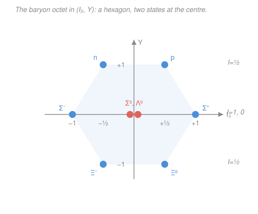

# Nuclear & Particle Physics · Lesson 4.4: Isospin & flavor symmetry

> ⏱ ~15 min · Module 4: Particles, symmetries & the quark model · Builds on: [4.3 Parity, charge conjugation & CP](04-03-parity-c-cp.md), [`quantum-mechanics` syllabus](../../quantum-mechanics/syllabus.md) · Unlocks: [4.5 The quark model & QCD](04-05-quark-model-qcd.md)

## Why this matters

The proton and neutron have almost the same mass (938.3 vs 939.6 MeV) and, as far as the strong force can tell, behave *identically*. That is not a coincidence — it is a **symmetry**, and symmetries in physics are prediction machines. Heisenberg's insight was that the strong force sees proton and neutron as two faces of one particle, related by an internal rotation with the exact same mathematics as spin. Push that idea and you get for free: a rule for grouping the particle zoo into families, a formula tying charge to other quantum numbers, and honest numerical predictions for reaction rates — the famous 3-to-1 ratio of pion–proton cross-sections, computed with nothing but the angular-momentum algebra you already know. The pattern this exposes is the last clue before the quark model ([4.5](04-05-quark-model-qcd.md)) explains *why*.

## The idea

Imagine the strong force is colorblind to electric charge. Then the proton and neutron are like a single coin — the **nucleon** — that can land heads or tails. Nothing about the strong interaction changes if you flip the coin; the two states are interchangeable. Physicists give the coin an abstract "spin" living in an internal space (not real 3D space): call it **isospin**. Just as an electron's spin-½ has two states ($\uparrow$, $\downarrow$), the nucleon's isospin-½ has two states, and we *label* proton = up, neutron = down.

The payoff is that this internal "spin" obeys the **identical algebra** to ordinary angular momentum. Everything you learned about adding spins — total quantum number, projections, Clebsch–Gordan coefficients — transfers verbatim (see [`quantum-mechanics`](../../quantum-mechanics/syllabus.md), Module 4). So particles come in **multiplets**: families of nearly-equal mass that are just different projections of the same isospin. The nucleon is a doublet; the pions ($\pi^+,\pi^0,\pi^-$) form a triplet. And because the strong force conserves isospin, reactions that look different are secretly the same rotated state — which lets you *predict their relative rates*.

## The formal version

**Isospin as SU(2).** Assign each strongly-interacting particle a total isospin $I$ and a third component $I_3$, exactly as spin has $s$ and $m_s$. A multiplet of isospin $I$ has $2I+1$ members with

$$I_3 = -I,\,-I+1,\,\dots,\,+I.$$

*In words: fix $I$, and the members are the $2I+1$ "orientations" of the internal spin, just like a spin-$I$ state has $2I+1$ values of $m$.* The operators $\hat I^2, \hat I_3, \hat I_\pm$ satisfy the same commutation relations as $\hat J^2, \hat J_z, \hat J_\pm$; there is nothing new to derive.

- **Nucleon** — doublet, $I=\tfrac12$: proton $I_3=+\tfrac12$, neutron $I_3=-\tfrac12$.
- **Pion** — triplet, $I=1$: $\pi^+$ ($I_3=+1$), $\pi^0$ ($I_3=0$), $\pi^-$ ($I_3=-1$).

Members of a multiplet are **degenerate** under the strong force; the small mass splittings you actually see come from electromagnetism (charged vs neutral) plus the tiny up/down quark mass difference — both invisible to isospin.

**Isospin is conserved by the strong interaction.** So in a strong process you may *add isospin like angular momentum* and use Clebsch–Gordan coefficients to relate amplitudes. Combining a pion ($I=1$) with a nucleon ($I=\tfrac12$) decomposes as

$$1 \otimes \tfrac12 = \tfrac32 \oplus \tfrac12.$$

*In words: a pion–nucleon state is a mix of a total-isospin-$\tfrac32$ piece and a total-isospin-$\tfrac12$ piece — and the strong force acts separately within each.* This single fact produces the $3{:}1$ cross-section ratio below.

**The Gell-Mann–Nishijima relation.** Once strangeness $S$ enters (from [4.2](04-02-conservation-laws-quantum-numbers.md)), electric charge is fixed by isospin and one more number, the **hypercharge** $Y$:

$$Q = I_3 + \frac{Y}{2}, \qquad Y = B + S,$$

with $B$ the baryon number. *In words: a particle's charge is just its isospin projection plus half its hypercharge — charge is not independent, it is bookkeeping on $I_3$, $B$, and $S$.* (Here $Q$ is in units of the elementary charge $e$.) Check the proton: $B=1$, $S=0$, so $Y=1$, and $Q=\tfrac12+\tfrac12=1$. ✓

**From SU(2) to SU(3) — the eightfold way.** Isospin is an SU(2) symmetry of the $(u,d)$ pair. Add the strange quark and you *approximately* extend to an SU(3) symmetry of $(u,d,s)$. Now each particle carries two labels, $I_3$ and $Y$, so multiplets become **2D patterns** on the $(I_3, Y)$ plane. The eight lightest spin-½ baryons fall onto a hexagon with a doubly-occupied center — the **baryon octet** — and the spin-$\tfrac32$ baryons fill a **decuplet** triangle. The SU(3) breaking is larger than isospin's (the strange quark is heavier), so these families are only *roughly* degenerate — but the geometry is exact, and a gap in the decuplet predicted a missing particle before it was seen.

## Picture

Each *horizontal row* (fixed $Y$) is an ordinary isospin multiplet: the top and bottom rows are $I=\tfrac12$ doublets ($n,p$ and $\Xi^-,\Xi^0$), the middle is an $I=1$ triplet ($\Sigma^\pm,\Sigma^0$) plus an $I=0$ singlet ($\Lambda^0$) sitting at the same central point. The decuplet is the analogous triangle — and its lonely bottom vertex, $S=-3$, is the $\Omega^-$.

## Worked examples

**Example 1 (mechanical — isospin and charge of the $\Sigma$ triplet).** The three $\Sigma$ baryons have $B=1$, $S=-1$, so $Y = B+S = 0$. They form an isospin triplet, $I=1$, with $I_3 = +1, 0, -1$. Gell-Mann–Nishijima gives their charges:

$$Q = I_3 + \tfrac{Y}{2} = I_3 + 0 = I_3 \;\Rightarrow\; Q = +1,\,0,\,-1.$$

So $\Sigma^+$ ($I_3=+1$), $\Sigma^0$ ($I_3=0$), $\Sigma^-$ ($I_3=-1$) — matching the observed charges. The $\Lambda^0$ shares $S=-1$, $Y=0$, but is an isospin *singlet* ($I=0$, $I_3=0$), so it too has $Q=0$; that is why it sits alone at the center rather than being a fourth $\Sigma$.

**Example 2 (why you'd care — the 3:1 pion–proton ratio).** Near a beam energy of ~1230 MeV the $\pi N$ cross-section is dominated by a resonance, the $\Delta(1232)$, which has $I=\tfrac32$. A resonance forms only in the channel matching its isospin, so the reaction rate is proportional to how much of the initial state lives in the $I=\tfrac32$ piece.

Take the two beams on a proton target ($I_3^p=+\tfrac12$):

- $\pi^+ p$: $I_3 = 1 + \tfrac12 = +\tfrac32$. The only state with $I_3=+\tfrac32$ is $\left|\tfrac32,+\tfrac32\right\rangle$, so $\pi^+ p$ is **purely** $I=\tfrac32$. Its $I=\tfrac32$ weight is $1$.
- $\pi^- p$: $I_3 = -1 + \tfrac12 = -\tfrac12$, a mix. The Clebsch–Gordan decomposition is

$$\left|\pi^- p\right\rangle = \sqrt{\tfrac13}\left|\tfrac32,-\tfrac12\right\rangle + \sqrt{\tfrac23}\left|\tfrac12,-\tfrac12\right\rangle.$$

Its $I=\tfrac32$ weight is $\left(\sqrt{\tfrac13}\right)^2 = \tfrac13$.

Since only the $I=\tfrac32$ amplitude resonates, the total cross-sections at the peak are in the ratio of these weights:

$$\frac{\sigma(\pi^+ p)}{\sigma(\pi^- p)} = \frac{1}{\,1/3\,} = 3.$$

*Experiment at the $\Delta$ peak gives almost exactly $3{:}1$* — a pure prediction of the internal-spin algebra, with no dynamics at all. That is the power of a conserved symmetry: it constrains rates you cannot compute from first principles.

## Watch out

- **You might think isospin "up" means the particle spins up in space.** It doesn't — isospin lives in an *internal* space with no direction in the lab. It borrows the *mathematics* of angular momentum, not its physical meaning; $I_3$ is a label, not a rotation you can see.
- **You might expect isospin to be exact.** It is only approximate: electromagnetism and the up/down mass difference break it, which is exactly why $\pi^\pm$ and $\pi^0$ (or $p$ and $n$) are not *perfectly* degenerate. SU(3) flavor is broken even more, by the heavier strange quark — the geometry is clean but the masses spread out.
- **You might reach for isospin in a weak decay.** Don't — only the *strong* force conserves isospin (and, separately, strangeness). Weak processes change $S$ and violate isospin freely, so the Clebsch–Gordan trick applies only to strong reactions and resonances.

## One-liner

> Isospin makes the strong force's charge-blindness into an SU(2) symmetry identical to spin, so particles fall into multiplets and their reaction rates follow from Clebsch–Gordan — with $Q = I_3 + (B+S)/2$ tying charge to the pattern that becomes the eightfold way.

## Problems

**P1 (🟢)** The two cascade baryons $\Xi^0$ and $\Xi^-$ have baryon number $B=1$ and strangeness $S=-2$. Find their hypercharge $Y$, assign the multiplet's isospin $I$ and each member's $I_3$, and use Gell-Mann–Nishijima to confirm their charges.

**P2 (🟡)** The $\Delta^+$ resonance has $I=\tfrac32$, $I_3=+\tfrac12$, and decays strongly to a pion plus a nucleon. Using the Clebsch–Gordan decomposition

$$\left|\tfrac32,+\tfrac12\right\rangle = \sqrt{\tfrac23}\,\left|\pi^0 p\right\rangle + \sqrt{\tfrac13}\,\left|\pi^+ n\right\rangle,$$

predict the ratio of branching fractions $\Gamma(\Delta^+ \to p\,\pi^0) : \Gamma(\Delta^+ \to n\,\pi^+)$.

**P3 (🔴, optional)** The baryon decuplet is a triangle on the $(I_3, Y)$ plane; its solitary bottom vertex has strangeness $S=-3$ and is an isospin singlet ($I=0$, so $I_3=0$). With $B=1$, find its hypercharge $Y$ and its charge $Q$. This is the particle whose predicted existence, mass, and charge — read straight off the empty corner of the pattern — were confirmed by its 1964 discovery. Name it.

Solutions

**P1** Hypercharge: $Y = B + S = 1 + (-2) = -1$. Two members $\Rightarrow$ an isospin doublet, $I=\tfrac12$, with $I_3 = +\tfrac12$ and $-\tfrac12$. Charges from $Q = I_3 + Y/2 = I_3 - \tfrac12$:

$$Q(I_3=+\tfrac12) = \tfrac12 - \tfrac12 = 0 \;(\Xi^0), \qquad Q(I_3=-\tfrac12) = -\tfrac12 - \tfrac12 = -1 \;(\Xi^-).$$

*Check.* Both charges come out integer and match the observed $\Xi^0, \Xi^-$; assigning $I_3=+\tfrac12$ to the more positive member is the standard convention. ✓

**P2** Reaction rates are proportional to the squared amplitudes, i.e. the squared Clebsch–Gordan coefficients:

$$\frac{\Gamma(\Delta^+\to p\,\pi^0)}{\Gamma(\Delta^+\to n\,\pi^+)} = \frac{\left(\sqrt{2/3}\right)^2}{\left(\sqrt{1/3}\right)^2} = \frac{2/3}{1/3} = 2.$$

So $\Delta^+ \to p\,\pi^0$ is twice as likely as $\Delta^+ \to n\,\pi^+$, a $2{:}1$ split.

*Check.* The two coefficients-squared sum to $2/3 + 1/3 = 1$, as a properly normalized state must. Both final states have $Q=+1$ and $I_3 = +\tfrac12$ (e.g. $p\,\pi^0$: $+\tfrac12 + 0$), consistent with the parent — a necessary book-keeping check. ✓

**P3** Hypercharge $Y = B + S = 1 + (-3) = -2$. Charge $Q = I_3 + Y/2 = 0 + (-2)/2 = -1$. So the particle has charge $-1$: it is the $\Omega^-$. Gell-Mann predicted it — mass, charge, and strangeness — from the missing vertex before it was found.

*Check.* $S=-3$ means three strange quarks ($sss$), which indeed gives $Q = 3\times(-\tfrac13) = -1$ (a preview of [4.5](04-05-quark-model-qcd.md)) — consistent with Gell-Mann–Nishijima. ✓

## Flashback

**From Lesson 4.2 (Conservation laws & quantum numbers):** Consider two candidate decays that produce the same final state, $p + \pi^-$:

$$\Delta^0 \to p + \pi^-, \qquad \Lambda^0 \to p + \pi^-.$$

The $\Delta^0$ has strangeness $S=0$; the $\Lambda^0$ has $S=-1$. Both proton and $\pi^-$ have $S=0$. Using conservation of strangeness, say which decay proceeds by the **strong** force and which must proceed by the **weak** force, and hence which is far slower.

Solution

Check $\Delta S$ for each:

- $\Delta^0 \to p + \pi^-$: initial $S=0$, final $S=0+0=0$, so $\Delta S = 0$. Strangeness is conserved, so this can go by the **strong** force — and it does, with a lifetime of order $10^{-23}\,\text{s}$ (a true resonance).
- $\Lambda^0 \to p + \pi^-$: initial $S=-1$, final $S=0$, so $\Delta S = +1 \neq 0$. The strong and electromagnetic forces conserve strangeness, so they *forbid* this; only the **weak** force changes $S$. Hence it must be weak, and is dramatically slower — the $\Lambda^0$ lives about $2.6\times10^{-10}\,\text{s}$.

*Check.* The $\sim 10^{13}$ gap in lifetimes is exactly the strong-vs-weak signature from 4.2: a $\Delta S \neq 0$ decay betrays the weak force by being enormously long-lived. ✓ (Note $Y = B + S$ ties this strangeness bookkeeping directly to the hypercharge axis of today's octet.)

## Connections

- **Backward:** this extends the conserved quantum numbers of [4.2](04-02-conservation-laws-quantum-numbers.md) — the Gell-Mann–Nishijima relation $Q = I_3 + (B+S)/2$ *unifies* charge, baryon number, and strangeness into one equation, and isospin conservation is the strong-force selection rule that sits alongside strangeness conservation.
- **Forward:** [4.5 The quark model & QCD](04-05-quark-model-qcd.md) explains the whole pattern — isospin is just $u\leftrightarrow d$ interchange, SU(3) flavor is $(u,d,s)$, and the octet/decuplet geometry falls out of building hadrons as $q\bar q$ and $qqq$. Today's "why" becomes tomorrow's "because quarks."
- **Sideways (quantum mechanics):** the entire computation *is* addition of angular momenta from [`quantum-mechanics`](../../quantum-mechanics/syllabus.md), Module 4 — the decomposition $1\otimes\tfrac12 = \tfrac32\oplus\tfrac12$ and the Clebsch–Gordan coefficients are the same ones used to add a spin-1 and a spin-½; only the physical meaning of the "spin" has changed.
