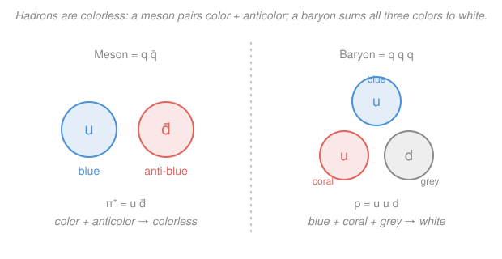

# Nuclear & Particle Physics · Lesson 4.5: The quark model & QCD

> ⏱ ~15 min · Module 4: Particles, symmetries & the quark model · Builds on: [4.4 Isospin & flavor symmetry](04-04-isospin-flavor-symmetry.md), [4.2 Conservation laws & quantum numbers](04-02-conservation-laws-quantum-numbers.md) · Unlocks: [5.1 The weak interaction](05-01-weak-interaction.md)

## Why this matters

In [4.4](04-04-isospin-flavor-symmetry.md) you saw the hadrons fall into neat geometric families — the eightfold way — as if someone had arranged them on graph paper. That regularity begged for an explanation, and the explanation turned out to be the deepest simplification in particle physics: the hundreds of "elementary" hadrons in the mid-century zoo are not elementary at all. They are *made of* a handful of truly fundamental spin-$\tfrac12$ particles — **quarks** — glued together in just two allowed patterns. Once you can spell a hadron in quarks, its charge, baryon number, and strangeness are pure bookkeeping, and the mysterious multiplets of 4.4 become inevitable. This lesson also introduces **color**, the charge of the strong force, which explains why you have never held a single quark in your hand.

## The idea

Think of quarks as an alphabet with six letters, and hadrons as the only two "words" the strong force allows you to spell.

The six letters are the six **flavors**, and they come in three generations of two:

| generation | "up-type" ($Q=+\tfrac23$) | "down-type" ($Q=-\tfrac13$) |
|---|---|---|
| 1 | up ($u$) | down ($d$) |
| 2 | charm ($c$) | strange ($s$) |
| 3 | top ($t$) | bottom ($b$) |

Every quark is a spin-$\tfrac12$ fermion with **fractional electric charge** and baryon number $B=+\tfrac13$; every antiquark flips the sign of both. That fractional charge is the whole trick — it's what lets three quarks add up to an integer-charged proton.

Only two spellings make a real particle:

- **Mesons** $=q\bar q$ — a quark and an antiquark (e.g. $\pi^+ = u\bar d$). Baryon number $\tfrac13 - \tfrac13 = 0$.
- **Baryons** $=qqq$ — three quarks (e.g. proton $= uud$). Baryon number $\tfrac13\times 3 = 1$. Antibaryons are $\bar q\bar q\bar q$.

Why *only* these two? Because of a second, hidden charge called **color**, which every hadron must carry in a neutral ("white") combination — and $q\bar q$ and $qqq$ are exactly the color-neutral options. That constraint is also why you never see a lone quark: the strong force refuses to let color escape.

## The formal version

**Quark quantum numbers.** Each flavor carries fixed additive quantum numbers. The ones we need:

| flavor | $Q$ (charge) | $B$ (baryon) | $S$ (strangeness) |
|---|---|---|---|
| $u$ | $+\tfrac23$ | $+\tfrac13$ | $0$ |
| $d$ | $-\tfrac13$ | $+\tfrac13$ | $0$ |
| $s$ | $-\tfrac13$ | $+\tfrac13$ | $-1$ |
| $c$ | $+\tfrac23$ | $+\tfrac13$ | $0$ |

*In words: strangeness is just a tally — one unit of $-1$ for every $s$ quark* (so $S = N_{\bar s} - N_s$, since each $\bar s$ carries $+1$). The charm, bottom, and top quarks carry their own analogous flavor quantum numbers (charm $C$, etc.), defined the same way. **A hadron's $Q$, $B$, $S$ are the sums of its constituents' — nothing more.** This reproduces the Gell-Mann–Nishijima relation $Q = I_3 + \tfrac12(B+S)$ from [4.4](04-04-isospin-flavor-symmetry.md) automatically, because $I_3 = \tfrac12(N_u - N_d)$ counts up-vs-down content.

**Color charge and QCD.** Each quark carries one of three **color** charges — call them blue, coral, grey (physicists say red, green, blue, but the names are arbitrary labels, not visible colors). Antiquarks carry the anticolors. The strong force is **quantum chromodynamics (QCD)**, mediated by eight **gluons** — and unlike the photon, gluons *themselves carry color*, so they interact with each other. The central rule:

$$\textbf{Every observed hadron is color-neutral ("white").}$$

*In words: nature only lets you see color-blind combinations.* The two ways to be white are exactly:

- **$q\bar q$** — a color plus its anticolor cancel (blue + anti-blue) → a meson.
- **$qqq$** — one quark of each color, blue + coral + grey → white, like adding the three primaries → a baryon.

That is *why* the allowed spellings are $q\bar q$ and $qqq$ and nothing else.

**Color solves the $\Delta^{++}$ puzzle.** The $\Delta^{++}$ baryon is $uuu$ with spin $\tfrac32$ — three *identical* up quarks in the spatial ground state ($L=0$, symmetric) with all three spins aligned ($\uparrow\uparrow\uparrow$, symmetric) and identical flavor (symmetric). For identical fermions the total wavefunction *must be antisymmetric* under exchange (Pauli), yet space $\times$ spin $\times$ flavor is fully **symmetric** — a contradiction that nearly killed the quark model. Color rescues it: the three quarks sit in the **antisymmetric** color combination

$$\tfrac{1}{\sqrt6}\big(rgb - rbg + gbr - grb + brg - bgr\big),$$

so the *complete* wavefunction (space × spin × flavor × color) is antisymmetric after all. The existence of $\Delta^{++}$ is direct evidence that color has (at least) three values.

**Confinement.** The potential energy between a quark and antiquark grows **linearly** with separation,

$$V(r) \approx \sigma r, \qquad \sigma \approx 1\ \text{GeV/fm},$$

where $\sigma$ is the **string tension**. *In words: unlike gravity or electricity, the color force does not weaken with distance* — the field lines bunch into a **flux tube** whose energy climbs without bound. Pull the pair apart and, once you've invested about $2m_qc^2$ of energy, it becomes cheaper to *create a new $q\bar q$ pair* than to stretch the tube further. The tube snaps, capping each broken end with a fresh quark, and you get two mesons instead of a free quark. This is **confinement**: isolated quarks do not exist; a struck quark instead materializes as a collimated spray of hadrons called a **jet**.

**Asymptotic freedom.** The flip side: at very *short* distance (equivalently very high energy or momentum transfer $Q^2$) the strong coupling $\alpha_s(Q^2)$ *shrinks*, so quarks behave as nearly **free** particles. *In words: quarks are shackled at long range but almost loose at short range.* This is why deep-inelastic electron scattering "sees" point-like constituents (**partons**) rattling around loosely inside the proton — the discovery that confirmed quarks are real.

## Picture

## Worked examples

**Example 1 (spell a hadron, read off its numbers).** Take the kaon $K^- = s\bar u$. Add the constituents:

$$Q = \underbrace{-\tfrac13}_{s} + \underbrace{-\tfrac23}_{\bar u} = -1, \quad B = \tfrac13 - \tfrac13 = 0, \quad S = \underbrace{-1}_{s} + \underbrace{0}_{\bar u} = -1.$$

So $K^-$ is a meson ($B=0$) with charge $-1$ and strangeness $-1$ — exactly its measured quantum numbers. Now the $\Lambda^0 = uds$ baryon:

$$Q = \tfrac23 - \tfrac13 - \tfrac13 = 0, \quad B = \tfrac13+\tfrac13+\tfrac13 = 1, \quad S = 0+0-1 = -1.$$

A neutral, strange baryon — right again. The entire "particle zoo" is this arithmetic.

**Example 2 (why confinement gives jets, not quarks).** In a high-energy collision a single $u$ quark is knocked hard out of a proton. Why does the detector never register a lone fractional charge? As the quark flies off, the flux tube behind it stores energy $V(r)\approx \sigma r$. By the time it has traveled even $r\sim 1$ fm, that's $\sim 1$ GeV — comfortably above the $\sim 0.3$ GeV needed to make a light $q\bar q$ pair. The tube snaps into new pairs again and again, and the quark's energy converts into a **jet** of ordinary color-neutral hadrons ($\pi$, $K$, $p$, …) all flying roughly along the original quark's direction. The quark's *existence* is unmistakable — you see the jet — but the quark itself stays hidden. That is confinement made visible.

## Watch out

- **You might think "color" means literal color, or that it's like electric charge with two signs.** It's neither. Color is a strong-force charge with *three* values (plus three anticolors); the visual names are pure convention. Electric charge has one type ($+/-$); color has three, which is why its neutral states are richer ($q\bar q$ *and* $qqq$).
- **You might think you could isolate a quark with enough energy.** More energy makes *more hadrons*, not a free quark — the extra energy goes into creating pairs, not liberating one. Confinement is not a practical limit you can push past; it's built into QCD.
- **You might add strangeness with the wrong sign.** By historical convention the $s$ *quark* has $S=-1$ (and $\bar s$ has $S=+1$). So a hadron *containing* an $s$ has *negative* strangeness. Kaons like $K^+ = u\bar s$ have $S=+1$; the $\Lambda,\Sigma,\Xi$ baryons have negative $S$.

## One-liner

> Hadrons are just quarks spelled two ways — $q\bar q$ mesons and $qqq$ baryons — and the color charge that forces those spellings also chains quarks inside, so you get jets, never a bare quark.

## Problems

**P1 (🟢)** Write down the quark content, then compute $Q$, $B$, and $S$ for each: (a) the $K^+$ meson $= u\bar s$; (b) the $\Sigma^-$ baryon $= dds$.

**P2 (🟡)** The $\Delta^{++}$ is the $uuu$ state with spin $\tfrac32$ and orbital angular momentum $L=0$. Explain carefully why this state would violate the Pauli principle *without* color, and how color makes it legal. (This is the last part of Boss problem 4.)

**P3 (🔴, optional)** Construct, from quarks, (a) a *meson* with charge $Q=0$ and strangeness $S=+1$, and (b) a *baryon* with charge $Q=-1$, baryon number $B=1$, and strangeness $S=-2$. Name each if you can.

Solutions

**P1**

(a) $K^+ = u\bar s$:
$$Q = \tfrac23 + \tfrac13 = +1,\quad B = \tfrac13 - \tfrac13 = 0,\quad S = 0 + (+1) = +1.$$
A charge $+1$, $S=+1$ meson. *Check.* $B=0$ confirms it's a meson; and $K^+$ is indeed the $S=+1$ partner of the $K^- (S=-1)$ from Example 1 — antiparticles carry opposite strangeness, as they must. ✓

(b) $\Sigma^- = dds$:
$$Q = -\tfrac13-\tfrac13-\tfrac13 = -1,\quad B = 3\times\tfrac13 = 1,\quad S = 0+0-1 = -1.$$
A charge $-1$, $S=-1$ baryon. *Check.* Gell-Mann–Nishijima: $I_3 = \tfrac12(N_u-N_d) = \tfrac12(0-2) = -1$, so $Q = I_3 + \tfrac12(B+S) = -1 + \tfrac12(1-1) = -1$ ✓ — the quark tally and the 4.4 relation agree.

**P2** The three $u$ quarks are identical fermions, so the *total* wavefunction must be **antisymmetric** under swapping any two. Break it into factors:
- **Space:** $L=0$ ground state → symmetric.
- **Spin:** spin $\tfrac32$ requires all three spins aligned, $\uparrow\uparrow\uparrow$ → symmetric.
- **Flavor:** all three are $u$ → symmetric.

The product space × spin × flavor is therefore fully **symmetric** — which for identical fermions is forbidden. The escape is a fourth factor, **color**: the three quarks occupy the totally **antisymmetric** color singlet ($\propto rgb - rbg + \cdots$, one of each color). Then

$$(\text{symmetric})\times(\text{antisymmetric color}) = \text{antisymmetric total},$$

satisfying Pauli. *Check.* This *requires* at least three distinct colors — you cannot antisymmetrize three objects that take only two values — so $\Delta^{++}$'s mere existence is evidence for three colors. ✓

**P3**

(a) Meson: need $q\bar q$ with $Q=0$, $S=+1$. Strangeness $+1$ demands an $\bar s$ (which carries $S=+1$, $Q=+\tfrac13$). To reach $Q=0$ the quark must have $Q=-\tfrac13$: a $d$. So $d\bar s$:
$$Q = -\tfrac13+\tfrac13 = 0,\quad B = 0,\quad S = +1.$$
This is the $K^0$. *Check.* Its antiparticle $\bar K^0 = \bar d s$ has $S=-1$ — the expected sign flip. ✓

(b) Baryon: $B=1$ means $qqq$; $S=-2$ needs two $s$ quarks ($ss$, giving $S=-2$, $Q=-\tfrac23$). The third quark must supply $Q = -1 - (-\tfrac23) = -\tfrac13$: a $d$. So $dss$:
$$Q = -\tfrac13-\tfrac13-\tfrac13 = -1,\quad B = 1,\quad S = -2.$$
This is the $\Xi^-$ (the "cascade"). *Check.* Two units of strangeness, doubly-strange baryon — consistent with $\Xi^-$'s place at the bottom of the baryon octet/decuplet. ✓

## Flashback

**From Lesson 4.4 (Isospin & flavor symmetry):** The $\Sigma^+$ baryon has quark content $uus$. From the quarks alone find its charge $Q$, baryon number $B$, and strangeness $S$; then use the Gell-Mann–Nishijima relation $Q = I_3 + \tfrac12(B+S)$ to determine its isospin projection $I_3$. (Fresh variant — a different multiplet than the worked cases.)

Solution

Quark tally for $uus$:
$$Q = \tfrac23+\tfrac23-\tfrac13 = +1,\quad B = 3\times\tfrac13 = 1,\quad S = 0+0-1 = -1.$$

Now invert Gell-Mann–Nishijima:
$$I_3 = Q - \tfrac12(B+S) = 1 - \tfrac12(1-1) = +1.$$

*Check.* Directly from the quark content, $I_3 = \tfrac12(N_u - N_d) = \tfrac12(2-0) = +1$ — agrees. And $I_3 = +1$ places $\Sigma^+$ at the top of the $I=1$ isospin triplet $(\Sigma^+,\Sigma^0,\Sigma^-)$, exactly as expected from 4.4. ✓

## Connections

- **Backward:** the eightfold-way multiplets of [4.4](04-04-isospin-flavor-symmetry.md) are no longer a mystery — each hexagon or triangle is just the set of $qqq$ or $q\bar q$ states you can build from $u,d,s$, and isospin $I_3 = \tfrac12(N_u-N_d)$ is literally up-minus-down counting. The conserved quantities of [4.2](04-02-conservation-laws-quantum-numbers.md) become sums over constituents.
- **Forward:** [5.1 The weak interaction](05-01-weak-interaction.md) is the one force that *changes quark flavor* (e.g. $d\to u$ inside a neutron, giving $\beta$ decay) — the quark picture is what makes weak "flavor-changing" precise.
- **Sideways (deferred to QFT):** the actual computation of QCD amplitudes — the running of $\alpha_s(Q^2)$ that produces asymptotic freedom, gluon self-coupling, and renormalization — lives in the [`qft` syllabus](../../qft/syllabus.md). Here we take confinement and asymptotic freedom as qualitative facts; there you derive them.
