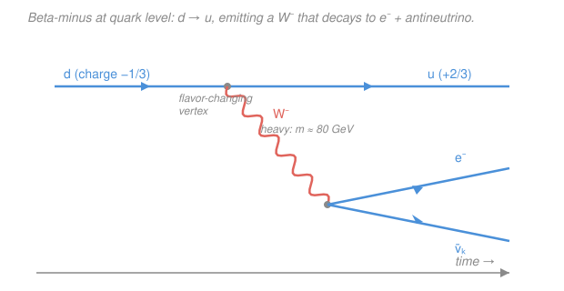

# Nuclear & Particle Physics · Lesson 5.1: The weak interaction

> ⏱ ~15 min · Module 5: The Standard Model · Builds on: [4.5 The quark model & QCD](04-05-quark-model-qcd.md), [4.3 Parity, charge conjugation & CP](04-03-parity-c-cp.md) · Unlocks: [5.2 Electroweak unification & the Higgs](05-02-electroweak-higgs.md)

## Why this matters

The weak force is the odd one out. Gravity and electromagnetism have infinite range; the strong force binds quarks so hard they never come out. The weak force does something none of the others can: it **changes what a particle is**. A down quark becomes an up; a muon becomes an electron. Every time a nucleus beta-decays, a star burns hydrogen, or a muon from a cosmic ray winks out of existence, the weak interaction is the culprit. It is also the only force we know of that can tell left from right — it breaks mirror symmetry outright. This lesson explains its four fingerprints: flavor change, two kinds of current, maximal parity violation, and its trademark slowness — which, surprisingly, is *not* because the force is intrinsically feeble.

## The idea

Think of the weak force as a very expensive courier. The strong and electromagnetic forces send messengers (gluons, photons) that cost almost nothing to emit, so they act fast and constantly. The weak force's messengers — the $W^\pm$ and $Z^0$ bosons — are enormously heavy, about 80 and 91 times the mass of a whole proton. By the uncertainty principle you can only "borrow" such a massive particle for a fantastically short time, so the force it carries reaches only a minuscule distance and fires only rarely. That single fact — a **heavy mediator** — is the whole reason weak decays crawl along at $10^{-10}$ seconds or slower while strong decays finish in $10^{-23}$.

But heaviness is only half the story. The $W$ boson carries electric charge, and when a quark or lepton emits or absorbs it, it must **change identity** to balance the books: a down quark ($-\tfrac13$) emits a $W^-$ and becomes an up quark ($+\tfrac23$). No other force does this. And the weak force is picky in a way that shocked physicists in 1956: it couples only to particles that are, in a specific sense, "left-handed." The universe, at the weak vertex, is not ambidextrous.

## The formal version

**The mediators.** The weak force is carried by three bosons:

$$W^+,\quad W^-\ (m_W \approx 80.4\ \text{GeV}), \qquad Z^0\ (m_Z \approx 91.2\ \text{GeV}).$$

*In words: two charged messengers and one neutral one, each roughly the mass of a silver atom.* Compare the massless photon and gluon — the weak bosons' mass is the source of everything peculiar below.

**Two kinds of process.** Every weak interaction is one of two types, named for the boson exchanged:

- **Charged current (CC):** mediated by $W^\pm$. Because the $W$ carries charge $\pm 1$, the particle emitting it *changes charge and flavor*. Example — beta-minus decay at the quark level:
$$d \to u + W^-, \qquad W^- \to e^- + \bar{\nu}_e.$$
- **Neutral current (NC):** mediated by $Z^0$. The $Z$ is neutral, so the particle keeps its charge and flavor — it just recoils. Example — a neutrino scattering off an electron:
$$\nu_\mu + e^- \to \nu_\mu + e^-.$$

*In words: if the identities change, a $W$ did it; if nothing but momentum changes and no photon could have done the job, a $Z$ did it.*

**Flavor change and quark mixing (the CKM matrix).** The $W$ changes flavor, but *which* flavors can it connect? Naively it should link partners within one generation ($u\leftrightarrow d$, $c\leftrightarrow s$, $t\leftrightarrow b$). The twist: the quarks that feel the weak force — the **weak eigenstates** — are not quite the quarks of definite mass. For the first two generations,

$$d' = d\cos\theta_C + s\sin\theta_C, \qquad \theta_C \approx 13^\circ\ (\sin\theta_C \approx 0.225),$$

where $\theta_C$ is the **Cabibbo angle**. *In words: the "down" the $W$ sees is mostly the real down quark with a small splash of strange mixed in.* So a $W$ can couple $u\leftrightarrow s$ after all — but with amplitude $\propto \sin\theta_C$, hence rate $\propto \sin^2\theta_C \approx 0.05$. This is **Cabibbo suppression**: strangeness-changing ($|\Delta S| = 1$) weak decays like $\Lambda^0 \to p\,\pi^-$ happen, but about 20 times slower than they would if unsuppressed. The full three-generation version replaces the single angle with the $3\times 3$ **CKM matrix** $V_{\text{CKM}}$, whose entries $V_{ud}, V_{us}, \dots$ give the coupling strength of each quark pair. This mixing is *the* reason the strangeness-violating decays flagged as weak in [4.2](04-02-conservation-laws-quantum-numbers.md) can occur at all.

**Parity violation.** The weak force couples *only to left-handed particles and right-handed antiparticles* (the "V−A" structure). *In words: it acts on one handedness and ignores the mirror image.* This is why the [Wu experiment (1957)](04-03-parity-c-cp.md) saw beta electrons from polarized ${}^{60}\mathrm{Co}$ come out preferentially *against* the nuclear spin — a result that would look different in a mirror, proving parity $P$ is broken **maximally**, not slightly.

**Why it's slow: the heavy propagator.** A boson of mass $m_W$ exchanged with momentum transfer $q$ contributes a factor (the *propagator*) to the amplitude $\mathcal{M}$; setting $\hbar = c = 1$,

$$\mathcal{M} \;\propto\; \frac{g^2}{q^2 - m_W^2} \;\xrightarrow[\;q^2\,\ll\, m_W^2\;]{}\; -\frac{g^2}{m_W^2}.$$

*In words: at the low energies of ordinary decays, the huge $m_W^2$ in the denominator crushes the amplitude — the coupling $g$ itself is perfectly ordinary (comparable to the electric charge $e$).* This low-energy limit is exactly **Fermi's effective four-fermion coupling**,

$$\frac{G_F}{\sqrt{2}} = \frac{g^2}{8\,m_W^2}, \qquad G_F \approx 1.17\times 10^{-5}\ \text{GeV}^{-2},$$

so $G_F \propto g^2/m_W^2$. Rates go as $\Gamma \propto G_F^2 \propto 1/m_W^4$ — a monstrous suppression that produces long lifetimes ($\gtrsim 10^{-10}$ s) and a short range $r \sim \hbar/(m_W c) \approx 10^{-3}$ fm. **The punchline:** the weak force is weak only because its messenger is heavy. Push the collision energy up to $q^2 \sim m_W^2$ and the propagator stops suppressing — the weak and electromagnetic forces become comparable in strength, the doorway to electroweak unification in [5.2](05-02-electroweak-higgs.md).

## Picture

## Worked examples

**Example 1 (charged vs neutral current).** Classify each process:

(a) $n \to p + e^- + \bar{\nu}_e$ — the underlying $d \to u + W^-$ changes both charge and flavor. **Charged current.**

(b) $\nu_\mu + e^- \to \nu_\mu + e^-$ — no identities change, and a neutrino has no charge for a photon to grab, so electromagnetism is out. The only option is a neutral messenger. **Neutral current** ($Z^0$). *This is historically how neutral currents were discovered (Gargamelle, 1973): a neutrino nudging an electron with nothing else happening.*

(c) $K^- \to \mu^- + \bar{\nu}_\mu$ — the $K^-$ is $s\bar{u}$; the process is $s \to u$ (through the $\bar u$ line, $\bar s \to \bar u$) emitting a $W^-$. Charge and flavor change, *and* strangeness changes, so it's **charged current** and **Cabibbo-suppressed**.

**Example 2 (why weak is slow — order of magnitude).** Compare a weak decay to an electromagnetic one at a typical hadronic momentum transfer $q \sim 100\ \text{MeV}$. The ratio of amplitudes is set by the two propagators-times-couplings:

$$\frac{\mathcal{M}_{\text{weak}}}{\mathcal{M}_{\text{EM}}} \sim \frac{g^2/m_W^2}{e^2/q^2} = \frac{g^2}{e^2}\cdot\frac{q^2}{m_W^2}.$$

The couplings are similar ($g^2/e^2 \sim 4$), so the whole suppression is the kinematic factor

$$\frac{q^2}{m_W^2} \sim \left(\frac{0.1\ \text{GeV}}{80\ \text{GeV}}\right)^2 \approx 1.6\times 10^{-6}.$$

Amplitude down by $\sim 10^{-6}$, so **rate** (which goes as amplitude-squared) is down by $\sim 10^{-12}$. That is precisely the gap between an electromagnetic lifetime ($\sim 10^{-16}$ s, e.g. $\pi^0 \to \gamma\gamma$) and a weak one ($\sim 10^{-8}$–$10^{-10}$ s). The heavy $W$, not a tiny coupling, buys those extra eight orders of magnitude of patience.

## Watch out

- **You might think "weak" means the coupling constant is small.** It isn't — $g \approx 0.65$ is actually *larger* than the electric charge $e \approx 0.31$. The weakness lives entirely in the $1/m_W^2$ from the heavy propagator. At LHC energies the weak force is no longer weak.
- **You might think neutral current = electromagnetism.** Both leave charges unchanged, but the $Z^0$ couples to *everything*, including chargeless neutrinos, and it violates parity; the photon does neither. A neutrino scattering elastically off matter can only be the $Z$.
- **You might expect the $W$ to connect only same-generation quarks.** Quark mixing (CKM) lets it cross generations — that's why strangeness-changing decays exist at all, just Cabibbo-suppressed by $\sin^2\theta_C$. Forgetting the mixing makes half the hadron decay table look "forbidden."

## One-liner

> The weak force is the only one that changes flavor and breaks mirror symmetry; it is slow not because its coupling is tiny but because its messenger ($W$, $Z$) is heavy, giving $G_F \propto g^2/m_W^2$ and rates $\propto G_F^2$.

## Problems

**P1 (🟢)** Classify each as charged current (CC) or neutral current (NC), and name the boson:
(a) $\bar{\nu}_e + p \to n + e^+$;  (b) $\nu_\mu + N \to \nu_\mu + N$ (nucleus $N$ recoils, otherwise unchanged);  (c) $\Lambda^0 \to p + \pi^-$.

**P2 (🟡)** Write beta-plus decay $p \to n + e^+ + \nu_e$ and muon decay $\mu^- \to e^- + \bar{\nu}_e + \nu_\mu$ each as a two-step process at the $W$ vertex (what emits the $W$, and what the $W$ decays to). For the muon decay, verify that electron lepton number $L_e$ and muon lepton number $L_\mu$ are each separately conserved.

**P3 (🔴, optional)** Estimate the range of the weak force from $m_W \approx 80\ \text{GeV}$, using $\hbar c \approx 197\ \text{MeV·fm}$. Then argue in one line why the same large $m_W$ makes weak decay rates so small.

Solutions

**P1**
(a) $\bar{\nu}_e + p \to n + e^+$: at the quark level $u \to d$ with charge change; a positron and antineutrino are involved through a charged vertex. **CC**, mediated by $W^+$ (equivalently the crossed inverse-beta reaction). Charge check: $0 + 1 \to 0 + 1$ ✓.
(b) $\nu_\mu + N \to \nu_\mu + N$: nothing changes identity, the neutrino is chargeless (no photon possible). **NC**, mediated by $Z^0$.
(c) $\Lambda^0 \to p + \pi^-$: the $\Lambda^0$ is $uds$; the decay is $s \to u$, changing charge, flavor, *and* strangeness ($\Delta S = 1$). **CC** ($W^-$), Cabibbo-suppressed.

*Check.* The tell for NC is "same particles in and out, and no electromagnetic route" — only (b) fits. Both (a) and (c) change identities, so both need a charged $W$. ✓

**P2**
*Beta-plus:* the proton's up quark emits the boson, $u \to d + W^+$, then $W^+ \to e^+ + \nu_e$. Assembling the quarks turns $uud$ (proton) into $udd$ (neutron), leaving $e^+ + \nu_e$. So $p \to n + e^+ + \nu_e$. ✓

*Muon:* $\mu^- \to \nu_\mu + W^-$, then $W^- \to e^- + \bar{\nu}_e$. Net: $\mu^- \to e^- + \bar{\nu}_e + \nu_\mu$.

Lepton-number check (initial state is a single $\mu^-$):
- $L_\mu$: initial $= +1$ (the $\mu^-$). Final $= +1$ from $\nu_\mu$, and $0$ from the electron-family particles $\Rightarrow +1$. ✓
- $L_e$: initial $= 0$. Final $= +1$ ($e^-$) $-1$ ($\bar{\nu}_e$) $+0$ ($\nu_\mu$) $= 0$. ✓

*Check.* Both lepton flavors balance separately — as they must, since the $W$ vertex always pairs a charged lepton with its *own-flavor* neutrino. The antineutrino must be $\bar\nu_e$ (not $\bar\nu_\mu$) precisely to keep $L_e = 0$. ✓

**P3** Range is the Yukawa/uncertainty-limited reach $r \sim \hbar/(m_W c) = \hbar c/(m_W c^2)$:

$$r \sim \frac{197\ \text{MeV·fm}}{80{,}000\ \text{MeV}} \approx 2.5\times 10^{-3}\ \text{fm}.$$

Why slow: the same $m_W$ sits in the propagator, giving each amplitude a factor $g^2/m_W^2 \propto G_F$, so rates $\Gamma \propto G_F^2 \propto 1/m_W^4$. A heavy mediator means a short reach *and* a tiny amplitude — one cause, both symptoms.

*Check.* $2.5\times 10^{-3}$ fm is about $1/1000$ of a nucleon's size ($\sim 1$ fm) — the weak force barely pokes outside a single quark, exactly why it acts almost like a contact (four-fermion) interaction at nuclear energies. ✓

## Flashback

**From Lesson 4.5 (The quark model & QCD):** Consider the decay $\Delta^0 \to p + \pi^-$. Write the quark content of each hadron, check that charge, baryon number, and strangeness are all conserved, and state which of the four forces mediates it and the rough lifetime that implies.

Solution

Quark content: $\Delta^0 = udd$, $p = uud$, $\pi^- = d\bar{u}$.

- **Charge:** $0 \to (+1) + (-1) = 0$ ✓
- **Baryon number:** $1 \to 1 + 0 = 1$ ✓ (the pion is a meson, $B = 0$)
- **Strangeness:** $0 \to 0 + 0 = 0$ ✓ (no strange quarks anywhere)

Every additive quantum number is conserved and only light ($u$, $d$) quarks appear — a $d\bar d$ pair is simply created from the color field. Nothing forces this to be weak, so the **strong force** mediates it, implying a lifetime of order $10^{-23}$ s (the $\Delta$ is a resonance, seen as a width, not a track).

*Check.* Contrast with $\Lambda^0 \to p\,\pi^-$ from the worked problems: there $\Delta S = 1$ forbids the strong and EM routes, forcing a slow *weak* decay ($\sim 10^{-10}$ s). Same final state $p\,\pi^-$, thirteen orders of magnitude difference in lifetime — decided entirely by whether strangeness has to change. ✓

## Connections

- **Backward:** parity violation and the Wu experiment come straight from [4.3 Parity, charge conjugation & CP](04-03-parity-c-cp.md); the flavor and strangeness bookkeeping — and why $|\Delta S| = 1$ decays are weak — is the conservation-law machinery of [4.2](04-02-conservation-laws-quantum-numbers.md) and the quark content of [4.5](04-05-quark-model-qcd.md). This lesson is also what powers the beta decay of [2.3](02-03-beta-decay-neutrino.md): Fermi's four-fermion theory is the low-energy face of the $W$.
- **Forward:** [5.2 Electroweak unification & the Higgs](05-02-electroweak-higgs.md) explains where the $W$ and $Z$ masses *come from* — and thus why the weak force is weak — via spontaneous symmetry breaking, uniting it with electromagnetism into one electroweak force.
- **Sideways:** the actual amplitude for the vertex drawn above — computing the propagator, the $V-A$ structure, and the decay rate as a Feynman diagram — is deferred to the [`qft` syllabus](../../qft/syllabus.md). The heavy-propagator $\to$ contact-interaction limit ($1/(q^2 - m_W^2) \to -1/m_W^2$) is the same "integrate out the heavy field" logic used throughout effective field theory there.
