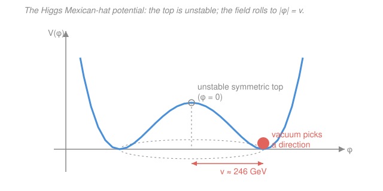

# Nuclear & Particle Physics · Lesson 5.2: Electroweak unification & the Higgs

> ⏱ ~15 min · Module 5: The Standard Model · Builds on: [5.1 The weak interaction](05-01-weak-interaction.md) · Unlocks: [5.3 The Standard Model assembled](05-03-standard-model-assembled.md)

## Why this matters

In [5.1](05-01-weak-interaction.md) the weak force looked like a strange outsider: absurdly short-ranged, mediated by bosons ($W^\pm, Z^0$) a hundred times heavier than a proton, uniquely willing to violate parity. Electromagnetism, by contrast, is long-ranged and mediated by a massless photon. They seem to have nothing to do with each other. The stunning claim of the **electroweak theory** (Glashow, Weinberg, Salam — Nobel 1979) is that they are *the same force*, wearing two disguises that only diverge at low energy. And the reason the disguises exist — why the $W$ and $Z$ are heavy while the photon stays massless — is the **Higgs mechanism**, the same machinery that gives *every* massive elementary particle its mass. This lesson is the conceptual heart of the Standard Model.

## The idea

Two ideas, stacked.

**Unification.** At high enough energy — well above 100 GeV, the regime of the early universe or the LHC — electromagnetism and the weak force merge into a single **electroweak** interaction. There aren't a photon and three weak bosons running around independently; there are four more fundamental fields dictated by a symmetry, and *what we call* the photon, $W^+$, $W^-$, and $Z^0$ are particular **mixtures** of them. The recipe for the mixing is one number, the **weak mixing angle** $\theta_W$ (the "Weinberg angle"). Turn the energy down and the four bosons behave completely differently — but that difference is emergent, not fundamental.

**Where mass comes from.** Why do they behave differently at low energy? Because three of them are heavy and one isn't. A gauge symmetry, left alone, *forbids* the force-carriers from having mass — it wants all four massless, like the photon. So the symmetry must be **broken**. Not by changing the laws (they stay perfectly symmetric) but by the **vacuum itself** picking a state that isn't symmetric. Picture a ball balanced on the very top of a sombrero: the setup is perfectly rotationally symmetric, but the ball *cannot stay there*. It rolls down into the circular brim — into some specific direction, arbitrarily chosen. The laws are still symmetric; the world the ball lives in is not. This is **spontaneous symmetry breaking**, and the sombrero is the **Higgs field's** potential. Once the field settles in the brim (a nonzero background value everywhere in space), particles that plow through this background feel a drag — that drag *is* their mass. The photon ignores the field entirely, so it stays massless; the $W$ and $Z$ couple strongly, so they get heavy.

## The formal version

**The gauge structure.** The electroweak symmetry is written $SU(2)_L \times U(1)_Y$ — a "weak isospin" part ($SU(2)$, acting only on left-handed particles, hence the $L$, echoing the parity violation of [5.1](05-01-weak-interaction.md)) and a "hypercharge" part ($U(1)_Y$). *In words: two symmetries glued together, whose four gauge fields will become the photon and the three weak bosons.* Call the $SU(2)$ fields $W^1, W^2, W^3$ and the $U(1)$ field $B$.

**The mixing.** The physical bosons are combinations of these. The charged ones are simple pairings, $W^\pm$. The neutral photon $A$ and the neutral $Z^0$ are *rotations* of $W^3$ and $B$ by the weak mixing angle $\theta_W$:

$$A = B\cos\theta_W + W^3\sin\theta_W, \qquad Z^0 = -B\sin\theta_W + W^3\cos\theta_W.$$

*In words: the photon and the $Z$ are two perpendicular "channels" mixed out of the same pair of underlying fields; $\theta_W$ sets how much of each goes into which.* The measured value is $\sin^2\theta_W \approx 0.23$. This one angle then ties together three otherwise-independent quantities. Writing $g$ for the $SU(2)$ coupling and $e$ for the electric charge unit:

$$e = g\sin\theta_W, \qquad m_W = m_Z\cos\theta_W.$$

*In words: the electric charge is just the weak coupling projected through the mixing angle, and the $W$ mass is the $Z$ mass projected through the same angle.* (Quote these — deriving them is field theory, deferred to `qft`.) The second relation is a genuine prediction: measure two of $\{m_W, m_Z, \theta_W\}$ and the third is fixed.

**The Higgs mechanism.** Introduce a field $\phi$ (the Higgs field) with the "Mexican-hat" potential

$$V(\phi) = -\mu^2\,|\phi|^2 + \lambda\,|\phi|^4, \qquad \mu^2, \lambda > 0.$$

*In words: a potential whose minimum is not at $\phi=0$.* The $|\phi|=0$ point is a local **maximum** (the unstable top of the hat); the minima form a **ring** at

$$|\phi| = v \equiv \frac{\mu}{\sqrt{\lambda}} \approx 246\ \text{GeV},$$

the **vacuum expectation value** (VEV). *In words: empty space is not empty — it is filled with the Higgs field sitting at value $v$ everywhere.* The vacuum choosing one point on the ring breaks the symmetry. Each gauge boson and fermion acquires a mass **proportional to how strongly it couples to this background**: $m \propto (\text{coupling}) \times v$. The photon has zero coupling to $\phi$, so it stays exactly massless; the $W$ and $Z$ couple, so they become heavy (roughly $80$ and $91$ GeV). Fermion masses come from their **Yukawa couplings** $y_f$: $m_f = y_f\, v/\sqrt{2}$ — bigger coupling, bigger mass.

The leftover radial vibration of the field — the ball rattling in and out along the brim's slope — is a physical particle, the **Higgs boson**, with mass $m_H \approx 125\ \text{GeV}$. Predicted in 1964, it was the last unobserved piece of the Standard Model until its **discovery at the LHC in 2012** (Higgs and Englert, Nobel 2013).

## Picture

## Worked examples

**Example 1 (the $W$/$Z$ mass relation).** The $Z^0$ mass is measured very precisely as $m_Z = 91.19\ \text{GeV}$, and $\sin^2\theta_W \approx 0.23$. Predict $m_W$.

$$\cos^2\theta_W = 1 - \sin^2\theta_W = 1 - 0.23 = 0.77, \qquad \cos\theta_W = \sqrt{0.77} \approx 0.877.$$

$$m_W = m_Z\cos\theta_W = 91.19 \times 0.877 \approx 80.0\ \text{GeV}.$$

The measured value is $m_W \approx 80.4\ \text{GeV}$ — agreement to under 1%. That the *same* $\theta_W$ appearing in $e = g\sin\theta_W$ (an electromagnetic quantity) also fixes the ratio of two weak-boson masses is direct evidence the two forces share one structure.

**Example 2 (who gets the most mass).** In the Higgs picture, a fermion's mass is $m_f = y_f\, v/\sqrt{2}$ with $v \approx 246\ \text{GeV}$ fixed and universal — the *only* thing that varies between fermions is the Yukawa coupling $y_f$. So the mass hierarchy of the fermions is nothing but the hierarchy of their couplings to the Higgs field. The **top quark**, at $m_t \approx 173\ \text{GeV}$, is the heaviest known elementary particle; inverting,

$$y_t = \frac{\sqrt{2}\,m_t}{v} = \frac{1.414 \times 173}{246} \approx 0.99 \approx 1.$$

The top quark couples to the Higgs with strength of order unity — it "grips" the background field about as hard as anything possibly can. The electron, by contrast, has $y_e \sim 3\times10^{-6}$: it barely notices the field, so it is nearly $350{,}000$ times lighter. *There is no deeper reason in the Standard Model why the couplings take these values — the Higgs explains how particles get mass, not why the masses are what they are.*

## Watch out

- **You might think the Higgs field "creates" all mass.** It doesn't. It gives *elementary* particles their mass — quarks, charged leptons, $W/Z$. But the mass of a proton (and hence ~99% of your body weight) is overwhelmingly the *binding energy* of the strong force among nearly-massless quarks, not their Higgs-given masses. The Higgs is responsible for a small fraction of ordinary matter's mass.
- **You might think the symmetry is destroyed.** The *laws* remain perfectly $SU(2)\times U(1)$ symmetric — the ball could have rolled into any point on the brim, and every choice is physically equivalent. Only the *vacuum's particular choice* breaks it. "Hidden" is a better word than "broken."
- **You might conflate the Higgs field with the Higgs boson.** The **field** (the VEV $v$, filling all space) is what gives mass. The **boson** ($m_H \approx 125$ GeV) is just a detectable ripple of that field — the evidence the field is really there, not the source of mass itself.
- **You might think $\theta_W$ is a small correction.** With $\sin^2\theta_W \approx 0.23$, we have $\theta_W \approx 28.7^\circ$ — a large, order-one rotation. The photon and $Z$ are thoroughly mixed, not slightly.

## One-liner

> Electromagnetism and the weak force are one $SU(2)\times U(1)$ interaction whose bosons mix by the angle $\theta_W$; the Higgs field's off-center vacuum ($v \approx 246$ GeV) hides that symmetry and hands out mass in proportion to coupling — so the photon stays massless and the top quark gets heaviest.

## Problems

**P1 (🟢)** Given $m_W = 80.4\ \text{GeV}$ and $m_Z = 91.19\ \text{GeV}$, extract $\cos\theta_W$ and hence $\sin^2\theta_W$. Compare to the quoted $\sin^2\theta_W \approx 0.23$.

**P2 (🟡)** Using $e = g\sin\theta_W$ with $\sin^2\theta_W = 0.23$, find the ratio $g/e$ (the weak $SU(2)$ coupling relative to the electric charge unit). Is the weak coupling larger or smaller than the electromagnetic one? What does that say about whether the weak force is "intrinsically weak"?

**P3 (🔴, optional)** The muon has mass $m_\mu \approx 106\ \text{MeV}$ and the tau $m_\tau \approx 1777\ \text{MeV}$. In the Higgs picture, what is the ratio of their Yukawa couplings $y_\tau / y_\mu$? Why does no computation of $v$ or $\theta_W$ enter this ratio?

Solutions

**P1** Invert $m_W = m_Z\cos\theta_W$:

$$\cos\theta_W = \frac{m_W}{m_Z} = \frac{80.4}{91.19} \approx 0.8817, \qquad \cos^2\theta_W \approx 0.7774.$$

$$\sin^2\theta_W = 1 - \cos^2\theta_W \approx 1 - 0.777 = 0.223 \approx 0.22.$$

Compared to the standard $\sin^2\theta_W \approx 0.23$, this is within a couple percent — the small discrepancy is exactly the kind of gap that precision electroweak measurements (and radiative corrections) live in.

*Check.* $\cos\theta_W < 1$ as required (a mass ratio less than 1), and $\theta_W = \arccos(0.882) \approx 28^\circ$, matching the order-one angle quoted in the lesson. ✓

**P2** From $e = g\sin\theta_W$:

$$\frac{g}{e} = \frac{1}{\sin\theta_W} = \frac{1}{\sqrt{0.23}} = \frac{1}{0.4796} \approx 2.09.$$

So $g \approx 2.1\,e$ — the weak $SU(2)$ coupling is actually **larger** than the electromagnetic coupling. The weak force is *not* intrinsically weak at the level of coupling strength; it appears weak at low energy purely because its carriers ($W/Z$) are so heavy that the interaction is short-ranged and its amplitudes are suppressed by $\sim 1/m_W^2$ (the massive-propagator effect from [5.1](05-01-weak-interaction.md)). Remove the mass — go to energies $\gg m_W$ — and it is comparable to electromagnetism, as unification demands.

*Check.* $g/e \approx 2$ is order unity, consistent with two couplings of the same underlying interaction; if $g$ were tiny the "unification" story would be hollow. ✓

**P3** Mass is proportional to Yukawa coupling with the *same* $v$ for both, $m_f = y_f\,v/\sqrt{2}$, so the common factors cancel in a ratio:

$$\frac{y_\tau}{y_\mu} = \frac{m_\tau}{m_\mu} = \frac{1777}{106} \approx 16.8.$$

Neither $v$ nor $\theta_W$ appears: they are universal constants shared by every fermion, so any *ratio* of same-type masses is just the ratio of couplings, independent of the overall mass scale the Higgs sets.

*Check.* Dimensionless ratio from a ratio of masses — units cancel ✓. And $y_\tau > y_\mu$ as it must, since the tau is heavier. ✓

## Flashback

**From Lesson 5.1 (The weak interaction):** A $W^-$ boson has mass $m_W \approx 80\ \text{GeV}$. Estimate the range of the weak force it mediates, using the fact that a virtual boson of mass $m$ can reach only about a Compton wavelength $R \sim \hbar/(m c)$. Give the answer in metres and compare it to a nuclear diameter ($\sim 10^{-15}$ m). (Fresh variant — different boson and framing than in 5.1.)

Solution

Use $\hbar c \approx 197\ \text{MeV·fm} = 0.197\ \text{GeV·fm}$ and $R \sim \hbar/(mc) = \hbar c/(m c^2)$:

$$R \sim \frac{0.197\ \text{GeV·fm}}{80\ \text{GeV}} \approx 2.5\times10^{-3}\ \text{fm} = 2.5\times10^{-18}\ \text{m}.$$

That is about $10^{-3}$ of a nuclear diameter — the weak force reaches only a thousandth of the way across a single nucleus. This tiny range, a direct consequence of the huge $W$ mass the Higgs mechanism supplies, is *why* the weak interaction is feeble in everyday nuclear processes even though its coupling (P2) is not small.

*Check.* Heavier mediator → shorter range, the inverse relation from 5.1; and the massless photon ($m=0$) would give $R\to\infty$, the infinite range of electromagnetism. Units: $(\text{GeV·fm})/\text{GeV} = \text{fm}$ ✓.

## Connections

- **Backward:** the heavy $W^\pm/Z^0$ and short range of [5.1](05-01-weak-interaction.md) are *explained* here — they are heavy because they couple to the Higgs VEV, whereas the massless photon does not. The left-handedness of the weak force is built into the $SU(2)_L$ that only acts on left-handed fields.
- **Forward:** [5.3 The Standard Model assembled](05-03-standard-model-assembled.md) puts electroweak together with the strong force ($SU(3)$ colour) and the three fermion generations into the full $SU(3)\times SU(2)\times U(1)$ picture — with the Higgs as the piece that gives every massive particle its mass.
- **Sideways (`qft`):** gauge theory, the covariant derivative, and spontaneous symmetry breaking are treated computationally — including how the Goldstone modes are "eaten" to give the $W/Z$ their longitudinal polarizations — in the [`qft` syllabus](../../qft/syllabus.md). Here we quote $e=g\sin\theta_W$ and $m_W = m_Z\cos\theta_W$; there you derive them.
