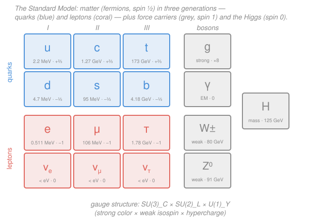

# Nuclear & Particle Physics · Lesson 5.3: The Standard Model assembled

> ⏱ ~15 min · Module 5: The Standard Model · Builds on: [5.2 Electroweak unification & the Higgs](05-02-electroweak-higgs.md) · Unlocks: [5.4 Neutrinos & oscillations](05-04-neutrinos-oscillations.md)

## Why this matters

Everything you've met since Module 4 — the particle zoo, conservation laws, isospin, quarks, color, the weak force, the Higgs — is one theory wearing many hats. This lesson is the assembly step: we lay all the fundamental particles on a single chart and attach one compact label, $SU(3)_C \times SU(2)_L \times U(1)_Y$, that says exactly which force each particle feels and why. That chart is the most accurately tested theory in the history of science — the electron's magnetic moment ($g-2$) agrees with it to better than one part in $10^{12}$. Once you can *place any particle* on it and *name the force it feels*, you can read essentially all of non-gravitational particle physics off one page. This is a map lesson: no new machinery, just the master diagram.

## The idea

Two kinds of thing, one organizing principle.

**Matter is made of fermions** (spin $\tfrac12$), and they come in **three generations** — three near-identical copies that differ only in mass. Generation I is light and stable (it builds every atom, star, and person). Generations II and III are heavier photocopies that appear in cosmic rays and accelerators and decay in fractions of a microsecond. Each generation holds two **quarks** (which feel the strong force) and two **leptons** (which don't): an up-type quark, a down-type quark, a charged lepton, and its neutrino.

**Forces are carried by bosons** (spin $1$) — the "messengers" that fermions exchange. Each force is a *symmetry*, and each symmetry comes with its own carrier(s): the strong force has eight **gluons**, electromagnetism has the **photon**, the weak force has $W^\pm$ and $Z^0$. Sitting apart is the **Higgs** (spin $0$), not a force carrier but the field whose "molasses" gives the other particles mass (that was [5.2](05-02-electroweak-higgs.md)).

The single sentence that ties it together: **matter fields transform under gauge symmetries, and the gauge bosons are the price of demanding those symmetries hold at every point in space.** The label $SU(3)_C \times SU(2)_L \times U(1)_Y$ is just the list of those symmetries.

## The formal version

Read the gauge group left to right — each factor is one force's symmetry, and a particle "feeling" that force means it *transforms* (is non-trivially rotated) under that factor.

$$\underbrace{SU(3)_C}_{\text{strong}} \;\times\; \underbrace{SU(2)_L}_{\text{weak isospin}} \;\times\; \underbrace{U(1)_Y}_{\text{hypercharge}}$$

- **$SU(3)_C$ — color, the strong force.** Quarks carry one of three **colors** (red/green/blue), so they live in the 3-dimensional representation and feel the strong force; the eight **gluons** are its carriers (this is [4.5](04-05-quark-model-qcd.md)). Leptons are *colorless* (color singlets) — that's the precise reason they ignore the strong force.
- **$SU(2)_L$ — weak isospin.** The subscript $L$ means only **left-handed** fermions pair into doublets like $\binom{u}{d}_L$ and $\binom{\nu_e}{e}_L$; right-handed fermions are singlets (untouched). This left-handedness *is* the parity violation of [5.1](05-01-weak-interaction.md). Its carriers are three bosons $W^1, W^2, W^3$.
- **$U(1)_Y$ — hypercharge $Y$.** A single phase symmetry with one carrier $B$, related to charge and weak isospin by the Gell-Mann–Nishijima rule (from [4.4](04-04-isospin-flavor-symmetry.md)):

$$Q = T_3 + \tfrac{Y}{2},$$

*In words: a particle's electric charge is its third component of weak isospin plus half its hypercharge.* $T_3 = \pm\tfrac12$ for the two members of a left-handed doublet, $0$ for a singlet.

**The break.** The electroweak part $SU(2)_L \times U(1)_Y$ is not the symmetry we see at everyday energies. The Higgs field's vacuum value breaks it down to a single surviving $U(1)$:

$$SU(2)_L \times U(1)_Y \;\xrightarrow{\text{Higgs}}\; U(1)_{EM}.$$

The four electroweak carriers $(W^1,W^2,W^3,B)$ recombine into the four we observe: $W^\pm$ (charged, massive), and two neutral mixtures — the massive $Z^0$ and the massless **photon** $\gamma$. *In words: below the electroweak scale one unified force looks like two — a short-range weak force and long-range electromagnetism* ([5.2](05-02-electroweak-higgs.md)).

**The inventory.** Counting *types*: 6 quarks + 6 leptons ($=12$ fermions) $+$ 4 gauge-boson types ($g,\gamma,W,Z$) $+$ 1 Higgs $= \mathbf{17}$ fundamental particles. Counting every distinct *state* — quarks come in 3 colors, most particles have distinct antiparticles, and there are 8 gluons — the total is 61 (worked below).

## Picture

## Worked examples

**Example 1 (place a quark).** *Where does the strange quark $s$ sit, and what does it feel?*

- **Type:** quark (down-type, charge $-\tfrac13$). **Generation:** II (it's the heavier partner of the down quark).
- **Charge:** $Q = -\tfrac13$.
- **Gauge factors it transforms under:** *all three.* It carries color, so it lives in $SU(3)_C$ (feels the strong force); its left-handed part sits in a doublet $\binom{c}{s}_L$, so it transforms under $SU(2)_L$ (feels the weak force); and it has hypercharge, so it couples to $U(1)_Y$ — after breaking, its charge $-\tfrac13$ means it feels electromagnetism. A quark is the "feels everything" particle.

**Example 2 (place a lepton, then count the whole model).** *Where does the muon neutrino $\nu_\mu$ sit?*

- **Type:** lepton (neutral). **Generation:** II. **Charge:** $Q = 0$.
- **Gauge factors:** color singlet (no strong force); left-handed member of the doublet $\binom{\nu_\mu}{\mu}_L$, so it transforms under $SU(2)_L$; carries hypercharge under $U(1)_Y$. But $Q=0$, so it does **not** feel electromagnetism. Net result: the neutrino feels the **weak force only** — which is exactly why it's so hard to detect (foreshadowing [5.4](05-04-neutrinos-oscillations.md)).

Now the full state count:

$$
\begin{aligned}
\text{quarks:} &\quad 6 \text{ flavors} \times 3 \text{ colors} \times 2 \text{ (particle/anti)} = 36,\\
\text{charged leptons:} &\quad 3 \times 2 = 6,\\
\text{neutrinos:} &\quad 3 \times 2 = 6,\\
\text{gluons:} &\quad 8,\\
W^+,\,W^-,\,Z^0,\,\gamma: &\quad 4,\\
\text{Higgs:} &\quad 1.\\[2pt]
\hline
\text{Total} &\quad 36+6+6+8+4+1 = \mathbf{61}.
\end{aligned}
$$

*In words: the compact "17 particles" count collapses color and antiparticles; the "61" count keeps every physically distinct state.*

## Watch out

- **You might think the three generations are three different kinds of matter.** They're the *same four roles* (up-type, down-type, charged lepton, neutrino) played three times at increasing mass. Every stable thing you've ever touched is generation I; II and III are unstable and decay down to it.
- **You might read $SU(3)\times SU(2)\times U(1)$ as three separate boxed-off forces.** The $SU(2)_L \times U(1)_Y$ part is *not* "weak $\times$ electromagnetic" — it's the *unified* electroweak symmetry, and it's the Higgs that carves the photon and $Z$ out of it. Only $SU(3)_C$ stands alone.
- **You might expect the photon or gluon to feel its own force like $W$ and $Z$ do.** The photon is electrically neutral, so it doesn't couple to itself. But gluons *carry* color, so they *do* self-interact — the deep reason the strong force confines and doesn't reach beyond the nucleus ([4.5](04-05-quark-model-qcd.md)).
- **You might think the SM is finished.** It's spectacular but incomplete: neutrino masses aren't in the minimal version ([5.4](05-04-neutrinos-oscillations.md)), and it says nothing about gravity, dark matter, or the matter–antimatter asymmetry ([5.5](05-05-beyond-standard-model.md)).

## One-liner

> Matter is three generations of spin-½ quarks and leptons; forces are the spin-1 carriers of $SU(3)_C \times SU(2)_L \times U(1)_Y$ (with the Higgs breaking the electroweak part to $U(1)_{EM}$) — place any particle by its color, weak-isospin, and charge, and you've named every force it feels.

## Problems

**P1 (🟢)** Place each of these three particles: give its category (quark / lepton / gauge boson), its generation (or "n/a"), its electric charge, and which of the three gauge factors $SU(3)_C$, $SU(2)_L$, $U(1)_Y$ it transforms under (equivalently, which forces it feels): (a) the charm quark $c$; (b) the tau $\tau^-$; (c) the gluon $g$.

**P2 (🟡)** A colleague says "the Standard Model has 12 matter particles and a handful of bosons — call it 17 total." Reconcile this with the count of 61 distinct states: which multiplicities does the "17" throw away, and how does restoring them get you to 61? (No need to re-derive — just list what each number counts.)

**P3 (🔴, optional)** Using $Q = T_3 + \tfrac{Y}{2}$ with $T_3 = +\tfrac12$ for the upper member of a left-handed doublet and $-\tfrac12$ for the lower: (a) show the left-handed lepton doublet $\binom{\nu_e}{e}_L$ has a single common hypercharge $Y$, and find it. (b) The right-handed electron $e_R$ is an $SU(2)_L$ *singlet* ($T_3 = 0$). Find its hypercharge, and say in one sentence why $e_R$ therefore does not couple to the $W$ boson.

Solutions

**P1**

- **(a) Charm quark $c$:** category *quark* (up-type), generation **II**, charge $+\tfrac23$. Carries color ⇒ transforms under $SU(3)_C$; left-handed part in the doublet $\binom{c}{s}_L$ ⇒ $SU(2)_L$; has hypercharge and nonzero charge ⇒ $U(1)_Y$ / feels EM. Feels **all three forces**.
- **(b) Tau $\tau^-$:** category *lepton* (charged), generation **III**, charge $-1$. Color singlet ⇒ **no** strong force; in the doublet $\binom{\nu_\tau}{\tau}_L$ ⇒ $SU(2)_L$; charged ⇒ $U(1)_Y$ / EM. Feels **weak and electromagnetic**.
- **(c) Gluon $g$:** category *gauge boson*, generation **n/a**, charge $0$. It is the carrier of $SU(3)_C$ — it *mediates* the strong force (and carries color, so it self-interacts). Not part of $SU(2)_L$ or $U(1)_Y$.

*Check.* Pattern holds: quarks feel all three, charged leptons feel weak+EM, and a gauge boson belongs to exactly the factor it carries. ✓

**P2** The "17" counts *types*: 6 quark flavors + 6 leptons (12 fermions) + 4 gauge-boson types ($g,\gamma,W,Z$) + 1 Higgs. It discards three multiplicities:

1. **Color:** each quark comes in 3 colors → quarks $6 \to 18$.
2. **Antiparticles:** quarks and leptons have distinct antiparticles → fermions double.
3. **Charge/gluon states:** "$W$" is really $W^+$ and $W^-$ (2 states), and "$g$" is really 8 gluons.

Restoring them: quarks $6\times3\times2=36$; charged leptons $3\times2=6$; neutrinos $3\times2=6$; gluons $8$; $W^\pm,Z^0,\gamma = 4$; Higgs $1$. Sum $= 36+6+6+8+4+1 = 61$.

*Check.* The 12 fermion *types* expand to $36+6+6=48$ fermion states; bosons give $8+4+1=13$; $48+13=61$. ✓ (The photon and $Z$ and Higgs have no distinct antiparticle, so they aren't doubled — consistent with the tally.)

**P3**

**(a)** Upper member is the neutrino ($T_3=+\tfrac12$, $Q=0$):
$$0 = +\tfrac12 + \tfrac{Y}{2} \;\Longrightarrow\; \tfrac{Y}{2} = -\tfrac12 \;\Longrightarrow\; Y = -1.$$
Lower member is the electron ($T_3=-\tfrac12$, $Q=-1$):
$$-1 = -\tfrac12 + \tfrac{Y}{2} \;\Longrightarrow\; \tfrac{Y}{2} = -\tfrac12 \;\Longrightarrow\; Y = -1.$$
Both give $Y=-1$: hypercharge is a property of the *doublet*, so the two members share it. ✓

**(b)** For $e_R$, $T_3 = 0$ and $Q = -1$:
$$-1 = 0 + \tfrac{Y}{2} \;\Longrightarrow\; Y = -2.$$
Because $e_R$ is an $SU(2)_L$ singlet ($T_3=0$), it has no weak-isospin partner to be rotated into, so the $W$ boson — which raises/lowers $T_3$ within a doublet — has nothing to act on. Hence $e_R$ does not couple to $W$: this is the origin of the weak force acting only on left-handed particles.

*Check.* Consistency: for the doublet, $Y=-1$ splits into $Q=0$ and $Q=-1$ via $T_3=\pm\tfrac12$; for the singlet, $Y=-2$ reproduces $Q=-1$ with $T_3=0$. All three charges come out right from one rule. ✓

## Flashback

**From Lesson 5.2 (Electroweak unification & the Higgs):** After electroweak breaking, the $W$ and $Z$ masses are tied by the **weak mixing (Weinberg) angle** $\theta_W$ through $M_W = M_Z \cos\theta_W$. Given $M_W = 80.4\ \text{GeV}$ and $M_Z = 91.2\ \text{GeV}$, find $\cos\theta_W$ and $\sin^2\theta_W$. (Fresh variant — you're given the masses rather than the angle.)

Solution

$$\cos\theta_W = \frac{M_W}{M_Z} = \frac{80.4}{91.2} \approx 0.882, \qquad \cos^2\theta_W \approx 0.778.$$

$$\sin^2\theta_W = 1 - \cos^2\theta_W \approx 1 - 0.778 = 0.222.$$

*Check.* The measured value is $\sin^2\theta_W \approx 0.223$ — bang on. The relation $M_W = M_Z\cos\theta_W$ is a direct consequence of the same $(W^3, B) \to (Z, \gamma)$ mixing that leaves the photon massless: the angle that rotates the neutral bosons is the same angle that sets the mass ratio. ✓

## Connections

- **Backward:** this chart is the payoff of Module 4 — quark color ([4.5](04-05-quark-model-qcd.md)) is the $SU(3)_C$ column, weak isospin and the Gell-Mann–Nishijima relation ([4.4](04-04-isospin-flavor-symmetry.md)) are the $SU(2)_L$/$U(1)_Y$ bookkeeping, and the lepton/hadron split of [4.1](04-01-particle-zoo.md) is just "colorless vs colored." The electroweak breaking is [5.2](05-02-electroweak-higgs.md) and the left-handedness is [5.1](05-01-weak-interaction.md).
- **Forward:** [5.4](05-04-neutrinos-oscillations.md) exploits a crack in this chart — the minimal SM makes neutrinos massless, yet they mix and oscillate, forcing a nonzero mass. [5.5](05-05-beyond-standard-model.md) catalogs the rest of the gaps: dark matter, gravity, the matter–antimatter asymmetry.
- **Sideways (QFT):** *why* a demanded local symmetry forces a gauge boson to exist — the actual mechanism behind this label — is derived in [`qft`](../../qft/syllabus.md); here we read the result, there you build it. The four-vector kinematics that let us weigh these particles at colliders came from [3.1](03-01-four-vectors-invariant-mass.md).
