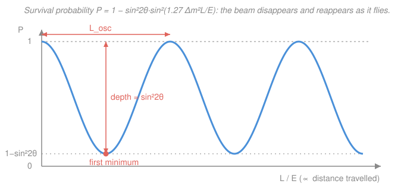

# Nuclear & Particle Physics · Lesson 5.4: Neutrinos & oscillations

> ⏱ ~15 min · Module 5: The Standard Model · Builds on: [5.3 The Standard Model assembled](05-03-standard-model-assembled.md), [2.3 Beta decay & the neutrino](02-03-beta-decay-neutrino.md) · Unlocks: [5.5 Beyond the Standard Model](05-05-beyond-standard-model.md)

## Why this matters

Pauli invented the neutrino in 1930 to save energy conservation in $\beta$ decay ([2.3](02-03-beta-decay-neutrino.md)), and for seventy years everyone assumed it was massless — that's how it sits in the original Standard Model ([5.3](05-03-standard-model-assembled.md)). Then experiments found that neutrinos *change flavor* mid-flight: a beam that leaves the Sun as electron-neutrinos arrives partly as muon- and tau-neutrinos. That single fact — **neutrino oscillation** — is the first hard, reproducible crack in the Standard Model, and it forces at least one neutrino to have mass. It won the 2015 Nobel Prize, and it's a macroscopic quantum-interference effect you can compute with one formula. This is where the "beyond" in [5.5](05-05-beyond-standard-model.md) begins.

## The idea

Here's the setup that makes everything click. A neutrino is created and detected through the *weak vertex* ([5.1](05-01-weak-interaction.md)), always paired with a specific charged lepton: an electron makes a $\nu_e$, a muon makes a $\nu_\mu$, a tau makes a $\nu_\tau$. These are the **flavor eigenstates** — what you can produce and what you can measure.

But flavor is *not* what travels. What propagates cleanly through space — with a definite energy and a definite phase — are the **mass eigenstates** $\nu_1,\nu_2,\nu_3$, the states with definite mass. The two descriptions are different bases for the same three states, rotated into each other by a **mixing matrix** (the PMNS matrix; for two flavors it's a single rotation by an angle $\theta$).

Now the payoff. When you make a $\nu_e$, you've made a specific *superposition* of $\nu_1$ and $\nu_2$. As it flies, each mass eigenstate carries its own quantum phase $e^{-iEt}$ — and because the masses differ slightly, the energies differ slightly, so the two phases **drift out of step**. The superposition you started with slowly rotates into a *different* mixture — one that overlaps partly with $\nu_\mu$. Measure it downstream and you sometimes find a $\nu_\mu$ where you launched a $\nu_e$. The flavor content sloshes back and forth with distance. It is exactly a two-state quantum system beating against itself, only stretched over hundreds of kilometers.

The whole effect hinges on the phases drifting apart, and *that* requires the masses to differ. Equal masses (in particular, both zero) means the phases stay locked, the superposition never changes, and nothing oscillates. **Oscillation is impossible unless neutrinos have mass.**

## The formal version

Work with two flavors — it captures all the physics and the algebra is a $2\times2$ rotation. Write the flavor states as a rotation of the mass states by the **mixing angle** $\theta$:

$$\nu_e = \cos\theta\,\nu_1 + \sin\theta\,\nu_2, \qquad \nu_\mu = -\sin\theta\,\nu_1 + \cos\theta\,\nu_2.$$

*In words: the thing you make ($\nu_e$) is a blend of the things that travel ($\nu_1,\nu_2$), with the blend set by one angle.*

Each mass eigenstate propagates with its own phase. For an ultra-relativistic neutrino of energy $E$ travelling a distance $L$, a state of mass $m_i$ picks up phase $e^{-i m_i^2 L/2E}$ (natural units $\hbar=c=1$; the $m_i^2/2E$ is the standard relativistic expansion of the phase for $m_i \ll E$). Start with $\nu_e$, evolve, and project back onto $\nu_\mu$: the probability that a $\nu_e$ has turned into a $\nu_\mu$ works out to

$$P(\nu_e \to \nu_\mu) = \sin^2(2\theta)\,\sin^2\!\left(\frac{\Delta m^2\,L}{4E}\right), \qquad \Delta m^2 \equiv m_2^2 - m_1^2.$$

*In words: the chance of finding the other flavor swings sinusoidally with distance; how deep the swing goes is set by the mixing angle, how fast it swings is set by the mass-squared difference.* Since a neutrino must be found as *some* flavor, the **survival probability** — still measuring the flavor you started with — is the complement:

$$\boxed{\,P(\nu_\alpha \to \nu_\alpha) = 1 - \sin^2(2\theta)\,\sin^2\!\left(1.27\,\frac{\Delta m^2\,L}{E}\right)\,}$$

Two things to unpack. **The 1.27** is just unit-restoring. The physical phase is $\Delta m^2 L/4E$ in natural units; put back $\hbar$ and $c$ and feed it the units experimentalists actually use — $\Delta m^2$ in $\text{eV}^2$, $L$ in km, $E$ in GeV — and the dimensionless combination becomes $1.27\,\Delta m^2 L/E$. (The number is $1/(4\hbar c) \approx 1.267$ once the eV², km, GeV conversions are folded in.) *In words: the 1.27 is a bookkeeping constant, not new physics — it lets you plug in lab units directly.*

**Reading the formula.** The prefactor $\sin^2 2\theta$ is the **amplitude** of oscillation — the depth of the dip — maximal ($=1$) at $\theta=45^\circ$, where a beam can disappear *completely* and come back. The argument $1.27\,\Delta m^2 L/E$ sets the **wavelength**: define the **oscillation length**

$$L_{\text{osc}} = \frac{\pi}{1.27\,\Delta m^2/E} = \frac{4\pi E}{\Delta m^2} \;(\hbar=c=1),$$

the distance over which the survival probability completes one full dip-and-return. The *first* minimum (maximum depletion) sits at half of that, where the argument first equals $\pi/2$.

And the punchline, sitting in plain sight: if $\Delta m^2 = 0$, the second $\sin^2$ is identically zero, $P=1$ forever, and **no oscillation happens**. Observing oscillation therefore proves $\Delta m^2 \neq 0$, so the two mass eigenstates cannot both be zero — at least one neutrino has mass. The massless-neutrino Standard Model is wrong.

## Picture

## Worked examples

**Example 1 (find the oscillation baseline).** Take the atmospheric parameters $\Delta m^2 = 2.5\times10^{-3}\ \text{eV}^2$ and near-maximal mixing $\sin^2 2\theta = 1$, with a $E = 1\ \text{GeV}$ beam. Where is the survival probability first at a minimum? Set the argument to $\pi/2$:

$$1.27\,\frac{\Delta m^2 L}{E} = \frac{\pi}{2} \;\Longrightarrow\; L = \frac{\pi/2}{1.27\,\Delta m^2/E} = \frac{\pi/2}{1.27\times(2.5\times10^{-3})/1}\ \text{km} \approx 495\ \text{km}.$$

The oscillation length (full period) is twice this, $L_{\text{osc}} \approx 990\ \text{km}$. So a 1-GeV muon-neutrino is *maximally* depleted after about 500 km — comfortably inside the Earth. This is exactly the scale that let long-baseline experiments and atmospheric neutrinos (which travel up to $\sim 13{,}000$ km through the Earth) see the effect.

**Example 2 (why the Sun looked broken).** In the 1960s the Homestake experiment counted electron-neutrinos from the Sun's fusion core and found only about a third of the number solar models predicted — the **solar neutrino problem**. Two readings were possible: the Sun's model is wrong, or the $\nu_e$ are *turning into something else* en route. Oscillation says the latter: $\nu_e$ produced in the core arrive as a mix of $\nu_e,\nu_\mu,\nu_\tau$, and a $\nu_e$-only detector misses the rest. The clincher came from **SNO** (Sudbury), which could measure *both* the $\nu_e$ rate *and* the total all-flavor rate: the total matched the solar model perfectly, while the $\nu_e$ fraction was depleted exactly as oscillation predicts. Meanwhile **Super-Kamiokande** watched $\nu_\mu$ made by cosmic rays in the atmosphere and found fewer arriving from *below* (long path through the Earth) than from *above* (short path) — disappearance that grows with $L$, precisely the formula's $L$-dependence. Together: the 2015 Nobel Prize, and proof of neutrino mass.

## Watch out

- **You might think the neutrino "decays" into another flavor.** It doesn't — nothing is lost, and lepton number isn't violated here. It's *interference*: the same neutrino is a superposition whose flavor *label* rotates with distance. Add up all three flavor probabilities and you always get 1.
- **You might think a large mixing angle makes it oscillate faster.** No — the angle sets only the *depth* $\sin^2 2\theta$ of the dip. The *rate* (wavelength) is set entirely by $\Delta m^2/E$. Depth and wavelength are independent knobs.
- **You might plug in SI units and expect the 1.27.** The 1.27 is glued to the specific combo eV², km, GeV. Use different units and the constant changes. Always check: is $\Delta m^2 L/E$ being fed eV²·km/GeV?
- **You might read $\Delta m^2$ as the mass.** It's a *difference of squares*, $m_2^2 - m_1^2$. Oscillation measures only this gap — it's blind to the absolute mass scale, which is why we know neutrinos have mass but not (yet) how much.

## One-liner

> Neutrinos are born in flavor but fly in mass, and because the masses differ the flavors interfere — $P_{\text{survival}} = 1 - \sin^2 2\theta\,\sin^2(1.27\,\Delta m^2 L/E)$ — so oscillation itself is the proof that neutrinos weigh something.

## Problems

**P1 (🟢)** A reactor emits $\bar\nu_e$ at $E = 4\ \text{MeV}$. Using $\Delta m^2 = 7.5\times10^{-5}\ \text{eV}^2$ (the solar mass splitting) and $\sin^2 2\theta = 0.85$, compute the survival probability $P(\bar\nu_e\to\bar\nu_e)$ at a baseline of $L = 50\ \text{km}$. (Careful with units: put $E$ in GeV.)

**P2 (🟡)** For a given $\Delta m^2$ and $\theta$, an experiment sits at fixed baseline $L$ but can tune the beam energy $E$. As $E$ is increased from very small toward very large, describe qualitatively how the survival probability behaves, and state what happens in the limit $E \to \infty$. What does this tell you about designing an oscillation experiment?

**P3 (🔴, Boss problem 5)** Atmospheric parameters: $\Delta m^2 = 2.5\times10^{-3}\ \text{eV}^2$, $\sin^2 2\theta = 1$, beam energy $E = 1\ \text{GeV}$. (a) Find the shortest baseline $L$ at which the $\nu_\mu$ beam is *maximally* depleted. (b) Find the oscillation length $L_{\text{osc}}$. (c) Explain, from the formula, why a strictly massless neutrino cannot oscillate.

Solutions

**P1** Convert energy: $E = 4\ \text{MeV} = 4\times10^{-3}\ \text{GeV}$. The phase argument:

$$1.27\,\frac{\Delta m^2 L}{E} = 1.27\times\frac{(7.5\times10^{-5})\times 50}{4\times10^{-3}} = 1.27\times\frac{3.75\times10^{-3}}{4\times10^{-3}} = 1.27\times0.9375 \approx 1.19\ \text{rad}.$$

Then $\sin^2(1.19) = (0.928)^2 \approx 0.861$, so

$$P = 1 - 0.85\times0.861 \approx 1 - 0.732 = 0.27.$$

About a 27% survival — i.e. roughly 73% of the $\bar\nu_e$ have oscillated away at this baseline. (This is essentially the KamLAND regime, which nailed the solar parameters with reactor antineutrinos.)

*Check.* The argument $\approx 1.19$ rad is just past the first minimum at $\pi/2\approx1.57$? No — $1.19 < 1.57$, so we're climbing toward the first minimum but not there yet; $\sin^2$ is large but below 1, and the depletion is deep but not maximal. Consistent with $P$ well below 1. Units: eV²·km/GeV fed to the 1.27, as required. ✓

**P2** Increasing $E$ *decreases* the argument $1.27\,\Delta m^2 L/E$ (it scales as $1/E$). So as you raise $E$, the phase shrinks: the beam moves back *down* the oscillation curve toward smaller argument. Starting from high phase at low $E$, $P$ oscillates rapidly (many wiggles), then the wiggles stretch out, and as $E\to\infty$ the argument $\to 0$, $\sin^2(\cdot)\to 0$, and $P\to 1$ — no oscillation. *Physically:* very energetic neutrinos oscillate over enormous distances, so within a fixed $L$ they've barely started. **Design lesson:** to see oscillation you want $L/E$ tuned so that $1.27\,\Delta m^2 L/E \sim \pi/2$ — matching baseline to energy to the mass splitting you're hunting. Too high an energy (or too short a baseline) and the effect washes out to $P\approx1$.

*Check.* Limiting case $E\to\infty \Rightarrow P\to1$ makes sense: an infinitely energetic neutrino is time-dilated so heavily that its internal phases don't drift over any finite lab distance. ✓

**P3 (Boss problem 5)**

(a) Maximal depletion is the *first minimum* of $P$, where the oscillating argument first reaches $\pi/2$:

$$1.27\,\frac{\Delta m^2 L}{E} = \frac{\pi}{2} \;\Longrightarrow\; L = \frac{\pi/2}{1.27\,\Delta m^2/E} = \frac{\pi/2}{1.27\times(2.5\times10^{-3})/1}\ \text{km}.$$

Compute the denominator: $1.27\times2.5\times10^{-3} = 3.175\times10^{-3}$. Then $L = (1.5708)/(3.175\times10^{-3}) \approx 495\ \text{km}$. With $\sin^2 2\theta=1$, at this baseline $P = 1 - 1\cdot\sin^2(\pi/2) = 0$: the $\nu_\mu$ beam vanishes entirely (fully converted).

(b) The oscillation length is one full period, argument $= \pi$:

$$L_{\text{osc}} = \frac{\pi}{1.27\,\Delta m^2/E} = 2L \approx 990\ \text{km}.$$

(c) In $P = 1 - \sin^2 2\theta\,\sin^2(1.27\,\Delta m^2 L/E)$, the entire $L$-dependence lives inside $\Delta m^2 = m_2^2 - m_1^2$. If neutrinos are massless, $m_1=m_2=0$, so $\Delta m^2 = 0$, the argument is zero for all $L$, $\sin^2(0)=0$, and $P=1$ everywhere: the flavor never changes. Microscopically, the two mass eigenstates then propagate with *identical* phases, so their superposition never rotates. Observing any oscillation ($P<1$) therefore forces $\Delta m^2\neq0$ — at least one neutrino has nonzero mass.

*Check.* Units on (a): $\text{eV}^2\cdot\text{km}/\text{GeV}$ inside the 1.27 leaves the argument dimensionless ✓, and $L$ comes out in km. Order of magnitude: $\sim500$ km for a 1-GeV atmospheric neutrino is the right ballpark — this is why Super-K, with baselines up to Earth's diameter, sees strong $\nu_\mu$ disappearance. And $L_{\text{osc}} = 2L_{\text{first min}}$ as it must (first min at a quarter... no: first min at $\pi/2$, full period at $2\pi$ for $\sin^2$? note $\sin^2$ has period $\pi$, so the survival curve repeats every argument-$\pi$, i.e. $L_{\text{osc}}$ corresponds to argument $\pi$, and the first minimum at $\pi/2$ is indeed half of it). ✓

## Flashback

**From Lesson 5.3 (The Standard Model assembled):** The Standard Model has three generations of leptons. Name the charged lepton and its partner neutrino in each generation, and state which conserved quantum number ties a neutrino to its charged-lepton partner at the weak vertex.

Solution

The three lepton generations are $(e^-,\nu_e)$, $(\mu^-,\nu_\mu)$, $(\tau^-,\nu_\tau)$. At a charged-current weak vertex a $W^\pm$ always converts a charged lepton into *its own* neutrino (or vice versa), conserving **lepton flavor number** ($L_e, L_\mu, L_\tau$) — separately, in the original Standard Model. This is precisely why a neutrino is *labelled* by the charged lepton it was born with: flavor is defined by that vertex. (Oscillation, this lesson, is exactly the statement that lepton *flavor* number is violated in propagation, even though total lepton number is conserved.)

*Check.* Three generations, each a charged lepton plus a neutrino, with charge $-1$ and $0$ respectively — consistent with the SM chart from 5.3. ✓

## Connections

- **Backward:** the neutrino itself came from [2.3 Beta decay & the neutrino](02-03-beta-decay-neutrino.md) — Pauli's fix for the continuous $\beta$ spectrum — and the flavor label is fixed by the weak charged-current vertex of [5.1 The weak interaction](05-01-weak-interaction.md). The three-generation lepton structure is straight from [5.3](05-03-standard-model-assembled.md).
- **Forward:** [5.5 Beyond the Standard Model](05-05-beyond-standard-model.md) takes the mass revealed here and asks *how* neutrinos get it — Dirac vs Majorana mass, the seesaw mechanism, and whether neutrinos are their own antiparticles — one of the clearest doorways past the SM.
- **Sideways (quantum mechanics):** this is a two-state quantum system beating against itself — the same superposition-and-interference math as a spin precessing or an ammonia molecule tunneling between two configurations. See the [`quantum-mechanics` syllabus](../../quantum-mechanics/syllabus.md); neutrino oscillation is that two-level physics made macroscopic, playing out over hundreds of kilometers.
