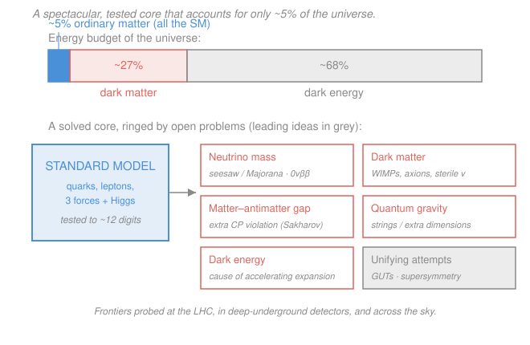

# Nuclear & Particle Physics · Lesson 5.5: Beyond the Standard Model

> ⏱ ~15 min · Module 5: The Standard Model · Builds on: [5.4 Neutrinos & oscillations](05-04-neutrinos-oscillations.md) · Unlocks: course finale — bridges forward to [`qft`](../../qft/syllabus.md), [`cosmology`](../../cosmology/syllabus.md), and [`astrophysics`](../../astrophysics/syllabus.md)

## Why this matters

The Standard Model (SM) is the most precisely tested theory in the history of science: it predicted the $W$, $Z$, top quark, and Higgs before anyone saw them, and it matches the electron's magnetic moment to about twelve significant figures. It is also, demonstrably, **not the whole story**. The cleanest proof is one you met last lesson — neutrinos oscillate, so they have mass, and the SM as originally written forbids that. Zoom out further and the theory describes only about **5% of what the universe is made of**. This final lesson is a map of the gap: the confirmed open problems, and the leading (still speculative) ideas for closing them. It is also where this course hands off to the ones that take these frontiers seriously.

## The idea

Think of the SM as a beautifully finished room in a house whose other rooms are dark. Inside the room everything is measured to absurd precision. But five doors lead out, and behind each is something we *know* is there and *cannot yet* describe:

1. **Neutrino mass.** Oscillation (5.4) requires it; the minimal SM has none.
2. **Dark matter.** Galaxies, clusters, and the cosmic microwave background all weigh about five times more than the visible matter can account for.
3. **The matter–antimatter asymmetry.** The Big Bang should have made equal amounts; instead we — and all the stars — are made of leftover matter.
4. **Gravity.** It simply isn't in the SM. There is no working quantum theory of it, and no explanation for why it is so absurdly weak (the *hierarchy problem*).
5. **Dark energy.** Something is accelerating the expansion of the universe, and it dominates the energy budget.

The honest stance — the one to carry out of this course — is that these are *open frontiers*, not solved puzzles with the answer withheld. There are candidate ideas, some elegant, none confirmed. Naming the problem precisely is itself most of the science.

## The formal version

**Problem 1 — Neutrino mass.** Oscillation means the flavor states $\nu_e,\nu_\mu,\nu_\tau$ are mixtures of mass states $\nu_1,\nu_2,\nu_3$ with *different* masses, so at least two masses are nonzero (5.4). Two ways to give a neutrino mass:

- **Dirac mass**, like every other fermion: you need a right-handed neutrino $\nu_R$ that the SM never included, and the coupling to the Higgs must be tiny (about $10^{-12}$ of the electron's) for no understood reason.
- **Majorana mass / seesaw.** If the neutrino is its own antiparticle (a *Majorana* fermion — possible only because it is electrically neutral), a very heavy partner of mass $M$ can push the observed mass down: schematically
$$m_\nu \sim \frac{m_D^2}{M},$$
where $m_D$ is a Dirac-scale mass (say $\sim 100\ \text{GeV}$). *In words: a huge $M$ makes $m_\nu$ naturally tiny* — plug $m_D\sim100\ \text{GeV}$ and $m_\nu\sim0.05\ \text{eV}$ and you get $M\sim10^{14}\ \text{GeV}$, tantalizingly near the grand-unification scale. The seesaw's smoking gun is **neutrinoless double-beta decay** ($0\nu\beta\beta$): two neutrons decay, emitting two electrons and *no* neutrinos, which can only happen if a neutrino emitted at one vertex is reabsorbed as an antineutrino at the other — i.e. if $\nu=\bar\nu$.

**Problem 2 — Dark matter.** Rotation curves, gravitational lensing, and the CMB power spectrum independently demand extra gravitating mass that neither shines nor absorbs light and is not ordinary (baryonic) matter. Leading candidates: **WIMPs** (weakly-interacting massive particles), **axions** (light particles invented for a different puzzle, strong-CP), and **sterile neutrinos** (right-handed neutrinos that feel no SM force but gravity). *In words: something massive and dark is out there; we have suspects but no arrest.*

**Problem 3 — Matter–antimatter asymmetry.** Andrei Sakharov showed that turning a symmetric Big Bang into a matter-dominated universe needs three conditions: baryon-number violation, C and CP violation, and a departure from thermal equilibrium. The SM has *some* CP violation (4.3, via the CKM phase) but far too little. *In words: the mirror between matter and antimatter must be more cracked than the SM allows.*

**Problem 4 — Gravity and the hierarchy problem.** Gravity is $\sim10^{-39}$ as strong as the other forces at particle scales, and quantizing it naïvely gives a nonsense (non-renormalizable) theory. Relatedly, quantum corrections *should* drag the Higgs mass up to the highest energy scale in the theory; keeping it at $125\ \text{GeV}$ looks like a fantastically fine-tuned cancellation. *In words: why is gravity so weak, and the Higgs so light?*

**Problem 5 — Dark energy**, plus the smaller puzzles: the *flavor puzzle* (why three generations with such wildly different masses?) and *strong CP* (why does the strong force respect a symmetry it needn't?).

**The leading ideas (clearly speculative).**

- **Grand Unified Theories (GUTs):** the running couplings of $SU(3)\times SU(2)\times U(1)$ nearly meet at $M_X\sim10^{16}\ \text{GeV}$, suggesting one force above that scale. Generic prediction: **proton decay**, e.g. $p\to e^+\pi^0$ — not yet seen, which has already killed the simplest version.
- **Supersymmetry (SUSY):** a partner particle for every SM particle. Its extra quantum corrections cancel the Higgs fine-tuning, it makes the GUT couplings meet *exactly*, and its lightest particle is a natural dark-matter candidate. Not yet observed at the LHC.
- **String theory / extra dimensions:** the leading route to quantizing gravity, at energies far beyond any collider.

## Picture

## Worked examples

**Example 1 (the 5% headline).** The cosmic energy budget is roughly 5% ordinary matter, 27% dark matter, 68% dark energy. How much *more* gravitating matter is dark than ordinary, and what fraction of the universe does the SM actually describe? The dark-to-ordinary ratio is $27/5\approx 5.4$ — there is over five times as much dark matter as everything the SM covers. Of the *matter* alone (ignoring dark energy), the dark fraction is $27/(27+5)\approx 0.84$: about 84% of all matter is invisible to the SM. And ordinary matter — every atom, star, and person — is $\approx5\%$ of the total. The theory that took this whole course to assemble describes one part in twenty of the cosmos.

**Example 2 (why $0\nu\beta\beta$ would prove Majorana neutrinos).** Ordinary two-neutrino double-beta decay, $(A,Z)\to(A,Z{+}2)+2e^-+2\bar\nu_e$, is a rare but SM-allowed process that conserves lepton number $L$ (two electrons, $L=+2$; two antineutrinos, $L=-2$; net zero). The neutrinoless mode $(A,Z)\to(A,Z{+}2)+2e^-$ produces two electrons and *nothing else*: net $L=+2$, so lepton number is **violated by two units**. The only way to erase the neutrinos is for the $\bar\nu_e$ emitted at one neutron to be absorbed as a $\nu_e$ at the other — which requires the neutrino and antineutrino to be *the same particle*. So observing $0\nu\beta\beta$ at any rate would prove neutrinos are Majorana fermions and that $L$ is not exactly conserved — a direct window onto the seesaw. *In words: no missing energy carried off by neutrinos means the neutrino ate itself, which only a Majorana particle can do.*

## Watch out

- **You might think "beyond the SM" means the SM is wrong.** It isn't — it is *incomplete*, the way Newtonian gravity is incomplete rather than wrong. Every BSM idea must reproduce the SM's twelve-digit successes at accessible energies.
- **You might think dark matter is just dim ordinary matter** (faint stars, gas, black holes). The CMB and light-element abundances fix the total *baryonic* budget independently, and it is far too small — dark matter must be something non-baryonic.
- **You might think oscillation is a small technical footnote.** It is the one piece of laboratory evidence that *forces* physics beyond the minimal SM. Massive neutrinos are not optional.
- **You might treat GUTs and SUSY as established.** They are not. Neither proton decay nor a single superpartner has been seen. Label them "promising, unconfirmed."

## One-liner

> The Standard Model explains about 5% of the universe to twelve decimal places — the other 95%, plus neutrino mass, the matter surplus, and gravity itself, is the unfinished frontier.

## Problems

**P1 (🟢)** Using the budget 5% ordinary matter, 27% dark matter, 68% dark energy: (a) how many times more dark matter than ordinary matter is there; (b) what fraction of the total *mass–energy* is *not* described by the Standard Model?

**P2 (🟡)** For each observation, name the SM open problem it reveals: (a) spiral-galaxy rotation curves stay flat far past the visible edge; (b) a muon-neutrino beam arrives partly as tau-neutrinos; (c) the universe is full of matter but almost no antimatter. Then explain in one sentence why observation (b) *cannot* be accommodated by neutrinos that are exactly massless.

**P3 (🔴, optional)** In a GUT, proton decay proceeds by exchanging a boson of mass $M_X\sim10^{16}\ \text{GeV}$, so the decay rate scales like a Fermi-style four-fermion process, $\Gamma_p \sim m_p^5/M_X^4$ (couplings set to 1, natural units $\hbar=c=1$). With $m_p\approx1\ \text{GeV}$, estimate the proton lifetime $\tau_p=1/\Gamma_p$ in years and compare it to the age of the universe ($\sim1.4\times10^{10}\ \text{yr}$). Use $1\ \text{GeV}^{-1}\approx6.6\times10^{-25}\ \text{s}$ and $1\ \text{yr}\approx3.2\times10^{7}\ \text{s}$.

Solutions

**P1** (a) $27/5 = 5.4$ times as much dark matter as ordinary matter. (b) The SM describes only the ordinary 5%, so the fraction it does *not* describe is $100\% - 5\% = 95\%$ (dark matter + dark energy).

*Check.* Order of magnitude: ordinary matter is a "rounding error" on the cosmic budget — the headline number of the whole lesson. ✓

**P2** (a) **Dark matter** — extra unseen gravitating mass holds the outer stars in fast orbits. (b) **Neutrino mass** (flavor oscillation, the theme of 5.4). (c) The **matter–antimatter asymmetry** (insufficient CP violation in the SM). Why massless neutrinos cannot oscillate: oscillation is an interference between mass eigenstates that accumulate phases $e^{-iE_it}$ at rates set by their masses; if all masses were equal (in particular, all zero) the phases would stay locked together, the flavor composition would never change, and the survival probability would be pinned at 1. Different flavors require different masses, so a nonzero mass difference is mandatory.

*Check.* Consistent with the survival formula $P=1-\sin^2 2\theta\,\sin^2(1.27\,\Delta m^2 L/E)$ from 5.4: set $\Delta m^2=0$ and the oscillating term vanishes, $P\equiv1$. ✓

**P3** With $\Gamma_p \sim m_p^5/M_X^4$ and everything in GeV:
$$\Gamma_p \sim \frac{(1\ \text{GeV})^5}{(10^{16}\ \text{GeV})^4} = \frac{1}{10^{64}}\ \text{GeV} = 10^{-64}\ \text{GeV}.$$
So $\tau_p = 1/\Gamma_p \sim 10^{64}\ \text{GeV}^{-1}$. Convert:
$$\tau_p \sim 10^{64}\times 6.6\times10^{-25}\ \text{s} \approx 6.6\times10^{39}\ \text{s} \approx \frac{6.6\times10^{39}}{3.2\times10^{7}}\ \text{yr} \approx 2\times10^{32}\ \text{yr}.$$
That is about $2\times10^{32}/1.4\times10^{10}\approx10^{22}$ times the age of the universe — the proton is effectively stable, which is why we exist.

*Check.* Realistic GUTs add coupling factors ($\sim\alpha_{\rm GUT}^2$) that push the estimate up to $\sim10^{35}\ \text{yr}$; the current experimental bound is $\tau_p\gtrsim10^{34}\ \text{yr}$, which has already excluded the *minimal* $SU(5)$ model. The method is sound: a tank holding $\sim10^{33}$ protons watched for a year probes lifetimes out to $\sim10^{33}$–$10^{34}\ \text{yr}$ (expected decays $\sim N/\tau_p$), exactly the regime these predictions live in. ✓

## Flashback

**From Lesson 5.4 (Neutrinos & oscillations):** A reactor emits electron-antineutrinos $\bar\nu_e$ of energy $E=4\ \text{MeV}=0.004\ \text{GeV}$. A detector sits $L=1\ \text{km}$ away. Using the two-flavor survival probability $P = 1 - \sin^2 2\theta\,\sin^2(1.27\,\Delta m^2 L/E)$ with the *solar* parameters $\Delta m^2 = 7.5\times10^{-5}\ \text{eV}^2$ and $\sin^2 2\theta = 0.85$ ($\Delta m^2$ in eV², $L$ in km, $E$ in GeV), find the survival probability. What does the result tell you about how far away a reactor experiment must sit to *see* this oscillation?

Solution

The oscillation phase is
$$1.27\,\frac{\Delta m^2 L}{E} = 1.27\times\frac{7.5\times10^{-5}\times 1}{0.004} = 1.27\times0.01875 \approx 0.0238\ \text{(rad)}.$$
Then $\sin^2(0.0238)\approx(0.0238)^2\approx5.7\times10^{-4}$, so
$$P = 1 - 0.85\times5.7\times10^{-4} \approx 1 - 4.8\times10^{-4} \approx 0.9995.$$
Essentially every antineutrino survives: at 1 km the solar splitting has barely begun to oscillate. To reach an appreciable dip you need the phase $\sim1$, i.e. $L$ larger by a factor $\sim1/0.0238\approx40$, so $L\sim50$–$200\ \text{km}$ — which is exactly why the KamLAND reactor experiment used detectors on that scale to nail the solar parameters.

*Check.* The phase scales as $L/E$; a tiny $\Delta m^2$ demands a long baseline (or low energy) to build up, consistent with the 5.4 rule that the first maximum sits at $L/E \propto 1/\Delta m^2$. ✓

## Connections

- **Backward:** this lesson collects the loose threads of the whole course — neutrino mass from oscillation (5.4), the Higgs origin of mass (5.2), CP violation and the Sakharov conditions (4.3), and the gauge structure $SU(3)\times SU(2)\times U(1)$ (5.3) whose couplings hint at unification. The arc runs unbroken from Module 1's nucleus ($R=r_0A^{1/3}$, binding energy, the ${}^{56}_{26}\mathrm{Fe}$ peak) through the forces that build and break it, to the edge of the known.
- **Forward:** the quantitative machinery deferred here — Feynman amplitudes, loops, renormalization, and the running couplings that make GUT unification precise — is the subject of [`qft`](../../qft/syllabus.md), the natural next course.
- **Sideways:** dark matter, dark energy, and the matter–antimatter asymmetry are studied from the cosmic side in [`cosmology`](../../cosmology/syllabus.md) and [`astrophysics`](../../astrophysics/syllabus.md); quantum gravity and GUTs sit at the frontier of [`qft`](../../qft/syllabus.md). The 5% figure is where particle physics and cosmology become one subject.
