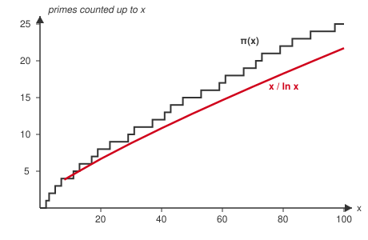

# Number Theory · Lesson 1.4: Counting the primes

> ⏱ ~15 min · Module 1: Divisibility and primes · Builds on: 1.3 (primes and the Fundamental Theorem of Arithmetic) · Unlocks: 2.1 (congruences: arithmetic modulo n)

## Why this matters

Lesson 1.3 gave you the atoms: every integer factors into primes in exactly one way. Now the natural questions. Do the atoms ever run out? (No.) How do you *check* a number is prime without brute force? (Look no further than $\sqrt n$.) And how thickly are primes sprinkled among the integers? That last question — answered by the Prime Number Theorem — is why you can generate a random 2048-bit prime for an RSA key in a fraction of a second: primes are common enough to stumble onto by guessing.

## The idea

Three separate facts, each with a one-line soul:

- **The primes never stop.** If they did, you could multiply them all together, add one, and manufacture a number that no known prime divides — a contradiction. This is Euclid's proof, and it's the cleanest proof-by-contradiction in mathematics.
- **To test if $n$ is prime, you only need to try divisors up to $\sqrt n$.** A composite number can't hide *all* its factors above its own square root — at least one must fall at or below $\sqrt n$. So trial division stops early.
- **Primes thin out, but predictably.** They get rarer as you climb, roughly like $1/\ln x$ — near $x$, about one number in every $\ln x$ is prime. That's the Prime Number Theorem, and it describes *density*, not *location*.

## The formal version

**Theorem (Euclid).** There are infinitely many primes.

*Proof.* Suppose not: say $p_1, p_2, \dots, p_k$ are *all* the primes. Form $N = p_1 p_2 \cdots p_k + 1$. Now $N > 1$, so by the Fundamental Theorem of Arithmetic (Lesson 1.3) it has some prime factor $p$. That $p$ must be one of our $p_i$. But $p_i \mid p_1 p_2 \cdots p_k$, and $p_i \mid N$ would then force $p_i \mid (N - p_1\cdots p_k) = 1$ — impossible, since no prime divides $1$. Contradiction. So the list was never complete. $\blacksquare$

In words: assume you've bottled every prime, build a number that leaves remainder $1$ when divided by each of them, and it announces a prime you missed.

**Lemma (why $\sqrt n$ is enough).** Every composite $n>1$ has a prime factor $p \le \sqrt n$.

*Proof.* Composite means $n = ab$ with $1 < a \le b < n$. If both exceeded $\sqrt n$, then $ab > \sqrt n \cdot \sqrt n = n$, a contradiction — so the smaller factor satisfies $a \le \sqrt n$. And $a$ has a prime factor $p \le a \le \sqrt n$, which also divides $n$. $\blacksquare$

In words: the two halves of a factorization can't *both* be big, so one is small enough to catch by $\sqrt n$.

**The prime-counting function.** Define
$$\pi(x) = \#\{\, p \le x : p \text{ prime}\,\},$$
the number of primes not exceeding $x$. In words: $\pi(x)$ just counts. So $\pi(10)=4$ (namely $2,3,5,7$) and $\pi(100)=25$.

**Theorem (Prime Number Theorem, stated, not proved).**
$$\pi(x) \sim \frac{x}{\ln x} \qquad\text{as } x \to \infty,$$
meaning the *ratio* $\pi(x) \big/ \dfrac{x}{\ln x} \to 1$. In words: for large $x$, the count of primes below $x$ is very close to $x/\ln x$, so the *chance a number near $x$ is prime* is about $1/\ln x$. What it promises: **density**. What it does **not** promise: the exact location of any prime, or that the approximation is close for small $x$ (at $x=100$ it's off by about 14 percent, undershooting the true $25$).

## Picture

$\pi(x)$ is a staircase: flat, then a unit jump at every prime. The smooth curve $x/\ln x$ runs just beneath it — always a little low, but tracking the same rise. As you zoom out to $x = 10^6, 10^9, \dots$, the gap between them shrinks *in relative terms*, which is exactly what "$\sim$" claims.

## Worked examples

**Example 1 (trial division, mechanical).** Is $211$ prime? Here $\sqrt{211} \approx 14.5$, so by the lemma we only test primes $\le 14$: that's $2,3,5,7,11,13$. Check each: $211$ is odd (not $2$); $2+1+1=4$ not divisible by $3$; doesn't end in $0/5$; $211 = 7\cdot30+1$ (not $7$); $211 = 11\cdot19+2$ (not $11$); $211 = 13\cdot16+3$ (not $13$). No prime $\le \sqrt{211}$ divides it, so — by the lemma's contrapositive, a number with no small prime factor can't be composite — $211$ is **prime**. Note we tested six primes, not all $210$ smaller numbers.

**Example 2 (reading the PNT honestly).** Roughly how many primes are below one million? Use $x/\ln x$ with $x = 10^6$ and $\ln(10^6) = 6\ln 10 \approx 13.82$:
$$\frac{10^6}{13.82} \approx 72{,}400.$$
The true value is $\pi(10^6) = 78{,}498$ — so $x/\ln x$ undershoots by about $8$ percent, in the right ballpark and improving as $x$ grows. The *useful* reading: near a million, roughly $1$ in every $14$ integers is prime. That density is why RSA key generation works — pick a random $512$-bit number, test it, and you expect success after a few hundred tries.

## Watch out

- You might think Euclid's proof says $p_1 \cdots p_k + 1$ *is prime*. It does **not** — it only says this number has a prime factor outside your list. Sometimes that number is composite: $2\cdot3\cdot5\cdot7\cdot11\cdot13 + 1 = 30031 = 59 \times 509$ (see P2). Both factors are new primes, so the proof holds — but neither is $30031$ itself.
- You might think $x/\ln x$ is an *upper* or *lower* bound. It's neither; it's an **asymptotic** — the ratio tends to $1$, but for finite $x$ it can sit on either side (here it undershoots). "$\sim$" is a statement about the limit, not a guarantee for your particular $x$.
- You might think "primes thin out" means big gaps eventually swallow them. Gaps *do* grow without bound — the numbers $n!+2, \dots, n!+n$ are $n-1$ consecutive composites (P3) — yet primes never stop, and (conjecturally, the twin-prime conjecture) pairs differing by $2$ keep appearing forever. Density decays; existence doesn't.

## One-liner

> The primes are infinite (Euclid), cheap to certify (test only up to $\sqrt n$), and thin out like $1/\ln x$ — common enough to find by guessing, patternless enough to hide a factorization.

## Problems

**P1 (🟢)** Use trial division to decide whether $149$ is prime. List exactly which primes you must test, say why you may stop there, and show the check.

**P2 (🟡)** Compute $E = 2\cdot3\cdot5\cdot7\cdot11\cdot13 + 1$. Is it prime? Factor it, and explain how the result is *consistent* with Euclid's proof rather than a counterexample to it.

**P3 (🔴, optional)** Show that for every integer $n \ge 2$ there is a run of at least $n-1$ consecutive composite numbers. (Hint: look at $n!+2, n!+3, \dots, n!+n$.) What does this say about prime gaps?

Solutions

**P1** $\sqrt{149} \approx 12.2$, so by the lemma every prime factor of a composite $149$ would be $\le 12$; it suffices to test the primes $2, 3, 5, 7, 11$. Checks: $149$ is odd; digit sum $1+4+9=14$ is not divisible by $3$; it doesn't end in $0$ or $5$; $149 = 7\cdot21 + 2$; $149 = 11\cdot13 + 6$. None divides it, so $149$ has no prime factor $\le \sqrt{149}$ — hence it is **prime**.

**P2** $2\cdot3\cdot5\cdot7\cdot11\cdot13 = 30030$, so $E = 30031$. Trial-divide by primes up to $\sqrt{30031}\approx173$: it survives $2,3,5,7,11,13$ by construction (it's $\equiv 1$ modulo each), and testing onward you find $30031 = 59 \times 509$ (indeed $59\cdot509 = 30031$, and both $59$ and $509$ are prime). So $E$ is **composite**. This is fully consistent with Euclid: his proof never claims $p_1\cdots p_k+1$ is prime — only that it has a prime factor *not* among $\{2,3,5,7,11,13\}$. Here that promise is kept twice over, since $59$ and $509$ are both new primes.

**P3** For each $k$ with $2 \le k \le n$, the number $n!+k$ is divisible by $k$: since $k \le n$, $k$ appears as a factor in $n! = 1\cdot2\cdots n$, so $k \mid n!$, and $k \mid k$, hence $k \mid (n!+k)$. Also $n!+k > k$, so it is a proper multiple of $k$ and therefore composite. The values $k = 2, 3, \dots, n$ give $n-1$ consecutive composite integers $n!+2, \dots, n!+n$. Since $n$ is arbitrary, prime gaps can be made **arbitrarily large** — there is no bound on the distance between consecutive primes, even though the primes themselves are infinite.

## Flashback

**From Lesson 1.3 (Primes and the Fundamental Theorem of Arithmetic):** Let $a = 2^3 \cdot 3^2 \cdot 5$ and $b = 2 \cdot 3^3 \cdot 7$. Using the factorizations only, compute $\gcd(a,b)$ and $\operatorname{lcm}(a,b)$, then verify that $\gcd(a,b)\cdot\operatorname{lcm}(a,b) = a\cdot b$.

Solution

Take the minimum exponent on each prime for the gcd, the maximum for the lcm:
$$\gcd(a,b) = 2^{\min(3,1)}3^{\min(2,3)}5^{\min(1,0)}7^{\min(0,1)} = 2^1 3^2 = 18,$$
$$\operatorname{lcm}(a,b) = 2^{\max(3,1)}3^{\max(2,3)}5^{\max(1,0)}7^{\max(0,1)} = 2^3 3^3 5 \cdot 7 = 7560.$$
Then $\gcd\cdot\operatorname{lcm} = 18\cdot7560 = 136{,}080$. And $a = 360$, $b = 378$, so $a\cdot b = 360\cdot378 = 136{,}080$. They match — as they must, since for each prime $\min(e,f) + \max(e,f) = e + f$, so the exponents on both sides agree prime by prime.

## Connections

- **Backward:** Both new results lean on Lesson 1.3 — Euclid's proof invokes the FTA to guarantee $N$ has a prime factor, and the $\sqrt n$ lemma is just a factorization $n=ab$ read carefully.
- **Forward:** Trial division to $\sqrt n$ is fine for small $n$ but hopeless for the hundred-digit numbers in cryptography; Lesson 5.3 (primality testing) replaces it with Fermat and Miller–Rabin, which certify primality *without* finding a factor. The PNT's density estimate is what makes random prime generation for RSA (Lesson 5.4) practical.
- **Sideways:** The full analytic proof of the PNT — via the Riemann zeta function and complex analysis — is deliberately deferred out of this course (it waits for a later analytic number theory track). And the "$1$ in $\ln x$ numbers is prime" density is a genuine information-theoretic statement: it fixes the entropy of a random prime near $x$, i.e. how many bits of randomness a fresh RSA prime carries — a bridge to [information-theory](../information-theory/syllabus.md).
