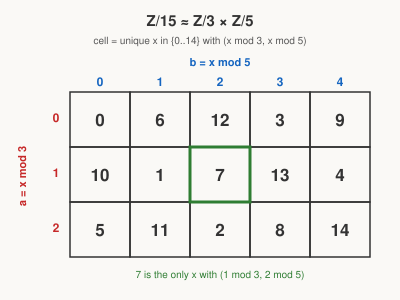

# Number Theory · Lesson 2.4: The Chinese Remainder Theorem

> ⏱ ~15 min · Module 2: Congruences and the Chinese Remainder Theorem · Builds on: 2.2 (linear congruences and modular inverses) · Unlocks: 3.1 (Fermat's little theorem)

## Why this matters

A number is often easier to understand by its *shadows* than by its full self. "What is $x$?" is hard; "what is $x$ mod $3$, and separately mod $5$?" is easy — and the Chinese Remainder Theorem (CRT) says those two easy answers pin down $x$ completely (mod $15$). This is the trick behind fast RSA decryption (Lesson 5.4), the reason Euler's $\varphi$ is multiplicative (Lesson 3.2), and how computers do giant-integer arithmetic in parallel. It's also your first taste of a *product structure*: one big system splitting cleanly into independent small ones.

## The idea

Suppose you know a mystery number leaves remainder $2$ when divided by $3$, and remainder $1$ when divided by $5$. Can you recover it? Not exactly — but you can recover it **mod $15$**, and there's exactly *one* value in $\{0,1,\dots,14\}$ that fits both clues. Here it's $11$: check $11 = 3\cdot3+2$ and $11 = 5\cdot2+1$. ✓

Why does one answer always exist, and why exactly one? Because as $x$ runs through $0,1,\dots,14$, the pair (remainder mod $3$, remainder mod $5$) never repeats — it cycles through all $3\times 5 = 15$ possible pairs exactly once. So specifying the pair *is* specifying $x$. The moduli $3$ and $5$ must share no common factor for this to work: coprimality is what stops the pairs from colliding.

The one-sentence version: **coprime moduli carve up the integers into independent coordinates, and CRT is the guarantee that every combination of coordinates is hit by exactly one residue.**

## The formal version

**Chinese Remainder Theorem.** Let $n_1, n_2, \dots, n_k$ be **pairwise coprime** (every pair has $\gcd = 1$), and set $N = n_1 n_2 \cdots n_k$. Then for any target remainders $a_1, \dots, a_k$, the system

$$x \equiv a_1 \pmod{n_1}, \quad x \equiv a_2 \pmod{n_2}, \quad \dots, \quad x \equiv a_k \pmod{n_k}$$

has a solution $x$, and that solution is **unique modulo $N$**.

In words: any consistent list of "remainder mod $n_i$" demands can be met simultaneously, and all solutions differ by a multiple of the product $N$.

**Constructive solution.** For each $i$, let $M_i = N / n_i$ (the product of *all the other* moduli). Since the $n_j$ are pairwise coprime, $\gcd(M_i, n_i) = 1$, so $M_i$ is a unit mod $n_i$ and has an inverse $y_i \equiv M_i^{-1} \pmod{n_i}$ (found by the method of Lesson 2.2). Then

$$x = \sum_{i=1}^{k} a_i \, M_i \, y_i \pmod{N}.$$

Why it works: $M_i$ is divisible by every $n_j$ with $j \neq i$, so mod $n_j$ every term vanishes *except* the $i=j$ one. That surviving term is $a_j M_j y_j \equiv a_j \cdot 1 = a_j \pmod{n_j}$, because $M_j y_j \equiv 1$. Each equation sees exactly its own $a_j$. In words: build a "switch" $M_i y_i$ that reads $1$ mod $n_i$ and $0$ mod every other modulus, then dial in $a_i$.

**The ring-isomorphism view.** The map sending each residue to its tuple of shadows,

$$\mathbb{Z}/N\mathbb{Z} \;\xrightarrow{\ \cong\ }\; \mathbb{Z}/n_1\mathbb{Z} \times \cdots \times \mathbb{Z}/n_k\mathbb{Z}, \qquad x \bmod N \;\mapsto\; (x \bmod n_1,\, \dots,\, x \bmod n_k),$$

is a **ring isomorphism** ($\cong$): a bijection that respects both $+$ and $\times$. For two moduli that reads $\mathbb{Z}/mn\mathbb{Z} \cong \mathbb{Z}/m\mathbb{Z} \times \mathbb{Z}/n\mathbb{Z}$ whenever $\gcd(m,n)=1$. In words: doing arithmetic mod $N$ is *identical* to doing it componentwise in the smaller moduli — you can add or multiply the shadows separately and reassemble. CRT existence is "the map is onto"; uniqueness is "the map is one-to-one."

## Picture

Every one of the $15$ cells holds a distinct residue — no repeats, no gaps. Reading off a cell is the forward map $x \mapsto (x\bmod 3,\, x\bmod 5)$; *finding* the cell for a given pair is solving a CRT system. The highlighted cell is our worked pair $(1,2) \to 7$.

## Worked examples

**Example 1 (mechanical — the constructive recipe).** Solve
$$x \equiv 2 \pmod 3, \qquad x \equiv 3 \pmod 5, \qquad x \equiv 2 \pmod 7.$$
Moduli $3,5,7$ are pairwise coprime, $N = 105$.

- $M_1 = 105/3 = 35$. Need $y_1 \equiv 35^{-1} \pmod 3$. Since $35 \equiv 2 \pmod 3$ and $2\cdot 2 = 4 \equiv 1$, take $y_1 = 2$.
- $M_2 = 105/5 = 21$. Need $y_2 \equiv 21^{-1} \pmod 5$. Since $21 \equiv 1 \pmod 5$, take $y_2 = 1$.
- $M_3 = 105/7 = 15$. Need $y_3 \equiv 15^{-1} \pmod 7$. Since $15 \equiv 1 \pmod 7$, take $y_3 = 1$.

Assemble:
$$x = 2(35)(2) + 3(21)(1) + 2(15)(1) = 140 + 63 + 30 = 233 \equiv 233 - 2\cdot105 = 23 \pmod{105}.$$
Check: $23 = 3\cdot7+2$ ✓, $23 = 5\cdot4+3$ ✓, $23 = 7\cdot3+2$ ✓. The unique solution mod $105$ is $\boxed{23}$.

**Example 2 (why you'd care — the parallel-arithmetic payoff).** Compute $17 \times 17 \bmod 15$ *without multiplying $17\times 17$ directly*, using the isomorphism $\mathbb{Z}/15 \cong \mathbb{Z}/3 \times \mathbb{Z}/5$. First take shadows: $17 \equiv 2 \pmod 3$ and $17 \equiv 2 \pmod 5$, so $17 \mapsto (2,2)$. Square componentwise: $(2\cdot2, 2\cdot2) = (4,4) = (1 \bmod 3,\ 4 \bmod 5)$. Now reassemble the pair $(1,4)$ — from the grid, that's the cell holding $4$. So $17^2 \equiv 4 \pmod{15}$. Direct check: $289 = 15\cdot 19 + 4$ ✓. This is exactly how RSA and big-number libraries speed up: split into coprime pieces, work in parallel on the small ones, glue back with CRT.

## Watch out

- You might think CRT works for *any* moduli, but **pairwise coprimality is essential**. Try $x \equiv 1 \pmod 2$ and $x \equiv 0 \pmod 4$: no solution, because mod $4$ already forces the mod-$2$ value ($x$ even), contradicting $x$ odd. When $\gcd(m,n) = d > 1$, a system is solvable *only if* $a_1 \equiv a_2 \pmod d$, and then it's unique mod $\mathrm{lcm}(m,n)$, not $mn$.
- You might think you need $a_i$ in a special range — you don't. The $a_i$ are just target remainders; reduce them mod $n_i$ if you like, but $a_1 = 2$ and $a_1 = 5$ (mod $3$) give the same system.
- Don't forget to reduce the final $\sum a_i M_i y_i$ mod $N$ — the raw sum ($233$ above) is a valid solution, but the problem usually wants the smallest nonnegative one ($23$).

## One-liner

> Coprime moduli are independent coordinates on the integers, and CRT is the promise that every combination of coordinates is named by exactly one residue mod the product.

## Problems

**P1 (🟢)** Solve $x \equiv 2 \pmod 4$ and $x \equiv 3 \pmod 5$ for the smallest positive $x$. (Moduli are coprime, so CRT applies with $N = 20$.)

**P2 (🟡)** Use the isomorphism $\mathbb{Z}/35 \cong \mathbb{Z}/5 \times \mathbb{Z}/7$ to find all solutions of $x^2 \equiv 4 \pmod{35}$ by solving $x^2 \equiv 4$ in each component separately, then recombining. (Hint: mod a prime, $x^2 \equiv 4$ has the two roots $\pm 2$; four sign combinations give four residues mod $35$.)

**P3 (🔴, optional)** Show the system $x \equiv 3 \pmod 6$ and $x \equiv 1 \pmod{10}$ has no solution, then modify only the *right-hand side* of the second congruence to make it solvable, and give the full solution set (state the modulus of uniqueness). (Note $\gcd(6,10) = 2$.)

Solutions

**P1** $N = 20$, $M_1 = 5$, $M_2 = 4$. Inverses: $5 \equiv 1 \pmod 4 \Rightarrow y_1 = 1$; $4 \equiv 4 \pmod 5$ and $4\cdot 4 = 16 \equiv 1 \Rightarrow y_2 = 4$. Then $x = 2(5)(1) + 3(4)(4) = 10 + 48 = 58 \equiv 58 - 2\cdot 20 = 18 \pmod{20}$. Smallest positive: $\boxed{18}$. Check: $18 = 4\cdot4+2$ ✓, $18 = 5\cdot3+3$ ✓.

**P2** Mod $5$: $x^2 \equiv 4$ gives $x \equiv 2$ or $x \equiv 3\ (\equiv -2)$. Mod $7$: $x \equiv 2$ or $x \equiv 5\ (\equiv -2)$. Four pairs to recombine via CRT ($N=35$, $M_1=7,\ y_1 = 7^{-1}\equiv 3 \bmod 5$; $M_2=5,\ y_2 = 5^{-1}\equiv 3 \bmod 7$, so $x \equiv 21 a_1 + 15 a_2$):
- $(2,2)$: $x \equiv 2$ — indeed $2^2=4$ ✓
- $(3,5)$: $21\cdot3 + 15\cdot5 = 63+75 = 138 \equiv 138 - 3\cdot35 = 33 \equiv -2$ ✓ ($33^2 = 1089 = 35\cdot31+4$)
- $(2,5)$: $21\cdot2 + 15\cdot5 = 42+75 = 117 \equiv 117-3\cdot35 = 12$; check $12^2 = 144 = 35\cdot4+4$ ✓
- $(3,2)$: $21\cdot3 + 15\cdot2 = 63+30 = 93 \equiv 93-2\cdot35 = 23$; check $23^2 = 529 = 35\cdot15+4$ ✓

So $x \equiv 2,\,12,\,23,\,33 \pmod{35}$ — **four** square roots of $4$, not two. (Composite moduli can have extra roots; that's a CRT consequence used later in factoring and primality.)

**P3** $x \equiv 3 \pmod 6$ forces $x$ odd; $x \equiv 1 \pmod{10}$ also forces $x$ odd — consistent so far — but check mod $\gcd(6,10)=2$: the first gives $x \equiv 3 \equiv 1 \pmod 2$, the second $x \equiv 1 \pmod 2$. Those agree, so try mod... the real obstruction is subtler; test directly. From $x \equiv 3 \pmod 6$: $x \in \{3,9,15,21,27,33,\dots\}$. From $x \equiv 1 \pmod{10}$: $x \in \{1,11,21,31,\dots\}$. Reducing mod $2$ they match, but solvability needs $a_1 \equiv a_2 \pmod{\gcd} = \pmod 2$: $3 \equiv 1 \pmod 2$ ✓ — so a solution *should* exist. Indeed $x = 21$ satisfies both ($21 = 6\cdot3+3$, $21 = 10\cdot2+1$). So this system **is** solvable, unique mod $\mathrm{lcm}(6,10)=30$: $x \equiv 21 \pmod{30}$.

The genuinely unsolvable modification: keep $x \equiv 3 \pmod 6$ but change the second to $x \equiv 2 \pmod{10}$. Now the first forces $x$ odd, the second forces $x$ even — $a_1 = 3 \not\equiv 2 = a_2 \pmod 2$, so **no solution**. To repair, pick any right-hand side congruent to $3 \pmod 2$, e.g. $x \equiv 3 \pmod{10}$: then $x \equiv 3 \pmod 6$ and $x \equiv 3 \pmod{10}$ share $x=3$, giving $x \equiv 3 \pmod{30}$. Lesson: with non-coprime moduli, solvability hinges on agreement modulo the gcd, and uniqueness is mod the lcm — never the product.

## Flashback

**From Lesson 2.1 (Congruences: arithmetic modulo n):** Compute $7^{2} \cdot 4 \bmod 9$ by reducing at each step (never carrying big numbers). Then: from $6x \equiv 6y \pmod 9$, may you cancel the $6$ to conclude $x \equiv y \pmod 9$? Explain.

Solution

Reduce as you go: $7^2 = 49 \equiv 4 \pmod 9$ (since $49 = 9\cdot5+4$), so $7^2 \cdot 4 \equiv 4\cdot 4 = 16 \equiv 7 \pmod 9$. Answer: $\boxed{7}$.

Cancellation: **no**, not directly. Cancelling $a$ in a congruence mod $n$ is legal only when $\gcd(a,n) = 1$, and here $\gcd(6,9) = 3 \neq 1$. The correct rule divides the modulus too: $6x \equiv 6y \pmod 9 \Rightarrow x \equiv y \pmod{9/\gcd(6,9)} = \pmod 3$. So you may only conclude $x \equiv y \pmod 3$ — e.g. $x=0,\ y=3$ satisfy $6x \equiv 6y \pmod 9$ (both $\equiv 0$) yet $x \not\equiv y \pmod 9$.

## Connections

- **Backward:** the constructive step *is* Lesson 2.2 — every $y_i = M_i^{-1} \bmod n_i$ is a modular inverse, computable because pairwise coprimality makes each $M_i$ a unit. And the non-coprime failure mode reuses the solvability criterion $\gcd(a,n)\mid b$ from linear congruences.
- **Forward:** Lesson 3.2 uses $\mathbb{Z}/mn \cong \mathbb{Z}/m \times \mathbb{Z}/n$ to prove $\varphi$ is **multiplicative** ($\varphi(mn) = \varphi(m)\varphi(n)$ for coprime $m,n$), since the isomorphism matches units to pairs of units. Lesson 4.1 leans on the same multiplicative splitting for $\tau,\sigma$; Lesson 5.4 uses CRT to speed RSA decryption by working mod $p$ and mod $q$ separately, then gluing.
- **Sideways (`abstract-algebra`):** this is the **product of rings** $R \times S$ and the first structure theorem you'll meet — the general CRT for coprime ideals. In CS, the same idea is the **residue number system**: represent a big integer by its residues mod a fixed coprime base, so addition and multiplication run digit-independent and fully in parallel, with no carries between channels.
