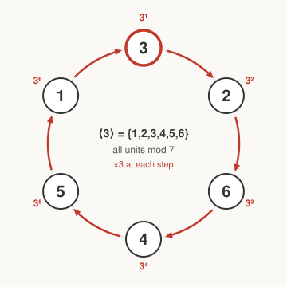

# Number Theory · Lesson 3.4: Primitive roots

> ⏱ ~15 min · Module 3: The multiplicative group modulo n · Builds on: 3.3 (order and the group of units) · Unlocks: 4.1 (arithmetic functions and Möbius inversion)

## Why this matters

In Lesson 3.3 the units mod $n$ became a group, and every unit had an order dividing $\varphi(n)$. Now we ask the sharpest possible question about that group: is there a *single* unit whose powers hit **everything**? When the answer is yes, the tangled multiplication table collapses into a clock — and that collapse is exactly what makes discrete logarithms, quadratic reciprocity, and Diffie–Hellman key exchange tick. The same object you meet here reappears as "cyclic group" in `abstract-algebra` and as the hardness assumption guarding your bank login in `cryptography`.

## The idea

Fix a modulus, say $7$, and pick the unit $3$. Multiply it by itself over and over, reducing mod $7$ each time:

$$3,\ 9\!\equiv\!2,\ 6,\ 18\!\equiv\!4,\ 12\!\equiv\!5,\ 15\!\equiv\!1.$$

You just walked through **every** nonzero residue mod $7$ — $\{3,2,6,4,5,1\} = \{1,2,3,4,5,6\}$ — before returning to $1$. One element, cranked like an odometer, generated the whole group. Such an element is a **primitive root**. It says the group isn't just "some units multiplying"; it's a single loop, and $3$ is the crank that runs it.

Two things follow immediately. First, a primitive root has the largest possible order, $\varphi(n)$ — anything smaller would close the loop early and miss some units. Second, once you have one, every unit is "$g$ to some power," so multiplication becomes *addition of exponents* — the trick behind the discrete logarithm at the end of this lesson.

## The formal version

Let $g$ be a unit mod $n$ (so $\gcd(g,n)=1$). We call $g$ a **primitive root** mod $n$ if

$$\mathrm{ord}_n(g) = \varphi(n),$$

where $\mathrm{ord}_n(g)$ is the least positive $k$ with $g^{k}\equiv 1 \pmod{n}$ (Lesson 3.3). In words: $g$'s order is as large as it could possibly be. Equivalently, the powers $g^1,g^2,\dots,g^{\varphi(n)}$ run through **all** $\varphi(n)$ units exactly once — so the group of units $(\mathbb{Z}/n\mathbb{Z})^\times$ is **cyclic**, generated by $g$. "Primitive root exists" and "unit group is cyclic" are the same statement.

**Existence mod a prime.** For every prime $p$, a primitive root exists — $(\mathbb{Z}/p\mathbb{Z})^\times$ is cyclic. The counting idea: for each divisor $d\mid p-1$, the number of units of order exactly $d$ is either $0$ or $\varphi(d)$. Since every unit has *some* order dividing $p-1$, summing gives $\sum_{d\mid p-1}(\text{count of order }d) = p-1$. But $\sum_{d\mid p-1}\varphi(d) = p-1$ as well, so *no* count can be $0$ — in particular there are $\varphi(p-1)$ units of order $p-1$. Those are the primitive roots. (Note there are usually several, not one.)

**Exactly which moduli have one.** A primitive root mod $n$ exists **iff**

$$n \in \{\,1,\ 2,\ 4,\ p^{k},\ 2p^{k}\,\}\quad(p\text{ an odd prime},\ k\ge 1).$$

In words: only $1,2,4$, odd-prime powers, and twice an odd-prime power. Everything else — $8$, $12$, $15$, any $n$ with two distinct odd prime factors — has a *non*-cyclic unit group and no generator.

**Testing a candidate.** You don't need to compute the full order to check if $g$ is primitive. Let $q_1,\dots,q_r$ be the **distinct prime divisors** of $\varphi(n)$. Then

$$g \text{ is a primitive root} \iff g^{\varphi(n)/q_i} \not\equiv 1 \pmod{n} \text{ for every } i.$$

In words: the order of $g$ divides $\varphi(n)$, so the only way it could fall short is by dividing one of the "one prime smaller" exponents $\varphi(n)/q_i$; rule those out and the order must be the whole of $\varphi(n)$.

**The index (discrete logarithm).** Fix a primitive root $g$ mod $n$. Every unit $a$ is $a\equiv g^{k}$ for a unique $k$ modulo $\varphi(n)$; that exponent is the **index** of $a$, written $\mathrm{ind}_g(a)=k$. It satisfies

$$\mathrm{ind}_g(ab)\equiv \mathrm{ind}_g(a)+\mathrm{ind}_g(b)\pmod{\varphi(n)}.$$

In words: relative to a chosen generator, the index is a logarithm — it turns multiplication mod $n$ into addition mod $\varphi(n)$. Computing $g^k$ is fast; recovering $k$ from $a$ is the **discrete logarithm problem**, and for large primes nobody knows how to do it quickly.

## Picture

Each arrow is "$\times 3$." Starting at $3^1=3$ and stepping around, the six powers $3,2,6,4,5,1$ visit every unit mod $7$ before closing the loop — the group is one cycle, and $3$ is its crank.

## Worked examples

**Example 1 (mechanical — test a candidate).** Is $2$ a primitive root mod $11$? Here $\varphi(11)=10$, whose distinct prime divisors are $q_1=2,\ q_2=5$. Check the two "one-prime-smaller" exponents $10/2=5$ and $10/5=2$:

$$2^{5}=32\equiv 10\equiv -1 \pmod{11}\ (\neq 1),\qquad 2^{2}=4 \pmod{11}\ (\neq 1).$$

Neither is $1$, so $\mathrm{ord}_{11}(2)$ can't be a proper divisor of $10$ — it must be $10=\varphi(11)$. **Yes, $2$ is a primitive root mod $11$.** Notice we settled it in two exponentiations, never computing the full order.

**Example 2 (why you'd care — discrete log).** Because $2$ generates mod $11$, tabulate the powers once:

| $k$ | 1 | 2 | 3 | 4 | 5 | 6 | 7 | 8 | 9 | 10 |
|---|---|---|---|---|---|---|---|---|---|---|
| $2^{k}\bmod 11$ | 2 | 4 | 8 | 5 | 10 | 9 | 7 | 3 | 6 | 1 |

Read backwards, this is the index table: $\mathrm{ind}_2(3)=8$, $\mathrm{ind}_2(5)=4$, and so on. Now solve $3x\equiv 5 \pmod{11}$ *without* inverting anything — just take indices of both sides:

$$\mathrm{ind}_2(3)+\mathrm{ind}_2(x)\equiv \mathrm{ind}_2(5)\pmod{10}\ \Longrightarrow\ 8+\mathrm{ind}_2(x)\equiv 4\ \Longrightarrow\ \mathrm{ind}_2(x)\equiv -4\equiv 6.$$

So $x\equiv 2^{6}\equiv 9\pmod{11}$. Check: $3\cdot 9=27\equiv 5$. A multiplicative congruence became a one-line *addition* mod $10$ — that is the entire payoff of a primitive root, and running this reduction *backwards* (given $g^k$, recover $k$) is precisely the trapdoor Diffie–Hellman leans on.

## Watch out

- **You might think a primitive root is unique** — but there are $\varphi(\varphi(n))$ of them when any exist (mod $11$: $\varphi(10)=4$ generators, namely $2,6,7,8$). "The" primitive root only makes sense once you *choose* one to index against.
- **You might think checking $g^{\varphi(n)}\equiv 1$ confirms a generator** — it does not; that holds for *every* unit by Euler's theorem. The real test is the proper-divisor exponents $g^{\varphi(n)/q_i}\not\equiv 1$. Skipping them is the classic mistake.
- **You might think every modulus has one** — $8$, $12$, and $15$ do not. Before hunting for a generator, check $n$ is of the form $1,2,4,p^k,2p^k$; otherwise the group simply isn't cyclic and you're chasing a ghost.
- **The index lives mod $\varphi(n)$, not mod $n$.** Exponents wrap around at $\varphi(n)$ (that's the order of $g$), so all index arithmetic is done modulo $\varphi(n)$ — mixing the two moduli is a sign error waiting to happen.

## One-liner

> A primitive root is one unit whose powers sweep out the entire group — it turns the units mod $n$ into a clock and multiplication into the addition of times.

## Problems

**P1 (🟢)** Confirm that $3$ is a primitive root mod $7$ by the divisor test. ($\varphi(7)=6$; its distinct prime divisors are $2$ and $3$.) Which two powers do you compute, and what do you conclude?

**P2 (🟡)** Using the index table for the primitive root $2$ mod $11$ from Example 2, solve $7x\equiv 6 \pmod{11}$ by taking indices — no modular inverse. Verify your answer directly. *(This is a shrunk toy of the discrete-log step in `cryptography`.)*

**P3 (🔴, optional)** Show that $8$ has **no** primitive root: list the units mod $8$, compute the square of each, and argue that every unit has order dividing $2$, so none can reach order $\varphi(8)=4$.

Solutions

**P1** Compute the two "one-prime-smaller" exponents $6/2=3$ and $6/3=2$:
$$3^{3}=27\equiv 6\equiv -1 \pmod 7\ (\neq 1),\qquad 3^{2}=9\equiv 2 \pmod 7\ (\neq 1).$$
Neither equals $1$, so $\mathrm{ord}_7(3)$ is not a proper divisor of $6$; since the order must divide $6$, it equals $6=\varphi(7)$. Hence $3$ is a primitive root mod $7$ — matching the odometer in the Picture.

**P2** From the table, $\mathrm{ind}_2(7)=7$ and $\mathrm{ind}_2(6)=9$. Taking indices of $7x\equiv 6$:
$$\mathrm{ind}_2(7)+\mathrm{ind}_2(x)\equiv \mathrm{ind}_2(6)\pmod{10}\ \Longrightarrow\ 7+\mathrm{ind}_2(x)\equiv 9\ \Longrightarrow\ \mathrm{ind}_2(x)\equiv 2.$$
So $x\equiv 2^{2}\equiv 4\pmod{11}$. Check: $7\cdot 4=28\equiv 6\pmod{11}$. ✓

**P3** The units mod $8$ are those coprime to $8$: $\{1,3,5,7\}$, so $\varphi(8)=4$. Squaring each:
$$1^2=1,\quad 3^2=9\equiv 1,\quad 5^2=25\equiv 1,\quad 7^2=49\equiv 1 \pmod 8.$$
Every unit squares to $1$, so each has order $1$ or $2$ — never $4$. Since a primitive root would need order $\varphi(8)=4$, none exists; $(\mathbb{Z}/8\mathbb{Z})^\times$ is not cyclic. (Consistent with the classification: $8=2^3$ is not of the form $1,2,4,p^k,2p^k$.)

## Flashback

**From Lesson 3.3 (Order and the group of units):** Compute $\mathrm{ord}_{11}(5)$, the multiplicative order of $5$ modulo $11$, and verify that it divides $\varphi(11)$.

Solution

Multiply up, reducing mod $11$: $5^1=5$, $5^2=25\equiv 3$, $5^3\equiv 15\equiv 4$, $5^4\equiv 20\equiv 9$, $5^5\equiv 45\equiv 1$. The least exponent giving $1$ is $5$, so $\mathrm{ord}_{11}(5)=5$. And $\varphi(11)=10$, with $5\mid 10$. ✓ (Lagrange's constraint from 3.3 holds — and since $5<10$, this unit is *not* a primitive root mod $11$, unlike $2$.)

## Connections

- **Backward:** this is the extremal case of $\mathrm{ord}_n(a)\mid\varphi(n)$ from Lesson 3.3 — a primitive root is a unit that saturates that bound, forcing the group to be one cycle.
- **Forward:** Lesson 4.2 shows the quadratic residues mod $p$ are exactly the units of **even index** relative to any primitive root (squares are $g^{2m}$), turning "is $a$ a square?" into "is $\mathrm{ind}_g(a)$ even?" — the doorway to Euler's criterion.
- **Sideways (`abstract-algebra`):** "$(\mathbb{Z}/p\mathbb{Z})^\times$ is cyclic" is your first nontrivial cyclic group; the index map is a concrete group isomorphism $(\mathbb{Z}/p\mathbb{Z})^\times \cong (\mathbb{Z}/(p-1)\mathbb{Z},+)$.
- **Sideways (`cryptography`, `information-theory`):** exponentiating a primitive root is easy but inverting it (the discrete log) is believed hard — the asymmetry behind Diffie–Hellman key exchange and ElGamal, and a worked instance of a one-way function.
