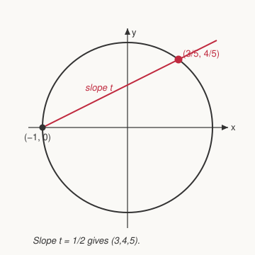

# Number Theory · Lesson 5.1: Pythagorean triples

> ⏱ ~15 min · Module 5: Diophantine equations and cryptography · Builds on: 1.3 (primes and the Fundamental Theorem of Arithmetic) · Unlocks: 5.2 (Pell's equation and continued fractions)

## Why this matters

$a^2 + b^2 = c^2$ is the first *Diophantine* equation most people ever meet — an equation where you only accept whole-number answers. The surprise is that this famously hard-looking demand has a complete, closed-form answer: a single formula spits out **every** solution, no exceptions. That's rare and precious. The technique behind it — turn an integer equation into a hunt for *rational points on a curve* — is the seed of both Pell's equation (next lesson) and the entire subject of arithmetic geometry. It's also the equation Fermat was scribbling next to when he claimed $a^n+b^n=c^n$ has no solutions for $n \ge 3$.

## The idea

A **Pythagorean triple** is three positive integers with $a^2+b^2=c^2$: the sides of a right triangle with whole-number sides, like $(3,4,5)$. You can make cheap copies by scaling — $(6,8,10)$, $(9,12,15)$ — so the real content is in the triples that *aren't* copies: the **primitive** ones, where $\gcd(a,b,c)=1$. Every triple is just a primitive triple blown up by a constant, so if we bag all the primitives, we've bagged them all.

Here's the trick that catches every primitive triple at once. Divide $a^2+b^2=c^2$ by $c^2$:
$$\left(\tfrac{a}{c}\right)^2 + \left(\tfrac{b}{c}\right)^2 = 1.$$
So each triple is secretly a point $(x,y) = (a/c,\, b/c)$ **with rational coordinates sitting on the unit circle**. Find all the rational points on the circle and you've found all the triples. And rational points on a circle are easy to sweep up: stand at one known rational point, $(-1,0)$, and fire a line at every rational slope $t$. Each line hits the circle at exactly one *other* point — and that point is rational precisely when $t$ is. One rational slope in, one rational point out.

## The formal version

**Theorem (parametrization of primitive triples).** Every primitive Pythagorean triple with $b$ even is
$$a = m^2 - n^2, \qquad b = 2mn, \qquad c = m^2 + n^2,$$
for a unique pair of integers $m > n > 0$ that are **coprime** ($\gcd(m,n)=1$) and of **opposite parity** (one even, one odd). Conversely, every such $(m,n)$ produces a primitive triple.

In words: the primitive triples are exactly what you get by feeding coprime, opposite-parity $m>n$ into these three formulas — nothing is missing and nothing is double-counted.

*Why the line does the work.* The line through $(-1,0)$ of slope $t$ is $y = t(x+1)$. Substitute into $x^2+y^2=1$:
$$x^2 + t^2(x+1)^2 = 1 \;\Longrightarrow\; (x+1)\big[(x-1) + t^2(x+1)\big] = 0.$$
One root is $x=-1$ (where we stood); the other gives the new point
$$x = \frac{1-t^2}{1+t^2}, \qquad y = \frac{2t}{1+t^2}.$$
Write the slope in lowest terms, $t = n/m$ with $\gcd(m,n)=1$. Clearing denominators turns $(x,y)$ into $\left(\frac{m^2-n^2}{m^2+n^2},\, \frac{2mn}{m^2+n^2}\right)$ — exactly the triple above. Since *every* rational point (bar $(-1,0)$) sits on *some* rational-slope line, the list is **complete**.

*Why the conditions.* If $m,n$ were both odd, all three of $m^2-n^2,\,2mn,\,m^2+n^2$ would be even — a non-primitive triple. With opposite parity, $a=m^2-n^2$ and $c=m^2+n^2$ are both odd. If a prime $p$ divided both $a$ and $c$, it would divide their sum $2m^2$ and difference $2n^2$; being odd it would divide $m^2$ and $n^2$, hence $m$ and $n$ — impossible since $\gcd(m,n)=1$. So $\gcd(a,c)=1$ and the triple is primitive. (This last step leans on Euclid's lemma from **1.3**: $p \mid m^2 \Rightarrow p \mid m$.)

## Picture

The line from $(-1,0)$ with slope $t = \tfrac12$ strikes the circle again at $(3/5,\,4/5)$ — clear the denominators and you have the $(3,4,5)$ triangle. Swing the slope to any other rational value and you sweep out every primitive triple in turn.

## Worked examples

**Example 1 (mechanical).** Take $m=4,\,n=1$ — coprime, opposite parity (even/odd), $m>n$. Then
$$a = 16-1 = 15, \quad b = 2\cdot 4\cdot 1 = 8, \quad c = 16+1 = 17.$$
Check: $15^2 + 8^2 = 225 + 64 = 289 = 17^2$. ✓ And $17$ is prime with $17 \nmid 15$, so $\gcd(15,8,17)=1$: primitive. Contrast $m=3,n=1$ (both odd, *same* parity): $(8,6,10)$ — a genuine triple, but $=2\cdot(4,3,5)$, not primitive. That's the parity condition earning its keep.

**Example 2 (why you'd care).** *How many primitive right triangles have a leg of length $20$?* Since $20$ is even, it must be the $b=2mn$ leg, so $mn = 10$. List coprime, opposite-parity factor pairs $m>n$:
- $(m,n)=(10,1)$: even/odd, coprime → $(99,\,20,\,101)$.
- $(m,n)=(5,2)$: odd/even, coprime → $(21,\,20,\,29)$.

The pair $(m,n)=(10,1)$ and $(5,2)$ are the only ones ($ (m,n)=(2,5)$ violates $m>n$), so there are exactly **two** primitive right triangles with a leg of $20$: $(20,21,29)$ and $(20,99,101)$. This is the payoff of a *complete* parametrization — a search over infinitely many triangles collapses to factoring a single small number.

## Watch out

- You might think every triple comes from the formula directly — but the theorem covers **primitive** triples (with the even leg as $b$). A scaled triple like $(6,8,10)$ needs a factor out front: $2\cdot(3,4,5)$. Always pull out $\gcd(a,b,c)$ first.
- You might think you can drop the opposite-parity rule and just take any coprime $m>n$. No: $m,n$ both odd gives every entry even, so the output is $2\times$ a primitive triple — the same triples you'd have gotten anyway, now duplicated. Opposite parity is exactly what kills the double-counting.
- Don't confuse "coprime in pairs" with "coprime as a triple." For $(a,b,c)$, $\gcd(a,b,c)=1$ (primitive) *already forces* pairwise coprimality here, because $c^2=a^2+b^2$ — any prime dividing two of them divides the third. Not a separate condition to check.

## One-liner

> Rational slopes through $(-1,0)$ hit the unit circle at every rational point, and clearing denominators turns each into a primitive triple $(m^2-n^2,\,2mn,\,m^2+n^2)$ — the whole zoo, caught in one net.

## Problems

**P1 (🟢)** Generate the primitive triple from $m=5,\,n=2$. Verify $a^2+b^2=c^2$ and confirm it's primitive.

**P2 (🟡)** Prove that in every primitive Pythagorean triple, the hypotenuse $c$ is odd and exactly one of the two legs is even. *(Hint: work modulo $4$.)*

**P3 (🔴, optional)** *(Geometry / algebraic-geometry bridge.)* Using the line-through-$(-1,0)$ construction, find the rational point on the unit circle with slope $t = \tfrac{2}{3}$, and read off the corresponding primitive triple. Then state in one sentence why this method is guaranteed to miss no primitive triple.

Solutions

**P1** $m=5,n=2$ are coprime and opposite parity, $m>n$. Then $a = 25-4 = 21$, $b = 2\cdot5\cdot2 = 20$, $c = 25+4 = 29$. Check: $21^2 + 20^2 = 441 + 400 = 841 = 29^2$. ✓ Since $29$ is prime and $29\nmid 21$, $\gcd(21,20,29)=1$: primitive. $\boxed{(21,20,29)}$

**P2** Squares are $\equiv 0$ or $1 \pmod 4$ (even$^2\equiv 0$, odd$^2\equiv 1$). If both legs $a,b$ were odd, then $c^2 = a^2+b^2 \equiv 1+1 = 2 \pmod 4$ — but no square is $\equiv 2 \pmod 4$. Contradiction, so the legs aren't both odd. They can't both be even either: an even $a$ and $b$ would make $c$ even too (as $c^2$ is even), giving $\gcd(a,b,c)\ge 2$, contradicting primitivity. So **exactly one leg is even**. Then $c^2 = \text{odd}^2 + \text{even}^2 \equiv 1 + 0 = 1 \pmod 4$, an odd square, so **$c$ is odd**. $\blacksquare$

**P3** The line is $y = \tfrac23(x+1)$. Substitute into $x^2+y^2=1$ (or quote the derived formulas with $t=2/3$):
$$x = \frac{1-t^2}{1+t^2} = \frac{1-\tfrac49}{1+\tfrac49} = \frac{5/9}{13/9} = \frac{5}{13}, \qquad y = \frac{2t}{1+t^2} = \frac{4/3}{13/9} = \frac{12}{13}.$$
Rational point $\left(\tfrac{5}{13}, \tfrac{12}{13}\right)$; clearing the common denominator $13$ gives the triple $\boxed{(5,12,13)}$ (equivalently $m=3,n=2$). It misses nothing because *every* rational point on the circle other than $(-1,0)$ lies on the line of some rational slope $t$ — so running $t$ over all rationals visits every rational point, hence every primitive triple, exactly once.

## Flashback

**From Lesson 1.3 (Primes and the Fundamental Theorem of Arithmetic):** Suppose $\gcd(a,b)=1$ and the product $ab$ is a perfect square. Prove that $a$ and $b$ are *each* perfect squares.

Solution

By the Fundamental Theorem of Arithmetic, every integer's prime factorization is unique. Because $ab$ is a perfect square, each prime $p$ appears in $ab$ to an **even** total exponent. Now $\gcd(a,b)=1$ means $a$ and $b$ share no prime factors — so for any prime $p$, all of its copies in the product $ab$ come *entirely* from $a$ or *entirely* from $b$ (never split between them). Hence the exponent of $p$ in $a$ (or in $b$) equals its full even exponent in $ab$, which is even. Every prime occurs to an even power in $a$, so $a$ is a perfect square; likewise $b$. $\blacksquare$

*(This is exactly the coprimality-plus-unique-factorization move that powers the alternative, purely-integer proof of the Pythagorean parametrization: from a primitive $a^2+b^2=c^2$ one writes $b^2 = (c-a)(c+a)$ with the two factors coprime, forcing each to be a square.)*

## Connections

- **Backward (1.3):** completeness of the parametrization rests on unique factorization and Euclid's lemma — the "coprime factors of a square are each squares" idea in the flashback is the integer-only engine; the rational-points argument is the geometric shortcut around it.
- **Forward (5.2):** Pell's equation $x^2 - Dy^2 = 1$ is the next Diophantine equation, and it's another curve (a hyperbola) whose integer points we'll generate from one *fundamental* solution — same spirit, richer structure.
- **Sideways (`geometry`, `algebraic-geometry`):** these are the right triangles with whole-number sides; the "line through a known point sweeps out all rational points" trick is the baby case of **rational parametrization of a conic** in algebraic geometry, and the very same substitution $x=\frac{1-t^2}{1+t^2},\,y=\frac{2t}{1+t^2}$ is the Weierstrass substitution you use to integrate trig functions in calculus.
- **Culture (Fermat's Last Theorem):** $a^2+b^2=c^2$ has infinitely many solutions; Fermat claimed $a^n+b^n=c^n$ has none for $n\ge 3$. The circle here is genus $0$ and drowns in rational points; the higher-degree curves are genus $\ge 1$ and (by Faltings) have only finitely many — the reason the difficulty explodes past exponent $2$.
