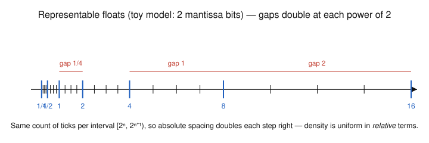

# Numerical Analysis · Lesson 1.1: Floating-Point & Round-Off

> ⏱ ~15 min · Module 1: Error, Conditioning & Root-Finding · Builds on: nothing (course start) · Unlocks: [Lesson 1.2 — Cancellation & Error Propagation](01-02-cancellation-error-propagation.md)

## Why this matters

Every number your machine hands back is a lie by a tiny, bounded amount — and this course is the study of how those lies accumulate, amplify, or stay harmless. Before we can bound the error of a root-finder, an integral, or a linear solve, we need the one axiom the whole subject rests on: **real numbers get replaced by the nearest member of a finite set, and that replacement costs a relative error of at most $\varepsilon_{\text{mach}}$.** Get this one bound in your bones and the rest of the course is bookkeeping. Physicists meet it as the reason two "equal" energies differ in bit 48; economists meet it when a discounted cash flow drifts by a penny after a million steps.

## The idea

A computer can't store $\pi$, or $1/3$, or even $0.1$. It stores numbers the way scientific notation does: a **sign**, a handful of **significant digits** (the *mantissa*, also called the *significand*), and an **exponent** that says where the decimal — here, binary — point goes. In base 10 you might allow "4 significant figures times a power of ten": then $6.023\times10^{23}$ is storable but $6.0231\times10^{23}$ is not, and neither is anything strictly between $6.023\times10^{23}$ and $6.024\times10^{23}$. The representable numbers are a **discrete grid with holes in it**.

The crucial twist: because the exponent scales the whole thing, the grid is *not evenly spaced*. Near zero the numbers are packed tightly; out at large magnitudes they thin out, and the gap **doubles every time you cross a power of two**. Fixed *significant digits* means fixed *relative* precision — roughly the same number of correct leading digits everywhere — which translates to absolute gaps that grow with the number's size. A ruler with 3 significant figures resolves $1.00$ to $1.01$ (gap $0.01$) but only $100$ to $101$ (gap $1$).

So "rounding a real number" means: snap it to the nearest grid point. The error you pay is at most *half a gap*, and since the gap scales with the number's magnitude, the **relative** error you pay is roughly constant — that constant is machine epsilon.

## The formal version

**The floating-point model.** A normalized floating-point number in base 2 has the form
$$x = \pm\,(1.b_1 b_2 \cdots b_{p-1})_2 \times 2^{e} = \pm\,\Big(1 + \textstyle\sum_{i=1}^{p-1} b_i 2^{-i}\Big)\, 2^{e},$$
where each bit $b_i \in \{0,1\}$, the integer $p$ is the **precision** (number of significand bits, counting the hidden leading 1), and $e$ is the **exponent**, itself confined to a finite range $e_{\min} \le e \le e_{\max}$.

*In words:* store a sign, $p$ bits of "which number between 1 and 2," and a power of two to slide it into place. The leading $1.$ is free — every normalized number starts with it, so it's never stored ("the hidden bit").

For **IEEE-754 double precision** (the `float64` behind almost all scientific computing): $p = 53$ significand bits (1 hidden + 52 stored), an 11-bit exponent giving $e \in [-1022, 1023]$, and 1 sign bit — 64 bits total.

**Finite precision ⇒ a discrete grid.** With $p$ significand bits, each *binade* — an interval $[2^e, 2^{e+1})$ — holds exactly $2^{p-1}$ equally spaced representable numbers, so the spacing there is
$$\text{spacing on } [2^e, 2^{e+1}) \;=\; 2^{e}\cdot 2^{-(p-1)} = 2^{\,e-(p-1)}.$$
This spacing is the **ulp** ("unit in the last place"). *In words:* every binade has the same *number* of floats, so the absolute gap between neighbors doubles each time $e$ climbs by one. Gaps scale with magnitude; relative resolution stays put.

**The rounding operator.** Let $\operatorname{fl}(x)$ denote $x$ rounded to the nearest representable float (ties to even). The foundational bound of the whole field:
$$\boxed{\;\operatorname{fl}(x) = x\,(1 + \delta), \qquad |\delta| \le u \;=\; \tfrac{1}{2}\varepsilon_{\text{mach}}\;}$$
for any $x$ in the normal range. *In words:* rounding perturbs a number by a *relative* amount no larger than the unit roundoff $u$ — the answer is always correct to within one relative "nudge."

**Machine epsilon vs. unit roundoff.** These two constants differ by a factor of 2, and mixing them up is the classic rookie error:

- **Machine epsilon** $\varepsilon_{\text{mach}} = 2^{-(p-1)} = 2^{-52} \approx 2.22\times 10^{-16}$ is the **gap between $1$ and the next larger float** (the ulp of the binade $[1,2)$).
- **Unit roundoff** $u = \tfrac12\varepsilon_{\text{mach}} = 2^{-53} \approx 1.11\times 10^{-16}$ is the **worst-case relative rounding error**, because rounding to nearest can miss by at most half a gap.

(Some texts write the looser bound $|\delta|\le\varepsilon_{\text{mach}}$; that's the same idea with a factor of 2 to spare. We'll use the sharp $u$.)

**The edges of the grid.** Beyond the exponent range, three things happen, each in one line: **overflow** — a result above $2^{1024}$ becomes $\pm\infty$ (`Inf`); **underflow** — a nonzero result too small for the smallest normal $2^{-1022}$ either rounds to $0$ or is stored with reduced precision as a **subnormal** (leading bit no longer 1, filling the gap around zero); and **`NaN`** ("not a number") is the poison value produced by $0/0$, $\infty-\infty$, $\sqrt{-1}$ — and it contaminates every arithmetic operation it touches ($\texttt{NaN} + 5 = \texttt{NaN}$).

## Picture

The ticks are the representable numbers of a toy model with only 2 mantissa bits (so 4 floats per binade — real doubles pack $2^{52}$ per binade, far too dense to draw). Blue marks are the powers of two. Read left to right: the same four ticks fill each interval $[2^e, 2^{e+1})$, so the *absolute* gap doubles at every blue mark — $\tfrac14 \to \tfrac12 \to 1 \to 2$ — while the *relative* gap stays fixed. That doubling is the entire geometry of floating point.

## Worked examples

**Example 1 (locate a number and its spacing — mechanical).** Store $x = 40.0$ as a double and find the gap to its neighbor.

Write $40$ in normalized binary. The largest power of two below $40$ is $2^5 = 32$, and $40/32 = 1.25 = (1.01)_2$ (since $1.01_2 = 1 + 0 \cdot\tfrac12 + 1\cdot\tfrac14 = 1.25$). So
$$40 = (1.01000\ldots0)_2 \times 2^{5}: \quad \text{sign } +,\ \ e = 5,\ \ \text{mantissa bits } 0100\ldots0.$$
It's *exactly* representable — the binary expansion terminates. Its binade is $[32, 64) = [2^5, 2^6)$, so the spacing is
$$\text{ulp}(40) = 2^{\,e - (p-1)} = 2^{\,5 - 52} = 2^{-47} \approx 7.1\times 10^{-15}.$$
The next double above $40$ is $40 + 2^{-47}$; nothing between them exists. Contrast with $\text{ulp}(1) = 2^{-52} = \varepsilon_{\text{mach}}$: numbers near $40$ are resolved $2^5 = 32$ times more coarsely than numbers near $1$, in absolute terms.

**Example 2 ($0.1$ is not representable — why you'd care).** In binary, $0.1 = 1.6 \times 2^{-4}$, and $1.6 = (1.1001100110011\ldots)_2$ — the block $1001$ repeats *forever*, exactly as $1/3 = 0.333\ldots$ does in base 10. A finite 52-bit mantissa must chop it off, so the machine stores the nearest grid point:
$$\operatorname{fl}(0.1) = 0.1000000000000000055511151231257\ldots,$$
overshooting by $\delta = 5.55\times10^{-17}$ relative to $0.1$ — and indeed $|\delta| = 5.55\times10^{-17} \le u = 2^{-53} \approx 1.11\times10^{-16}$, exactly as the bound promises. This is *the* reason `0.1 + 0.2 == 0.3` returns **false**: each of $0.1$, $0.2$, $0.3$ is separately rounded, and the rounded sum $0.30000000000000004$ isn't the rounded $0.3$. Nothing is broken — three snap-to-grid errors simply didn't cancel. Never test floating-point results with `==`; test $|a - b| \le \text{tol}$.

## Watch out

- **You might think** $\varepsilon_{\text{mach}}$ is "the smallest positive number the machine can store" — **actually** that's underflow territory ($\approx 10^{-308}$ for normals, smaller for subnormals). $\varepsilon_{\text{mach}} \approx 2.2\times10^{-16}$ is a statement about **relative spacing near 1**, not about smallness. Two different limits: the smallest *magnitude* vs. the finest *resolution*.
- **You might think** rounding error is absolute and fixed — **actually** it's *relative*. The gap at $10^{6}$ is about $10^{6}\varepsilon_{\text{mach}} \approx 0.1$, so you cannot resolve a million to better than a tenth. Errors grow with the numbers you compute on; that's why summing large and small quantities loses the small one (next lesson).
- **You might think** `Inf` and `NaN` are the same failure — **actually** `Inf` obeys sane algebra ($1/\text{Inf} = 0$, $\text{Inf} + 1 = \text{Inf}$) and can be recovered from, while `NaN` is unordered (even `NaN == NaN` is false) and spreads through every subsequent operation. A silent `NaN` at step 3 can leave every later number meaningless.

## One-liner

> Reals get snapped to a base-2 grid whose gaps double at each power of two, costing a relative error of at most $u = 2^{-53}$ — so $\operatorname{fl}(x) = x(1+\delta)$, $|\delta|\le u$, is the axiom everything downstream is built on.

## Problems

**P1 (🟢)** (a) Write $x = 0.375$ in normalized binary floating-point form $\pm(1.b_1b_2\cdots)_2 \times 2^e$, giving its sign, exponent $e$, and mantissa bits. (b) What is the spacing (ulp) between $0.375$ and its nearest double neighbor? Is $0.375$ stored exactly?

**P2 (🟡)** The doubles just below $8$ and just above $8$ are *not* spaced the same. Give the ulp on each side of $8$, state the factor between them, and explain in one sentence, using the binade picture, why the spacing jumps precisely at $8$.

**P3 (🔴, optional)** Using round-to-nearest-**ties-to-even**, determine whether $\operatorname{fl}(1 + 2^{-53})$ and $\operatorname{fl}(1 + 2^{-52})$ each equal $1$ or something larger. Conclude what the *smallest power-of-two perturbation* $\eta$ is for which $\operatorname{fl}(1 + \eta) > 1$, and reconcile your answer with the claim "$\varepsilon_{\text{mach}} = 2^{-52}$." (This is exactly how a program *measures* machine epsilon.)

Solutions

**P1** (a) The largest power of two not exceeding $0.375$ is $2^{-2} = 0.25$, and $0.375 / 0.25 = 1.5 = (1.1)_2$. So
$$0.375 = (1.1000\ldots0)_2 \times 2^{-2}: \quad \text{sign } +,\ \ e = -2,\ \ \text{mantissa } 1000\ldots0.$$
(b) Its binade is $[2^{-2}, 2^{-1}) = [0.25, 0.5)$, so the spacing is $\text{ulp}(0.375) = 2^{\,e-(p-1)} = 2^{-2-52} = 2^{-54} \approx 5.55\times10^{-17}$. Because $0.375 = 3/8$ has a terminating binary expansion, it is stored **exactly** — $\delta = 0$.

**P2** Just below $8$ you are in the binade $[4, 8) = [2^2, 2^3)$, where the spacing is $2^{\,2-52} = 2^{-50} \approx 8.88\times10^{-16}$. Just above $8$ you are in $[8, 16) = [2^3, 2^4)$, where the spacing is $2^{\,3-52} = 2^{-49} \approx 1.78\times10^{-15}$. The upper gap is exactly **twice** the lower one. The jump lands precisely at $8$ because $8 = 2^3$ is where the exponent $e$ increments from $2$ to $3$; each binade carries the same fixed count of floats, so crossing a power of two doubles the absolute spacing.

**P3** The float $1$ has exponent $e = 0$, and the next double above it is $1 + \varepsilon_{\text{mach}} = 1 + 2^{-52}$ (spacing on $[1,2)$ is $2^{-52}$). Now:
- $1 + 2^{-53}$ sits *exactly halfway* between the representable neighbors $1$ and $1 + 2^{-52}$. Ties round to the value with an even last bit — that's $1$ (its stored mantissa ends in $0$; $1 + 2^{-52}$ ends in $1$). So $\operatorname{fl}(1 + 2^{-53}) = 1$.
- $1 + 2^{-52}$ is itself a representable double, so $\operatorname{fl}(1 + 2^{-52}) = 1 + 2^{-52} > 1$ exactly.

Hence the smallest power-of-two perturbation surviving the addition is $\eta = 2^{-52} = \varepsilon_{\text{mach}}$: any $\eta \ge 2^{-52}$ pushes the result off $1$, while $\eta = 2^{-53}$ (and anything smaller) rounds back to $1$. This is consistent with "$\varepsilon_{\text{mach}} = 2^{-52}$" — machine epsilon is the *gap above 1*, the smallest bump that changes the stored value — even though the worst-case *relative rounding error* is the smaller $u = 2^{-53}$. (A program finds $\varepsilon_{\text{mach}}$ by halving $\eta$ until `1 + eta == 1`, then taking the last $\eta$ that failed.)

## Connections

- **Forward:** Lesson 1.2 takes the per-operation bound $\operatorname{fl}(x) = x(1+\delta)$ and follows it through a *chain* of operations — where subtracting two nearly equal rounded numbers (**catastrophic cancellation**) can blow a tiny $\delta$ into a huge relative error. This lesson supplies the $\delta$; the next shows when it detonates.
- **Forward:** Lesson 1.3 splits error into the *conditioning* of a problem versus the *stability* of an algorithm; the "backward error" viewpoint there is just $\operatorname{fl}(x)=x(1+\delta)$ read as "the computed answer is the exact answer to slightly perturbed data." Every stability bound in Modules 3 and 5 (LU, QR, least-squares) is stated in multiples of $u$.
- **Sideways (physics/econ):** any long simulation — an ODE integrator marching millions of Euler steps (Lesson [4.1](04-01-euler-local-global-error.md)), a Monte Carlo sum, a discounted cash-flow accumulation — silently injects one factor of $(1+\delta)$ per operation. The through-line of this whole course is knowing when those factors stay $O(u)$ and when they conspire to ruin the answer.
