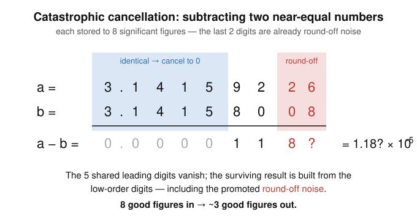

# Numerical Analysis · Lesson 1.2: Cancellation & Error Propagation

> ⏱ ~15 min · Module 1: Error, Conditioning & Root-Finding · Builds on: 1.1 ([Floating-point & round-off](01-01-floating-point-roundoff.md)) · Unlocks: 1.3 ([Conditioning vs. stability](01-03-conditioning-vs-stability.md))

## Why this matters

A formula can be textbook-correct and still hand you garbage. The single most common way this happens — in a Newton residual, a finite-difference derivative, a sample variance, a set of normal equations — is **catastrophic cancellation**: you subtract two numbers that are almost equal, the matching leading digits annihilate each other, and the round-off that was harmlessly parked in the low-order bits gets promoted to the front of the answer. The good news is that cancellation is *predictable* and usually *curable*: once you can spot it, a little algebra rewrites the expression into one that keeps its digits. This lesson is that eye and that toolkit.

## The idea

Imagine measuring the thickness of one sheet of paper with a tape measure by reading the height of a 500-sheet ream, then the height of a 499-sheet ream, and subtracting. Each reading is good to a millimeter. But the *difference* you actually want is tens of micrometers — a hundred times finer than the error in either reading. The subtraction is exact; the problem is that both measurements were only ever trustworthy in their big digits, and you just threw those big digits away.

That is catastrophic cancellation in one picture. Subtracting near-equal numbers doesn't *create* error — it **exposes** the error that was already sitting in the low bits, by deleting the high digits that were masking it. Multiply or divide, and relative errors merely add; those operations are safe. Add or subtract quantities of *opposite effective sign that nearly cancel*, and the relative error can blow up without bound. The cure is never "use more precision" (that only delays the cliff) — it's to **rewrite the expression** so the dangerous subtraction never happens.

## The formal version

Fix a true value $x$ and a computed approximation $\hat{x}$.

- **Absolute error:** $|\hat{x} - x|$.
- **Relative error:** $\dfrac{|\hat{x} - x|}{|x|}$ (for $x \neq 0$). This is the one that counts significant figures: a relative error near $10^{-k}$ means about $k$ trustworthy digits.

A compact model, inherited straight from Lesson 1.1's rounding rule $\operatorname{fl}(x) = x(1+\delta)$ with $|\delta| \le u$ (here $u = \tfrac12\varepsilon_{\text{mach}}$ is the unit round-off): write a stored value as
$$\hat{x} = x(1 + \delta_x), \qquad |\delta_x| = \text{relative error of } \hat{x}.$$

**How error propagates through $\times$ and $\div$ (benign).** With $\hat{x} = x(1+\delta_x)$ and $\hat{y} = y(1+\delta_y)$,
$$\hat{x}\hat{y} = xy\,(1+\delta_x)(1+\delta_y) \approx xy\,(1 + \delta_x + \delta_y), \qquad \frac{\hat{x}}{\hat{y}} \approx \frac{x}{y}\,(1 + \delta_x - \delta_y).$$
*In words:* under multiplication and division, **relative errors just add** (in size). Do a handful of them and you lose at most a handful of units in the last place. Nothing explodes.

**How error propagates through $+$ and $-$ (dangerous).** Here it's cleaner to track *absolute* errors $e_x = \hat{x}-x$, $e_y = \hat{y}-y$:
$$\widehat{x \pm y} = (x \pm y) + (e_x \pm e_y).$$
The absolute error stays small. But the *relative* error of the result is
$$\frac{|e_x \pm e_y|}{|x \pm y|},$$
and when $x \pm y$ nearly vanishes — i.e. you subtract near-equal numbers — the denominator collapses while the numerator does not. Bounding $|\delta_x|,|\delta_y| \le u$ gives the amplification law for a subtraction $z = x - y$ (with $x,y>0$):
$$\frac{|\hat{z}-z|}{|z|} \;\le\; \underbrace{\frac{|x| + |y|}{|x - y|}}_{\text{amplification factor}}\; u.$$

*In words:* subtracting two positive numbers multiplies your relative error by $\frac{x+y}{|x-y|}$. When $x \approx y$ this factor is enormous — that's cancellation, and in Lesson 1.3 this exact quantity is christened the **condition number of subtraction**.

**Rule of thumb.** If $x$ and $y$ agree in their first $k$ significant digits, then $x - y$ *loses about $k$ significant digits*. Eight-digit inputs that agree to five digits leave you roughly three trustworthy digits in the difference.

**Accumulation over many operations.** Summing $n$ numbers $s = x_1 + \dots + x_n$, each of the $n-1$ floating-point additions injects a relative error up to $u$, so the worst-case error grows *linearly*, on the order of $(n-1)u$ times the ratio $\frac{\sum |x_i|}{|\sum x_i|}$. For same-sign terms that ratio is 1 and the drift is mild; when the partial sums swing through near-zero (mixed signs), it is cancellation again. This linear-in-$n$ growth is why large sums are reordered smallest-first or accumulated with a compensated (Kahan) sum — techniques we'll flag but not develop here.

**The reformulation toolkit.** Every cure is the same move: replace a subtraction of near-equals with an algebraically equal expression that has no such subtraction.

| Dangerous form (near-equal subtraction) | Stable rewrite | Trick |
|---|---|---|
| $\sqrt{x+1}-\sqrt{x}$, large $x$ | $\dfrac{1}{\sqrt{x+1}+\sqrt{x}}$ | rationalize (multiply by conjugate) |
| $x_{\text{small}} = \dfrac{-b+\sqrt{b^2-4ac}}{2a}$, $b^2 \gg 4ac$ | compute $x_{\text{large}}$ with the safe sign, then $x_{\text{small}} = \dfrac{c}{a\,x_{\text{large}}}$ | use $x_1x_2 = c/a$ |
| $1-\cos x$, small $x$ | $2\sin^2(x/2)$ | half-angle identity |

## Picture

## Worked examples

**Example 1 (mechanical — the conjugate trick, with numbers).** Evaluate $\sqrt{12346} - \sqrt{12345}$ on a machine carrying **6 significant figures**.

Rounded to 6 figures, the two roots are
$$\sqrt{12346} = 111.113, \qquad \sqrt{12345} = 111.108.$$
*Naive subtraction:* $111.113 - 111.108 = 0.00500$. The leading five figures ($111.11$) cancelled, so of the six figures we started with, only the lone "$5$" carries meaning — and it's wrong. The true value is $0.00450003\ldots$, so this answer is off by about **11%**.

*Stable rewrite:* multiply by the conjugate,
$$\sqrt{12346}-\sqrt{12345} = \frac{(\sqrt{12346}-\sqrt{12345})(\sqrt{12346}+\sqrt{12345})}{\sqrt{12346}+\sqrt{12345}} = \frac{1}{\sqrt{12346}+\sqrt{12345}}.$$
Now the square roots are *added*, not subtracted — no cancellation:
$$\frac{1}{111.113 + 111.108} = \frac{1}{222.221} = 0.00450002.$$
All six figures survive, matching the true $0.00450003$. Same math, two orders of magnitude better accuracy — because the subtraction is gone.

**Example 2 (why you'd care — the quadratic formula).** Solve $x^2 - 200x + 1 = 0$ to **6 significant figures**. Here $a=1$, $b=-200$, $c=1$, and $b^2 = 40000 \gg 4ac = 4$, so the discriminant's square root nearly equals $|b|$:
$$\sqrt{b^2 - 4ac} = \sqrt{39996} = 199.990.$$

The two roots are $x = \dfrac{200 \pm 199.990}{2}$.

- **Large root (safe):** $x_+ = \dfrac{200 + 199.990}{2} = 199.995$. This uses the "$+$" sign, adding two like-signed numbers — no cancellation, all six figures good.
- **Small root, naive:** $x_- = \dfrac{200 - 199.990}{2} = \dfrac{0.010}{2} = 0.00500$. The subtraction $200 - 199.990$ annihilated four leading digits, leaving $0.010$ with just **two** significant figures.

How untrustworthy is that? Suppose the discriminant round-off had gone the other way, giving $199.989$ (one unit in the last place lower). Then the naive small root becomes $\frac{200-199.989}{2} = 0.00550$ — a **10% swing** from a last-digit wobble, exactly the amplification the formula warned about.

*Stable rewrite* via $x_+ x_- = c/a = 1$:
$$x_- = \frac{c}{a\,x_+} = \frac{1}{199.995} = 0.00500013,$$
a division, so it inherits full 6-figure accuracy — and the same one-ulp wobble ($x_+ = 199.9945$) barely moves it: $1/199.9945 = 0.00500014$. Compute the root with the non-cancelling sign, then get its partner from the product of roots.

## Watch out

- You might think an algebraically identical rewrite can't change the answer — but $\sqrt{x+1}-\sqrt{x}$ and $\frac{1}{\sqrt{x+1}+\sqrt{x}}$ are equal in *exact* arithmetic yet differ by orders of magnitude in float. Algebra is invariant under round-off; floating-point evaluation is not. That gap is the whole game.
- You might think the subtraction is what *introduces* the error — actually, subtracting two nearby floats is one of the most *accurate* operations there is (often exact — Sterbenz's lemma). It creates no new error; it merely **deletes the high digits** that were hiding the round-off already present in the inputs. The error was inherited, not generated.
- You might think large relative error needs large numbers — it's the reverse. Cancellation strikes precisely when the *result* is tiny compared to its inputs. Products and quotients are always safe; only additive operations whose operands nearly cancel can amplify relative error.

## One-liner

> Don't subtract two nearly-equal numbers if algebra can dodge it — the digits they share are exactly the digits you'll lose.

## Problems

**P1 (🟢)** On a machine carrying **6 significant figures**, evaluate $1 - \cos x$ at $x = 0.001$ radians, first directly and then via the identity $1-\cos x = 2\sin^2(x/2)$. Report both results and say how many significant figures each keeps.

**P2 (🟡)** You subtract $x = 3.14159$ and $y = 3.14128$, each known to 6 significant figures (so each has relative error at most $u = 5 \times 10^{-6}$). Using the rule of thumb *and* the amplification factor $\frac{x+y}{|x-y|}$, estimate how many significant figures you can trust in $x - y$.

**P3 (🔴, optional)** The one-pass "computational" formula for the variance of data $x_1,\dots,x_n$ is $\ \operatorname{Var} = \frac{1}{n}\sum_i x_i^2 - \bar{x}^2$, where $\bar{x}=\frac1n\sum_i x_i$. Take $x = \{10000,\,10001,\,10002\}$. Compute the variance both by this one-pass formula and by the two-pass formula $\frac{1}{n}\sum_i (x_i-\bar{x})^2$, and explain — using error propagation — why on a machine carrying **7 significant figures** the one-pass formula can return $0$ (or even a *negative* variance) while the two-pass formula is exact. Which quantity is being subtracted, and how many digits do the two operands share?

Solutions

**P1** *Direct.* $\cos(0.001) = 1 - \tfrac{(0.001)^2}{2} + \cdots = 0.99999950\ldots$, which rounds to $1.00000$ at 6 figures. Then $1 - 1.00000 = 0.00000$ — **total** cancellation; the answer $0$ has *zero* correct significant figures. The tiny true value ($\sim 5\times10^{-7}$) lived entirely in digits past the 6th, and the subtraction discarded them all.

*Via the identity.* $2\sin^2(0.0005)$: with $\sin(0.0005) = 0.000500000$ (6 figures), this is $2\,(0.000500000)^2 = 5.00000\times10^{-7}$. The true value is $1-\cos(0.001) = 4.9999996\times10^{-7} \approx 5.00000\times10^{-7}$, so the rewrite keeps a **full 6 significant figures**. No subtraction of near-equals ever occurs: the squaring produces the small result directly.

**P2** The two numbers agree in their first four significant figures ($3.141$) and differ at the fifth ($5$ vs. $2$). *Rule of thumb:* agreeing to $k=4$ digits loses about 4 of the 6 figures, leaving roughly **2** trustworthy figures. *Amplification factor:* $x - y = 0.00031$, and
$$\frac{x+y}{|x-y|} = \frac{6.28287}{0.00031} \approx 2.0\times10^{4}.$$
Multiplying the input relative error, $(2.0\times10^4)(5\times10^{-6}) \approx 0.10$ — a relative error near $10^{-1}$, i.e. about **1** trustworthy figure. The two estimates bracket the truth: expect **1–2 good significant figures** in $x-y = 0.00031$, down from the 6 you started with.

**P3** *Set-up.* $\bar{x} = \frac{10000+10001+10002}{3} = 10001$. Exact answer (two-pass): 
$$\frac13\big[(10000-10001)^2 + 0^2 + (10002-10001)^2\big] = \frac13(1+0+1) = \frac{2}{3} = 0.6667.$$
The two-pass formula subtracts each $x_i$ from the mean *first*, giving small numbers $\{-1,0,1\}$ of the same magnitude as the spread — no cancellation, and here it's exact.

*One-pass.* $\sum x_i^2 = 10000^2 + 10001^2 + 10002^2 = 100000000 + 100020001 + 100040004 = 300060005$, so $\frac1n\sum x_i^2 = 100020001.667$, while $\bar{x}^2 = 100020001$. The formula asks for
$$100020001.667 - 100020001 = 0.667,$$
a subtraction of two numbers near $10^8$ that **agree in their first nine digits**. On a 7-significant-figure machine both operands round to $1.000200\times10^{8} = 100020000$, and their difference is computed as $0$ — a **100% error**, and a slightly different rounding of $\frac1n\sum x_i^2$ can round *below* $\bar x^2$ and yield a *negative* variance, which is mathematically impossible. The rule of thumb predicted it: agreeing to 9 digits, but carrying only 7, leaves nothing behind. The one-pass formula is a classic cancellation trap; always prefer the two-pass form (or a numerically stable one-pass update). This is exactly the ill-conditioning that returns, in matrix form, when Lesson 5.1 forms the normal equations and pays $\kappa(A^\top A) = \kappa(A)^2$.

## Connections

- **Backward:** this is Lesson 1.1's rounding model $\operatorname{fl}(x) = x(1+\delta)$ doing its worst. Cancellation is what that inherited $\delta$ becomes when a subtraction deletes the leading digits that were keeping it in the noise.
- **Forward:** Lesson 1.3 promotes the amplification factor $\frac{|x|+|y|}{|x-y|}$ into the *condition number* and separates it — a property of the **problem** — from *stability*, a property of the **algorithm**; the quadratic and variance rewrites here are your first backward-stable reformulations. Cancellation recurs in Newton residuals (1.5), in the finite-difference quotient $\frac{f(x+h)-f(x)}{h}$ where subtracting near-equal function values fights round-off (Lesson 2.3), and in the normal equations, where it appears as the squared condition number $\kappa(A^\top A) = \kappa(A)^2$ (Lesson 5.1, the bridge to the ridge/least-squares setup in [convex-optimization](../../convex-optimization/syllabus.md)).
- **Sideways (statistics):** P3's one-pass-vs-two-pass variance is the working statistician's daily encounter with this lesson — the reason production code computes variances in two passes (or with Welford's online update) rather than the "sum of squares minus square of sum" you learned in intro stats.
