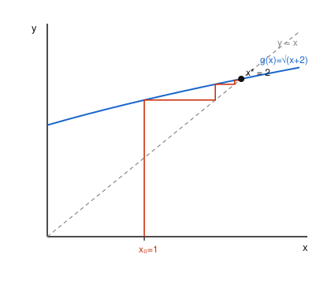

# Numerical Analysis · Lesson 1.4: Bisection & Fixed-Point Iteration

> ⏱ ~15 min · Module 1: Error, Conditioning & Root-Finding · Builds on: [Lesson 1.3](01-03-conditioning-vs-stability.md) · Unlocks: [Lesson 1.5](01-05-newton-secant.md)

## Why this matters

Almost nothing you actually want to solve — the equilibrium price where supply meets demand, the angle at which a projectile lands on target, the energy level where a wavefunction fits its box — comes with a closed-form root. So you build one by iteration. This lesson gives you the two temperamental opposites of the trade: **bisection**, which is slow but *cannot fail* once you trap a root, and **fixed-point iteration**, which is fast when it works and diverges spectacularly when it doesn't. Learning to tell those apart — and to predict *before you run it* whether an iteration converges — is the whole game. The same fixed-point condition you meet here returns almost verbatim in [Lesson 3.4](03-04-iterative-methods.md) as the convergence test for Jacobi and Gauss–Seidel on large linear systems.

## The idea

**Bisection** is the number-line version of a guessing game. If a continuous $f$ is negative at $a$ and positive at $b$, it must cross zero somewhere between — so a root is *trapped* in $[a,b]$. Check the midpoint: whichever half still shows a sign change is your new, smaller trap. Halve, halve, halve. You give up nothing to bad luck: the interval shrinks by exactly $2$ every step, guaranteed, forever. The price is that "exactly $2$" — one bit of accuracy per step is *slow*.

**Fixed-point iteration** is a different idea entirely. Rewrite "$f(x)=0$" as "$x = g(x)$" — a form where the unknown equals some formula in itself — and then just *feed the output back in as the next input*: $x_{n+1} = g(x_n)$. A root of $f$ is a **fixed point** of $g$, a value the map leaves unmoved. Whether the feedback settles onto that fixed point or flies away from it hinges on one number: the slope of $g$ there. If $g$ is *flatter than the diagonal* near the fixed point ($|g'| < 1$), each pass squeezes you closer — the map is a **contraction**. If $g$ is steeper ($|g'| > 1$), each pass throws you farther. Same equation, two rearrangements, opposite fates — and you can call it in advance by looking at a derivative.

## The formal version

**Bisection (bracketing via the IVT).** Let $f$ be continuous on $[a,b]$ with $f(a)\,f(b) < 0$. The Intermediate Value Theorem guarantees a root $x^* \in (a,b)$. Set $c = \tfrac{a+b}{2}$; whichever of $[a,c]$, $[c,b]$ has opposite signs at its ends contains a root. Repeating, after $n$ midpoints the surviving bracket has width $(b-a)/2^n$, so the midpoint estimate obeys
$$|c_n - x^*| \le \frac{b-a}{2^{\,n+1}}.$$

*In words:* the error is cut in half every single step, no matter how nasty $f$ is — this is **linear convergence** with rate exactly $\tfrac12$.

To force the bracket width below a tolerance $\text{tol}$, solve $(b-a)/2^n \le \text{tol}$ for $n$:
$$n = \left\lceil \log_2\!\frac{b-a}{\text{tol}} \right\rceil.$$

*In words:* the iteration count is known *before you start* — no adaptivity, no surprises. Each decimal digit costs about $\log_2 10 \approx 3.3$ steps.

**Fixed-point iteration.** Given $g$, a **fixed point** is a value $x^*$ with $g(x^*) = x^*$. The iteration is
$$x_{n+1} = g(x_n), \qquad n = 0, 1, 2, \dots$$

Subtract $x^* = g(x^*)$ from $x_{n+1} = g(x_n)$ and apply the Mean Value Theorem: $x_{n+1} - x^* = g(x_n) - g(x^*) = g'(\xi_n)\,(x_n - x^*)$ for some $\xi_n$ between $x_n$ and $x^*$. Writing the error $e_n = x_n - x^*$,
$$e_{n+1} = g'(\xi_n)\,e_n \quad\Longrightarrow\quad \frac{e_{n+1}}{e_n} \to g'(x^*).$$

*In words:* near the fixed point the error is multiplied by $g'(x^*)$ each step. So $|g'(x^*)| < 1$ shrinks the error (converges), $|g'(x^*)| > 1$ grows it (diverges), and the convergence is **linear with rate $|g'(x^*)|$** — the flatter $g$ is, the faster.

**Contraction Mapping Theorem (Banach, the clean sufficient condition).** Suppose $g$ maps $[a,b]$ into itself ($g(x) \in [a,b]$ whenever $x \in [a,b]$) and is a **contraction** there: $|g(x) - g(y)| \le L\,|x-y|$ for all $x,y \in [a,b]$ with a constant $L < 1$. Then:
1. $g$ has **exactly one** fixed point $x^*$ in $[a,b]$;
2. the iteration converges to it from **every** starting point $x_0 \in [a,b]$, with $|x_n - x^*| \le L^n\,|x_0 - x^*|$.

*In words:* if $g$ never leaves the interval and always pulls points closer, there is one and only one fixed point and you will find it, guaranteed, from anywhere in the box. When $g$ is differentiable, $L = \max_{[a,b]} |g'|$ works (by the MVT), so "$|g'| < 1$ on the whole interval" is the practical test.

## Picture

The **cobweb diagram** below is fixed-point iteration made visible. Plot the curve $y = g(x)$ and the diagonal $y = x$; their crossing is the fixed point $x^*$. From $x_0$ on the axis, go *up* to the curve (that height is $g(x_0) = x_1$), then *across* to the diagonal (which copies that height back onto the $x$-axis as the next input), then up to the curve again. Here $g(x) = \sqrt{x+2}$, whose fixed point is $x^* = 2$; because $g$ is flatter than the diagonal there ($g'(2) = \tfrac14$), the web spirals *inward* as a staircase and closes on $x^*$. If $g$ were steeper than the diagonal, the same construction would march *outward*.

## Worked examples

**Example 1 (bisection, mechanical + the count).** Find $\sqrt{3}$ as the root of $f(x) = x^2 - 3$ on $[1,2]$. Check the bracket: $f(1) = -2 < 0$, $f(2) = 1 > 0$ — sign change, so a root is trapped. Halve:

| $n$ | bracket | midpoint $c$ | $f(c)$ | keep |
|---|---|---|---|---|
| 1 | $[1,\,2]$ | $1.5$ | $-0.75$ | $[1.5,\,2]$ |
| 2 | $[1.5,\,2]$ | $1.75$ | $+0.0625$ | $[1.5,\,1.75]$ |
| 3 | $[1.5,\,1.75]$ | $1.625$ | $-0.359$ | $[1.625,\,1.75]$ |

After 3 steps the root ($x^* = 1.73205\ldots$) sits in $[1.625,\,1.75]$, width $0.125$. How many steps to guarantee an error below $\text{tol} = 10^{-4}$? Here $b - a = 1$, so
$$n = \left\lceil \log_2 \frac{1}{10^{-4}} \right\rceil = \lceil \log_2 10^4 \rceil = \lceil 13.29 \rceil = 14.$$
Fourteen steps, decided in advance — that is bisection's whole appeal: dead reliable, and its cost is a formula, not a gamble.

**Example 2 (fixed-point, convergence you can predict).** Solve $x^2 - x - 2 = 0$ (roots $x = 2$ and $x = -1$) by fixed-point iteration, targeting $x^* = 2$. Two natural rearrangements:

- **Rearrangement A:** $x^2 = x + 2 \Rightarrow x = \sqrt{x+2}$, so $g_A(x) = \sqrt{x+2}$. Then $g_A'(x) = \dfrac{1}{2\sqrt{x+2}}$, and $g_A'(2) = \dfrac{1}{2\cdot 2} = \dfrac14$. Since $|g_A'(2)| = 0.25 < 1$, it **converges**, linearly, killing about three-quarters of the error each step. Starting at $x_0 = 1$:

  | $n$ | $x_n$ | error $|x_n - 2|$ | ratio $e_{n}/e_{n-1}$ |
  |---|---|---|---|
  | 0 | $1.00000$ | $1.000$ | — |
  | 1 | $1.73205$ | $0.268$ | $0.268$ |
  | 2 | $1.93185$ | $0.0681$ | $0.254$ |
  | 3 | $1.98288$ | $0.0171$ | $0.251$ |
  | 4 | $1.99572$ | $0.00428$ | $0.250$ |

  The error ratio locks onto $0.25 = g_A'(2)$, exactly as the MVT argument promised.

- **Rearrangement B:** $x = x^2 - 2$, so $g_B(x) = x^2 - 2$. Then $g_B'(x) = 2x$ and $g_B'(2) = 4$. Since $|g_B'(2)| = 4 > 1$, it **diverges**: from $x_0 = 2.1$ you get $x_1 = 2.41$, $x_2 = 3.808$, $x_3 = 12.5$, gone. Same root, same equation — the *algebra you chose* decided success or failure. That is the lesson.

## Watch out

- **Bisection needs a sign *change*, not just a root.** $f(x) = (x-1)^2$ has a root at $x=1$ but never goes negative, so no bracket exists and bisection can't start. Roots of even multiplicity, and complex roots, are invisible to it — it finds *sign crossings*, which is a stricter thing than *zeros*.
- **$|g'(x^*)| = 1$ is the knife-edge, and it usually loses.** You might think "$< 1$ converges, so $= 1$ barely converges" — but at exactly $1$ the linear analysis is silent and the iteration typically stalls or oscillates. Example: $g(x) = 2/x$ for $\sqrt2$ has $g'(\sqrt2) = -1$, and the iterates just flip $x \leftrightarrow 2/x$ forever without settling.
- **"A fixed point exists" is not "the iteration finds it."** Existence (a crossing of $g$ and the diagonal) is about $g$; *convergence* is about $|g'|$ there. Rearrangement B above had the fixed point $x=2$ sitting right there — the iteration just refused to go to it. Always check the slope, not just the crossing.
- **The bracket count bounds the *width*, not the midpoint error.** The midpoint is at worst *half* the width from the root, so $n = \lceil \log_2\frac{b-a}{\text{tol}}\rceil$ is a safe (slightly conservative) count — you actually beat `tol` by a factor of two.

## One-liner

> Bisection halves a trapped bracket and can never fail; fixed-point iteration multiplies your error by $g'(x^*)$ each step — so it wins when $|g'(x^*)| < 1$ and detonates when it doesn't.

## Problems

**P1 (🟢)** Take $f(x) = x^3 - x - 1$ on $[1,2]$. (a) Confirm the bracket is valid, then carry out **three** bisection steps and report the surviving interval and your best root estimate. (b) How many bisection steps guarantee the bracket width is below $\text{tol} = 10^{-3}$?

**P2 (🟡)** The value $\sqrt{3}$ is a fixed point of *both* $g_1(x) = 3/x$ and $g_2(x) = \dfrac{x+3}{x+1}$ (check: each solves $x^2 = 3$). Using the derivative test, decide which iteration converges to $\sqrt3 = 1.7320\ldots$ and which does not, and for the convergent one state the asymptotic error-reduction factor per step.

**P3 (🔴, optional)** For $g(x) = \sqrt{x+2}$ (Example 2's convergent map), prove *from the Contraction Mapping Theorem* that the iteration converges to a **unique** fixed point starting from any $x_0 \in [1,2]$. That is: show $g$ maps $[1,2]$ into itself, and exhibit a Lipschitz constant $L < 1$ valid on all of $[1,2]$.

Solutions

**P1** (a) $f(1) = 1 - 1 - 1 = -1 < 0$ and $f(2) = 8 - 2 - 1 = 5 > 0$ — sign change, valid bracket (true root $x^* \approx 1.3247$).

| $n$ | bracket | $c$ | $f(c)$ | keep |
|---|---|---|---|---|
| 1 | $[1,\,2]$ | $1.5$ | $3.375 - 1.5 - 1 = +0.875$ | $[1,\,1.5]$ |
| 2 | $[1,\,1.5]$ | $1.25$ | $1.953 - 1.25 - 1 = -0.297$ | $[1.25,\,1.5]$ |
| 3 | $[1.25,\,1.5]$ | $1.375$ | $2.600 - 1.375 - 1 = +0.225$ | $[1.25,\,1.375]$ |

Surviving interval $[1.25,\,1.375]$ (width $0.125$); best estimate = midpoint $1.3125$.

(b) $b - a = 1$, so $n = \lceil \log_2(1/10^{-3}) \rceil = \lceil \log_2 1000 \rceil = \lceil 9.97 \rceil = 10$ steps.

**P2** Both maps fix $\sqrt3$. Test the slopes at $x^* = \sqrt3$ (so $x^{*2} = 3$):
- $g_1(x) = 3/x \Rightarrow g_1'(x) = -3/x^2$, so $g_1'(\sqrt3) = -3/3 = -1$. Then $|g_1'| = 1$ — the knife-edge; it does **not** converge (the iterates oscillate: $x \mapsto 3/x \mapsto x$, period 2).
- $g_2(x) = \dfrac{x+3}{x+1} \Rightarrow g_2'(x) = \dfrac{(x+1) - (x+3)}{(x+1)^2} = \dfrac{-2}{(x+1)^2}$, so $g_2'(\sqrt3) = \dfrac{-2}{(1+\sqrt3)^2} = \dfrac{-2}{4 + 2\sqrt3} = \dfrac{-2}{7.464} \approx -0.268$. Since $|g_2'| \approx 0.268 < 1$, $g_2$ **converges** linearly, cutting the error by a factor $\approx 0.27$ each step (roughly one extra correct digit every $\sim 4$ steps, since $0.268^4 \approx 0.005$).

So $g_2$ is the usable iteration; $g_1$ stalls.

**P3** *Maps into itself.* $g(x) = \sqrt{x+2}$ is increasing on $[1,2]$, so its range there runs from $g(1)$ to $g(2)$: $g(1) = \sqrt3 \approx 1.732$ and $g(2) = \sqrt4 = 2$. Thus $g([1,2]) = [\sqrt3,\,2] \subset [1,2]$. ✓

*Contraction.* $g'(x) = \dfrac{1}{2\sqrt{x+2}}$, which is positive and *decreasing* on $[1,2]$, so its maximum is at $x = 1$:
$$L = \max_{[1,2]} |g'(x)| = g'(1) = \frac{1}{2\sqrt3} \approx 0.289 < 1.$$
By the Mean Value Theorem, $|g(x) - g(y)| = |g'(\xi)|\,|x-y| \le L\,|x-y|$ for all $x,y \in [1,2]$, so $g$ is a contraction with $L \approx 0.289$.

Both hypotheses hold, so the Contraction Mapping Theorem gives a **unique** fixed point in $[1,2]$ (namely $x^* = 2$) and convergence from every $x_0 \in [1,2]$, with the guaranteed bound $|x_n - 2| \le (0.289)^n\,|x_0 - 2|$. $\blacksquare$

## Flashback

**From Lesson 1.3 (Conditioning vs. Stability):** An approximate root of $f(x) = x^2 - 2$ is reported as $\hat{x} = 1.414$ (the true root is $x^* = \sqrt2 = 1.4142136\ldots$). (a) Compute the **forward error** $|\hat{x} - x^*|$. (b) Compute the **residual** $|f(\hat{x})|$ — the natural *backward* error for a root, measuring how far $\hat{x}$ is from satisfying the equation. (c) Their ratio should recover the conditioning of this root, $\approx 1/|f'(x^*)|$. Verify.

Solution

(a) Forward error: $|\hat{x} - x^*| = |1.414 - 1.4142136| = 2.14 \times 10^{-4}$.

(b) Residual (backward error): $f(\hat{x}) = 1.414^2 - 2 = 1.999396 - 2 = -6.04 \times 10^{-4}$, so $|f(\hat{x})| = 6.04 \times 10^{-4}$.

(c) Ratio $\dfrac{\text{residual}}{\text{forward error}} = \dfrac{6.04\times10^{-4}}{2.14\times10^{-4}} \approx 2.83$. And $f'(x) = 2x$, so $|f'(x^*)| = 2\sqrt2 = 2.828$. They match — because near the root $f(\hat{x}) \approx f'(x^*)(\hat{x} - x^*)$, i.e. forward error $\approx$ residual $/\,|f'(x^*)|$. The factor $1/|f'(x^*)|$ is exactly the **condition number of the root**: a small residual (backward error) can still hide a large forward error when $f$ is nearly flat at its root ($|f'| \approx 0$) — the ill-conditioned case Lesson 1.3 warned about, and the one Newton's method (next lesson) must respect.

## Connections

- **Backward:** the Flashback closes the loop with [Lesson 1.3](01-03-conditioning-vs-stability.md) — the residual of an approximate root is its backward error, and $1/|f'(x^*)|$ is the root's condition number, telling you how far a small residual can sit from the true answer.
- **Forward:** [Lesson 1.5](01-05-newton-secant.md) turns fixed-point iteration into a *smart* map, $g(x) = x - f(x)/f'(x)$, engineered so that $g'(x^*) = 0$ — killing the linear term and buying **quadratic** convergence, at the cost of bisection's ironclad safety.
- **Sideways (numerical linear algebra):** [Lesson 3.4](03-04-iterative-methods.md) reruns this exact story on vectors. Jacobi and Gauss–Seidel are fixed-point iterations $\mathbf{x}_{n+1} = M\mathbf{x}_n + \mathbf{c}$; the scalar test $|g'(x^*)| < 1$ becomes the matrix test $\rho(M) < 1$ on the **spectral radius**, and "flatter converges faster" becomes "smaller spectral radius converges faster."
