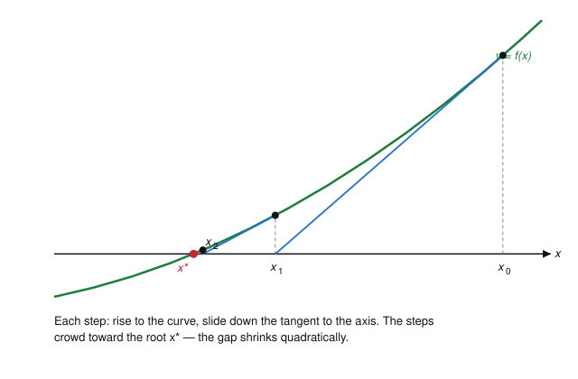
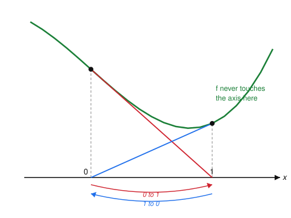

# Numerical Analysis · Lesson 1.5: Newton & Secant Methods

> ⏱ ~15 min · Module 1: Error, Conditioning & Root-Finding · Builds on: [Lesson 1.4](01-04-bisection-fixed-point.md) (bracketing and fixed-point convergence) · Unlocks: Module 2, [Lesson 2.1](02-01-polynomial-interpolation.md) (interpolation)

## Why this matters

Bisection (Lesson 1.4) is bulletproof but slow — it buys one bit of accuracy per step, so ten more correct digits costs ~33 evaluations. Almost every root you actually solve in physics or optimization — an equilibrium condition, a stationarity equation $\nabla f = 0$, an implicit ODE step (you'll meet these in [Lesson 4.4](04-04-absolute-stability-stiffness.md)) — is solved by **Newton's method**, because near the answer it *doubles* the number of correct digits every single step. The catch is that this speed is local and fragile: Newton can overshoot, oscillate, or fly off to the wrong root entirely. This lesson gives you the two fast methods and, just as important, the failure map.

## The idea

You want a root of $f$ but $f$ is complicated. So replace it, near your current guess, with the one function you can solve exactly: its **tangent line**. Where the tangent crosses zero is your next guess. Then re-linearize there and repeat. Because a smooth curve hugs its tangent closely, once you're near the root the leftover error is *tiny* — and squaring a tiny number makes it minuscule, which is exactly why the digits double.

That's **Newton's method**. Its only real cost is that you need the derivative $f'$. When you can't (or won't) compute $f'$, the **secant method** fakes it: use the slope of the line through your last two points as a stand-in for the tangent. You give up a little speed but need no derivative — often a great trade.

## The formal version

**Newton's method.** Given a current iterate $x_n$, linearize $f$ at $x_n$ (first-order Taylor):
$$f(x) \approx f(x_n) + f'(x_n)(x - x_n).$$
Set the right side to zero and solve for $x$ to get the next iterate:
$$\boxed{\,x_{n+1} = x_n - \frac{f(x_n)}{f'(x_n)}\,}$$

*In words:* step from $x_n$ to where its tangent line hits the axis.

**Convergence order.** Let $x^*$ be a **simple** root ($f(x^*)=0$, $f'(x^*)\neq 0$) and $e_n = x_n - x^*$ the error. Taylor-expand $f$ and $f'$ about $x^*$. Since $f(x^*)=0$,
$$f(x_n) = f'(x^*)e_n + \tfrac12 f''(x^*)e_n^2 + \cdots, \qquad f'(x_n) = f'(x^*) + f''(x^*)e_n + \cdots.$$
Substitute into $e_{n+1} = e_n - f(x_n)/f'(x_n)$ and keep leading terms (divide numerator and denominator, expand):
$$e_{n+1} \;=\; \frac{f''(x^*)}{2f'(x^*)}\,e_n^2 \;+\; O(e_n^3) \;\equiv\; C\,e_n^2 .$$

*In words:* the new error is a constant times the **square** of the old error — **quadratic convergence**. Practically, if you have $d$ correct digits, the next step gives about $2d$. This is the whole reason to use Newton.

**The traps** (all visible geometrically):
- **Near-zero derivative.** $f'(x_n)\approx 0$ makes the tangent nearly flat, so it crosses the axis far away — the step $f(x_n)/f'(x_n)$ blows up. The quadratic constant $C = f''/2f'$ also blows up.
- **Overshoot / divergence.** A tangent taken on the wrong side of an inflection or on a steep-then-flat region can throw you *past* the root and keep going, diverging.
- **Oscillation / cycles.** The iterates can settle into a repeating loop that never reaches the root (worked example below).
- **Sensitivity to the start (basins of attraction).** With several roots, which one you land on — if any — depends delicately on $x_0$; the set of starts converging to a given root can have a fractal boundary.
- **Multiple roots kill the speed.** If $x^*$ has multiplicity $m>1$ (so $f'(x^*)=0$ too), Newton converges only **linearly**, with error shrinking by the fixed factor $\frac{m-1}{m}$ each step — no digit-doubling (Problem 3).

**The secant method.** Replace $f'(x_n)$ by the finite-difference slope through the last two iterates:
$$f'(x_n) \approx \frac{f(x_n) - f(x_{n-1})}{x_n - x_{n-1}} \quad\Longrightarrow\quad \boxed{\,x_{n+1} = x_n - f(x_n)\,\frac{x_n - x_{n-1}}{f(x_n) - f(x_{n-1})}\,}$$

*In words:* Newton with the tangent replaced by the secant line through your two most recent points — no derivative required.

Its error obeys $e_{n+1} \approx C\, e_n\, e_{n-1}$, and solving for the growth exponent (assume $|e_{n+1}| \sim |e_n|^p$; matching powers gives $p = 1 + 1/p$) yields the golden ratio:
$$p = \varphi = \frac{1+\sqrt5}{2} \approx 1.618 .$$

*In words:* **superlinear** convergence — slower than Newton's order 2 but far faster than bisection's order 1. The **accuracy-vs-cost trade**: Newton needs *two* function evaluations per step ($f$ and $f'$) and reaches order 2; secant needs only *one new* evaluation of $f$ per step (it reuses the previous one) and reaches order 1.618. Measured *per evaluation*, secant's efficiency $\varphi \approx 1.618$ actually beats Newton's $\sqrt{2}\approx 1.414$ — so when $f'$ is expensive or unavailable, secant often wins.

## Picture

Stand at $x_0$, rise vertically to the curve, then ride the tangent down to where it hits the axis — that landing point is $x_1$. Repeat from $x_1$. The horizontal jumps shrink dramatically because the curve barely departs from each tangent once you're close.

## Worked examples

**Example 1 (mechanical — watch the digits double).** Find $\sqrt2$, the positive root of $f(x)=x^2-2$. Here $f'(x)=2x$, so
$$x_{n+1} = x_n - \frac{x_n^2 - 2}{2x_n} = \frac12\!\left(x_n + \frac{2}{x_n}\right)$$
(the "Babylonian" square-root iteration). Start at $x_0 = 1$ and track the error $e_n = x_n - \sqrt2$:

| $n$ | $x_n$ | $e_n = x_n-\sqrt2$ | correct digits $\approx -\log_{10}\lvert e_n\rvert$ | $e_n / e_{n-1}^2$ |
|---|---|---|---|---|
| 0 | $1.000000000000$ | $-4.14\times10^{-1}$ | 0.4 | — |
| 1 | $1.500000000000$ | $\phantom{-}8.58\times10^{-2}$ | 1.1 | $0.500$ |
| 2 | $1.416666666667$ | $\phantom{-}2.45\times10^{-3}$ | 2.6 | $0.333$ |
| 3 | $1.414215686275$ | $\phantom{-}2.12\times10^{-6}$ | 5.7 | $0.353$ |
| 4 | $1.414213562375$ | $\phantom{-}1.59\times10^{-12}$ | 11.8 | $0.3535$ |

Read the fourth column top to bottom: $\approx 1 \to 2.6 \to 5.7 \to 11.8$ correct digits — each step roughly **doubles** the previous count. The last column converges to the predicted constant $C = \dfrac{f''(x^*)}{2f'(x^*)} = \dfrac{2}{2\cdot 2\sqrt2} = \dfrac{1}{2\sqrt2} \approx 0.35355$. Four steps from a lazy guess of $1$ land you at $\sqrt2$ to twelve digits. That is what quadratic convergence buys.

**Example 2 (why you'd care — a start that cycles forever).** Take $f(x) = x^3 - 2x + 2$, so $f'(x) = 3x^2 - 2$, and start at $x_0 = 0$:
$$x_1 = 0 - \frac{f(0)}{f'(0)} = 0 - \frac{2}{-2} = 1, \qquad x_2 = 1 - \frac{f(1)}{f'(1)} = 1 - \frac{1}{1} = 0 .$$
We're back at $0$. The iteration is trapped in the **2-cycle** $0 \to 1 \to 0 \to 1 \to \cdots$ and never approaches the real root (which sits near $x=-1.77$). Geometrically (figure below): the tangent at $x=0$ lands exactly on $x=1$, and the tangent at $x=1$ lands exactly back on $x=0$ — a perfect ping-pong. Note the curve never even crosses the axis in this window, so nothing local hints that Newton is chasing a root far to the left. A tiny nudge to $x_0$ escapes the cycle but may still wander before converging: this is the "sensitive to the start" trap in miniature.

The fix in practice: guard Newton with a bracket (fall back to a bisection step, Lesson 1.4, whenever a Newton step leaves the bracket or fails to decrease $\lvert f\rvert$). That hybrid — a *safeguarded* Newton — keeps the speed while restoring bisection's guarantee.

## Watch out

- You might think a smaller $\lvert f(x_n)\rvert$ means you're closer to the root — but if $f'$ is tiny there, you can be far away with a small function value (a flat curve). Judge progress by the *step size* $\lvert x_{n+1}-x_n\rvert$ and check $f'$ isn't collapsing.
- You might think Newton always beats bisection — but Newton's quadratic rate is **local**. Far from the root, or from a bad $x_0$, it can diverge or cycle while bisection would have crept in safely. Speed and safety are different properties; a safeguarded method gives you both.
- You might think a repeated root is just a harder version of a simple root — but it's a *different regime*: at a root of multiplicity $m$, both $f$ and $f'$ vanish, Newton drops to **linear** convergence (rate $\frac{m-1}{m}$), and $f$ is also ill-conditioned there (the flat curve, recall conditioning from [Lesson 1.3](01-03-conditioning-vs-stability.md)), so round-off limits the achievable accuracy too.

## One-liner

> Newton rides the tangent to double your digits each step near a simple root; secant fakes the tangent with a chord for order 1.618 and no derivative — but both need a good start, or they overshoot, cycle, or find the wrong root.

## Problems

**P1 (🟢)** Use Newton's method on $f(x) = x^2 - 3$ (so $x_{n+1} = \tfrac12(x_n + 3/x_n)$) from $x_0 = 2$. Compute $x_1, x_2, x_3$, tabulate the error $e_n = x_n - \sqrt3$ (use $\sqrt3 = 1.7320508$), and confirm the digit count roughly doubles. What does the ratio $e_{n+1}/e_n^2$ approach, and does it match $f''(x^*)/2f'(x^*)$?

**P2 (🟡)** Solve the same equation $f(x)=x^2-2$ with the **secant method**, starting from $x_0 = 1,\ x_1 = 2$. Compute $x_2, x_3, x_4$ from the secant formula and report each error $x_n - \sqrt2$. Compare the number of steps to reach ~4 correct digits against Newton's Example 1, and say why the comparison is a little unfair to secant on a *per-evaluation* basis.

**P3 (🔴, optional)** Newton on a **double root**. Apply Newton to $f(x) = x^2$ (double root at $x^*=0$). Show the iteration reduces to $x_{n+1} = \tfrac12 x_n$, hence the error only *halves* each step — linear, not quadratic. Then, more generally, for $f(x) = (x-x^*)^m$ show $x_{n+1} - x^* = \frac{m-1}{m}(x_n - x^*)$, confirming linear convergence with rate $\frac{m-1}{m}$. (Bonus: what modified iteration restores quadratic convergence when $m$ is known?)

Solutions

**P1** With $x_{n+1} = \tfrac12(x_n + 3/x_n)$ from $x_0=2$:

| $n$ | $x_n$ | $e_n = x_n - \sqrt3$ | $e_n/e_{n-1}^2$ |
|---|---|---|---|
| 0 | $2.000000000$ | $2.68\times10^{-1}$ | — |
| 1 | $1.750000000$ | $1.79\times10^{-2}$ | $0.250$ |
| 2 | $1.732142857$ | $9.21\times10^{-5}$ | $0.286$ |
| 3 | $1.732050810$ | $2.45\times10^{-9}$ | $0.289$ |

Correct digits $\approx 0.6 \to 1.7 \to 4.0 \to 8.6$ — doubling each step. The ratio $e_{n+1}/e_n^2$ tends to $0.2887$, matching $\dfrac{f''(x^*)}{2f'(x^*)} = \dfrac{2}{2\cdot 2\sqrt3} = \dfrac{1}{2\sqrt3} = 0.28868$. ✓

**P2** Secant: $x_{n+1} = x_n - f(x_n)\dfrac{x_n - x_{n-1}}{f(x_n)-f(x_{n-1})}$, with $f(x)=x^2-2$, $f(1)=-1$, $f(2)=2$.

- $x_2 = 2 - 2\cdot\dfrac{2-1}{2-(-1)} = 2 - \tfrac{2}{3} = 1.333333$, error $-8.09\times10^{-2}$.
- $f(x_2) = -0.222222$; $x_3 = 1.333333 - (-0.222222)\dfrac{1.333333-2}{-0.222222-2} = 1.400000$, error $-1.42\times10^{-2}$.
- $f(x_3) = -0.04$; $x_4 = 1.400000 - (-0.04)\dfrac{1.4-1.333333}{-0.04-(-0.222222)} = 1.414634$, error $+4.21\times10^{-4}$.

(One more step gives $x_5 = 1.4142114$, error $-2.1\times10^{-6}$.) Secant reaches ~4 correct digits at $x_4$ (step 3), versus Newton's $x_3$ (Example 1, step 3) — Newton is a bit ahead per *step*. But the comparison is unfair to secant on a per-*evaluation* basis: each Newton step here costs two evaluations ($f$ and $f'$), while each secant step costs only one new $f$ (it reuses $f(x_{n-1})$). Counting the expensive operations, secant's order-$1.618$ efficiency edges out Newton's effective $\sqrt2$.

**P3** For $f(x)=x^2$: $f'(x)=2x$, so
$$x_{n+1} = x_n - \frac{x_n^2}{2x_n} = x_n - \frac{x_n}{2} = \frac{x_n}{2}.$$
With $x^*=0$ the error is $e_n = x_n$, and $e_{n+1} = \tfrac12 e_n$ — it halves each step. That's **linear** convergence (rate $\tfrac12$), not quadratic: from $x_0=1$ you get $1, \tfrac12, \tfrac14, \tfrac18,\dots$, gaining barely one bit per step, no better than bisection.

General multiplicity $m$: let $f(x)=(x-x^*)^m$, so $f'(x)=m(x-x^*)^{m-1}$. Then
$$x_{n+1} - x^* = (x_n - x^*) - \frac{(x_n-x^*)^m}{m(x_n-x^*)^{m-1}} = (x_n-x^*) - \frac{x_n-x^*}{m} = \frac{m-1}{m}\,(x_n - x^*).$$
So $e_{n+1} = \frac{m-1}{m}e_n$: linear with rate $\frac{m-1}{m}$ ($\tfrac12$ for $m=2$, $\tfrac23$ for $m=3$, worsening as $m$ grows). **Bonus:** the *modified Newton* iteration $x_{n+1} = x_n - m\,\dfrac{f(x_n)}{f'(x_n)}$ cancels the $\frac1m$ factor and restores quadratic convergence when the multiplicity $m$ is known.

## Flashback

**From [Lesson 1.4](01-04-bisection-fixed-point.md) (bisection iteration count):** You need a root of a continuous $f$ known to lie in the bracket $[1, 2]$, and you want the answer guaranteed to within $10^{-6}$. How many bisection steps does that take? Then, in one sentence, contrast that count with Newton's Example 1.

Solution

Bisection halves the bracket each step, so after $k$ steps the uncertainty is $(b-a)/2^k = 1/2^k$. Require $1/2^k \le 10^{-6}$, i.e. $2^k \ge 10^6$, i.e. $k \ge \log_2(10^6) = 19.93$. So $k = \lceil 19.93 \rceil = \mathbf{20}$ steps.

Contrast: Newton reached twelve correct digits in **four** steps in Example 1 — because bisection adds a fixed *one bit* ($\log_{10}2 \approx 0.30$ decimal digit) per step (linear, rate $\tfrac12$), while Newton *doubles the digit count* per step (quadratic). Bisection's virtue isn't speed; it's the ironclad guarantee that comes from maintaining a sign-change bracket.

## Connections

- **Backward:** Newton and secant are the fast successors to [Lesson 1.4](01-04-bisection-fixed-point.md)'s bisection; Newton's iteration $x_{n+1}=x_n-f(x_n)/f'(x_n)$ is itself a fixed-point iteration $x_{n+1}=g(x_n)$ with $g'(x^*)=0$, which is *why* it beats the general linear fixed-point rate of Lesson 1.4 — the first-order error term vanishes, leaving the quadratic one. The multiple-root ill-conditioning is the flat-curve conditioning story of [Lesson 1.3](01-03-conditioning-vs-stability.md).
- **Forward:** the same linearize-and-step idea drives implicit ODE solvers ([Lesson 4.4](04-04-absolute-stability-stiffness.md)), where each backward-Euler step solves a nonlinear equation by Newton. Root-finding also underlies your ability to compute the nodes of Gaussian quadrature ([Lesson 2.5](02-05-gaussian-adaptive-quadrature.md)).
- **Sideways (optimization):** minimizing a smooth $\phi$ means solving $\phi'(x)=0$, so Newton for optimization applies this exact iteration to $f=\phi'$: $x_{n+1}=x_n-\phi'(x_n)/\phi''(x_n)$ — the 1-D form of the Newton step at the heart of [convex-optimization](../../convex-optimization/syllabus.md), where the second derivative becomes the Hessian and "no derivative" secant methods generalize to quasi-Newton (BFGS) updates.
