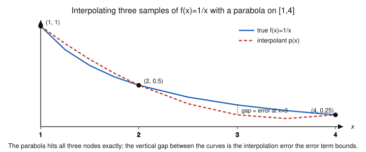

# Numerical Analysis · Lesson 2.1: Polynomial Interpolation

> ⏱ ~15 min · Module 2: Interpolation & Quadrature · Builds on: [Lesson 1.5](01-05-newton-secant.md) (Newton's method), Taylor's theorem from [calc-refresher](../../calc-refresher/syllabus.md) · Unlocks: [Lesson 2.2](02-02-runge-splines.md) (Runge phenomenon & splines)

## Why this matters

You have a fistful of data — sampled function values, sensor readings, a table of $\log$ from before calculators — and you need a value *between* the samples, or an integral, or a derivative. The move is always the same: fit a smooth curve through the points and work with that curve instead. Polynomials are the natural first choice because they are cheap to evaluate, differentiate, and integrate, and there is *exactly one* of low enough degree through your points. This lesson builds that unique polynomial two ways and — the part that makes it numerical analysis rather than algebra — tells you how wrong it can be. Interpolation is the hidden engine under every quadrature rule (Module 2), every finite-difference stencil (Lesson 2.3), and the shape functions of finite elements.

## The idea

Two points determine a line; three points determine a parabola; $n+1$ points determine a polynomial of degree at most $n$. That "at most $n$" polynomial is unique — there is no wiggle room once the points are fixed. So "find the interpolating polynomial" is a *well-posed* question with one answer, and the only real questions are **how to write it down** and **how far it strays** from whatever generated the data.

There are three ways to write the same polynomial, and they trade off differently:

- **Vandermonde** (solve for the coefficients directly) — conceptually obvious, numerically a trap; we use it only to *prove* uniqueness, never to compute.
- **Lagrange** — a slick closed form that makes the answer transparent and is perfect for theory.
- **Newton's divided differences** — a table you fill in once and can *extend* by one row when a new data point arrives, without redoing the old work.

Same curve, three costumes. The error is the same for all three because the polynomial is the same.

## The formal version

**The interpolation problem.** Given $n+1$ distinct nodes $x_0, x_1, \dots, x_n$ and values $y_0, \dots, y_n$, find a polynomial $p$ of degree $\le n$ with $p(x_i) = y_i$ for every $i$.

**Existence & uniqueness (via Vandermonde).** Write $p(x) = c_0 + c_1 x + \dots + c_n x^n$. The $n+1$ interpolation conditions are the linear system
$$
\begin{pmatrix} 1 & x_0 & \cdots & x_0^n \\ 1 & x_1 & \cdots & x_1^n \\ \vdots & & & \vdots \\ 1 & x_n & \cdots & x_n^n \end{pmatrix}
\begin{pmatrix} c_0 \\ c_1 \\ \vdots \\ c_n \end{pmatrix}
=
\begin{pmatrix} y_0 \\ y_1 \\ \vdots \\ y_n \end{pmatrix} .
$$
The matrix $V$ is a **Vandermonde matrix**, and its determinant is $\det V = \prod_{i<j}(x_j - x_i)$. Because the nodes are *distinct*, every factor is nonzero, so $\det V \neq 0$: the system has exactly one solution $c$.

*In words:* distinct nodes guarantee one and only one interpolating polynomial of degree $\le n$.

> **Do not actually solve this system.** $V$ is notoriously **ill-conditioned** — $\kappa(V)$ grows exponentially in $n$ (recall conditioning from [Lesson 1.3](01-03-conditioning-vs-stability.md)), so the computed coefficients are swamped by round-off. Vandermonde earns its keep as an *existence proof*, then we compute the same polynomial a stabler way.

**Lagrange form.** Define the **cardinal basis polynomials**
$$
L_i(x) = \prod_{\substack{j=0 \\ j\neq i}}^{n} \frac{x - x_j}{x_i - x_j}, \qquad i = 0, \dots, n.
$$
Each $L_i$ has degree $n$ and is engineered so that $L_i(x_k) = \delta_{ik}$ — it equals $1$ at its own node and $0$ at every other node. Then
$$
p(x) = \sum_{i=0}^{n} y_i\, L_i(x).
$$

*In words:* build a "switch" that is on at node $i$ and off elsewhere, scale it by $y_i$, and add the switches up — the sum automatically passes through every point.

**Newton's divided-difference form.** Define divided differences recursively:
$$
f[x_i] = y_i, \qquad
f[x_i,\dots,x_{i+k}] = \frac{f[x_{i+1},\dots,x_{i+k}] - f[x_i,\dots,x_{i+k-1}]}{x_{i+k} - x_i}.
$$
Then the interpolant is
$$
p(x) = f[x_0] + f[x_0,x_1](x - x_0) + f[x_0,x_1,x_2](x-x_0)(x-x_1) + \cdots + f[x_0,\dots,x_n]\prod_{j=0}^{n-1}(x - x_j).
$$

*In words:* each new node adds one more term — the leading divided difference times the product of $(x - x_j)$ over the *previous* nodes — so extending the fit is cheap and the earlier coefficients never change.

**Interpolation error.** Let $f \in C^{n+1}[a,b]$ and let $p$ interpolate $f$ at $x_0,\dots,x_n \in [a,b]$. For any $x \in [a,b]$ there is a $\xi$ (depending on $x$) in the smallest interval containing $x$ and all the nodes such that
$$
f(x) - p(x) = \frac{f^{(n+1)}(\xi)}{(n+1)!}\, \prod_{i=0}^{n}(x - x_i).
$$

*In words:* the error is controlled by two things — the **smoothness** of $f$ (its $(n{+}1)$th derivative) and the **node polynomial** $w(x) = \prod_i (x - x_i)$, which is zero at every node and grows between them. Notice the family resemblance to the Taylor remainder $\frac{f^{(n+1)}(\xi)}{(n+1)!}(x - x_0)^{n+1}$: Taylor piles all its information at one point; interpolation spreads it across $n+1$ points, replacing $(x-x_0)^{n+1}$ with $\prod_i(x - x_i)$.

## Picture

The interpolant is pinned to the data at the nodes (where $w(x)=0$, so the error vanishes) and drifts away in between. The error term is precisely a bound on that drifting gap.

## Worked examples

Both examples use the same data — three samples of $f(x) = 1/x$:
$$
(x_0,y_0) = (1,\,1), \quad (x_1,y_1) = (2,\,\tfrac12), \quad (x_2,y_2) = (4,\,\tfrac14).
$$
Here $n = 2$, so we expect a unique quadratic.

**Example 1 (Lagrange form — mechanical).** Build the three cardinal polynomials:
$$
L_0(x) = \frac{(x-2)(x-4)}{(1-2)(1-4)} = \frac{(x-2)(x-4)}{3}, \quad
L_1(x) = \frac{(x-1)(x-4)}{(2-1)(2-4)} = -\frac{(x-1)(x-4)}{2},
$$
$$
L_2(x) = \frac{(x-1)(x-2)}{(4-1)(4-2)} = \frac{(x-1)(x-2)}{6}.
$$
Then $p(x) = 1\cdot L_0(x) + \tfrac12 L_1(x) + \tfrac14 L_2(x)$. Evaluate at $x = 3$ (halfway-ish, where we want an interpolated value):
$$
L_0(3) = \frac{(1)(-1)}{3} = -\tfrac13, \quad L_1(3) = -\frac{(2)(-1)}{2} = 1, \quad L_2(3) = \frac{(2)(1)}{6} = \tfrac13,
$$
$$
p(3) = 1\cdot(-\tfrac13) + \tfrac12\cdot 1 + \tfrac14\cdot\tfrac13 = -\tfrac13 + \tfrac12 + \tfrac{1}{12} = \tfrac14 = 0.25 .
$$

**Example 2 (Newton divided differences + error).** Fill the table left to right (each entry is the difference of its two left-neighbors divided by the spanned $x$-gap):

| $x_i$ | $f[\cdot]$ | 1st divided diff | 2nd divided diff |
|:---:|:---:|:---:|:---:|
| $1$ | $1$ | | |
| | | $\dfrac{\tfrac12 - 1}{2-1} = -\tfrac12$ | |
| $2$ | $\tfrac12$ | | $\dfrac{-\tfrac18 - (-\tfrac12)}{4-1} = \tfrac18$ |
| | | $\dfrac{\tfrac14 - \tfrac12}{4-2} = -\tfrac18$ | |
| $4$ | $\tfrac14$ | | |

Reading the **top diagonal** ($1,\ -\tfrac12,\ \tfrac18$) gives the Newton coefficients:
$$
p(x) = 1 - \tfrac12(x-1) + \tfrac18(x-1)(x-2).
$$
Check the value we care about: $p(3) = 1 - \tfrac12(2) + \tfrac18(2)(1) = 1 - 1 + \tfrac14 = 0.25$ — identical to Lagrange, as uniqueness demands. (Expanded, both give $p(x) = \tfrac18 x^2 - \tfrac78 x + \tfrac74$.)

**Now the error at $x = 3$.** With $f(x) = 1/x$ we have $f'''(x) = -6x^{-4}$, and $n+1 = 3$ so $(n+1)! = 6$. The node polynomial at $x=3$ is $w(3) = (3-1)(3-2)(3-4) = (2)(1)(-1) = -2$. The error theorem says, for some $\xi \in (1,4)$,
$$
f(3) - p(3) = \frac{f'''(\xi)}{6}\,w(3) = \frac{-6\xi^{-4}}{6}\,(-2) = \frac{2}{\xi^4}.
$$
The true error is $f(3) - p(3) = \tfrac13 - \tfrac14 = \tfrac{1}{12} \approx 0.0833$. Solving $2/\xi^4 = \tfrac{1}{12}$ gives $\xi^4 = 24$, i.e. $\xi \approx 2.21 \in (1,4)$ — the theorem checks out. For a *guaranteed* bound without knowing $\xi$, take the worst case of $|f'''|$ on $[1,4]$: $\max_{\xi\in[1,4]} 6\xi^{-4} = 6$ (at $\xi=1$), giving
$$
|f(3) - p(3)| \le \frac{6}{6}\,|w(3)| = 1\cdot 2 = 2 .
$$
Correct but *loose* — the bound is dominated by how large $f'''$ gets at the left end, far from $x=3$. Honest error bars are conservative; that gap is the price of not knowing $\xi$.

## Watch out

- **"Degree $n$" vs. "degree at most $n$."** Three points give a polynomial of degree $\le 2$, not necessarily $=2$. If your three points happen to be collinear, the unique interpolant is a *line* — its $x^2$ coefficient is zero. Uniqueness is about degree $\le n$; don't force the top term.
- **The error term needs the derivative to exist.** The formula assumes $f \in C^{n+1}$. If $f$ has a kink or a blowup in the interval (or you have only data, no $f$), the $f^{(n+1)}(\xi)$ factor is meaningless and you cannot invoke this bound — you're flying blind on error, which is exactly when splines (Lesson 2.2) earn their keep.
- **Small $w(x)$ is not small error everywhere.** The node polynomial is zero *at* the nodes, but between widely spaced or high-degree nodes it can swing violently — that runaway product is the seed of the Runge phenomenon you'll meet next lesson. A tiny $(n+1)!$ in the denominator does not save you if $f^{(n+1)}$ grows faster.
- **Don't reach for Vandermonde.** It is the "obvious" method and the wrong one — its ill-conditioning corrupts the coefficients. Use Lagrange for theory, Newton for computation.

## One-liner

> $n+1$ points fix one polynomial of degree $\le n$; its error is the $(n{+}1)$th derivative divided by $(n{+}1)!$, times the node polynomial $\prod_i(x-x_i)$ — Taylor's remainder, spread across many points.

## Problems

**P1 (🟢)** Using **Newton's divided differences**, build the quadratic interpolant through $(1,1),\ (2,3),\ (4,4)$ and evaluate it at $x = 3$. (Show the divided-difference table.)

**P2 (🟡)** You interpolate $f(x) = \sin x$ with a quadratic at the nodes $0,\ \tfrac{\pi}{6},\ \tfrac{\pi}{3}$. Give a guaranteed bound on $|f(x) - p(x)|$ at the point $x = \tfrac{\pi}{12}$. (Use that $|f'''| \le 1$ everywhere.)

**P3 (🔴, optional)** Continue P1: a fourth data point $(0, 2)$ arrives. Using the Newton form, obtain the cubic interpolant $p_3$ by **appending a single term** to $p_2$ — the existing coefficients don't change. Find $p_3$ and verify $p_3(0) = 2$. (This one-term extension is Newton's headline advantage over Lagrange.)

Solutions

**P1.** Table (nodes $1,2,4$; values $1,3,4$):

| $x_i$ | $f[\cdot]$ | 1st | 2nd |
|:---:|:---:|:---:|:---:|
| $1$ | $1$ | | |
| | | $\frac{3-1}{2-1}=2$ | |
| $2$ | $3$ | | $\frac{0.5-2}{4-1}=-\tfrac12$ |
| | | $\frac{4-3}{4-2}=\tfrac12$ | |
| $4$ | $4$ | | |

Top diagonal $\Rightarrow p_2(x) = 1 + 2(x-1) - \tfrac12(x-1)(x-2)$. At $x=3$:
$$
p_2(3) = 1 + 2(2) - \tfrac12(2)(1) = 1 + 4 - 1 = 4 .
$$

**P2.** With $n=2$, the error is $f(x)-p(x) = \frac{f'''(\xi)}{6}\,(x-0)(x-\tfrac{\pi}{6})(x-\tfrac{\pi}{3})$. Since $|f'''(\xi)| = |-\cos\xi| \le 1$,
$$
|f(x)-p(x)| \le \frac{1}{6}\,\Big|\,x\big(x-\tfrac{\pi}{6}\big)\big(x-\tfrac{\pi}{3}\big)\,\Big|.
$$
At $x = \tfrac{\pi}{12}$: the factors are $\tfrac{\pi}{12}\approx 0.2618$, $\ \tfrac{\pi}{12}-\tfrac{\pi}{6} = -\tfrac{\pi}{12}\approx -0.2618$, $\ \tfrac{\pi}{12}-\tfrac{\pi}{3} = -\tfrac{\pi}{4}\approx -0.7854$. So the node polynomial has magnitude $0.2618 \cdot 0.2618 \cdot 0.7854 \approx 0.0538$, and
$$
\Big|f\big(\tfrac{\pi}{12}\big)-p\big(\tfrac{\pi}{12}\big)\Big| \le \frac{0.0538}{6} \approx 0.00897 .
$$
So the quadratic is good to about three decimals there — and the bound is honest, since $\sin$ has bounded derivatives (no Runge trouble on this small interval).

**P3.** Append the new node $x_3 = 0,\ y_3 = 2$ and extend the table by one diagonal (keep the P1 order $1,2,4$, then $0$):
$$
f[x_2,x_3] = \frac{2-4}{0-4} = \tfrac12, \qquad
f[x_1,x_2,x_3] = \frac{\tfrac12 - \tfrac12}{0-2} = 0, \qquad
f[x_0,x_1,x_2,x_3] = \frac{0 - (-\tfrac12)}{0-1} = -\tfrac12 .
$$
Only the *new* leading difference $-\tfrac12$ is needed; $p_2$'s coefficients ($1, 2, -\tfrac12$) carry over unchanged. Append one term (product over the previous three nodes $1,2,4$):
$$
p_3(x) = \underbrace{1 + 2(x-1) - \tfrac12(x-1)(x-2)}_{p_2(x)} \;-\; \tfrac12\,(x-1)(x-2)(x-4).
$$
Check: $p_2(0) = 1 + 2(-1) - \tfrac12(-1)(-2) = 1 - 2 - 1 = -2$, and the new term at $0$ is $-\tfrac12(-1)(-2)(-4) = -\tfrac12(-8) = 4$, so $p_3(0) = -2 + 4 = 2$. ✓ With Lagrange you'd have rebuilt all four basis polynomials from scratch.

## Flashback

**From [Lesson 1.5](01-05-newton-secant.md) (Newton's method, quadratic convergence):** Apply Newton's method to $f(x) = x^2 - 2$ (so the root is $r = \sqrt 2$) starting from $x_0 = 1.5$. Compute $x_1$ and $x_2$, list the errors $e_k = x_k - r$, and check that each error is roughly the *square* of the previous — comparing the ratio $e_{k+1}/e_k^2$ against the theoretical constant $\frac{f''(r)}{2f'(r)}$.

Solution

Newton step: $x_{k+1} = x_k - \frac{x_k^2 - 2}{2x_k}$. With $r = \sqrt2 \approx 1.4142136$:
- $x_0 = 1.5$: $x_1 = 1.5 - \frac{0.25}{3} = 1.4166667$.
- $x_1 = 1.4166667$: $x_2 = 1.4166667 - \frac{0.0069444}{2.8333333} = 1.4142157$.

Errors: $e_0 = 0.0857864$, $e_1 = 0.0024531$, $e_2 \approx 0.0000021$. Each is about the square of the last (two correct digits become four become eight — the signature of **quadratic convergence**). The ratios:
$$
\frac{e_1}{e_0^2} = \frac{0.0024531}{0.0073593} \approx 0.333, \qquad
\frac{e_2}{e_1^2} = \frac{0.0000021}{0.0000060} \approx 0.35 .
$$
Theory: the asymptotic constant is $\dfrac{f''(r)}{2f'(r)} = \dfrac{2}{2\cdot 2\sqrt2} = \dfrac{1}{2\sqrt2} \approx 0.3536$. The ratio locks onto it as the iterates near the root. (Contrast the *linear* convergence of bisection from [Lesson 1.4](01-04-bisection-fixed-point.md), which only halves the error each step.)

## Connections

- **Backward:** the error term is Taylor's remainder ([calc-refresher](../../calc-refresher/syllabus.md)) generalized from one expansion point to $n+1$ interpolation nodes; and its "$\xi$ exists" existence claim leans on the same conditioning worries about Vandermonde raised in [Lesson 1.3](01-03-conditioning-vs-stability.md).
- **Forward:** [Lesson 2.2](02-02-runge-splines.md) shows the node polynomial $w(x)$ can explode for high-degree equispaced nodes (the Runge phenomenon) and fixes it with Chebyshev nodes and piecewise splines; [Lessons 2.3–2.4](02-04-newton-cotes-quadrature.md) differentiate and integrate the interpolant to get finite-difference and Newton–Cotes formulas — the interpolation error term becomes *their* error term.
- **Sideways (statistics / ML):** fitting a curve through data is regression's noise-free limit — when data is noisy you deliberately *under*-fit with least squares ([Lesson 5.1](05-01-least-squares-normal-equations.md), bridging to [convex-optimization](../../convex-optimization/syllabus.md)) instead of forcing exact interpolation, precisely because an exact high-degree fit amplifies noise the way $w(x)$ amplifies error here.
