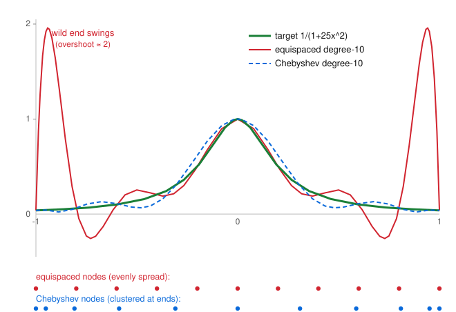

# Numerical Analysis · Lesson 2.2: Runge Phenomenon & Splines

> ⏱ ~15 min · Module 2: Interpolation & Quadrature · Builds on: [Lesson 2.1](02-01-polynomial-interpolation.md) (the interpolation error term) · Unlocks: [Lesson 2.3](02-03-numerical-differentiation.md) (finite-difference formulas come *from* differentiating an interpolant)

## Why this matters

Lesson 2.1 sold you a comforting fact: through any $n+1$ points there is a unique degree-$n$ polynomial, and its error carries a clean bound. Here's the ambush — throw *more* points at a perfectly smooth function on evenly spaced nodes and the interpolant can get **worse**, exploding into wild oscillations near the ends and diverging as $n\to\infty$. This is the Runge phenomenon, and it's the reason nobody fits a high-degree polynomial through many equispaced samples. The two fixes — clustering nodes toward the endpoints (Chebyshev) and abandoning high degree for stitched-together low-degree pieces (splines) — are the workhorses behind every smooth curve your plotting library, CAD program, or font renderer draws.

## The idea

Recall the error term from Lesson 2.1: for the degree-$n$ interpolant $p_n$ of a function $f$ at nodes $x_0,\dots,x_n$,
$$f(x)-p_n(x)=\frac{f^{(n+1)}(\xi)}{(n+1)!}\,\underbrace{\prod_{k=0}^{n}(x-x_k)}_{w(x),\ \text{the node polynomial}}.$$
Two factors fight. The $(n+1)!$ in the denominator and the derivative $f^{(n+1)}$ up top are out of your control. But $w(x)=\prod(x-x_k)$ — the product of distances from $x$ to every node — is **entirely determined by where you put the nodes**, and *that* is the lever.

Here's the catch with evenly spaced nodes. Near the *center* of the interval, $x$ is close to many nodes, so $w(x)$ stays small. Near an *endpoint*, $x$ is far from almost every node — all those distances multiply into a huge number. So $w$ is tiny in the middle and monstrous at the edges. For a function like Runge's $f(x)=\dfrac{1}{1+25x^2}$ on $[-1,1]$, whose high derivatives $f^{(n+1)}$ also grow explosively, the edge blow-up of $w$ wins the fight and the interpolant diverges near $\pm1$ (see the Picture).

Two ways out:

1. **Move the nodes.** Since the edges are the problem, put *more* nodes there. Clustering nodes toward the endpoints tames $\max|w|$. The optimal clustering is the **Chebyshev nodes**, and the interpolant tracks the target beautifully.
2. **Drop the degree.** Instead of one degree-$n$ polynomial, stitch together many low-degree pieces — cubics — one per subinterval, matched up so smoothly the seams are invisible. These are **cubic splines**. Low degree means $w$ has few factors and never blows up; oscillation is impossible.

## The formal version

**The Runge phenomenon.** For $f(x)=\dfrac{1}{1+25x^2}$ on $[-1,1]$ interpolated at the $n+1$ equispaced nodes $x_k=-1+\frac{2k}{n}$,
$$\max_{-1\le x\le 1}\bigl|f(x)-p_n(x)\bigr|\ \longrightarrow\ \infty\quad\text{as }n\to\infty,$$
with the divergence concentrated near $x=\pm 1$.

*In words:* adding equispaced points to a smooth-looking function can make the polynomial fit blow up at the edges — more data, worse answer.

**Chebyshev nodes.** On $[-1,1]$, take
$$x_k=\cos\!\Big(\frac{k\pi}{n}\Big),\qquad k=0,1,\dots,n.$$
These are the projections onto the $x\text{-axis}$ of $n+1$ equally spaced points on the upper unit semicircle — so they bunch up near $\pm1$ and spread out near $0$. They very nearly **minimize** $\max_{[-1,1]}|w(x)|$: the closely related first-kind Chebyshev points (the roots of the Chebyshev polynomial $T_{n+1}$) achieve the exact minimum, with node polynomial $w(x)=2^{-n}T_{n+1}(x)$ and $\max|w|=2^{-n}$ — exponentially small, versus the edge explosion of equispaced nodes.

*In words:* cluster the nodes at the ends the way $\cos$ clusters angles, and the one factor you control shrinks to nearly the smallest it can be — the Runge blow-up dies.

**Cubic spline.** Given knots $x_0<x_1<\dots<x_n$ (so $n$ subintervals) with data $y_i=f(x_i)$, a **cubic spline** $s$ is a function that is a separate cubic $s_i$ on each $[x_i,x_{i+1}]$, glued so that $s$, $s'$, and $s''$ are all continuous — it is $C^2$. That smoothness is what makes the seams invisible to the eye.

*In words:* a chain of cubic arcs, each hand-off matched in value, slope, and curvature, so the whole curve looks like one smooth stroke.

**Counting the conditions.** Each of the $n$ cubics has $4$ coefficients, so there are $4n$ unknowns. The constraints:

| Condition | Count |
|---|---|
| Each piece hits its two endpoints (interpolation) | $2n$ |
| Slopes match at the $n-1$ interior knots ($C^1$) | $n-1$ |
| Curvatures match at the $n-1$ interior knots ($C^2$) | $n-1$ |
| **Subtotal** | $4n-2$ |

That leaves the system **2 equations short**. You close it with two **end conditions**:

- **Natural spline:** $s''(x_0)=s''(x_n)=0$ (zero curvature at the ends — the curve straightens out).
- **Clamped spline:** $s'(x_0)$ and $s'(x_n)$ prescribed (you supply the end slopes).

Either choice adds exactly $2$ equations, giving $4n$ equations for $4n$ unknowns — a square, solvable, in fact **tridiagonal** system (each interior equation couples only neighboring pieces), so it costs $O(n)$ to solve.

## Picture

The target $f(x)=1/(1+25x^2)$ (green), its degree-10 equispaced interpolant (red — matching the target exactly at all 11 nodes, yet swinging to nearly $2$ between the last two nodes near each edge), and the degree-10 Chebyshev interpolant (blue dashed — visually glued to the target). The two node rows below show *why*: equispaced nodes are evenly spread; Chebyshev nodes crowd the endpoints, exactly where the trouble was.

## Worked examples

**Example 1 (the node polynomial, equispaced vs. Chebyshev).** Take $5$ nodes ($n=4$) on $[-1,1]$ and evaluate $|w(x)|=\prod_k|x-x_k|$ at the near-edge point $x=0.9$.

*Equispaced* $\{-1,-0.5,0,0.5,1\}$:
$$|w(0.9)|=|1.9|\,|1.4|\,|0.9|\,|0.4|\,|{-0.1}|=0.0958.$$
*Chebyshev–Lobatto* $x_k=\cos(k\pi/4)=\{1,\ 0.707,\ 0,\ -0.707,\ -1\}$:
$$|w(0.9)|=|{-0.1}|\,|0.193|\,|0.9|\,|1.607|\,|1.9|=0.0530.$$
Already at just $5$ nodes the clustered set halves the node polynomial *at the edge*, and the gap widens explosively with $n$. That single factor is the whole ballgame — same $f$, same error formula, different node placement.

**Example 2 (a cubic spline that a polynomial can't match).** Suppose you must draw a smooth curve through $9$ samples of a road profile that has a sharp bump in the middle and flat runs on either side. A degree-$8$ polynomial through equispaced samples will ripple across the flat sections (Runge). A **natural cubic spline** instead solves one tridiagonal system for the knot curvatures $M_i=s''(x_i)$, sets $M_0=M_8=0$, and produces $8$ cubic arcs. On the flat runs the fitted curvatures come out near zero, so those arcs stay flat — no ripple. The spline spends its flexibility only where the data actually bends. This "locality" (a wiggle in the data perturbs mainly the nearby pieces) is exactly what a global polynomial lacks and why splines are the practical default.

## Watch out

- **You might think more points always help.** For equispaced high-degree polynomials, more points can make it *diverge*. Convergence of interpolation depends on node placement, not just node count.
- **You might blame the error formula for "not applying" to Runge's function.** It applies perfectly — the bound is an equality for some $\xi$. What happens is $|f^{(n+1)}|$ grows so fast (Runge's function has complex poles at $\pm i/5$, close to the interval) that even the shrinking $(n+1)!$ can't rescue the edge growth of $w$. The formula predicts the disaster; it doesn't prevent it.
- **You might think "natural" means "best."** A natural spline forces zero end-curvature, which is often *wrong* for the underlying function and adds error near the ends. If you know the true end slopes, a **clamped** spline is more accurate. "Natural" is just the convenient default when you know nothing about the ends.
- **You might conflate Chebyshev nodes with Chebyshev polynomials.** The nodes are *where you sample*; you still build an ordinary interpolating polynomial through those samples (Lagrange or Newton form from Lesson 2.1). The magic is entirely in the sampling locations.

## One-liner

> The interpolation error's node polynomial $\prod(x-x_k)$ blows up at the endpoints of an equispaced grid — so either cluster the nodes there (Chebyshev) or refuse to go high-degree at all (splines).

## Problems

**P1 (🟢)** You have $6$ data points, so a cubic spline uses $5$ pieces. (a) How many unknown coefficients are there? (b) Break down the $4\cdot5=20$ constraints into interpolation, $C^1$, $C^2$, and end-condition counts, and confirm they balance the unknowns. (c) Write the two equations a *natural* spline adds.

**P2 (🟡)** For $7$ nodes ($n=6$) on $[-1,1]$, you're told the equispaced node polynomial reaches $\max|w|\approx 0.0438$ while the first-kind Chebyshev nodes give the exact minimum $\max|w|=2^{-6}$. (a) Compute $2^{-6}$ and the ratio of the two maxima. (b) Using the error formula with a bound $|f^{(7)}|\le M$, by what factor does switching to Chebyshev nodes shrink the *worst-case* error bound — and does the answer depend on $M$?

**P3 (🔴, optional)** Build the **natural cubic spline** through $(0,0),(1,1),(2,0)$. Use the uniform-spacing knot-curvature relation $M_{i-1}+4M_i+M_{i+1}=\frac{6}{h^2}(y_{i-1}-2y_i+y_{i+1})$ with $h=1$ and $M_0=M_2=0$. Solve for $M_1$, then give the cubic on $[0,1]$ from
$$s(x)=\frac{M_i(x_{i+1}-x)^3+M_{i+1}(x-x_i)^3}{6h}+\Big(\tfrac{y_i}{h}-\tfrac{M_i h}{6}\Big)(x_{i+1}-x)+\Big(\tfrac{y_{i+1}}{h}-\tfrac{M_{i+1}h}{6}\Big)(x-x_i),$$
and verify it passes through the first two points with the right end-curvature.

Solutions

**P1** (a) $5$ pieces $\times\,4$ coefficients $=20$ unknowns. (b) Interpolation: each piece matches its two endpoints $\Rightarrow 2\times5=10$. Interior knots: there are $6-2=4$ of them; $C^1$ (slope) gives $4$, $C^2$ (curvature) gives $4$. Subtotal $10+4+4=18$, which is $2$ short of $20$. (c) A natural spline adds $s''(x_0)=0$ and $s''(x_5)=0$ — the missing $2$ — giving $20=20$. ✓

**P2** (a) $2^{-6}=1/64=0.015625$. Ratio $\dfrac{0.0438}{0.015625}\approx 2.8$: the equispaced node polynomial is about $2.8\times$ larger. (b) The error bound is $\dfrac{M}{7!}\max|w|$. The $\dfrac{M}{7!}$ prefactor is identical for both node sets, so the worst-case bound scales exactly with $\max|w|$: Chebyshev shrinks it by the same factor $\approx 2.8$, **independent of $M$**. (This gap grows geometrically with $n$ — the reason the Runge divergence is an equispaced-only disease.)

**P3** Interior equation at $i=1$: $M_0+4M_1+M_2=6\,(y_0-2y_1+y_2)=6(0-2\cdot1+0)=-12$. With $M_0=M_2=0$: $4M_1=-12\Rightarrow M_1=-3$.

On $[0,1]$ use $i=0$: $x_0=0,x_1=1,h=1,y_0=0,y_1=1,M_0=0,M_1=-3$:
$$s(x)=\frac{0\cdot(1-x)^3+(-3)x^3}{6}+\Big(\tfrac{0}{1}-0\Big)(1-x)+\Big(\tfrac{1}{1}-\tfrac{-3}{6}\Big)x=-\tfrac{1}{2}x^3+\tfrac{3}{2}x.$$
Check: $s(0)=0$ ✓, $s(1)=-\tfrac12+\tfrac32=1$ ✓. Curvature $s''(x)=-3x$, so $s''(0)=0$ (natural end ✓) and $s''(1)=-3=M_1$ ✓. By the symmetry of the data, the piece on $[1,2]$ is the mirror image, $s(x)=\tfrac12(x-2)^3-\tfrac32(x-2)$ — reassuringly, no oscillation, just one gentle arch.

## Flashback

**From [Lesson 2.1](02-01-polynomial-interpolation.md) (interpolation error bound):** You interpolate $f(x)=\sin x$ on $[0,\tfrac{\pi}{2}]$ by the quadratic through the three equally spaced nodes $x_0=0,\ x_1=\tfrac{\pi}{4},\ x_2=\tfrac{\pi}{2}$ (spacing $h=\tfrac{\pi}{4}$). Using the degree-2 error formula, give a rigorous bound on $\max_{[0,\pi/2]}|f(x)-p_2(x)|$.

Solution

The error term is $f(x)-p_2(x)=\dfrac{f'''(\xi)}{3!}\,w(x)$ with $w(x)=(x-x_0)(x-x_1)(x-x_2)$.

*Derivative factor:* $f'''(x)=-\cos x$, so $|f'''(\xi)|\le 1$ on the interval.

*Node factor:* for three nodes spaced $h$ apart, shift to $t=x-x_1$, giving $w=t(t^2-h^2)=t^3-h^2t$. Setting $\frac{d}{dt}(t^3-h^2t)=3t^2-h^2=0$ gives $t=\pm h/\sqrt3$, and the extreme value is $|w|_{\max}=\dfrac{2h^3}{3\sqrt3}$.

*Combine:* 
$$\max|f-p_2|\le\frac{1}{6}\cdot\frac{2h^3}{3\sqrt3}=\frac{h^3}{9\sqrt3}.$$
With $h=\pi/4\approx0.7854$, $h^3\approx0.4845$, so the bound is $\dfrac{0.4845}{9\sqrt3}\approx\dfrac{0.4845}{15.59}\approx0.031$.

So the quadratic interpolant is guaranteed within about $0.031$ of $\sin x$ everywhere on $[0,\pi/2]$ — and notice it was the node polynomial $w$, the very same object, that just decided the Runge story above.

## Connections

- **Backward:** this is Lesson 2.1's error term $\frac{f^{(n+1)}(\xi)}{(n+1)!}\prod(x-x_k)$ read as a design principle — the node polynomial $\prod(x-x_k)$ is the one factor you control, and node placement is how you control it.
- **Forward:** [Lesson 2.3](02-03-numerical-differentiation.md) builds finite-difference derivative formulas by differentiating a *local low-degree* interpolant — the same "keep the degree low, stay local" instinct that motivates splines. Chebyshev nodes return in [Lesson 2.5](02-05-gaussian-adaptive-quadrature.md), where clustered nodes power Gauss-type quadrature's spectral accuracy.
- **Sideways (through-line — error & stability):** Runge is a *conditioning* story, not a bug in the algorithm. The equispaced-interpolation *problem* is ill-conditioned near the endpoints (tiny data changes cause huge fit changes), and no clever coding fixes it — you must change the problem (the nodes) or the model (splines). Compare the problem-vs-algorithm distinction from [Lesson 1.3](01-03-conditioning-vs-stability.md).
- **Sideways (piecewise-polynomial modeling):** the same $C^2$ piecewise-cubic idea, pushed to higher dimensions and variational form, becomes the basis functions of the finite-element method — developed in `pdes`, of which this course takes only a taste.
</content>
</invoke>
