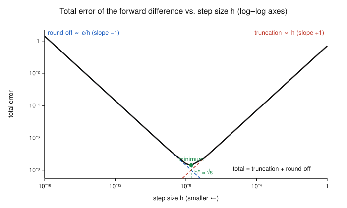

# Numerical Analysis · Lesson 2.3: Numerical Differentiation

> ⏱ ~15 min · Module 2: Interpolation & Quadrature · Builds on: [Lesson 1.2 (cancellation & error propagation)](01-02-cancellation-error-propagation.md), Taylor series · Unlocks: [Lesson 2.4 (Newton–Cotes quadrature)](02-04-newton-cotes-quadrature.md)

## Why this matters

You constantly need a derivative you can't get symbolically: the slope of a black-box simulation, the gradient of a loss you only evaluate through code, the $f''$ that shows up when you discretize a differential equation. The finite-difference formulas below are how you get one from function values alone. But this is also the cleanest place in the whole course to watch the course's two error demons fight each other head-on: **truncation error** (you replaced calculus with algebra) wants a *small* step $h$, while **round-off error** (you subtracted nearly-equal numbers — the cancellation from [Lesson 1.2](01-02-cancellation-error-propagation.md)) wants a *large* one. There is a best $h$ in between, and knowing where it sits is the difference between eight correct digits and none. These same stencils come back to build the heat-equation and boundary-value solvers in Module 5.

## The idea

A derivative is a limit of a slope: $f'(x) = \lim_{h\to 0}\frac{f(x+h)-f(x)}{h}$. The obvious move is to *stop taking the limit* — pick a small but finite $h$ and read off the slope of a nearby secant line. That's the **forward difference**. It works, and Taylor's theorem tells you exactly how wrong it is: proportional to $h$.

You can do better for free. Instead of looking only forward, straddle the point — use $x+h$ and $x-h$ symmetrically. The **central difference** is the slope of the secant through the two side points, and by symmetry the leading error term cancels, leaving an error proportional to $h^2$ — one that shrinks *quadratically* as you refine. Same two function evaluations' worth of work, an order more accuracy.

So far, smaller $h$ is always better. The catch is that you're computing $f(x+h)-f(x)$ on a real machine, and when $h$ is tiny those two numbers agree to many digits. Subtracting them annihilates the leading digits and leaves a result dominated by rounding noise — then you *divide by the tiny number $h$*, blowing that noise up. Push $h$ too small and your slope estimate gets *worse*. The total error is U-shaped, and the whole game is landing near its bottom.

## The formal version

Everything drops out of Taylor expansions around $x$. Write $f(x\pm h) = f(x) \pm hf'(x) + \tfrac{h^2}{2}f''(x) \pm \tfrac{h^3}{6}f'''(x) + \cdots$.

**Forward difference.** From $f(x+h) = f(x) + hf'(x) + \tfrac{h^2}{2}f''(\xi)$,
$$\frac{f(x+h)-f(x)}{h} = f'(x) + \frac{h}{2}f''(\xi) = f'(x) + O(h).$$
*In words:* the secant slope using the point and one neighbor equals the true slope plus an error that shrinks like $h$ — halve the step, halve the error.

**Central difference.** Subtract the two expansions; the even-power terms ($f$, $f''$, …) cancel and the odd ones survive:
$$f(x+h) - f(x-h) = 2hf'(x) + \frac{h^3}{3}f'''(\xi),$$
so
$$\frac{f(x+h)-f(x-h)}{2h} = f'(x) + \frac{h^2}{6}f'''(\xi) = f'(x) + O(h^2).$$
*In words:* straddling the point symmetrically kills the leading error term for free, so halving the step cuts the error by a **factor of four**.

**Second derivative (three-point stencil).** Add the two expansions instead; now the odd terms cancel:
$$\frac{f(x+h) - 2f(x) + f(x-h)}{h^2} = f''(x) + \frac{h^2}{12}f^{(4)}(\xi) = f''(x) + O(h^2).$$
*In words:* the same three values, weighted $(1,-2,1)$, give the curvature to second order. This exact stencil is the backbone of the BVP and heat-equation solvers in Lessons [5.3](05-03-finite-differences-bvp.md) and [5.4](05-04-heat-equation-explicit-implicit.md).

**The round-off floor.** On a machine, each evaluated value carries relative error up to $\varepsilon_{\text{mach}}$: you get $\operatorname{fl}(f) = f(1+\delta)$ with $|\delta|\le\varepsilon_{\text{mach}}$. For the forward difference the numerator's absolute rounding error is at most about $2\varepsilon_{\text{mach}}M_0$ (with $M_0 = \max|f|$ nearby), and you divide it by $h$. So the two error sources, bounded, are
$$E(h)\ \le\ \underbrace{\frac{M_2}{2}\,h}_{\text{truncation},\ M_2=\max|f''|}\ +\ \underbrace{\frac{2\varepsilon_{\text{mach}}M_0}{h}}_{\text{round-off}}.$$
*In words:* total error is one term that grows with $h$ plus one that grows as $h\to 0$ — a valley with a bottom.

**Optimal step size.** Minimize: set $E'(h)=\tfrac{M_2}{2}-\tfrac{2\varepsilon_{\text{mach}}M_0}{h^2}=0$, giving
$$h^* = 2\sqrt{\frac{\varepsilon_{\text{mach}}M_0}{M_2}}\ \approx\ \sqrt{\varepsilon_{\text{mach}}},\qquad E(h^*)\approx 2\sqrt{\varepsilon_{\text{mach}}M_0M_2}\approx \sqrt{\varepsilon_{\text{mach}}}.$$
*In words:* for the forward difference the sweet spot is $h\approx\sqrt{\varepsilon_{\text{mach}}}\approx 10^{-8}$ in double precision, and even there you keep only *half* your digits — best-case error $\sim\sqrt{\varepsilon_{\text{mach}}}\approx 10^{-8}$, not $10^{-16}$. Going smaller doesn't help; it hurts.

**Richardson extrapolation.** If a formula has a known error expansion $D(h) = L + c\,h^p + O(h^{q})$ (with $q>p$), evaluate it at two steps and take the combination that kills the $c\,h^p$ term:
$$L \approx \frac{2^{p}\,D(h/2) - D(h)}{2^{p}-1} = L + O(h^{q}).$$
*In words:* compute the estimate at $h$ and $h/2$, then form the weighted difference that cancels the leading error — you buy a higher order from two cheap evaluations. For the central difference ($p=2$, and its error runs in *even* powers, so $q=4$): $\dfrac{4D(h/2)-D(h)}{3} = f'(x) + O(h^4)$.

## Picture

The truncation term (red, slope $+1$ on log–log) and the round-off term (blue, slope $-1$) trade off; their sum (black) is a valley whose bottom sits at $h^*\approx\sqrt{\varepsilon_{\text{mach}}}$.

Read it right-to-left the way you'd actually refine: starting large, shrinking $h$ walks you *down* the truncation slope — until you hit the round-off wall and every further step *climbs*. The bottom is the best this formula can do.

## Worked examples

**Example 1 (mechanical — forward vs. central).** Estimate $f'(1)$ for $f(x)=\ln x$, where the true value is $f'(1)=1$, using $h=0.1$. Take $\ln 1.1 = 0.09531018$, $\ln 0.9 = -0.10536052$.

- Forward: $\dfrac{\ln 1.1 - \ln 1}{0.1} = \dfrac{0.09531018}{0.1} = 0.9531018$, error $-0.0468982$.
  Predicted $\tfrac{h}{2}f''(1) = \tfrac{0.1}{2}(-1) = -0.05$ — right size and sign. ✓
- Central: $\dfrac{\ln 1.1 - \ln 0.9}{0.2} = \dfrac{0.20067070}{0.2} = 1.0033535$, error $+0.0033535$.
  Predicted $\tfrac{h^2}{6}f'''(1) = \tfrac{0.01}{6}(2) = 0.0033333$. ✓

One extra evaluation, and the error drops from $5\times10^{-2}$ to $3\times10^{-3}$ — an order of magnitude, exactly as $O(h)$ vs. $O(h^2)$ predicts at $h=0.1$.

**Example 2 (why you'd care — Richardson boosts the order).** Keep the central difference for $f'(1)$ of $\ln x$ and add $h=0.05$: $\dfrac{\ln 1.05 - \ln 0.95}{0.1} = \dfrac{0.04879016 + 0.05129329}{0.1} = 1.0008346$, error $+0.0008346$. Halving $h$ cut the error by $0.0033535/0.0008346 \approx 4.0$ — the signature of $O(h^2)$.

Now extrapolate ($p=2$):
$$\frac{4\,D(0.05) - D(0.1)}{3} = \frac{4(1.0008346) - 1.0033535}{3} = \frac{2.9999849}{3} = 0.9999950,$$
error $-5.0\times10^{-6}$. Two second-order estimates combined into a fourth-order one: the error fell from $\sim10^{-3}$ to $\sim10^{-6}$ without evaluating anything new. This "refine, then extrapolate" trick reappears as **Romberg integration** in [Lesson 2.4](02-04-newton-cotes-quadrature.md) — same idea, applied to the trapezoid rule.

## Watch out

- You might think "smaller $h$ is always more accurate" — but that's only the truncation half of the story. Below $h^*\approx\sqrt{\varepsilon_{\text{mach}}}$ the round-off term $\varepsilon_{\text{mach}}/h$ takes over and your estimate degrades. Taking $h=10^{-14}$ for a forward difference in double precision is *worse* than $h=10^{-8}$.
- You might think the central difference is strictly better, so always use it — but it needs $f$ on *both* sides of $x$. At a domain boundary (or the ends of a BVP grid) you're forced back to a one-sided formula; there are higher-order one-sided stencils for exactly this.
- You might read "$O(h^2)$" as "the error *is* $h^2$" — it's $\tfrac{h^2}{6}f'''(\xi)$. If $f'''$ is huge (a sharp feature), the constant dominates and a nominally high-order formula can still be inaccurate. Order describes the *rate* of improvement, not the size at a given $h$.

## One-liner

> Truncation error wants $h$ small and round-off wants $h$ large, so differentiation numerically means landing in the valley at $h^*\approx\sqrt{\varepsilon_{\text{mach}}}$ — and central differences plus Richardson let you reach a lower valley.

## Problems

**P1 (🟢)** Approximate $f''(0)$ for $f(x)=\cos x$ (true value $-1$) with the three-point second-derivative stencil at $h=0.1$. Use $\cos(0.1)=0.99500417$. Then compare your error to the predicted leading term $\tfrac{h^2}{12}f^{(4)}(0)$.

**P2 (🟡)** Repeat the optimal-step analysis for the **central** difference: its truncation bound is $\tfrac{M_3}{6}h^2$ (with $M_3=\max|f'''|$) and its round-off bound is $\tfrac{\varepsilon_{\text{mach}}M_0}{h}$. Find $h^*$ and the resulting error's order in $\varepsilon_{\text{mach}}$. Taking $M_0=M_3=1$ and $\varepsilon_{\text{mach}}=10^{-16}$, give numbers for $h^*$ and the best achievable error, and compare both to the forward difference's $h^*\approx 10^{-8}$, error $\approx 10^{-8}$.

**P3 (🔴, optional)** The forward difference has leading error $O(h)$, i.e. $p=1$. Write the Richardson combination of $D(h)$ and $D(h/2)$ that cancels it, and state the new order. Then apply it to $f'(1)$ of $\ln x$ using $D(0.1)=0.9531018$ and $D(0.05)=\tfrac{\ln 1.05}{0.05}=0.9758033$, and check the error against the raw forward-difference errors.

Solutions

**P1** By symmetry $\cos(-0.1)=\cos(0.1)=0.99500417$, so
$$\frac{\cos(0.1) - 2\cos 0 + \cos(-0.1)}{0.1^2} = \frac{0.99500417 - 2 + 0.99500417}{0.01} = \frac{-0.00999166}{0.01} = -0.999166.$$
Error $= -0.999166 - (-1) = +0.000834$. Prediction: $f^{(4)}(x)=\cos x$, so $\tfrac{h^2}{12}f^{(4)}(0) = \tfrac{0.01}{12}(1) = 0.000833$. Match to three digits. ✓ (The stencil *underestimates* the magnitude of the true $-1$, consistent with the $+\tfrac{h^2}{12}f^{(4)}$ correction being positive.)

**P2** Total error bound $E(h) = \tfrac{M_3}{6}h^2 + \tfrac{\varepsilon_{\text{mach}}M_0}{h}$. Differentiate and set to zero:
$$E'(h) = \frac{M_3}{3}h - \frac{\varepsilon_{\text{mach}}M_0}{h^2} = 0 \ \Longrightarrow\ h^3 = \frac{3\varepsilon_{\text{mach}}M_0}{M_3} \ \Longrightarrow\ h^* = \left(\frac{3\varepsilon_{\text{mach}}M_0}{M_3}\right)^{1/3} \sim \varepsilon_{\text{mach}}^{1/3}.$$
Substituting back, both terms are $\sim\varepsilon_{\text{mach}}^{2/3}$, so the best achievable error is $O(\varepsilon_{\text{mach}}^{2/3})$. Numerically with $M_0=M_3=1$, $\varepsilon_{\text{mach}}=10^{-16}$:
$$h^* = (3\times10^{-16})^{1/3} \approx 6.7\times10^{-6}, \qquad E(h^*)\sim (10^{-16})^{2/3} = 10^{-32/3} \approx 2\times10^{-11}.$$
Verdict: the central difference wins on **both** axes — a larger, more forgiving optimal step ($\sim10^{-6}$ vs. $10^{-8}$) *and* far higher achievable accuracy ($\sim10^{-11}$ vs. $10^{-8}$). Higher order pays off at the round-off floor, not just in the truncation regime.

**P3** With $p=1$ the canceling combination is $\dfrac{2^{1}D(h/2) - D(h)}{2^{1}-1} = 2D(h/2) - D(h)$, and since the forward-difference error runs in *all* powers of $h$, the next term is $O(h^2)$ — order lifted from 1 to 2.
$$2(0.9758033) - 0.9531018 = 1.9516066 - 0.9531018 = 0.9985048,$$
error $-0.0014952$. Compare the raw forward errors: $D(0.1)$ gives $-0.0468982$ and $D(0.05)$ gives $0.9758033-1 = -0.0241967$ (ratio $\approx1.94$, confirming $O(h)$). Richardson's $-1.5\times10^{-3}$ is more than an order of magnitude better than either input and now shrinks like $h^2$. ✓

## Flashback

**From [Lesson 1.2](01-02-cancellation-error-propagation.md) (catastrophic cancellation):** In double precision ($\varepsilon_{\text{mach}}\approx 1.1\times10^{-16}$) you must evaluate $g(x)=\dfrac{1-\cos x}{x^2}$ at $x=10^{-4}$. Explain why the literal formula loses most of its significant digits, estimate the relative error, and rewrite $g$ so it computes to full precision. (What is $\lim_{x\to0}g(x)$?)

Solution

Near $x=0$, $\cos x = 1 - \tfrac{x^2}{2} + \tfrac{x^4}{24} - \cdots$, so $1-\cos x \approx \tfrac{x^2}{2} = 5\times10^{-9}$ at $x=10^{-4}$. But $\cos(10^{-4})\approx 0.999999995$ is stored with absolute error $\sim\varepsilon_{\text{mach}}\approx10^{-16}$; subtracting it from $1$ leaves a number of size $5\times10^{-9}$ carrying that same $10^{-16}$ of noise, so the **relative** error explodes to about $\dfrac{10^{-16}}{5\times10^{-9}} = 2\times10^{-8}$ — roughly eight significant digits gone. This is catastrophic cancellation: subtracting two nearly-equal numbers. (It is exactly the mechanism that produces the round-off floor in this lesson's difference quotients.)

Fix it with the identity $1-\cos x = 2\sin^2(x/2)$, which replaces the subtraction with a squared quantity — no cancellation:
$$g(x) = \frac{2\sin^2(x/2)}{x^2} = \frac{1}{2}\left(\frac{\sin(x/2)}{x/2}\right)^2.$$
Now $\sin(x/2)/(x/2)$ is a benign ratio near $1$ and computes to full precision. As $x\to0$, $g(x)\to\tfrac12$ (the Taylor series gives $g(x)=\tfrac12 - \tfrac{x^2}{24}+\cdots$), so the correct value at $x=10^{-4}$ is $0.5$ to fifteen digits — the stable form recovers it, the naive form does not.

## Connections

- **Backward:** the round-off floor here *is* the catastrophic cancellation of [Lesson 1.2](01-02-cancellation-error-propagation.md) — subtracting $f(x+h)$ from the nearly-equal $f(x)$, then dividing by a tiny $h$ — now quantified into an explicit optimal step size.
- **Forward:** the Richardson idea returns as Romberg integration in [Lesson 2.4](02-04-newton-cotes-quadrature.md), and the $(1,-2,1)$ second-derivative stencil becomes the discretization matrix for boundary-value problems ([5.3](05-03-finite-differences-bvp.md)) and the heat equation ([5.4](05-04-heat-equation-explicit-implicit.md)).
- **Sideways (PDE numerics):** replacing derivatives with these stencils is the whole method of finite differences — this course takes only a taste; the systematic treatment (higher-order stencils, FEM, convergence theory) lives in [pdes](../../pdes/syllabus.md).
- **Sideways (optimization / ML):** the forward and central differences are exactly the *gradient check* used to validate hand-derived or backprop gradients against a black-box loss in [convex-optimization](../../convex-optimization/syllabus.md) — and the $h^*\approx\sqrt{\varepsilon_{\text{mach}}}$ rule of thumb is why those checks use $h\approx10^{-6}$ to $10^{-8}$, never $10^{-14}$.
