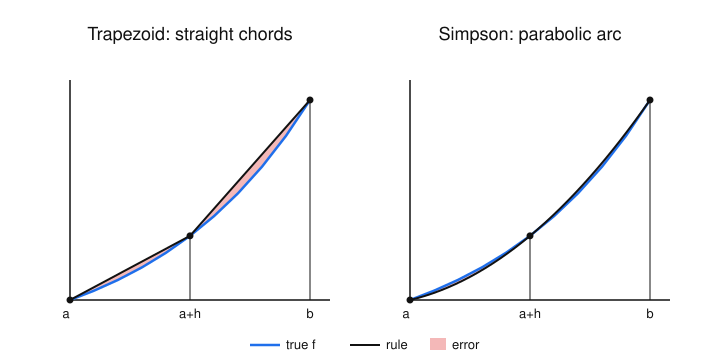

# Numerical Analysis · Lesson 2.4: Newton–Cotes Quadrature

> ⏱ ~15 min · Module 2: Interpolation & Quadrature · Builds on: [Lesson 2.1](02-01-polynomial-interpolation.md) (interpolating polynomials + their error term) · Unlocks: [Lesson 2.5](02-05-gaussian-adaptive-quadrature.md) (Gaussian & adaptive quadrature)

## Why this matters

Most integrals you actually need have no antiderivative: $\int e^{-x^2}$, the arc length of almost anything, a probability from a messy density. So you do the only thing you can — sample $f$ at a few points and add up the pieces. The two rules in this lesson, **trapezoid** and **Simpson**, are the ones every scientific library reaches for first, and the reason to trust their output is that each comes with an honest error bound that shrinks *predictably* as you sample more finely. Getting the exponent on that shrinkage right — $O(h^2)$ vs. $O(h^4)$ — is the difference between one extra digit and four for the same doubling of work.

## The idea

You already know how to turn samples into a curve: build the interpolating polynomial through your data points (Lesson 2.1). **Quadrature** is the one-line sequel — *integrate that polynomial instead of the function you can't integrate.* The polynomial is a stack of powers, and powers are trivial to integrate, so the whole scheme collapses into "evaluate $f$ at a few nodes, multiply by fixed weights, add."

- Fit a **straight line** through the two endpoints and integrate it → you get the area of a **trapezoid**. That's the trapezoid rule.
- Fit a **parabola** through two endpoints *and the midpoint* and integrate it → **Simpson's rule**.

The error is then inherited directly from the interpolation error: however badly the polynomial misses $f$, that miss is exactly the area you failed to count (the shaded slivers in the picture). And here's the little miracle you'll pay attention to: the parabola in Simpson's rule is only guaranteed to match a *quadratic*, yet by a symmetry accident it integrates **cubics** exactly too — a free extra order of accuracy for no extra evaluations.

## The formal version

Fix an interval and let $h$ be the spacing between equally spaced nodes. Write $f_i = f(x_i)$.

**Trapezoid rule** (nodes $x_0=a$, $x_1=b$, so $h=b-a$):
$$\int_a^b f(x)\,dx \;\approx\; \frac{h}{2}\big(f_0 + f_1\big), \qquad \text{error } E_T = -\frac{h^3}{12}\,f''(\xi),\ \ \xi\in(a,b).$$

*In words:* average the two endpoint heights, multiply by the width — the area of the trapezoid under the connecting chord. The error is a curvature penalty: it's exactly zero when $f''\equiv 0$, i.e. the rule is **exact for any straight line**.

**Simpson's rule** (three nodes $x_0=a$, $x_1=\tfrac{a+b}{2}$, $x_2=b$, so $h=\tfrac{b-a}{2}$ is the *half*-width):
$$\int_a^b f(x)\,dx \;\approx\; \frac{h}{3}\big(f_0 + 4f_1 + f_2\big), \qquad \text{error } E_S = -\frac{h^5}{90}\,f^{(4)}(\xi),\ \ \xi\in(a,b).$$

*In words:* a weighted endpoint-midpoint-endpoint average ($1{:}4{:}1$) times a third of the half-width. The error rides on the *fourth* derivative, so it vanishes whenever $f^{(4)}\equiv 0$ — the rule is **exact for every cubic**, even though it was built from a mere parabola.

**Degree of exactness.** A quadrature rule has *degree of exactness* $d$ if it integrates every polynomial up to degree $d$ with zero error, and fails at degree $d+1$. From the error terms: trapezoid has $d=1$ (kills $f''$), Simpson has $d=3$ (kills $f^{(4)}$). *In words:* it's the highest-degree polynomial the rule gets perfectly right — a clean one-number summary of a rule's power. The whole payoff of Lesson 2.5 will be squeezing the *maximum possible* degree of exactness out of a fixed number of evaluations.

**Composite rules.** One panel across a wide interval is crude. Instead chop $[a,b]$ into $n$ equal subintervals of width $h=(b-a)/n$ and apply the basic rule on each, then sum. The per-panel errors accumulate, but the shrinking $h$ wins:

$$\underbrace{\frac{h}{2}\Big(f_0 + 2\!\sum_{i=1}^{n-1} f_i + f_n\Big)}_{\text{composite trapezoid}},\qquad E \;=\; -\frac{(b-a)\,h^2}{12}\,f''(\xi)\;=\;O(h^2).$$

$$\underbrace{\frac{h}{3}\Big(f_0 + 4\!\!\sum_{i\ \text{odd}}\! f_i + 2\!\!\sum_{i\ \text{even}}\! f_i + f_n\Big)}_{\text{composite Simpson}\ (n\ \text{even})},\qquad E \;=\; -\frac{(b-a)\,h^4}{180}\,f^{(4)}(\xi)\;=\;O(h^4).$$

*In words:* each panel contributes an $O(h^3)$ (trapezoid) or $O(h^5)$ (Simpson) error, but there are $n\propto 1/h$ of them, so one power of $h$ is spent on the panel count — leaving global orders $O(h^2)$ and $O(h^4)$. The practical reading: **halve $h$ and composite-trapezoid error drops by $4\times$, composite-Simpson error by $16\times$.** (This is truncation error only — chase $h\to 0$ far enough and round-off in the summed $f_i$ eventually takes over, the same truncation-vs-round-off tension you met in [Lesson 2.3](02-03-numerical-differentiation.md).)

## Picture

Same convex curve, same nodes. The trapezoid's straight chords leave fat error slivers between chord and curve; Simpson's parabola hugs the curve so tightly the shaded error is barely visible — that's the fourth-derivative error term at work.

## Worked examples

Throughout, take the clean test integral
$$I=\int_0^1 e^{x}\,dx = e - 1 = 1.718281828,$$
convenient because *every* derivative of $e^x$ is $e^x$, so error constants are transparent. Node values we'll reuse:
$e^{0}=1,\ e^{0.25}=1.284025417,\ e^{0.5}=1.648721271,\ e^{0.75}=2.117000017,\ e^{1}=2.718281828.$

**Example 1 (one panel, mechanical — and reading the error bound).**
Single trapezoid, $h=1$:
$$T_1=\frac{1}{2}(e^0+e^1)=\frac{1}{2}(1+2.718281828)=1.859140914,\qquad E=I-T_1=-0.140859086.$$
The bound predicts $E=-\tfrac{h^3}{12}f''(\xi)=-\tfrac{1}{12}e^{\xi}$ for some $\xi\in(0,1)$, i.e. between $-\tfrac{1}{12}e^{1}=-0.2265$ and $-\tfrac{1}{12}e^{0}=-0.0833$. Our $-0.1409$ sits squarely inside — and the sign is no accident: $e^x$ is convex, its chord lies *above* the curve, so the trapezoid **over**estimates and the error is negative.

Single Simpson on $[0,1]$ ($h=\tfrac12$, midpoint $e^{0.5}$):
$$S=\frac{0.5}{3}\big(1+4(1.648721271)+2.718281828\big)=\frac{0.5}{3}(10.31316691)=1.718861152,$$
$$E=I-S=-0.000579324.$$
Same three-ish evaluations as the trapezoid used across two panels, yet the error dropped by a factor of ~240. That is the degree-of-exactness gap ($d=1$ vs. $d=3$) cashed out in digits.

**Example 2 (composite rules + confirming the order).** Refine $h$ and watch the error ratios. Composite trapezoid:

| $n$ | $h$ | $T_n$ | $E=I-T_n$ | ratio to previous |
|---|---|---|---|---|
| 1 | $1$ | $1.859140914$ | $-0.140859086$ | — |
| 2 | $0.5$ | $1.753931093$ | $-0.035649265$ | $3.95$ |
| 4 | $0.25$ | $1.727221905$ | $-0.008940076$ | $3.99$ |

Each halving of $h$ cuts the error by ~$4$ — exactly the $O(h^2)$ signature. (Sample computation, $n=2$: $T_2=\tfrac{0.5}{2}\big[1+2(1.648721271)+2.718281828\big]=0.25(7.015724371)=1.753931093$.)

Composite Simpson, same nodes:

| $n$ | $h$ | $S_n$ | $E=I-S_n$ | ratio to previous |
|---|---|---|---|---|
| 2 | $0.5$ | $1.718861152$ | $-0.000579324$ | — |
| 4 | $0.25$ | $1.718318842$ | $-0.000037013$ | $15.65$ |

The error ratio $\approx 16$ confirms $O(h^4)$. (Computation, $n=4$: $S_4=\tfrac{0.25}{3}\big[1+4(e^{0.25}+e^{0.75})+2\,e^{0.5}+e^{1}\big]=\tfrac{0.25}{3}(20.61982610)=1.718318842$.) With only 5 evaluations, composite Simpson already beats 5-node composite trapezoid by a factor of ~240 — the same story as Example 1, now compounded.

## Watch out

- **You might think the "$h$" in Simpson's rule is $b-a$, but it's the half-width** $\tfrac{b-a}{2}$ (the node spacing). Plugging the full width into $-\tfrac{h^5}{90}f^{(4)}$ inflates the predicted error by $2^5=32$. For *composite* Simpson, $n$ must be **even** (panels come in pairs, one parabola per pair).
- **You might expect Simpson to be exact only for parabolas, but it nails cubics too.** The odd-degree error over a symmetric interval cancels itself, so degree of exactness jumps from $2$ to $3$ for free — the single most important "why bother" fact about the rule. Test it: $\int_0^1 x^3\,dx=\tfrac14$, and Simpson gives $\tfrac{0.5}{3}\big(0+4(0.125)+1\big)=\tfrac{0.5}{3}(1.5)=0.25$ exactly, while the trapezoid returns $\tfrac12(0+1)=0.5$ — off by $100\%$.
- **You might read a smaller error constant as "always more accurate," but the derivative it multiplies can bite back.** Simpson's $f^{(4)}$ bound is worthless if $f$ isn't smooth — a kink or a sharp spike makes $f^{(4)}$ huge (or undefined), and a uniform high-order rule can lose to a humble refined trapezoid. That failure is exactly what motivates *adaptive* quadrature in Lesson 2.5.

## One-liner

> Quadrature is just "integrate the interpolating polynomial"; trapezoid buys $O(h^2)$ from a line, and Simpson steals $O(h^4)$ from a parabola because symmetry hands it cubics for free.

## Problems

**P1 (🟢)** Approximate $\int_0^{\pi} \sin x\,dx$ (exact value $2$) two ways: (a) composite trapezoid with $n=2$ panels, and (b) Simpson's rule on the single interval $[0,\pi]$ (i.e. $n=2$, one parabola). Report each error against the exact value $2$.

**P2 (🟡)** You compute $\int_a^b f$ by composite trapezoid with $n=10$ panels and get error $8\times10^{-4}$. Roughly what error do you expect at $n=20$? At $n=40$? Now suppose you'd used composite Simpson and seen error $8\times10^{-4}$ at $n=10$ — what would you expect at $n=20$? State the reasoning in one line each.

**P3 (🔴, optional)** Show directly that Simpson's rule on $[-1,1]$ (nodes $-1,0,1$, so $h=1$) integrates $x^3$ exactly, and that it is *not* exact for $x^4$. From the $x^4$ discrepancy, back out the constant $c$ in the error form $E=-c\,f^{(4)}(\xi)$ and confirm it matches $\tfrac{h^5}{90}$. (This is the symmetry-cancellation miracle, made explicit.)

Solutions

**P1** Let $f=\sin x$ on $[0,\pi]$, midpoint $\tfrac{\pi}{2}$: $f(0)=0$, $f(\tfrac{\pi}{2})=1$, $f(\pi)=0$. Here $h=\tfrac{\pi}{2}=1.570796$.

(a) Composite trapezoid, $n=2$: $T_2=\dfrac{h}{2}\big(f_0+2f_1+f_2\big)=\dfrac{1.570796}{2}\big(0+2(1)+0\big)=1.570796$. Error $=2-1.570796=0.429204$. (Trapezoid *under*estimates here because $\sin$ is concave on $[0,\pi]$, so the chords lie below the curve — error positive, mirror image of the convex $e^x$ case.)

(b) Simpson, one parabola ($h=\tfrac{\pi}{2}$): $S=\dfrac{h}{3}\big(f_0+4f_1+f_2\big)=\dfrac{1.570796}{3}\big(0+4(1)+0\big)=\dfrac{6.283185}{3}=2.094395$. Error $=2-2.094395=-0.094395$. Smaller in magnitude than the trapezoid by ~$4.5\times$, and it's already this good on a *single* parabola spanning the whole hump.

**P2** Composite trapezoid is $O(h^2)$ and $h\propto 1/n$, so error $\propto 1/n^2$; doubling $n$ divides error by $4$.
- $n=20$: $8\times10^{-4}/4 = 2\times10^{-4}$.
- $n=40$: $2\times10^{-4}/4 = 5\times10^{-5}$.

Composite Simpson is $O(h^4)\propto 1/n^4$, so doubling $n$ divides error by $16$.
- $n=20$: $8\times10^{-4}/16 = 5\times10^{-5}$.

(One extra doubling of Simpson would already reach $\sim 3\times10^{-6}$ — the order gap compounds fast.)

**P3** Simpson on $[-1,1]$ with nodes $-1,0,1$, $h=1$: $S[f]=\dfrac{1}{3}\big(f(-1)+4f(0)+f(1)\big)$.

*Cubic $f=x^3$:* exact $\int_{-1}^{1}x^3\,dx=0$ (odd function). Rule: $S=\tfrac13\big((-1)^3+4(0)+1^3\big)=\tfrac13(-1+0+1)=0$. Exact ✓. The $f(-1)$ and $f(1)$ contributions cancel by odd symmetry, and the midpoint is weighted but $f(0)=0$ — this cancellation is *why* the degree of exactness is $3$, not $2$.

*Quartic $f=x^4$:* exact $\int_{-1}^{1}x^4\,dx=\big[\tfrac{x^5}{5}\big]_{-1}^{1}=\tfrac{2}{5}=0.4$. Rule: $S=\tfrac13\big((-1)^4+4(0)^4+1^4\big)=\tfrac13(1+0+1)=\tfrac23=0.6667$. Error $=\text{exact}-S=0.4-0.6667=-0.26667=-\tfrac{4}{15}$. Not exact — so degree of exactness stops at $3$. ✓

*Back out $c$:* for $f=x^4$, $f^{(4)}=24$ (constant), so $E=-c\,f^{(4)}=-24c$. Matching $E=-\tfrac{4}{15}$ gives $c=\dfrac{4/15}{24}=\dfrac{4}{360}=\dfrac{1}{90}$. With $h=1$, $\tfrac{h^5}{90}=\tfrac{1}{90}=c$ ✓ — the error constant in $E=-\tfrac{h^5}{90}f^{(4)}(\xi)$ is exactly what the single failing monomial forces it to be.

## Flashback

**From Lesson 2.1 (Polynomial interpolation — the error term):** Let $p_1$ be the degree-1 polynomial interpolating $f(x)=e^{x}$ at $x_0=0$ and $x_1=1$. The interpolation error at a point is $f(x)-p_1(x)=\dfrac{f''(\xi_x)}{2!}(x-x_0)(x-x_1)$ for some $\xi_x\in(0,1)$. (a) Write down $p_1$ explicitly and evaluate the error at the midpoint $x=\tfrac12$. (b) Integrate the error term $\int_0^1 \dfrac{f''(\xi_x)}{2}\,x(x-1)\,dx$ using a single representative value $f''(\xi)=e^{\xi}$ pulled out of the integral, and check that the result equals the trapezoid error $-\tfrac{h^3}{12}f''(\xi)$ with $h=1$.

Solution

(a) The line through $(0,1)$ and $(1,e)$ is $p_1(x)=1+(e-1)x$. At $x=\tfrac12$: $p_1(\tfrac12)=1+\tfrac{e-1}{2}=1.859140914$, while $f(\tfrac12)=e^{0.5}=1.648721271$. Error $f-p_1=1.648721271-1.859140914=-0.210419643$. Negative because the chord lies above the convex curve — the same sign that made the trapezoid overestimate.

(b) Pull the (assumed constant) $f''(\xi)=e^{\xi}$ out front:
$$\int_0^1 \frac{e^{\xi}}{2}\,x(x-1)\,dx=\frac{e^{\xi}}{2}\int_0^1 (x^2-x)\,dx=\frac{e^{\xi}}{2}\Big[\tfrac{x^3}{3}-\tfrac{x^2}{2}\Big]_0^1=\frac{e^{\xi}}{2}\Big(\tfrac13-\tfrac12\Big)=\frac{e^{\xi}}{2}\cdot\Big(-\tfrac16\Big)=-\frac{e^{\xi}}{12}.$$
With $h=1$ this is exactly $-\tfrac{h^3}{12}f''(\xi)$ — the trapezoid error term is *nothing but the integral of the interpolation error*, which is the whole thesis of quadrature. ✓

## Connections

- **Backward ([Lesson 2.1](02-01-polynomial-interpolation.md)):** every quadrature rule here is "integrate the interpolating polynomial," and every error term is the *integral of that polynomial's error term* — the Flashback makes the identity explicit. The degree-of-exactness idea is the interpolation-error degree, integrated.
- **Backward ([Lesson 2.3](02-03-numerical-differentiation.md)):** same truncation-vs-round-off tension — refining $h$ kills truncation error until summed round-off in the $f_i$ takes over, so there's a practical floor on accuracy.
- **Forward ([Lesson 2.5](02-05-gaussian-adaptive-quadrature.md)):** Newton–Cotes fixes the nodes (equally spaced) and optimizes only the weights. Gaussian quadrature frees the *nodes* too and doubles the degree of exactness for the same evaluation count; adaptive quadrature spends panels only where $f^{(4)}$ is large, curing the "sharp spike defeats a uniform rule" failure in Watch out.
- **Sideways (probability/physics):** every expectation $\mathbb{E}[g(X)]=\int g(x)p(x)\,dx$ with no closed form, every normalization constant, every numerically-integrated equation of motion, is one of these weighted sums under the hood.
