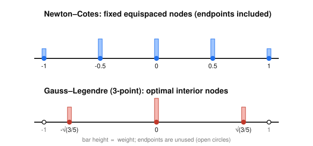

# Numerical Analysis · Lesson 2.5: Gaussian & Adaptive Quadrature

> ⏱ ~15 min · Module 2: Interpolation & Quadrature · Builds on: [Lesson 2.4](02-04-newton-cotes-quadrature.md) (trapezoid/Simpson, degree of exactness, composite rules) · Unlocks: [Module 3, Lesson 3.1](03-01-lu-pivoting.md) (numerical linear algebra)

## Why this matters

Every function evaluation you spend on an integral is a cost — sometimes a huge one, when $f$ is the output of a whole simulation. Newton–Cotes fixes the nodes to be equispaced and only gets to choose the weights; that leaves accuracy on the table. **Gaussian quadrature** asks the greedier question: if I get to place the nodes *too*, where should they go? The answer doubles the exactness for the same number of evaluations, and it's the rule inside every serious library integrator. Then **adaptive quadrature** attacks the other waste: a uniform rule spends the same effort on the flat parts of $f$ as on the spiky parts. We'll fix that by measuring local error and only subdividing where the integrand is actually hard.

## The idea

A quadrature rule is $\int f \approx \sum_i w_i f(x_i)$: pick some nodes $x_i$, weigh their function values, add them up. Newton–Cotes locks the $x_i$ onto an equispaced grid and solves for the $n$ weights $w_i$ — that's $n$ knobs, enough to force exactness on polynomials up to degree $n-1$.

Gauss's insight: **the nodes are knobs too.** With $n$ nodes *and* $n$ weights you have $2n$ free numbers, so you should be able to match $2n$ conditions — exactness for polynomials up to degree $2n-1$. That's *double* the Newton–Cotes exactness for the same $n$ evaluations. The only catch is that the nodes come out at specific, irrational, non-equispaced interior points — and the magic is *which* points: the roots of a special polynomial.

The plain-English version of "which points": you want the leftover error, after you've matched all the low-degree behavior, to be *orthogonal* to everything your rule can see. The polynomials whose roots do that are the **Legendre polynomials** — the orthogonal family on $[-1,1]$. Put your nodes at their roots and the degree-$(2n-1)$ miracle falls out.

Adaptive quadrature is a separate, simpler idea: you can't know the true error, but you can *estimate* it by computing the integral two ways — a coarse rule and a finer one — and comparing. Where they disagree a lot, the integrand is hard there; subdivide that panel and recurse. Where they agree, stop. Work flows to where it's needed.

## The formal version

**Gaussian quadrature (Gauss–Legendre).** On the reference interval $[-1,1]$, the $n$-point rule
$$\int_{-1}^{1} f(t)\,dt \;\approx\; \sum_{i=1}^{n} w_i\, f(t_i)$$
is chosen so that it is **exact for every polynomial of degree $\le 2n-1$**. This is achieved — uniquely — by taking the nodes $t_i$ to be the $n$ roots of the degree-$n$ **Legendre polynomial** $P_n$, with weights
$$w_i = \int_{-1}^{1} \ell_i(t)\,dt > 0,$$
where $\ell_i$ is the Lagrange basis polynomial for the node set. Every weight is positive (this is what keeps the rule stable — no cancellation between large terms).

*In words:* spend your $n$ evaluations at the Legendre roots, weight them right, and you integrate any polynomial up to degree $2n-1$ with zero error — twice the reach of an $n$-point Newton–Cotes rule.

The **Legendre polynomials** are the orthogonal family on $[-1,1]$ under the plain inner product $\langle p,q\rangle=\int_{-1}^1 p\,q\,dt$:
$$P_0=1,\quad P_1=t,\quad P_2=\tfrac12(3t^2-1),\quad P_3=\tfrac12(5t^3-3t),$$
with $\int_{-1}^1 P_j P_k\,dt = 0$ for $j\neq k$. Their roots are the Gauss nodes.

The two rules you should know cold, on $[-1,1]$:

| $n$ | nodes $t_i$ | weights $w_i$ | exact up to degree |
|---|---|---|---|
| 2 | $\pm\dfrac{1}{\sqrt3}\approx\pm0.57735$ | $1,\ 1$ | $3$ |
| 3 | $0,\ \pm\sqrt{\tfrac35}\approx\pm0.77460$ | $\dfrac89,\ \dfrac59,\ \dfrac59$ | $5$ |

*Why $\pm1/\sqrt3$?* Those are the roots of $P_2=\tfrac12(3t^2-1)$. *Why $0,\pm\sqrt{3/5}$?* Roots of $P_3=\tfrac12(5t^3-3t)=\tfrac12 t(5t^2-3)$.

**Change of variables to $[a,b]$.** The rules live on $[-1,1]$; map with the affine substitution $x=\dfrac{b-a}{2}\,t+\dfrac{a+b}{2}$, $dx=\dfrac{b-a}{2}\,dt$:
$$\int_a^b f(x)\,dx \;=\; \frac{b-a}{2}\int_{-1}^{1} f\!\Big(\tfrac{b-a}{2}t+\tfrac{a+b}{2}\Big)dt \;\approx\; \frac{b-a}{2}\sum_{i=1}^n w_i\, f\!\Big(\tfrac{b-a}{2}t_i+\tfrac{a+b}{2}\Big).$$

*In words:* stretch the standard nodes to fit your interval and multiply the whole sum by the half-width $\tfrac{b-a}{2}$.

**Adaptive quadrature.** Let $S(a,b)$ be a base rule (say Simpson) on a panel, and $m=\tfrac{a+b}{2}$. Compare the coarse estimate $S(a,b)$ to the refined one $S(a,m)+S(m,b)$. For Simpson the difference gives a computable error estimate for the *finer* value,
$$\text{err} \;\approx\; \frac{S(a,b)-\big(S(a,m)+S(m,b)\big)}{15},$$
(the $15=2^4-1$ comes from Simpson's $O(h^4)$ error halving under bisection — a Richardson estimate). If $|\text{err}|$ exceeds the panel's share of the tolerance, subdivide and recurse on each half; otherwise accept $S(a,m)+S(m,b)$ (plus the error correction) and stop.

*In words:* integrate each panel twice — once coarse, once split in half — and let the disagreement tell you whether that panel needs more work.

## Picture

Top: a 5-node Newton–Cotes layout — equispaced, endpoints *on* the boundary. Bottom: 3-point Gauss–Legendre — nodes pulled *inside* to the Legendre roots $0,\pm\sqrt{3/5}$, never touching the endpoints, with unequal weights (bar heights $\tfrac59,\tfrac89,\tfrac59$). The endpoints (open circles) are deliberately never evaluated; that freedom is exactly what buys the extra exactness.

## Worked examples

**Example 1 (mechanical — 2-point Gauss on $\int_0^1 e^x\,dx$, versus Simpson).**
Exact value: $\int_0^1 e^x\,dx = e-1 = 1.71828183$.

Map $[0,1]$ to $[-1,1]$: here $\tfrac{b-a}{2}=\tfrac12$ and $\tfrac{a+b}{2}=\tfrac12$, so $x=\tfrac{t+1}{2}$. The two Gauss nodes $t=\pm\tfrac{1}{\sqrt3}$ land at
$$x_1=\frac{1-1/\sqrt3}{2}=0.2113249,\qquad x_2=\frac{1+1/\sqrt3}{2}=0.7886751.$$
With weights $1,1$ and the half-width $\tfrac12$:
$$G_2=\tfrac12\big(e^{0.2113249}+e^{0.7886751}\big)=\tfrac12(1.235373+2.200420)=1.71789638.$$
Error: $|1.71789638-1.71828183|=3.9\times10^{-4}$, using **2 evaluations**.

Now Simpson on the same interval ($h=\tfrac12$, evaluating at $0,\tfrac12,1$ — **3 evaluations**):
$$S=\frac{1/2}{3}\big(e^0+4e^{0.5}+e^1\big)=1.71886115,\qquad \text{error }5.8\times10^{-4}.$$
Read the scorecard: 2-point Gauss is **more accurate with one fewer evaluation**. Both rules are exact through degree 3, but Gauss's freedom to move the nodes squeezes out a smaller error constant. (For reference, 3-point Gauss — 3 evals — nails it to $8.2\times10^{-7}$, three orders of magnitude past Simpson's 3-eval result.)

**Example 2 (why you'd care — accuracy per evaluation).** Suppose each evaluation of $f$ costs a 10-second simulation and you have a budget of 3 evaluations per panel. Simpson gives you degree-3 exactness for those 3 evals; 3-point Gauss gives you degree-**5** exactness for the same 3 evals — it integrates $f(x)=x^4$ and $x^5$ exactly, which Simpson cannot. On a smooth integrand that's the difference between an error that dies like $O(h^4)$ and one that dies like $O(h^6)$ as you refine. This is why library routines (`quadgk`, `scipy.integrate.quad`, GSL's QAG) are built on Gauss rules (often Gauss–Kronrod, which reuses the nodes to get a *free* error estimate), not on Simpson: when evaluations are the currency, you buy the most exactness per node.

## Watch out

- **You might think Gauss nodes are equispaced or include the endpoints — they never do.** They're the *interior* roots of a Legendre polynomial (irrational numbers), and the endpoints of $[a,b]$ are deliberately skipped. If your integrand has an endpoint singularity, that's actually a feature; if you *need* endpoint values (e.g. matching a boundary), Gauss is the wrong tool.
- **You might think "degree of exactness" means "small error on my function" — it doesn't directly.** Exactness through degree $2n-1$ means zero error on polynomials up to that degree; a real $f$ is not a polynomial, so its error is governed by how well a degree-$(2n-1)$ polynomial approximates $f$. Gauss wins on *smooth* $f$; on a jagged or discontinuous integrand the high exactness buys little, and that's precisely when you switch to adaptive subdivision instead of a higher-order rule.
- **You might think adaptive quadrature's error estimate is the true error — it's a proxy.** $(S_{\text{coarse}}-S_{\text{fine}})/15$ assumes the Simpson error model holds on the panel. Near a sharp feature that model can under-report, so robust integrators cap the recursion depth and demand a minimum panel width rather than trusting the estimate blindly.

## One-liner

> Let the rule choose *where* to look, not just how to weigh — Gauss–Legendre doubles your exactness per evaluation by planting nodes at Legendre roots, and adaptive refinement spends those evaluations only where the integrand fights back.

## Problems

**P1 (🟢)** Use the **2-point** Gauss–Legendre rule to estimate $\int_1^2 \frac{1}{x}\,dx$ (exact value $\ln 2 = 0.6931472$). Give the mapped nodes, the estimate, and the error. Then compare against Simpson's rule on the same interval (3 evaluations) and state which is more accurate per evaluation.

**P2 (🟡)** The 3-point Gauss–Legendre rule on $[-1,1]$ claims exactness through degree 5. Verify it directly by checking it on $\int_{-1}^1 t^4\,dt$ and $\int_{-1}^1 t^6\,dt$: compute the rule's output for each, compare to the exact integrals, and confirm it is exact for the degree-4 case but *not* the degree-6 case. (Nodes $0,\pm\sqrt{3/5}$; weights $\tfrac89,\tfrac59,\tfrac59$.)

**P3 (🔴, optional)** Adaptive step for $\int_0^1 e^x\,dx$. Using Simpson $S(a,b)=\tfrac{b-a}{6}\big(f(a)+4f(\tfrac{a+b}{2})+f(b)\big)$: (a) compute the coarse estimate $S(0,1)$; (b) compute the refined estimate $S(0,\tfrac12)+S(\tfrac12,1)$; (c) form the error estimate $\big(S(0,1)-[S(0,\tfrac12)+S(\tfrac12,1)]\big)/15$ and compare it to the *actual* error of the refined estimate against $e-1=1.7182818$. Does the estimate track the true error?

Solutions

**P1** Map $[1,2]$ to $[-1,1]$: $\tfrac{b-a}{2}=\tfrac12$, $\tfrac{a+b}{2}=\tfrac32$, so $x=\tfrac12 t+\tfrac32$. Nodes $t=\pm1/\sqrt3$ give
$$x_1=\tfrac32-\tfrac{1}{2\sqrt3}=1.2113249,\qquad x_2=\tfrac32+\tfrac{1}{2\sqrt3}=1.7886751.$$
With weights $1,1$ and half-width $\tfrac12$:
$$G_2=\tfrac12\Big(\tfrac{1}{1.2113249}+\tfrac{1}{1.7886751}\Big)=\tfrac12(0.8255178+0.5590576)=0.6923077.$$
Error $|0.6923077-0.6931472|=8.4\times10^{-4}$, in **2 evaluations**.
Simpson ($h=\tfrac12$, evals at $1,\tfrac32,2$, **3 evaluations**):
$$S=\frac{1/2}{3}\Big(1+4\cdot\tfrac{2}{3}+\tfrac12\Big)=\frac{1}{6}\Big(1+2.6666667+0.5\Big)=0.6944444,\quad\text{error }1.3\times10^{-3}.$$
Gauss is more accurate (error $8.4\times10^{-4}$ vs $1.3\times10^{-3}$) while using **one fewer evaluation** — better accuracy per evaluation.

**P2** Rule: $\int_{-1}^1 g\,dt\approx \tfrac89 g(0)+\tfrac59 g(-\sqrt{3/5})+\tfrac59 g(\sqrt{3/5})$, with $\sqrt{3/5}=0.7745967$.

*Degree 4,* $g(t)=t^4$: $g(0)=0$, $g(\pm\sqrt{3/5})=(3/5)^2=0.36$. Rule $=\tfrac89\cdot0+\tfrac59(0.36)+\tfrac59(0.36)=\tfrac{10}{9}(0.36)=0.4$. Exact: $\int_{-1}^1 t^4\,dt=\tfrac{2}{5}=0.4$. **Match — exact.** ✓

*Degree 6,* $g(t)=t^6$: $g(\pm\sqrt{3/5})=(3/5)^3=0.216$. Rule $=\tfrac{10}{9}(0.216)=0.24$. Exact: $\int_{-1}^1 t^6\,dt=\tfrac{2}{7}=0.2857143$. **Mismatch** ($0.24\neq0.2857$), error $0.0457$. So the rule is exact through degree 5 but fails at degree 6, exactly as $2n-1=5$ predicts for $n=3$. ✓

**P3** With $f=e^x$:
(a) $S(0,1)=\tfrac{1}{6}\big(e^0+4e^{0.5}+e^1\big)=\tfrac16(1+6.594885+2.718282)=1.7188612$.
(b) Halves: $S(0,\tfrac12)=\tfrac{1/2}{6}\big(e^0+4e^{0.25}+e^{0.5}\big)=\tfrac{1}{12}(1+5.136494+1.648721)=0.6487351$; $S(\tfrac12,1)=\tfrac{1}{12}\big(e^{0.5}+4e^{0.75}+e^1\big)=\tfrac{1}{12}(1.648721+8.469632+2.718282)=1.0695886$. Sum $S_{\text{fine}}=1.7183188$.
(c) Error estimate $=\dfrac{S(0,1)-S_{\text{fine}}}{15}=\dfrac{1.7188612-1.7183188}{15}=\dfrac{0.0005423}{15}=3.62\times10^{-5}$.
Actual error of the refined value: $|1.7183188-1.7182818|=3.70\times10^{-5}$. The estimate $3.62\times10^{-5}$ tracks the true error $3.70\times10^{-5}$ to two digits — the Richardson estimate is trustworthy here, so an adaptive integrator would accept this panel once that value drops below tolerance. (Note the refined estimate's error is $\approx16\times$ smaller than the coarse one's $5.8\times10^{-4}$ — the $O(h^4)$ prediction: halving $h$ cuts Simpson's error by $2^4=16$.)

## Flashback

**From [Lesson 2.4](02-04-newton-cotes-quadrature.md) (Newton–Cotes quadrature):** Estimate $\int_0^2 e^x\,dx$ (exact $e^2-1=6.3890561$) with the **composite trapezoid** and **composite Simpson** rules using $n=2$ subintervals ($h=1$; nodes $0,1,2$). Report each error and confirm Simpson's is far smaller — then say what "degree of exactness" each rule has that explains the gap.

Solution

Composite trapezoid, $h=1$: $T=h\big(\tfrac12 f_0+f_1+\tfrac12 f_2\big)=1\big(\tfrac12 e^0+e^1+\tfrac12 e^2\big)=0.5+2.718282+3.694528=6.912810$. Error $|6.912810-6.389056|=0.5238$.

Composite Simpson, $h=1$ (one Simpson panel over $[0,2]$): $S=\tfrac{h}{3}\big(f_0+4f_1+f_2\big)=\tfrac13\big(1+4e+e^2\big)=\tfrac13(1+10.873127+7.389056)=6.420728$. Error $|6.420728-6.389056|=0.0317$.

Simpson's error is $\approx16\times$ smaller. Why: trapezoid has **degree of exactness 1** (exact only for lines, error $O(h^2)$), while Simpson has **degree of exactness 3** (exact for cubics — one degree past its parabola thanks to the symmetric cancellation of the cubic term, error $O(h^4)$). Higher degree of exactness ⇒ faster error decay ⇒ smaller error at the same $h$. This is the same lever Gauss pushes to the extreme: maximize the degree of exactness per evaluation.

## Connections

- **Backward:** [Lesson 2.4](02-04-newton-cotes-quadrature.md) built quadrature as "integrate the interpolant" and measured rules by degree of exactness; Gauss is the answer to "maximize that degree by moving the nodes." The Legendre roots that define the nodes are the orthogonal-polynomial cousins of the Chebyshev nodes from [Lesson 2.2](02-02-runge-splines.md) — both are non-equispaced point sets chosen to beat equispacing.
- **Forward:** [Module 3, Lesson 3.1](03-01-lu-pivoting.md) opens numerical linear algebra; the orthogonality that made Legendre nodes work reappears as the orthogonal matrices behind the QR factorization ([Lesson 3.3](03-03-qr-factorization.md)) and least-squares ([Lesson 5.1](05-01-least-squares-normal-equations.md)). Gauss quadrature also underpins the mass/stiffness integrals in finite-element methods, which live in [pdes](../../pdes/syllabus.md), not here.
- **Sideways:** the adaptive "measure local error, refine only where needed" strategy is the same philosophy as adaptive step-size control in ODE solvers — the embedded error estimate of Runge–Kutta pairs in [Lesson 4.2](04-02-runge-kutta.md) is the time-stepping twin of this lesson's $(S_{\text{coarse}}-S_{\text{fine}})/15$.
