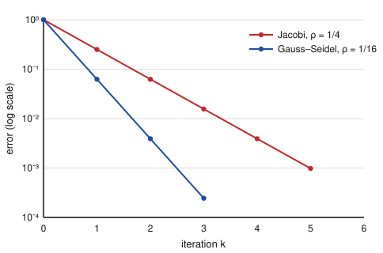

# Numerical Analysis · Lesson 3.4: Iterative Methods

> ⏱ ~15 min · Module 3: Numerical Linear Algebra · Builds on: [Lesson 1.4](01-04-bisection-fixed-point.md) (fixed-point iteration), [Lesson 3.1](03-01-lu-pivoting.md) (LU & pivoting) · Unlocks: [Lesson 3.5](03-05-power-method.md) (power method)

## Why this matters

Discretize a PDE — the temperature in a metal plate, the pressure in a reservoir, the electric potential in a chip — and you land on a linear system $Ax=b$ where $A$ has a million rows but only a handful of nonzeros per row (each grid point talks only to its neighbors). Factoring that $A$ with LU ([Lesson 3.1](03-01-lu-pivoting.md)) costs $O(n^3)$ operations and, worse, **fill-in**: the zeros between neighbors get clobbered into nonzeros, so the factors $L$ and $U$ are dense and won't even fit in memory. Iterative methods dodge both. They never form a factorization — they only multiply $A$ by a vector, cheap when $A$ is sparse — and they sneak up on $x$ by repeated correction, exactly the fixed-point game from [Lesson 1.4](01-04-bisection-fixed-point.md), now played in $\mathbb{R}^n$.

## The idea

Rewrite $Ax=b$ as a rule that turns a guess into a better guess. Split the matrix into an **easy part $M$** (one you can solve against instantly) and a **leftover $N$**, so that $A=M-N$. Then

$$Ax=b \iff (M-N)x=b \iff Mx = Nx+b \iff x = M^{-1}(Nx+b).$$

That last line begs to be iterated: plug in your current guess $x_k$ on the right, solve for $x_{k+1}$ on the left,

$$x_{k+1} = M^{-1}(N x_k + b).$$

This is fixed-point iteration $x_{k+1}=g(x_k)$ with $g(x)=M^{-1}(Nx+b)$ — and the true solution $x^{*}$ is its fixed point. In [Lesson 1.4](01-04-bisection-fixed-point.md) a scalar iteration converged when the map was a contraction, $|g'(x^{*})|<1$. The same story runs here, with the derivative replaced by the **iteration matrix** $M^{-1}N$: the iteration contracts when that matrix shrinks vectors, and the honest measure of "shrinks" is its spectral radius.

The two workhorse splittings differ only in how much of $A$ you dump into the easy part $M$:

- **Jacobi** — $M$ is just the diagonal of $A$. Cheapest possible solve (divide by the diagonal entry), and every component of $x_{k+1}$ uses only *old* values.
- **Gauss–Seidel** — $M$ is the whole lower triangle of $A$. Solving against it is a forward substitution, and because you sweep top-to-bottom you can feed each freshly-computed component straight into the next equation. Using updated numbers the instant you have them usually converges about twice as fast for free.

## The formal version

Split $A = D - L - U$, where $D$ is the diagonal of $A$, $-L$ is its strictly lower-triangular part, and $-U$ its strictly upper-triangular part (the minus signs are a bookkeeping convention so $L,U$ hold positive-looking entries).

**Jacobi.** Take $M=D$, $N=L+U$. Component-by-component,

$$x_i^{(k+1)} = \frac{1}{a_{ii}}\Big(b_i - \sum_{j\neq i} a_{ij}\,x_j^{(k)}\Big).$$

*In words:* solve equation $i$ for $x_i$, using last iteration's values everywhere else.

**Gauss–Seidel.** Take $M=D-L$, $N=U$. Component-by-component,

$$x_i^{(k+1)} = \frac{1}{a_{ii}}\Big(b_i - \sum_{j<i} a_{ij}\,x_j^{(k+1)} - \sum_{j>i} a_{ij}\,x_j^{(k)}\Big).$$

*In words:* same, but the components you already updated this sweep ($j<i$) are used at their new values.

**Convergence.** Let $T=M^{-1}N$ be the iteration matrix and $e_k = x_k - x^{*}$ the error. Subtracting $x^{*}=Tx^{*}+M^{-1}b$ from $x_{k+1}=Tx_k+M^{-1}b$ gives the clean recurrence

$$e_{k+1} = T\,e_k, \qquad\text{so}\qquad e_k = T^{k} e_0.$$

The iteration converges to $x^{*}$ for **every** starting guess if and only if the **spectral radius** — the largest eigenvalue magnitude — satisfies

$$\rho(T) = \max_i |\lambda_i(T)| < 1,$$

and then the error shrinks by roughly a factor of $\rho(T)$ per step: $\lVert e_k\rVert \sim \rho(T)^k \lVert e_0\rVert$.

*In words:* eigenvalues of the iteration matrix inside the unit circle mean the error dies; the one closest to the circle sets the speed. It is the exact matrix analogue of the scalar $|g'(x^{*})|<1$.

**A sufficient condition you can check by eye.** If $A$ is **strictly diagonally dominant** — each diagonal entry dominates its own row,

$$|a_{ii}| > \sum_{j\neq i} |a_{ij}| \quad\text{for every } i,$$

then *both* Jacobi and Gauss–Seidel converge, no eigenvalue computation required. (It's sufficient, not necessary: plenty of non-dominant matrices still converge — you just have to check $\rho(T)$ to know.)

## Picture

Both methods below are run on the same strictly-diagonally-dominant system (worked out in full under *Concrete instance*). The vertical axis is the error on a log scale, so a **constant per-step shrink factor $\rho$ shows up as a straight line** — and the steeper the line, the faster the method.

Jacobi loses one factor of $4$ per step ($\rho=\tfrac14$); Gauss–Seidel loses a factor of $16$ ($\rho=\tfrac{1}{16}=\rho_{\text{Jac}}^2$), so its line is exactly twice as steep — one Gauss–Seidel step is worth two Jacobi steps here. That "square the spectral radius" bonus is special to nice symmetric systems, but Gauss–Seidel beating Jacobi is the usual state of affairs.

## Concrete instance

Solve

$$A = \begin{pmatrix} 4 & -1 \\ -1 & 4 \end{pmatrix},\qquad b = \begin{pmatrix} 3 \\ 3 \end{pmatrix}, \qquad\text{true solution } x^{*}=\begin{pmatrix}1\\1\end{pmatrix}.$$

$A$ is strictly diagonally dominant ($4>1$ in each row), so both methods are guaranteed to converge. Start from $x_0=(0,0)$.

**Jacobi** solves each equation for its own variable using only old values:

$$x_1^{(k+1)} = \tfrac14\big(3 + x_2^{(k)}\big), \qquad x_2^{(k+1)} = \tfrac14\big(3 + x_1^{(k)}\big).$$

| $k$ | $x_1^{(k)}$ | $x_2^{(k)}$ | error $\lVert x_k-x^{*}\rVert_\infty$ |
|---|---|---|---|
| 0 | 0        | 0        | 1        |
| 1 | 0.75     | 0.75     | 0.25     |
| 2 | 0.9375   | 0.9375   | 0.0625   |
| 3 | 0.984375 | 0.984375 | 0.015625 |

The error is divided by exactly $4$ each step — that factor **is** $\rho(T_{\text{Jac}})$.

**Gauss–Seidel** reuses the freshly updated $x_1$ inside the $x_2$ equation:

$$x_1^{(k+1)} = \tfrac14\big(3 + x_2^{(k)}\big), \qquad x_2^{(k+1)} = \tfrac14\big(3 + x_1^{(k+1)}\big).$$

| $k$ | $x_1^{(k)}$ | $x_2^{(k)}$ | error $\lVert x_k-x^{*}\rVert_\infty$ |
|---|---|---|---|
| 0 | 0          | 0          | 1          |
| 1 | 0.75       | 0.9375     | 0.25       |
| 2 | 0.984375   | 0.99609375 | 0.015625   |
| 3 | 0.99902344 | 0.99975586 | 0.00097656 |

Now the error is divided by $16$ per full sweep (watch the $x_2$ column: $0.0625 \to 0.00390625 \to 0.000244$, ratio $\tfrac{1}{16}$). Gauss–Seidel reaches after $2$ sweeps what Jacobi needs $4$ sweeps to match.

## Worked examples

**Example 1 (build the iteration matrices, read off the rate).** For the system above, $D=\begin{pmatrix}4&0\\0&4\end{pmatrix}$ and the off-diagonal split gives $L+U = \begin{pmatrix}0&1\\1&0\end{pmatrix}$.

*Jacobi:* $T_{\text{Jac}} = D^{-1}(L+U) = \tfrac14\begin{pmatrix}0&1\\1&0\end{pmatrix}$. The eigenvalues of $\begin{pmatrix}0&1\\1&0\end{pmatrix}$ are $\pm 1$, so $\lambda(T_{\text{Jac}})=\pm\tfrac14$ and

$$\rho(T_{\text{Jac}}) = \tfrac14 < 1.\ \checkmark$$

*Gauss–Seidel:* $M=D-L=\begin{pmatrix}4&0\\-1&4\end{pmatrix}$, $N=U=\begin{pmatrix}0&1\\0&0\end{pmatrix}$. Since $\det M = 16$, $M^{-1}=\tfrac{1}{16}\begin{pmatrix}4&0\\1&4\end{pmatrix}$, so

$$T_{\text{GS}} = M^{-1}N = \tfrac{1}{16}\begin{pmatrix}4&0\\1&4\end{pmatrix}\begin{pmatrix}0&1\\0&0\end{pmatrix} = \begin{pmatrix}0 & \tfrac14\\[2pt] 0 & \tfrac{1}{16}\end{pmatrix}.$$

This is upper-triangular, so its eigenvalues sit on the diagonal: $0$ and $\tfrac{1}{16}$. Hence $\rho(T_{\text{GS}})=\tfrac{1}{16}=\rho(T_{\text{Jac}})^2$ — the numerical fact behind the twice-as-steep line in the *Picture*.

**Example 2 (why sparsity is the whole point).** Suppose $A$ comes from a 2-D grid with $n=10^6$ unknowns and $5$ nonzeros per row. One Jacobi or Gauss–Seidel sweep costs one matrix–vector product plus $n$ divisions: about $5n = 5\times 10^6$ multiply-adds — a few milliseconds. To reach $10^{-6}$ accuracy at $\rho=0.9$ (typical for such grids) you need $k$ with $0.9^{k}\le 10^{-6}$, i.e. $k \ge \tfrac{6}{\log_{10}(1/0.9)} \approx 131$ sweeps: total work $\approx 131\times 5n \approx 6.5\times 10^8$ operations. Compare a dense LU at $\tfrac23 n^3 \approx 6.7\times 10^{17}$ operations — **nine orders of magnitude** more, and that's before fill-in exhausts your RAM. That gulf is why every large-scale PDE solver iterates. (Real solvers accelerate the $\rho=0.9$ crawl with multigrid or conjugate gradients, but the cost-per-step accounting is the same.)

## Watch out

- **You might think** more of $A$ in $M$ always means faster convergence — **but** it's the spectral radius of $M^{-1}N$, not the "size" of $M$, that rules. Gauss–Seidel usually beats Jacobi, yet there are matrices where Jacobi converges and Gauss–Seidel diverges. Only $\rho(T)<1$ is decisive.
- **You might think** strict diagonal dominance is *required* for convergence — **but** it's only sufficient. A matrix can fail dominance and still have $\rho(T)<1$. What you must never do is skip the check entirely: if $\rho(T)\ge 1$ the iterates blow up no matter how good the initial guess (see P3).
- **You might think** the residual $b-Ax_k$ being small means the error $x_k-x^{*}$ is small — **but** for an ill-conditioned $A$ they can differ by a factor of $\kappa(A)$ (the lesson from [Lesson 3.2](03-02-cholesky-conditioning.md)). Use the residual as a cheap stopping proxy, but remember conditioning can make it optimistic.

## One-liner

> Split $A=M-N$, iterate $x_{k+1}=M^{-1}(Nx_k+b)$, and it converges exactly when the iteration matrix $M^{-1}N$ has spectral radius below one — fixed-point iteration wearing a matrix.

## Problems

**P1 (🟢)** For

$$A=\begin{pmatrix}3&1\\1&2\end{pmatrix},\qquad b=\begin{pmatrix}5\\5\end{pmatrix}\quad(\text{true } x^{*}=(1,2)),$$

start at $x_0=(0,0)$ and compute two full steps of (a) Jacobi and (b) Gauss–Seidel. Which guess is closer to $x^{*}$ after two steps?

**P2 (🟡)** For the same $A$ as P1, write down the Jacobi iteration matrix $T_{\text{Jac}}=D^{-1}(L+U)$ and compute its spectral radius $\rho(T_{\text{Jac}})$. Does the theory promise convergence, and is $A$ strictly diagonally dominant?

**P3 (🔴, optional)** Let

$$A=\begin{pmatrix}1&2\\2&1\end{pmatrix},\qquad b=\begin{pmatrix}3\\3\end{pmatrix}\quad(\text{true } x^{*}=(1,1)).$$

$A$ is invertible ($\det=-3$), so the system has a unique solution. Form the Jacobi iteration matrix and its spectral radius, then run two Jacobi steps from $x_0=(0,0)$ to confirm the iterates move *away* from $x^{*}$. What went wrong, and how does $\rho$ predict it exactly?

Solutions

**P1** The equations give $x_1 = \tfrac{5-x_2}{3}$ and $x_2 = \tfrac{5-x_1}{2}$.

*(a) Jacobi* (both from old values):
- Step 1: $x_1 = \tfrac{5-0}{3}=1.6667,\ x_2=\tfrac{5-0}{2}=2.5$.
- Step 2: $x_1=\tfrac{5-2.5}{3}=0.8333,\ x_2=\tfrac{5-1.6667}{2}=1.6667$.
- After two steps: $(0.8333,\,1.6667)$, error $\lVert\cdot\rVert_\infty = 0.3333$.

*(b) Gauss–Seidel* (reuse updated $x_1$):
- Step 1: $x_1=\tfrac{5-0}{3}=1.6667,\ x_2=\tfrac{5-1.6667}{2}=1.6667$.
- Step 2: $x_1=\tfrac{5-1.6667}{3}=1.1111,\ x_2=\tfrac{5-1.1111}{2}=1.9444$.
- After two steps: $(1.1111,\,1.9444)$, error $\lVert\cdot\rVert_\infty = 0.1111$.

Gauss–Seidel is closer — its error $0.1111$ beats Jacobi's $0.3333$, as expected.

**P2** $D=\begin{pmatrix}3&0\\0&2\end{pmatrix}$, and $N=D-A=\begin{pmatrix}0&-1\\-1&0\end{pmatrix}$, so

$$T_{\text{Jac}}=D^{-1}N=\begin{pmatrix}0 & -\tfrac13\\[2pt] -\tfrac12 & 0\end{pmatrix}.$$

Its characteristic equation is $\lambda^2 - (\operatorname{tr}T)\lambda + \det T = \lambda^2 + \big(0 - \tfrac13\cdot\tfrac12\big)=\lambda^2-\tfrac16=0$, so $\lambda=\pm\tfrac{1}{\sqrt6}$ and

$$\rho(T_{\text{Jac}})=\tfrac{1}{\sqrt6}\approx 0.408 < 1.$$

Convergence is guaranteed. And $A$ is strictly diagonally dominant ($3>1$ and $2>1$), which is a second, independent guarantee — consistent with what we found.

**P3** $D=I$, so $N=D-A=\begin{pmatrix}0&-2\\-2&0\end{pmatrix}$ and $T_{\text{Jac}}=\begin{pmatrix}0&-2\\-2&0\end{pmatrix}$. Eigenvalues are $\pm 2$, so

$$\rho(T_{\text{Jac}})=2 > 1.$$

Iterating $x_1=3-2x_2,\ x_2=3-2x_1$ from $(0,0)$:
- Step 1: $x_1=3,\ x_2=3$ — error $\lVert(3,3)-(1,1)\rVert_\infty = 2$.
- Step 2: $x_1=3-6=-3,\ x_2=3-6=-3$ — error $\lVert(-3,-3)-(1,1)\rVert_\infty = 4$.

The error doubles every step: $1 \to 2 \to 4$, exactly the factor $\rho=2$. What went wrong: $A$ is *not* diagonally dominant ($|1|<|2|$ in each row), the off-diagonal coupling overpowers the diagonal, and $\rho(T)>1$ makes $e_k=T^k e_0$ grow without bound regardless of the starting guess. The spectral radius doesn't just diagnose divergence — it pins down its rate.

## Flashback

**From [Lesson 1.4](01-04-bisection-fixed-point.md) (fixed-point iteration):** Consider the scalar iteration $x_{k+1}=g(x_k)$ with

$$g(x)=\frac{x^2+6}{5}.$$

(a) Find both fixed points. (b) Using the convergence test $|g'(x^{*})|<1$, classify each as attracting or repelling. (c) One step from $x_0=1$: which fixed point is the iteration heading for?

Solution

(a) Fixed points solve $x=\tfrac{x^2+6}{5}$, i.e. $x^2-5x+6=0=(x-2)(x-3)$, giving $x^{*}=2$ and $x^{*}=3$.

(b) $g'(x)=\tfrac{2x}{5}$. At $x^{*}=2$: $|g'(2)|=\tfrac45=0.8<1$ — **attracting**. At $x^{*}=3$: $|g'(3)|=\tfrac65=1.2>1$ — **repelling**.

(c) $x_1=g(1)=\tfrac{1+6}{5}=1.4$, moving toward $2$; the iteration converges to the attracting fixed point $x^{*}=2$ (and would only find $3$ if started exactly there). Note the parallel to this lesson: the scalar test $|g'(x^{*})|<1$ is precisely $\rho(M^{-1}N)<1$ in one dimension — the derivative *is* the $1\times 1$ iteration matrix.

## Connections

- **Backward:** this is [Lesson 1.4](01-04-bisection-fixed-point.md)'s fixed-point iteration lifted to $\mathbb{R}^n$ — the scalar contraction test $|g'(x^{*})|<1$ becomes $\rho(M^{-1}N)<1$. It's the alternative to the direct LU/Cholesky factorizations of [Lessons 3.1–3.2](03-01-lu-pivoting.md), chosen precisely when factorization's $O(n^3)$ cost and fill-in are unaffordable.
- **Forward:** [Lesson 3.5](03-05-power-method.md) is another "multiply-and-repeat" method whose speed is governed by an eigenvalue *ratio* — the same spectral-radius reasoning, now aimed at finding eigenvalues instead of solving systems.
- **Sideways (PDEs):** the giant sparse systems that make iteration mandatory are exactly the ones from discretizing PDEs; the finite-difference Laplacian you'll meet in [Lesson 5.3](05-03-finite-differences-bvp.md) and the heat equation in [Lesson 5.4](05-04-heat-equation-explicit-implicit.md) are the archetypal $Ax=b$ here, and the full PDE-numerics/FEM story lives in the [pdes](../../pdes/syllabus.md) course.
