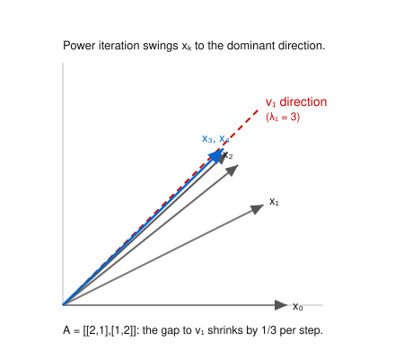

# Numerical Analysis · Lesson 3.5: Power Method for Eigenvalues

> ⏱ ~15 min · Module 3: Numerical Linear Algebra · Builds on: [3.4 Iterative Methods](03-04-iterative-methods.md) (spectral radius), eigenvalues from [linalg-refresher](../../linalg-refresher/syllabus.md) · Unlocks: [4.1 Euler's Method](04-01-euler-local-global-error.md); eigenvalues govern ODE stability in [4.4](04-04-absolute-stability-stiffness.md)

## Why this matters

For a big matrix you almost never want *all* the eigenvalues — you want the **dominant** one and its eigenvector. It's the growth rate of a dynamical system, the resonant mode of a structure, the stationary distribution of a Markov chain (Google's PageRank is one power iteration on the web's link matrix). Full eigen-solvers cost $O(n^3)$ and need the whole matrix in memory; the power method needs only the ability to compute $Av$, so it runs on matrices too large or too sparse to factor. And it comes with a clean error story: it converges *linearly*, at a rate you can read straight off the spectrum.

## The idea

You already met the mechanism in [Lesson 3.4](03-04-iterative-methods.md): multiply by a matrix over and over and the direction that grows fastest takes over. Spectral radius told you *whether* an iteration blows up; here we *harvest* that runaway growth.

Take any starting vector and write it as a blend of the eigenvectors. Each time you multiply by $A$, every eigenvector component gets rescaled by its own eigenvalue. The component belonging to the largest-magnitude eigenvalue gets stretched the most, so after enough multiplications the blend is almost pure dominant eigenvector — everything else has been left behind. To stop the vector from overflowing (or collapsing to zero), you renormalize after each step. That's the whole algorithm: **multiply, normalize, repeat**, and watch the direction settle down.

Once the direction has settled, reading off the eigenvalue is easy: if $x$ is nearly an eigenvector, $Ax \approx \lambda x$, so $\lambda$ is whatever number best explains "$Ax$ looks like a scaled copy of $x$." That best number is the **Rayleigh quotient**.

## The formal version

**Power iteration.** Given $A \in \mathbb{R}^{n\times n}$ and a starting vector $x_0$ (with a nonzero dominant-eigenvector component), iterate
$$x_{k+1} = \frac{A x_k}{\lVert A x_k\rVert}.$$

*In words:* apply $A$, then rescale back to unit length so only the *direction* evolves.

**Rayleigh quotient.** For the current iterate $x$, estimate the eigenvalue by
$$\lambda \approx \rho(x) = \frac{x^\top A x}{x^\top x}.$$

*In words:* the Rayleigh quotient is the scalar $\lambda$ that makes $Ax$ closest to $\lambda x$ — a least-squares fit of "$A$ acts like multiply-by-$\lambda$" along $x$. (If $x$ is already unit length the denominator is $1$.)

**Why it works.** Order the eigenvalues $|\lambda_1| > |\lambda_2| \ge \dots \ge |\lambda_n|$ with eigenvectors $v_1,\dots,v_n$, and expand the start in that basis, $x_0 = \sum_{i} c_i v_i$ with $c_1 \neq 0$. Since $A^k v_i = \lambda_i^k v_i$,
$$A^k x_0 = \sum_{i} c_i \lambda_i^k v_i = \lambda_1^k\Big( c_1 v_1 + \sum_{i\ge 2} c_i \big(\tfrac{\lambda_i}{\lambda_1}\big)^k v_i \Big).$$

*In words:* factor out the biggest growth $\lambda_1^k$; every other term carries a factor $(\lambda_i/\lambda_1)^k$ that decays to zero. So the bracket $\to c_1 v_1$, and after normalizing, $x_k \to v_1$.

**Convergence rate.** The slowest-dying leftover is the $i=2$ term, so the direction error shrinks **linearly** with ratio
$$r = \left|\frac{\lambda_2}{\lambda_1}\right| \quad(<1).$$

*In words:* each step multiplies the distance-to-$v_1$ by $|\lambda_2/\lambda_1|$. Two consequences: convergence is **slow when the top two eigenvalues are close** ($r\to 1$), and the method **fails outright when $|\lambda_1| = |\lambda_2|$** (e.g. eigenvalues $\pm\lambda$, or a complex-conjugate pair) — there is no single dominant direction, and the iterate oscillates instead of settling.

**Bonus for symmetric $A$.** When $A=A^\top$ the eigenvectors are orthogonal and the Rayleigh quotient is *stationary* at each eigenvector, so its error is the **square** of the eigenvector error: the eigenvalue estimate converges at rate $r^2 = |\lambda_2/\lambda_1|^2$, much faster than the eigenvector itself.

**Getting the other eigenvalues.**
- **Deflation:** once you have $(\lambda_1, v_1)$ with $v_1$ a unit vector, run the power method on $A' = A - \lambda_1 v_1 v_1^\top$ (symmetric case). This keeps every other eigenpair but drops $\lambda_1$ to $0$, so *its* dominant eigenvalue is $\lambda_2$.
- **Inverse iteration / shifts:** the eigenvalues of $(A-\mu I)^{-1}$ are $1/(\lambda_i-\mu)$, largest for the $\lambda_i$ *closest to the shift* $\mu$. Running power iteration on $(A-\mu I)^{-1}$ (solve $(A-\mu I)y = x_k$ each step instead of multiplying) therefore homes in on the eigenvalue nearest $\mu$ — the key to targeting any eigenvalue you like, not just the biggest.

## Picture

Start on the $x$-axis and repeatedly apply $A=\begin{pmatrix}2&1\\1&2\end{pmatrix}$ (spectrum $\lambda_1=3$, $\lambda_2=1$, eigenvectors $(1,1)$ and $(1,-1)$). Each iterate $x_k$ swings closer to the $45^\circ$ line $v_1$, and the *remaining* angle shrinks by $|\lambda_2/\lambda_1| = 1/3$ every step — so $x_3$ and $x_4$ are already visually on top of the eigendirection.

## Worked examples

**Example 1 (mechanical — one full trace).** Run power iteration on $A=\begin{pmatrix}2&1\\1&2\end{pmatrix}$ from $x_0=(1,0)^\top$. Because the Rayleigh quotient is scale-invariant ($\rho(cx)=\rho(x)$), we can iterate the *unnormalized* $y_k = A^k x_0$ and read $\rho$ off it — normalization only matters for overflow control on a computer.

| $k$ | $y_k = A y_{k-1}$ | direction | $\rho_k = \dfrac{y_k^\top A y_k}{y_k^\top y_k}$ | error $\rho_k-3$ |
|---|---|---|---|---|
| 0 | $(1,\ 0)$   | $1{:}0$    | $2$        | $-1$ |
| 1 | $(2,\ 1)$   | $2{:}1$    | $2.8$      | $-0.2$ |
| 2 | $(5,\ 4)$   | $5{:}4$    | $2.9756$   | $-0.02439$ |
| 3 | $(14,\ 13)$ | $14{:}13$  | $2.99726$  | $-0.002740$ |
| 4 | $(41,\ 40)$ | $41{:}40$  | $2.999695$ | $-0.0003048$ |

The direction marches $1{:}0 \to 2{:}1 \to 5{:}4 \to 14{:}13 \to 41{:}40 \to \dots \to 1{:}1 = v_1$. ✓ For the eigenvalue, a clean closed form drops out (with $c_1=c_2=\tfrac12$, $\lVert v_i\rVert^2=2$):
$$\rho_k = \frac{3\cdot 9^k + 1}{9^k + 1}, \qquad \rho_k - 3 = \frac{-2}{9^k+1}.$$
The error ratios are $\tfrac{-0.2}{-1}=0.2$, $\tfrac{-0.02439}{-0.2}=0.122$, $\tfrac{-0.00274}{-0.02439}=0.112$, $\to \tfrac19$. That limiting factor is exactly $|\lambda_2/\lambda_1|^2 = (1/3)^2$ — the *squared* rate, the symmetric-matrix bonus in action. (The eigen*vector* direction, meanwhile, converges at the plain rate $1/3$: the "$40$ vs $41$" gap of one part in $\sim 3^k$.)

**Example 2 (why you'd care — deflation for the second eigenvalue).** You now have $\lambda_1=3$ and unit eigenvector $\hat v_1 = \tfrac{1}{\sqrt2}(1,1)^\top$. Deflate:
$$A' = A - \lambda_1 \hat v_1 \hat v_1^\top = \begin{pmatrix}2&1\\1&2\end{pmatrix} - 3\cdot\tfrac12\begin{pmatrix}1&1\\1&1\end{pmatrix} = \begin{pmatrix}0.5 & -0.5\\ -0.5 & 0.5\end{pmatrix}.$$
Its eigenvalues are $0$ (along $v_1$, killed as designed) and $1$ (along $v_2=(1,-1)$). A power iteration on $A'$ now converges instantly to $\lambda_2 = 1$ with eigenvector $v_2$ — we've peeled off the top of the spectrum and exposed the next layer, without ever forming a full eigen-decomposition.

## Watch out

- **You might think** the power method finds *an* eigenvalue you can steer toward — **but** unadorned, it only ever finds the one of *largest magnitude*. Want the smallest? Run it on $A^{-1}$ (inverse iteration). Want one in the middle near $\mu$? Shift-and-invert with $(A-\mu I)^{-1}$.
- **You might think** convergence is fast like Newton's quadratic root-finding — **but** it's merely *linear*, rate $|\lambda_2/\lambda_1|$. Two eigenvalues within 1% of each other ($r\approx0.99$) need hundreds of iterations per digit. And if the two largest are equal in magnitude ($|\lambda_1|=|\lambda_2|$), the iterate never settles — it oscillates or rotates forever.
- **You might think** a good eigenvalue estimate means a good eigenvector — **but** for symmetric $A$ the Rayleigh quotient is quadratically accurate ($\sim r^{2k}$) while the eigenvector lags at $r^{k}$. Judge convergence by how much the *direction* is still moving, not by how stable $\rho_k$ looks.

## One-liner

> Multiply by $A$ over and over and the biggest-eigenvalue direction wins; the leftover error dies by $|\lambda_2/\lambda_1|$ each step, and the Rayleigh quotient reads off the eigenvalue.

## Problems

**P1 (🟢)** Let $A=\begin{pmatrix}3&1\\1&3\end{pmatrix}$ (eigenvalues $4$ and $2$; eigenvectors $(1,1)$ and $(1,-1)$). Starting from $x_0=(1,0)^\top$, carry the *unnormalized* iterate $y_k=A^k x_0$ for $k=0,1,2$, record the direction, and compute the Rayleigh quotient $\rho_k$ at each step. What is the predicted asymptotic error ratio, and is your data consistent with it?

**P2 (🟡)** A symmetric matrix has eigenvalues $\lambda_1 = 5$ and $\lambda_2 = 4.9$ (rest much smaller). (a) Roughly how many power-method iterations reduce the *eigenvector* direction error by a factor of $10$? (b) A colleague's matrix instead has eigenvalues $+5$ and $-5$. What does the power method do, and why?

**P3 (🔴, optional)** For $A=\begin{pmatrix}3&1\\1&3\end{pmatrix}$ from P1, you found the dominant pair $\lambda_1=4$, $\hat v_1=\tfrac1{\sqrt2}(1,1)^\top$. Form the deflated matrix $A'=A-\lambda_1\hat v_1\hat v_1^\top$ and find its eigenvalues, confirming deflation exposes $\lambda_2$. Then: to instead find the *smallest*-magnitude eigenvalue of $A$ directly, what matrix would you run the power method on, and what eigenvalue would it converge to?

Solutions

**P1** Iterate $y_k=Ay_{k-1}$ with $A=\begin{pmatrix}3&1\\1&3\end{pmatrix}$:

- $y_0=(1,0)$. $\rho_0=\dfrac{y_0^\top A y_0}{y_0^\top y_0}=\dfrac{(1,0)\cdot(3,1)}{1}=3$.
- $y_1=Ay_0=(3,1)$, direction $3{:}1$. $Ay_1=(10,6)$, so $\rho_1=\dfrac{(3,1)\cdot(10,6)}{(3,1)\cdot(3,1)}=\dfrac{36}{10}=3.6$.
- $y_2=Ay_1=(10,6)$, direction $10{:}6=5{:}3$. $Ay_2=(36,28)$, so $\rho_2=\dfrac{(10,6)\cdot(36,28)}{(10,6)\cdot(10,6)}=\dfrac{360+168}{136}=\dfrac{528}{136}=3.882$.

Direction $1{:}0\to3{:}1\to5{:}3\to\dots\to1{:}1=v_1$. ✓ Errors from $\lambda_1=4$: $-1,\ -0.4,\ -0.118$, with ratios $0.4$ then $0.294$. Predicted asymptotic ratio (symmetric $A$) is $|\lambda_2/\lambda_1|^2=(2/4)^2=1/4=0.25$; the sequence $0.4, 0.294,\dots$ is heading toward $0.25$. ✓ (The eigenvector direction itself converges at the plain rate $1/2$.)

**P2** (a) The direction error scales as $r^k$ with $r=|\lambda_2/\lambda_1|=4.9/5=0.98$. Solve $0.98^k \le 0.1$: $k \ge \dfrac{\ln 0.1}{\ln 0.98}=\dfrac{-2.3026}{-0.02020}\approx 114$. So about **114 iterations per factor of 10** — painfully slow, because the top two eigenvalues are nearly tied. (b) With $\lambda_1=+5,\ \lambda_2=-5$ we have $|\lambda_1|=|\lambda_2|$, so the ratio is $1$ and there is **no convergence**: the two dominant components decay at the same rate, and since one eigenvalue is negative its component *flips sign every step*, so the normalized iterate oscillates between two directions (a blend of $v_1$ and $v_2$) forever. The method has no single dominant direction to find. (A shift — power iteration on $A+\mu I$, moving the spectrum to $5+\mu,\,-5+\mu$ — breaks the tie.)

**P3** With $\hat v_1=\tfrac1{\sqrt2}(1,1)^\top$, $\ \hat v_1\hat v_1^\top=\tfrac12\begin{pmatrix}1&1\\1&1\end{pmatrix}$, so
$$A'=\begin{pmatrix}3&1\\1&3\end{pmatrix}-4\cdot\tfrac12\begin{pmatrix}1&1\\1&1\end{pmatrix}=\begin{pmatrix}1&-1\\-1&1\end{pmatrix}.$$
Eigenvalues of $A'$: trace $=2$, det $=1\cdot1-(-1)(-1)=0$, so $\lambda^2-2\lambda=0\Rightarrow\lambda=0$ or $2$. The $0$ sits along $v_1=(1,1)$ (deflated away), and the dominant eigenvalue of $A'$ is $2=\lambda_2$ with eigenvector $(1,-1)=v_2$. ✓ Deflation exposed the second eigenpair. For the *smallest*-magnitude eigenvalue of $A$: run power iteration on $A^{-1}$ (inverse iteration), i.e. solve $Ay_{k+1}=x_k$ each step. Its dominant eigenvalue is $1/\lambda_{\min}$, so it converges to the eigenvector of $A$'s smallest eigenvalue, here $\lambda=2$ (giving $1/\lambda_{\min}=1/2$ as $A^{-1}$'s dominant eigenvalue).

## Flashback

**From [Lesson 3.4](03-04-iterative-methods.md) (spectral radius of an iteration matrix):** For the system $A\mathbf{x}=\mathbf{b}$ with $A=\begin{pmatrix}4&1\\2&5\end{pmatrix}$, form the Jacobi iteration matrix $T_J=-D^{-1}(A-D)$ and compute its spectral radius $\rho(T_J)$. Does Jacobi converge, and what does $\rho(T_J)$ say about *how fast*?

Solution

Split $A=D+(A-D)$ with $D=\operatorname{diag}(4,5)$ and $A-D=\begin{pmatrix}0&1\\2&0\end{pmatrix}$. Then
$$T_J=-D^{-1}(A-D)=-\begin{pmatrix}\tfrac14&0\\0&\tfrac15\end{pmatrix}\begin{pmatrix}0&1\\2&0\end{pmatrix}=\begin{pmatrix}0&-\tfrac14\\[2pt]-\tfrac25&0\end{pmatrix}.$$
Characteristic polynomial: trace $=0$, $\det=0-(-\tfrac14)(-\tfrac25)=-\tfrac1{10}$, so $\lambda^2-\tfrac1{10}=0\Rightarrow\lambda=\pm\sqrt{1/10}$. Hence $\rho(T_J)=\sqrt{0.1}\approx 0.316<1$, so **Jacobi converges** (consistent with $A$ being strictly diagonally dominant). The error shrinks by about $0.316$ per iteration — roughly one decimal digit every two steps. Note the through-line to today: convergence of an *iterative solver* is governed by the spectral radius of its iteration matrix, exactly the same "largest-magnitude eigenvalue wins" logic that *drives* the power method.

## Connections

- **Backward:** this is [Lesson 3.4](03-04-iterative-methods.md)'s spectral-radius story turned productive — there, $\rho(A)<1$ meant an iteration *dies*; here, repeated multiplication makes the dominant eigen-direction *grow* and we harvest it. Both are the same eigenvalue-expansion argument.
- **Forward:** eigenvalues are about to run Module 4. In [Lesson 4.1](04-01-euler-local-global-error.md) and especially [Lesson 4.4](04-04-absolute-stability-stiffness.md), the eigenvalues of an ODE system's matrix decide whether a time-stepping scheme is stable — a stiff problem is precisely one whose spectrum has widely separated magnitudes, the same $|\lambda_2/\lambda_1|$-type ratio that made the power method slow here.
- **Sideways (data / optimization):** the dominant eigenvector of a covariance matrix is the first principal component, and the ridge-regression conditioning story in [convex-optimization](../../convex-optimization/syllabus.md) turns on the same eigenvalue spread ($\kappa=\lambda_{\max}/\lambda_{\min}$) that governs both convergence speed and sensitivity.
