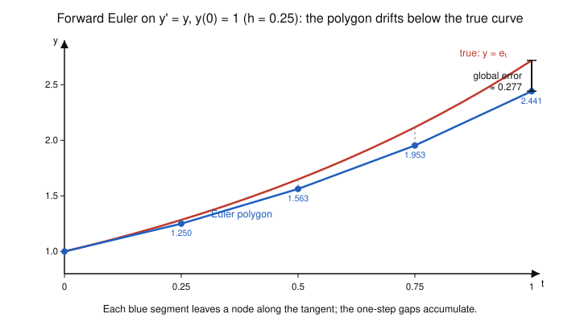

# Numerical Analysis · Lesson 4.1: Euler's Method & Local vs. Global Error

> ⏱ ~15 min · Module 4: Numerical ODEs & Stability · Builds on: [Lesson 2.3](02-03-numerical-differentiation.md) (finite differences & Taylor error) · Unlocks: [4.2 Runge–Kutta](04-02-runge-kutta.md)

## Why this matters

Almost nothing that moves has a closed-form trajectory: a planet's orbit, a heated rod cooling, an epidemic curve, a portfolio under stochastic returns — all are *differential equations you can only march forward numerically*. Euler's method is the crudest such march, and precisely because it is crude it is the cleanest place to learn the one lesson every ODE solver obeys: the error you make in a **single** step and the error that has **piled up** by the end are *different sizes*, and one power of the step size $h$ is the toll you pay for stitching many small steps into a long trajectory. Get this distinction right once and RK4, Adams methods, and stiff solvers all fall into place.

## The idea

You are handed a starting point and, at every point in the plane, an arrow telling you which way the solution is heading — that arrow is the derivative $f(t,y)$. You don't know the curve, but you know its *slope everywhere*. So do the obvious thing: from where you stand, walk a short distance $h$ **straight along the current arrow**, look at the new arrow, and repeat. You are approximating a curve by a chain of short tangent segments — a polygon that hugs the true curve at first and slowly peels away from it.

Two errors live in that picture, and conflating them is the classic beginner's mistake:

- **Local error** — how far one tangent segment lands from the true curve, *starting from a point that is exactly right*. This is small: the tangent is a first-order fit, so it's off by the curvature term, order $h^2$.
- **Global error** — how far the *whole polygon* has drifted by the final time $T$. Here the segments don't start from the true curve; each starts from the (already wrong) previous node, so early mistakes are carried forward and can be amplified by the dynamics.

The headline: you take about $T/h$ steps, each contributing an $O(h^2)$ local error, and $\tfrac{T}{h}\cdot O(h^2)=O(h)$. **One power of $h$ is lost to accumulation.** Euler's per-step error is second order, but its trajectory error is only first order.

## The formal version

**The initial-value problem (IVP).** Find $y(t)$ on $[t_0,T]$ satisfying
$$y'(t)=f(t,y(t)),\qquad y(t_0)=y_0.$$
Here $f$ is a known slope field and $y_0$ the known starting value. *In words:* you're told the velocity as a function of where and when you are, plus your starting position, and asked for the path.

**Forward (explicit) Euler.** Fix a step $h>0$, set $t_n=t_0+nh$, and let $y_n$ denote the numerical approximation to $y(t_n)$. Then
$$\boxed{\,y_{n+1}=y_n+h\,f(t_n,y_n).\,}$$
*In words:* the next value is the current value plus one step-length along the current slope — take a step along the tangent. It's **explicit** because the right-hand side uses only quantities you already have.

**Local truncation error (LTE).** Feed the method the *exact* solution and measure the one-step residual:
$$\tau_{n}=y(t_{n+1})-\big[y(t_n)+h\,f\big(t_n,y(t_n)\big)\big].$$
Taylor-expand the true solution about $t_n$ (using $y'=f$):
$$y(t_{n+1})=y(t_n)+h\,y'(t_n)+\tfrac{h^2}{2}y''(\xi_n)=y(t_n)+h\,f\big(t_n,y(t_n)\big)+\tfrac{h^2}{2}y''(\xi_n)$$
for some $\xi_n\in(t_n,t_{n+1})$, so the bracketed Euler step cancels the first two terms and
$$\tau_n=\tfrac{h^2}{2}\,y''(\xi_n)=O(h^2).$$
*In words:* if you started a step exactly on the curve, Euler would land a curvature-sized $O(h^2)$ off — the leftover Taylor remainder.

**Global (accumulated) error.** Let $e_n=y(t_n)-y_n$ be the true error at step $n$. Reaching a fixed time $T$ takes $N=(T-t_0)/h$ steps. Heuristically the $N$ local errors add:
$$|e_N|\;\lesssim\;N\cdot\max_n|\tau_n|\;=\;\frac{T-t_0}{h}\cdot O(h^2)\;=\;O(h).$$
The rigorous statement adds one honest wrinkle — error already present is amplified as it propagates. If $f$ is Lipschitz in $y$ with constant $L$ (i.e. $|f(t,u)-f(t,v)|\le L|u-v|$) and $M=\max|y''|$, then
$$|e_N|\;\le\;\frac{hM}{2L}\big(e^{L(T-t_0)}-1\big)=O(h).$$
*In words:* the global error is bounded by (step size) × (a constant that depends on how curved the solution is and how strongly nearby trajectories spread apart). Either way it is **linear in $h$**.

**Order of a method.** A one-step method has **order $p$** if its global error is $O(h^p)$; equivalently its local error is $O(h^{p+1})$ (you lose one power to accumulation). **Forward Euler is first order, $p=1$.** The practical fingerprint of order 1: *halve $h$ and you roughly halve the error.* An order-2 method would quarter it, order-4 would cut it by 16 — the payoff Lesson 4.2 buys.

**Backward (implicit) Euler — a one-line preview.** Evaluate the slope at the *arrival* point instead of the departure point:
$$y_{n+1}=y_n+h\,f(t_{n+1},y_{n+1}).$$
Now $y_{n+1}$ appears on both sides, so each step requires *solving an equation* (algebraic if $f$ is nonlinear). It's still only first order, so accuracy-wise it's no upgrade — but its **stability** is dramatically better, and that, not accuracy, is what saves you on stiff problems in [Lesson 4.4](04-04-absolute-stability-stiffness.md).

## Picture

The blue polygon is Euler with $h=0.25$ on $y'=y,\ y(0)=1$ (whose true solution is $e^t$, in red). Each blue segment leaves its node *along the tangent* — slope $=f=y$ at that node — and because $e^t$ is convex, every tangent undershoots. The dashed stubs are the one-step gaps; they are small, but they never get repaid, so they stack into the sizeable global gap $\approx 0.277$ at $t=1$.

## Worked examples

**Example 1 (mechanical — a few steps, $f$ depending on both $t$ and $y$).** Solve $y'=t+y,\ y(0)=1$ with $h=0.5$ up to $t=1$. The recurrence is $y_{n+1}=y_n+0.5\,(t_n+y_n)$.

| $n$ | $t_n$ | $y_n$ | $f(t_n,y_n)=t_n+y_n$ | $y_{n+1}=y_n+0.5f$ |
|---|---|---|---|---|
| 0 | 0.0 | 1.000 | $0+1=1.0$ | $1.000+0.5(1.0)=1.500$ |
| 1 | 0.5 | 1.500 | $0.5+1.5=2.0$ | $1.500+0.5(2.0)=2.500$ |
| 2 | 1.0 | 2.500 | — | — |

So Euler gives $y(1)\approx 2.500$. The exact solution is $y=2e^{t}-t-1$ (check: $y'=2e^t-1=(2e^t-t-1)+t=y+t$ ✓, and $y(0)=2-1=1$ ✓), so $y(1)=2e-2\approx 3.437$. The error is a hefty $0.937$ — no surprise with such a fat step. Shrinking $h$ is what tames it, which is Example 2.

**Example 2 (why you'd care — watching first order in action).** Take the figure's problem $y'=y,\ y(0)=1$, exact $y(1)=e=2.718282$. Here Euler simplifies beautifully: $y_{n+1}=y_n+hy_n=(1+h)y_n$, so after $N=1/h$ steps $y_N=(1+h)^{1/h}$. Refine $h$ and record the error at $t=1$:

| $h$ | steps $N$ | $y_N=(1+h)^{1/h}$ | error $e-y_N$ | ratio to previous |
|---|---|---|---|---|
| 1/2  | 2  | 2.250000 | 0.468282 | — |
| 1/4  | 4  | 2.441406 | 0.276876 | 1.69 |
| 1/8  | 8  | 2.565785 | 0.152497 | 1.82 |
| 1/16 | 16 | 2.637928 | 0.080354 | 1.90 |

Every time $h$ halves, the error-ratio marches toward **2** — the signature of a first-order method. It isn't exactly 2 at these coarse steps because the leading $O(h)$ term still carries an $O(h^2)$ passenger; Problem 2 pins the constant down and shows the ratio $\to 2$ as $h\to0$. Extrapolating, to get one more correct decimal digit you'd need about $10\times$ as many steps — expensive, and exactly why nobody uses Euler for real work.

## Watch out

- **You might think** local error $O(h^2)$ means the answer at the end is $O(h^2)$ — **but** you take $\sim T/h$ steps, and $\tfrac{T}{h}\cdot O(h^2)=O(h)$. The final trajectory error is one order *worse* than a single step. Order = the *global* exponent.
- **You might think** "explicit" vs. "implicit" is about accuracy — **but** forward and backward Euler are *both* first order. The difference is stability (Lesson 4.4): implicit Euler needs an equation solve per step and buys you the right to take large steps on stiff problems without blowing up.
- **You might think** smaller $h$ is always better — **but** just as with the finite-difference derivative in Lesson 2.3, driving $h$ toward zero eventually lets floating-point round-off (accumulated over $\sim T/h$ additions) overtake the shrinking truncation error. There is a practical floor; you rarely reach it with Euler, but the trade-off is the same shape.

## One-liner

> Euler steps along the tangent: each step is off by $O(h^2)$, but $T/h$ of them accumulate into an $O(h)$ trajectory error — so halving the step only halves the error.

## Problems

**P1 (🟢)** For the IVP $y'=t-y,\ y(0)=2$, take **three** forward-Euler steps with $h=0.5$ to estimate $y(1.5)$. Tabulate $t_n,\ y_n,\ f(t_n,y_n)$ at each step.

**P2 (🟡)** For $y'=y,\ y(0)=1$, Example 2 showed Euler gives $y_N=(1+h)^{1/h}$ at $t=1$. Prove analytically that the error is first order by showing
$$(1+h)^{1/h}=e\Big(1-\tfrac{h}{2}+O(h^2)\Big),$$
so that $e-y_N=\tfrac{e}{2}\,h+O(h^2)$. Then predict the error at $h=1/16$ from the leading term and compare to the table's $0.080354$.

**P3 (🔴, optional — a stability foreshadow)** Consider the decay problem $y'=-100\,y,\ y(0)=1$, whose true solution $e^{-100t}\to 0$. Forward Euler gives $y_{n+1}=(1-100h)\,y_n$, i.e. $y_n=(1-100h)^n$. (a) For which step sizes $h$ does the *numerical* solution decay to $0$? (b) What does Euler produce at $h=0.03$, and why is it a disaster even though the method is "convergent" and $h$ is small? (This is the stiffness cliff of Lesson 4.4.)

Solutions

**P1** Recurrence $y_{n+1}=y_n+0.5\,(t_n-y_n)=0.5\,y_n+0.5\,t_n$.

| $n$ | $t_n$ | $y_n$ | $f=t_n-y_n$ | $y_{n+1}=y_n+0.5f$ |
|---|---|---|---|---|
| 0 | 0.0 | 2.000 | $0-2=-2.000$ | $2.000+0.5(-2.000)=1.000$ |
| 1 | 0.5 | 1.000 | $0.5-1=-0.500$ | $1.000+0.5(-0.500)=0.750$ |
| 2 | 1.0 | 0.750 | $1.0-0.75=0.250$ | $0.750+0.5(0.250)=0.875$ |
| 3 | 1.5 | 0.875 | — | — |

So $y(1.5)\approx 0.875$. (For reference the exact solution is $y=t-1+3e^{-t}$, giving $y(1.5)=0.5+3e^{-1.5}=0.5+0.6694=1.169$; Euler with this coarse step is low by $\approx 0.29$.)

**P2** Take the log and expand $\ln(1+h)=h-\tfrac{h^2}{2}+\tfrac{h^3}{3}-\cdots$:
$$\ln y_N=\frac1h\ln(1+h)=\frac1h\Big(h-\tfrac{h^2}{2}+\tfrac{h^3}{3}-\cdots\Big)=1-\tfrac{h}{2}+\tfrac{h^2}{3}-\cdots.$$
Exponentiate, pulling out $e^1$:
$$y_N=\exp\!\Big(1-\tfrac{h}{2}+O(h^2)\Big)=e\cdot\exp\!\Big(-\tfrac{h}{2}+O(h^2)\Big)=e\Big(1-\tfrac{h}{2}+O(h^2)\Big).$$
Hence
$$e-y_N=e\cdot\tfrac{h}{2}+O(h^2)=1.359\,h+O(h^2),$$
which is $O(h)$ — first order, confirmed, with constant $e/2\approx1.359$. Because the leading term is exactly linear in $h$, halving $h$ halves the error *in the limit*, so the table's ratios approach $2$.

Prediction at $h=1/16=0.0625$: leading term $1.359\times0.0625=0.08494$. The table's actual error is $0.080354$; the $\approx0.0046$ overshoot is the $O(h^2)$ correction (which is negative here). Close and on the correct side — the model works.

**P3** (a) The numerical solution $y_n=(1-100h)^n$ decays to $0$ iff its amplification factor has magnitude below $1$:
$$|1-100h|<1\;\Longleftrightarrow\;-1<1-100h<1\;\Longleftrightarrow\;0<100h<2\;\Longleftrightarrow\;0<h<0.02.$$
So you must keep $h<0.02$ *just to get qualitatively correct decay*, even though accuracy alone wouldn't demand such a tiny step.

(b) At $h=0.03$ the factor is $1-100(0.03)=1-3=-2$, so $y_n=(-2)^n=1,-2,4,-8,16,\dots$ — it **oscillates in sign and blows up geometrically**, while the true solution is quietly heading to $0$. The method is convergent (it works as $h\to0$) and $h=0.03$ *feels* small, but it sits outside the stability region: the step is too large for the fastest decay rate in the problem. That mismatch — a stable *problem* wrecked by an unstable *step size* — is exactly stiffness, and the implicit Euler previewed above cures it (its factor is $1/(1+100h)$, which stays in $(0,1)$ for *every* $h>0$). Full story in Lesson 4.4.

## Flashback

**From Lesson 2.3 (numerical differentiation — the truncation vs. round-off step-size trade-off):** The forward-difference derivative estimate $D_h f(x)=\dfrac{f(x+h)-f(x)}{h}$ carries two competing errors: a **truncation** error $\approx\tfrac{h}{2}\,|f''(x)|$ (from the Taylor remainder, shrinking with $h$) and a **round-off** error $\approx \dfrac{2\varepsilon_{\text{mach}}\,|f(x)|}{h}$ (from cancelling two nearly-equal numbers, *growing* as $h\to0$). Take $f(x)=e^{x}$ at $x=0$ (so $f=1,\ f''=1$) with $\varepsilon_{\text{mach}}\approx1.1\times10^{-16}$. Find the step $h^{*}$ minimizing the total error bound, and state the size of the smallest achievable error.

Solution

Total error bound $E(h)\approx \dfrac{h}{2}|f''|+\dfrac{2\varepsilon_{\text{mach}}|f|}{h}=\dfrac{h}{2}+\dfrac{2\varepsilon_{\text{mach}}}{h}$ (using $f=f''=1$). Minimize: set $E'(h)=0$,
$$E'(h)=\tfrac12-\frac{2\varepsilon_{\text{mach}}}{h^{2}}=0\;\Longrightarrow\;h^{*}=\sqrt{4\varepsilon_{\text{mach}}}=2\sqrt{\varepsilon_{\text{mach}}}\approx 2(1.05\times10^{-8})\approx 2.1\times10^{-8}.$$
The balanced minimum error is
$$E(h^{*})\approx \frac{h^{*}}{2}+\frac{2\varepsilon_{\text{mach}}}{h^{*}}=\sqrt{\varepsilon_{\text{mach}}}+\sqrt{\varepsilon_{\text{mach}}}=2\sqrt{\varepsilon_{\text{mach}}}\approx 2.1\times10^{-8}.$$
The moral, echoed in this lesson's third "Watch out": the best forward difference recovers only about **half** the machine's digits ($O(\sqrt{\varepsilon_{\text{mach}}})$, not $O(\varepsilon_{\text{mach}})$), and pushing $h$ below $h^*$ makes things *worse*, not better — the same truncation-vs-round-off tension that puts a practical floor under any $h$-driven scheme.

## Connections

- **Backward:** the LTE derivation is just the Taylor-remainder bookkeeping from [Lesson 2.3](02-03-numerical-differentiation.md) — forward Euler *is* the forward-difference stencil $\frac{y_{n+1}-y_n}{h}\approx f$ solved for the new value, so its $O(h^2)$ one-step error and its round-off floor are the same phenomena seen from the time-stepping side.
- **Forward:** [Lesson 4.2](04-02-runge-kutta.md) keeps the one-step tangent idea but samples the slope field at several interior points per step to cancel more Taylor terms, jumping to order 2 and 4 — quartering or sixteen-folding the error for each halving of $h$. [Lesson 4.4](04-04-absolute-stability-stiffness.md) develops the stability region that P3 stumbled onto, and explains why the implicit Euler previewed here is worth its per-step equation solve.
- **Sideways (PDEs):** stepping the heat equation in time ([Lesson 5.4](05-04-heat-equation-explicit-implicit.md), and the wider story in `pdes`) is forward Euler applied *after* a spatial discretization — the "method of lines" — where the explicit stability limit of P3 reappears as the CFL condition tying the time step to the square of the grid spacing.
