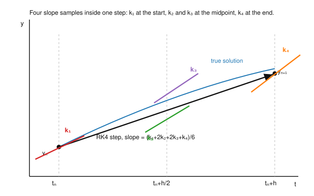

# Numerical Analysis · Lesson 4.2: Runge–Kutta Methods

> ⏱ ~15 min · Module 4: Numerical ODEs & Stability · Builds on: [Lesson 4.1](04-01-euler-local-global-error.md) (Euler, local vs. global error, order) · Unlocks: [Lesson 4.3](04-03-multistep-methods.md) (multistep methods)

## Why this matters

Euler is honest but slow: global error $O(h)$ means to gain one decimal digit you take ten times as many steps. Almost nobody integrates a real ODE with Euler. The default tool — the one hiding inside MATLAB's `ode45`, SciPy's `solve_ivp`, and every game-physics engine — is a **Runge–Kutta** method, and the classic **RK4** gives global error $O(h^4)$: halve the step, cut the error by a factor of $16$. This lesson shows how RK buys that accuracy without ever asking you for a derivative of $f$, and how its modern *embedded* cousins estimate their own error on the fly to choose the step size for you.

## The idea

Go back to why Euler is only first-order. Over one step it uses a single slope, $f(t_n, y_n)$, taken at the *start* of the interval — but the true solution's slope changes across the step. Euler commits to the initial slope and drifts off the curve.

The fix a physicist reaches for is obvious: **sample the slope at several points inside the step and average them.** Instead of trusting the slope at the left endpoint, peek ahead — evaluate $f$ at the midpoint, at the far end — and combine those samples into one better effective slope for the whole step.

Here is the elegant part. To match more terms of the Taylor expansion, a Taylor-series method would need $y'' , y''', \dots$, i.e. derivatives of $f$ — painful and often unavailable. Runge–Kutta trades those unknown derivatives for **extra evaluations of $f$ itself**. Each interior slope sample secretly encodes curvature information (because $f$ at a shifted point differs from $f$ at the start by exactly the amount its derivatives dictate), so a clever weighted average of a few $f$-values reproduces the high-order Taylor terms *without you ever differentiating $f$*. More sample points, more Taylor terms matched, higher order. That is the whole trick.

## The formal version

A **one-step method** advances $y_{n+1} = y_n + h\,\Phi(t_n, y_n, h)$ where the *increment function* $\Phi$ is a weighted average of slope samples. An $s$-**stage Runge–Kutta method** computes stage slopes $k_1, \dots, k_s$ and combines them.

**RK2 (the midpoint method).** Two stages:
$$k_1 = f(t_n, y_n), \qquad k_2 = f\!\left(t_n + \tfrac{h}{2},\; y_n + \tfrac{h}{2}k_1\right), \qquad y_{n+1} = y_n + h\,k_2.$$
*In words:* take a half-Euler-step to guess the solution at the midpoint, read the slope *there*, and use that midpoint slope for the full step. Global order $2$. (Heun's method is the sibling that instead averages the endpoint slopes, $y_{n+1}=y_n+\tfrac h2(k_1+k_2)$ with $k_2=f(t_n+h,y_n+hk_1)$ — also order $2$.)

**RK4 (the classic).** Four stages:
$$
\begin{aligned}
k_1 &= f(t_n,\; y_n), \\
k_2 &= f\!\left(t_n + \tfrac{h}{2},\; y_n + \tfrac{h}{2}k_1\right), \\
k_3 &= f\!\left(t_n + \tfrac{h}{2},\; y_n + \tfrac{h}{2}k_2\right), \\
k_4 &= f\!\left(t_n + h,\; y_n + h\,k_3\right), \\
y_{n+1} &= y_n + \tfrac{h}{6}\big(k_1 + 2k_2 + 2k_3 + k_4\big).
\end{aligned}
$$
*In words:* one slope at the start ($k_1$), two independent estimates at the midpoint ($k_2$ built on $k_1$, then $k_3$ built on $k_2$), one at the end ($k_4$); the step uses their Simpson-like weighted average, with the midpoint slopes counted double. Global order $4$: the accumulated error is $O(h^4)$, so **halving $h$ shrinks the error by $\approx 2^4 = 16$.** The cost is four $f$-evaluations per step instead of Euler's one — almost always a bargain, because you can take far larger steps.

**Order conditions (why those coefficients).** The weights ($\tfrac16, \tfrac26, \tfrac26, \tfrac16$) and the interior nodes ($0, \tfrac12, \tfrac12, 1$) are not arbitrary or aesthetic. Expand both the exact solution $y(t_n+h)$ and the RK formula as Taylor series in $h$ and force them to agree through the $h^4$ term. That matching produces a system of polynomial equations in the coefficients — the **order conditions** — and RK4's numbers are one solution. (You will derive the order-2 conditions yourself in P3; they already pin down $b_1+b_2=1$ and $b_2 c = \tfrac12$.) Higher order needs more stages and more conditions — the bookkeeping explodes, which is why order 4 with 4 stages is the famous sweet spot.

**Embedded pairs and adaptive stepping.** A fixed $h$ is wasteful: you want small steps only where the solution is changing fast. An **embedded RK pair** (Runge–Kutta–Fehlberg RK45, Dormand–Prince, the default in `ode45`) reuses one set of stage evaluations to form *two* estimates of different order — say order $4$ and order $5$ — at the same point. Their difference
$$\text{est. local error} \;\approx\; \big|\,y^{(5)}_{n+1} - y^{(4)}_{n+1}\,\big|$$
is a nearly free estimate of the step's local error. Compare it to a tolerance $\tau$: too big, reject the step and shrink $h$; comfortably small, accept and grow $h$. Because the local error of the lower-order member scales like $h^{p+1}$, the optimal rescaling is
$$h_{\text{new}} = h\left(\frac{\tau}{\text{est. error}}\right)^{1/(p+1)}.$$
*In words:* one pair of formulas both integrates the ODE **and** grades its own homework, and that grade drives the step size automatically.

## Picture

The step from $y_n$ to $y_{n+1}$ does not follow any single slope. It follows the **weighted average** $\tfrac16(k_1+2k_2+2k_3+k_4)$ — heavy on the two midpoint samples — which hugs the true solution far more tightly than Euler's lone start-of-step slope $k_1$ ever could.

## Worked examples

**Example 1 (RK4 vs. Euler, one step, same $h$).** Integrate the IVP
$$y' = y - t^2 + 1, \qquad y(0) = 0.5,$$
whose exact solution is $y(t) = (t+1)^2 - \tfrac12 e^{t}$. Take **one** step of size $h = 0.5$ from $t_0 = 0$, and compare Euler to RK4. Here $f(t,y) = y - t^2 + 1$ and the target is $y(0.5) = (1.5)^2 - \tfrac12 e^{0.5} = 1.4256393646$.

*Euler.* $f(0, 0.5) = 0.5 - 0 + 1 = 1.5$, so
$$y_1^{\text{Euler}} = 0.5 + 0.5(1.5) = 1.25, \qquad \text{error } = |1.4256394 - 1.25| = 0.17564.$$

*RK4.* March through the four stages:
$$
\begin{aligned}
k_1 &= f(0,\,0.5) = 1.5,\\
k_2 &= f(0.25,\; 0.5 + 0.25\cdot 1.5) = f(0.25,\,0.875) = 0.875 - 0.0625 + 1 = 1.8125,\\
k_3 &= f(0.25,\; 0.5 + 0.25\cdot 1.8125) = f(0.25,\,0.953125) = 1.890625,\\
k_4 &= f(0.5,\; 0.5 + 0.5\cdot 1.890625) = f(0.5,\,1.4453125) = 1.4453125 - 0.25 + 1 = 2.1953125.
\end{aligned}
$$
$$y_1^{\text{RK4}} = 0.5 + \frac{0.5}{6}\big(1.5 + 2(1.8125) + 2(1.890625) + 2.1953125\big) = 0.5 + \frac{0.5}{6}(11.1015625) = 1.4251302.$$
Error $= |1.4256394 - 1.4251302| = 0.00050916$.

Same step size, same four *lines* of arithmetic (four $f$-calls) — and RK4's error is smaller by a factor of $\mathbf{345}$. That is what "two more orders of accuracy" buys you. Watch the stage slopes climb $1.50 \to 1.81 \to 1.89 \to 2.20$ across the interval: Euler froze at the first value; RK4 tracked the rise.

**Example 2 (the $16\times$ rule in action).** Suppose an RK4 integration of some IVP out to $t = 1$ with $h = 0.1$ (that's $10$ steps) yields a global error of $3.0\times 10^{-6}$. What error should you expect with $h = 0.05$?

Global error scales as $h^4$. Halving $h$ multiplies the error by $\left(\tfrac12\right)^4 = \tfrac{1}{16}$:
$$\text{new error} \approx \frac{3.0\times 10^{-6}}{16} \approx 1.9\times 10^{-7},$$
at the cost of doubling the work to $20$ steps. Contrast Euler, order $1$: halving $h$ there only halves the error. To reach $1.9\times 10^{-7}$ from $3.0\times 10^{-6}$ with Euler you'd need roughly $16\times$ as many steps, not $2\times$. This gulf is why order matters more than any constant-factor cleverness.

## Watch out

- **More stages does not mean equally more order.** RK4 needs $4$ stages for order $4$, but the pattern breaks: order $5$ needs $6$ stages, order $6$ needs $7$. Stages $=$ order only holds up through $4$ — the reason RK4 is *the* default.
- **RK is not immune to instability.** High order controls *truncation* error per step; it says nothing about whether errors *grow* as you march. On a stiff problem an explicit RK method still blows up unless $h$ is tiny — that is [Lesson 4.4](04-04-absolute-stability-stiffness.md)'s absolute-stability story, a completely separate axis from order.
- **$k_2$ and $k_3$ are both "at the midpoint," but they are different slopes.** $k_3$ re-evaluates $f$ at the midpoint using the $y$-value predicted by $k_2$, not $k_1$. Don't collapse them — that second midpoint correction is exactly what lifts the method from order 2 to order 4.
- **The embedded error estimate grades the *lower*-order result.** In an RK45 pair you usually advance with the higher-order ($5$th) value ("local extrapolation") but size the step from the difference, which estimates the $4$th-order member's error. Using $p=4$ (not $5$) in the $1/(p+1)$ exponent is the standard, safe choice.

## One-liner

> Runge–Kutta buys high order by sampling the slope at several interior points and averaging — trading unavailable derivatives of $f$ for a few extra evaluations of $f$; RK4 is the four-sample workhorse whose error dies like $h^4$.

## Problems

**P1 (🟢)** Use the **midpoint RK2** method to take one step of size $h = 0.2$ for
$$y' = t + y, \qquad y(0) = 1,$$
whose exact solution is $y(t) = 2e^{t} - t - 1$. Report $y_1$, the exact $y(0.2)$, and the RK2 error. For contrast, also compute the plain Euler step and its error.

**P2 (🟡)** An embedded RK45 step of size $h = 0.1$ returns a $4$th-order estimate $y^{(4)} = 2.001350$ and a $5$th-order estimate $y^{(5)} = 2.001300$ at $t_n + h$. (a) Estimate the local error of the $4$th-order result. (b) You require a per-step tolerance $\tau = 10^{-6}$. Using $h_{\text{new}} = h\,(\tau/\text{est. error})^{1/(p+1)}$ with $p = 4$, by what factor should you rescale $h$, and should this step be accepted or rejected?

**P3 (🔴, optional)** Derive the **order-2 conditions**. Consider the general 2-stage explicit method
$$k_1 = f(t_n, y_n), \quad k_2 = f(t_n + c\,h,\; y_n + a\,h\,k_1), \quad y_{n+1} = y_n + h\,(b_1 k_1 + b_2 k_2).$$
By Taylor-expanding both $y_{n+1}$ and the true $y(t_n + h)$ through $O(h^2)$ (use $y'' = f_t + f_y f$), show that matching them forces
$$b_1 + b_2 = 1, \qquad b_2\,c = \tfrac12, \qquad b_2\,a = \tfrac12.$$
Then verify the midpoint method ($b_1=0,\,b_2=1,\,c=a=\tfrac12$) and Heun's method ($b_1=b_2=\tfrac12,\,c=a=1$) both satisfy them.

Solutions

**P1** Here $f(t,y) = t + y$, $t_0 = 0$, $y_0 = 1$.
$$k_1 = f(0, 1) = 0 + 1 = 1, \qquad k_2 = f\!\left(0 + 0.1,\; 1 + 0.1\cdot 1\right) = f(0.1,\,1.1) = 0.1 + 1.1 = 1.2.$$
$$y_1 = y_0 + h\,k_2 = 1 + 0.2(1.2) = 1.24.$$
Exact: $y(0.2) = 2e^{0.2} - 0.2 - 1 = 2(1.2214028) - 1.2 = 1.2428055$. **RK2 error** $= |1.2428055 - 1.24| = 0.0028055$.

Euler: $y_1^{\text{Euler}} = 1 + 0.2\,f(0,1) = 1 + 0.2(1) = 1.20$, **Euler error** $= |1.2428055 - 1.20| = 0.0428055$. RK2 is more accurate by a factor of about $15$ here — one extra $f$-evaluation, one extra order.

**P2** (a) The estimated local error is the size of the disagreement between the two orders:
$$\text{est. error} = |y^{(5)} - y^{(4)}| = |2.001300 - 2.001350| = 5.0\times 10^{-5}.$$
(b) With $\tau = 10^{-6}$ and $p = 4$,
$$\frac{\tau}{\text{est. error}} = \frac{10^{-6}}{5.0\times 10^{-5}} = 0.02, \qquad h_{\text{new}} = h\,(0.02)^{1/5} = 0.1\times 0.4573 \approx 0.0457.$$
The scale factor is $(0.02)^{1/5} \approx 0.46$. Since the estimated error $5.0\times10^{-5}$ **exceeds** the tolerance $10^{-6}$, the step is **rejected**; redo it with $h \approx 0.046$ (roughly less than half the size). This is exactly how an adaptive integrator refuses a too-ambitious step and retries.

**P3** Abbreviate $f = f(t_n,y_n)$ and its partials $f_t, f_y$ at $(t_n, y_n)$.

*Exact solution.* By Taylor and the chain rule $y'' = \frac{d}{dt}f(t,y) = f_t + f_y\,y' = f_t + f_y f$:
$$y(t_n + h) = y_n + h\,f + \frac{h^2}{2}\big(f_t + f_y f\big) + O(h^3).$$

*RK formula.* Two-variable Taylor of the second stage about $(t_n, y_n)$:
$$k_2 = f(t_n + ch,\; y_n + a h f) = f + ch\,f_t + a h f\,f_y + O(h^2).$$
Therefore
$$
y_{n+1} = y_n + h\big(b_1 k_1 + b_2 k_2\big)
= y_n + h(b_1 + b_2)f + h^2\,b_2\big(c\,f_t + a f\,f_y\big) + O(h^3).
$$

*Match term by term.* Equating the two expansions:
- $h^1$ coefficient of $f$: $\;b_1 + b_2 = 1$.
- $h^2$ coefficient of $f_t$: $\;b_2\,c = \tfrac12$.
- $h^2$ coefficient of $f\,f_y$: $\;b_2\,a = \tfrac12$.

These are the order-2 conditions. $\blacksquare$

*Checks.* Midpoint: $b_1 + b_2 = 0 + 1 = 1$ ✓; $b_2 c = 1\cdot\tfrac12 = \tfrac12$ ✓; $b_2 a = 1\cdot\tfrac12 = \tfrac12$ ✓. Heun: $b_1 + b_2 = \tfrac12 + \tfrac12 = 1$ ✓; $b_2 c = \tfrac12\cdot 1 = \tfrac12$ ✓; $b_2 a = \tfrac12\cdot 1 = \tfrac12$ ✓. Both are order 2, by different choices of *where* to sample — the same freedom that, at four stages, produces RK4.

## Flashback

**From [Lesson 4.1](04-01-euler-local-global-error.md) (Euler; local vs. global truncation error, order):** For $y' = -y$, $y(0) = 1$ (exact $y(t) = e^{-t}$), take **one** forward-Euler step of size $h = 0.1$ starting from the *exact* value $y_0 = 1$. (a) Compute the local truncation error — the gap between the true $y(0.1)$ and your one Euler step — exactly. (b) Compare it to the leading estimate $\tfrac{h^2}{2}\,|y''(0)|$. (c) In one line: if that per-step (local) error is $O(h^2)$, why is Euler's *global* error only $O(h)$?

Solution

(a) Euler step: $y_1 = y_0 + h\,f(0, 1) = 1 + 0.1(-1) = 0.9$. True value: $y(0.1) = e^{-0.1} = 0.9048374$. Local error $= 0.9048374 - 0.9 = 0.0048374$.

(b) Here $y'' = y = e^{-t}$, so $y''(0) = 1$ and $\tfrac{h^2}{2}|y''(0)| = \tfrac{0.01}{2}(1) = 0.005$. The exact local error $0.0048374$ matches this leading $\tfrac{h^2}{2}y''(\xi)$ estimate closely — the small shortfall is the higher-order tail (and $\xi$ sitting just inside the step where $y''<1$).

(c) Reaching a fixed time $T$ takes $N = T/h$ steps, so the $O(h^2)$ per-step errors accumulate roughly $N \propto 1/h$ times: $\;\frac{T}{h}\cdot O(h^2) = O(h)$. One power of $h$ is lost to the sheer number of steps — the local order is always one higher than the global order. (RK4: local $O(h^5)$, global $O(h^4)$.)

## Connections

- **Backward:** RK4 exists to beat Euler's ([Lesson 4.1](04-01-euler-local-global-error.md)) order-1 accuracy; the "local order is global order $+1$" bookkeeping from that lesson reappears here (RK4: local $O(h^5)$, global $O(h^4)$). The final RK4 weights $\tfrac16(1,2,2,1)$ are literally **Simpson's rule** from [Lesson 2.4](02-04-newton-cotes-quadrature.md) — no coincidence: integrating $y'=f$ over a step *is* a quadrature, and RK4's node/weight pattern is Simpson's.
- **Forward:** [Lesson 4.3](04-03-multistep-methods.md) chases the same high order more cheaply by reusing *past* solution values (Adams–Bashforth/Moulton) instead of taking fresh interior samples each step — one $f$-evaluation per step, but needing history and a separate starter. [Lesson 4.4](04-04-absolute-stability-stiffness.md) then shows the accuracy story here is only half the picture: on stiff problems, *stability* — not order — dictates $h$, and even RK4 is forced to crawl.
- **Sideways:** the embedded-pair idea — run two estimators, use their disagreement to control effort — is the same error-driven adaptivity as adaptive quadrature in [Lesson 2.5](02-05-gaussian-adaptive-quadrature.md); both refine only where the integrand/solution is hard. The Taylor-matching that yields the order conditions is the same "expand and cancel leading terms" machinery behind the finite-difference stencils of [Lesson 2.3](02-03-numerical-differentiation.md).
