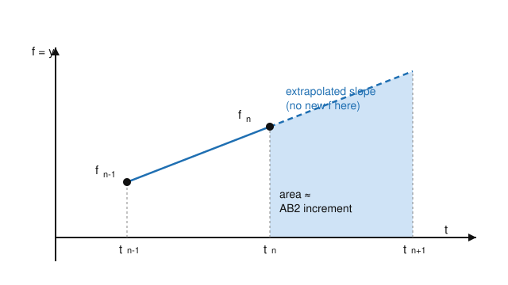

# Numerical Analysis · Lesson 4.3: Multistep Methods

> ⏱ ~15 min · Module 4: Numerical ODEs & Stability · Builds on: [Lesson 4.2](04-02-runge-kutta.md) (Runge–Kutta), [Lesson 4.1](04-01-euler-local-global-error.md) (Euler, order of a method) · Unlocks: [Lesson 4.4](04-04-absolute-stability-stiffness.md) (absolute stability & stiffness)

## Why this matters

RK4 buys you fourth-order accuracy — but it pays four function evaluations per step, and then it *throws all of them away* and starts the next step from scratch. If $f$ is expensive (a full fluid solve, an $N$-body force sum, a compiled economic model), those evaluations dominate your runtime. Multistep methods notice that you already computed a trail of slopes on the way here, and reuse them: high order for the price of **one** new evaluation per step. This is the workhorse behind production ODE solvers (the "Adams" and "BDF" families inside MATLAB's `ode113`, SciPy's `LSODA`, and every serious astrodynamics propagator).

## The idea

A one-step method like RK is *memoryless*: to get from $y_n$ to $y_{n+1}$ it only looks at $y_n$ and probes $f$ at fresh interior points. A **multistep method** has a memory. It keeps the last few solution values and — more importantly — the last few slopes $f_n, f_{n-1}, f_{n-2}, \dots$ that it already paid for, and fits a low-degree polynomial through those slopes to predict how $f$ behaves across the next step.

Here is the whole move. Integrate the ODE $y' = f(t,y)$ exactly over one step:
$$y_{n+1} = y_n + \int_{t_n}^{t_{n+1}} f\big(t, y(t)\big)\,dt.$$
The integral is the only hard part — we don't know $f$ on $[t_n, t_{n+1}]$. So approximate the integrand by a polynomial through slope values we *do* know, and integrate that polynomial instead. Two flavors, depending on which slopes you let the polynomial use:

- **Adams–Bashforth (explicit):** fit the polynomial through *past* slopes only ($f_n, f_{n-1}, \dots$) and **extrapolate** it across the new interval. One new evaluation ($f_n$) per step; no equation to solve.
- **Adams–Moulton (implicit):** also let the polynomial use the *new* slope $f_{n+1}$ — **interpolate** instead of extrapolate. More accurate and better-behaved, but $f_{n+1}=f(t_{n+1},y_{n+1})$ depends on the very $y_{n+1}$ you're solving for, so you must solve an equation each step.

Extrapolation is guessing past the edge of your data; interpolation is staying inside it. That single distinction — one letter of the alphabet apart in name, worlds apart in behavior — is the explicit-vs-implicit trade you'll meet again and again.

## The formal version

Write $f_k := f(t_k, y_k)$ for the slope already stored at node $t_k$, and use a fixed step $h = t_{k+1}-t_k$.

**2-step Adams–Bashforth (AB2), explicit, order 2.**
$$y_{n+1} = y_n + \frac{h}{2}\big(3 f_n - f_{n-1}\big).$$
*In words:* step forward using a slope that is the line through the two most recent slopes, extended to the middle of the new interval — no evaluation of $f$ inside the new step at all.

*Derivation.* Interpolate $f$ linearly through $(t_{n-1}, f_{n-1})$ and $(t_n, f_n)$: with $s = t - t_n$,
$$p(s) = f_n + \frac{f_n - f_{n-1}}{h}\,s.$$
Integrate this line over the *next* interval $s \in [0,h]$ (that's the extrapolation — we push $p$ past $t_n$):
$$\int_0^h p(s)\,ds = h f_n + \frac{f_n - f_{n-1}}{h}\cdot\frac{h^2}{2} = \frac{h}{2}\big(3f_n - f_{n-1}\big).$$
Its **local truncation error** is $O(h^3)$ per step, giving global order 2 — the same order as RK2, but at one evaluation per step instead of two.

**Adams–Moulton (implicit).** Include the new point. The one-step member is the **trapezoidal rule**
$$y_{n+1} = y_n + \frac{h}{2}\big(f_{n+1} + f_n\big) \quad (\text{order 2}),$$
and the two-step member is $y_{n+1} = y_n + \tfrac{h}{12}\big(5 f_{n+1} + 8 f_n - f_{n-1}\big)$ (order 3). *In words:* fit a polynomial that also passes through the unknown endpoint slope, so the rule interpolates rather than extrapolates. For a given number of stored points, the implicit Adams–Moulton rule is one order higher and far more stable than the explicit Adams–Bashforth rule — the reward for solving an equation.

**Predictor–corrector (the practical combo).** You rarely solve the implicit equation exactly. Instead: **P**redict with an explicit AB step, **E**valuate $f$ there, **C**orrect with one implicit AM step, **E**valuate again for the next step's history. This "PECE" pairing gets most of the implicit method's accuracy and stability at a fixed **two** evaluations per step — still half of RK4.

**Startup problem.** AB2 needs $f_{n-1}$ and $f_n$ before it can produce $y_{n+1}$; at $t_0$ you only have $y_0$. So you **prime the history** with a one-step method (an RK step) to manufacture $y_1$, and only then hand off to the multistep loop. A $k$-step method needs $k-1$ primed values, each computed to at least the method's order.

## Picture

The two black dots are slopes you already paid for. The solid blue line interpolates them; the dashed line is that same line pushed *past* your data into $[t_n, t_{n+1}]$ — the extrapolation. AB2's increment is exactly the shaded area under the dashed line. Because that area only uses the two past dots, the step costs **no new evaluation inside the interval**. The risk is visible too: extrapolating a straight line far past the data is optimistic, which is why explicit multistep methods have small stability regions (Lesson 4.4).

## Worked examples

Take $y' = t - y$, $\;y(0) = 1$, with exact solution $y(t) = t - 1 + 2e^{-t}$. Use $h = 0.1$.

**Example 1 (an AB2 step, with the slope extrapolation made explicit).**
*Startup.* AB2 needs two history points; prime $y_1$ with one explicit-midpoint RK2 step (Lesson 4.2). With $f_0 = f(0,1) = 0 - 1 = -1$:
$$y_1 = y_0 + h\,f\!\Big(t_0 + \tfrac h2,\; y_0 + \tfrac h2 f_0\Big) = 1 + 0.1\,f(0.05,\,0.95) = 1 + 0.1(-0.9) = 0.91.$$
Now store the two slopes: $f_0 = -1$ and $f_1 = f(0.1, 0.91) = 0.1 - 0.91 = -0.81$.

*The AB2 step to $t_2 = 0.2$:*
$$y_2 = y_1 + \frac{h}{2}\big(3f_1 - f_0\big) = 0.91 + 0.05\big(3(-0.81) - (-1)\big) = 0.91 + 0.05(-1.43) = 0.8385.$$
Exact: $y(0.2) = -0.8 + 2e^{-0.2} = 0.837462$, so the error is $\approx 1.0\times 10^{-3}$.

*The extrapolation, seen directly.* Rewrite the step as $y_2 = y_1 + h\bar f$ with effective slope $\bar f = \tfrac{3f_1 - f_0}{2} = -0.715$. The line through the past slopes has slope $\tfrac{f_1 - f_0}{h} = \tfrac{-0.81-(-1)}{0.1} = 1.9$; evaluated at the *midpoint* $t = 0.15$ of the new interval it gives $-0.81 + 1.9(0.05) = -0.715 = \bar f$. AB2 is literally "extend the slope-line to the middle of the next step and use that."

**Example 2 (predictor–corrector, and why it earns its keep).** Use the AB2 value as a *predictor*: $y_2^\ast = 0.8385$. Evaluate the slope there, $f_2^\ast = f(0.2, 0.8385) = -0.6385$, then *correct* with one trapezoidal (Adams–Moulton) step:
$$y_2 = y_1 + \frac{h}{2}\big(f_2^\ast + f_1\big) = 0.91 + 0.05\big(-0.6385 + (-0.81)\big) = 0.837575.$$
Error $\approx 1.1\times 10^{-4}$ — about **9× smaller** than the raw AB2 predictor, for one extra evaluation. That is the PECE bargain.

**Cost per step, side by side** (the point of the whole lesson):

| Method | New $f$-evals / step | Global order | Extra baggage |
|---|---|---|---|
| RK4 (Lesson 4.2) | 4 | 4 | none — self-starting, memoryless |
| AB2 | **1** | 2 | needs 1 primed value; stores past slopes |
| AB2/trapezoid PECE | 2 | 2 (smaller constant) | same startup + storage |

RK4 wins on order-per-step; AB2 wins decisively on *evaluations* per unit accuracy when $f$ is the bottleneck. Higher-order Adams rules (AB4, AM4) push the order to 4 while keeping the 1–2 evaluations/step count — that is when multistep methods pull clearly ahead of RK4.

## Watch out

- **You might think** "one evaluation per step, so it's just cheaper RK" — **but** you inherited a *startup problem* (you can't take the first step) and a *storage* requirement, and, most importantly, a **smaller stability region**. Explicit multistep methods go unstable at step sizes RK4 tolerates; that trade is the whole subject of Lesson 4.4.
- **You might think** the implicit Adams–Moulton formula is a plug-in like AB2 — **but** $f_{n+1}$ sits on both sides, so it is an *equation* in $y_{n+1}$. For linear $f$ you solve it in closed form (P3); for nonlinear $f$ you iterate it (fixed-point or Newton — the machinery of [Lesson 1.4](01-04-bisection-fixed-point.md)/1.5). Predictor–corrector is exactly *one* such iteration, started from a good guess.
- **You might think** more history always means more accuracy for free — **but** a $k$-step explicit method needs $k-1$ startup values and its stability region *shrinks* as $k$ grows. Beyond order 6–8 the Adams family becomes unusable for stability reasons; there is no free lunch, only a well-priced one.

## One-liner

> A multistep method fits a polynomial through slopes you already bought and integrates it — extrapolate the past (Adams–Bashforth, cheap) or interpolate the endpoint (Adams–Moulton, accurate), and pair them as predict-then-correct.

## Problems

**P1 (🟢)** For $y' = -y$, $\,y(0)=1$ (exact $y = e^{-t}$), take $h = 0.1$ and suppose a startup step has already given $y_1 = 0.905$ at $t_1 = 0.1$. (a) Take one AB2 step to find $y_2$ at $t_2 = 0.2$, and report the error against the exact value. (b) How many *new* evaluations of $f$ did that step cost, and how many would one RK4 step have cost?

**P2 (🟡)** Continue P1. Use your $y_2$ from (a) as a predictor $y_2^\ast$, then apply one trapezoidal (Adams–Moulton) corrector step to get a refined $y_2$. Report its error and compare to the predictor's error — did correcting help, and by roughly what factor?

**P3 (🔴)** The trapezoidal rule $y_{n+1} = y_n + \tfrac h2(f_{n+1}+f_n)$ is implicit. For the linear test equation $y' = \lambda y$ (constant $\lambda$), solve the step *exactly* for $y_{n+1}$ in terms of $y_n$, and write the amplification factor $R(z)$ with $z = h\lambda$. Then say, in one sentence, what you would have to do instead if $f$ were nonlinear — and which earlier lesson supplies that tool.

Solutions

**P1** (a) Slopes: $f_0 = f(0,1) = -1$ and $f_1 = f(0.1, 0.905) = -0.905$. AB2:
$$y_2 = y_1 + \tfrac{h}{2}(3f_1 - f_0) = 0.905 + 0.05\big(3(-0.905) - (-1)\big) = 0.905 + 0.05(-1.715) = 0.819250.$$
Exact $y(0.2) = e^{-0.2} = 0.818731$, so error $\approx 5.2\times10^{-4}$.
(b) AB2 costs **one** new evaluation, $f_1$ (and $f_1$ is then reused as history next step; $f_0$ was already on hand). One RK4 step costs **four** evaluations.

**P2** Predictor $y_2^\ast = 0.819250$, so $f_2^\ast = f(0.2, 0.819250) = -0.819250$. Trapezoidal corrector:
$$y_2 = y_1 + \tfrac{h}{2}(f_2^\ast + f_1) = 0.905 + 0.05\big(-0.819250 + (-0.905)\big) = 0.905 - 0.0862125 = 0.818788.$$
Error $\approx 5.7\times10^{-5}$ against $0.818731$. The predictor's error was $5.2\times10^{-4}$, so correcting cut the error by roughly a factor of **9** for one extra evaluation — the same PECE payoff as in the worked example.

**P3** Substitute $f_{k} = \lambda y_k$:
$$y_{n+1} = y_n + \tfrac h2\big(\lambda y_{n+1} + \lambda y_n\big) \;\Longrightarrow\; y_{n+1}\Big(1 - \tfrac{h\lambda}{2}\Big) = y_n\Big(1 + \tfrac{h\lambda}{2}\Big),$$
so, with $z = h\lambda$,
$$y_{n+1} = \underbrace{\frac{1 + z/2}{1 - z/2}}_{R(z)}\, y_n.$$
The step is explicitly solvable *because* $f$ is linear. If $f$ were nonlinear, $f_{n+1}=f(t_{n+1},y_{n+1})$ could not be isolated algebraically, so each step becomes a root-find for $y_{n+1}$ — solved by fixed-point iteration or Newton's method from [Lesson 1.4](01-04-bisection-fixed-point.md)/1.5 (a predictor–corrector step is one such iteration). Aside: $|R(z)|\le 1$ for every $z$ with $\operatorname{Re}(z)\le 0$, which is the A-stability you'll formalize in Lesson 4.4.

## Flashback

**From [Lesson 4.2](04-02-runge-kutta.md) (Runge–Kutta):** Consider $y' = t + y$, $\,y(0) = 1$ (exact $y = 2e^{t} - t - 1$). (a) Take one step of **Heun's method** (explicit trapezoidal RK2) with $h = 0.2$ to estimate $y(0.2)$, and report the error. (b) If you halved the step to $h = 0.1$, by roughly what factor should the global error shrink, and why?

Solution

(a) Heun: predictor $\tilde y = y_0 + h f_0$, then $y_1 = y_0 + \tfrac h2\big(f_0 + f(t_1, \tilde y)\big)$. Here $f_0 = f(0,1) = 0 + 1 = 1$, so $\tilde y = 1 + 0.2(1) = 1.2$ and $f(0.2, 1.2) = 0.2 + 1.2 = 1.4$. Then
$$y_1 = 1 + \tfrac{0.2}{2}(1 + 1.4) = 1 + 0.1(2.4) = 1.24.$$
Exact $y(0.2) = 2e^{0.2} - 1.2 = 1.242806$, so the error is $\approx 2.8\times10^{-3}$.

(b) Heun is a second-order method, so its global error scales like $h^2$. Halving $h$ multiplies the error by about $(\tfrac12)^2 = \tfrac14$ — roughly a **4×** reduction. (This is the same order-2 accuracy AB2 achieves in this lesson, but Heun spends two evaluations per step where AB2 spends one.)

## Connections

- **Backward:** This reuses the *order of a method* and error-scaling idea from [Lesson 4.1](04-01-euler-local-global-error.md) and the explicit-trapezoid step from [Lesson 4.2](04-02-runge-kutta.md) — AB2 and RK2 share global order 2, letting you compare them purely on cost per step.
- **Forward:** [Lesson 4.4](04-04-absolute-stability-stiffness.md) explains the price of the cheap explicit step: multistep stability regions are small, so stiff problems force you toward the *implicit* Adams–Moulton / backward-difference side — the amplification factor $R(z)$ from P3 is the first stability region you'll draw.
- **Sideways (root-finding):** Solving the implicit Adams–Moulton equation for $y_{n+1}$ is exactly the fixed-point / Newton iteration of [Lesson 1.4](01-04-bisection-fixed-point.md) and 1.5, now applied once per time step; a predictor–corrector step is a single iteration launched from a well-chosen initial guess.
