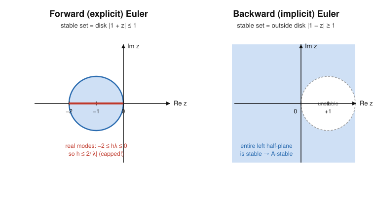

# Numerical Analysis · Lesson 4.4: Absolute Stability & Stiffness

> ⏱ ~15 min · Module 4: Numerical ODEs & Stability · Builds on: [Lesson 4.1](04-01-euler-local-global-error.md) (Euler, local vs. global error), [Lesson 3.5](03-05-power-method.md) (eigenvalues set the rates) · Unlocks: Module 5 — [Lesson 5.1](05-01-least-squares-normal-equations.md), and the CFL limit of the heat equation ([Lesson 5.4](05-04-heat-equation-explicit-implicit.md))

## Why this matters

A method can be *convergent* — provably correct as $h\to 0$ — and still explode at any $h$ you can afford. That is the daily reality of **stiff** problems: chemical kinetics with fast and slow reactions, circuits with tiny and huge time constants, a heat equation on a fine grid. Explicit methods on these problems get shackled to a step size set by the *fastest* dynamics, even after those dynamics have died out and stopped contributing to the answer. This lesson gives you the one-line test to see the shackle coming — and the reason implicit methods cut it off.

## The idea

Forget the general ODE for a moment and look at the simplest possible one, the **test equation**

$$y' = \lambda y, \qquad \operatorname{Re}\lambda < 0.$$

Its exact solution $y(t)=y(0)e^{\lambda t}$ *decays* (because $\operatorname{Re}\lambda<0$). Any honest numerical method should decay too. So run your method on it: every one-step method turns the test equation into a simple recurrence

$$y_{n+1} = R(h\lambda)\,y_n,$$

where $R$ — the **amplification factor** — is a fixed function of the single combination $z := h\lambda$. Then $y_n = R(z)^n y_0$, and the numerical solution decays **if and only if** $|R(z)|\le 1$.

That's the whole game. The set of $z=h\lambda$ in the complex plane where $|R(z)|\le 1$ is the method's **region of absolute stability**. Choosing a step size means landing $z=h\lambda$ *inside* that region. Why is $\lambda$ complex? Because a linear system $y'=Ay$ splits into modes $e^{\lambda_i t}$ along $A$'s eigenvectors (exactly the eigen-decomposition of [Lesson 3.5](03-05-power-method.md)), and oscillatory modes have complex $\lambda$. Each eigenvalue $\lambda_i$ must have its own $z_i=h\lambda_i$ inside the region — so **the most negative eigenvalue picks the step size for everyone.**

## The formal version

**Test equation & amplification factor.** Apply a one-step method to $y'=\lambda y$. It produces $y_{n+1}=R(z)\,y_n$ with $z=h\lambda$. The **region of absolute stability** is
$$\mathcal{S} = \{\, z\in\mathbb{C} : |R(z)| \le 1 \,\}.$$
*In words:* $\mathcal S$ is the set of $h\lambda$ values for which the computed solution stays bounded (decays) just like the true one.

**Forward (explicit) Euler.** $y_{n+1}=y_n+h\lambda y_n=(1+h\lambda)y_n$, so
$$R(z)=1+z, \qquad \mathcal S=\{\,|1+z|\le 1\,\}.$$
*In words:* the stable set is the disk of radius $1$ centered at $z=-1$ — a **bounded** disk. For a real decaying mode ($\lambda<0$ real), $z=h\lambda$ must satisfy $-2\le h\lambda\le 0$, i.e.
$$\boxed{\,h \le \dfrac{2}{|\lambda|}\,}.$$
The step size is *capped*, and the cap is tightest for the largest $|\lambda|$.

**Backward (implicit) Euler.** Evaluate the slope at the new point: $y_{n+1}=y_n+h\lambda y_{n+1}$, solve for $y_{n+1}$:
$$R(z)=\frac{1}{1-z}, \qquad \mathcal S=\{\,|1-z|\ge 1\,\}.$$
*In words:* the stable set is everything **outside** the disk of radius $1$ centered at $z=+1$. That exterior contains the *entire* left half-plane $\operatorname{Re}z<0$.

**A-stability.** A method is **A-stable** if its stability region contains the whole left half-plane $\{\operatorname{Re}z<0\}$. Backward Euler is A-stable; forward Euler is not. *In words:* an A-stable method decays for **every** $h>0$ whenever the true solution decays — no step-size cap at all.

**Stiffness.** A system $y'=Ay$ (or its local linearization) is **stiff** when its eigenvalues have widely separated negative real parts — a large *stiffness ratio* $\max_i|\operatorname{Re}\lambda_i| \,/\, \min_i|\operatorname{Re}\lambda_i|$. The fast modes decay almost instantly, but for an explicit method they keep dictating $h\le 2/\max_i|\lambda_i|$ long after they've vanished from the solution. Implicit (A-stable) methods lift that dictate, letting $h$ be chosen for *accuracy of the surviving slow modes* alone.

## Picture

Same left half-plane, two verdicts. Forward Euler's stable set is a *bounded* disk: push $h\lambda$ past $-2$ on the real axis and you leave it. Backward Euler's stable set is everything *outside* the little disk around $+1$ — the whole decaying half-plane is in, so no step size can destabilize a decaying mode.

## Worked examples

**Example 1 (the cap, concretely).** Take the scalar stiff mode $y'=-100\,y$, $y(0)=1$ (true solution $e^{-100t}$, essentially zero by $t=0.05$). Forward Euler needs $z=h\lambda=-100h$ inside $[-2,0]$, so $h\le 2/100 = 0.02$.

| step $h$ | $z=h\lambda$ | $R=1+z$ | $|R|$ | behavior of $y_n=R^n$ |
|---|---|---|---|---|
| $0.019$ | $-1.9$ | $-0.9$ | $0.9$ | decays (sign flips), correct |
| $0.020$ | $-2.0$ | $-1.0$ | $1.0$ | $(-1)^n$: oscillates, never decays |
| $0.021$ | $-2.1$ | $-1.1$ | $1.1$ | $(-1.1)^n$: **blows up** |

At $h=0.021$ — a step of $21$ thousandths — the computed solution of a *decaying* equation grows without bound. Nothing is wrong with the code; $z$ simply left the disk.

**Example 2 (why you'd care — a stiff 2-mode system).** Let $y'=Ay$ with $A$ having eigenvalues $\lambda_1=-1$ and $\lambda_2=-100$. In the eigenbasis the solution is $c_1e^{-t}+c_2e^{-100t}$: the fast part $e^{-100t}$ is dead by $t\approx 0.05$, and for the rest of the integration to, say, $t=10$ only the smooth $e^{-t}$ survives.

Accuracy of $e^{-t}$ would be perfectly happy with $h\approx 0.1$ (about $100$ steps). But **forward Euler** must keep *both* $|1+h\lambda_i|\le 1$; the binding constraint is the fast eigenvalue, $h\le 2/100=0.02$. So it is forced to take $\ge 500$ steps — five times more — purely to keep an already-vanished mode from resurrecting through round-off. That mismatch (accuracy wants $0.1$, stability forces $0.02$) *is* stiffness.

**Backward Euler** amplifies mode $i$ by $1/(1-h\lambda_i)$. For $\operatorname{Re}\lambda_i<0$ this has magnitude $<1$ for *any* $h>0$: at $h=0.1$ the fast mode is damped by $1/(1-(-10))=1/11\approx 0.09$ per step (crushed, as it should be) and the slow mode by $1/(1-(-0.1))\approx 0.909$ (tracked accurately). One hundred steps, all stable. The price: each step solves a linear system $(I-hA)y_{n+1}=y_n$ — but that is cheap next to a $5\times$ (or, at ratio $10^6$, a millionfold) step penalty.

## Watch out

- You might think a smaller $h$ is *always* safer — and for stability it is, but that misses the point of stiffness: the problem isn't that you need accuracy, it's that stability alone forces $h$ absurdly small. Implicit methods let you take the *large* step accuracy permits.
- You might think "the fast mode already decayed, so it can't matter." It matters because round-off keeps re-seeding it: outside $\mathcal S$, that seed is multiplied by $|R|>1$ every step and grows back with a vengeance. Stability is about *perturbations*, not the initial data.
- You might conflate this **absolute** stability (behavior at a fixed $h>0$) with the **convergence/zero-stability** of [Lesson 4.1](04-01-euler-local-global-error.md) (behavior as $h\to 0$). Forward Euler is convergent *and* has a bounded stability region — both true, different questions.
- A-stability is a property of the *method*, not the problem. It says "no step cap for any decaying mode." It does **not** promise accuracy — backward Euler is still only first order.

## One-liner

> A decaying ODE decays numerically only when $h\lambda$ sits in the method's stability region; explicit regions are bounded, so the fastest mode caps your step — implicit A-stable methods make the whole left half-plane safe and cut the leash.

## Problems

**P1 (🟢)** For the scalar test equation $y'=-50\,y$ with forward Euler: (a) find the largest step size $h$ that keeps the computation stable; (b) for $h=0.05$, compute the amplification factor $R$ and state whether $y_n$ grows or decays.

**P2 (🟡)** A linear system $y'=Ay$ has eigenvalues $\lambda_1=-1$ and $\lambda_2=-1000$; you integrate to $t=5$. (a) What is the largest stable forward-Euler step, and how many steps does it force? (b) Backward Euler is A-stable; if accuracy lets you take $h=0.05$, how many steps is that, and what is backward Euler's amplification factor for the *fast* mode at that $h$? (c) In one sentence, name what makes this problem stiff.

**P3 (🔴, optional)** The **trapezoidal rule** (implicit) has amplification factor $R(z)=\dfrac{1+z/2}{1-z/2}$. (a) Show $|R(z)|=1$ for every purely imaginary $z=iy$. (b) Show $|R(z)|<1$ whenever $\operatorname{Re}z<0$, hence the method is A-stable. (c) Compute $\lim_{z\to-\infty}R(z)$ (real $z$) and explain why this makes the trapezoidal rule a *worse* damper of very stiff modes than backward Euler, despite being higher order.

Solutions

**P1** (a) Forward Euler is stable for a real mode when $-2\le h\lambda\le 0$. With $\lambda=-50$: $-2\le -50h\le 0 \Rightarrow h\le 2/50 = 0.04$. So the largest stable step is $h=0.04$.

(b) At $h=0.05$: $z=h\lambda=-2.5$, $R=1+z=-1.5$, $|R|=1.5>1$. Since $y_n=R^n y_0=(-1.5)^n$, the computed solution **grows** (with alternating sign) — unstable, because $0.05>0.04$.

**P2** (a) Stability needs both $|1+h\lambda_i|\le 1$; the binding eigenvalue is $\lambda_2=-1000$, giving $h\le 2/1000 = 0.002$. To reach $t=5$ that is $5/0.002 = 2500$ steps. (The slow mode $\lambda_1=-1$ alone would allow $h\le 2$, i.e. a handful of steps — stability, not accuracy, is what forces $2500$.)

(b) $h=0.05$ over $[0,5]$ is $5/0.05 = 100$ steps. Backward Euler's factor for the fast mode: $z=h\lambda_2=0.05\cdot(-1000)=-50$, so $R=1/(1-z)=1/(1-(-50))=1/51\approx 0.0196$. Magnitude $\ll 1$: the fast mode is strongly damped, exactly as it should be — and stably, at a step $25\times$ larger than explicit allowed.

(c) The eigenvalues' decay rates differ by a factor of $1000$ (stiffness ratio $\approx 10^3$): the fast mode dies almost immediately yet caps the explicit step for the entire run.

**P3** (a) For $z=iy$: numerator $1+iy/2$ has modulus $\sqrt{1+y^2/4}$; denominator $1-iy/2$ has the *same* modulus $\sqrt{1+y^2/4}$. Their ratio has modulus $1$, so $|R(iy)|=1$ for all real $y$. (The imaginary axis is the boundary of the stability region — trapezoidal preserves the amplitude of purely oscillatory modes.)

(b) Write $z=x+iy$. Then
$$|1+z/2|^2=(1+x/2)^2+(y/2)^2, \qquad |1-z/2|^2=(1-x/2)^2+(y/2)^2.$$
Subtracting, $|1+z/2|^2-|1-z/2|^2=(1+x/2)^2-(1-x/2)^2=2x$. If $\operatorname{Re}z=x<0$ this is negative, so $|1+z/2|<|1-z/2|$, hence $|R(z)|<1$. Thus every $z$ with $\operatorname{Re}z<0$ is in $\mathcal S$: the trapezoidal rule is **A-stable**.

(c) As $z\to-\infty$ along the real axis, $R(z)=\dfrac{1+z/2}{1-z/2}\to \dfrac{z/2}{-z/2}=-1$, so $|R|\to 1$. A very stiff mode ($z\to-\infty$) is therefore barely damped and, worse, flips sign each step — producing slowly-decaying oscillatory "ringing." Backward Euler instead has $R=1/(1-z)\to 0$, annihilating stiff modes in one step (this stronger property is called **L-stability**). So despite the trapezoidal rule's second-order accuracy, backward Euler's aggressive damping is often preferred for the very stiffest problems.

## Flashback

**From Lesson 4.1 (Euler; local vs. global error):** For $y'=-2y$, $y(0)=1$, take one forward-Euler step of size $h=0.1$. (a) Compute $y_1$ and the local error against the exact $y(0.1)$. (b) If you keep stepping with this $h$, will the numerical solution stay bounded? Justify with today's criterion.

Solution

(a) Forward Euler: $y_1=y_0+h\,f(y_0)=1+0.1\cdot(-2\cdot 1)=1-0.2=0.8$. Exact: $y(0.1)=e^{-0.2}=0.81873\ldots$. Local error $=0.81873-0.8=0.01873\approx 1.9\times 10^{-2}$, consistent with the $O(h^2)$ local truncation error of Euler ($\tfrac12 h^2|y''|=\tfrac12(0.01)(4)=0.02$).

(b) Here $z=h\lambda=0.1\cdot(-2)=-0.2$, and $R=1+z=0.8$ with $|R|=0.8\le 1$: $z$ lies inside the forward-Euler disk $|1+z|\le1$. So $y_n=(0.8)^n\to 0$ — the numerical solution stays bounded and decays, matching the true $e^{-2t}$. (Stability would fail only for $h>2/|\lambda|=1$.)

## Connections

- **Backward:** the modes and rates here are the eigenvalues of [Lesson 3.5](03-05-power-method.md) — $y'=Ay$ decouples along $A$'s eigenvectors, and each eigenvalue's $h\lambda_i$ must sit in $\mathcal S$; the eigenvalue with the largest $|\operatorname{Re}\lambda|$ is what the power method's dominant-eigenvalue reasoning would flag as the step-limiting mode.
- **Backward:** this refines [Lesson 4.1](04-01-euler-local-global-error.md) — convergence ($h\to0$) told you the method is *correct*; absolute stability (fixed $h$) tells you which $h$ you may actually use. Both Runge–Kutta ([Lesson 4.2](04-02-runge-kutta.md)) and multistep methods ([Lesson 4.3](04-03-multistep-methods.md)) have their own regions $\mathcal S$; explicit RK4's is a bounded blob, so it too caps $h$ on stiff problems.
- **Forward:** the very same constraint reappears as the **CFL limit** for the explicit heat-equation scheme in [Lesson 5.4](05-04-heat-equation-explicit-implicit.md) — discretizing $u_t=u_{xx}$ in space yields $y'=Ay$ whose eigenvalues scale like $-1/\Delta x^{2}$, so $h\le 2/|\lambda|$ becomes $\Delta t \lesssim \tfrac12\Delta x^2$; going implicit removes it, exactly as backward Euler does here. This taste of PDE time-stepping is developed fully in `pdes`.
