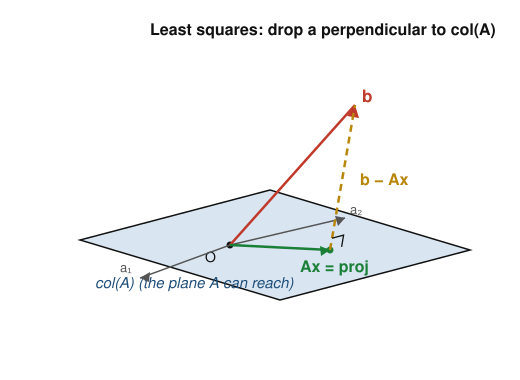

# Numerical Analysis · Lesson 5.1: Least-Squares & the Normal Equations

> ⏱ ~15 min · Module 5: Least-Squares & a Taste of PDEs · Builds on: [Lesson 3.2](03-02-cholesky-conditioning.md) (conditioning of $Ax=b$), [Lesson 3.3](03-03-qr-factorization.md) (QR factorization) · Unlocks: [Lesson 5.2](05-02-qr-svd-least-squares.md) (QR & SVD for least-squares)

## Why this matters

The moment you have more data than parameters — four measurements, a two-parameter line; a hundred data points, a degree-5 model — the system $Ax=b$ has no exact solution, and yet fitting it is the single most common computation in all of applied science. Regression, calibration curves, trend estimation, the entire machinery of ridge and lasso in [convex-optimization](../../convex-optimization/syllabus.md) — every one of them is a least-squares problem at heart. This lesson does two things: it gives you the clean geometric answer (the **normal equations**), and it shows you why the textbook formula you were probably taught is a numerical trap. The fix is Lesson 5.2, but you can't appreciate the fix until you've seen the trap spring.

## The idea

You have $m$ equations and only $n < m$ unknowns. Stacking them gives a **tall** matrix $A$ ($m\times n$) and a target $b\in\mathbb{R}^m$, and $Ax=b$ generally has *no* solution: $b$ almost never lands exactly in the set of vectors $A$ can produce. That reachable set is the **column space** $\operatorname{col}(A)$ — every vector of the form $Ax$, i.e. every combination of $A$'s columns. It's a flat $n$-dimensional slab living inside $m$-dimensional space, and $b$ pokes out of it.

So stop demanding equality and ask instead: *which reachable vector $Ax$ comes closest to $b$?* Closest in the ordinary Euclidean sense — smallest residual length $\lVert b - Ax\rVert_2$. Geometrically the answer is obvious the instant you picture it: **drop a perpendicular from $b$ onto the plane $\operatorname{col}(A)$.** The foot of that perpendicular is the projection $Ax$, and the leftover $b - Ax$ points straight out of the plane. "Best fit" is not a statistical incantation; it is literally the closest point, and closest points are found by dropping perpendiculars.

That one picture — residual perpendicular to the column space — *is* the whole derivation. Turn it into algebra and you get the normal equations.

## The formal version

**The least-squares problem.** Given $A\in\mathbb{R}^{m\times n}$ with $m>n$ and $b\in\mathbb{R}^m$, find
$$x^* = \operatorname{argmin}_{x\in\mathbb{R}^n}\ \lVert Ax - b\rVert_2^2.$$

*In words:* among all the vectors $A$ can reach, find the coefficients $x$ making $Ax$ nearest to the target $b$, measuring "near" by squared length.

**Orthogonality is optimality.** At the minimizer, the residual $r = b - Ax^*$ must be orthogonal to *every* column of $A$ — otherwise you could slide $Ax$ a hair along a column and shrink the distance. "Orthogonal to every column" means $A^\top r = 0$. Writing that out:
$$A^\top\!\left(b - Ax^*\right) = 0 \quad\Longrightarrow\quad \boxed{A^\top A\, x^* = A^\top b.}$$

These are the **normal equations** ("normal" as in perpendicular). The $n\times n$ matrix $A^\top A$ is square, symmetric, and — whenever $A$ has full column rank — positive definite, so this is an SPD system you already know how to solve by Cholesky (Lesson [3.2](03-02-cholesky-conditioning.md)).

*In words:* the best fit is the one whose error vector is perpendicular to everything the model can produce, and that perpendicularity condition collapses to a small square linear system.

**Same answer from calculus.** Let $\phi(x) = \lVert Ax - b\rVert_2^2 = (Ax-b)^\top(Ax-b)$. Its gradient is $\nabla\phi = 2A^\top(Ax - b)$; setting it to zero returns $A^\top A x = A^\top b$ exactly. The geometry and the calculus agree — as they must, since minimizing a distance and dropping a perpendicular are the same act.

**The projection.** The fitted values are $\hat b = Ax^* = A(A^\top A)^{-1}A^\top\, b = P b$, where $P = A(A^\top A)^{-1}A^\top$ is the **orthogonal projector** onto $\operatorname{col}(A)$: it satisfies $P^2 = P$ (projecting twice does nothing new) and $P^\top = P$. You rarely form $P$; it's the concept, not the computation.

## Picture

The target $b$ (red) sticks out of the plane $\operatorname{col}(A)$ that the columns $a_1, a_2$ span. The best fit $Ax$ (green) is the foot of the perpendicular; the residual $b-Ax$ (gold, dashed) leaves the plane at a right angle. That right angle is precisely $A^\top(b-Ax)=0$.

## Worked examples

**Example 1 (fit a line by the normal equations).** Fit $y = c_0 + c_1 x$ to the four points $(0,1),(1,1),(2,2),(3,2)$. The model says $c_0 + c_1 x_i \approx y_i$, so
$$A = \begin{pmatrix} 1 & 0\\ 1 & 1\\ 1 & 2\\ 1 & 3 \end{pmatrix},\qquad x = \begin{pmatrix} c_0\\ c_1\end{pmatrix},\qquad b = \begin{pmatrix} 1\\1\\2\\2\end{pmatrix}.$$
Build the (tiny) normal-equations pieces:
$$A^\top A = \begin{pmatrix} m & \sum x_i\\ \sum x_i & \sum x_i^2\end{pmatrix} = \begin{pmatrix} 4 & 6\\ 6 & 14\end{pmatrix},\qquad A^\top b = \begin{pmatrix} \sum y_i\\ \sum x_i y_i\end{pmatrix} = \begin{pmatrix} 6\\ 11\end{pmatrix}.$$
Solve $\begin{pmatrix}4&6\\6&14\end{pmatrix}\!\begin{pmatrix}c_0\\c_1\end{pmatrix}=\begin{pmatrix}6\\11\end{pmatrix}$. The determinant is $4\cdot14-6^2 = 20$, so
$$c_0 = \frac{14\cdot 6 - 6\cdot 11}{20} = \frac{18}{20} = 0.9,\qquad c_1 = \frac{4\cdot 11 - 6\cdot 6}{20} = \frac{8}{20} = 0.4.$$
Best-fit line $y = 0.9 + 0.4x$. **Check orthogonality:** residuals $r_i = y_i - (0.9+0.4x_i)$ are $(0.1, -0.3, 0.3, -0.1)$. Then $\sum r_i = 0$ (residual ⊥ the all-ones column) and $\sum x_i r_i = 0(0.1)+1(-0.3)+2(0.3)+3(-0.1) = 0$ (residual ⊥ the $x$-column). $A^\top r = 0$ confirmed — the geometry checks out numerically.

**Example 2 (the $\kappa^2$ trap — why the naive route is dangerous).** The normal equations are correct mathematics and treacherous numerics, because forming $A^\top A$ **squares the condition number**. Recall from Lesson [3.2](03-02-cholesky-conditioning.md) that the 2-norm condition number is $\kappa_2(A) = \sigma_{\max}(A)/\sigma_{\min}(A)$, and that the singular values of $A^\top A$ are the *squares* $\sigma_i^2$. Therefore
$$\kappa_2(A^\top A) = \frac{\sigma_{\max}^2}{\sigma_{\min}^2} = \kappa_2(A)^2.$$
Watch it bite. Fit a line to data at $x = 1000, 1001, 1002$ (say from sensor timestamps nobody thought to re-zero), with any $y$-values. The design matrix has columns $(1,1,1)^\top$ and $(1000,1001,1002)^\top$ — *nearly parallel*, so $A$ is already ill-conditioned. Form the normal matrix:
$$A^\top A = \begin{pmatrix} 3 & 3003\\ 3003 & 3006005 \end{pmatrix},\qquad \det(A^\top A) = 3\cdot 3006005 - 3003^2 = 9018015 - 9018009 = 6.$$
A determinant of $6$ against entries near $3\times 10^6$ screams near-singular. Its eigenvalues are $\lambda_{\max}\approx 3.006\times10^{6}$ and $\lambda_{\min}\approx \det/\lambda_{\max}\approx 6/(3.006\times10^6)\approx 2.0\times10^{-6}$, so
$$\kappa_2(A^\top A) = \frac{\lambda_{\max}}{\lambda_{\min}} \approx \frac{3.006\times10^{6}}{2.0\times10^{-6}} \approx 1.5\times10^{12},\qquad \kappa_2(A) = \sqrt{\kappa_2(A^\top A)} \approx 1.2\times10^{6}.$$
Now the digit-loss rule of thumb (Lesson [3.2](03-02-cholesky-conditioning.md)): in double precision you carry $\approx 16$ digits and lose $\log_{10}\kappa$.
- Working through $A$ stably (κ ≈ $1.2\times10^6$): lose $\approx 6$ digits, keep **~10**.
- Working through $A^\top A$ (κ ≈ $1.5\times10^{12}$): lose $\approx 12$ digits, keep **~4**.

Forming $A^\top A$ threw away six correct digits *before you solved anything* — purely a choice of formulation. For a degree-5 Vandermonde fit on equispaced nodes, $\kappa_2(A)\approx 10^{5}$ already (it's a Hilbert-shaped problem, cf. Lesson [3.2](03-02-cholesky-conditioning.md) P2), so the normal equations reach $\kappa_2\approx10^{10}$ and the fit becomes garbage. (The cheap partial fix — *center the data*, replacing $x$ by $x-\bar x$ — makes the two columns orthogonal and pulls $\kappa$ back to $O(1)$; the real fix, working with $A$ directly via QR, is Lesson [5.2](05-02-qr-svd-least-squares.md).)

## Watch out

- You might think that because the normal equations are *derived exactly*, solving them is safe. But exact algebra and stable arithmetic are different questions (the conditioning-vs-stability split of Lesson [1.3](01-03-conditioning-vs-stability.md)). The formula is right; *forming $A^\top A$* is what squares the conditioning and destroys digits. QR/SVD solve the same exact problem without ever building $A^\top A$.
- You might think a small residual means a well-conditioned fit. Unrelated. The residual measures how far $b$ is from the plane; $\kappa(A)$ measures how sensitively the coefficients $x$ respond to wiggles in the data. You can have a beautiful $R^2$ and coefficients that swing wildly under a rounding error — that's exactly the near-parallel-columns case above.
- You might think $A^\top A$ is invertible whenever $A$ is "big enough." It's invertible iff $A$ has **full column rank** (independent columns). Duplicate or linearly dependent predictors — the multicollinearity of a stats class — make $A^\top A$ singular and the fit non-unique, which is where the pseudo-inverse and effective rank of Lesson [5.2](05-02-qr-svd-least-squares.md) take over.

## One-liner

> Least-squares drops a perpendicular from $b$ onto $\operatorname{col}(A)$, giving $A^\top A x = A^\top b$ — a correct formula whose one sin is squaring the condition number, so never form $A^\top A$ when $A$ is delicate.

## Problems

**P1 (🟢)** Fit a line $y=c_0+c_1x$ to the points $(0,1),(1,3),(2,4),(3,5)$ via the normal equations. Report $c_0, c_1$, then verify $A^\top r = 0$ by checking $\sum r_i = 0$ and $\sum x_i r_i = 0$.

**P2 (🟡)** Derive the normal equations *by calculus*: expand $\phi(x)=\lVert Ax-b\rVert_2^2 = x^\top A^\top A\,x - 2b^\top A x + b^\top b$, take $\nabla_x\phi$, and set it to zero. Confirm you recover $A^\top A x = A^\top b$, and explain in one sentence why $A^\top A$ being positive definite guarantees this stationary point is the unique minimum (not a max or saddle).

**P3 (🔴, optional — the ridge bridge to `convex-optimization`)** Ridge regression solves $\min_x \lVert Ax-b\rVert_2^2 + \lambda\lVert x\rVert_2^2$ for a chosen $\lambda>0$. (a) Show its minimizer satisfies the *modified* normal equations $(A^\top A + \lambda I)\,x = A^\top b$. (b) If $A^\top A$ has eigenvalues $\sigma_1^2\ge\cdots\ge\sigma_n^2$, write the eigenvalues of $A^\top A+\lambda I$ and hence its condition number. (c) For the ill-conditioned matrix of Example 2 ($\sigma_{\max}^2\approx 3.0\times10^{6}$, $\sigma_{\min}^2\approx 2.0\times10^{-6}$), pick $\lambda = 10^{-2}$ and estimate the new condition number. What has ridge bought you, and at what conceptual cost?

Solutions

**P1** With $x_i = 0,1,2,3$ and $y_i = 1,3,4,5$: $m=4$, $\sum x_i = 6$, $\sum x_i^2 = 0+1+4+9 = 14$, $\sum y_i = 1+3+4+5 = 13$, $\sum x_i y_i = 0+3+8+15 = 26$. So
$$A^\top A = \begin{pmatrix}4 & 6\\ 6 & 14\end{pmatrix},\qquad A^\top b = \begin{pmatrix}13\\ 26\end{pmatrix},\qquad \det = 20.$$
$$c_0 = \frac{14\cdot13 - 6\cdot26}{20} = \frac{182 - 156}{20} = \frac{26}{20} = 1.3,\qquad c_1 = \frac{4\cdot26 - 6\cdot13}{20} = \frac{104 - 78}{20} = \frac{26}{20} = 1.3.$$
Line $y = 1.3 + 1.3x$. Fitted values $1.3, 2.6, 3.9, 5.2$; residuals $r_i = (-0.3, 0.4, 0.1, -0.2)$. Check: $\sum r_i = -0.3+0.4+0.1-0.2 = 0\ \checkmark$; $\sum x_i r_i = 0(-0.3)+1(0.4)+2(0.1)+3(-0.2) = 0.4+0.2-0.6 = 0\ \checkmark$. Both columns of $A$ are orthogonal to $r$, i.e. $A^\top r = 0$.

**P2** Expand (using $b^\top A x = x^\top A^\top b$, a scalar):
$$\phi(x) = (Ax-b)^\top(Ax-b) = x^\top A^\top A\,x - 2\,b^\top A x + b^\top b.$$
Gradient of each term: $\nabla_x\!\left(x^\top A^\top A x\right) = 2A^\top A x$ (since $A^\top A$ is symmetric), $\nabla_x(-2b^\top A x) = -2A^\top b$, and the constant drops. So
$$\nabla\phi = 2A^\top A x - 2A^\top b = 0 \ \Longrightarrow\ A^\top A x = A^\top b.\ \checkmark$$
The Hessian is $\nabla^2\phi = 2A^\top A$. When $A$ has full column rank, $A^\top A$ is positive definite, so the Hessian is positive definite everywhere — $\phi$ is strictly convex, and its one stationary point is therefore the unique global minimum (no maxima or saddles possible).

**P3** (a) Let $\psi(x) = \lVert Ax-b\rVert_2^2 + \lambda\lVert x\rVert_2^2$. Its gradient is $\nabla\psi = 2A^\top(Ax-b) + 2\lambda x$. Setting it to zero: $A^\top A x + \lambda x = A^\top b$, i.e. $(A^\top A + \lambda I)x = A^\top b$. $\checkmark$

(b) Adding $\lambda I$ shifts every eigenvalue by $\lambda$: the eigenvalues of $A^\top A + \lambda I$ are $\sigma_i^2 + \lambda$. Hence
$$\kappa_2(A^\top A + \lambda I) = \frac{\sigma_{\max}^2 + \lambda}{\sigma_{\min}^2 + \lambda}.$$

(c) With $\sigma_{\max}^2 \approx 3.0\times10^{6}$, $\sigma_{\min}^2 \approx 2.0\times10^{-6}$, $\lambda = 10^{-2}$:
$$\kappa_2 \approx \frac{3.0\times10^{6} + 10^{-2}}{2.0\times10^{-6} + 10^{-2}} \approx \frac{3.0\times10^{6}}{1.0\times10^{-2}} = 3.0\times10^{8}.$$
Down from $\approx 1.5\times10^{12}$ — roughly four orders of magnitude better conditioned, so you recover about four digits. The cost is conceptual, not numerical: $\lambda$ **biases** the estimate (it shrinks the coefficients toward zero), so you've traded a little accuracy in the answer for a lot of stability in computing it. That deliberate bias-for-stability trade is exactly the regularization story of ridge (and, with an $\ell_1$ penalty, lasso) in [convex-optimization](../../convex-optimization/syllabus.md).

## Flashback

**From Lesson 3.2 (conditioning of $Ax=b$):** Let $A = \begin{pmatrix} 26 & 24\\ 24 & 26\end{pmatrix}$. (a) Find its eigenvalues and $\kappa_2(A)$. (b) Roughly how many correct digits do you lose solving $Ax=b$ in double precision? (c) Starting from $b=(50,50)^\top$ (for which $x=A^{-1}b=(1,1)^\top$), construct a perturbation $\delta b$ with $\lVert\delta b\rVert/\lVert b\rVert = 10^{-3}$ that achieves the worst-case amplification $\lVert\delta x\rVert/\lVert x\rVert = \kappa_2(A)\cdot 10^{-3}$.

Solution

(a) A matrix $\begin{pmatrix}a&b\\b&a\end{pmatrix}$ has eigenvectors $(1,1)$ and $(1,-1)$ with eigenvalues $a+b$ and $a-b$: here $\lambda_{\max} = 26+24 = 50$ (direction $(1,1)$) and $\lambda_{\min} = 26-24 = 2$ (direction $(1,-1)$). Both positive, so $A$ is SPD and the singular values equal the eigenvalues, giving $\kappa_2(A) = 50/2 = 25$.

(b) $\log_{10} 25 \approx 1.4$, so you lose **about 1–2 digits** — keep roughly 14 of 16.

(c) The worst case aligns the perturbation with the *softest* singular direction, $(1,-1)$ (eigenvalue $2$, so $A^{-1}$ stretches it by $1/2$, the largest amplification). Take
$$\delta b = 0.05\,(1,-1)^\top = (0.05,\,-0.05)^\top,\qquad \frac{\lVert\delta b\rVert}{\lVert b\rVert} = \frac{0.05\sqrt2}{50\sqrt2} = 10^{-3}.$$
Then $\delta x = A^{-1}\delta b = \tfrac12(0.05)(1,-1)^\top = (0.025,\,-0.025)^\top$, so
$$\frac{\lVert\delta x\rVert}{\lVert x\rVert} = \frac{0.025\sqrt2}{\sqrt2} = 0.025 = 25\cdot 10^{-3} = \kappa_2(A)\cdot\frac{\lVert\delta b\rVert}{\lVert b\rVert}.$$
The amplification hits $\kappa_2(A)$ exactly — a 0.1% error in $b$ became a 2.5% error in $x$, precisely because $\delta b$ points along the smallest singular direction. (Had you pushed $\delta b$ along $(1,1)$ instead, the amplification would be only $1/50$ of the stretch — the *best* case.)

## Connections

- **Backward:** the normal matrix $A^\top A$ is symmetric positive definite (full-rank $A$), so solving $A^\top A x = A^\top b$ is a Cholesky solve from Lesson [3.2](03-02-cholesky-conditioning.md) — and the $\kappa(A^\top A) = \kappa(A)^2$ identity you proved there (P3) is the exact reason this route is dangerous. The orthogonality condition $A^\top r = 0$ is the same orthogonality that QR (Lesson [3.3](03-03-qr-factorization.md)) manufactures with $\kappa = 1$ factors.
- **Forward:** Lesson [5.2](05-02-qr-svd-least-squares.md) solves the identical least-squares problem through QR and the SVD — keeping the conditioning at $\kappa(A)$ instead of $\kappa(A)^2$, and reading off effective rank and sensitivity as a bonus. That is the payoff this lesson sets up.
- **Sideways (optimization):** $\min_x\lVert Ax-b\rVert_2^2$ is the plainest convex quadratic program, and its regularized cousins — **ridge** $(A^\top A+\lambda I)x=A^\top b$ and **lasso** — are the workhorses of [convex-optimization](../../convex-optimization/syllabus.md). Ridge (P3) is literally "add $\lambda I$ to pull $\kappa$ down," so this lesson is the numerical-analysis half of a story whose statistical/optimization half lives in that course.
