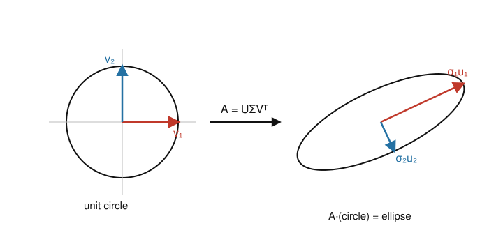

# Numerical Analysis · Lesson 5.2: QR & SVD for Least-Squares

> ⏱ ~15 min · Module 5: Least-Squares & a Taste of PDEs · Builds on: [Lesson 5.1](05-01-least-squares-normal-equations.md) (normal equations), [Lesson 3.3](03-03-qr-factorization.md) (QR factorization) · Unlocks: [Lesson 5.3](05-03-finite-differences-bvp.md) (finite differences for BVPs)

## Why this matters

Lesson [5.1](05-01-least-squares-normal-equations.md) fit an overdetermined system $Ax\approx b$ by solving the normal equations $A^\top A\,x = A^\top b$ — and left you with a warning: forming $A^\top A$ **squares the condition number**, $\kappa_2(A^\top A)=\kappa_2(A)^2$, so a mildly delicate fit can lose twice as many digits as it should. This lesson delivers the stable route it promised. **QR** solves least-squares with a triangular back-substitution and never forms $A^\top A$, so the conditioning stays at $\kappa(A)$, not its square. The **SVD** goes further: it hands you the singular values, which *are* the sensitivity report — they tell you the effective rank of your data, which directions are trustworthy, and which are noise waiting to be amplified. This is the workhorse behind every serious curve fit, every principal-component analysis, and every "the matrix is nearly singular, now what?" moment.

## The idea

**QR turns least-squares into a triangular solve.** An orthogonal matrix is a rigid rotation — it never stretches, so it never changes a vector's length. Write $A=QR$ with $Q$ having orthonormal columns and $R$ upper-triangular. Because $Q$ preserves lengths, minimizing $\lVert Ax-b\rVert$ is the *same problem* as minimizing $\lVert Rx-Q^\top b\rVert$ — and that one you solve instantly by back-substitution, since $R$ is triangular. No $A^\top A$ is ever built, so no condition number gets squared. This is exactly why Lesson [5.1](05-01-least-squares-normal-equations.md) told you QR is the professional's default.

**The SVD is the "what is this matrix really doing" decomposition.** Every matrix, however ugly, does the same three things in sequence: **rotate, stretch along axes, rotate again.** The stretch factors are the **singular values** $\sigma_1\ge\sigma_2\ge\cdots\ge0$. Picture the unit circle: $A$ maps it to an ellipse, and the semi-axis lengths of that ellipse are the $\sigma_i$ (the Picture below). A big $\sigma$ is a direction $A$ stretches; a tiny $\sigma$ is a direction $A$ nearly flattens to zero — and *inverting* the map means dividing by $\sigma$, so a tiny $\sigma$ is a direction where a whisker of noise in $b$ blows up into a huge swing in $x$. Read off the $\sigma$'s and you have read off the entire sensitivity of the problem before computing anything.

## The formal version

**Theorem (least-squares via QR).** Let $A$ be $m\times n$ with $m\ge n$ and full column rank. Factor $A=QR$ where $Q$ is $m\times n$ with orthonormal columns ($Q^\top Q=I_n$) and $R$ is $n\times n$ upper-triangular and invertible. Then the least-squares solution of $\min_x\lVert Ax-b\rVert_2$ is the unique solution of the triangular system
$$Rx = Q^\top b.$$

*In words:* factor once, multiply $b$ by $Q^\top$, back-substitute — done, and $A^\top A$ never appears.

*Why it's true.* Extend $Q$ to a full orthogonal matrix $\hat Q=[\,Q\ \ \tilde Q\,]$ (the columns of $\tilde Q$ span what's left). Since multiplying by the orthogonal $\hat Q^\top$ preserves length,
$$\lVert Ax-b\rVert^2 = \lVert \hat Q^\top(Ax-b)\rVert^2 = \lVert Rx - Q^\top b\rVert^2 + \lVert \tilde Q^\top b\rVert^2.$$
The second term doesn't contain $x$, so the minimum is reached by killing the first term: $Rx=Q^\top b$. The leftover $\lVert \tilde Q^\top b\rVert$ is exactly the residual norm. $\blacksquare$ The relevant conditioning is $\kappa_2(A)=\kappa_2(R)$ — **not** squared.

**Theorem (Singular Value Decomposition).** Every real $m\times n$ matrix $A$ factors as
$$A = U\Sigma V^\top,$$
with $U$ ($m\times m$) and $V$ ($n\times n$) **orthogonal** ($U^\top U=I$, $V^\top V=I$) and $\Sigma$ ($m\times n$) diagonal carrying the **singular values** $\sigma_1\ge\sigma_2\ge\cdots\ge\sigma_n\ge 0$.

*In words:* $A$ = rotate by $V^\top$, stretch axis $i$ by $\sigma_i$, rotate by $U$. The columns of $V$ (right-singular vectors) are the input axes; the columns of $U$ (left-singular vectors) are where they land. The $\sigma_i$ are the square roots of the eigenvalues of $A^\top A$, and
$$\kappa_2(A)=\frac{\sigma_1}{\sigma_n}\quad(\text{ratio of largest to smallest singular value}).$$

**Definition (Moore–Penrose pseudo-inverse).** With $A=U\Sigma V^\top$,
$$A^+ = V\,\Sigma^+ U^\top,\qquad \Sigma^+=\operatorname{diag}\!\Big(\tfrac{1}{\sigma_1},\dots,\tfrac{1}{\sigma_r},\,0,\dots,0\Big),$$
where $r$ is the rank: you **invert the nonzero singular values and leave the zeros alone** (and transpose $\Sigma$'s shape). Then
$$x = A^+ b$$
is the least-squares solution, and when $A$ is rank-deficient it is the *minimum-norm* one among all least-squares solutions.

*In words:* $A^+$ is the closest thing to $A^{-1}$ that exists even when $A$ is rectangular or singular — it inverts the stretch on the directions $A$ actually stretched, and does nothing on the directions $A$ flattened.

**Effective rank and truncated SVD.** In floating point a "zero" singular value shows up as something tiny (round-off, or genuine near-dependence in the data), not exactly $0$. The **effective (numerical) rank** is the number of singular values above a chosen threshold $\tau$:
$$r_{\text{eff}} = \#\{\,i : \sigma_i > \tau\,\}.$$
**Truncated SVD** forms the pseudo-inverse using only those, setting $1/\sigma_i \to 0$ for $\sigma_i \le \tau$. This throws away the noise-amplifying directions and **regularizes** the fit — trading a little bias for a large drop in variance.

## Picture

The SVD read geometrically: $A$ carries the unit circle to an ellipse. The right-singular vectors $v_1,v_2$ are the orthonormal input directions; they map to the ellipse's principal axes $\sigma_1 u_1$ and $\sigma_2 u_2$. The semi-axis lengths **are** the singular values. A long axis ($\sigma_1$) is a stretched, well-determined direction; a short axis ($\sigma_2$) is a squashed one — and to invert $A$ you divide by these lengths, so the short axis is where inversion magnifies error by $1/\sigma_2$. If $\sigma_2\to 0$, the ellipse collapses to a segment: the matrix is singular, $\kappa_2=\sigma_1/\sigma_2\to\infty$.

## Worked examples

**Example 1 (least-squares by QR — a line fit).** Fit $y=c_0+c_1x$ to the points $(0,1),(1,1),(2,3)$. The overdetermined system is $Ax\approx b$ with
$$A=\begin{pmatrix}1&0\\1&1\\1&2\end{pmatrix},\quad b=\begin{pmatrix}1\\1\\3\end{pmatrix},\quad x=\begin{pmatrix}c_0\\c_1\end{pmatrix}.$$

*Gram–Schmidt on the columns.* Column $a_1=(1,1,1)$: $\lVert a_1\rVert=\sqrt3$, so $q_1=\tfrac{1}{\sqrt3}(1,1,1)$ and $r_{11}=\sqrt3$. Column $a_2=(0,1,2)$: project out $q_1$,
$$r_{12}=q_1^\top a_2=\tfrac{0+1+2}{\sqrt3}=\sqrt3,\qquad a_2-r_{12}q_1=(0,1,2)-(1,1,1)=(-1,0,1).$$
Its norm is $\sqrt2$, so $q_2=\tfrac1{\sqrt2}(-1,0,1)$ and $r_{22}=\sqrt2$. Thus
$$R=\begin{pmatrix}\sqrt3&\sqrt3\\0&\sqrt2\end{pmatrix}.$$

*Form $Q^\top b$ and back-substitute.*
$$Q^\top b=\begin{pmatrix}q_1^\top b\\ q_2^\top b\end{pmatrix}=\begin{pmatrix}(1+1+3)/\sqrt3\\ (-1+0+3)/\sqrt2\end{pmatrix}=\begin{pmatrix}5/\sqrt3\\ \sqrt2\end{pmatrix}.$$
Back-substitution on $Rx=Q^\top b$: the bottom row gives $\sqrt2\,c_1=\sqrt2\Rightarrow c_1=1$; the top row gives $\sqrt3\,c_0+\sqrt3(1)=5/\sqrt3$, so $\sqrt3\,c_0=5/\sqrt3-\sqrt3=2/\sqrt3$, hence $c_0=\tfrac23$. The fit is
$$\boxed{\,y=\tfrac23 + x\,}.$$
*Check (residual orthogonal to the columns).* Predictions $\tfrac23,\tfrac53,\tfrac83$; residual $r=b-Ax=(\tfrac13,-\tfrac23,\tfrac13)$. Then $r^\top a_1=\tfrac13-\tfrac23+\tfrac13=0$ and $r^\top a_2=-\tfrac23+\tfrac23=0$ — the residual is orthogonal to the column space, the defining property of a least-squares fit. (Solving the normal equations $\begin{pmatrix}3&3\\3&5\end{pmatrix}x=\begin{pmatrix}5\\7\end{pmatrix}$ gives the same $x$, but QR got there without ever forming that matrix.)

**Example 2 (SVD and pseudo-inverse of a rank-deficient matrix).** Take
$$A=\begin{pmatrix}1&1\\1&1\end{pmatrix}.$$
The two columns are identical, so $A$ has rank 1 — one direction of information, one direction of nothing. Build the SVD from $A^\top A=\begin{pmatrix}2&2\\2&2\end{pmatrix}$, whose eigenvalues are $4$ and $0$:
$$\sigma_1=\sqrt4=2,\qquad \sigma_2=\sqrt0=0.$$
Right-singular vectors (eigenvectors of $A^\top A$): $v_1=\tfrac1{\sqrt2}(1,1)$ for eigenvalue $4$, and $v_2=\tfrac1{\sqrt2}(1,-1)$ for eigenvalue $0$. The first left-singular vector is $u_1=Av_1/\sigma_1=\tfrac1{\sqrt2}(1,1)$; complete with $u_2=\tfrac1{\sqrt2}(1,-1)$. So
$$A=U\Sigma V^\top,\quad U=V=\tfrac1{\sqrt2}\begin{pmatrix}1&1\\1&-1\end{pmatrix},\quad \Sigma=\begin{pmatrix}2&0\\0&0\end{pmatrix}.$$
Since $\sigma_2=0$, $\kappa_2(A)=\sigma_1/\sigma_2=\infty$ — the matrix is singular, no ordinary inverse exists. The pseudo-inverse inverts only the live singular value ($1/2$) and zeros the dead one:
$$A^+ = V\Sigma^+U^\top,\quad \Sigma^+=\begin{pmatrix}\tfrac12&0\\0&0\end{pmatrix}\ \Rightarrow\ A^+=\tfrac14\begin{pmatrix}1&1\\1&1\end{pmatrix}.$$
Now solve the least-squares problem for $b=(2,0)$. The data $b$ does not lie in the column space (which is the line spanned by $(1,1)$), so no exact solution exists; the pseudo-inverse gives the best one:
$$x=A^+b=\tfrac14\begin{pmatrix}1&1\\1&1\end{pmatrix}\begin{pmatrix}2\\0\end{pmatrix}=\begin{pmatrix}\tfrac12\\ \tfrac12\end{pmatrix}.$$
Reading it: $Ax=(1,1)$ is the orthogonal projection of $b=(2,0)$ onto the column space (residual $(1,-1)\perp(1,1)$ ✓), and among the infinitely many $x$ with $x_1+x_2=1$ that all produce $(1,1)$, the pseudo-inverse picked the one of smallest norm, $(\tfrac12,\tfrac12)$. **That is what $A^+$ does with rank deficiency: project $b$ onto what's reachable, then return the shortest $x$ that reaches it.**

*Sensitivity, and why truncation helps.* Suppose instead $A$ were *nearly* singular, $\sigma_1=2,\ \sigma_2=10^{-8}$. Then $A^+$ would contain a factor $1/\sigma_2=10^{8}$: any component of $b$ along $u_2$ — very possibly pure measurement noise — gets amplified a hundred-million-fold in $x$. Truncated SVD with threshold $\tau=10^{-6}$ zeros that direction ($1/\sigma_2\to0$), returning the same stable rank-1 answer as above and refusing to trust the noise. You lose the information $\sigma_2$ *might* have carried (a little bias) in exchange for not amplifying noise by $10^8$ (a huge variance cut).

## Watch out

- **You might think you should invert $\Sigma$** to build $A^+$ — but for a rectangular or singular $A$, $\Sigma^{-1}$ doesn't exist. $\Sigma^+$ *transposes* the shape and inverts **only the nonzero** singular values, leaving zeros as zeros. Inverting a $0$ (or a numerically tiny $\sigma$) is precisely the instability you're trying to avoid.
- **You might think "small singular value" means "small determinant" or "small entries"** — it means neither. $\kappa_2=\sigma_1/\sigma_n$ is scale-invariant; you can double every entry (doubling $\det$ by $2^n$) without changing a single condition number. The near-singularity lives in the *ratio* $\sigma_1/\sigma_n$, i.e. in how flat the ellipse is, not in its size.
- **You might think QR and SVD give different least-squares answers** — for a full-rank $A$ they give the *identical* $x$ (both equal $(A^\top A)^{-1}A^\top b$ in exact arithmetic). The difference is entirely numerical: both keep conditioning at $\kappa(A)$ instead of $\kappa(A)^2$, and the SVD additionally *diagnoses* rank and sensitivity. Use QR for a clean full-rank fit; reach for SVD when you suspect rank deficiency or need the singular values themselves.
- **You might think truncation is cheating** — it's regularization. Zeroing a $1/\sigma$ that would otherwise be $10^8$ is a deliberate bias-for-stability trade, the same bargain ridge regression makes (see Connections).

## One-liner

> QR solves least-squares by a triangular back-substitution at conditioning $\kappa(A)$; the SVD's singular values are the sensitivity report — big ones are signal, tiny ones are the noise-amplifiers you truncate.

## Problems

**P1 (🟢)** Fit a line $y=c_0+c_1x$ to $(-1,1),(0,2),(1,2)$ by QR. (Hint: with these $x$-values the two columns of $A$ are already orthogonal, so $R$ comes out **diagonal** — the Gram–Schmidt projection step vanishes.) Report $Q^\top b$, the triangular system, and the fitted line, and verify the residual is orthogonal to both columns.

**P2 (🟡)** A $2\times2$ matrix has SVD with $U=V=I$ and singular values $\sigma_1=4$, $\sigma_2=10^{-6}$ (so $A=\operatorname{diag}(4,10^{-6})$). (a) Give $\kappa_2(A)$. (b) Solve $Ax=b$ exactly for $b=(4,\,10^{-6})$, then for the slightly perturbed $b'=(4,\,2\times10^{-6})$; how large is the relative change in $x$ compared with the relative change in $b$? (c) Apply truncated SVD with threshold $\tau=10^{-3}$: write the truncated pseudo-inverse and the resulting $x$ for $b'$, and explain in one sentence why it is the more trustworthy answer if the second component of $b$ is just noise.

**P3 (🔴, optional)** Show that for $A$ with full column rank, the SVD pseudo-inverse equals the normal-equations operator: $A^+=(A^\top A)^{-1}A^\top$. (Use the thin SVD $A=U\Sigma V^\top$ with $U^\top U=I_n$ and $\Sigma$ invertible.) Then explain in one sentence why computing $x$ via QR or SVD is nonetheless preferable to literally forming $(A^\top A)^{-1}$.

Solutions

**P1** Design matrix and data:
$$A=\begin{pmatrix}1&-1\\1&0\\1&1\end{pmatrix},\qquad b=\begin{pmatrix}1\\2\\2\end{pmatrix}.$$
Columns $a_1=(1,1,1)$, $a_2=(-1,0,1)$ satisfy $a_1^\top a_2=-1+0+1=0$ — orthogonal, so the projection in Gram–Schmidt is zero. Norms: $\lVert a_1\rVert=\sqrt3$, $\lVert a_2\rVert=\sqrt2$, giving $q_1=\tfrac1{\sqrt3}(1,1,1)$, $q_2=\tfrac1{\sqrt2}(-1,0,1)$ and the **diagonal**
$$R=\begin{pmatrix}\sqrt3&0\\0&\sqrt2\end{pmatrix}.$$
Then
$$Q^\top b=\begin{pmatrix}(1+2+2)/\sqrt3\\ (-1+0+2)/\sqrt2\end{pmatrix}=\begin{pmatrix}5/\sqrt3\\ 1/\sqrt2\end{pmatrix}.$$
The system $Rx=Q^\top b$ decouples: $\sqrt3\,c_0=5/\sqrt3\Rightarrow c_0=\tfrac53$, and $\sqrt2\,c_1=1/\sqrt2\Rightarrow c_1=\tfrac12$. The fit is
$$y=\tfrac53+\tfrac12 x.$$
Check: predictions at $x=-1,0,1$ are $\tfrac76,\tfrac53,\tfrac{13}{6}$; residual $r=b-Ax=(1-\tfrac76,\,2-\tfrac53,\,2-\tfrac{13}{6})=(-\tfrac16,\tfrac13,-\tfrac16)$. Then $r^\top a_1=-\tfrac16+\tfrac13-\tfrac16=0$ ✓ and $r^\top a_2=\tfrac16+0-\tfrac16=0$ ✓. (Centering the $x$-values is exactly the trick that makes $a_1\perp a_2$: the intercept and slope decouple, which is why statisticians center regressors.)

**P2** (a) $\kappa_2(A)=\sigma_1/\sigma_2=4/10^{-6}=4\times10^{6}$.

(b) $A^{-1}=\operatorname{diag}(\tfrac14,10^{6})$. For $b=(4,10^{-6})$: $x=(4/4,\ 10^{-6}\cdot10^{6})=(1,1)$. For $b'=(4,\,2\times10^{-6})$: $x'=(1,\ 2\times10^{-6}\cdot10^{6})=(1,2)$. The data moved by $\lVert b'-b\rVert/\lVert b\rVert=10^{-6}/4=2.5\times10^{-7}$; the solution moved by $\lVert x'-x\rVert/\lVert x\rVert=1/\sqrt2\approx0.71$. The amplification is $0.71/(2.5\times10^{-7})\approx2.8\times10^{6}$ — on the order of $\kappa_2(A)$. A quarter-part-per-million wiggle in $b$ became a 70% swing in $x$, all of it along the $\sigma_2$ direction.

(c) With $\tau=10^{-3}$ only $\sigma_1=4>\tau$ survives, so $\Sigma^+_{\text{trunc}}=\operatorname{diag}(\tfrac14,0)$ and $A^+_{\text{trunc}}=\operatorname{diag}(\tfrac14,0)$. Then $x_{\text{trunc}}=A^+_{\text{trunc}}b'=(4/4,\ 0)=(1,0)$. This is more trustworthy because the second coordinate of $b$ enters $x$ only through the factor $1/\sigma_2=10^{6}$; if that coordinate is noise, the untruncated solve turns it into a wild $x_2$, whereas truncation discards that unresolvable direction entirely and returns the stable, resolvable part.

**P3** Use the thin SVD $A=U\Sigma V^\top$ with $U$ ($m\times n$, $U^\top U=I_n$), $V$ ($n\times n$ orthogonal), and $\Sigma$ ($n\times n$, invertible because full column rank $\Rightarrow$ all $\sigma_i>0$, so $\Sigma^+=\Sigma^{-1}$). Then
$$A^\top A=V\Sigma U^\top U\Sigma V^\top=V\Sigma^2V^\top\ \Rightarrow\ (A^\top A)^{-1}=V\Sigma^{-2}V^\top.$$
Therefore
$$(A^\top A)^{-1}A^\top=V\Sigma^{-2}V^\top\,\big(V\Sigma U^\top\big)=V\Sigma^{-2}\Sigma U^\top=V\Sigma^{-1}U^\top=A^+.$$
So the two operators agree in exact arithmetic. Numerically they differ sharply: forming $A^\top A$ squares the condition number ($\kappa_2(A^\top A)=\kappa_2(A)^2$) and can lose twice the digits, whereas the QR/SVD route applies $A^+$ (equivalently solves $Rx=Q^\top b$) at conditioning $\kappa_2(A)$ — never squaring it.

## Flashback

**From Lesson 5.1 (normal equations & the $\kappa^2$ blow-up):** For the design matrix
$$A=\begin{pmatrix}1&1\\0&\delta\end{pmatrix},\qquad \delta=10^{-3},$$
(a) form the normal-equations matrix $A^\top A$; (b) using $\det$ and $\operatorname{tr}$, estimate its eigenvalues and hence $\kappa_2(A^\top A)$; (c) deduce $\kappa_2(A)$ and confirm $\kappa_2(A^\top A)\approx\kappa_2(A)^2$; (d) roughly how many decimal digits does the normal-equations route cost versus the QR route, in double precision?

Solution

(a) $A^\top A=\begin{pmatrix}1&1\\1&1+\delta^2\end{pmatrix}$.

(b) $\operatorname{tr}=2+\delta^2\approx2$ and $\det=(1)(1+\delta^2)-1=\delta^2$. The eigenvalues $\lambda_{\pm}$ multiply to $\delta^2$ and sum to $\approx2$, so $\lambda_+\approx2$ and $\lambda_-\approx\delta^2/2$. Hence
$$\kappa_2(A^\top A)=\frac{\lambda_+}{\lambda_-}\approx\frac{2}{\delta^2/2}=\frac{4}{\delta^2}=\frac{4}{10^{-6}}=4\times10^{6}.$$

(c) The singular values of $A$ are $\sigma_i=\sqrt{\lambda_i}$, so $\kappa_2(A)=\sqrt{\kappa_2(A^\top A)}\approx\sqrt{4\times10^{6}}=2\times10^{3}$. Indeed $\kappa_2(A)^2=4\times10^{6}=\kappa_2(A^\top A)$ ✓ — forming $A^\top A$ squared the conditioning, exactly the Lesson [5.1](05-01-least-squares-normal-equations.md) warning.

(d) Digit loss $\approx\log_{10}\kappa$. Normal equations: $\log_{10}(4\times10^{6})\approx6.6$ digits. QR (which keeps $\kappa_2(A)$): $\log_{10}(2\times10^{3})\approx3.3$ digits. The naive route throws away about **3 extra digits** here, purely from the formulation — and the gap widens as $\delta$ shrinks. That is the whole reason to prefer QR/SVD.

## Connections

- **Backward:** QR least-squares is the payoff of the QR factorization from Lesson [3.3](03-03-qr-factorization.md) and the cure for the $\kappa(A^\top A)=\kappa(A)^2$ instability diagnosed in Lessons [3.2](03-02-cholesky-conditioning.md) and [5.1](05-01-least-squares-normal-equations.md). The singular values generalize the eigenvalue/condition-number story of Lesson [3.2](03-02-cholesky-conditioning.md) to non-symmetric and rectangular matrices — $\kappa_2=\sigma_1/\sigma_n$ is the definition those lessons quietly assumed.
- **Forward:** the pseudo-inverse and the "invert only what's resolvable" idea recur wherever discretized operators are nearly singular — including the linear systems from finite differences you meet next in Lesson [5.3](05-03-finite-differences-bvp.md).
- **Sideways (optimization):** truncated SVD is regularization by hard threshold; **ridge regression** does the soft version, replacing each $1/\sigma_i$ with $\sigma_i/(\sigma_i^2+\lambda)$ so tiny singular directions are damped smoothly rather than cut off. Both fight the same enemy — a small $\sigma$ amplifying noise — and both live in [convex-optimization](../../convex-optimization/syllabus.md), where the ridge/lasso least-squares problem is set up as a quadratic program. The bridge is exact: **least-squares ↔ normal equations ↔ regularized least-squares (ridge/lasso)** is one continuous story, and the singular values are the coordinates that make it legible.
