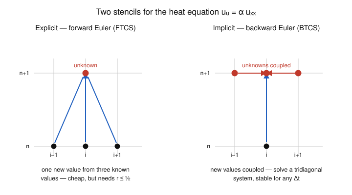

# Numerical Analysis · Lesson 5.4: The Heat Equation — Explicit vs. Implicit

> ⏱ ~15 min · Module 5: Least-Squares & a Taste of PDEs · Builds on: [Lesson 5.3](05-03-finite-differences-bvp.md) (central differences, tridiagonal solve), [Lesson 4.4](04-04-absolute-stability-stiffness.md) (absolute stability), [Lesson 4.1](04-01-euler-local-global-error.md) (Euler, local vs. global error) · Unlocks: nothing — **course complete**

## Why this matters

In [Lesson 5.3](05-03-finite-differences-bvp.md) you froze time and solved a boundary-value problem: one linear system, one answer. But most of physics is *unsteady* — heat spreading through a rod, a chemical diffusing, an option price relaxing toward expiry. Those are **evolution** PDEs: a spatial operator drives a state forward in time. The natural move is to reuse both halves of this course at once — discretize *space* with the finite-difference stencil (Module 5) and march *time* with an ODE stepper (Module 4). It works, but it hides a trap. The simplest, cheapest time-stepper has a hard speed limit: push the step size past it and your temperature field doesn't just get inaccurate, it **explodes into growing oscillations** — cold spots colder than absolute zero, in two or three steps. This lesson is where the whole *error-and-stability* arc of the course pays off: the blow-up is exactly the absolute-stability story of [Lesson 4.4](04-04-absolute-stability-stiffness.md), now wearing a PDE costume. It also closes the last item on the course's Dangerous Checklist — *discretize a heat problem and check that the scheme is consistent and stable.*

## The idea

The trick is called the **method of lines**, and it's almost embarrassingly simple: *discretize space, keep time continuous.*

Put a grid on the rod, $x_i = i\,\Delta x$. At each interior node let $u_i(t)$ be the temperature there — a function of time only. The heat equation $u_t = \alpha u_{xx}$ says "the rate of change equals $\alpha$ times the spatial curvature." Replace that curvature with the three-point second-difference stencil you already know from [Lesson 5.3](05-03-finite-differences-bvp.md):

$$u_{xx}(x_i) \approx \frac{u_{i-1} - 2u_i + u_{i+1}}{\Delta x^2}.$$

Now every node obeys an ordinary differential equation, coupled only to its two neighbors:

$$\frac{du_i}{dt} = \frac{\alpha}{\Delta x^2}\bigl(u_{i-1} - 2u_i + u_{i+1}\bigr).$$

*In words:* we've turned one PDE into a big system of ODEs — one "line" of time evolution per grid point (hence the name). And a system of ODEs is exactly what Module 4 knows how to march.

Which stepper? The cheapest is **forward Euler**: to advance, evaluate the right-hand side at *now* and take a step. That gives the **explicit** scheme. It's a formula — plug in the old values, read off the new ones. The alternative is **backward Euler**: evaluate the right-hand side at *the future* you're solving for. That's **implicit** — the unknowns appear on both sides, so each step costs a linear solve. Same PDE, two philosophies. The rest of the lesson is the fight between them, and the referee is stability.

## The formal version

Write $u_i^n$ for the temperature at node $i$ and time level $t_n = n\,\Delta t$, and define the single dimensionless number that governs everything:

$$\boxed{\,r = \frac{\alpha\,\Delta t}{\Delta x^2}\,}$$

*In words:* $r$ is the **mesh ratio** — how far heat diffuses in one time step measured in grid cells. It's the PDE's version of a step size.

**Explicit scheme (FTCS — Forward-Time, Centered-Space).** Apply forward Euler to the method-of-lines ODE:

$$u_i^{n+1} = u_i^n + r\bigl(u_{i-1}^n - 2u_i^n + u_{i+1}^n\bigr).$$

*In words:* the new value at a node is its old value nudged by $r$ times the local curvature — a straight formula, no solve. One node at level $n+1$ is built from three known nodes at level $n$ (left stencil in the Picture).

**Stability limit.** FTCS is only stable when

$$r \le \tfrac12 \qquad\Longleftrightarrow\qquad \Delta t \le \frac{\Delta x^2}{2\alpha}.$$

*In words:* the time step is capped by the **square** of the space step. Halve $\Delta x$ for a finer picture and you must **quarter** $\Delta t$ — four times as many steps, each on a bigger grid. Cross the line and the numerical solution grows without bound, flipping sign every step.

Where does $\tfrac12$ come from? Straight out of [Lesson 4.4](04-04-absolute-stability-stiffness.md). The method-of-lines system is $u' = M u$ with $M = \frac{\alpha}{\Delta x^2}L$, where $L = \operatorname{tridiag}(1,-2,1)$ is the second-difference matrix. Its eigenvalues are

$$\lambda_k = -4\sin^2\!\Bigl(\frac{k\pi}{2(N{+}1)}\Bigr) \in (-4,\,0),\qquad
\text{so}\quad \mu_k = \frac{\alpha}{\Delta x^2}\lambda_k \in \Bigl(-\tfrac{4\alpha}{\Delta x^2},\,0\Bigr).$$

Forward Euler on the test equation $y'=\mu y$ is absolutely stable exactly when $\Delta t\,\mu$ lands in the unit disk $|1+\Delta t\,\mu|\le 1$; for these real, negative $\mu$ that means $\Delta t\,\mu \in [-2,\,0]$. The most negative eigenvalue is $\mu_{\min}\to -4\alpha/\Delta x^2$, so we need

$$\Delta t\cdot\frac{4\alpha}{\Delta x^2}\le 2 \quad\Longrightarrow\quad \frac{\alpha\,\Delta t}{\Delta x^2}\le\tfrac12.$$

*In words:* the tiny grid cell has a lightning-fast decay mode ($\mu\approx-4\alpha/\Delta x^2$), and forward Euler's stability disk can only swallow it if the step is small enough. This is precisely **stiffness** from Lesson 4.4 — the fast mode dictates the step even after it has physically decayed to nothing.

**Implicit scheme (BTCS — Backward-Time, Centered-Space).** Apply backward Euler instead — evaluate the stencil at the *new* level:

$$u_i^{n+1} - r\bigl(u_{i-1}^{n+1} - 2u_i^{n+1} + u_{i+1}^{n+1}\bigr) = u_i^n.$$

Collecting the unknowns, each step is a tridiagonal system $(I - rL)\,u^{n+1} = u^{n}$:

$$-r\,u_{i-1}^{n+1} + (1+2r)\,u_i^{n+1} - r\,u_{i+1}^{n+1} = u_i^n,$$

solved in $O(N)$ by the Thomas algorithm — the same cheap tridiagonal solve from [Lesson 5.3](05-03-finite-differences-bvp.md).

**Unconditional stability.** BTCS's amplification factor for mode $k$ is $g_k = 1/(1 - r\lambda_k) = 1/(1 + r|\lambda_k|)$. Since $\lambda_k < 0$, every $g_k \in (0,1)$ for **any** $r > 0$: no step-size limit, ever. This is the **A-stability** of implicit Euler (Lesson 4.4): its stability region is the entire left half-plane, and the heat operator's eigenvalues live there.

**Consistency and the trade.** Both schemes are **consistent**: their local truncation error is $O(\Delta t) + O(\Delta x^2)$, which vanishes as the mesh refines (first-order in time, second in space). The **Lax equivalence theorem** then says the rest: *for a consistent scheme, stability is equivalent to convergence.* That's the punchline of the whole course in one line — get the error to vanish (consistency) **and** keep it from amplifying (stability), and only then does refining the mesh actually converge. FTCS buys its cheap explicit step by mortgaging stability to the $r\le\tfrac12$ limit; BTCS pays a linear solve per step to own its stability outright. Stability, note, is *not* accuracy — BTCS is still only first-order in time, so a huge $\Delta t$ stays stable while quietly smearing the answer.

## Picture

The two stencils *are* the two philosophies. Explicit: three known values (black) point up into one unknown (red) — a formula. Implicit: the three unknowns at the new level (red) are laced together, fed by the one known value below — a coupled system you must solve.

## Worked examples

**Example 1 (the stability limit, made concrete).** A rod with $\alpha = 1$, discretized at $\Delta x = 0.25$ (interior nodes at $x = 0.25, 0.5, 0.75$; ends held at $0$). The FTCS limit is

$$\Delta t \le \frac{\Delta x^2}{2\alpha} = \frac{0.0625}{2} = 0.03125,\qquad r_{\max} = \tfrac12.$$

To integrate out to $t = 1$ you'd need at least $1/0.03125 = 32$ explicit steps — and that's on a *coarse* 3-node grid. Refine to $\Delta x = 0.025$ (10× finer) and the cap drops by $100\times$ to $\Delta t \le 3.125\times10^{-4}$: over $3200$ steps for the same final time. That quadratic tax is the whole reason implicit methods exist.

**Example 2 (blow-up vs. bounded — a head-to-head).** Same grid, $\alpha=1$, three interior nodes with zero boundaries. Deliberately pick $\Delta t = 0.0625$, i.e. $r = 1$ — **double** the stable limit. Start from an oscillatory profile $u^0 = (1,\,-1,\,1)$ (the kind of ripple that finite-precision noise always contains).

*Explicit (FTCS), $r=1$.* The update is $u_i^{n+1} = u_{i-1}^n - u_i^n + u_{i+1}^n$ (boundaries $=0$):

$$
u^0=(1,-1,1)\;\to\;
u^1=\underbrace{(0{-}1{-}1,\;\,1{+}1{+}1,\;\,{-}1{-}1{+}0)}_{}=(-2,\,3,\,-2)
\;\to\;
u^2=(5,\,-7,\,5).
$$

Peak magnitude $1 \to 3 \to 7$, sign flipping every step — a growing sawtooth. Physically absurd (heat only *smooths*), and it never recovers: this is the $r>\tfrac12$ instability in the flesh.

*Implicit (BTCS), same $r=1$.* Now solve $(I - rL)u^1 = u^0$, i.e. the tridiagonal system with diagonal $1+2r = 3$ and off-diagonals $-r=-1$:

$$
\begin{pmatrix} 3 & -1 & 0\\ -1 & 3 & -1\\ 0 & -1 & 3\end{pmatrix}
\begin{pmatrix} u_1^1\\ u_2^1\\ u_3^1\end{pmatrix}
=\begin{pmatrix} 1\\ -1\\ 1\end{pmatrix}.
$$

By symmetry $u_1^1=u_3^1=a$, $u_2^1=b$: row 1 gives $3a-b=1$, row 2 gives $-2a+3b=-1$. Solving, $a=\tfrac{2}{7}\approx0.286$, $b=-\tfrac17\approx-0.143$:

$$u^1_{\text{impl}} = \bigl(\tfrac27,\,-\tfrac17,\,\tfrac27\bigr)\approx(0.286,\,-0.143,\,0.286).$$

The ripple **shrank** — peak $1 \to 0.286$ — exactly as diffusion should, at a step size where the explicit scheme detonated. Same PDE, same $r$, opposite fates: that's unconditional stability. (Check: $3\cdot\tfrac27-(-\tfrac17)=\tfrac67+\tfrac17=1$. ✓)

## Watch out

- **You might think a smaller step is always safer — but for FTCS "small" is measured in $\Delta x^2$, not $\Delta t$ alone.** A step that's rock-stable on a coarse grid becomes wildly unstable the moment you refine space and forget to shrink $\Delta t$ by the *square*. Always check $r$, never just $\Delta t$.
- **You might think unconditional stability means the implicit answer is accurate at any step — it doesn't.** Stability only promises the solution stays *bounded*. BTCS with a giant $\Delta t$ is stable but first-order-in-time inaccurate: it over-smooths transients. Stability $\neq$ accuracy — the two are separate budgets (the course's recurring refrain). The fix, **Crank–Nicolson** — average FTCS and BTCS for $O(\Delta t^2)$ *and* unconditional stability — lives in `pdes`.
- **You might think the $r\le\tfrac12$ bound is about resolution — it's about eigenvalues.** The unstable modes are the *highest-frequency* grid ripples ($\lambda_k\to-4$), whose $\mu_k\approx-4\alpha/\Delta x^2$ falls outside forward Euler's stability disk. The instability is seeded by round-off ([Lesson 1.1](01-01-floating-point-roundoff.md)) — you don't even need a rough initial condition; $\varepsilon_{\text{mach}}$-sized noise is enough to blow up.

## One-liner

> Method of lines turns a PDE into stiff ODEs; explicit stepping is cheap but caged by $r=\alpha\Delta t/\Delta x^2\le\tfrac12$, while implicit stepping pays a tridiagonal solve to break the cage entirely.

## Problems

**P1 (🟢)** A diffusion problem has $\alpha = 2$ and is discretized with $\Delta x = 0.1$. (a) Find the largest time step $\Delta t$ for which the explicit FTCS scheme is stable, and the corresponding mesh ratio $r$. (b) You now halve the space step to $\Delta x = 0.05$ for a sharper picture. By what factor must $\Delta t$ change to stay stable? (c) What is the step-size limit for the implicit BTCS scheme on either grid?

**P2 (🟡)** Take $\alpha = 1$, $\Delta x = 0.25$ (three interior nodes, zero boundaries), and choose $\Delta t = 0.04$. (a) Compute $r$ and decide whether FTCS is stable. (b) Starting from $u^0 = (1,\,-1,\,1)$, take **one** FTCS step and report $u^1$. Does the peak grow or shrink? (c) In one sentence, say what a stable choice of $\Delta t$ would have been.

**P3 (🔴, optional)** *Von Neumann stability analysis — where the $\tfrac12$ really comes from.* Substitute the Fourier mode $u_j^n = g^n e^{\mathrm{i}\theta j}$ (with $\theta = k\,\Delta x$) into the FTCS update and show the amplification factor is

$$g(\theta) = 1 - 4r\sin^2\!\tfrac{\theta}{2}.$$

Then impose $|g|\le 1$ for **all** $\theta$ to recover $r\le\tfrac12$. Finally, run the same substitution through BTCS and show $g_{\text{impl}}(\theta) = \dfrac{1}{1 + 4r\sin^2(\theta/2)}$, hence $|g_{\text{impl}}|<1$ for every $r>0$ — unconditional stability.

Solutions

**P1** (a) The limit is $\Delta t \le \dfrac{\Delta x^2}{2\alpha} = \dfrac{0.01}{4} = 0.0025$; at that step $r = \tfrac12$. (b) $\Delta t \le \dfrac{\Delta x^2}{2\alpha}$ scales like $\Delta x^2$, so halving $\Delta x$ **quarters** the allowed step: new limit $\dfrac{0.0025}{4}=6.25\times10^{-4}$ — a factor of $\tfrac14$. (Combined with twice as many spatial nodes, refining costs about $8\times$ the total work.) (c) BTCS is unconditionally stable — **no limit** on $\Delta t$ on either grid (accuracy, not stability, sets the step).

**P2** (a) $r = \dfrac{\alpha\Delta t}{\Delta x^2} = \dfrac{1\cdot 0.04}{0.0625} = 0.64$. Since $0.64 > \tfrac12$, FTCS is **unstable**.

(b) Update $u_i^{1} = u_i^0 + r(u_{i-1}^0 - 2u_i^0 + u_{i+1}^0)$ with $r=0.64$, boundaries $0$:
- $u_1^1 = 1 + 0.64(0 - 2(1) + (-1)) = 1 + 0.64(-3) = 1 - 1.92 = -0.92$,
- $u_2^1 = -1 + 0.64(1 - 2(-1) + 1) = -1 + 0.64(4) = -1 + 2.56 = 1.56$,
- $u_3^1 = -0.92$ (by symmetry).

So $u^1 = (-0.92,\,1.56,\,-0.92)$. The peak magnitude **grew** from $1$ to $1.56$ and the sign pattern stayed oscillatory — the signature of the instability, even for $r$ only modestly above $\tfrac12$.

(c) Any $\Delta t \le \dfrac{\Delta x^2}{2\alpha} = \dfrac{0.0625}{2} = 0.03125$ (i.e. $r\le\tfrac12$) would be stable — e.g. $\Delta t = 0.03$.

**P3** Write $s = \sin^2(\theta/2)$. Substitute $u_j^n = g^n e^{\mathrm{i}\theta j}$ into $u_j^{n+1} = u_j^n + r(u_{j-1}^n - 2u_j^n + u_{j+1}^n)$ and divide through by $g^n e^{\mathrm{i}\theta j}$:

$$g = 1 + r\bigl(e^{-\mathrm{i}\theta} - 2 + e^{\mathrm{i}\theta}\bigr) = 1 + r\bigl(2\cos\theta - 2\bigr).$$

Using $1 - \cos\theta = 2\sin^2(\theta/2)$ gives $g = 1 - 4r\sin^2(\theta/2) = 1 - 4rs$, as claimed. Now $s$ ranges over $[0,1]$ as $\theta$ sweeps the grid, so $g$ ranges over $[1-4r,\,1]$. The upper end is always $\le 1$; the binding constraint is the lower end:

$$|g|\le 1 \ \text{for all }\theta \iff 1 - 4r \ge -1 \iff r \le \tfrac12.$$

The worst offender is the highest-frequency mode $\theta = \pi$ ($s=1$), the sawtooth of Example 2 — exactly the mode that blew up.

For BTCS, substitute into $u_j^{n+1} - r(u_{j-1}^{n+1} - 2u_j^{n+1} + u_{j+1}^{n+1}) = u_j^n$:

$$g\bigl[1 - r(2\cos\theta - 2)\bigr] = 1 \ \Longrightarrow\ g_{\text{impl}} = \frac{1}{1 + 4r\sin^2(\theta/2)} = \frac{1}{1 + 4rs}.$$

The denominator is $\ge 1$ for every $r>0$ and every $\theta$, so $0 < g_{\text{impl}} \le 1$ always: **unconditionally stable**, and strictly decaying for any mode with $s>0$. $\blacksquare$

## Flashback

**From Lesson 4.4 (Absolute Stability & Stiffness):** Consider the scalar test equation $y' = -30\,y$, $y(0)=1$ (true solution $y(t)=e^{-30t}$, a fast decay to $0$). (a) Find the largest step $h$ for which **forward Euler** is absolutely stable. (b) Does **backward Euler** have any such limit? Relate your answers to why FTCS needs $r\le\tfrac12$ but BTCS does not.

Solution

(a) Forward Euler on $y'=\lambda y$ gives $y^{n+1} = (1+h\lambda)y^n$; absolute stability requires $|1+h\lambda|\le 1$. With $\lambda = -30$: $|1 - 30h| \le 1 \Rightarrow -1 \le 1-30h \le 1 \Rightarrow 0 \le 30h \le 2$, so

$$h \le \tfrac{2}{30} = \tfrac{1}{15} \approx 0.0667.$$

Past that, the numerical solution alternates sign and grows — a decaying true solution turned into a blow-up.

(b) Backward Euler gives $y^{n+1} = \dfrac{1}{1-h\lambda}y^n = \dfrac{1}{1+30h}y^n$, whose factor has magnitude $<1$ for **every** $h>0$: no stability limit (A-stable).

*The link:* the heat operator's eigenvalues are $\mu_k \in (-4\alpha/\Delta x^2,\,0)$ — a whole spectrum of decay rates, the fastest as extreme as $-30$ is here (and far worse as the grid refines). FTCS is forward Euler, so **every** $\mu_k$ must satisfy $|1+\Delta t\,\mu_k|\le1$; the fastest mode forces $\Delta t\le\Delta x^2/(2\alpha)$, i.e. $r\le\tfrac12$. BTCS is backward Euler, A-stable, so no mode can ever impose a limit. The PDE stability constraint is this scalar flashback, applied to the stiffest eigenvalue.

## Connections

- **Backward:** this lesson is the confluence of the whole course. Space is discretized with the central-difference stencil and tridiagonal solve of [Lesson 5.3](05-03-finite-differences-bvp.md); time is marched with forward/backward Euler from [Lesson 4.1](04-01-euler-local-global-error.md); and the $r\le\tfrac12$ limit is the absolute-stability region of [Lesson 4.4](04-04-absolute-stability-stiffness.md) applied to the second-difference operator's eigenvalues. The instability is seeded by the round-off of [Lesson 1.1](01-01-floating-point-roundoff.md) — the *error-and-stability* through-line, closed. With this, the last Dangerous Checklist item — *discretize a heat problem and check consistency and stability* — is covered.
- **Sideways (the PDE bridge):** we have taken only a *taste* of PDE numerics. Full time-stepping theory (Crank–Nicolson and its $O(\Delta t^2)$ accuracy, higher-dimensional heat/wave/advection equations, the CFL condition for hyperbolic problems, von Neumann analysis in general, and finite elements) is the subject of [`pdes`](../../pdes/syllabus.md). The method of lines, the mesh ratio $r$, and the explicit-vs-implicit tension you met here are exactly its opening moves.
- **Sideways (linear algebra):** every implicit step is a tridiagonal solve — Cholesky/LU on a banded, symmetric-positive-definite matrix ([Lesson 3.2](03-02-cholesky-conditioning.md)). Scale to 2-D or 3-D and $(I - rL)$ becomes large and sparse, and you'd reach for the **iterative methods** of [Lesson 3.4](03-04-iterative-methods.md) rather than a direct factorization — the sparse-solver payoff coming full circle.
- **Course complete.** You can now predict where floating-point precision dies, separate an ill-conditioned problem from an unstable algorithm, find roots and fit interpolants, integrate and differentiate with honest error bars, solve and factor linear systems, march ODEs while respecting their stability regions, fit least-squares the stable way, and take the first honest step into a PDE. Every method came with the same question — *how does error enter, propagate, and get controlled?* — and you can now answer it.
