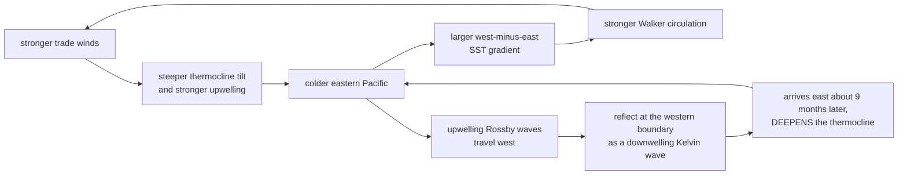

# Physical Oceanography · Lesson 5.5: The Walker circulation, the Bjerknes feedback and ENSO

> ⏱ ~15 min · Module 5: Waves, tides and the equatorial ocean · Builds on: [5.4](05-04-equatorial-waves-undercurrent.md), [3.5](03-05-coastal-upwelling-eastern-boundary.md) · Unlocks: [6.5](06-05-observing-the-ocean.md)

## Why this matters

El Niño is the largest year-to-year climate signal on the planet. It shifts rainfall across the tropics and well beyond, drives droughts in Australia and Indonesia and floods in Peru and California, collapses the world's largest fishery, and adds a tenth of a degree to global mean surface temperature in its peak year. [climate-science 3.4](../../climate-science/lessons/03-04-internal-variability-detection.md) treated it as internal variability and as the noise against which forced trends must be detected. This lesson supplies the mechanism, which is the debt that lesson left outstanding.

The mechanism is the most important example in geophysics of a **coupled instability**: neither the ocean nor the atmosphere would oscillate on its own, and the oscillation exists only in their interaction. Jacob Bjerknes identified the positive feedback in 1969. What he could not explain was why it does not simply run away, and the answer — supplied twenty years later — is that the ocean's own waveguide provides a *delayed negative feedback* with a lag of about nine months ([5.4](05-04-equatorial-waves-undercurrent.md)). A positive feedback with a delayed negative one is the canonical recipe for an oscillator.

## The idea

**The Walker circulation is the atmosphere's response to the ocean's temperature gradient.** The western Pacific warm pool is 29 °C; the eastern cold tongue is 23 °C. Air rises over the warm water, flows east aloft, sinks over the cold water and returns west at the surface. That returning surface flow *is* the trade winds — so the atmosphere's overturning cell is driven by the sea surface temperature difference it helps create.

**Bjerknes's feedback closes the loop.** Strong trades push more water west, tilt the thermocline more steeply, upwell colder water in the east, deepen the temperature contrast, strengthen the Walker circulation, and hence strengthen the trades. **Every arrow is positive.** A perturbation in any of them amplifies itself, in either direction: weaken the trades and the east warms, the gradient collapses, the Walker cell weakens, and the trades weaken further. That runaway is El Niño; the opposite is La Niña.

**But it stops, and turns around.** A pure positive feedback would saturate and stay put. ENSO oscillates instead, with a period of two to seven years, which means something must reverse it — and reverse it *late*, because an instantaneous negative feedback would simply damp the growth rather than produce oscillation.

**The reverser is a wave, and the lateness is its travel time.** A weakening of the trades launches not only a downwelling Kelvin wave eastward (which warms the east and *amplifies* the event) but also upwelling Rossby waves westward. Those reflect off the western boundary as an upwelling Kelvin wave, which crosses back east and *shoals* the thermocline — cooling the east and terminating the event. The round trip is about nine months ([5.4](05-04-equatorial-waves-undercurrent.md)). **The ocean remembers what the atmosphere did last year and answers it.**

**An equivalent account works with heat content rather than waves.** In the **recharge oscillator** view, the key variable is the total warm-water volume above the thermocline in the equatorial band. El Niño *discharges* it poleward, leaving the equator with an anomalously shallow thermocline that predisposes it to La Niña; La Niña recharges it. Warm water volume leads sea surface temperature by about two seasons. The two accounts are complementary rather than rival — the recharge picture is the wave picture integrated over the basin — and the recharge index is what operational forecasters actually watch.

## The formal version

**The Bjerknes feedback, as a loop.**

*In words: the outer loop (A to E) is Bjerknes's positive feedback, and the lower branch (C, F, G, H) is the delayed negative feedback that turns it around.* The lower branch has the opposite sign to the upper one and acts nine months late — which is exactly the structure that makes an oscillator rather than a runaway.

**The delayed oscillator.** Let $T$ be the eastern Pacific sea-surface temperature anomaly. The simplest model that captures both branches is

$$\boxed{\ \frac{dT}{dt} = a\,T \;-\; b\,T(t-\tau) \;-\; \varepsilon T^3\ }$$

*In words: local coupled growth at rate $a$, minus a delayed negative feedback of strength $b$ acting $\tau$ ago, minus a nonlinear term that limits the amplitude.* The cubic term does no work in setting the period; drop it and look for oscillatory solutions $T \propto e^{\lambda t}$ with $\lambda = i\omega$:

$$i\omega = a - b\,e^{-i\omega\tau} = a - b\cos\omega\tau + i\,b\sin\omega\tau.$$

Separating real and imaginary parts,

$$\cos\omega\tau = \frac{a}{b}, \qquad \omega = b\sin\omega\tau.$$

Given $\tau$ and the ratio $a/b$, these determine the period. Some values:

| $a/b$ | $\omega\tau$ | Period $/\tau$ | Period for $\tau = 9.5$ months |
|---|---|---|---|
| 0 | $\pi/2$ | 4.00 | 3.2 yr |
| 0.5 | $\pi/3$ | 6.00 | 4.8 yr |
| 0.8 | 0.6435 | 9.76 | 7.7 yr |

**A nine-month delay produces a period of three to eight years**, which brackets ENSO's observed two to seven. Note that the period is *not* the delay: it is several times the delay, and the multiplier depends on the coupling strength.

**The recharge oscillator.** Writing $h$ for the equatorial warm-water volume anomaly and $T$ for the eastern SST anomaly, Jin's model is

$$\frac{dT}{dt} = \gamma h + \sigma T, \qquad \frac{dh}{dt} = -\alpha T,$$

*In words: warm water volume feeds SST, and SST discharges warm water volume.* This is a linear oscillator: differentiating gives $\ddot T - \sigma\dot T + \alpha\gamma T = 0$, a damped or growing oscillation with period $2\pi/\sqrt{\alpha\gamma}$ and a **quarter-cycle phase lag** between $h$ and $T$. For a four-year period, that lag is one year — and observationally, warm water volume leads NINO3.4 SST by two to three seasons. $\checkmark$

**The observational indices.**

| Index | Definition | El Niño threshold |
|---|---|---|
| NINO3.4 SST anomaly | 5°N–5°S, 170°W–120°W | $> +0.5$ K for five overlapping 3-month means |
| Southern Oscillation Index | normalized Tahiti minus Darwin sea-level pressure | strongly negative |
| Warm Water Volume | volume above the 20 °C isotherm, 5°N–5°S, 120°E–80°W | leads SST by 2–3 seasons |

**Magnitudes at the peak of a strong event** (1982–83, 1997–98, 2015–16):

| Quantity | Normal | Strong El Niño |
|---|---|---|
| Eastern Pacific SST | 23 °C | 28 °C |
| West-minus-east SST gradient | 6 K | 1 K |
| Eastern thermocline depth | 50 m | 100–150 m |
| Trade wind stress | $-0.05\ \mathrm{N\,m^{-2}}$ | near zero, sometimes westerly |
| Peruvian anchoveta catch | millions of tonnes | near zero |
| Global mean surface temperature | — | $+0.1$ to $+0.2$ K in the peak year |

**Teleconnections.** ENSO's global reach works through the atmosphere: the shifted tropical heating changes where deep convection occurs, and the resulting anomalous upper-level divergence radiates stationary Rossby wave trains into both hemispheres (the Pacific–North American pattern is the best known). This is why El Niño affects Californian rainfall, Atlantic hurricane counts (suppressed, via increased vertical wind shear) and southern African drought, none of which is in the Pacific.

## Picture

The Mermaid diagram above is this lesson's picture: the outer loop is Bjerknes's positive feedback, the lower branch is the delayed reversal, and the entire behaviour of ENSO — growth, saturation, termination, overshoot into the opposite phase — follows from those two paths having opposite signs and different timing.

## Worked examples

**Example 1 (mechanical — from wind change to thermocline to SST).** The trades weaken from $\tau_x = -0.05$ to $-0.02\ \mathrm{N\,m^{-2}}$ across a 15,000 km basin with $H = 150\ \mathrm{m}$, $\Delta\rho = 4\ \mathrm{kg\,m^{-3}}$, $\rho_0 = 1027$, and an eastern thermocline initially at 50 m.

(a) *Reduced gravity.* $g' = 9.81\times4/1027 = 0.0382\ \mathrm{m\,s^{-2}}$.

(b) *Thermocline displacement, before and after.*
$$\Delta h_{\text{before}} = \frac{|\tau_x|L}{\rho_0 g'H} = \frac{0.05\times1.5\times10^{7}}{1027\times0.0382\times150} = \frac{7.5\times10^{5}}{5885} = 127\ \mathrm{m},$$
$$\Delta h_{\text{after}} = \frac{0.02\times1.5\times10^{7}}{5885} = 51\ \mathrm{m}.$$

(c) *The eastern thermocline.* The tilt relaxes about the basin's centre, so the eastern end deepens by about half the change in total displacement:

$$\delta h_{\text{east}} \approx \frac{127-51}{2} = 38\ \mathrm{m},$$

taking it from 50 m to about **88 m**.

(d) *The SST consequence.* Local Ekman upwelling draws water from roughly 50 to 60 m ([2.4](02-04-ekman-pumping-wind-stress-curl.md)). With the thermocline at 88 m, that water is now drawn from *within* the warm surface layer rather than from beneath it. The upwelled water is therefore near-surface temperature rather than thermocline temperature — a difference of 4 to 6 K. **The cold tongue disappears not because upwelling stops but because it stops reaching anything cold.**

(e) *The timescale.* The adjustment travels as a Kelvin wave at 2.39 m s⁻¹, so the eastern Pacific feels the western wind change in $1.5\times10^{7}/2.39 = 73$ days. This is why El Niño's onset is a matter of months, not years.

**Example 2 (why you'd care — why it oscillates instead of running away).** Suppose the Bjerknes feedback had no delayed reverser. Model the growth as $dT/dt = aT$ with a coupled growth rate corresponding to an e-folding time of 4 months. (a) Compute the warming after two years. (b) Explain what actually stops it. (c) Using the delayed oscillator with $\tau = 9.5$ months and $a/b = 0.5$, compute the period and compare with observations.

(a) $$a = \frac{1}{4\ \mathrm{months}} = 0.25\ \mathrm{month^{-1}}, \qquad T(24) = T_0e^{0.25\times24} = T_0e^{6} = 403\,T_0.$$

A 0.1 K perturbation becomes 40 K in two years. **Obviously impossible**, and the impossibility is the point: pure Bjerknes feedback is violently unstable, so the observed behaviour must be dominated by whatever limits it.

(b) Two things limit it, and only one produces oscillation.

- **Nonlinear saturation** ($-\varepsilon T^3$): the thermocline can only get so deep, the trades can only fall to zero, and the SST gradient cannot reverse much. This bounds the amplitude but would leave the system parked in a permanent El Niño.
- **The delayed negative feedback**: the reflected upwelling Kelvin wave arrives nine months later and pushes the other way. This is what turns the event around and drives the overshoot into La Niña.

**Saturation explains the amplitude; the delay explains the oscillation.** A model with only the first is a switch; a model with only the second is a linear oscillator with unbounded amplitude; the real system needs both.

(c) From the table, $a/b = 0.5$ gives $\omega\tau = \pi/3$ and a period of $6\tau$:

$$P = 6\times9.5 = 57\ \mathrm{months} = 4.75\ \mathrm{yr}.$$

Against an observed 2 to 7 years, with a spectral peak near 4 years. **A model with two parameters, one of them a wave travel time computed in [5.4](05-04-equatorial-waves-undercurrent.md) from a density contrast and a layer depth, lands on the observed period.**

*The point.* Note carefully what has and has not been explained. The **timescale** is explained, and explained well: it comes from the ocean's wave travel time, and no atmospheric process has a comparable memory. What is *not* explained is the irregularity — real ENSO events are not periodic, they vary in amplitude by a factor of several, and some decades have many and some few. That irregularity comes from the nonlinearity, from stochastic forcing by westerly wind bursts and the Madden–Julian Oscillation, and from interactions with the slowly-varying background state. **A model that gets the period right is not thereby a forecasting model**, and ENSO prediction skill still falls off sharply beyond about six months and collapses across the boreal spring — the "spring predictability barrier", which occurs because that is when the warm water volume is near zero and the system has least memory of its own state.

## Watch out

- **You might think** El Niño is caused by the trades weakening. **Actually** in a coupled oscillator there is no external cause: the weakening trades are as much an effect as a cause, since they respond to the SST gradient that they themselves create. Asking "what causes El Niño" is like asking which end of a pendulum's swing causes the other.
- **You might think** the nine-month wave round trip is ENSO's period. **Actually** it is the *delay*, and the period of a delayed-feedback oscillator is four to ten times the delay depending on the coupling strength. Getting this wrong gives a period of nine months instead of four years.
- **You might think** the recharge and delayed-oscillator theories are competing. **Actually** they describe the same physics at different levels of aggregation: the recharge oscillator's warm-water-volume variable is what you get by integrating the wave field over the basin. Both are used, and the recharge index is the more practically useful because it is directly observable from Argo and the mooring array.

## One-liner

> The trades cool the eastern Pacific, which strengthens the Walker circulation, which strengthens the trades — a positive feedback that would run away, except that the same wind change launches waves whose nine-month round trip across the equatorial waveguide returns to reverse it, turning a runaway into an oscillator with a period of two to seven years.

## Problems

**P1 (🟢)** During a strong El Niño the west-minus-east SST gradient falls from 6 K to 1 K. (a) State what happens to the Walker circulation and to the trade winds, and why. (b) State what happens to the thermocline tilt, and whether this reinforces or opposes the SST change. (c) Name the feedback.

**P2 (🟡)** Use the delayed oscillator $dT/dt = aT - bT(t-\tau)$ with $\tau = 8$ months. (a) For $a/b = 0.3$, solve $\cos\omega\tau = a/b$ and $\omega = b\sin\omega\tau$ for $\omega\tau$, and hence find the period in units of $\tau$. (b) Convert to years. (c) Repeat for $a/b = 0.7$. (d) State how the period depends on the coupling strength and explain physically why stronger local growth gives a *longer* period.

**P3 (🔴, optional)** The recharge oscillator: $dT/dt = \gamma h + \sigma T$, $dh/dt = -\alpha T$. (a) Eliminate $h$ to obtain a second-order equation for $T$. (b) Identify the natural frequency and the growth or damping rate. (c) For an observed period of 4 years and neutral stability ($\sigma = 0$), compute $\alpha\gamma$. (d) Show that $h$ leads $T$ by a quarter cycle, and state the lead in months. (e) Observations put the warm-water-volume lead at 2 to 3 seasons. Compare, and state what a systematic discrepancy would imply about the model.

Solutions

**P1** (a) The Walker circulation **weakens**, and so do the trades. The Walker cell is a thermally direct circulation driven by the zonal SST contrast: air rises where the ocean is warm and sinks where it is cold. Collapsing the contrast from 6 K to 1 K removes most of the driving, so the overturning weakens — and since the trade winds *are* the surface branch of that overturning, they weaken with it.

(b) The thermocline tilt **flattens**, because the tilt is maintained by the trade-wind stress ([5.4](05-04-equatorial-waves-undercurrent.md)): $\partial h/\partial x = \tau_x/(\rho_0g'H)$. A flatter thermocline means a deeper thermocline in the east, so upwelling brings up warmer water, so the eastern SST rises further.

This **reinforces** the SST change — the loop is positive.

(c) The **Bjerknes feedback**.

**P2** (a) $$\cos\omega\tau = 0.3 \;\Longrightarrow\; \omega\tau = 1.2661\ \mathrm{rad}.$$

Period: $P = 2\pi/\omega$, and $\omega = 1.2661/\tau$, so

$$\frac{P}{\tau} = \frac{2\pi}{1.2661} = 4.963.$$

(b) $$P = 4.963\times8 = 39.7\ \mathrm{months} = 3.31\ \mathrm{yr}.$$

(c) $$\cos\omega\tau = 0.7 \;\Longrightarrow\; \omega\tau = 0.7954, \qquad \frac{P}{\tau} = \frac{2\pi}{0.7954} = 7.899,$$
$$P = 7.899\times8 = 63.2\ \mathrm{months} = 5.27\ \mathrm{yr}.$$

(d) The period **increases** with the coupling ratio $a/b$: from 3.3 years at $a/b = 0.3$ to 5.3 years at $a/b = 0.7$. In the limit $a\to b$ the period diverges.

Physically: $a$ is the rate at which the local coupled feedback amplifies an anomaly, and $b$ is the strength of the delayed reversal. A larger $a$ means the growth is more vigorous relative to the reversal, so the returning wave has more work to do before it can turn the event around — and the system spends longer in each phase. In the extreme $a \ge b$ the reversal is too weak ever to overcome the growth, the oscillation ceases, and the system locks into a permanent warm or cold state.

That limit is not merely formal. Paleoclimate evidence and some model simulations of the early Pliocene suggest a **permanent El Niño-like state**, and the standard interpretation is exactly this: a background state in which the coupled growth outran the delayed reversal.

**P3** (a) From the second equation, $T = -\dot h/\alpha$. Differentiate the first:

$$\ddot T = \gamma\dot h + \sigma\dot T = \gamma(-\alpha T) + \sigma\dot T,$$
$$\boxed{\ \ddot T - \sigma\dot T + \alpha\gamma\,T = 0.\ }$$

(b) This is a damped (or anti-damped) harmonic oscillator. Comparing with $\ddot T + 2\zeta\omega_0\dot T + \omega_0^2T = 0$:

$$\omega_0 = \sqrt{\alpha\gamma}, \qquad \text{growth rate} = \frac{\sigma}{2}.$$

$\sigma > 0$ means self-excited (growing); $\sigma < 0$ means damped and requiring stochastic forcing to sustain the oscillation. **Which of these describes the real ENSO is a genuine open question** — the "self-sustained versus noise-driven" debate — and the observational record is too short to settle it.

(c) With $\sigma = 0$ and $P = 4$ yr $= 1.262\times10^{8}$ s:

$$\omega_0 = \frac{2\pi}{P} = \frac{6.2832}{1.262\times10^{8}} = 4.978\times10^{-8}\ \mathrm{s^{-1}},$$
$$\alpha\gamma = \omega_0^2 = 2.48\times10^{-15}\ \mathrm{s^{-2}}.$$

(d) With $\sigma = 0$, take $T = T_0\cos\omega_0 t$. Then from $\dot h = -\alpha T$:

$$h = -\frac{\alpha T_0}{\omega_0}\sin\omega_0 t = \frac{\alpha T_0}{\omega_0}\cos\!\left(\omega_0 t + \frac{\pi}{2}\right).$$

So $h$ has phase $+\pi/2$ relative to $T$ — it **leads $T$ by a quarter cycle**. For a 4-year period:

$$\text{lead} = \frac{4}{4} = 1\ \mathrm{yr} = 12\ \mathrm{months}.$$

(e) Observations give 2 to 3 seasons, i.e. 6 to 9 months, against the model's 12. The model **overestimates the lead by 30 to 50 percent**.

A systematic discrepancy of that size is informative rather than fatal, and it points at the term the derivation set to zero. With $\sigma \ne 0$ the two variables are no longer in exact quadrature: a positive $\sigma$ (self-excited) rotates the phase relationship so that $h$ leads by *less* than a quarter cycle. Fitting the observed 6 to 9 month lead therefore implies $\sigma > 0$ — a **self-excited** oscillator, weakly unstable and saturated by nonlinearity, rather than a damped one sustained by noise.

That is a real inference from a phase lag, and it illustrates something general: **in a two-variable oscillator, the amplitude ratio tells you about the coupling coefficients and the phase lag tells you about the damping.** The phase is the more robust diagnostic because it is dimensionless and does not require either variable to be calibrated. It is also, honestly, not decisive here — other studies fitting the same model to the same data find $\sigma < 0$ depending on the period analysed and the exact index definitions, which is why the debate persists.

## Flashback

**From Lesson 5.3 (Tides — equilibrium and dynamical theory):** A semi-enclosed bay is 90 km long with a mean depth of 25 m. (a) Compute its quarter-wave resonant period. (b) Compare with the M2 period of 12.42 h and state whether the bay is near resonance. (c) The equilibrium tidal range for the moon is 0.53 m. If the bay amplifies by a factor $Q = 1/|1-(T_{\text{res}}/T_{M2})^2|$ — a crude undamped resonance factor — estimate the tidal range, and comment on why the real answer would be smaller.

Solution

(a) $$c = \sqrt{gH} = \sqrt{9.81\times25} = 15.66\ \mathrm{m\,s^{-1}},$$
$$T_{\text{res}} = \frac{4L}{c} = \frac{4\times9\times10^{4}}{15.66} = \frac{3.6\times10^{5}}{15.66} = 2.299\times10^{4}\ \mathrm{s} = 6.39\ \mathrm{h}.$$

(b) The resonant period is 6.39 h against M2's 12.42 h — about half. **Not near resonance** for M2; it is close to half the M2 period, which would matter for the M4 overtide but not for the principal constituent.

(c) $$\frac{T_{\text{res}}}{T_{M2}} = \frac{6.39}{12.42} = 0.5145, \qquad \left(\frac{T_{\text{res}}}{T_{M2}}\right)^2 = 0.2647,$$
$$Q = \frac{1}{|1-0.2647|} = \frac{1}{0.7353} = 1.36,$$
$$\text{range} \approx 1.36\times0.53 = 0.72\ \mathrm{m}.$$

The real answer would be smaller for several reasons, and it is worth being clear which matter.

- **Friction.** The undamped factor $1/|1-r^2|$ ignores dissipation entirely; bottom friction in a 25 m bay is substantial and reduces the response, most severely near resonance but appreciably everywhere.
- **The forcing is not the equilibrium tide.** The bay is not driven by the astronomical potential directly but by the tide *at its mouth*, which is itself the ocean's dynamical response — and that could be larger or smaller than 0.53 m depending on the shelf outside.
- **The quarter-wave model is one-dimensional.** A real bay has varying width and depth, and convergence toward the head amplifies further while friction over shallow tidal flats damps.

*Check.* Note that $Q = 1.36$ is a modest amplification, which is the correct qualitative conclusion: a bay with a resonant period half the forcing period is *not* a Bay of Fundy. The 16 m range at Fundy required $T_{\text{res}}/T_{M2} = 11.1/12.42 = 0.894$, giving $Q = 1/|1-0.799| = 5.0$ — and even that undershoots the observed amplification, which is why the real Fundy calculation needs the full resonance including the Gulf of Maine rather than the bay alone.

## Connections

- **Backward:** the thermocline tilt, the Kelvin and Rossby wave speeds, and the nine-month round trip are all [5.4](05-04-equatorial-waves-undercurrent.md)'s; the coastal upwelling that collapses is [3.5](03-05-coastal-upwelling-eastern-boundary.md)'s; the equatorial upwelling is [2.4](02-04-ekman-pumping-wind-stress-curl.md)'s.
- **Forward:** ENSO's signature in ocean heat content is one of the things [6.5](06-05-observing-the-ocean.md)'s mooring array and Argo were built to watch, and its role as the dominant source of interannual noise in the climate record is [climate-science 3.4](../../climate-science/lessons/03-04-internal-variability-detection.md)'s.
- **Sideways (dynamical systems):** a delay differential equation with a positive instantaneous term and a negative delayed one is the canonical route to a limit cycle, and the transition as $a/b$ crosses 1 is a Hopf bifurcation. The machinery is [`dynamical-systems` 3.3](../../dynamical-systems/lessons/03-03-hopf-bifurcation.md)'s, and ENSO is the largest physical system for which the identification is uncontroversial.
