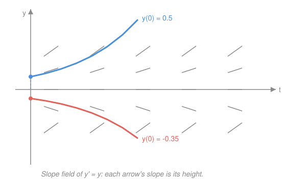

# Differential Equations · Lesson 1.1: ODEs, solutions, and slope fields

> ⏱ ~15 min · Module 1: First-order equations · Builds on: [`calc-refresher`](../../calc-refresher/syllabus.md) · Unlocks: 1.2 (separable and linear first-order)

## Why this matters

Almost every law of physics is a statement about *rates*, not values: Newton's $F=ma$ is a rule for acceleration, radioactive decay is a rule for how fast a sample shrinks, an interest rate is a rule for how fast money grows. In each case you're handed the *change* and asked to recover the *thing* — and that recovery is what solving a differential equation means. Before we learn a single solving technique, this lesson gives you the two moves you'll use forever: reading what kind of equation you have, and picturing its solutions straight off the equation, without solving anything.

## The idea

An ordinary differential equation (ODE) is an equation that ties a mystery function $y(t)$ to its own derivatives. Instead of telling you $y$ directly, it tells you a *rule* $y$ must obey — usually a rule about slope.

Take the simplest interesting one: $y' = y$. In words, it says *"whatever you are right now, that's how fast you're growing."* You don't yet know the function, but you already know something concrete: wherever $y$ is large, it climbs steeply; wherever $y$ is near zero, it barely moves; wherever $y$ is negative, it falls. The equation has stapled a slope onto every point of the plane. A **solution** is any curve that manages to stay tangent to those slopes the whole way across — a curve that always heads in the direction the equation is pointing.

That reframes the whole subject. The ODE hands you an arrow at every point. Solving is just *following the arrows*. Some equations we'll follow exactly with algebra (Module 1); others we'll only ever follow with our eyes and a sketch — and this lesson is that sketch.

## The formal version

**Order.** The **order** of an ODE is the highest derivative that appears.

$$y' = y \ \ (\text{first order}), \qquad y'' + 4y = 0 \ \ (\text{second order}).$$

In words: order counts how many derivatives deep the rule reaches — first order is a rule about slope, second order a rule about curvature.

**Linearity.** An ODE is **linear** if $y$ and its derivatives appear only to the first power, never multiplied together, and never fed into a nonlinear function ($\sin y$, $y^2$, $\sqrt{y}$). The general first-order linear form is

$$y' + p(t)\,y = g(t),$$

where $p$ and $g$ are any functions of $t$ alone. In words: linear means $y$ and its derivatives enter "plainly" — coefficients can be wild functions of $t$, but $y$ itself never gets squared, multiplied by $y'$, or bent. So $y' = 1 + y^2$ is **non**linear (the $y^2$), while $y' = t^2 y + \sin t$ is linear.

**Solution.** A function $y(t)$ is a solution on an interval if substituting it makes the equation an identity there. You verify a solution the same way every time: **compute the derivatives and plug in.** No solving required to check — checking is pure differentiation.

**General vs. particular; the IVP.** Solving a first-order ODE turns up not one curve but a whole **family**, indexed by an arbitrary constant $C$ — the **general solution** (e.g. $y = Ce^{t}$ for $y'=y$). Pin down $C$ with one extra fact, an **initial condition** $y(t_0) = y_0$. The equation plus that condition is an **initial-value problem (IVP)**, and it selects one **particular solution** — the single curve through the chosen point.

**Existence–uniqueness (stated).** If $f(t,y)$ and its partial derivative $\partial f/\partial y$ are continuous near a point $(t_0, y_0)$, then the IVP $y' = f(t,y),\ y(t_0)=y_0$ has **exactly one** solution through that point, at least on some small interval around $t_0$. In words: when the rule is "nice," precisely one solution curve threads each point — solution curves never cross, so the picture is unambiguous. (We take this on faith here; the proof is `real-analysis`.)

## Picture

Every short segment is the slope the equation demands at that point — for $y'=y$, the slope *equals the height*, so segments tilt up above the axis, lie flat on it, and tilt down below. The two curves are $y = Ce^{t}$ for a positive and a negative $C$; each one glides tangent to the field, and each is singled out by *where it starts*. The flat row along $y=0$ is a warning shot for Lesson 1.3: it's an **equilibrium**, a constant solution the field never pushes off of.

## Worked examples

**Example 1 (mechanical — verify, then pin down $C$).** Show $y = Ce^{-3t}$ solves $y' = -3y$, and find the particular solution with $y(0) = 5$.

Differentiate: $y' = -3Ce^{-3t}$. Compare to $-3y = -3\,(Ce^{-3t}) = -3Ce^{-3t}$. They match for *every* $C$ — so the whole family solves it. Now apply the condition: $y(0) = Ce^{0} = C = 5$, giving the particular solution $y = 5e^{-3t}$.

That is the entire rhythm of a first-order IVP in miniature: the equation fixes the *shape* ($e^{-3t}$ decay), the initial condition fixes the *one* curve.

**Example 2 (why you'd care — reading behavior off the field).** Newton's law of cooling says a coffee at temperature $T$ in a $20^\circ$ room obeys $T' = -k(T - 20)$ with $k > 0$. Without solving, read the slope field. Above $20^\circ$: $T - 20 > 0$, so $T' < 0$ — the coffee cools. Below $20^\circ$: $T' > 0$ — a cold cup warms. Exactly at $20^\circ$: $T' = 0$ — nothing moves. So *every* solution curve is drawn toward the room-temperature line $T = 20$ and flattens against it, from whichever side it started.

We haven't found a formula (that's Lesson 1.2's integrating factor), yet we already know the qualitative story — the fate of the system — purely from the sign of $f$. That's the payoff of the slope-field picture: behavior without solving.

## Watch out

- You might think checking a proposed solution means re-deriving it. It doesn't — **verification is just substitution.** Differentiate the candidate, plug both it and its derivative into the ODE, and confirm the two sides are identical. If they're not, it's not a solution, full stop.
- You might think a first-order ODE has "a solution." It has a one-parameter *family*; a single curve only appears once an initial condition spends that one constant. An $n$-th order equation carries $n$ constants, so it needs $n$ conditions.
- You might think "linear" refers to straight-line solutions. It refers to how $y$ *enters the equation*, not to the graph. $y' = t^2 y$ is linear and its solutions are curvy exponentials; $y' = 1 + y^2$ is nonlinear despite looking tame — the $y^2$ is the tell, and it's exactly what lets solutions blow up in finite time (P3).

## One-liner

> An ODE staples a slope onto every point of the plane; a solution is a curve that stays tangent to the field, and an initial condition picks which one.

## Problems

**P1 (🟢)** Verify that $y = Ce^{2t}$ is a solution of $y' = 2y$ for every constant $C$, then find the particular solution satisfying $y(0) = 3$.

**P2 (🟡)** Consider $y' = -y$. (a) Without solving, describe the slope field: what is the slope wherever $y > 0$? Wherever $y < 0$? Along $y = 0$? (b) Sketch (in words is fine) the solution curve through $(0, 2)$ and say what it does as $t \to \infty$. (c) Confirm your picture by checking that $y = 2e^{-t}$ solves the IVP.

**P3 (🔴, optional)** Verify that $y = \tan(t + C)$ solves the nonlinear ODE $y' = 1 + y^2$. Then take the particular solution with $y(0) = 0$ and explain why it **blows up in finite time** — find the exact time at which it does, and connect this to why the "nice $f$" of existence–uniqueness only promises a solution on *some small interval*.

Solutions

**P1** Differentiate the candidate: $y = Ce^{2t} \Rightarrow y' = 2Ce^{2t}$. The right-hand side is $2y = 2\,(Ce^{2t}) = 2Ce^{2t}$. The two sides agree for every $C$, so the whole family solves $y'=2y$. Apply the condition: $y(0) = Ce^{0} = C = 3$, so the particular solution is $y = 3e^{2t}$.

*Verification (substitute back):* with $y = 3e^{2t}$, $y' = 6e^{2t}$ and $2y = 6e^{2t}$. Equal ✓, and $y(0) = 3$ ✓.

**P2** (a) The equation is $y' = -y$, so the slope at any point is *minus its height*. Where $y > 0$: slope is negative (segments tilt **down**). Where $y < 0$: slope is positive (tilt **up**). Along $y = 0$: slope is $0$ (flat) — an equilibrium.

(b) Both signs push toward the axis, so the curve through $(0,2)$ starts at height $2$ and decays, flattening toward $y = 0$ from above; as $t \to \infty$, $y \to 0$.

(c) Check $y = 2e^{-t}$: derivative $y' = -2e^{-t}$, and $-y = -2e^{-t}$. Equal ✓. Initial value $y(0) = 2e^{0} = 2$ ✓. And indeed $2e^{-t} \to 0$ as $t \to \infty$, matching the sketch.

**P3** Differentiate using $\frac{d}{dt}\tan u = \sec^2 u \cdot u'$ with $u = t + C$ (so $u' = 1$):

$$y' = \sec^2(t + C).$$

The Pythagorean identity $\sec^2 = 1 + \tan^2$ turns this into

$$y' = 1 + \tan^2(t + C) = 1 + y^2,$$

so $y = \tan(t+C)$ solves the ODE for every $C$. Apply $y(0) = 0$: $\tan(C) = 0$, so take $C = 0$ and the particular solution is $y = \tan t$.

*Blowup:* $\tan t \to +\infty$ as $t \to \tfrac{\pi}{2}^-$. So the solution starting innocently at the origin races to infinity at the finite time $t = \tfrac{\pi}{2} \approx 1.57$, and exists only on $\left(-\tfrac{\pi}{2}, \tfrac{\pi}{2}\right)$. Here $f(t,y) = 1 + y^2$ is perfectly smooth everywhere, yet the solution still escapes in finite time — which is exactly why existence–uniqueness only guarantees a solution on *some interval around $t_0$*, not for all $t$. The nonlinearity ($y^2$) feeds the growth back on itself, and that runaway is invisible to any test that looks only at how nice $f$ is.

*Verification (substitute back):* with $y = \tan t$, $y' = \sec^2 t$ and $1 + y^2 = 1 + \tan^2 t = \sec^2 t$. Equal ✓, and $y(0) = \tan 0 = 0$ ✓.

## Connections

- **Backward:** verifying a solution is nothing but the differentiation from `calc-refresher` run in reverse-check mode; the slope field is that course's "derivative = slope of the tangent line" idea, now posted at every point of the plane at once.
- **Forward:** [1.2](01-02-separable-and-linear-first-order.md) turns "follow the arrows" into actual algebra for the two solvable first-order types, and [1.3](01-03-first-order-models.md) reads the flat equilibrium rows (cooling's $T=20$, the axis here) as long-run fates. Second-order fields live in the *phase plane* — the geometry of [3.2](03-02-phase-portraits-stability.md).
- **Sideways (physics/econ):** "the rule gives you the rate, recover the quantity" is the shared skeleton of Newtonian mechanics, radioactive decay, and continuously compounded growth — the cooling law in Example 2 and the perpetuity's $e^{-rt}$ from [`calc-refresher` 2.3](../../calc-refresher/lessons/02-03-improper-integrals-and-models.md) are the same first-order machine in different clothes.
