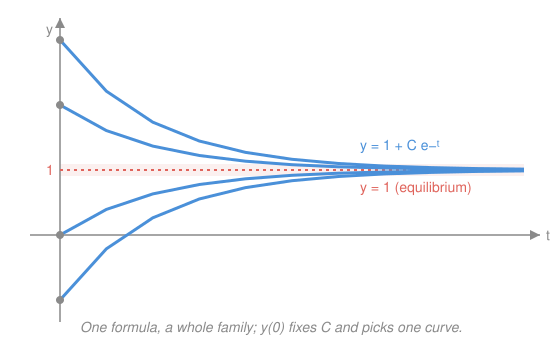

# Differential Equations · Lesson 1.2: Separable and first-order linear equations

> ⏱ ~15 min · Module 1: First-order equations · Builds on: [1.1 ODEs, solutions, and slope fields](01-01-odes-solutions-slope-fields.md) · Unlocks: 1.3 (first-order models)

## Why this matters

Lesson 1.1 let you *read* a first-order ODE and picture its slope field without solving it. Now you actually solve them — and it turns out almost every first-order equation you'll meet in physics and econ is one of two types. **Separable** equations cover radioactive decay, Newton cooling, and the logistic law; **first-order linear** equations cover mixing tanks, RC circuits, and any "leaky bucket with a source" story. Master these two and you can close 1.3's word problems in a single pass.

## The idea

Both methods have the same goal — get to an integral — and each has a one-line trick to get there.

**Separable** means the right-hand side splits into "an $x$-part times a $y$-part," $\frac{dy}{dx} = g(x)\,h(y)$. Then you physically sort the two variables to opposite sides of the equation — every $y$ (and the $dy$) on the left, every $x$ (and the $dx$) on the right — and integrate each side on its own turf. "Divide and integrate."

**First-order linear**, $y' + p(x)\,y = q(x)$, doesn't separate. The trick is sneakier: multiply the whole equation by a cleverly chosen factor $\mu(x)$ so that the left side collapses into the derivative of a single product, $(\mu y)'$. Once the left is a bare derivative, you just integrate it away. You're *engineering the product rule to run backwards.*

## The formal version

**Separable equations.** If $\dfrac{dy}{dx} = g(x)\,h(y)$, then wherever $h(y)\neq 0$,

$$\int \frac{dy}{h(y)} = \int g(x)\,dx.$$

In words: collect $y$'s with $dy$ on one side, $x$'s with $dx$ on the other, integrate both, and one constant $C$ carries the whole family. Here $g$ is the factor depending only on $x$ and $h$ the factor depending only on $y$. Solving for $y$ afterward is optional (sometimes impossible) — an implicit relation still counts as a solution.

**First-order linear equations.** For $y' + p(x)\,y = q(x)$, define the **integrating factor**

$$\mu(x) = e^{\int p(x)\,dx}.$$

Multiplying through by $\mu$ turns the left side into an exact derivative, because $\mu' = p\mu$ by construction:

$$\big(\mu(x)\,y\big)' = \mu(x)\,q(x) \quad\Longrightarrow\quad y = \frac{1}{\mu(x)}\left(\int \mu(x)\,q(x)\,dx + C\right).$$

In words: $p$ is the coefficient sitting on $y$, $q$ is the free "source" term; the magic factor $\mu = e^{\int p}$ is exactly what makes $(\mu y)'$ obey the product rule, so integrating both sides finishes the job. (You never need a $C$ inside $\mu$ — any antiderivative of $p$ works.)

**General vs. particular.** Both methods leave one constant $C$ — that's the **general solution**, a whole family of curves (Lesson 1.1's existence–uniqueness theorem promised exactly one constant for a first-order equation). An **initial condition** $y(x_0)=y_0$ pins $C$ to one number, selecting the single **particular solution** through that point.

## Picture

The linear equation $y' + y = 1$ has general solution $y = 1 + C e^{-t}$ — a whole sheaf of curves, all sliding toward the equilibrium $y=1$ as the $e^{-t}$ transient dies. No single curve is "the" solution until an initial condition fixes the starting height and thereby $C$.

## Worked examples

**Example 1 (separable — the mechanics).** Solve $\dfrac{dy}{dx} = -\dfrac{x}{y}$.

Sort the variables, then integrate:

$$\int y\,dy = -\int x\,dx \;\Longrightarrow\; \frac{y^2}{2} = -\frac{x^2}{2} + C \;\Longrightarrow\; x^2 + y^2 = R^2.$$

The solution family is *circles* — an implicit answer you'd never force into $y = f(x)$, and shouldn't. (Absorb the constant: $2C = R^2$.)

**Example 2 (linear — why you'd care).** A tank holds a dissolved-salt concentration $y(t)$ that leaks out at rate proportional to itself while fresh source pumps in at a steady rate: $y' + y = 1$. This doesn't separate (the right side isn't $x$-part times $y$-part), so use the integrating factor. Here $p = 1$, so $\mu = e^{\int 1\,dt} = e^{t}$:

$$\big(e^{t} y\big)' = e^{t}\cdot 1 \;\Longrightarrow\; e^{t} y = e^{t} + C \;\Longrightarrow\; y = 1 + C e^{-t}.$$

That's the family drawn above: the $1$ is the steady state the source sustains; the $Ce^{-t}$ is the transient memory of the start, decaying away. This "steady state + dying transient" split is the through-line of the whole course — you'll see it again in [1.3](01-03-first-order-models.md)'s cooling law and Module 2's driven oscillator.

## Watch out

- **You might think dividing by $h(y)$ is free — but it can delete solutions.** In Example 2's cousin $y' = y(1-y)$, dividing by $y(1-y)$ silently throws away the constant **equilibrium solutions** $y\equiv 0$ and $y\equiv 1$, which solve the ODE but never appear in the divided-out family. Always check whether $h(y)=0$ gives extra constant solutions.
- **You might think $\mu = e^{\int p}$ needs its own $+C$ — it doesn't.** Any single antiderivative of $p$ works; a constant inside just multiplies both sides by $e^{C}$ and cancels. Spend zero effort on it.
- **The integrating factor only applies once the equation is in standard form** $y' + p(x)y = q(x)$, with coefficient $1$ on $y'$. If you see $t\,y' + y = t^2$, divide by $t$ *first* to read off $p = 1/t$ — forgetting this is the most common sign/setup error.

## One-liner

> Separable = shove all the $y$'s to one side and integrate; linear = multiply by $e^{\int p}$ to make the left side a product-rule derivative, then integrate.

## Problems

**P1 (🟢)** Solve the separable IVP $\dfrac{dy}{dx} = xy$ with $y(0) = 2$.

**P2 (🟡)** Find the general solution of $y' + 2y = e^{-t}$ using an integrating factor.

**P3 (🔴)** Solve the IVP $y' + \dfrac{1}{t}\,y = 1$, $y(1) = 0$. (Hint: it's already in standard form with $p = 1/t$; the integrating factor is clean.)

Solutions

**P1** Separable with $g(x)=x$, $h(y)=y$. Divide by $y$ and integrate (noting $y\equiv 0$ is an equilibrium solution, but our IC $y(0)=2\neq 0$ rules it out):

$$\int \frac{dy}{y} = \int x\,dx \;\Longrightarrow\; \ln|y| = \frac{x^2}{2} + C \;\Longrightarrow\; y = A\,e^{x^2/2},$$

where $A = \pm e^{C}$. Apply $y(0)=2$: $\;2 = A\,e^{0} = A$, so

$$\boxed{y = 2\,e^{x^2/2}}.$$

*Check:* $y' = 2\cdot x\,e^{x^2/2} = x\,(2e^{x^2/2}) = xy$ ✓, and $y(0) = 2e^{0} = 2$ ✓.

**P2** Standard form already, $p = 2$, so $\mu = e^{\int 2\,dt} = e^{2t}$. Multiply through:

$$\big(e^{2t} y\big)' = e^{2t}\cdot e^{-t} = e^{t} \;\Longrightarrow\; e^{2t} y = e^{t} + C \;\Longrightarrow\; \boxed{y = e^{-t} + C\,e^{-2t}}.$$

*Check:* $y' = -e^{-t} - 2C e^{-2t}$, so $y' + 2y = (-e^{-t} - 2Ce^{-2t}) + 2(e^{-t} + Ce^{-2t}) = e^{-t}$ ✓. (The $Ce^{-2t}$ is the homogeneous transient; $e^{-t}$ is the particular response to the forcing.)

**P3** Standard form with $p = 1/t$, so $\mu = e^{\int (1/t)\,dt} = e^{\ln t} = t$ (for $t>0$). Multiply through:

$$\big(t\,y\big)' = t\cdot 1 = t \;\Longrightarrow\; t\,y = \frac{t^2}{2} + C \;\Longrightarrow\; y = \frac{t}{2} + \frac{C}{t}.$$

Apply $y(1) = 0$: $\;0 = \tfrac{1}{2} + C$, so $C = -\tfrac{1}{2}$:

$$\boxed{y = \frac{t}{2} - \frac{1}{2t}}.$$

*Check:* $y' = \tfrac{1}{2} + \tfrac{1}{2t^2}$, so $y' + \tfrac{1}{t}y = \left(\tfrac{1}{2} + \tfrac{1}{2t^2}\right) + \tfrac{1}{t}\left(\tfrac{t}{2} - \tfrac{1}{2t}\right) = \tfrac{1}{2} + \tfrac{1}{2t^2} + \tfrac{1}{2} - \tfrac{1}{2t^2} = 1$ ✓, and $y(1) = \tfrac{1}{2} - \tfrac{1}{2} = 0$ ✓.

## Connections

- **Backward:** both methods bottom out in [1.1](01-01-odes-solutions-slope-fields.md)'s verification skill (substitute back to check) and, underneath, in `calc-refresher`'s integration toolkit — the integrating-factor step often needs [2.2 integration techniques](../../calc-refresher/lessons/02-02-integration-techniques.md) (substitution for $\int \mu q$, occasionally parts).
- **Forward:** [1.3 First-order models](01-03-first-order-models.md) is pure application — growth/decay and logistic laws are separable, mixing tanks and Newton cooling are linear, and the "steady state + transient" split from Example 2 becomes how you read every equilibrium.
- **Sideways (econ/physics):** the linear equation $y' + p\,y = q$ *is* the RC-circuit charging law and the continuous-time capital-accumulation equation — the integrating factor is the same $e^{-rt}$ discount kernel that priced the perpetuity in `calc-refresher` 2.3.
