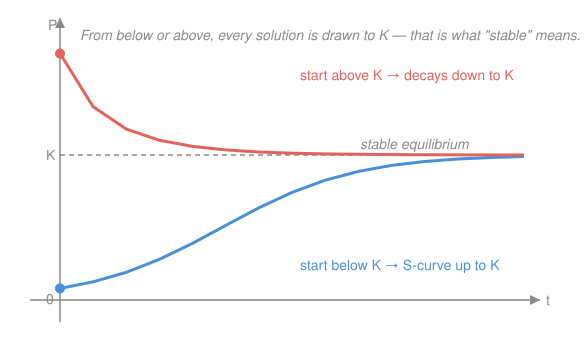

# Differential Equations · Lesson 1.3: First-order models

> ⏱ ~15 min · Module 1: First-order equations · Builds on: [1.2 Separable and first-order linear equations](01-02-separable-and-linear-first-order.md) · Unlocks: Module 2 (second-order linear equations)

## Why this matters

An ODE is worthless until you can *write one down* from a sentence. Cooling coffee, a draining brine tank, a spreading rumor, a population pressing against its food supply — each is a story about a **rate of change**, and translating the story into $y'=\dots$ is the whole game. Once it's written, two questions answer themselves before you solve anything: where does change *stop* (equilibrium), and does the system *head there or flee* (stability)? Physics, ecology, and economics all live on those two words.

## The idea

Every first-order model starts from one sentence: **the rate of change of the quantity equals (whatever is adding it) minus (whatever is removing it).** That's it — you write $y'$ on the left and bookkeep the inflows and outflows on the right.

Two ideas then do most of the interpreting. An **equilibrium** is a value where the quantity would sit forever: plug it in and $y'=0$, so nothing moves. **Stability** asks what happens to a solution nudged slightly off that value — look at the *sign* of $y'$ on either side. If $y'$ points back toward the equilibrium from both sides, the equilibrium is **stable** (an attractor, like a marble in a bowl); if $y'$ points away, it's **unstable** (a marble balanced on a dome). You can read all of this off the equation without ever solving it — the equilibrium is where change stops, stability is whether the system is drawn to it.

## The formal version

Let $y(t)$ be the quantity and $t$ time. The models you'll meet again and again:

**Exponential growth/decay.** $y' = ky$. In words: the rate of change is proportional to how much you have. Solution $y(t)=y_0 e^{kt}$ ($k>0$ grows, $k<0$ decays). Its only equilibrium is $y=0$.

**Newton's law of cooling.** $T' = -k(T - T_{\text{env}})$, with $T(t)$ the object's temperature, $T_{\text{env}}$ the (constant) ambient temperature, and $k>0$ a rate constant. In words: an object cools (or warms) at a rate proportional to how far its temperature is from the room. Equilibrium at $T=T_{\text{env}}$.

**Mixing tank.** For the amount $x(t)$ of dissolved substance (say salt) in a well-stirred tank,
$$x' = \underbrace{(\text{concentration in})(\text{flow rate in})}_{\text{rate in}} \;-\; \underbrace{\frac{x}{V}(\text{flow rate out})}_{\text{rate out}},$$
where $V$ is the tank volume. In words: salt accumulates at (what pours in) minus (the current concentration $x/V$ carried out by the drain). The outgoing concentration is $x/V$ because the tank is well-mixed — the drain sees the same brine as everywhere else.

**Logistic equation.** $P' = rP\!\left(1 - \dfrac{P}{K}\right)$, with population $P(t)$, low-density growth rate $r>0$, and **carrying capacity** $K>0$. In words: growth is nearly exponential ($P'\approx rP$) when $P$ is small, but the factor $(1-P/K)$ throttles it to zero as $P\to K$ — resources run out. Equilibria at $P=0$ and $P=K$.

**Equilibria and stability, precisely.** For any $y'=f(y)$, an equilibrium is a value $y^*$ with $f(y^*)=0$. It is **stable** if $f'(y^*)<0$ (the rate pushes back toward $y^*$) and **unstable** if $f'(y^*)>0$. In words: a downward-crossing of $f$ traps nearby solutions; an upward-crossing repels them.

## Picture

## Worked examples

**Example 1 (mechanical — cooling).** A metal bar at $300°$ is quenched in a bath held at $20°$, with $k=0.2\,/\text{min}$. Then $T' = -0.2(T-20)$. Substitute $u = T-20$ (distance from ambient), so $u' = T'= -0.2u$ — plain exponential decay:
$$u(t)=u_0 e^{-0.2t},\quad u_0 = 300-20 = 280 \;\Rightarrow\; T(t)=20+280\,e^{-0.2t}.$$
As $t\to\infty$, $T\to 20$: the bar forgets its start and settles at the bath temperature — the stable equilibrium. The trick (shift by the equilibrium to expose a bare $y'=ky$) is the workhorse of every linear first-order model, and it's exactly the integrating-factor solution from [1.2](01-02-separable-and-linear-first-order.md) in disguise.

**Example 2 (why you'd care — logistic reading).** With $r=0.5$ and $K=1000$, $P'=0.5\,P(1-P/1000)$. Don't solve — *read* it. At $P=50$ (small), $P'\approx 0.5\cdot 50 = 25$: near-exponential takeoff. At $P=1000$, $P'=0$: growth halts. At $P=1200$ (overshoot), $P' = 0.5\cdot1200\cdot(1-1.2) = -120<0$: the population falls back. So from anywhere positive the flow is toward $1000$ — the carrying capacity is the stable equilibrium, $P=0$ is unstable. Same S-curve models a spreading epidemic ($K$ = everyone susceptible) and adoption of a new technology.

## Watch out

- You might think the outflow concentration is the *inflow* concentration. It isn't — the drain carries the tank's *current* mix $x/V$, which is why $x$ appears on the right and the equation is a genuine ODE, not a plug-in.
- You might think "equilibrium = stable." No — $P=0$ in the logistic model is an equilibrium a single organism runs away from. Stability is a *separate* question, answered by the sign of $f'$ (or of $y'$ just off the equilibrium).
- You might think you must solve to know the long-run answer. For $y'=f(y)$, the long-run value is just the stable equilibrium the initial condition drains into — readable from the sign of $f$ alone (this is the whole point of slope fields from [1.1](01-01-odes-solutions-slope-fields.md)).

## One-liner

> Write $y'=(\text{rate in})-(\text{rate out})$; the stable equilibrium — where $y'=0$ and $y'$ points back — is the fate the initial condition is quietly draining toward.

## Problems

**P1 (🟢)** Coffee at $90°\text{C}$ sits in a $20°\text{C}$ room with cooling constant $k=0.1\,/\text{min}$. Write and solve $T'=-k(T-20)$, then find $T(10)$.

**P2 (🟡)** A $100$-liter tank starts full of pure water. Brine of concentration $0.2\ \text{kg/L}$ flows in at $5\ \text{L/min}$; the well-mixed solution drains at $5\ \text{L/min}$ (volume stays $100$ L). Let $x(t)$ be the kilograms of salt. Set up the ODE, solve it, and find the long-run concentration.

**P3 (🔴)** For the logistic equation $P'=rP\left(1-\dfrac{P}{K}\right)$ with $r,K>0$: (a) find both equilibria and classify each as stable or unstable using the sign of $P'$; (b) solve the equation by separation and confirm $P(t)\to K$. Give the population/epidemic reading of your answer.

Solutions

**P1** Shift by the ambient temperature: let $u=T-20$, so $u'=T'=-0.1u$. This is decay: $u(t)=u_0 e^{-0.1t}$ with $u_0 = 90-20 = 70$. Hence
$$T(t)=20+70\,e^{-0.1t}.$$
Then $T(10)=20+70\,e^{-1}=20+70(0.3679)=20+25.75 \approx 45.8°\text{C}.$
*Check:* $T(0)=20+70=90$ ✓. Differentiate: $T'=-7e^{-0.1t}$, and $-0.1(T-20)=-0.1(70e^{-0.1t})=-7e^{-0.1t}$ ✓. Long-run $T\to 20$ (stable equilibrium) ✓.

**P2** Rate in $=(0.2\ \text{kg/L})(5\ \text{L/min})=1\ \text{kg/min}$. Rate out $=\dfrac{x}{100}(5)=0.05x\ \text{kg/min}$. So
$$x' = 1 - 0.05x,\qquad x(0)=0.$$
This is linear (or shift by the equilibrium): the equilibrium is $x^*=1/0.05=20$. Let $w=x-20$, $w'=-0.05w$, $w(0)=-20$, giving $w=-20e^{-0.05t}$ and
$$x(t)=20\left(1-e^{-0.05t}\right).$$
As $t\to\infty$, $x\to 20$ kg, so the long-run concentration is $20\ \text{kg}/100\ \text{L}=0.2\ \text{kg/L}$ — exactly the inflow concentration, as it must be: eventually the tank matches what pours in.
*Check:* $x(0)=0$ ✓. $x'=20(0.05)e^{-0.05t}=e^{-0.05t}$; and $1-0.05x=1-(1-e^{-0.05t})=e^{-0.05t}$ ✓.

**P3** (a) $P'=0$ requires $P=0$ or $1-P/K=0$, i.e. $P=K$. Sign of $P'=rP(1-P/K)$ for $r>0$:
- $0<P<K$: both factors positive $\Rightarrow P'>0$ (rising).
- $P>K$: $(1-P/K)<0\Rightarrow P'<0$ (falling).

Just above $P=0$ the flow moves *away* (upward), so $P=0$ is **unstable**. On both sides of $P=K$ the flow points *toward* $K$ (up from below, down from above), so $P=K$ is **stable**. (Equivalently $f(P)=rP(1-P/K)$ has $f'(P)=r(1-2P/K)$; $f'(0)=r>0$ unstable, $f'(K)=-r<0$ stable.)

(b) Separate ($0<P<K$):
$$\frac{dP}{P(1-P/K)}=r\,dt.$$
Partial fractions: $\dfrac{1}{P(1-P/K)}=\dfrac{1}{P}+\dfrac{1/K}{1-P/K}$, so integrating gives $\ln P-\ln(1-P/K)=rt+C$, i.e. $\ln\!\dfrac{P}{1-P/K}=rt+C$. Exponentiate and solve:
$$\frac{P}{1-P/K}=Be^{rt}\;\Longrightarrow\; P(t)=\frac{K}{1+A e^{-rt}},\qquad A=\frac{K-P_0}{P_0}.$$
As $t\to\infty$, $e^{-rt}\to 0$, so $P\to K$ ✓ — matching the stability verdict. **Reading:** a population (or an epidemic's infected count, or adopters of a technology) takes off nearly exponentially while $P\ll K$, then bends over into an S-curve and saturates at the carrying capacity $K$ — the food supply, the total susceptible pool, the whole market.
*Check:* with $D=1+Ae^{-rt}$ and $P=K/D$, $P'=-K D'/D^2 = KrAe^{-rt}/D^2$; and $rP(1-P/K)=r\frac{K}{D}\cdot\frac{D-1}{D}=rK\frac{Ae^{-rt}}{D^2}=P'$ ✓ (using $D-1=Ae^{-rt}$).

## Flashback

**From Lesson 1.2 (Separable and first-order linear equations):** Solve the linear equation $y' + \dfrac{1}{x}\,y = x$ with $y(1)=1$. (Watch the coefficient — it isn't constant, so you need a genuine integrating factor.)

Solution

Integrating factor $\mu(x)=e^{\int (1/x)\,dx}=e^{\ln x}=x$. Multiply through:
$$x y' + y = x^2 \;\Longrightarrow\; (xy)' = x^2 \;\Longrightarrow\; xy=\frac{x^3}{3}+C \;\Longrightarrow\; y=\frac{x^2}{3}+\frac{C}{x}.$$
Apply $y(1)=1$: $\frac{1}{3}+C=1\Rightarrow C=\frac{2}{3}$, so $y=\dfrac{x^2}{3}+\dfrac{2}{3x}$.
*Check:* $y'=\frac{2x}{3}-\frac{2}{3x^2}$; then $y'+\frac{y}{x}=\frac{2x}{3}-\frac{2}{3x^2}+\frac{x}{3}+\frac{2}{3x^2}=x$ ✓, and $y(1)=\frac13+\frac23=1$ ✓.

## Connections

- **Backward:** every model here is a separable or first-order linear equation from [1.2](01-02-separable-and-linear-first-order.md) — the "shift by the equilibrium" trick just exposes the bare $y'=ky$ hiding inside. The stability reading is the sign information already visible in [1.1](01-01-odes-solutions-slope-fields.md)'s slope fields.
- **Forward:** "equilibrium + stability" is the seed of Module 3's **phase portraits** ([3.2](03-02-phase-portraits-stability.md)) — there the same question (does the flow return or flee?) gets answered by eigenvalues instead of the sign of one derivative.
- **Sideways (econ/physics):** the logistic and cooling curves are the same math as bounded diffusion of a new technology, an epidemic's infection curve, and a capacitor charging toward its supply voltage — every "approach to a ceiling" is a first-order model draining toward a stable equilibrium.
