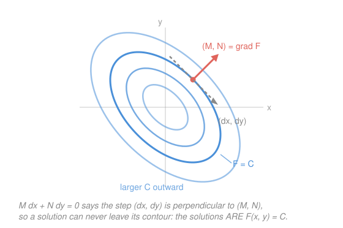

# Differential Equations · Lesson 1.4: Exact equations

> ⏱ ~15 min · Module 1: First-order equations · Builds on: [1.2 Separable and first-order linear equations](01-02-separable-and-linear-first-order.md), [1.3 First-order models](01-03-first-order-models.md) · Unlocks: Module 2 (second-order linear equations)

## Why this matters

Some first-order equations neither separate nor sit in linear standard form — and yet they're the *easiest* kind, once you see what they are. An **exact** equation is a conservation law in disguise: hidden behind it is a quantity $F(x,y)$ that never changes along a solution, so the solution curves are simply its contour lines. That is exactly how physics stores its best facts. Total energy is constant along an orbit; entropy and internal energy are **state functions** whose differentials are exact, while heat and work are not. Recognizing exactness is recognizing "there's a potential here" — and it's the same test you'd use to decide whether a plane vector field is [conservative](../../calc-refresher/reference.md#conservative-field).

## The idea

Take any function of two variables, say $F(x,y) = x^2 + xy + y^2$, and freeze it: $F(x,y) = C$. That equation defines a curve — a contour of the surface $F$. Now walk along that contour. Since $F$ doesn't change as you walk, its total differential vanishes:

$$dF = F_x\,dx + F_y\,dy = 0 \quad\Longrightarrow\quad (2x + y)\,dx + (x + 2y)\,dy = 0.$$

You just manufactured a differential equation, and you already know its solutions: they're the contours you started from.

**Exact equations are that process run backwards.** You're handed $M(x,y)\,dx + N(x,y)\,dy = 0$ and you ask: is there a hidden $F$ whose partial derivatives are $M$ and $N$? If yes, the equation is nothing but "$dF = 0$", and the answer is $F(x,y) = C$ — no integration of the ODE required, just *un*-differentiating in two variables. Solving becomes an act of recognition.

Two questions follow, and they're the whole lesson. **How do you tell whether such an $F$ exists?** And **what do you do when it doesn't?**

## The formal version

Write the equation in differential form

$$M(x,y)\,dx + N(x,y)\,dy = 0,$$

where $M$ and $N$ are given functions of both variables. (Any $y' = f(x,y)$ can be put here: move everything to one side and read off $M$ and $N$.) The equation is **exact** on a rectangle if there is a **potential function** $F(x,y)$ with

$$F_x = M, \qquad F_y = N,$$

in which case the general solution is the implicit relation $F(x,y) = C$. *In words:* the left-hand side is the total differential of $F$, so the equation says "$F$ doesn't change" — and the solution curves are $F$'s level curves.

**The test.**

$$\frac{\partial M}{\partial y} = \frac{\partial N}{\partial x}$$

*In words:* cross-differentiate and compare; if the two match (on a rectangle where everything is continuous), the potential exists, and if they don't, it can't.

**Why it *is* the test.** Suppose $F$ exists. Then $M_y = (F_x)_y = F_{xy}$ and $N_x = (F_y)_x = F_{yx}$ — and mixed partials of a nice function are equal, [Clairaut's theorem](../../calc-refresher/reference.md#mixed-partials-commute-clairaut). So $M_y = N_x$ is forced: it's a *necessary* condition, and failing it is proof that no potential exists. The converse (on a rectangle, the condition is also *sufficient*) is the part you take on faith here — but the construction below proves it by simply building $F$.

**Recovering $F$ (partial integration and reconcile).** Integrate $M$ in $x$, holding $y$ fixed:

$$F(x,y) = \int M(x,y)\,dx + g(y).$$

The "constant" of integration is constant *in $x$ only*, so it's an unknown function $g(y)$ — that's the one place this differs from ordinary antidifferentiation. Now impose the second requirement: differentiate that $F$ with respect to $y$, set it equal to $N$, and every term involving $x$ must cancel, leaving a clean $g'(y)$ to integrate. *In words:* one partial derivative gives you $F$ up to a $y$-only slack term; the other partial derivative pins the slack down.

**When it isn't exact: an integrating factor.** If $M_y \neq N_x$, hunt for a multiplier $\mu$ making $\mu M\,dx + \mu N\,dy = 0$ exact. The useful case is when one combination happens to depend on a single variable:

$$\text{if } \frac{M_y - N_x}{N} \text{ depends on } x \text{ alone, call it } h(x), \text{ then } \mu(x) = e^{\int h(x)\,dx}.$$

*In words:* measure how badly the test fails, divide by $N$, and if the mismatch is a function of $x$ only, exponentiating its integral repairs the equation. (Symmetrically, if $\dfrac{N_x - M_y}{M}$ depends on $y$ alone, that gives a $\mu(y)$.)

This is not a new idea — it's [1.2](01-02-separable-and-linear-first-order.md)'s integrating factor in its general habitat. Put a first-order linear equation into differential form: $y' + p(x)y = q(x)$ becomes $\big(p(x)y - q(x)\big)dx + dy = 0$, so $M = py - q$ and $N = 1$. Then $M_y = p$ and $N_x = 0$, so it is *never* exact unless $p \equiv 0$ — and the repair factor is $\frac{M_y - N_x}{N} = p(x)$, giving $\mu = e^{\int p}$. The formula you memorized in 1.2 is this lesson's formula, specialized. P3 walks the rest of the way.

## Picture

The contours drawn are the level curves of $F(x,y) = x^2 + xy + y^2$ — the solutions of the miniature equation $(2x+y)\,dx + (x+2y)\,dy = 0$ from "The idea". The gradient $(M,N)$ at a point is perpendicular to the contour through it, so the condition $M\,dx + N\,dy = 0$ is precisely "the step $(dx,dy)$ has no component across the contour." A solution can't leave the curve it starts on.

## Worked examples

**Example 1 (mechanical — test, then build $F$).** Solve $(2x + y)\,dx + (x + 3y^2)\,dy = 0$.

*Test:* $M = 2x + y$ gives $M_y = 1$; $N = x + 3y^2$ gives $N_x = 1$. Equal — exact.

*Build:* integrate $M$ in $x$,

$$F(x,y) = \int (2x + y)\,dx = x^2 + xy + g(y).$$

*Reconcile:* differentiate in $y$ and match $N$,

$$F_y = x + g'(y) \;\overset{!}{=}\; x + 3y^2 \;\Longrightarrow\; g'(y) = 3y^2 \;\Longrightarrow\; g(y) = y^3.$$

Notice the $x$ cancelled — it always does when the equation is exact, and if it *doesn't* cancel you made an arithmetic slip or the test was misread. The general solution is

$$x^2 + xy + y^3 = C.$$

*Check:* differentiate implicitly — $(2x + y)\,dx + (x + 3y^2)\,dy = 0$. ✓ Leave it implicit; solving for $y$ here would mean a cubic formula, and [1.2](01-02-separable-and-linear-first-order.md) already made peace with implicit answers.

**Example 2 (why you'd care — repairing a broken equation).** Solve $(3xy + y^2)\,dx + (x^2 + xy)\,dy = 0$.

*Test:* $M_y = 3x + 2y$, $N_x = 2x + y$. Not equal — not exact, and neither separable nor linear. Before this lesson you'd be stuck.

*Measure the failure:*

$$\frac{M_y - N_x}{N} = \frac{(3x + 2y) - (2x + y)}{x^2 + xy} = \frac{x + y}{x(x+y)} = \frac{1}{x},$$

a function of $x$ alone. So $\mu(x) = e^{\int dx/x} = x$. Multiply through:

$$(3x^2 y + xy^2)\,dx + (x^3 + x^2 y)\,dy = 0.$$

*Re-test:* $M_y = 3x^2 + 2xy$ and $N_x = 3x^2 + 2xy$. Exact now. Build $F$ from the *simpler* of the two — here $N$:

$$F(x,y) = \int (x^3 + x^2 y)\,dy = x^3 y + \tfrac{1}{2}x^2 y^2 + h(x),$$

then $F_x = 3x^2 y + xy^2 + h'(x) \overset{!}{=} 3x^2 y + xy^2$, so $h'(x) = 0$. The solution is

$$x^3 y + \tfrac{1}{2}x^2 y^2 = C.$$

Two things to take away. First, you may integrate either $M$ in $x$ or $N$ in $y$ — pick whichever is less work. Second, an integrating factor is a *conservation law you had to manufacture*: the original equation had no conserved quantity, and multiplying by $x$ created one. That is the same service $e^{\int p}$ performs for every linear equation in the course.

## Watch out

- You might think "not separable and not linear" means "not solvable by hand." Run the exactness test first — it costs two partial derivatives, and it's the cheapest diagnostic in Module 1. Many equations that look hopeless in $y' = f(x,y)$ form are one cross-derivative away from being read off.
- You might think the constant of integration in $\int M\,dx$ is a number. It is constant **in $x$ only**, so it must be written $g(y)$ — a whole unknown function. Writing $+C$ there is the single most common error in this method, and it silently throws away the entire $y$-dependence that the reconcile step exists to recover.
- You might think the integrating-factor recipe always works. It doesn't: $\mu$ always exists in principle, but the $\frac{M_y - N_x}{N}$ shortcut only applies when that ratio collapses to a function of $x$ alone (or the symmetric one to a function of $y$ alone). If neither collapses, finding $\mu$ is as hard as solving the original equation — that's when you stop and reach for a numerical method.
- You might think $F(x,y) = C$ is a half-finished answer. It is a complete answer. An initial condition picks the $C$; the level curve is the solution, whether or not it can be untangled into $y = f(x)$.

## One-liner

> An exact equation is a conservation law wearing a disguise: check $M_y = N_x$, un-differentiate to find the hidden potential $F$, and the solutions are its contours $F = C$.

## Problems

**P1 (🟢)** Verify that $(2xy + 3)\,dx + (x^2 - 1)\,dy = 0$ is exact, then solve the initial-value problem with $y(0) = 1$. Give the answer both implicitly and solved for $y$.

**P2 (🟡)** Show that $(2y^2 + 3x)\,dx + 2xy\,dy = 0$ is *not* exact, find an integrating factor depending only on $x$, and solve.

**P3 (🔴)** The 1.2 formula, re-derived. Start from the general first-order linear equation $y' + p(x)\,y = q(x)$ written in differential form as $\big(p(x)y - q(x)\big)dx + dy = 0$. (a) Confirm the integrating factor from this lesson's recipe is $\mu(x) = e^{\int p\,dx}$. (b) Multiply through, build the potential $F$, and show that $F(x,y) = C$ rearranges into exactly the solution formula from [1.2](01-02-separable-and-linear-first-order.md).

Solutions

**P1** Here $M = 2xy + 3$ and $N = x^2 - 1$, so $M_y = 2x$ and $N_x = 2x$. Equal — exact.

Integrate $M$ in $x$: $\;F = \int (2xy + 3)\,dx = x^2 y + 3x + g(y)$. Reconcile against $N$:

$$F_y = x^2 + g'(y) \overset{!}{=} x^2 - 1 \;\Longrightarrow\; g'(y) = -1 \;\Longrightarrow\; g(y) = -y.$$

So the general solution is $x^2 y + 3x - y = C$. Apply $y(0) = 1$: $\;0 + 0 - 1 = C$, so $C = -1$ and

$$x^2 y + 3x - y = -1.$$

Solve for $y$: group the $y$ terms, $\;y(x^2 - 1) = -1 - 3x$, hence

$$y = \frac{1 + 3x}{1 - x^2}.$$

*Check:* at $x = 0$, $y = 1$ ✓. And differentiating the implicit form gives $(2xy + 3)\,dx + (x^2-1)\,dy = 0$ ✓. (The solution is only valid on the interval $-1 < x < 1$ containing the initial point — it blows up where $x^2 = 1$, exactly the kind of finite-interval caveat [1.1](01-01-odes-solutions-slope-fields.md)'s existence–uniqueness theorem warned about.)

**P2** $M = 2y^2 + 3x$ gives $M_y = 4y$; $N = 2xy$ gives $N_x = 2y$. Not equal, so not exact. Measure the failure:

$$\frac{M_y - N_x}{N} = \frac{4y - 2y}{2xy} = \frac{2y}{2xy} = \frac{1}{x},$$

a function of $x$ alone, so $\mu(x) = e^{\int dx/x} = x$. Multiply through:

$$(2xy^2 + 3x^2)\,dx + 2x^2 y\,dy = 0.$$

Re-test: $M_y = 4xy$, $N_x = 4xy$ ✓. Integrate the simpler piece, $N$, in $y$:

$$F = \int 2x^2 y\,dy = x^2 y^2 + h(x), \qquad F_x = 2xy^2 + h'(x) \overset{!}{=} 2xy^2 + 3x^2,$$

so $h'(x) = 3x^2$ and $h(x) = x^3$. The solution is

$$x^2 y^2 + x^3 = C.$$

*Check:* $dF = (2xy^2 + 3x^2)dx + 2x^2y\,dy$, which is $\mu$ times the original left-hand side ✓.

**P3** (a) With $M = p(x)y - q(x)$ and $N = 1$: $\;M_y = p(x)$, $N_x = 0$. Not exact (unless $p \equiv 0$). The recipe:

$$\frac{M_y - N_x}{N} = \frac{p(x) - 0}{1} = p(x),$$

a function of $x$ alone — the best possible case. So $\mu(x) = e^{\int p(x)\,dx}$, which is precisely 1.2's integrating factor.

(b) Multiply through by $\mu$:

$$\mu\big(py - q\big)\,dx + \mu\,dy = 0.$$

Confirm exactness: the new $M$ has $\widetilde M_y = \mu p$, and the new $N = \mu(x)$ has $\widetilde N_x = \mu'$. But $\mu = e^{\int p}$ satisfies $\mu' = p\mu$ by the chain rule — that identity *is* what defines the integrating factor — so the two agree ✓.

Build $F$. Integrating $\widetilde N = \mu$ in $y$ is the easy direction:

$$F = \int \mu(x)\,dy = \mu(x)\,y + h(x).$$

Reconcile with $\widetilde M$:

$$F_x = \mu' y + h'(x) = \mu p y + h'(x) \overset{!}{=} \mu p y - \mu q \;\Longrightarrow\; h'(x) = -\mu q \;\Longrightarrow\; h(x) = -\int \mu q\,dx.$$

So the solution $F = C$ reads

$$\mu(x)\,y - \int \mu(x)q(x)\,dx = C \;\Longrightarrow\; y = \frac{1}{\mu(x)}\left(\int \mu(x)q(x)\,dx + C\right),$$

which is 1.2's formula verbatim. The potential $F = \mu y - \int \mu q$ is the conserved quantity that the "$(\mu y)' = \mu q$" trick was silently constructing all along.

## Flashback

**From Lesson 1.3 (First-order models):** A tank holds 100 L of pure water. Brine containing 2 g of salt per litre flows in at 5 L/min, and the well-stirred mixture drains at the same 5 L/min. Write and solve the ODE for the salt content $x(t)$ in grams, and state the long-run amount and why it's the value it is.

Solution

Rate in minus rate out. Salt enters at $2\ \text{g/L} \times 5\ \text{L/min} = 10$ g/min. The volume stays at 100 L, so the draining mixture carries the tank's *current* concentration $x/100$ g/L at 5 L/min, removing $5x/100 = x/20$ g/min:

$$x' = 10 - \frac{x}{20}, \qquad x(0) = 0.$$

Linear in standard form: $x' + \tfrac{1}{20}x = 10$, so $p = \tfrac{1}{20}$ and $\mu = e^{t/20}$:

$$\big(e^{t/20}x\big)' = 10e^{t/20} \;\Longrightarrow\; e^{t/20}x = 200e^{t/20} + C \;\Longrightarrow\; x = 200 + Ce^{-t/20}.$$

Apply $x(0) = 0$: $\;C = -200$, so

$$x(t) = 200\left(1 - e^{-t/20}\right).$$

Long run: $x \to 200$ g. That's the stable equilibrium (set $x' = 0$ to get $x = 200$ directly), and it's exactly 100 L at the inflow concentration of 2 g/L — eventually the tank simply *is* the incoming brine. The time constant is 20 min, so it's within a few percent of the ceiling after about an hour.

## Connections

- **Backward:** the test $M_y = N_x$ is Clairaut's equality of mixed partials from [calc-refresher 4.1](../../calc-refresher/lessons/04-01-partial-derivatives-and-gradient.md), and the repair step is [1.2](01-02-separable-and-linear-first-order.md)'s integrating factor with its training wheels off — P3 shows the linear formula falling out as one special case.
- **Forward:** "there's a conserved quantity, and the trajectories are its level curves" is the single most useful sentence in Module 3. In [3.2](03-02-phase-portraits-stability.md) a center's closed orbits are exactly the contours of such an $F$, which is why they never spiral in or out.
- **Sideways (physics / vector calculus):** $M_y = N_x$ is the two-dimensional statement "curl $= 0$", the test for a [conservative field](../../calc-refresher/reference.md#conservative-field) from [calc-refresher 5.1](../../calc-refresher/lessons/05-01-vector-fields-div-curl.md); the potential $F$ you build here is the same potential energy whose level sets are the equipotentials, and in thermodynamics it's the distinction between a state function and a path-dependent quantity like heat.
