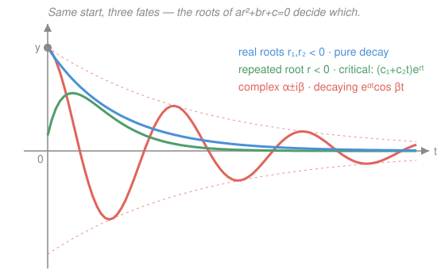

# Differential Equations · Lesson 2.1: Constant-coefficient homogeneous equations

> ⏱ ~15 min · Module 2: Second-order linear equations · Builds on: [1.2 Separable and first-order linear equations](01-02-separable-and-linear-first-order.md) · Unlocks: 2.2 (oscillations and damping)

## Why this matters

$ay'' + by' + cy = 0$ is the most-used differential equation in all of physics. A mass on a spring, a pendulum for small swings, an RLC circuit, a bond price under mean-reverting rates — all of them are *this* equation with different letters. And unlike most ODEs, it has a complete, mechanical solution recipe: you turn it into a quadratic, factor, and read the behavior off the roots. Learn this one page and you can predict whether a system decays, blows up, or rings — before solving anything numerically.

## The idea

The equation says: *the second derivative is a linear combination of the first derivative and the function itself.* What kind of function has that self-similar property — where differentiating just hands you back a scaled copy? The exponential $e^{rt}$. Differentiate it and you get $r\,e^{rt}$; differentiate again, $r^2 e^{rt}$. Every term is the same $e^{rt}$ with a power of $r$ out front.

So **guess $y = e^{rt}$ and see what $r$ has to be.** The $e^{rt}$ cancels out of every term, and the differential equation collapses into an ordinary quadratic in $r$. The exponential *diagonalizes* the problem — it converts calculus into algebra. Solving that quadratic gives you the two rates $r$ hiding in the system, and those two numbers decide everything: negative real root → decay, positive → growth, complex → oscillation. You never had to integrate.

## The formal version

For the homogeneous equation with constant coefficients ($a \neq 0$)

$$ay'' + by' + cy = 0,$$

substitute $y = e^{rt}$. Then $y' = r e^{rt}$, $y'' = r^2 e^{rt}$, and factoring out $e^{rt}$ (never zero) leaves the **characteristic equation**

$$ar^2 + br + c = 0.$$

*In words: the exponents that work are exactly the roots of the quadratic whose coefficients are the ODE's coefficients.* The discriminant $b^2 - 4ac$ splits the outcome into three cases. Here $r_1, r_2$ are the roots; $c_1, c_2$ are arbitrary constants set by initial data.

**(i) Distinct real roots** $r_1 \neq r_2$ (discriminant $> 0$):

$$y = c_1 e^{r_1 t} + c_2 e^{r_2 t}.$$

Two independent decay/growth modes. In words: the motion is a blend of two pure exponentials.

**(ii) Repeated real root** $r$ (discriminant $= 0$, so $r = -b/2a$):

$$y = (c_1 + c_2\,t)\,e^{rt}.$$

The quadratic only handed you *one* exponential, but a second-order equation needs *two* independent solutions — so the missing partner is $t\,e^{rt}$, the same exponential nudged by a factor of $t$. In words: one mode, plus its "$t$-times" twin.

**(iii) Complex roots** $r = \alpha \pm i\beta$ (discriminant $< 0$), where $\alpha = -b/2a$ and $\beta = \sqrt{4ac - b^2}\,/\,2a$:

$$y = e^{\alpha t}\big(c_1 \cos\beta t + c_2 \sin\beta t\big).$$

Euler's formula $e^{i\beta t} = \cos\beta t + i\sin\beta t$ turns the complex exponentials into real sines and cosines. In words: **oscillation at frequency $\beta$ inside a growing or decaying envelope $e^{\alpha t}$** — the real part $\alpha$ sets grow/decay, the imaginary part $\beta$ sets how fast it rings.

**Superposition.** Because the equation is linear and homogeneous, if $y_1$ and $y_2$ each solve it, so does *every* combination $c_1 y_1 + c_2 y_2$. That's why "find two solutions, combine them" is legal — and why we need exactly **two** arbitrary constants, pinned down by two initial conditions $y(0)$ and $y'(0)$.

**Why two, and why these two?** A second-order equation carries two degrees of freedom (position and velocity), so its general solution is a 2-parameter family. The two pieces must be genuinely *independent* — neither a constant multiple of the other — which the **Wronskian** $W = y_1 y_2' - y_1' y_2 \neq 0$ certifies. In each case above the pair ($e^{r_1t}, e^{r_2t}$), ($e^{rt}, t e^{rt}$), ($e^{\alpha t}\cos\beta t, e^{\alpha t}\sin\beta t$) is independent, so their combination is the *full* solution — nothing is missed.

## Picture

Same equation shape, same start — three qualitatively different fates, and the roots alone tell you which: two real negative roots give pure sag toward zero (blue); a repeated negative root gives the critically-damped $(c_1+c_2t)e^{rt}$ hump that returns without overshooting (green); complex roots give a ring that dies inside the $e^{\alpha t}$ envelope (red, dashed guide).

## Worked examples

**Example 1 (mechanical — distinct real roots).** Solve $y'' - y' - 6y = 0$.

Characteristic equation: $r^2 - r - 6 = 0 = (r-3)(r+2)$, so $r_1 = 3,\ r_2 = -2$. Case (i):

$$y = c_1 e^{3t} + c_2 e^{-2t}.$$

One mode grows, one decays. For large $t$ the $e^{3t}$ term dominates and the solution blows up (unless $c_1 = 0$). The roots told us the long-run fate before we knew a single initial condition.

**Example 2 (why you'd care — a plucked string / spring).** A mass on a spring with light damping obeys $y'' + 2y' + 10y = 0$, with $y(0) = 3$ (pulled to 3 cm) and $y'(0) = 0$ (released from rest). Here $y(t)$ is displacement.

Characteristic equation: $r^2 + 2r + 10 = 0$. Discriminant $4 - 40 = -36 < 0$, so $r = \dfrac{-2 \pm \sqrt{-36}}{2} = -1 \pm 3i$. Case (iii) with $\alpha = -1,\ \beta = 3$:

$$y = e^{-t}(c_1 \cos 3t + c_2 \sin 3t).$$

Apply the data. $y(0) = c_1 = 3$. Differentiate:
$y' = e^{-t}\big[(-c_1 + 3c_2)\cos 3t + (-c_2 - 3c_1)\sin 3t\big]$, so $y'(0) = -c_1 + 3c_2 = 0 \Rightarrow c_2 = 1$. Thus

$$y = e^{-t}(3\cos 3t + \sin 3t).$$

The mass oscillates at angular frequency $3$, and the swing amplitude decays like $e^{-t}$: it rings and settles. Change the $2y'$ (the damping) and you slide between this ringing and the pure-decay case — exactly what [2.2](02-02-oscillations-damping.md) is about.

## Watch out

- **You might think the repeated-root case is just $y = c_1 e^{rt}$.** That's only *one* solution — a second-order equation needs two independent ones, so you must include the $c_2\,t\,e^{rt}$ partner. Drop it and you can't match both initial conditions.
- **You might think complex roots mean a complex (unphysical) answer.** The two complex exponentials combine, via Euler's formula, into real $\cos$ and $\sin$. The imaginary parts cancel; $y(t)$ is real. Always report the real form $e^{\alpha t}(c_1\cos\beta t + c_2\sin\beta t)$.
- **You might read the sign of $\alpha$ backwards.** $\alpha = -b/2a$: decay needs $\alpha < 0$ (envelope shrinks), growth is $\alpha > 0$. It's the *real part* that grows/decays, and $\beta$ (imaginary part) never affects stability — only how fast it wiggles.

## One-liner

> Guess $e^{rt}$, solve the quadratic $ar^2+br+c=0$, and the two roots tell you everything: real roots decay or grow, a repeated root adds a factor of $t$, complex roots ring inside an $e^{\alpha t}$ envelope.

## Problems

**P1 (🟢)** Solve $y'' - 5y' + 6y = 0$.

**P2 (🟡)** Solve $y'' + 4y' + 4y = 0$ with $y(0) = 1,\ y'(0) = 0$.

**P3 (🔴)** Solve $y'' + 2y' + 5y = 0$ with $y(0) = 1,\ y'(0) = 0$, and describe the resulting motion (grow or decay? oscillate? at what frequency?).

Solutions

**P1.** Characteristic equation $r^2 - 5r + 6 = 0 = (r-2)(r-3)$, roots $r_1 = 2,\ r_2 = 3$ — distinct real, case (i):

$$y = c_1 e^{2t} + c_2 e^{3t}.$$

*Check.* $y' = 2c_1 e^{2t} + 3c_2 e^{3t}$, $y'' = 4c_1 e^{2t} + 9c_2 e^{3t}$. Then
$y'' - 5y' + 6y = c_1(4 - 10 + 6)e^{2t} + c_2(9 - 15 + 6)e^{3t} = 0 + 0 = 0.$ ✓

**P2.** Characteristic equation $r^2 + 4r + 4 = 0 = (r+2)^2$, a repeated root $r = -2$ — case (ii):

$$y = (c_1 + c_2 t)e^{-2t}.$$

Apply data. $y(0) = c_1 = 1$. Differentiate: $y' = c_2 e^{-2t} - 2(c_1 + c_2 t)e^{-2t} = (c_2 - 2c_1 - 2c_2 t)e^{-2t}$, so $y'(0) = c_2 - 2c_1 = c_2 - 2 = 0 \Rightarrow c_2 = 2$. Thus

$$y = (1 + 2t)e^{-2t}.$$

*Check.* $y' = -4t\,e^{-2t}$ and $y'' = (-4 + 8t)e^{-2t}$. Then
$y'' + 4y' + 4y = \big[(-4+8t) + 4(-4t) + 4(1+2t)\big]e^{-2t} = \big[(-4+4) + (8 - 16 + 8)t\big]e^{-2t} = 0.$ ✓
And $y(0) = 1$, $y'(0) = 0$. ✓ (This is the *critically damped* curve in the Picture — the fastest return to rest with no overshoot.)

**P3.** Characteristic equation $r^2 + 2r + 5 = 0$. Discriminant $4 - 20 = -16 < 0$, so $r = \dfrac{-2 \pm \sqrt{-16}}{2} = -1 \pm 2i$ — complex, case (iii) with $\alpha = -1,\ \beta = 2$:

$$y = e^{-t}(c_1 \cos 2t + c_2 \sin 2t).$$

Apply data. $y(0) = c_1 = 1$. Differentiate:
$y' = e^{-t}\big[(-c_1 + 2c_2)\cos 2t + (-c_2 - 2c_1)\sin 2t\big]$, so $y'(0) = -c_1 + 2c_2 = -1 + 2c_2 = 0 \Rightarrow c_2 = \tfrac{1}{2}$. Thus

$$y = e^{-t}\Big(\cos 2t + \tfrac{1}{2}\sin 2t\Big).$$

**Motion:** a *decaying oscillation*. Because $\alpha = -1 < 0$, the amplitude shrinks like $e^{-t}$; because $\beta = 2$, it oscillates at angular frequency $2$ (period $\pi$). Writing $\cos 2t + \tfrac12\sin 2t = R\cos(2t - \varphi)$ with $R = \sqrt{1 + \tfrac14} = \tfrac{\sqrt5}{2} \approx 1.12$ and $\varphi = \arctan\tfrac12$, the solution is $y \approx 1.12\,e^{-t}\cos(2t - 0.46)$ — a ring that settles to zero within a few seconds.

*Check.* With $y = e^{-t}\cos 2t$ (the $c_1$ mode): $y' = -e^{-t}(\cos 2t + 2\sin 2t)$, $y'' = e^{-t}(-3\cos 2t + 4\sin 2t)$. Then
$y'' + 2y' + 5y = e^{-t}\big[(-3 - 2 + 5)\cos 2t + (4 - 4 + 0)\sin 2t\big] = 0$; the $\sin 2t$ mode checks identically. And $y(0) = 1$, $y'(0) = 0$. ✓

## Flashback

**From Lesson 1.2 (Separable and first-order linear equations):** Solve the first-order linear equation $y' + 2y = 4t$ with $y(0) = 1$ using an integrating factor.

Solution

The equation is $y' + P(t)y = Q(t)$ with $P = 2$, so the integrating factor is $\mu = e^{\int 2\,dt} = e^{2t}$. Multiply through — the left side becomes an exact derivative:

$$\big(e^{2t}y\big)' = 4t\,e^{2t}.$$

Integrate the right side by parts ($u = 4t,\ dv = e^{2t}dt \Rightarrow du = 4\,dt,\ v = \tfrac12 e^{2t}$):
$\int 4t\,e^{2t}\,dt = 2t\,e^{2t} - \int 2 e^{2t}\,dt = 2t\,e^{2t} - e^{2t} + C.$ Hence

$$e^{2t}y = 2t\,e^{2t} - e^{2t} + C \quad\Rightarrow\quad y = 2t - 1 + C e^{-2t}.$$

Apply $y(0) = 1$: $-1 + C = 1 \Rightarrow C = 2$, so

$$y = 2t - 1 + 2e^{-2t}.$$

*Check.* $y' = 2 - 4e^{-2t}$, and $y' + 2y = (2 - 4e^{-2t}) + 2(2t - 1 + 2e^{-2t}) = 2 - 4e^{-2t} + 4t - 2 + 4e^{-2t} = 4t.$ ✓ And $y(0) = -1 + 2 = 1$. ✓

## Connections

- **Backward:** the integrating-factor method of [1.2](01-02-separable-and-linear-first-order.md) handled *first*-order linear equations by turning the left side into a derivative; here we handle *second*-order ones by turning the equation into a quadratic. Both trade calculus for algebra.
- **Forward:** [2.2 Oscillations and damping](02-02-oscillations-damping.md) reads these three cases as over-, critically-, and under-damped motion of a real spring/RLC system; [2.3](02-03-forcing-resonance.md) adds a driving term on the right-hand side.
- **Sideways (linear algebra):** the characteristic roots $r$ are the same objects as the **eigenvalues** of [linalg 3.1 Eigenvalues and eigenvectors](../../linalg-refresher/lessons/03-01-eigenvalues-eigenvectors.md). That's not a coincidence — [3.1 Linear systems via eigenvalues](03-01-linear-systems-eigenvalues.md) rewrites $ay'' + by' + cy = 0$ as a system $\mathbf x' = A\mathbf x$ whose eigenvalues *are* these roots, and the guess $e^{rt}$ becomes the eigen-solution $e^{\lambda t}\mathbf v$.
