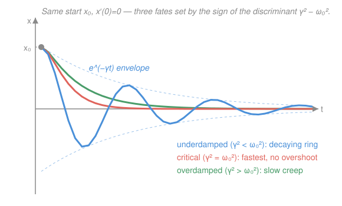

# Differential Equations · Lesson 2.2: Oscillations and damping

> ⏱ ~15 min · Module 2: Second-order linear equations · Builds on: [2.1 Constant-coefficient homogeneous equations](02-01-second-order-constant-coefficient.md) · Unlocks: 2.3 (forcing and resonance)

## Why this matters

A mass on a spring, a pendulum, an RLC circuit, a car suspension, a plucked string, an atom in a lattice — all obey the *same* second-order equation. It is the single most reused ODE in physics, and its entire personality is decided by one number: how much friction (or resistance) you add. Too little and the system rings like a bell; too much and it oozes back to rest like a screen door on a heavy closer. This lesson teaches you to look at a spring/RLC system, write its ODE, and read its fate off the characteristic equation's discriminant — the setup you need before 2.3 hits it with a driving force.

## The idea

Pull a mass on a spring aside and let go. Three things can happen, and they hinge on a tug-of-war between two effects: the spring wants to *restore* (pull it back through center, overshoot, repeat — that's oscillation), and friction wants to *dissipate* (bleed energy away — that's decay).

- **No friction:** the spring wins forever. The mass swings back and forth at a fixed rate, the same amplitude every cycle. Pure ringing — *simple harmonic motion*.
- **A little friction:** it still overshoots and rings, but each swing is smaller than the last. The oscillation lives inside a shrinking envelope and eventually dies. *Underdamped.*
- **A lot of friction:** the mass never makes it back through center at all — it just creeps toward rest without a single overshoot. *Overdamped.*
- **Exactly the right amount:** the boundary between ringing and creeping — the mass returns to rest as fast as physically possible without overshooting. *Critically damped.*

The punchline you'll prove below: **damping *is* the discriminant.** The characteristic equation's discriminant changes sign exactly at the crossover between "creeps back" (real roots) and "rings" (complex roots). Reading damping is nothing more than reading that sign.

## The formal version

**The mass–spring–damper.** Newton's law for a mass $m$ on a spring of stiffness $k$ with a damper (dashpot) of strength $c$, displacement $x(t)$ from equilibrium:

$$m x'' + c x' + k x = 0.$$

In words: mass times acceleration $=$ minus the spring's restoring pull ($-kx$) minus the damper's drag ($-cx'$, opposing velocity). Here $m>0$ is mass, $k>0$ is the spring constant, and $c\ge 0$ is the damping coefficient.

**The RLC analogy.** A series circuit with inductance $L$, resistance $R$, capacitance $C$, and charge $q(t)$ on the capacitor obeys

$$L q'' + R q' + \tfrac{1}{C} q = 0,$$

the *identical* equation with $m\leftrightarrow L$, $c\leftrightarrow R$, $k\leftrightarrow \tfrac{1}{C}$. Everything below transfers verbatim: inductance is inertia, resistance is friction, and a stiff spring is a small capacitor.

**Normalize.** Divide by $m$ and name two constants:

$$x'' + 2\gamma x' + \omega_0^2 x = 0, \qquad \omega_0 = \sqrt{\tfrac{k}{m}}\ \ (\text{natural frequency}), \quad \gamma = \tfrac{c}{2m}\ \ (\text{damping rate}).$$

In words: $\omega_0$ is how fast it *would* oscillate with no friction; $\gamma$ measures how fast energy leaks out. Both have units of 1/time.

**Simple harmonic motion ($c=0$, so $\gamma = 0$).** The equation collapses to

$$x'' + \omega_0^2 x = 0, \qquad x(t) = A\cos(\omega_0 t - \phi).$$

In words: a pure cosine of fixed amplitude $A$ and phase shift $\phi$, oscillating forever at frequency $\omega_0$. (The characteristic roots are $\pm i\omega_0$ — the complex-root case from [2.1](02-01-second-order-constant-coefficient.md) with zero real part, hence no decay.)

**The damping regimes.** The characteristic equation of the normalized ODE is $r^2 + 2\gamma r + \omega_0^2 = 0$, with roots

$$r = -\gamma \pm \sqrt{\gamma^2 - \omega_0^2}.$$

The discriminant $\gamma^2 - \omega_0^2$ (equivalently $c^2 - 4mk$ before normalizing) decides everything:

| Discriminant | Roots | Regime | Solution |
|---|---|---|---|
| $\gamma^2 > \omega_0^2$ | two real, both $<0$ | **overdamped** | $x = C_1 e^{r_1 t} + C_2 e^{r_2 t}$ |
| $\gamma^2 = \omega_0^2$ | repeated, $r=-\gamma$ | **critically damped** | $x = (C_1 + C_2 t)\,e^{-\gamma t}$ |
| $\gamma^2 < \omega_0^2$ | complex, $-\gamma \pm i\omega_d$ | **underdamped** | $x = e^{-\gamma t}\big(C_1\cos\omega_d t + C_2\sin\omega_d t\big)$ |

In words: real roots mean pure exponential decay — **no oscillation**, because there's no cosine anywhere. Complex roots mean a cosine/sine (the ring) multiplied by a decaying $e^{-\gamma t}$ **envelope**. The ring's frequency is the *damped frequency*

$$\omega_d = \sqrt{\omega_0^2 - \gamma^2} < \omega_0,$$

always slower than the friction-free rate — drag doesn't just shrink the swings, it lengthens them. In every damped case ($\gamma>0$) the solution $\to 0$: this decaying part is called the **transient**, because once you add a driving force in 2.3, it dies out and only the driven response survives.

## Picture

## Worked examples

**Example 1 (mechanical — reading the regime off the discriminant).** A 1 kg mass, spring $k=2$ N/m, damper $c=3$ N·s/m: $x'' + 3x' + 2x = 0$. Characteristic equation $r^2 + 3r + 2 = (r+1)(r+2) = 0$, roots $r=-1,-2$. Discriminant $9-8=1>0$ → **overdamped**, no oscillation:

$$x(t) = C_1 e^{-t} + C_2 e^{-2t}.$$

Both terms decay; the mass slides monotonically to rest. Halve the damper to $c=1$ instead: $r^2+r+2=0$, $r=-\tfrac12 \pm i\tfrac{\sqrt7}{2}$, discriminant $1-8<0$ → **underdamped**, it now rings at $\omega_d=\tfrac{\sqrt7}{2}$ inside an $e^{-t/2}$ envelope. Same spring, same mass — the *sign of the discriminant* flipped the behavior.

**Example 2 (why you'd care — tuning an RLC receiver).** In a series RLC circuit $Lq'' + Rq' + \tfrac1C q = 0$, the damping rate is $\gamma = \tfrac{R}{2L}$ and the natural frequency $\omega_0 = \tfrac{1}{\sqrt{LC}}$. A radio front-end wants to *ring* cleanly at $\omega_0$ so it can pick out one station — that means **underdamped** with tiny $\gamma$, i.e. small resistance $R$. A cheap sensor that must settle to a steady reading instantly wants **critical** damping — no ringing to wait out. Same circuit, opposite design goals, one knob: $R$. The condition separating them is $R^2 = \tfrac{4L}{C}$ (discriminant zero) — memorize the *structure*, not the letters, and it reads across to the spring as $c^2 = 4mk$.

## Watch out

- You might think more damping always means "returns to rest faster." It doesn't: past critical, **overdamping is slower**. One of the two real roots, $-\gamma+\sqrt{\gamma^2-\omega_0^2}$, drifts *toward zero* as you crank up $\gamma$, so the slow term lingers. Critical damping is the sweet spot — the picture shows the green overdamped curve trailing the red critical one back to rest.
- You might think the damped frequency $\omega_d$ equals the natural frequency $\omega_0$. It's strictly smaller ($\omega_d=\sqrt{\omega_0^2-\gamma^2}$), and it shrinks to zero exactly at critical damping — where the two "frequencies" merge and the oscillation disappears.
- You might read "$\gamma^2 - \omega_0^2 = 0$" and reach for two independent exponentials $e^{-\gamma t}$ and... $e^{-\gamma t}$ again. The repeated root gives only *one*; the second solution is $t\,e^{-\gamma t}$ (the [2.1](02-01-second-order-constant-coefficient.md) repeated-root rule). Forgetting the $t$ loses half your solution space.

## One-liner

> Damping is the discriminant: $\gamma^2-\omega_0^2>0$ creeps back (overdamped), $=0$ returns fastest (critical), $<0$ rings under a decaying $e^{-\gamma t}$ envelope (underdamped).

## Problems

**P1 (🟢)** A mass $m=2$ kg on a frictionless spring with $k=8$ N/m is pulled to $x(0)=3$ m and released with velocity $x'(0)=8$ m/s. This is simple harmonic motion, $x'' + \omega_0^2 x = 0$. Find $\omega_0$ and the motion $x(t)$, then write it in amplitude–phase form $A\cos(\omega_0 t - \phi)$.

**P2 (🟡)** Classify the damping of each equation (over / critical / under) and write its general solution:
(a) $x'' + 4x' + 3x = 0$  (b) $x'' + 4x' + 4x = 0$  (c) $x'' + 2x' + 5x = 0$.

**P3 (🔴)** A screen-door closer is modeled as a mass–spring–damper with effective mass $m=0.5$ kg and spring constant $k=8$ N/m. Find the damping coefficient $c$ that makes the door **critically damped**, and explain in one sentence why the manufacturer wants exactly this value (not more, not less).

Solutions

**P1** $\omega_0 = \sqrt{k/m} = \sqrt{8/2} = \sqrt4 = 2$ rad/s. General solution $x = C_1\cos 2t + C_2\sin 2t$. Apply the data: $x(0)=C_1=3$. Differentiate, $x' = -2C_1\sin 2t + 2C_2\cos 2t$, so $x'(0)=2C_2=8 \Rightarrow C_2=4$. Thus

$$x(t) = 3\cos 2t + 4\sin 2t.$$

Amplitude–phase form: $A=\sqrt{C_1^2+C_2^2}=\sqrt{9+16}=5$, and $\tan\phi = C_2/C_1 = 4/3$ (both $C_1,C_2>0$ → first quadrant), so $\phi=\arctan\tfrac43\approx 0.927$ rad. Hence $x(t)=5\cos(2t-0.927)$.

*Check:* $x(0)=5\cos(-0.927)=5(0.6)=3$ ✓; $x'(t)=-10\sin(2t-0.927)$, $x'(0)=-10\sin(-0.927)=-10(-0.8)=8$ ✓. And $x''=-4x$ ⇒ $x''+4x=0$, i.e. $x''+\omega_0^2 x=0$ with $\omega_0^2=4$ ✓.

**P2**
(a) $r^2+4r+3=(r+1)(r+3)=0$, roots $-1,-3$ (real, distinct; discriminant $16-12=4>0$) → **overdamped**. $x=C_1e^{-t}+C_2e^{-3t}$.
(b) $r^2+4r+4=(r+2)^2=0$, repeated root $-2$ (discriminant $16-16=0$) → **critically damped**. $x=(C_1+C_2 t)e^{-2t}$.
(c) $r^2+2r+5=0$, $r=-1\pm\sqrt{1-5}=-1\pm 2i$ (discriminant $4-20=-16<0$) → **underdamped**, with $\gamma=1$, $\omega_d=2$. $x=e^{-t}(C_1\cos 2t+C_2\sin 2t)$.

*Check (b), the trap case:* let $x=(C_1+C_2t)e^{-2t}$. Then $x'=(C_2 - 2C_1 - 2C_2 t)e^{-2t}$ and $x''=(-4C_2 + 4C_1 + 4C_2 t)e^{-2t}$. So $x''+4x'+4x = e^{-2t}\big[(4C_1-4C_2) + (4C_2-8C_1+4C_1) + (4C_2-8C_2+4C_2)t\big]$. Collect: constant $= 4C_1-4C_2+4C_2-4C_1 = 0$; the $t$-coefficient $=4C_2-8C_2+4C_2=0$ ✓. (For (a) and (c), each $e^{rt}$ satisfies the ODE because $r$ is a characteristic root — that's what "root" means.)

**P3** Critical damping is discriminant zero. Before normalizing, the characteristic equation is $mr^2+cr+k=0$ with discriminant $c^2-4mk$, so critical means

$$c^2 = 4mk \;\Rightarrow\; c = 2\sqrt{mk} = 2\sqrt{0.5\cdot 8} = 2\sqrt{4} = 4\ \text{N·s/m}.$$

(Equivalently $\omega_0=\sqrt{k/m}=\sqrt{16}=4$ rad/s and critical needs $\gamma=\omega_0$, i.e. $c=2m\gamma=2(0.5)(4)=4$.) Why exactly 4: with less damping ($c<4$) the door is underdamped — it swings past the frame and rebounds (slams and bounces); with more ($c>4$) it's overdamped and creeps shut slowly, leaving the doorway open too long. Critical damping ($c=4$) is the unique value that closes the door in the *shortest* time with no overshoot — the same reason a galvanometer needle is critically damped, so it snaps to its reading without wiggling.

*Check:* at $c=4$, $mr^2+cr+k = 0.5r^2+4r+8=0$ ⇒ $r^2+8r+16=(r+4)^2=0$, a repeated root $r=-4=-\gamma$ ✓ — confirming critical damping.

## Flashback

**From Lesson 2.1 (Constant-coefficient homogeneous equations):** Solve the initial-value problem $y'' - y' - 6y = 0$ with $y(0)=1$, $y'(0)=8$. (Distinct real roots — the same characteristic-equation machinery, but here the roots straddle zero.)

Solution

Characteristic equation $r^2 - r - 6 = (r-3)(r+2)=0$, roots $r=3$ and $r=-2$ (real, distinct). General solution $y = C_1 e^{3t} + C_2 e^{-2t}$. Apply the data: $y(0)=C_1+C_2=1$; and $y'=3C_1e^{3t}-2C_2e^{-2t}$, so $y'(0)=3C_1-2C_2=8$. Substitute $C_1=1-C_2$: $3(1-C_2)-2C_2 = 3-5C_2 = 8 \Rightarrow C_2=-1$, hence $C_1=2$. So

$$y(t) = 2e^{3t} - e^{-2t}.$$

*Check:* $y(0)=2-1=1$ ✓; $y'=6e^{3t}+2e^{-2t}$, $y'(0)=6+2=8$ ✓; and $y''=18e^{3t}-4e^{-2t}$, so $y''-y'-6y = (18-6-12)e^{3t} + (-4-2+6)e^{-2t} = 0$ ✓. (Note the $+3$ root: this solution *grows* — unlike a damped oscillator, whose roots all have negative real part. Stability lives in the sign of the real part, the theme of Module 3.)

## Connections

- **Backward:** this is [2.1](02-01-second-order-constant-coefficient.md)'s three root cases (real / repeated / complex) given physical clothing — overdamped, critical, underdamped are those same three cases, and the discriminant that sorted them is now literally the amount of friction.
- **Forward:** [2.3 (forcing and resonance)](02-03-forcing-resonance.md) adds a driving term to this same oscillator; everything solved here becomes the *transient* that dies out, leaving the steady-state response — and when the drive frequency nears $\omega_0$ on a lightly-damped system, you get resonance.
- **Sideways (physics ↔ engineering):** the mass–spring–damper and the series RLC circuit are the *same equation* ($m\leftrightarrow L$, $c\leftrightarrow R$, $k\leftrightarrow \tfrac1C$) — mechanical intuition and circuit intuition are interchangeable, and the "fastest settling without overshoot" idea (critical damping) is the design target for everything from car suspensions to galvanometers to control loops.
