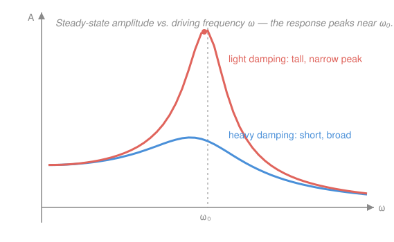

# Differential Equations · Lesson 2.3: Forcing, undetermined coefficients, and resonance

> ⏱ ~15 min · Module 2: Second-order linear equations · Builds on: [2.2 Oscillations and damping](02-02-oscillations-damping.md), [2.1 Constant-coefficient homogeneous equations](02-01-second-order-constant-coefficient.md) · Unlocks: Module 3 (linear systems and phase portraits)

## Why this matters

Every oscillator worth studying is *pushed*: the AC source driving an RLC circuit, the periodic load on a bridge, the seasonal forcing on a population, the laser field on an atom. [2.2](02-02-oscillations-damping.md) told you how a spring left alone rings down; this lesson adds the hand that keeps pushing. The payoff is one of the most consequential facts in physics — push a lightly-damped system *at its own natural rhythm* and the response grows enormous. That's **resonance**: how a radio tunes, why soldiers break step on bridges, and why the Tacoma Narrows came down.

## The idea

Split the motion into two stories. First, the system's own memory of how it started — the [2.2](02-02-oscillations-damping.md) homogeneous solution, which for any real damping **decays to zero**. Call it the **transient**: it forgets the initial conditions and dies. Second, the motion the driver *imposes* — the system, dragged along, eventually oscillating in lockstep with the push. Call it the **steady state**. After the transient fades, only the steady state remains: the system dancing to the driver's tune, not its own.

To find that steady state, use the laziest idea that works: **guess that the answer looks like the forcing**. Push with an exponential, guess an exponential; push with a cosine, guess a cosine-plus-sine; push with a polynomial, guess a polynomial. Plug the guess in, and the equation collapses into simple algebra for the unknown coefficients. That's **undetermined coefficients** — no integration, just matching.

The one trap: if your guess is *already* a free vibration of the undriven system, plugging it in gives zero and matches nothing. The fix is to multiply by $t$. And when the driver's frequency exactly equals the natural frequency of an **undamped** system, that stray factor of $t$ is resonance itself — an amplitude that grows without bound, forever.

## The formal version

The **nonhomogeneous** (driven) equation is

$$a y'' + b y' + c y = f(t),$$

with constants $a,b,c$ and a **forcing function** $f(t)$ (the input, e.g. an applied force or voltage). Its general solution is

$$y(t) = \underbrace{y_h(t)}_{\text{transient}} + \underbrace{y_p(t)}_{\text{steady state}},$$

where $y_h$ is the general solution of the homogeneous equation $ay''+by'+cy=0$ (from [2.1](02-01-second-order-constant-coefficient.md)) and $y_p$ is **any one** particular solution of the full equation. *In words:* every driven solution is the one forced motion plus a dying free vibration; the arbitrary constants live entirely in $y_h$ and are fixed by the initial conditions.

**Undetermined coefficients.** Choose a trial $y_p$ of the same shape as $f$, with unknown coefficients:

| $f(t)$ | trial $y_p$ |
|---|---|
| $F_0 e^{kt}$ | $A e^{kt}$ |
| $F_0\cos\omega t$ or $F_0\sin\omega t$ | $A\cos\omega t + B\sin\omega t$ |
| polynomial of degree $n$ | general degree-$n$ polynomial |

Substitute, match coefficients of like terms, and solve for $A,B,\dots$. *In words:* assume the output rhymes with the input, then let the equation tell you the amplitudes.

**Modification rule.** If a term of your trial $y_p$ is already a solution of the homogeneous equation, multiply that trial by $t$ (by $t^2$ if the root is repeated). *In words:* when the driver hits a natural mode, the plain guess dies on contact — the factor $t$ revives it.

**Resonance (the payoff).** For a damped oscillator driven sinusoidally,

$$y'' + 2\gamma y' + \omega_0^2\, y = F_0\cos\omega t,\qquad \gamma>0,$$

where $\omega_0$ is the **natural frequency** (the undriven ringing rate) and $\gamma$ is the **damping rate**, the steady-state amplitude is

$$A(\omega) = \frac{F_0}{\sqrt{(\omega_0^2-\omega^2)^2 + (2\gamma\omega)^2}}.$$

*In words:* the denominator is smallest — so $A$ is largest — when the driving frequency $\omega$ sits near $\omega_0$. That peak is resonance; the lighter the damping $\gamma$, the taller and narrower it gets. In the **undamped** limit $\gamma\to 0$ driven exactly at $\omega=\omega_0$, the formula blows up — the honest solution has amplitude growing like $t$ (see P3).

## Picture

## Worked examples

**Example 1 (mechanical — an exponential push).** Solve $y'' - y' - 2y = 4e^{3t}$ for a particular solution.

Guess $y_p = Ae^{3t}$. Then $y_p' = 3Ae^{3t}$, $y_p'' = 9Ae^{3t}$, and

$$9Ae^{3t} - 3Ae^{3t} - 2Ae^{3t} = 4Ae^{3t} = 4e^{3t}\ \Rightarrow\ A = 1.$$

So $y_p = e^{3t}$. (The homogeneous roots are $r=2,-1$, so $e^{3t}$ is *not* a free mode — no modification needed.)

**Example 2 (why you'd care — a driven RLC circuit).** A series RLC circuit with an AC source obeys $q'' + 2q' + 5q = 10\cos t$, where $q(t)$ is charge. Find the steady-state current pattern.

The homogeneous roots are $r = -1\pm 2i$ (underdamped, from [2.2](02-02-oscillations-damping.md)), so $q_h = e^{-t}(c_1\cos 2t + c_2\sin 2t) \to 0$: pure transient. For the steady state, guess $q_p = A\cos t + B\sin t$:

$$q_p' = -A\sin t + B\cos t,\qquad q_p'' = -A\cos t - B\sin t.$$

Substitute:

$$(-A\cos t - B\sin t) + 2(-A\sin t + B\cos t) + 5(A\cos t + B\sin t) = 10\cos t.$$

Collect: $\cos t:\ (-A + 2B + 5A) = 4A + 2B = 10$; $\sin t:\ (-B - 2A + 5B) = 4B - 2A = 0$. From the second, $A = 2B$; then $8B + 2B = 10$, so $B = 1$, $A = 2$. The steady state is $q_p = 2\cos t + \sin t$ — amplitude $\sqrt{5}$, oscillating at the *driver's* frequency 1, not the natural frequency 2. The circuit has forgotten how it started and marches to the source.

## Watch out

- You might think the transient is a minor correction. It isn't optional — it's what carries the initial conditions. **Fit $c_1,c_2$ to $y = y_h + y_p$, never to $y_h$ alone**; forcing shifts where the motion starts.
- You might think a cosine drive gives a pure cosine response. On a *damped* system it doesn't — you need **both** $A\cos\omega t$ and $B\sin\omega t$, because the $y'$ term converts sine to cosine. Drop the sine and the algebra is unsolvable.
- You might think resonance means "drive at $\omega_0$ and the amplitude is infinite." With any damping it's large but finite, and the exact peak sits slightly *below* $\omega_0$ (at $\omega=\sqrt{\omega_0^2-2\gamma^2}$). The genuine blow-up needs the idealized $\gamma=0$ case.

## One-liner

> The transient forgets the start and dies; the steady state dances to the driver — and when the driver's rhythm matches the system's own, the dance runs away.

## Problems

**P1 (🟢)** Find a particular solution of $y'' + y = 3e^{2t}$ by undetermined coefficients.

**P2 (🟡)** For $y'' + 3y' + 2y = 10\cos t$, find the steady-state solution and state (in one line) what the transient is and why it doesn't survive.

**P3 (🔴)** Undamped resonance. For $y'' + \omega_0^2\, y = F_0\cos\omega_0 t$ (driven exactly at its natural frequency), verify that

$$y_p = \frac{F_0}{2\omega_0}\,t\sin\omega_0 t$$

is a particular solution, and explain where the factor $t$ comes from and why it means the amplitude grows without bound.

Solutions

**P1** Guess $y_p = Ae^{2t}$ (and $e^{2t}$ is not a homogeneous solution — those are $\cos t,\sin t$ — so no modification). Then $y_p'' = 4Ae^{2t}$, and

$$y_p'' + y_p = 4Ae^{2t} + Ae^{2t} = 5Ae^{2t} = 3e^{2t}\ \Rightarrow\ A = \tfrac{3}{5}.$$

So $y_p = \dfrac{3}{5}e^{2t}$.

*Substitution check:* $y_p'' = \tfrac{12}{5}e^{2t}$, so $y_p'' + y_p = \tfrac{12}{5}e^{2t} + \tfrac{3}{5}e^{2t} = \tfrac{15}{5}e^{2t} = 3e^{2t}$. ✓

**P2** Guess $y_p = A\cos t + B\sin t$. Then $y_p' = -A\sin t + B\cos t$ and $y_p'' = -A\cos t - B\sin t$. Substitute into $y''+3y'+2y$:

$$(-A\cos t - B\sin t) + 3(-A\sin t + B\cos t) + 2(A\cos t + B\sin t) = 10\cos t.$$

Collect like terms: $\cos t:\ (-A + 3B + 2A) = A + 3B = 10$; $\sin t:\ (-B - 3A + 2B) = -3A + B = 0$. The second gives $B = 3A$; then $A + 9A = 10$, so $A = 1$, $B = 3$. The **steady state** is

$$y_p = \cos t + 3\sin t\quad(\text{amplitude }\sqrt{1^2+3^2}=\sqrt{10}).$$

*Transient:* the homogeneous equation $r^2+3r+2=(r+1)(r+2)=0$ has roots $r=-1,-2$, so $y_h = c_1e^{-t} + c_2e^{-2t}$. Both exponents are negative, so $y_h\to 0$ — it's overdamped decay that erases the initial conditions and leaves only $y_p$.

*Substitution check:* $y_p'' = -\cos t - 3\sin t$, $3y_p' = -3\sin t + 9\cos t$, $2y_p = 2\cos t + 6\sin t$. Sum of $\cos t$: $-1+9+2 = 10$; sum of $\sin t$: $-3-3+6 = 0$. Total $10\cos t$. ✓

**P3** The homogeneous equation $y''+\omega_0^2 y = 0$ has solutions $\cos\omega_0 t$ and $\sin\omega_0 t$ — which is *exactly* the shape of the forcing $\cos\omega_0 t$. The plain guess $A\cos\omega_0 t + B\sin\omega_0 t$ is therefore already homogeneous and yields $0\neq F_0\cos\omega_0 t$. The **modification rule** says multiply by $t$: try $y_p = t(A\cos\omega_0 t + B\sin\omega_0 t)$. That is where the $t$ comes from. Verify the claimed answer $y_p = \frac{F_0}{2\omega_0}t\sin\omega_0 t$; write $C=\frac{F_0}{2\omega_0}$:

$$y_p = Ct\sin\omega_0 t,$$
$$y_p' = C\sin\omega_0 t + C\omega_0 t\cos\omega_0 t,$$
$$y_p'' = 2C\omega_0\cos\omega_0 t - C\omega_0^2 t\sin\omega_0 t.$$

Then

$$y_p'' + \omega_0^2 y_p = 2C\omega_0\cos\omega_0 t - C\omega_0^2 t\sin\omega_0 t + \omega_0^2\,Ct\sin\omega_0 t = 2C\omega_0\cos\omega_0 t.$$

The $t\sin\omega_0 t$ terms cancel exactly, leaving $2C\omega_0\cos\omega_0 t = F_0\cos\omega_0 t$, which forces $C = \frac{F_0}{2\omega_0}$ — matching the claim. ✓

*Why it blows up:* the amplitude of $y_p$ is $\frac{F_0}{2\omega_0}\,t$, which grows linearly forever. With no damping to bleed off energy, every push at the natural frequency adds energy in phase — the swing pumped in perfect rhythm — so the oscillation's envelope climbs without bound. This is the $\gamma\to 0$ limit of the resonance peak in the Picture: as damping vanishes the peak height goes to infinity.

## Flashback

**From Lesson 2.2 (Oscillations and damping):** Classify the damping of $y'' + 4y' + 5y = 0$, then solve the initial-value problem with $y(0)=1$, $y'(0)=0$.

Solution

Characteristic equation $r^2 + 4r + 5 = 0$ gives $r = \frac{-4\pm\sqrt{16-20}}{2} = -2\pm i$. Complex roots with negative real part → **underdamped**: it oscillates while decaying. The general solution is

$$y = e^{-2t}(c_1\cos t + c_2\sin t).$$

Apply the conditions. $y(0) = c_1 = 1$. Differentiate: $y' = e^{-2t}\big[(-2c_1 + c_2)\cos t + (-2c_2 - c_1)\sin t\big]$, so $y'(0) = -2c_1 + c_2 = 0 \Rightarrow c_2 = 2$. Thus

$$y = e^{-2t}(\cos t + 2\sin t).$$

*Substitution check:* differentiating gives $y' = -5e^{-2t}\sin t$ and $y'' = e^{-2t}(10\sin t - 5\cos t)$. Then $y'' + 4y' + 5y$: the $\cos t$ terms give $-5 + 0 + 5 = 0$, the $\sin t$ terms give $10 - 20 + 10 = 0$, so the sum is $0$. ✓ And $y(0)=1$, $y'(0)=-5e^{0}\sin 0 = 0$. ✓

## Connections

- **Backward:** the transient $y_h$ is nothing new — it's the free vibration you classified in [2.2](02-02-oscillations-damping.md), built from the characteristic roots of [2.1](02-01-second-order-constant-coefficient.md). This lesson just adds the particular piece on top.
- **Forward:** when forcing is discontinuous or impulsive (a switch flipped, a hammer blow), guessing a shape fails — [4.1 The Laplace transform](04-01-laplace-transform.md) turns the whole driven IVP into algebra and handles jumps directly. And the transient-vs-steady-state split reappears as decaying vs. persistent modes when we go to systems in [Module 3](03-01-linear-systems-eigenvalues.md).
- **Sideways (physics/engineering):** the amplitude curve $A(\omega)$ is the mechanical twin of an RLC circuit's frequency response — the same resonance peak is how a radio selects one station, and its width sets the "$Q$ factor." `em-refresher` and `mechanics-refresher` both lean on exactly this equation.
