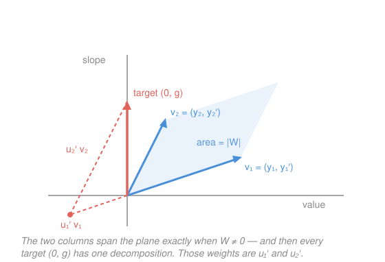

# Differential Equations · Lesson 2.4: Variation of parameters

> ⏱ ~15 min · Module 2: Second-order linear equations · Builds on: [2.3 Forcing, undetermined coefficients, and resonance](02-03-forcing-resonance.md), [2.1 Constant-coefficient homogeneous equations](02-01-second-order-constant-coefficient.md) · Unlocks: Module 3 (linear systems and phase portraits)

## Why this matters

[2.3](02-03-forcing-resonance.md) gave you a wonderful method with a short menu. Undetermined coefficients works by *guessing that the answer rhymes with the forcing* — which is only possible when the forcing is an exponential, a sine or cosine, a polynomial, or a product of those. Push an oscillator with $\tan t$, or $\sec t$, or $\ln t$, or $1/t$, and there is no shape to guess: differentiating $\tan t$ produces $\sec^2 t$, differentiating that produces something new again, and the guess never closes. Variation of parameters has no menu. Give it *any* continuous forcing and two independent homogeneous solutions, and it returns a particular solution as an integral — every time, including for equations whose coefficients aren't even constant. It is the method that finishes Module 2's story.

## The idea

The homogeneous solution is $y_h = c_1 y_1 + c_2 y_2$, with $c_1, c_2$ **constants**. That's a rigid object: whatever combination you pick, it solves the *undriven* equation and nothing else. So make the constants move.

Try $y_p = u_1(t)\,y_1(t) + u_2(t)\,y_2(t)$ — the same two building blocks, but with the weights allowed to drift in time. That's the whole idea, and it's where the name comes from: you are *varying the parameters* that used to be fixed. Intuitively, the system is always doing some blend of its two natural motions; the driver's job is to slowly re-mix the blend, and $u_1, u_2$ record the re-mixing.

There's an immediate bookkeeping problem: you introduced **two** unknown functions but the equation gives you only **one** requirement. Two unknowns, one equation — underdetermined. The classic move is to spend the slack on making the algebra pleasant. We *impose* a second condition of our own choosing,

$$u_1' y_1 + u_2' y_2 = 0,$$

which is legal precisely because we had a free choice to make, and which is *chosen* because it kills the terms that would otherwise produce second derivatives of $u_1$ and $u_2$ when we differentiate again. With that convenience in hand, the two conditions become a $2\times 2$ linear system for $u_1'$ and $u_2'$ — pure algebra, solvable at every instant. Integrate the answers and you're done.

The one thing that could go wrong is that $2\times 2$ system being unsolvable. It never is — because its determinant is the **Wronskian**, and a nonzero Wronskian is exactly what "$y_1$ and $y_2$ are independent" means.

## The formal version

Put the equation in **standard form**, leading coefficient exactly $1$:

$$y'' + p(t)\,y' + q(t)\,y = g(t).$$

Here $g$ is the forcing (any continuous function — no menu), and $y_1, y_2$ are two independent solutions of the homogeneous equation $y'' + py' + qy = 0$, which you already know how to find in the constant-coefficient case from [2.1](02-01-second-order-constant-coefficient.md).

**The Wronskian.**

$$W(t) = y_1 y_2' - y_1' y_2$$

*In words:* the determinant of the matrix whose columns are $(y_1, y_1')$ and $(y_2, y_2')$ — each solution's value paired with its slope. It is nonzero exactly when the two solutions are genuinely different, the certificate you met in passing in [2.1](02-01-second-order-constant-coefficient.md). What it buys you here is concrete: nonzero determinant means the $2\times2$ system below has one and only one solution, at every $t$.

**The system.** Substituting $y_p = u_1 y_1 + u_2 y_2$ into the equation, with the imposed condition, collapses everything to

$$\begin{cases} u_1' y_1 + u_2' y_2 = 0 & \text{(the condition we chose)} \\[2pt] u_1' y_1' + u_2' y_2' = g & \text{(what the equation demands)} \end{cases}$$

*In words:* the moving weights must not change the position (first line), and must supply exactly the forcing through the change in velocity (second line). Every $y_1'' , y_2''$ term cancelled, because $y_1$ and $y_2$ already solve the homogeneous equation — that's the engine of the method.

**The formula.** Solving by Cramer's rule,

$$u_1' = -\frac{y_2\,g}{W}, \qquad u_2' = \frac{y_1\,g}{W},$$

$$\boxed{\;y_p = -y_1\int \frac{y_2\,g}{W}\,dt \; + \; y_2\int \frac{y_1\,g}{W}\,dt\;}$$

*In words:* two integrals, and the only creativity required is evaluating them. Note the pattern: the minus sign rides with $u_1'$, and each $u_i'$ pairs with the *other* solution in the numerator. Then $y = c_1 y_1 + c_2 y_2 + y_p$ as always, and the constants get fitted to the initial conditions at the very end.

You may drop any $+C$ from the two integrals — carrying them just regenerates $c_1 y_1 + c_2 y_2$, which $y_h$ already supplies. For the same reason, if $y_p$ comes out with a piece that is a multiple of $y_1$ or $y_2$, you're free to delete it.

## Picture

Freeze time at one instant $t$. Each homogeneous solution contributes a vector $(y_i, y_i')$ — its value and its slope. The pair of equations says: find weights $u_1', u_2'$ so that these two vectors combine to the target $(0, g)$, no value, all forcing. That target is reachable, uniquely, exactly when the two columns aren't parallel — i.e. when the parallelogram they span has nonzero area. That area is $|W|$. This is the geometric content of "a nonzero Wronskian buys you solvability", and it's why independence of $y_1, y_2$ isn't a technicality but the hypothesis the method runs on.

## Worked examples

**Example 1 (mechanical — a forcing you could also have guessed).** Solve $y'' - 3y' + 2y = e^{3t}$ by variation of parameters.

Homogeneous first: $r^2 - 3r + 2 = (r-1)(r-2) = 0$, so $y_1 = e^{t}$, $y_2 = e^{2t}$. The equation is already in standard form, so $g = e^{3t}$. Wronskian:

$$W = y_1 y_2' - y_1' y_2 = e^{t}\cdot 2e^{2t} - e^{t}\cdot e^{2t} = e^{3t}.$$

Now the two derivatives:

$$u_1' = -\frac{y_2 g}{W} = -\frac{e^{2t}e^{3t}}{e^{3t}} = -e^{2t} \;\Longrightarrow\; u_1 = -\tfrac{1}{2}e^{2t},$$
$$u_2' = \frac{y_1 g}{W} = \frac{e^{t}e^{3t}}{e^{3t}} = e^{t} \;\Longrightarrow\; u_2 = e^{t}.$$

Assemble:

$$y_p = u_1 y_1 + u_2 y_2 = -\tfrac{1}{2}e^{2t}\cdot e^{t} + e^{t}\cdot e^{2t} = -\tfrac{1}{2}e^{3t} + e^{3t} = \tfrac{1}{2}e^{3t}.$$

*Cross-check with 2.3:* undetermined coefficients would guess $y_p = Ae^{3t}$, giving $9A - 9A + 2A = 1$, so $A = \tfrac12$. Same answer. Use this agreement as your confidence that the machinery is turning correctly — then use it on forcings where the guess isn't available.

**Example 2 (why you'd care — a forcing with no shape to guess).** Solve $y'' + y = \sec t$.

Undetermined coefficients has nothing to offer: $\sec t$ isn't an exponential, a sinusoid, or a polynomial, and its derivatives $\sec t\tan t, \dots$ generate an endless supply of new shapes. But the homogeneous solutions are the friendliest in the course, $y_1 = \cos t$, $y_2 = \sin t$, with

$$W = \cos t\cos t - (-\sin t)\sin t = \cos^2 t + \sin^2 t = 1.$$

(A Wronskian of exactly $1$ — a small gift.) Then, using $\sec t = 1/\cos t$:

$$u_1' = -\frac{\sin t \sec t}{1} = -\tan t \;\Longrightarrow\; u_1 = \ln\lvert\cos t\rvert,$$
$$u_2' = \frac{\cos t \sec t}{1} = 1 \;\Longrightarrow\; u_2 = t.$$

So

$$y_p = \cos t\,\ln\lvert\cos t\rvert + t\sin t,$$

and the general solution is $y = c_1\cos t + c_2\sin t + \cos t\ln\lvert\cos t\rvert + t\sin t$.

*Verify* (never publish an unchecked $y_p$). Differentiate, using $\frac{d}{dt}\ln\lvert\cos t\rvert = -\tan t$:

$$y_p' = -\sin t\ln\lvert\cos t\rvert - \cos t\tan t + \sin t + t\cos t = -\sin t\ln\lvert\cos t\rvert + t\cos t,$$

since $\cos t\tan t = \sin t$ cancels the loose $\sin t$. Again:

$$y_p'' = -\cos t\ln\lvert\cos t\rvert + \sin t\tan t + \cos t - t\sin t.$$

Add:

$$y_p'' + y_p = \sin t\tan t + \cos t - t\sin t + t\sin t = \frac{\sin^2 t + \cos^2 t}{\cos t} = \sec t. \;\checkmark$$

Look at what the answer contains: a logarithm and a factor of $t$. No guess from 2.3's table could ever have produced either. And physically, the $t\sin t$ term is a growing oscillation — the forcing $\sec t$ blows up at $t = \pi/2$, and the response records it.

## Watch out

- **You might think you can read $g$ straight off the equation as written — you can't.** The formula assumes **standard form with leading coefficient $1$**. Given $t^2 y'' - 2ty' + 2y = t^3$, you must divide by $t^2$ first: the forcing is $g = t$, not $t^3$, and $W$ is computed for the equation in that same standard form. Skipping the division is the single most common way this method produces a confidently wrong answer. (It's the same discipline the integrating factor demanded in [1.2](01-02-separable-and-linear-first-order.md) — the leading coefficient must be $1$ before any formula applies.)
- You might think the condition $u_1'y_1 + u_2'y_2 = 0$ is something you derive. It isn't — it's a **choice**, made because two unknown functions constrained by one equation leave a degree of freedom, and this particular choice is the one that keeps second derivatives of $u_1, u_2$ from ever appearing. A different choice would be legal and horrible.
- You might think the minus sign and the pairing are interchangeable. They're not: $u_1'$ carries the minus and the *other* solution $y_2$; $u_2'$ is positive and carries $y_1$. Swap them and you get a sign-flipped wrong answer that still looks plausible. If in doubt, re-derive from the $2\times 2$ system rather than trusting memory.
- You might think variation of parameters supersedes undetermined coefficients. In practice it doesn't — when the forcing is on 2.3's menu, guessing is far faster and needs no integration. Reach for this method when the guess isn't available, or when the coefficients aren't constant.

## One-liner

> Let the constants in $c_1y_1 + c_2y_2$ become functions, impose $u_1'y_1 + u_2'y_2 = 0$ to keep it clean, and the Wronskian — nonzero because the solutions are independent — hands you $u_1'$ and $u_2'$ for any forcing at all.

## Problems

**P1 (🟢)** Use variation of parameters to find a particular solution of $y'' - y = e^{2t}$, then confirm it by undetermined coefficients.

**P2 (🟡)** Solve $y'' + y = \csc t$ for a particular solution on $0 < t < \pi$. (Recall $\csc t = 1/\sin t$ and $\int \cot t\,dt = \ln\lvert\sin t\rvert$.)

**P3 (🔴)** For $t > 0$, the equation $t^2 y'' - 2t y' + 2y = t^3$ has homogeneous solutions $y_1 = t$ and $y_2 = t^2$ (check one if you like). Find a particular solution. Watch the standard-form step — it is the entire point of the problem.

Solutions

**P1** Homogeneous: $r^2 - 1 = 0$, so $y_1 = e^{t}$, $y_2 = e^{-t}$. Already standard form, $g = e^{2t}$. Wronskian:

$$W = e^{t}\big(-e^{-t}\big) - e^{t}\big(e^{-t}\big) = -1 - 1 = -2.$$

Then

$$u_1' = -\frac{y_2 g}{W} = -\frac{e^{-t}e^{2t}}{-2} = \tfrac{1}{2}e^{t} \;\Longrightarrow\; u_1 = \tfrac{1}{2}e^{t},$$
$$u_2' = \frac{y_1 g}{W} = \frac{e^{t}e^{2t}}{-2} = -\tfrac{1}{2}e^{3t} \;\Longrightarrow\; u_2 = -\tfrac{1}{6}e^{3t}.$$

Assemble:

$$y_p = \tfrac{1}{2}e^{t}\cdot e^{t} - \tfrac{1}{6}e^{3t}\cdot e^{-t} = \tfrac{1}{2}e^{2t} - \tfrac{1}{6}e^{2t} = \tfrac{1}{3}e^{2t}.$$

*Undetermined coefficients check:* guess $y_p = Ae^{2t}$; then $y_p'' - y_p = 4Ae^{2t} - Ae^{2t} = 3Ae^{2t} = e^{2t}$, so $A = \tfrac13$ ✓.

**P2** Here $y_1 = \cos t$, $y_2 = \sin t$, $W = 1$ (as in Example 2), and $g = \csc t = 1/\sin t$:

$$u_1' = -\frac{\sin t\cdot \csc t}{1} = -1 \;\Longrightarrow\; u_1 = -t,$$
$$u_2' = \frac{\cos t\cdot \csc t}{1} = \cot t \;\Longrightarrow\; u_2 = \ln\lvert\sin t\rvert.$$

So

$$y_p = -t\cos t + \sin t\,\ln\lvert\sin t\rvert.$$

*Verify.* Using $\frac{d}{dt}\ln\lvert\sin t\rvert = \cot t$:

$$y_p' = -\cos t + t\sin t + \cos t\ln\lvert\sin t\rvert + \sin t\cot t = t\sin t + \cos t\ln\lvert\sin t\rvert,$$

because $\sin t\cot t = \cos t$ cancels the leading $-\cos t$. Differentiating again,

$$y_p'' = \sin t + t\cos t - \sin t\ln\lvert\sin t\rvert + \cos t\cot t.$$

Then

$$y_p'' + y_p = \sin t + t\cos t + \frac{\cos^2 t}{\sin t} - t\cos t = \frac{\sin^2 t + \cos^2 t}{\sin t} = \csc t. \;\checkmark$$

**P3** **Standard form first** — divide the whole equation by $t^2$:

$$y'' - \frac{2}{t}\,y' + \frac{2}{t^2}\,y = t.$$

So $g = t$ (not $t^3$). With $y_1 = t$, $y_2 = t^2$:

$$W = y_1 y_2' - y_1' y_2 = t\cdot 2t - 1\cdot t^2 = t^2.$$

Then

$$u_1' = -\frac{y_2 g}{W} = -\frac{t^2\cdot t}{t^2} = -t \;\Longrightarrow\; u_1 = -\tfrac{1}{2}t^2,$$
$$u_2' = \frac{y_1 g}{W} = \frac{t\cdot t}{t^2} = 1 \;\Longrightarrow\; u_2 = t.$$

Assemble:

$$y_p = -\tfrac{1}{2}t^2\cdot t + t\cdot t^2 = -\tfrac{1}{2}t^3 + t^3 = \tfrac{1}{2}t^3.$$

*Verify in the original equation:* $y_p = \tfrac12 t^3$, $y_p' = \tfrac32 t^2$, $y_p'' = 3t$, so

$$t^2(3t) - 2t\left(\tfrac{3}{2}t^2\right) + 2\left(\tfrac{1}{2}t^3\right) = 3t^3 - 3t^3 + t^3 = t^3. \;\checkmark$$

*What the trap would have done:* using $g = t^3$ instead scales every step by $t^2$ and delivers $y_p = \tfrac{1}{2}t^5$, whose substitution gives $t^2(10t^3) - 2t(\tfrac52 t^4) + 2(\tfrac12 t^5) = 10t^5 - 5t^5 + t^5 = 6t^5 \neq t^3$. Note also that this equation has *non-constant* coefficients — nothing from [2.1](02-01-second-order-constant-coefficient.md) or [2.3](02-03-forcing-resonance.md) applies to it, yet variation of parameters handles it the moment someone hands you $y_1$ and $y_2$.

## Flashback

**From Lesson 2.2 (Oscillations and damping):** Classify the damping of $y'' + 6y' + 9y = 0$, then solve the initial-value problem with $y(0) = 2$, $y'(0) = 1$. Does the solution ever cross zero?

Solution

Characteristic equation $r^2 + 6r + 9 = (r+3)^2 = 0$ — a **repeated** root $r = -3$. Discriminant zero means **critically damped**: the fastest return to equilibrium without oscillating. The repeated root gives the second solution a factor of $t$:

$$y = (c_1 + c_2 t)e^{-3t}.$$

Apply $y(0) = 2$: $\;c_1 = 2$. Differentiate: $y' = c_2 e^{-3t} - 3(c_1 + c_2 t)e^{-3t}$, so $y'(0) = c_2 - 3c_1 = 1$, giving $c_2 = 7$. Thus

$$y = (2 + 7t)e^{-3t}.$$

*Check:* $y' = 7e^{-3t} - 3(2+7t)e^{-3t} = (1 - 21t)e^{-3t}$ and $y'' = -21e^{-3t} - 3(1-21t)e^{-3t} = (-24 + 63t)e^{-3t}$. Then $y'' + 6y' + 9y = \big[(-24 + 63t) + 6(1 - 21t) + 9(2 + 7t)\big]e^{-3t} = \big[(-24 + 6 + 18) + (63 - 126 + 63)t\big]e^{-3t} = 0$ ✓, with $y(0) = 2$ and $y'(0) = 1$ ✓.

*Crossing zero:* $e^{-3t}$ is never zero, so a crossing needs $2 + 7t = 0$, i.e. $t = -2/7 < 0$. For $t \geq 0$ the solution stays positive — it rises briefly (the initial velocity is positive) to a peak at $t = 1/21$, then decays monotonically to zero. That's the critically damped signature: at most one turning point, no oscillation.

## Connections

- **Backward:** this closes the loop on the Wronskian from [2.1](02-01-second-order-constant-coefficient.md) — there it merely certified that $c_1y_1 + c_2y_2$ was the *full* family; here that same nonzero determinant is what makes the method's $2\times 2$ system solvable, which is the real reason independence matters. It also completes [2.3](02-03-forcing-resonance.md): every nonhomogeneous equation now has a route to $y_p$, not just the ones on the guessing menu.
- **Forward:** for constant-coefficient equations with awkward forcing you have a second option — [4.1 The Laplace transform](04-01-laplace-transform.md) turns the driven IVP into algebra, and its convolution integral $\int_0^t g(\tau)h(t-\tau)\,d\tau$ is this lesson's formula in disguise. The Wronskian also reappears as the determinant condition that keeps a system's eigen-solutions independent in [3.1](03-01-linear-systems-eigenvalues.md).
- **Sideways (physics):** varying constants that were fixed in the unperturbed problem is a template far beyond ODEs — celestial mechanics does it with orbital elements (the "variation of orbital elements"), and quantum mechanics does it with the expansion coefficients of a state, where it is called time-dependent perturbation theory. The move you just learned is the ancestor of both.
