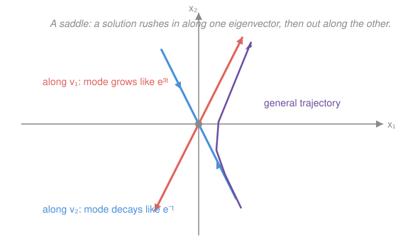

# Differential Equations · Lesson 3.1: Linear systems via eigenvalues

> ⏱ ~15 min · Module 3: Linear systems and phase portraits · Builds on: [2.1 Constant-coefficient homogeneous equations](02-01-second-order-constant-coefficient.md), [`linalg-refresher` 3.1](../../linalg-refresher/lessons/03-01-eigenvalues-eigenvectors.md) · Unlocks: 3.2 (phase portraits and stability)

## Why this matters

Nature rarely changes one quantity at a time. Two chemicals feed each other's reaction; predator eats prey while prey feeds predator; the current in one loop of a circuit drives the voltage in the next; a mass on a spring couples to a second mass down the line. Each is a **system** of differential equations — several unknowns whose rates of change depend on each other. Written in matrix form $\mathbf x'=A\mathbf x$, the whole tangle solves with a tool you already own: the eigenvalues and eigenvectors of $A$. And the payoff runs backward too — every second-order equation from Module 2 is secretly a $2\times 2$ system, so this lesson *contains* the characteristic-equation method of [2.1](02-01-second-order-constant-coefficient.md) as a special case.

## The idea

A single equation $x'=ax$ has one job and one answer: $x=ce^{at}$, growth or decay at rate $a$. The trouble with a *system* is coupling — $x_1'$ depends on $x_2$, and $x_2'$ depends on $x_1$, so neither can be solved alone. You'd love to just write down exponentials, but which exponentials?

Here is the trick, and it is the reason eigenvalues exist. Coupling is a statement about *directions*: in most directions the two variables drag on each other. But a matrix has special directions — its **eigenvectors** — along which it acts as pure scaling, no dragging ([`linalg-refresher` 3.1](../../linalg-refresher/lessons/03-01-eigenvalues-eigenvectors.md)). If the state ever points *exactly* along an eigenvector $\mathbf v$, then $A\mathbf x$ is just a number times $\mathbf x$, the coupling vanishes, and the system collapses to a single scalar equation $x'=\lambda x$ with answer $e^{\lambda t}$. So each eigenvector is a direction in which the system **decouples into a clean exponential**. The general solution is a blend of these independent modes — you decompose your starting state into eigen-directions, let each one run as its own exponential, and add them back up.

## The formal version

A **first-order linear system** is
$$\mathbf x'=A\mathbf x, \qquad \mathbf x(t)=\begin{bmatrix} x_1(t)\\ x_2(t)\end{bmatrix},\quad A=\begin{bmatrix} a & b\\ c & d\end{bmatrix},$$
where $\mathbf x(t)$ is the unknown vector of functions, $\mathbf x'$ its entrywise derivative, and $A$ a constant matrix. In words: the velocity of the state is a fixed linear function of the state itself.

**The eigen-ansatz.** Guess a solution that keeps a fixed direction and only rescales in time: $\mathbf x(t)=e^{\lambda t}\mathbf v$ for a constant scalar $\lambda$ and constant nonzero vector $\mathbf v$. Then $\mathbf x'=\lambda e^{\lambda t}\mathbf v$ and $A\mathbf x=e^{\lambda t}A\mathbf v$. Cancelling the never-zero factor $e^{\lambda t}$ leaves
$$A\mathbf v=\lambda\mathbf v.$$
In words: the guess works **exactly when** $(\lambda,\mathbf v)$ is an eigenpair of $A$. Each eigenpair hands you one solution mode $e^{\lambda_i t}\mathbf v_i$.

**General solution (real distinct eigenvalues).** If $A$ (a $2\times2$) has eigenvalues $\lambda_1\ne\lambda_2$ with eigenvectors $\mathbf v_1,\mathbf v_2$, then
$$\mathbf x(t)=c_1 e^{\lambda_1 t}\mathbf v_1+c_2 e^{\lambda_2 t}\mathbf v_2,$$
with constants $c_1,c_2$ fixed by an initial condition $\mathbf x(0)$. In words: superpose the modes; the two arbitrary constants are exactly the two numbers a second-order IVP always needs.

**Complex eigenvalues → rotation.** If the eigenvalues are a complex pair $\lambda=\alpha\pm i\beta$ (real $\alpha$, $\beta$), one complex solution $e^{\lambda t}\mathbf v$ splits, via Euler's formula $e^{i\beta t}=\cos\beta t+i\sin\beta t$, into
$$e^{\alpha t}\big(\cos\beta t\ \text{and}\ \sin\beta t\ \text{parts}\big).$$
In words: the real and imaginary parts of that one complex mode are two independent real solutions — an amplitude $e^{\alpha t}$ (grow if $\alpha>0$, decay if $\alpha<0$, steady if $\alpha=0$) times a rotation at angular frequency $\beta$. Spirals, not straight lines.

**Higher-order → system.** Any $n$th-order linear ODE becomes a first-order system by *naming the derivatives as new variables*. For $y''+py'+qy=0$, set $x_1=y,\ x_2=y'$; then $x_1'=x_2$ and $x_2'=y''=-qy-py'=-qx_1-px_2$, i.e.
$$\begin{bmatrix} x_1\\ x_2\end{bmatrix}'=\begin{bmatrix} 0 & 1\\ -q & -p\end{bmatrix}\begin{bmatrix} x_1\\ x_2\end{bmatrix}.$$
In words: the characteristic equation of [2.1](02-01-second-order-constant-coefficient.md) was never a coincidence — it is $\det(A-\lambda I)=0$ for this **companion matrix**, so 2.1's roots *are* these eigenvalues.

## Picture

Reading it, for a system with eigenvalues $\lambda_1=3$ (eigenvector $\mathbf v_1$) and $\lambda_2=-1$ (eigenvector $\mathbf v_2$): a state started *exactly* on the red line stays on it and flies outward as $e^{3t}$; a state started *exactly* on the blue line slides inward to the origin as $e^{-t}$. These two **straight-line solutions** are the skeleton. Any other start is a blend $c_1e^{3t}\mathbf v_1+c_2e^{-t}\mathbf v_2$: the decaying part fades, the growing part takes over, so the purple trajectory sweeps *in* along the blue direction and *out* along the red — the hallmark shape of a **saddle**. The eigenvalues' signs wrote the whole picture.

## Worked examples

**Example 1 (mechanical — the recipe).** Solve $\mathbf x'=A\mathbf x$ for $A=\begin{bmatrix} 2 & 1\\ 1 & 2\end{bmatrix}$.

*Eigenvalues:* $\det(A-\lambda I)=(2-\lambda)^2-1=\lambda^2-4\lambda+3=(\lambda-1)(\lambda-3)$, so $\lambda_1=3,\ \lambda_2=1$ (checks: sum $4=\operatorname{tr}A$, product $3=\det A$).

*Eigenvectors:* for $\lambda=3$, $A-3I=\begin{bmatrix} -1 & 1\\ 1 & -1\end{bmatrix}\Rightarrow \mathbf v_1=\begin{bmatrix} 1\\ 1\end{bmatrix}$; for $\lambda=1$, $A-I=\begin{bmatrix} 1 & 1\\ 1 & 1\end{bmatrix}\Rightarrow \mathbf v_2=\begin{bmatrix} 1\\ -1\end{bmatrix}$.

*Assemble:*
$$\mathbf x(t)=c_1 e^{3t}\begin{bmatrix} 1\\ 1\end{bmatrix}+c_2 e^{t}\begin{bmatrix} 1\\ -1\end{bmatrix}.$$
Both eigenvalues positive → both modes grow → the origin is an unstable node; every trajectory eventually aligns with the fast direction $\begin{bmatrix} 1\\ 1\end{bmatrix}$.

**Example 2 (why you'd care — a mixing pair).** Two tanks, each holding a well-stirred salt solution, exchange fluid so that the salt amounts $x_1,x_2$ obey $x_1'=-2x_1+x_2$, $x_2'=x_1-2x_2$. Matrix form: $A=\begin{bmatrix} -2 & 1\\ 1 & -2\end{bmatrix}$.

*Eigenvalues:* $\det(A-\lambda I)=(-2-\lambda)^2-1=\lambda^2+4\lambda+3=(\lambda+1)(\lambda+3)\Rightarrow \lambda=-1,\ -3$.
*Eigenvectors:* $\lambda=-1\Rightarrow \begin{bmatrix} 1\\ 1\end{bmatrix}$ (tanks equal); $\lambda=-3\Rightarrow \begin{bmatrix} 1\\ -1\end{bmatrix}$ (tanks opposite).
$$\mathbf x(t)=c_1 e^{-t}\begin{bmatrix} 1\\ 1\end{bmatrix}+c_2 e^{-3t}\begin{bmatrix} 1\\ -1\end{bmatrix}.$$
Read the physics straight off the eigenvalues: the *imbalance* mode $\begin{bmatrix} 1\\ -1\end{bmatrix}$ dies three times faster ($e^{-3t}$) than the *total* mode ($e^{-t}$) — the tanks equalize quickly, then drain together slowly. Both $\lambda<0$, so everything decays to zero: a stable node. Eigenvalues didn't just solve the system, they *explained* it.

## Watch out

- You might think each eigenvector needs its own separate $\lambda$ plugged into $e^{\lambda t}$ — yes, and the pairing is rigid. Mode $i$ is $e^{\lambda_i t}\mathbf v_i$; never mix $\lambda_1$ with $\mathbf v_2$. The exponent and the direction come as a set.
- You might think complex eigenvalues mean the answer is complex. It isn't — the physical solution is real. The complex mode is a bookkeeping device; take its real and imaginary parts (Problem 3) to get two honest real solutions. Complex eigenvalues are the *signature of rotation*, exactly as in [`linalg-refresher` 3.1](../../linalg-refresher/lessons/03-01-eigenvalues-eigenvectors.md).
- You might think the sign of $\lambda$ alone tells the whole story. For real $\lambda$ it sets grow/decay; for complex $\alpha\pm i\beta$ it's the *real part* $\alpha$ that grows or decays the spiral, while $\beta$ only sets the spin rate. (Full classification is [3.2](03-02-phase-portraits-stability.md).)

## One-liner

> Eigenvectors are the directions in which a coupled system uncouples into lone scalar exponentials $e^{\lambda t}$ — solve $\mathbf x'=A\mathbf x$ by finding those directions and superposing their modes.

## Problems

**P1 (🟢)** Solve $\mathbf x'=A\mathbf x$ for $A=\begin{bmatrix} 1 & 1\\ 4 & 1\end{bmatrix}$ (eigenvalues $3$ and $-1$). Give the general solution.

**P2 (🟡)** Convert $y''+3y'+2y=0$ to a first-order system $\mathbf x'=A\mathbf x$ by setting $x_1=y,\ x_2=y'$. Find $A$, solve via eigenvalues, and confirm the first component $y(t)$ matches the answer the characteristic-equation method of [2.1](02-01-second-order-constant-coefficient.md) gives.

**P3 (🔴)** Solve $\mathbf x'=A\mathbf x$ for $A=\begin{bmatrix} 0 & -1\\ 1 & 0\end{bmatrix}$. The eigenvalues are complex — find them, extract two real solutions via Euler's formula, and describe the motion in the plane.

Solutions

**P1** *Eigenvalues:* $\det(A-\lambda I)=(1-\lambda)^2-4=\lambda^2-2\lambda-3=(\lambda-3)(\lambda+1)$, so $\lambda_1=3,\ \lambda_2=-1$ (checks: sum $2=\operatorname{tr}A$, product $-3=\det A=1-4$ ✓).

*Eigenvectors.* $\lambda=3$: $A-3I=\begin{bmatrix} -2 & 1\\ 4 & -2\end{bmatrix}\Rightarrow -2x_1+x_2=0\Rightarrow x_2=2x_1\Rightarrow \mathbf v_1=\begin{bmatrix} 1\\ 2\end{bmatrix}$. $\lambda=-1$: $A+I=\begin{bmatrix} 2 & 1\\ 4 & 2\end{bmatrix}\Rightarrow 2x_1+x_2=0\Rightarrow \mathbf v_2=\begin{bmatrix} 1\\ -2\end{bmatrix}$.

$$\boxed{\ \mathbf x(t)=c_1 e^{3t}\begin{bmatrix} 1\\ 2\end{bmatrix}+c_2 e^{-t}\begin{bmatrix} 1\\ -2\end{bmatrix}.\ }$$

*Verify* the $\lambda=3$ mode: $\mathbf x=e^{3t}\begin{bmatrix} 1\\ 2\end{bmatrix}\Rightarrow \mathbf x'=3e^{3t}\begin{bmatrix} 1\\ 2\end{bmatrix}=e^{3t}\begin{bmatrix} 3\\ 6\end{bmatrix}$, and $A\mathbf x=e^{3t}\begin{bmatrix} 1+2\\ 4+2\end{bmatrix}=e^{3t}\begin{bmatrix} 3\\ 6\end{bmatrix}$ ✓. Likewise the $\lambda=-1$ mode: $A\begin{bmatrix} 1\\ -2\end{bmatrix}=\begin{bmatrix} 1-2\\ 4-2\end{bmatrix}=\begin{bmatrix} -1\\ 2\end{bmatrix}=-1\cdot\begin{bmatrix} 1\\ -2\end{bmatrix}$ ✓. (Opposite-sign eigenvalues → this is the saddle drawn in the Picture.)

**P2** With $x_1=y,\ x_2=y'$: $x_1'=y'=x_2$, and $x_2'=y''=-2y-3y'=-2x_1-3x_2$. So
$$A=\begin{bmatrix} 0 & 1\\ -2 & -3\end{bmatrix}.$$
*Eigenvalues:* $\det(A-\lambda I)=\det\begin{bmatrix} -\lambda & 1\\ -2 & -3-\lambda\end{bmatrix}=(-\lambda)(-3-\lambda)-(1)(-2)=\lambda^2+3\lambda+2=(\lambda+1)(\lambda+2)$, so $\lambda=-1,\ -2$. This is **identically** the characteristic equation $r^2+3r+2=0$ of [2.1](02-01-second-order-constant-coefficient.md) — the companion matrix reproduces it.

*Eigenvectors.* $\lambda=-1$: $A+I=\begin{bmatrix} 1 & 1\\ -2 & -2\end{bmatrix}\Rightarrow x_2=-x_1\Rightarrow \mathbf v=\begin{bmatrix} 1\\ -1\end{bmatrix}$. $\lambda=-2$: $A+2I=\begin{bmatrix} 2 & 1\\ -2 & -1\end{bmatrix}\Rightarrow x_2=-2x_1\Rightarrow \mathbf v=\begin{bmatrix} 1\\ -2\end{bmatrix}$. (Note each eigenvector is $\begin{bmatrix} 1\\ \lambda\end{bmatrix}$ — natural, since the second component is the derivative of the first, and $\tfrac{d}{dt}e^{\lambda t}=\lambda e^{\lambda t}$.)

$$\mathbf x(t)=c_1 e^{-t}\begin{bmatrix} 1\\ -1\end{bmatrix}+c_2 e^{-2t}\begin{bmatrix} 1\\ -2\end{bmatrix}\ \Rightarrow\ y(t)=x_1(t)=c_1 e^{-t}+c_2 e^{-2t}.$$
That is exactly 2.1's answer for distinct real roots $-1,-2$ ✓.

*Verify* by substitution into the original equation: $y=e^{-t}\Rightarrow y''+3y'+2y=1-3+2=0$ ✓; $y=e^{-2t}\Rightarrow 4-6+2=0$ ✓.

**P3** *Eigenvalues:* $\det(A-\lambda I)=\det\begin{bmatrix} -\lambda & -1\\ 1 & -\lambda\end{bmatrix}=\lambda^2+1=0\Rightarrow \lambda=\pm i$ (so $\alpha=0,\ \beta=1$; checks: sum $0=\operatorname{tr}A$, product $1=\det A$ ✓).

*Eigenvector for $\lambda=i$:* $A-iI=\begin{bmatrix} -i & -1\\ 1 & -i\end{bmatrix}$; the top row gives $-i x_1-x_2=0\Rightarrow x_2=-i x_1$. Take $x_1=i,\ x_2=1$: $\mathbf v=\begin{bmatrix} i\\ 1\end{bmatrix}$.

*One complex solution, split by Euler.* $e^{it}=\cos t+i\sin t$, so
$$e^{it}\begin{bmatrix} i\\ 1\end{bmatrix}=(\cos t+i\sin t)\begin{bmatrix} i\\ 1\end{bmatrix}=\begin{bmatrix} i\cos t-\sin t\\ \cos t+i\sin t\end{bmatrix}=\underbrace{\begin{bmatrix} -\sin t\\ \cos t\end{bmatrix}}_{\text{real part}}+i\underbrace{\begin{bmatrix} \cos t\\ \sin t\end{bmatrix}}_{\text{imag part}}.$$
The real and imaginary parts are two independent real solutions, so
$$\boxed{\ \mathbf x(t)=c_1\begin{bmatrix} \cos t\\ \sin t\end{bmatrix}+c_2\begin{bmatrix} -\sin t\\ \cos t\end{bmatrix}.\ }$$
*Motion:* each mode has constant length ($\cos^2t+\sin^2t=1$), so trajectories are **circles** traced counterclockwise at angular frequency $\beta=1$ — a **center**. Since $\alpha=0$ there is no growth or decay; had $\alpha>0$ the same rotation would spiral outward, $\alpha<0$ inward.

*Verify* the first mode: $\mathbf x=\begin{bmatrix} \cos t\\ \sin t\end{bmatrix}\Rightarrow \mathbf x'=\begin{bmatrix} -\sin t\\ \cos t\end{bmatrix}$, and $A\mathbf x=\begin{bmatrix} 0\cdot\cos t-1\cdot\sin t\\ 1\cdot\cos t+0\end{bmatrix}=\begin{bmatrix} -\sin t\\ \cos t\end{bmatrix}$ ✓.

## Flashback

**From Lesson 2.1 (Constant-coefficient homogeneous equations):** Solve $y''+2y'+5y=0$. Which of the three root cases is this, and what does it predict about the motion? (You'll see the same complex numbers reappear as eigenvalues in this module.)

Solution

Characteristic equation $r^2+2r+5=0$, so $r=\dfrac{-2\pm\sqrt{4-20}}{2}=\dfrac{-2\pm\sqrt{-16}}{2}=-1\pm 2i$ — the **complex-root** case. Complex roots $\alpha\pm i\beta$ give
$$y(t)=e^{\alpha t}\big(c_1\cos\beta t+c_2\sin\beta t\big)=e^{-t}\big(c_1\cos 2t+c_2\sin 2t\big).$$
Prediction: a **decaying oscillation** — amplitude fading like $e^{-t}$ while wobbling at frequency $2$ (underdamped, in the language of [2.2](02-02-oscillations-damping.md)).

*Verify* with $y=e^{-t}\cos 2t$: $y'=e^{-t}(-\cos 2t-2\sin 2t)$, $y''=e^{-t}(-3\cos 2t+4\sin 2t)$. Then $y''+2y'+5y=e^{-t}\big[(-3-2+5)\cos 2t+(4-4+0)\sin 2t\big]=0$ ✓.

(Foreshadow: as a system this is $A=\begin{bmatrix} 0 & 1\\ -5 & -2\end{bmatrix}$ with eigenvalues $-1\pm 2i$ — the *same* $\alpha\pm i\beta$, now spiraling inward to the origin, which is exactly the $\alpha<0$ spiral of P3.)

## Connections

- **Backward:** the eigen-ansatz $\mathbf x=e^{\lambda t}\mathbf v$ is [`linalg-refresher` 3.1](../../linalg-refresher/lessons/03-01-eigenvalues-eigenvectors.md)'s $A\mathbf v=\lambda\mathbf v$ doing dynamics — where that lesson iterated $A^k$ for discrete steps, here $e^{\lambda t}$ runs it in continuous time. And [2.1](02-01-second-order-constant-coefficient.md)'s characteristic equation is revealed as $\det(A-\lambda I)=0$ for the companion matrix (P2): second-order was a $2\times2$ system all along.
- **Forward:** [3.2](03-02-phase-portraits-stability.md) reads the *geometry* straight off the eigenvalues — signs and complexity classify the origin as node, saddle, spiral, or center, and stable vs. unstable — turning this lesson's algebra into a phase portrait. The matrix exponential $e^{At}$ that unifies all of this returns in [4.1](04-01-laplace-transform.md).
- **Sideways (physics/econ):** coupled oscillators decouple into **normal modes** (each eigenvector a mode, each $\beta$ a natural frequency); predator–prey and competing-species models linearize to $\mathbf x'=A\mathbf x$ near equilibrium; and a linear macro or growth model's long-run fate is set by its dominant eigenvalue — the same "biggest $\lambda$ wins" principle as the discrete dynamical systems of `linalg-refresher`.
