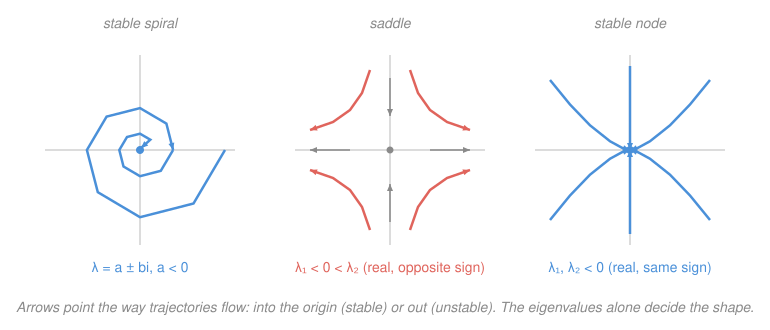

# Differential Equations · Lesson 3.2: Phase portraits and stability

> ⏱ ~15 min · Module 3: Linear systems and phase portraits · Builds on: [3.1 Linear systems via eigenvalues](03-01-linear-systems-eigenvalues.md) · Unlocks: Module 4 (transforms and PDEs)

## Why this matters

You just learned to solve $\mathbf{x}' = A\mathbf{x}$ by eigenvalues — but most of the time you don't want the formula, you want the *fate*: does the system settle down, blow up, or ring forever? A predator–prey model, a damped circuit, an economy near equilibrium — all get linearized to $\mathbf{x}' = A\mathbf{x}$ near a rest point, and the eigenvalues of $A$ tell you the whole qualitative story at a glance. This lesson turns four numbers (the real and imaginary parts of two eigenvalues) into a picture of the flow and a one-word verdict on stability. It's the payoff of Module 3 and the language `mechanics-refresher` and `analytical-mechanics` use for equilibria.

## The idea

Stop plotting each variable against time. Instead, plot the **state itself**: put $x_1$ on the horizontal axis and $x_2$ on the vertical, and watch the point $\mathbf{x}(t) = (x_1(t), x_2(t))$ trace a curve as time runs. That plane is the **phase plane**, the curve is a **trajectory**, and the field of little velocity arrows $\mathbf{x}' = A\mathbf{x}$ it follows is the **phase portrait**. Same "follow the arrows" game as the slope field of [1.1](01-01-odes-solutions-slope-fields.md) — but now the arrows live in state space, not the $t$–$y$ plane.

The origin is always a rest point: $A\mathbf{0} = \mathbf{0}$, so if you start there you never move. It's an **equilibrium**. The only question that matters is what happens to trajectories that start *near* it, and from 3.1 you already know the answer in disguise. Every solution is built from pieces $e^{\lambda t}\mathbf{v}$, so:

- a **real** eigenvalue's sign says whether its piece **grows** ($\lambda > 0$) or **decays** ($\lambda < 0$) along its eigen-direction;
- a **complex** pair $a \pm bi$ splits the job: the real part $a$ sets grow/decay (envelope $e^{at}$), the imaginary part $b$ sets **spinning** (frequency $b$).

That's it. Real parts decide in-or-out; imaginary parts decide whether you spiral on the way. The shape of the portrait is just the bookkeeping of those signs.

## The formal version

The equilibrium at the origin is classified by the eigenvalues $\lambda_1, \lambda_2$ of $A$ (a real $2\times 2$ matrix):

| Eigenvalues | Type | Picture | Stability |
|---|---|---|---|
| Real, **same sign** | **Node** | trajectories run straight in/out | stable if both $<0$, unstable if both $>0$ |
| Real, **opposite sign** | **Saddle** | in along one eigen-line, out along the other | **always unstable** |
| Complex $a\pm bi$, $a\neq 0$ | **Spiral** (focus) | trajectories wind in/out | stable if $a<0$, unstable if $a>0$ |
| **Pure imaginary** $\pm bi$ | **Center** | closed orbits (ellipses) | neutrally stable |

In words: same-sign reals all pull one way (a node); opposite signs fight (a saddle — the one type that's unstable no matter what); a nonzero real part with rotation is a spiral; no real part at all is a center that circles forever.

**Stability, precisely.** Call the origin **asymptotically stable** if every nearby trajectory returns to it ($\mathbf{x}(t)\to\mathbf 0$) — stable nodes and inward spirals. **Stable (neutrally)** if nearby trajectories stay nearby but don't return — a center. **Unstable** if at least one trajectory leaves — saddles, outward nodes/spirals. The clean rule: **the origin is asymptotically stable exactly when *both* eigenvalues have negative real part.**

**The trace–determinant shortcut.** You rarely need the eigenvalues themselves — two numbers you can read off $A$ decide everything. With $\tau = \operatorname{tr} A = \lambda_1 + \lambda_2$ and $\Delta = \det A = \lambda_1\lambda_2$:

$$\lambda = \frac{\tau \pm \sqrt{\tau^2 - 4\Delta}}{2}.$$

Then:

- $\Delta < 0 \Rightarrow$ **saddle** (real, opposite signs — always unstable).
- $\Delta > 0$ and $\tau < 0 \Rightarrow$ **asymptotically stable** (node if $\tau^2 - 4\Delta > 0$, spiral if $< 0$).
- $\Delta > 0$ and $\tau > 0 \Rightarrow$ **unstable** node/spiral.
- $\Delta > 0$ and $\tau = 0 \Rightarrow$ **center**.

In words: the determinant catches saddles ($\Delta<0$), then among the rest the **sign of the trace is the stability switch** and the **discriminant $\tau^2 - 4\Delta$ is the node-vs-spiral switch** (positive = real = node, negative = complex = spiral).

## Picture

Three verdicts, three pictures. The **spiral** winds inward because its eigenvalues have negative real part (decay) and nonzero imaginary part (rotation). The **saddle** funnels in along its stable (negative-eigenvalue) eigen-line and shoots out along the unstable (positive-eigenvalue) one — every off-axis trajectory eventually leaves. The **node** pulls straight in along both real negative eigen-directions, hugging the *slower* one (smaller $|\lambda|$) as it lands.

## Worked examples

**Example 1 (mechanical — classify a diagonal system).** Take

$$A = \begin{bmatrix} -1 & 0 \\ 0 & -4 \end{bmatrix}, \qquad \mathbf{x}' = A\mathbf{x}.$$

It's already diagonal, so the eigenvalues are on the diagonal: $\lambda_1 = -1,\ \lambda_2 = -4$. Real, same sign, both negative → **stable node** (asymptotically stable). Check with the shortcut: $\tau = -5 < 0$, $\Delta = 4 > 0$, and $\tau^2 - 4\Delta = 25 - 16 = 9 > 0$ (real) — stable node, agreed. Every trajectory decays to $\mathbf 0$; because $|\lambda_1| < |\lambda_2|$, the $e^{-t}$ direction dies slowest, so trajectories flatten toward the $x_1$-axis on the way in (the right panel of the figure).

**Example 2 (why you'd care — the damped oscillator is a spiral).** A damped spring $x'' + 2x' + 2x = 0$ becomes a first-order system with $x_1 = x$, $x_2 = x'$:

$$\mathbf{x}' = \begin{bmatrix} 0 & 1 \\ -2 & -2 \end{bmatrix}\mathbf{x}.$$

Trace–determinant: $\tau = -2$, $\Delta = 2$, discriminant $\tau^2 - 4\Delta = 4 - 8 = -4 < 0$ → complex eigenvalues, and $\tau < 0$ → **stable spiral**. Explicitly $\lambda = \frac{-2 \pm \sqrt{-4}}{2} = -1 \pm i$: real part $-1$ (the ringdown envelope $e^{-t}$), imaginary part $1$ (the oscillation). This is exactly the underdamped case from [2.2](02-02-oscillations-damping.md) — the position–velocity trajectory spirals into the origin as the spring rings itself to rest. Overdamping would make both eigenvalues real and negative: a stable *node*, no spiral, no ringing.

## Watch out

- You might think a phase-plane trajectory is a graph of $x_1$ versus $t$. It isn't — **time is hidden**; the curve is $x_2$ versus $x_1$, with $t$ running *along* it. A spiral in the phase plane is a decaying oscillation in time.
- You might think a big positive determinant means stability. $\Delta > 0$ only rules out the saddle; it says the eigenvalues share a sign, not *which* sign. **The trace is the stability switch** — $\tau < 0$ for stable, $\tau > 0$ for unstable. (A center sits exactly on $\tau = 0$.)
- You might read "stable" as "returns to equilibrium." A **center** is stable but *not* asymptotically stable — orbits circle forever without decaying. Pure-imaginary eigenvalues are the knife-edge, and the tiniest nonlinear or modeling perturbation can tip them either way.
- A saddle has one incoming eigen-direction, which tempts you to call it "half stable." It's **unstable, full stop** — almost every initial condition has a nonzero component along the growing direction and is swept away.

## One-liner

> Plot the state, not the clock: the real parts of the eigenvalues say in-or-out, the imaginary parts say spin-or-not, and $\tau<0,\ \Delta>0$ is the whole test for "settles down."

## Problems

**P1 (🟢)** Classify the origin (type **and** stability) for each system, using the eigenvalues:
(a) $A = \begin{bmatrix} -2 & 0 \\ 0 & -3 \end{bmatrix}$  (b) $A = \begin{bmatrix} 1 & 0 \\ 0 & -1 \end{bmatrix}$.

**P2 (🟡)** A system has eigenvalues $\lambda = -1 \pm 2i$. (a) What type is the origin, and is it stable? (b) One matrix with these eigenvalues is $A = \begin{bmatrix} -1 & -2 \\ 2 & -1 \end{bmatrix}$. Confirm your answer with the trace–determinant test (compute $\tau$, $\Delta$, and the discriminant).

**P3 (🔴, optional)** Consider the parameterized system

$$A(\alpha) = \begin{bmatrix} \alpha & 2 \\ -2 & -1 \end{bmatrix}.$$

Find the value of $\alpha$ at which the origin **switches from stable to unstable**, and say what type it is on each side of that value. Verify with both the eigenvalue formula and the trace–determinant test.

Solutions

**P1** (a) Diagonal, so $\lambda_1 = -2,\ \lambda_2 = -3$: real, same sign, both negative → **stable node** (asymptotically stable). *Verification:* $\tau = -5 < 0$, $\Delta = 6 > 0$, $\tau^2 - 4\Delta = 25 - 24 = 1 > 0$ (real) → stable node ✓.

(b) Diagonal, so $\lambda_1 = 1,\ \lambda_2 = -1$: real, **opposite signs** → **saddle**, which is **always unstable**. *Verification:* $\Delta = \lambda_1\lambda_2 = -1 < 0$ → saddle by the shortcut ✓ (the negative determinant is the saddle's fingerprint).

**P2** (a) Complex eigenvalues with nonzero imaginary part → **spiral**; real part $-1 < 0$ → **stable spiral** (asymptotically stable). The imaginary part $\pm 2$ just sets how fast it winds.

(b) $\tau = -1 + (-1) = -2$ and $\Delta = (-1)(-1) - (-2)(2) = 1 + 4 = 5$. Discriminant $\tau^2 - 4\Delta = 4 - 20 = -16 < 0$ → complex (spiral), and $\tau < 0$ with $\Delta > 0$ → asymptotically stable. **Stable spiral**, confirmed. *Verification via the formula:* $\lambda = \frac{-2 \pm \sqrt{-16}}{2} = \frac{-2 \pm 4i}{2} = -1 \pm 2i$ ✓ — exactly the given eigenvalues.

**P3** Read off $\tau = \operatorname{tr} A(\alpha) = \alpha - 1$ and $\Delta = \det A(\alpha) = \alpha(-1) - (2)(-2) = 4 - \alpha$.

Stability of a non-saddle is governed by the sign of $\tau$, so the stable→unstable switch happens where $\tau = 0$:

$$\alpha - 1 = 0 \implies \boxed{\alpha = 1}.$$

At $\alpha = 1$ the determinant is $\Delta = 4 - 1 = 3 > 0$ (no saddle), so this is a genuine stability crossing, not a saddle transition. Check the eigenvalue type near it via the discriminant $\tau^2 - 4\Delta = (\alpha-1)^2 - 4(4-\alpha) = \alpha^2 + 2\alpha - 15 = (\alpha+5)(\alpha-3)$, which is **negative for $-5 < \alpha < 3$** — so around $\alpha = 1$ the eigenvalues are complex and the origin is a **spiral**:

- $\alpha < 1$: $\tau < 0$, $\Delta > 0$ → **stable spiral**.
- $\alpha = 1$: $\tau = 0$, $\Delta > 0$ → **center** (the knife-edge).
- $\alpha > 1$ (up to $3$): $\tau > 0$, $\Delta > 0$ → **unstable spiral**.

*Verification via the eigenvalue formula:* $\lambda = \frac{(\alpha - 1) \pm \sqrt{(\alpha+5)(\alpha-3)}}{2}$. The real part is $\frac{\alpha-1}{2}$, which is negative for $\alpha<1$, zero at $\alpha=1$, positive for $\alpha>1$ — so $\operatorname{Re}\lambda$ changes sign exactly at $\alpha = 1$, matching the trace test. At $\alpha = 1$: $\lambda = \frac{0 \pm \sqrt{-12}}{2} = \pm i\sqrt{3}$, pure imaginary → center ✓.

## Flashback

**From Lesson 3.1 (Linear systems via eigenvalues):** Solve the initial-value problem

$$\mathbf{x}' = \begin{bmatrix} 1 & 2 \\ 2 & 1 \end{bmatrix}\mathbf{x}, \qquad \mathbf{x}(0) = \begin{bmatrix} 3 \\ 1 \end{bmatrix},$$

using eigenvalues and eigenvectors. (As a bonus, name the origin's type from the eigenvalues you find — it should agree with 3.2.)

Solution

**Eigenvalues:** $\det(A - \lambda I) = (1-\lambda)^2 - 4 = \lambda^2 - 2\lambda - 3 = (\lambda - 3)(\lambda + 1) = 0$, so $\lambda_1 = 3,\ \lambda_2 = -1$.

**Eigenvectors:** for $\lambda_1 = 3$, $(A - 3I)\mathbf{v} = \begin{bmatrix} -2 & 2 \\ 2 & -2 \end{bmatrix}\mathbf{v} = \mathbf 0 \Rightarrow v_1 = v_2$, take $\mathbf{v}_1 = \begin{bmatrix} 1 \\ 1 \end{bmatrix}$. For $\lambda_2 = -1$, $\begin{bmatrix} 2 & 2 \\ 2 & 2 \end{bmatrix}\mathbf{v} = \mathbf 0 \Rightarrow v_1 = -v_2$, take $\mathbf{v}_2 = \begin{bmatrix} 1 \\ -1 \end{bmatrix}$.

**General solution:** $\displaystyle \mathbf{x}(t) = c_1 e^{3t}\begin{bmatrix} 1 \\ 1 \end{bmatrix} + c_2 e^{-t}\begin{bmatrix} 1 \\ -1 \end{bmatrix}.$

**Apply the initial condition:** $c_1 + c_2 = 3$ and $c_1 - c_2 = 1$, so $c_1 = 2,\ c_2 = 1$:

$$\mathbf{x}(t) = 2e^{3t}\begin{bmatrix} 1 \\ 1 \end{bmatrix} + e^{-t}\begin{bmatrix} 1 \\ -1 \end{bmatrix} = \begin{bmatrix} 2e^{3t} + e^{-t} \\ 2e^{3t} - e^{-t} \end{bmatrix}.$$

*Type:* eigenvalues $3$ and $-1$ are real with opposite signs → **saddle** (unstable) — consistent with $\Delta = \det A = 1 - 4 = -3 < 0$.

*Verification:* $\mathbf{x}(0) = 2\begin{bmatrix}1\\1\end{bmatrix} + \begin{bmatrix}1\\-1\end{bmatrix} = \begin{bmatrix}3\\1\end{bmatrix}$ ✓. And $\mathbf{x}' = \begin{bmatrix} 6e^{3t} - e^{-t} \\ 6e^{3t} + e^{-t}\end{bmatrix}$; meanwhile $A\mathbf{x} = \begin{bmatrix} (2e^{3t}+e^{-t}) + 2(2e^{3t}-e^{-t}) \\ 2(2e^{3t}+e^{-t}) + (2e^{3t}-e^{-t}) \end{bmatrix} = \begin{bmatrix} 6e^{3t} - e^{-t} \\ 6e^{3t} + e^{-t} \end{bmatrix}$ ✓.

## Connections

- **Backward:** this is [3.1](03-01-linear-systems-eigenvalues.md) read geometrically — the eigen-solutions $e^{\lambda t}\mathbf{v}$ you built there are literally the straight-line trajectories along the eigen-directions here, and their signs draw the whole portrait. The "equilibrium" idea is [1.3](01-03-first-order-models.md)'s stable/unstable rest points, promoted from the line to the plane.
- **Forward:** Module 4 leaves the phase plane, but stability returns everywhere — Laplace transforms ([4.1](04-01-laplace-transform.md)) read the same eigenvalues as *poles*, with "negative real part" becoming "poles in the left half-plane," the engineer's stability test.
- **Sideways (physics/econ):** the damped oscillator of [2.2](02-02-oscillations-damping.md) is the stable spiral of Example 2; in economics and ecology, linearizing a nonlinear model (predator–prey, a market near equilibrium) at a rest point hands you exactly this $\mathbf{x}' = A\mathbf{x}$ classification — the eigenvalues of the Jacobian decide whether the equilibrium attracts, repels, or cycles. `analytical-mechanics` will call the pure-imaginary center the signature of an energy-conserving system.
