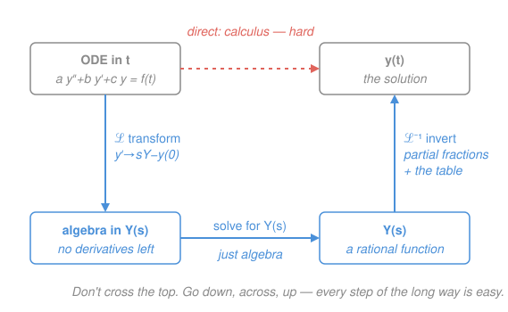

# Differential Equations · Lesson 4.1: The Laplace transform for IVPs

> ⏱ ~15 min · Module 4: Transforms and PDEs · Builds on: [2.3 Forcing, undetermined coefficients, and resonance](02-03-forcing-resonance.md) · Unlocks: 4.2 (intro to PDEs)

## Why this matters

Undetermined coefficients (from [2.3](02-03-forcing-resonance.md)) works beautifully until the forcing gets *ugly* — a switch that flips on at $t=1$, a hammer-blow at a single instant, a source defined piecewise. Guessing a particular solution for those is miserable, and matching initial conditions afterward is a second chore. The Laplace transform makes both vanish: it turns the whole initial-value problem into an **algebra problem**, solves it by clearing a fraction, and hands the initial conditions back to you for free. It's the tool control theory, circuit analysis, and signal processing actually run on.

## The idea

A transform is a change of language. The Laplace transform takes a function of time $f(t)$ and rewrites it as a function of a new variable $s$, called $F(s)$ — and in that new language, **calculus becomes arithmetic**. Differentiating in $t$ turns into *multiplying by $s$*. So a differential equation — a sentence about derivatives — becomes a plain algebraic equation about $s$, with no derivatives left in it. You solve that by hand, then translate back.

The magic ingredient: when you transform $y'$, the initial value $y(0)$ falls out of the machinery automatically and rides along in the equation. You never solve for a general solution and *then* apply the conditions — they're baked in from the first step. Laplace swallows the initial conditions whole.

And because the transform integrates over *all* of $t$ from $0$ to $\infty$, it doesn't care whether $f$ has jumps or spikes — it digests a switch turning on or an instantaneous impulse as easily as a smooth sine.

## The formal version

**The transform.** For a function $f(t)$ defined on $t\ge 0$,

$$\mathcal{L}\{f\}(s) = \int_0^\infty e^{-st} f(t)\,dt = F(s).$$

In words: multiply $f$ by the decaying weight $e^{-st}$ and total it up over all time. That integral runs to $\infty$, so it is an **improper integral** — exactly the fence-to-infinity limit from [calc-refresher 2.3](../../calc-refresher/lessons/02-03-improper-integrals-and-models.md), and it converges precisely when $e^{-st}$ kills $f$ fast enough (any $s$ larger than $f$'s growth rate). Here $s$ is the new frequency-like variable, $F(s)$ the transformed function, and $\mathcal{L}$ the operator.

**The derivative rules — the whole point.** Integrate $\int_0^\infty e^{-st}y'\,dt$ by parts (the boundary term $e^{-st}y$ dies at $\infty$, just as in calc 2.3):

$$\mathcal{L}\{y'\} = sY - y(0), \qquad \mathcal{L}\{y''\} = s^2 Y - s\,y(0) - y'(0),$$

where $Y = \mathcal{L}\{y\}(s)$. In words: **each derivative becomes a factor of $s$, and the initial conditions drop in as subtracted constants.** This one fact is why Laplace annihilates IVPs — differentiation is now multiplication, and $y(0), y'(0)$ enter for free.

**The table.** Invert by reading the table backwards — recognize $Y(s)$ as an entry (after partial fractions) and write down its $t$-function.

| $f(t)$ | $F(s) = \mathcal{L}\{f\}(s)$ |
|---|---|
| $1$ | $\dfrac{1}{s}$ |
| $e^{at}$ | $\dfrac{1}{s-a}$ |
| $t^n$ | $\dfrac{n!}{s^{n+1}}$ |
| $\cos\omega t$ | $\dfrac{s}{s^2+\omega^2}$ |
| $\sin\omega t$ | $\dfrac{\omega}{s^2+\omega^2}$ |
| $u(t-a)$ (unit step) | $\dfrac{e^{-as}}{s}$ |
| $u(t-a)\,f(t-a)$ (shift) | $e^{-as}F(s)$ |
| $\delta(t-a)$ (impulse) | $e^{-as}$ |
| $y'$ | $sY - y(0)$ |
| $y''$ | $s^2Y - s\,y(0) - y'(0)$ |

**The method, in three moves:** (1) transform the whole ODE, turning it into an algebraic equation in $Y(s)$; (2) solve that equation for $Y(s)$ — pure algebra; (3) **invert** $Y(s)$ back to $y(t)$, using partial fractions to break it into table-shaped pieces.

**Discontinuous forcing.** The **unit step** $u(t-a)$ is $0$ before $t=a$ and $1$ after — a switch flipping on. The shift rule $\mathcal{L}\{u(t-a)f(t-a)\} = e^{-as}F(s)$ says a factor $e^{-as}$ in the $s$-world means "delay by $a$ in the $t$-world." The **impulse** $\delta(t-a)$ is an idealized instantaneous kick concentrated at $t=a$ (a unit hammer-blow); its transform is just $e^{-as}$. Both are trivial to carry through the algebra and translate directly to physical switches and shocks.

## Picture

The direct route across the top — solving the ODE by calculus — is the hard road. Laplace sends you *around* the square: **down** (transform to algebra), **across** (solve for $Y(s)$), **up** (invert with partial fractions and the table). Every step of the detour is easy; that's the whole trade.

## Worked examples

**Example 1 (mechanical — the method in miniature).** Solve $y' + 2y = 0$, $y(0) = 5$.

Transform both sides. Using $\mathcal{L}\{y'\} = sY - y(0)$:

$$\big(sY - 5\big) + 2Y = 0 \;\Longrightarrow\; (s+2)Y = 5 \;\Longrightarrow\; Y = \frac{5}{s+2}.$$

Read the table backwards: $\dfrac{1}{s-a}\leftrightarrow e^{at}$ with $a = -2$. So $y = 5e^{-2t}$. No general-solution-then-apply-IC step — the $5$ was in the equation from the start.

**Example 2 (why you'd care — a switched-on force).** A first-order system rests at zero, then at $t=2$ a constant unit force switches on: $y' + 3y = u(t-2)$, $y(0) = 0$. Undetermined coefficients would force you to solve on $t<2$ and $t>2$ separately and stitch. Laplace does it in one pass. Transform, using $\mathcal{L}\{u(t-2)\} = e^{-2s}/s$:

$$(s+3)Y = \frac{e^{-2s}}{s} \;\Longrightarrow\; Y = e^{-2s}\cdot\frac{1}{s(s+3)}.$$

Partial fractions on the non-exponential part: $\dfrac{1}{s(s+3)} = \dfrac{1/3}{s} - \dfrac{1/3}{s+3}$, which inverts to $g(t) = \tfrac{1}{3}\big(1 - e^{-3t}\big)$. The factor $e^{-2s}$ means "delay $g$ by $2$" (shift rule):

$$y(t) = u(t-2)\cdot \tfrac{1}{3}\Big(1 - e^{-3(t-2)}\Big).$$

Nothing happens until $t=2$; then the response climbs toward its new steady value $\tfrac13$. The switch, the delay, and the initial condition were all handled by algebra.

## Watch out

- **You might think you can drop $u(t-a)$ once you've used the shift rule — you can't.** The answer is genuinely piecewise: it is $0$ for $t<a$ and only "turns on" at $t=a$. Keep the $u(t-a)$ factor; it *is* the switch.
- **You might think the shift rule needs $f(t-a)$, but your $F(s)$ came from plain $f(t)$.** The rule pairs $e^{-as}F(s)$ with the *shifted* function $f(t-a)$: invert $F(s)$ to get $g(t)$ first, then replace every $t$ by $t-a$ and multiply by $u(t-a)$. Forgetting the shift (writing $g(t)$ instead of $g(t-a)$) is the classic error.
- **You might read $\delta(t-a)$ as an ordinary function — it isn't.** It's an idealized spike with $\mathcal{L}\{\delta(t-a)\} = e^{-as}$; treat it only through its transform. Under a $\delta$ forcing, the solution's *derivative* jumps while $y$ itself stays continuous.

## One-liner

> Laplace trades calculus for algebra: transform the IVP (initial conditions ride in free), solve the algebraic equation for $Y(s)$, then invert with partial fractions and the table — and jumps and impulses come along for free.

## Problems

**P1 (🟢)** Solve $y' - 3y = 0$, $y(0) = 2$ with the Laplace transform.

**P2 (🟡)** Solve $y'' + y = 0$, $y(0) = 0$, $y'(0) = 1$ using the second-derivative rule and the table.

**P3 (🔴)** Solve the step-forced IVP $y' + y = u(t-1)$, $y(0) = 0$ (the forcing switches on at $t=1$). Give $y(t)$ as an explicit piecewise function.

Solutions

**P1** Transform, using $\mathcal{L}\{y'\} = sY - y(0)$ with $y(0)=2$:

$$(sY - 2) - 3Y = 0 \;\Longrightarrow\; (s-3)Y = 2 \;\Longrightarrow\; Y = \frac{2}{s-3}.$$

Table, $\dfrac{1}{s-a}\leftrightarrow e^{at}$ with $a=3$:

$$\boxed{y = 2e^{3t}}.$$

*Verify (substitute back):* $y' = 6e^{3t}$, so $y' - 3y = 6e^{3t} - 3(2e^{3t}) = 0$ ✓, and $y(0) = 2e^{0} = 2$ ✓.

**P2** Transform with $\mathcal{L}\{y''\} = s^2Y - s\,y(0) - y'(0)$; here $y(0)=0$, $y'(0)=1$:

$$\big(s^2 Y - s\cdot 0 - 1\big) + Y = 0 \;\Longrightarrow\; (s^2+1)Y = 1 \;\Longrightarrow\; Y = \frac{1}{s^2+1}.$$

Table, $\dfrac{\omega}{s^2+\omega^2}\leftrightarrow \sin\omega t$ with $\omega=1$:

$$\boxed{y = \sin t}.$$

*Verify:* $y' = \cos t$, $y'' = -\sin t$, so $y'' + y = -\sin t + \sin t = 0$ ✓; $y(0) = \sin 0 = 0$ ✓ and $y'(0) = \cos 0 = 1$ ✓.

**P3** Transform, using $\mathcal{L}\{u(t-1)\} = e^{-s}/s$ and $y(0)=0$:

$$(sY - 0) + Y = \frac{e^{-s}}{s} \;\Longrightarrow\; (s+1)Y = \frac{e^{-s}}{s} \;\Longrightarrow\; Y = e^{-s}\cdot\frac{1}{s(s+1)}.$$

Partial fractions on the non-exponential factor: $\dfrac{1}{s(s+1)} = \dfrac{1}{s} - \dfrac{1}{s+1}$, which inverts to $g(t) = 1 - e^{-t}$. The $e^{-s}$ delays $g$ by $1$ (shift rule, $a=1$):

$$y(t) = u(t-1)\big(1 - e^{-(t-1)}\big) = \begin{cases} 0, & t < 1,\\[4pt] 1 - e^{-(t-1)}, & t \ge 1.\end{cases}$$

*Verify (substitute back, both regimes):* For $t<1$: $y=0$, $y'=0$, forcing $u(t-1)=0$, so $y'+y = 0$ ✓; and $y(0)=0$ ✓. For $t>1$: $y' = e^{-(t-1)}$, so $y' + y = e^{-(t-1)} + \big(1 - e^{-(t-1)}\big) = 1 = u(t-1)$ ✓. At the switch $t=1$ the value is continuous ($y(1)=1-e^0=0$, matching the left piece), with only the slope turning on — exactly right for a step-forced first-order system.

## Flashback

**From Lesson 2.1 (Constant-coefficient second-order equations):** Solve the homogeneous IVP $y'' + 3y' + 2y = 0$, $y(0)=1$, $y'(0)=0$ using the **characteristic equation** — then notice which polynomial you factored.

Solution

The characteristic equation is $r^2 + 3r + 2 = (r+1)(r+2) = 0$, so $r = -1, -2$ (distinct real roots) and the general solution is $y = c_1 e^{-t} + c_2 e^{-2t}$. Apply the conditions: $y(0) = c_1 + c_2 = 1$; and $y' = -c_1 e^{-t} - 2c_2 e^{-2t}$ gives $y'(0) = -c_1 - 2c_2 = 0$, i.e. $c_1 = -2c_2$. Substituting, $-2c_2 + c_2 = 1 \Rightarrow c_2 = -1$, $c_1 = 2$:

$$\boxed{y = 2e^{-t} - e^{-2t}}.$$

*Verify:* $y(0) = 2 - 1 = 1$ ✓; $y' = -2e^{-t} + 2e^{-2t}$ gives $y'(0) = -2 + 2 = 0$ ✓; and $y'' = 2e^{-t} - 4e^{-2t}$, so $y'' + 3y' + 2y = (2-6+4)e^{-t} + (-4+6-2)e^{-2t} = 0$ ✓.

The polynomial you factored, $s^2 + 3s + 2$, is *exactly* the denominator Laplace would produce: transforming with zero-adjusted initial data, $(s^2 + 3s + 2)Y = \text{(constants from the ICs)}$. The characteristic equation and the Laplace denominator are the same object — this lesson just reads it a new way.

## Connections

- **Backward:** the transform is an [improper integral](../../calc-refresher/lessons/02-03-improper-integrals-and-models.md) (calc 2.3) whose convergence needs $e^{-st}$ to beat $f$'s growth, and the derivative rule is integration by parts with a vanishing boundary term — both straight from calc-refresher Module 2. The homogeneous machinery it replaces is [2.1](02-01-second-order-constant-coefficient.md)'s characteristic equation (see the Flashback), and it handles the same [forcing](02-03-forcing-resonance.md) as 2.3 without guessing.
- **Forward:** [4.2](04-02-intro-pdes-separation.md) transforms PDEs the same way in one variable, and the transform's inversion by matching table pieces is the discrete cousin of the Fourier expansion you'll meet there.
- **Sideways (physics/engineering):** $Y(s)/F(s)$ is the **transfer function** of a linear system — the object that circuit analysis, control theory, and signal processing are built on; step and impulse responses (P3, and the $\delta$ row of the table) are their two basic test inputs.
