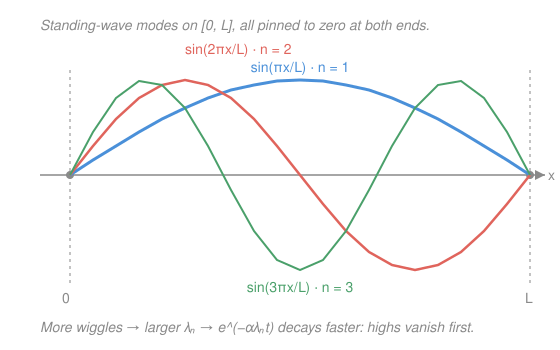

# Differential Equations · Lesson 4.2: Intro to PDEs: separation of variables

> ⏱ ~15 min · Module 4: Transforms and PDEs · Builds on: [2.1 Constant-coefficient homogeneous equations](02-01-second-order-constant-coefficient.md), [3.1 Linear systems via eigenvalues](03-01-linear-systems-eigenvalues.md) · Unlocks: mechanics, E&M, quantum mechanics (course complete)

## Why this matters

Every ODE so far tracked one thing changing in time. But a metal rod has a *temperature at every point*, and that whole profile evolves — one equation now governs a function of two variables, $u(x,t)$. This is a **partial** differential equation (PDE), and it's the language of continuum physics: heat flow, vibrating strings, electromagnetic waves, the Schrödinger equation. The miracle of this lesson is that the most important PDEs collapse back into the second-order ODEs you already solve — plus one new idea, **Fourier series**, that lets you build any starting shape out of simple standing waves.

## The idea

Take a rod of length $L$, both ends held at temperature zero, with some initial heat profile $f(x)$ along it. Heat diffuses: hot spots bleed into cold neighbors. The governing rule is the **heat equation**

$$u_t = \alpha\,u_{xx},$$

where $u(x,t)$ is the temperature at position $x$ and time $t$, subscripts are partial derivatives ($u_t=\partial u/\partial t$, $u_{xx}=\partial^2 u/\partial x^2$), and $\alpha>0$ is a material constant (how fast it conducts). In words: *the rate a point heats up is proportional to how "cupped" the profile is there* — a local minimum (a dip surrounded by warmth) fills in; a peak drains.

Solving this looks hopeless until you make one bold guess: what if the solution's shape and its time-decay **separate**, so that

$$u(x,t) = X(x)\,T(t)$$

— a fixed spatial pattern $X(x)$ whose *amplitude* $T(t)$ rises or falls uniformly? Substitute, and the two variables split onto opposite sides of an equals sign. Since $x$ and $t$ vary independently, each side must be a **constant**. One PDE becomes two ODEs — and they're exactly the constant-coefficient kind from [2.1](02-01-second-order-constant-coefficient.md).

The boundary conditions then do something beautiful: they only allow *certain* spatial patterns, the ones that fit zero-to-zero across the rod — $\sin(n\pi x/L)$ for $n=1,2,3,\dots$. These are the **modes**. Any starting shape gets written as a sum of them (that's the Fourier series), and each mode simply decays at its own rate. Wigglier modes decay faster, so the profile smooths out over time.

## The formal version

**Separate.** Plug $u=X(x)T(t)$ into $u_t=\alpha u_{xx}$: the left side is $X\,T'$, the right is $\alpha\,X''\,T$. Divide by $\alpha X T$:

$$\frac{T'}{\alpha T} = \frac{X''}{X} = -\lambda .$$

In words: a function of $t$ alone equals a function of $x$ alone, so both equal a shared constant, named $-\lambda$ (the minus sign is bookkeeping — it makes $\lambda>0$ give the physically sensible decaying, oscillating case).

**Two ODEs.** This yields

$$X'' + \lambda X = 0, \qquad T' = -\alpha\lambda\,T .$$

The spatial one is a 2.1 problem; the temporal one is first-order decay.

**Boundary conditions quantize $\lambda$.** Fixed-zero ends mean $X(0)=X(L)=0$. Solving $X''+\lambda X=0$ with these forces $A=0$ (from $X(0)=0$) and $\sin(\sqrt\lambda\,L)=0$, so $\sqrt\lambda\,L=n\pi$:

$$\boxed{\;\lambda_n=\left(\frac{n\pi}{L}\right)^2,\qquad X_n(x)=\sin\frac{n\pi x}{L},\qquad n=1,2,3,\dots\;}$$

In words: only a discrete ladder of $\lambda$'s admits a nonzero solution. This is an **eigenvalue problem** — the differential operator $-d^2/dx^2$ plays the role of the matrix $A$ from [3.1](03-01-linear-systems-eigenvalues.md), the $\lambda_n$ are its eigenvalues, and the modes $X_n$ are its eigenfunctions. Same structure, infinitely many dimensions.

**Time factors.** With $\lambda_n$ fixed, $T_n' = -\alpha\lambda_n T_n$ gives $T_n(t)=e^{-\alpha\lambda_n t}$ (heat: pure decay). For the **wave equation** $u_{tt}=c^2u_{xx}$ the temporal ODE is instead $T''=-c^2\lambda_n T$, so $T_n=\cos(c\sqrt{\lambda_n}\,t)$ and $\sin(c\sqrt{\lambda_n}\,t)$ — the same modes, now *oscillating* instead of decaying (here $c$ is the wave speed).

**Superpose and match the initial data.** Each $X_n T_n$ solves the PDE and the boundary conditions; the equation is linear, so any sum does too. Choose the weights so that at $t=0$ the sum equals $f(x)$:

$$u(x,t)=\sum_{n=1}^\infty b_n\,\sin\frac{n\pi x}{L}\;e^{-\alpha(n\pi/L)^2 t}, \qquad u(x,0)=\sum_{n=1}^\infty b_n\sin\frac{n\pi x}{L}=f(x).$$

That last equation is a **Fourier sine series**. The coefficients come from an inner-product projection — the modes are *orthogonal* ($\int_0^L \sin\frac{m\pi x}{L}\sin\frac{n\pi x}{L}\,dx=0$ unless $m=n$), so multiplying by $\sin\frac{n\pi x}{L}$ and integrating isolates one weight:

$$b_n=\frac{2}{L}\int_0^L f(x)\,\sin\frac{n\pi x}{L}\,dx .$$

In words: $b_n$ is "how much of mode $n$" is in your starting shape — exactly a component of a vector along a basis direction, done with integrals instead of dot products.

## Picture

## Worked examples

**Example 1 (one mode, watched decay).** Suppose a rod of length $L$ starts as a single hump, $f(x)=5\sin\frac{2\pi x}{L}$. That's already one pure mode ($n=2$), so no series is needed — attach its time factor:

$$u(x,t)=5\,\sin\frac{2\pi x}{L}\,e^{-\alpha(2\pi/L)^2 t}.$$

The shape never changes; only its height shrinks, by a factor $e^{-4\alpha\pi^2 t/L^2}$. Four times faster than the $n=1$ hump would — because $\lambda_2=4\lambda_1$.

**Example 2 (why you'd care — the wave version).** Swap heat for a plucked guitar string, $u_{tt}=c^2u_{xx}$, ends pinned. The *same* modes $\sin\frac{n\pi x}{L}$ now come with *oscillating* time factors $\cos(c n\pi t/L)$. Mode $n$ vibrates at frequency $\frac{cn\pi}{L}$ — a fundamental plus its integer overtones. That integer ladder is *why a string sounds musical*: separation of variables is the mathematics of harmony. Heat smooths; waves sing; the spatial eigenvalue problem is identical.

## Watch out

- You might think the separation constant could have either sign. But $\lambda\le 0$ forces $X$ to be a line or a real exponential, and *neither* can hit zero at both ends without being identically zero. Only $\lambda>0$ (oscillatory $X$) survives the boundary conditions — that's what quantizes it.
- You might think $u=XT$ assumes the answer is one product. It doesn't: each *mode* is a product, but the actual solution is their **sum**. Superposition is doing the real work — a single product almost never matches a given $f(x)$.
- You might reach for a full Fourier series (sines *and* cosines). With fixed-*zero* ends you get only **sines**, because every basis function must vanish at $0$ and $L$. Insulated ends (different boundary conditions) would flip you to cosines.

## One-liner

> Separation turns a PDE into an eigenvalue problem in space times a simple ODE in time; Fourier reassembles the answer from standing-wave building blocks, and the wiggliest ones die first.

## Problems

**P1 (🟢)** Verify directly that $u(x,t)=e^{-\alpha(\pi/L)^2 t}\sin\frac{\pi x}{L}$ solves the heat equation $u_t=\alpha u_{xx}$ and satisfies $u(0,t)=u(L,t)=0$.

**P2 (🟡)** Starting from $u_t=\alpha u_{xx}$ with $u(0,t)=u(L,t)=0$, carry out separation of variables: derive the two ODEs, use the boundary conditions to find $\lambda_n$ and $X_n$, solve for $T_n$, and write the general series solution.

**P3 (🔴)** A rod of length $L$ starts at uniform temperature $u(x,0)=T_0$ (a constant), with both ends clamped to $0$ for $t>0$. Find the Fourier sine coefficients $b_n$ and write $u(x,t)$. Which modes are present, and which single mode dominates once $t$ is large?

Solutions

**P1** Differentiate the product. Write $k=(\pi/L)^2$ so $u=e^{-\alpha k t}\sin\frac{\pi x}{L}$.

- Time: $u_t = -\alpha k\,e^{-\alpha k t}\sin\frac{\pi x}{L}$.
- Space: $u_x = \frac{\pi}{L}e^{-\alpha k t}\cos\frac{\pi x}{L}$, then $u_{xx} = -\left(\frac{\pi}{L}\right)^2 e^{-\alpha k t}\sin\frac{\pi x}{L} = -k\,u$.

So $\alpha u_{xx} = -\alpha k\,e^{-\alpha k t}\sin\frac{\pi x}{L} = u_t$. ✓ **The PDE holds.**

Boundaries: $u(0,t)=e^{-\alpha k t}\sin 0 = 0$ and $u(L,t)=e^{-\alpha k t}\sin\pi = 0$. ✓ Both ends stay at zero for all $t$.

**P2** Guess $u=X(x)T(t)$. Then $u_t=X T'$ and $u_{xx}=X'' T$, so the PDE reads $X T' = \alpha X'' T$. Divide by $\alpha X T$:

$$\frac{T'}{\alpha T}=\frac{X''}{X}=-\lambda\quad(\text{constant, since the sides depend on different variables}).$$

*Spatial ODE:* $X''+\lambda X=0$ with $X(0)=X(L)=0$ (the boundary conditions must hold for all $t$, and $T\not\equiv0$, so they land on $X$). For $\lambda>0$ the general solution is $X=A\cos(\sqrt\lambda\,x)+B\sin(\sqrt\lambda\,x)$. Then $X(0)=A=0$, leaving $X=B\sin(\sqrt\lambda\,x)$; and $X(L)=B\sin(\sqrt\lambda\,L)=0$ needs $\sqrt\lambda\,L=n\pi$. Hence

$$\lambda_n=\left(\frac{n\pi}{L}\right)^2,\qquad X_n(x)=\sin\frac{n\pi x}{L},\quad n=1,2,3,\dots$$

(The cases $\lambda\le0$ give only $X\equiv0$ — see "Watch out.")

*Temporal ODE:* $T'=-\alpha\lambda_n T \Rightarrow T_n(t)=e^{-\alpha\lambda_n t}=e^{-\alpha(n\pi/L)^2 t}$.

*Superpose:*

$$u(x,t)=\sum_{n=1}^\infty b_n\,\sin\frac{n\pi x}{L}\;e^{-\alpha(n\pi/L)^2 t}.$$

*Verify a single term* $X_nT_n$: $\partial_t(X_nT_n)=-\alpha\lambda_n X_nT_n$ and $\alpha\,\partial_{xx}(X_nT_n)=\alpha(-\lambda_n)X_nT_n$ — equal, so each term solves the PDE, and each vanishes at $x=0,L$. By linearity the sum does too. ✓

**P3** Match $f(x)=T_0$ with the sine series, so $b_n=\dfrac{2}{L}\displaystyle\int_0^L T_0\sin\frac{n\pi x}{L}\,dx$:

$$b_n=\frac{2T_0}{L}\left[-\frac{L}{n\pi}\cos\frac{n\pi x}{L}\right]_0^L=\frac{2T_0}{n\pi}\bigl(1-\cos n\pi\bigr)=\frac{2T_0}{n\pi}\bigl(1-(-1)^n\bigr).$$

So $b_n=0$ for even $n$, and $b_n=\dfrac{4T_0}{n\pi}$ for odd $n$. **Only odd modes appear** (the profile is symmetric about the rod's center, which the even modes can't build). Therefore

$$u(x,t)=\sum_{n\ \text{odd}}\frac{4T_0}{n\pi}\,\sin\frac{n\pi x}{L}\;e^{-\alpha(n\pi/L)^2 t}=\frac{4T_0}{\pi}\left(\sin\frac{\pi x}{L}e^{-\alpha(\pi/L)^2t}+\frac{1}{3}\sin\frac{3\pi x}{L}e^{-\alpha(3\pi/L)^2t}+\cdots\right).$$

For large $t$ the $n=3$ term decays $e^{-8\alpha(\pi/L)^2 t}$ faster than $n=1$, and higher ones faster still, so the **$n=1$ mode dominates**: the profile relaxes into a single slowly-shrinking hump, $u\approx\frac{4T_0}{\pi}\sin\frac{\pi x}{L}\,e^{-\alpha(\pi/L)^2 t}$.

*Verify:* at $t=0$ the series equals the Fourier sine expansion of the constant $T_0$ on $(0,L)$, reproducing the initial condition; each term individually solves $u_t=\alpha u_{xx}$ and vanishes at both ends (by P2), so the sum satisfies the PDE and boundary conditions. ✓ (The sharp corners of the constant profile at the ends are exactly what the infinitely many high modes are needed to represent — and they're the first to disappear.)

## Flashback

**From Lesson 2.1 (Constant-coefficient homogeneous equations):** The temporal factor of a *damped vibrating* mode obeys a second-order constant-coefficient ODE. Solve the initial-value problem

$$T'' + 6T' + 13T = 0,\qquad T(0)=2,\ T'(0)=0,$$

and say which of 2.1's three root cases this is.

Solution

Characteristic equation: $r^2+6r+13=0$, so $r=\dfrac{-6\pm\sqrt{36-52}}{2}=-3\pm 2i$ — **complex roots** (2.1's third case: underdamped decay-with-oscillation). The general solution is

$$T(t)=e^{-3t}\bigl(c_1\cos 2t+c_2\sin 2t\bigr).$$

Apply the data: $T(0)=c_1=2$. Differentiate, $T'=e^{-3t}\bigl(-3(c_1\cos2t+c_2\sin2t)+(-2c_1\sin2t+2c_2\cos2t)\bigr)$; at $t=0$, $T'(0)=-3c_1+2c_2=0\Rightarrow c_2=3$. So

$$T(t)=e^{-3t}\bigl(2\cos 2t+3\sin 2t\bigr).$$

Check: $T(0)=2$ ✓. $T'(0)=-3(2)+2(3)=0$ ✓. This is exactly the shape of a heat/wave time-factor with damping — an envelope $e^{-3t}$ times an oscillation, the same machinery separation of variables hands you for the temporal ODE.

## Connections

- **Backward:** the spatial ODE $X''+\lambda X=0$ is a pure [2.1](02-01-second-order-constant-coefficient.md) constant-coefficient equation — separation's whole payoff is reducing a PDE to equations you already solve. The Fourier coefficient $b_n=\frac{2}{L}\int_0^L f\sin\frac{n\pi x}{L}dx$ is a definite integral of the kind built in [4.1](04-01-laplace-transform.md)'s transform world, and the quantized eigenvalues $\lambda_n$ mirror the eigenvalue solutions of [3.1](03-01-linear-systems-eigenvalues.md), now for a differential operator instead of a matrix.
- **Forward:** this is the gateway to continuum physics. `em-refresher` solves Laplace's and the wave equation this exact way; `analytical-mechanics` treats normal modes as these eigenfunctions; and in quantum mechanics the time-independent Schrödinger equation *is* the spatial eigenvalue problem $-X''+VX=EX$, with $E$ the quantized energy.
- **Sideways (linear algebra ↔ Fourier):** "project onto orthogonal modes and add up the components" is the dot-product decomposition of a vector onto a basis, carried into infinite dimensions with $\int f\,g\,dx$ as the inner product. Fourier series *is* linear algebra — the modes are an orthogonal basis for functions.

*Course complete — the Differential Equations refresher ends here. You can now read an ODE's behavior by exact solution, transform, or phase portrait, and you've seen how a PDE folds back into all of it.*
