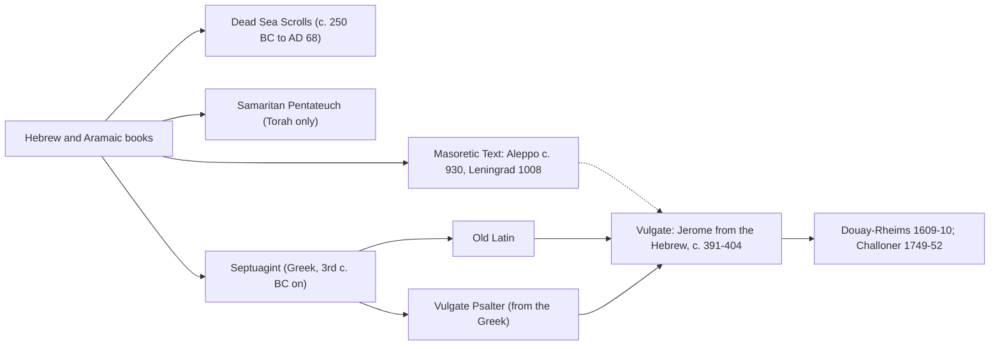

# The Old Testament · Lesson 1.1: What the Old Testament is

> ⏱ ~15 min · Module 1: How the Church reads the Old Testament · Builds on: [`fundamental-theology` 3.3 The canon as defined](../../fundamental-theology/lessons/03-03-the-canon-as-defined.md) · Unlocks: [1.2 The senses of Scripture](01-02-the-senses-of-scripture.md)

## Why this matters

Put a Jewish Tanakh, a Protestant Bible and a Catholic Bible side by side. The first has 24 books, the second 39 and the third 46. The Tanakh ends with Chronicles, the Protestant Old Testament with Malachi, and the Douay–Rheims with Maccabees. All three are translations of texts that scholars rebuild from manuscripts copied over two thousand years apart. Before reading any passage, know which book, where it stands, and which text of it you hold.

## The idea

Keep two questions apart.

- **The collection:** which books, counted how, in what order. The order is already an interpretation, because the last book tells the reader what the whole story is waiting for.
- **The text:** for each book, which words. No original manuscript survives. What survives is a family of witnesses: Hebrew copies, ancient translations, and scrolls from the Judean desert.

Even the name is a reading. *Tanakh* is an acronym of its three parts. "Old Testament" is a Christian name: *testamentum* is the Latin for the Greek *diathēkē*, which renders the Hebrew *berit*, "covenant". So the name assumes the "new covenant" of Jeremiah 31:31. Melito of Sardis, about 170, is the first Christian we know of to use the phrase for a list of books ("the books of the Old Testament", in Eusebius, *Church History* IV.26, NPNF 2nd ser. vol. 1). Scholars often say "Hebrew Bible" to stay neutral. This course says "Old Testament" because it reads the collection as the Church does, and it states the Jewish reading on its own terms.

## Source

The Prologue to Ecclesiasticus (Sirach), from the Douay–Rheims (Challoner), which translates the Vulgate. Its author, who put his grandfather's Hebrew book into Greek, says he came to Egypt "in the eight and thirtieth year" of Ptolemy Euergetes, which is usually reckoned as 132 BC.

> The knowledge of many and great things hath been shewn us by the law, and the prophets, and others that have followed them ... My grandfather Jesus, after he had much given himself to a diligent reading of the law, and the prophets, and other books, that were delivered to us from our fathers, had a mind also to write something himself ... for the Hebrew words have not the same force in them when translated into another tongue. And not only these, but the law also itself, and the prophets, and the rest of the books, have no small difference, when they are spoken in their own language.

The threefold formula appears **three times**. The first two parts always have names: "the law" and "the prophets". The third never does. It is "others that have followed them", "other books", "the rest of the books". Many scholars take this as evidence that by the late second century BC the Law and the Prophets were closed collections and the third group was not yet fixed. That is an inference, and 6.1 weighs it. The grandson also makes the Bible's first remark about translation: the Law and the Prophets read differently in Greek. So a Greek version of them already existed, and it already differed from the Hebrew.

## The argument

1. **The [Tanakh](../reference.md#tanakh-and-the-christian-order).** Its three parts give the acronym T-N-K. The **Torah** (*torah* means "instruction" more than "law") is Genesis to Deuteronomy. The **Nevi'im**, "Prophets", has two sections. The Former Prophets are Joshua, Judges, Samuel and Kings. The Latter Prophets are Isaiah, Jeremiah, Ezekiel and the Twelve, which count as one scroll. The **Ketuvim**, "Writings", are Psalms, Proverbs, Job, Song of Songs, Ruth, Lamentations, Ecclesiastes, Esther, Daniel, Ezra-Nehemiah and Chronicles. That gives 5 + 8 + 11 = 24 books. In the Talmud's order (*Bava Batra* 14b) and in most printed Jewish Bibles, Chronicles comes last. It ends with Cyrus sending the exiles home, "let him go up" (2 Chr 36:23 [DR 2 Paralipomenon]). The great medieval codices put Chronicles first among the Writings instead, so the ending is a convention, not a law. *In words:* the Jewish order runs from Torah, through prophets who call Israel back to it, to a people returning to the land.

2. **The Christian order.** It follows the Greek codices and sorts the books by genre: **Law, History, Wisdom/Poetry, Prophets**. Ruth moves next to Judges, Lamentations next to Jeremiah, and Daniel joins the prophets. Protestant Bibles end with Malachi's promise to send Elijah (Mal 4:5 [Hebrew 3:23]), and the next page is John the Baptist. The Vulgate and the Douay put 1–2 Maccabees after the prophets. *In words:* the Christian order ends by pointing forward, to a prophet still to come or to the history just before him.

3. **The counts.** The Jewish 24 and the Protestant 39 contain the **same text**. Protestants split Samuel, Kings, Chronicles and Ezra-Nehemiah in two and count the Twelve one by one: 24 + 4 + 11 = 39. The Catholic 46 adds seven **[deuterocanonical books](../reference.md#deuterocanonical-books)**: Tobit, Judith, Wisdom, Sirach, Baruch (with the Letter of Jeremiah as its chapter 6), and 1–2 Maccabees. It also has Greek sections of Esther and Daniel. Eastern Orthodox Bibles carry a few more, among them 1 Esdras and 3 Maccabees. The terms *protocanonical* and *deuterocanonical* ("first" and "second canon") are usually credited to Sixtus of Siena's *Bibliotheca Sancta* (1566). They record when a book's acceptance was settled, not its rank. Protestants call the same seven "the Apocrypha". As [`fundamental-theology` 3.3](../../fundamental-theology/lessons/03-03-the-canon-as-defined.md) showed, Trent's list has one status for every book on it. How the lists came apart is [6.1](06-01-how-the-old-testament-canon-formed.md).

4. **Languages.** Most of the Old Testament is in Hebrew. Some of it is in **Aramaic**: Daniel 2:4b–7:28, Ezra 4:8–6:18 and 7:12–26, one verse of Jeremiah (10:11), and a two-word place name in Genesis 31:47. Daniel marks the switch itself: the Chaldeans answer the king "in Syriac" (Dan 2:4, DR), and the Aramaic starts with their next words. Of the deuterocanon, Wisdom and 2 Maccabees were written in Greek. Sirach, 1 Maccabees and probably Tobit, Judith and Baruch were written in Hebrew or Aramaic but survive whole only in Greek. Hebrew Sirach and Semitic Tobit were partly recovered later ([5.4](05-04-sirach-and-the-wisdom-of-solomon.md), [6.2](06-02-tobit-judith-baruch-and-the-maccabees.md)).

5. **The witnesses.** See the Picture.
   - **The [Masoretic Text](../reference.md#the-masoretic-text)** (MT). The Masoretes were scholars, chiefly at Tiberias, in roughly 600–1000 AD. They added vowel points, accents and marginal notes (*masorah*, "tradition") to a consonantal text that was already standard. The Aleppo Codex (c. 930) lost roughly two-fifths of its leaves after 1947, most of the Torah among them. The Leningrad Codex (1008, dated by its own colophon) is the oldest complete Hebrew Bible and the base of modern critical editions.
   - **The [Septuagint](../reference.md#the-septuagint)** (LXX). This Greek translation was made at Alexandria, the Pentateuch in the third century BC and the rest over the following two centuries or so. The legend of its origin in the *Letter of Aristeas* belongs to 6.1. Most New Testament quotations follow it ([`new-testament` 1.2](../../new-testament/lessons/01-02-second-temple-judaism.md)). Where it differs from the MT, it is sometimes translating a different Hebrew text.
   - **The [Dead Sea Scrolls](../reference.md#the-dead-sea-scrolls).** These were found at Qumran from 1947. There are some two hundred biblical manuscripts, and every book of the Hebrew Bible except Esther is represented, if Ezra-Nehemiah counts as one book. The Great Isaiah Scroll (1QIsa^a) was copied in the second century BC, about a thousand years before Aleppo.
   - **The Samaritan Pentateuch.** This is the Torah only, kept by the Samaritan community. It has thousands of small differences from the MT, mostly spelling and harmonizations. Its most pointed difference makes Gerizim the chosen mountain.
   - **The Vulgate.** Jerome translated from the Hebrew at Bethlehem, about 391 to about 404 ([`patristics` 4.2](../../patristics/lessons/04-02-jerome.md)). The Vulgate's Psalter is his earlier Greek-based revision, which is why the Douay numbers psalms the Greek way ([psalm numbering](../reference.md#psalm-numbering), taught in 5.1). Several deuterocanonical books came into it from the Old Latin.
   - **The Douay–Rheims.** Its Old Testament was published at Douai in 1609–10 and translated from the Vulgate. Bishop Challoner revised it in 1749–52 (both dates are on the edition's title page). This course quotes Challoner, so learn its [book names](../reference.md#douay-rheims-book-names): 1–4 Kings for Samuel and Kings, Paralipomenon for Chronicles, and 1–2 Esdras for Ezra-Nehemiah.

**Mark the levels.** That the 46 books, "entire with all their parts", are sacred and canonical is **defined dogma** (Trent, Session IV, 1546; rung 1 of [the ladder](../../fundamental-theology/lessons/04-04-the-ladder-of-doctrinal-authority.md)). The Greek parts of Esther and Daniel are included. Trent's calling the Vulgate "authentic" is a juridical ruling about which Latin text is used in public teaching. It is not a verdict against the Hebrew (FT 3.3). Dei Verbum 22 says the Church adopted the Septuagint as her own, honours the Vulgate, and wants translations made "especially from the original texts". That is a conciliar directive about practice, and it decides no textual question. **Everything else here is scholarship, with no magisterial level** ([church teaching vs hypothesis](../reference.md#church-teaching-vs-hypothesis)): the tripartite inference, the dates of the LXX and 1QIsa^a, and the credit to Sixtus. Under the dating discipline, the Leningrad Codex's 1008 is **secure**, because the codex dates itself. The Prologue's 132 BC is **reconstructed** from a regnal year, but firmly. Aleppo's c. 930, the second century BC for 1QIsa^a, and the Septuagint's third century BC are **reconstructed** from handwriting, carbon dating and tradition.

## Picture

How the text reached the Douay, and the other lines beside it:

Dashed: Jerome used Hebrew manuscripts of the kind the Masoretes later standardized, not the Masoretic Text itself, which postdates him.

## Worked examples

**Example 1 (clean): placing Daniel.** *Collection:* in the Tanakh, Daniel is among the Writings, not the Prophets. In the Christian order it is the fourth major prophet. *Count:* the Hebrew book has 12 chapters. The Douay's has 14, and it also holds the prayer and song in the furnace, 3:24–90. At 3:24 the Douay's own note says that Jerome found this passage missing from the Hebrew of his day. Chapters 13 and 14 are Susanna and Bel and the Dragon. *Languages:* Hebrew, then Aramaic from 2:4b to 7:28, then Hebrew again, with the additions surviving in Greek. The shelf frames the reading, as stories and visions or as prophecy ([6.3](06-03-daniel-and-apocalyptic.md)).

**Example 2 (hard): which Jeremiah?** The Septuagint's Jeremiah is roughly an eighth shorter than the MT's (estimates vary), and it places the oracles against the nations in the middle of the book instead of at the end. It looked like a translator's abridgement until Hebrew fragments from Qumran (4QJer^b and 4QJer^d) turned up that follow the shorter form. So two Hebrew editions circulated. Which one is "the" Jeremiah? Trent defined the *book*, as read in the Church and contained in the Vulgate, and the Vulgate follows the longer Hebrew. The decree does not rank one edition above the other. Nor does it answer which is earlier, and scholars mostly judge the shorter form to be the earlier edition. The method strains here because the collection question has a defined answer and the text question does not. [4.4](04-04-jeremiah-and-ezekiel.md) returns to it.

## Watch out

- **Hypothesis stated as teaching.** "The Church teaches that the Masoretic Text is the original." Nothing defines any manuscript tradition. Dei Verbum 22 asks for translations from the original languages. Deciding which reading is original is the work of textual criticism, a scholarly task.
- **Teaching stated as hypothesis.** "Scholars call Tobit deuterocanonical, so its status is open for Catholics." Its canonicity is defined. The label records a history of dispute, not a lower rank.
- **"Protestants removed seven books."** The 39 have the same contents as the Jewish 24. How the two canons came apart is a historical question, and [6.1](06-01-how-the-old-testament-canon-formed.md) answers it from the evidence.

## One-liner

> Two questions, always separate: which books (24, 39 or 46, in an order that is itself a reading), and which text (MT, LXX, Qumran, Vulgate). The Church has defined the first and left the second to scholars.

## Problems

**P1 (🟢)** *(Exegetical)* For each book give (i) its Tanakh division, or "not in the Tanakh", (ii) its section in the Christian order as the Douay arranges it, and (iii) whether it is among the Protestant 39. **One line each.**

Ruth · Daniel · Lamentations · Baruch · 1 Chronicles · Sirach

**P2 (🟡)** *(Exegetical)* A friend with a modern Bible sends you four references to look up in the Douay–Rheims: **2 Samuel 7**, **2 Kings 22:8**, **Psalm 51**, **Nehemiah 8**. (a) Give the Douay reference for each. (b) Your Douay at Daniel 2:4 says the Chaldeans answered the king "in Syriac". Say what this phrase marks about the book's text, and give the range it opens. **One line each for (a); two sentences for (b).**

**P3 (🔴)** *(Exegetical)* An **invented** note from a parish handout:

> "When the Dead Sea Scrolls turned up in 1947 they proved what critics suspected: the Bible was changed. The Scrolls are the original Hebrew, and they disagree with our Bibles. That is why Trent declared the Latin Vulgate the true Bible, better than the Hebrew, and why Catholics must still read the Old Testament through Jerome's Latin."

(a) Name two factual errors about the Scrolls. For each, give a correction and one piece of evidence from this lesson. (b) Correct the claim about Trent, and state what current Church teaching asks of translations and at what kind of weight. **150 words or fewer in total.**

Solutions

**P1** *(Exegetical)*

**Must hit, strict:**
- **Ruth:** Ketuvim · History (after Judges) · yes.
- **Daniel:** Ketuvim · Prophets · yes, but only the Hebrew-Aramaic book. The Greek parts (3:24–90, chapters 13–14) are not.
- **Lamentations:** Ketuvim · Prophets (after Jeremias) · yes.
- **Baruch:** not in the Tanakh · Prophets (after Lamentations) · no, it is deuterocanonical.
- **1 Chronicles:** Ketuvim (Chronicles is one book there) · History (1 Paralipomenon) · yes.
- **Sirach:** not in the Tanakh · Wisdom (Ecclesiasticus) · no, it is deuterocanonical.

**Wrong turns:** putting Daniel or Lamentations among the Nevi'im because Christian Bibles shelve them with the prophets. Answering "yes" for Daniel without flagging the Greek sections. Treating 1 Chronicles as a separate Tanakh book.

**Model answer:** as above. Ruth, Daniel, Lamentations and Chronicles are Writings in the Tanakh but History or Prophets in the Christian order. Baruch and Sirach are in the Catholic Old Testament only.

**P2** *(Exegetical)*

**Must hit, strict (a):** 2 Samuel 7 = **2 Kings 7**. 2 Kings 22:8 = **4 Kings 22:8** (Helcias finds the book of the law). Psalm 51 = **Psalm 50** (the *Miserere*; like the Hebrew, the Douay counts the heading as verses 1–2, so its verses run two ahead of most English Bibles). Nehemiah 8 = **2 Esdras 8**, "Nehemias, which is called the Second of Esdras".
**Must hit, strict (b):** it marks the switch from **Hebrew to Aramaic** ("Syriac" is the Vulgate's word, following the Hebrew *'aramit*). The Aramaic runs from the Chaldeans' words in **2:4b to 7:28**.
**Wrong turns:** reading 2 Kings 22 as the same chapter in both systems. Giving Psalm 52 (the one-lower rule runs the other way). Taking "Syriac" as the later Christian Syriac language, or as a comment on the speakers' nationality alone.
**Model answer:** (a) 2 Kings 7; 4 Kings 22:8; Psalm 50; 2 Esdras (Nehemias) 8. (b) The phrase marks the point where the book itself changes from Hebrew into Aramaic, the language the courtiers speak. The Aramaic section runs from 2:4b to the end of chapter 7.

**P3** *(Exegetical)*

**Must hit, strict (a):** any two of these.
- **The Scrolls are not originals.** They are copies. 1QIsa^a is from the second century BC, centuries after the prophet.
- **"Disagree with our Bibles" overstates the case.** 1QIsa^a agrees with the Masoretic Isaiah in substance across about a thousand years of copying. Most differences are spelling.
- **"Proved the Bible was changed" is too crude.** Some scrolls show a second edition of a book, such as 4QJer^b, which follows the shorter Jeremiah the Septuagint translated. That is evidence of more than one edition before the text was standardized, not of tampering with a single original.

**Must hit, strict (b):** Trent called the Vulgate **"authentic" in a juridical sense**, as the Latin text for public teaching. It passed no verdict against the Hebrew (FT 3.3). **Dei Verbum 22** asks for translations "especially from the original texts". That is conciliar teaching about practice, and it defines no manuscript. What Trent defined is the **list of books** (rung 1), not a textual edition.
**Wrong turns:** answering "the Scrolls proved the Bible never changed", which is the opposite overstatement. Treating Trent's Vulgate decree as a dogma about the text.
**Model answer:** The Scrolls are copies, not autographs: the Isaiah scroll dates from the second century BC. It matches the medieval Hebrew Isaiah closely, with differences mostly in spelling. Where scrolls do differ, as the short Jeremiah of 4QJer^b does, they show that more than one edition circulated, not that someone tampered with the text. Trent's decree made the Vulgate the authentic Latin text for public use, a juridical choice rather than a ranking above the Hebrew. What Trent defined was the list of books. Dei Verbum 22 asks for translations especially from the original languages, a conciliar directive about practice that settles no textual question.

## Connections

- **Backward:** the canon as a defined list, and the Vulgate's juridical authenticity, are [`fundamental-theology` 3.3](../../fundamental-theology/lessons/03-03-the-canon-as-defined.md). The Septuagint and Qumran as the world of the gospels are [`new-testament` 1.2](../../new-testament/lessons/01-02-second-temple-judaism.md).
- **Forward:** [1.2](01-02-the-senses-of-scripture.md) starts reading the texts. The canon's history, including Josephus's twenty-two, Jerome against Augustine and the "Council of Jamnia", is [6.1](06-01-how-the-old-testament-canon-formed.md). The two Jeremiahs are [4.4](04-04-jeremiah-and-ezekiel.md), psalm numbering [5.1](05-01-the-psalms.md), and Hebrew Sirach [5.4](05-04-sirach-and-the-wisdom-of-solomon.md).
- **Sideways:** Jerome as translator, and his *Hebraica veritas*, are [`patristics` 4.2](../../patristics/lessons/04-02-jerome.md). The New Testament's parallel story, in which use came first and lists came second, is [`new-testament` 6.6](../../new-testament/lessons/06-06-the-formation-of-the-canon.md).
